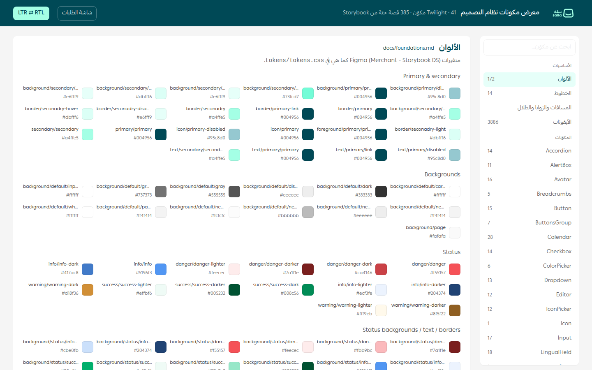
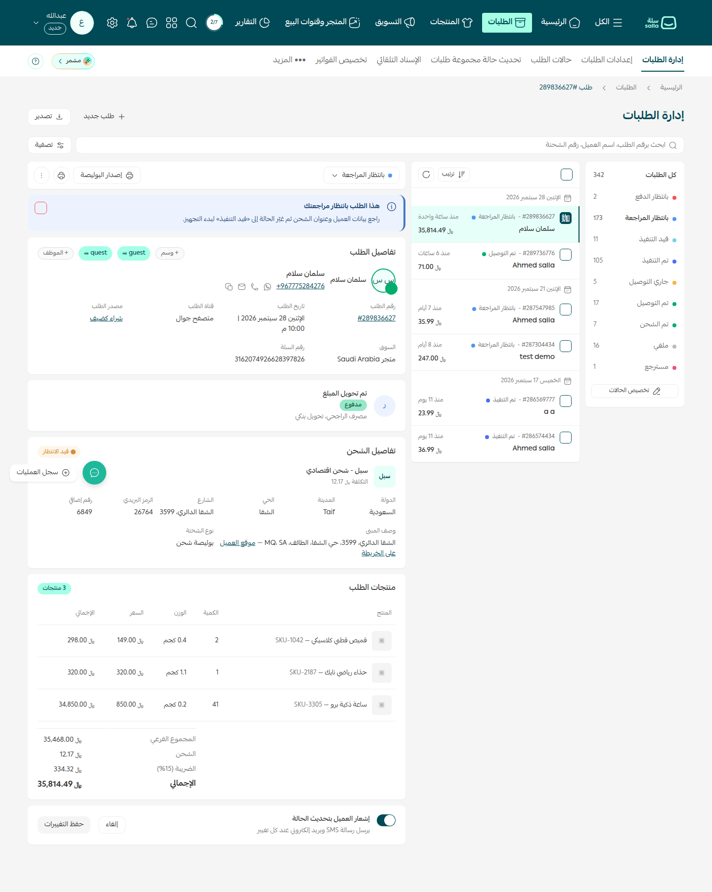

# Salla Design System

The merchant-dashboard design system of [Salla](https://salla.sa), moved out of Figma and Storybook
into a versioned repository: **design tokens**, **icons**, **illustrations**, a full **component
inventory** with variant properties, and **reference markup/specs** for the core components.

Sources of truth (this repo is a snapshot of them, dated 2026-09-28):

| Source | Where | What we took |
|---|---|---|
| Figma library **Merchant - Storybook DS** | file `zuGhoKg2BaBIYUreKuSBGY`, component page on branch `dnmyqzYKK9dUJjVHuIWMDS` (*Main Components (Full)*, node `27713:61`) | variables → tokens, component inventory, section screenshots, design-to-code specs |
| Figma library **Icons DS_V.1** | `figma/source/Icons_DS_V.1.fig` (uploaded export) | 3,886 icons × 2 styles as SVG |
| Storybook (Twilight web components) | offline build of <https://dashboard-ui-components.pages.dev/> (Storybook 8.6) in `storybook/static/` | 408 stories rendered → markup, screenshots, props tables, runtime tokens |

## Layout

```
tokens/        tokens.css / tokens.json (--salla-*, from Figma variables), tailwind.preset.cjs, twilight-runtime.css (runtime vars of the s-* components)
icons/         svg/outline/*.svg, svg/filled/*.svg, manifest.json, categories.json, flags.json, figma-icon-names.json
illustrations/ png/ renders of the 20 empty-state illustrations (+ node ids to re-export as SVG)
docs/          foundations.md, patterns.md, twilight-runtime-tokens.md, token-parity.md, component-map.md, components/ (Figma sections), storybook/ (Storybook components), specs/, images/
figma/         variables.json (merged Figma variables), components.json (inventory), snapshots/ (raw dumps), source/ (.fig)
demo/          components.html — live gallery of all components; index.html — full orders screen
fonts/         Ping AR + LT (OTF + WOFF2, 400/500/700/800) and pingarlt.css
figma/exports/ header/ — SVG exports of the Header component set (desktop + mobile), logo.svg
storybook/     static/ (offline Storybook build), captures/ (rendered markup + screenshots per story), components.json (props API)
scripts/       build_tokens.mjs, build_inventory.py, extract_storybook_tokens.mjs, capture_storybook.mjs, build_storybook_docs.py, fig-decode/
```

## Tokens

`figma/variables.json` is the merged output of the Figma variable definitions used across every
section of the component page (300 variables). `scripts/build_tokens.mjs` turns it into:

- `tokens/tokens.css` — `--salla-<path>` custom properties (colors, spacing, radius, typography, shadows).
- `tokens/tokens.json` — nested DTCG-style tokens (`$type`, `$value`, Figma name in `$extensions`).
- `tokens/tailwind.preset.cjs` — a Tailwind preset (`colors`, `spacing`, `borderRadius`, `fontSize`, `boxShadow`, `fontFamily`).

Key values: primary `#004956`, secondary (mint) `#a4ffe5`, danger `#f55157`, success `#00af6c`,
info `#5196f3`, warning `#ffaf44`, font **Ping AR + LT** (400/500/700), text sizes 10/12/14/16/18/20/24,
radius 2/4/8/9999, spacing 2–56 px. Full tables: [docs/foundations.md](docs/foundations.md). The typeface itself
ships in [`fonts/`](fonts/README.md) (`fonts/pingarlt.css`).

Note the Figma names are kept verbatim, typos included (`seconadry`, `Descreptive`), because the
reference code from Figma references them as CSS variables. Two collections overlap
(`spacing/*` vs `Spacing/Sizes/*`, `radius/*` vs `Radius/Sizes/*`); `radius/md` is `4` in most
sections and `8` in Loader/Status (recorded in `figma/snapshots/variables/conflicts.txt`).

```css
@import "salla-design-system/tokens/tokens.css";
.btn-primary { background: var(--salla-background-secondary-seconadry); color: var(--salla-text-primary-primary); border-radius: var(--salla-radius-xl); }
```

## Components

[docs/components/README.md](docs/components/README.md) indexes the 28 sections / 118 component sets /
~1,900 variants of the Figma page, each with its variant properties, node ids, Figma links and a
screenshot. Highlights:

| Section | Component sets | Notes |
|---|---|---|
| Button | 441 variants | Variant × Appearance (default/outlined/link/link-auxiliary) × State × Size (32/40/48) × Layout |
| Inputs | 27 sets | text, textarea (rich text), amount, email, password, phone, counter, dropdown single/multiple, search, upload… |
| Table | 41 sets | cells (Header, Name, Amount, Status, Actions, …), mobile rows, header/footer, bulk edit, edit sheet |
| Alertbox / Status / Toggle / Checkbox / Radio / Avatar / Breadcrumb / Steps / Side menu / More Menu / Drop Down List / Loader / Header | — | see the index |

[docs/specs/](docs/specs/README.md) holds the design-to-code reference (Tailwind-flavoured markup +
token table) returned by Figma for one representative variant of each core component.

## Demos

[demo/components.html](demo/components.html) is a live gallery of **every component**: the 385 captured
Storybook stories re-rendered with the production runtime, grouped per component with props tables, a
foundations section (colors, type, spacing, radius, shadows, icons), search and an RTL/LTR toggle.



[demo/index.html](demo/index.html) is a complete orders screen (app-shell header, secondary tabs, breadcrumb,
search bar, status rail, order list and detail panel) built from the real `s-*` runtime, the Figma tokens and
the icon set. Serve the repo root (`npx serve .`) and open `/demo/`. See [demo/README.md](demo/README.md).



## Design updates

Updated Figma exports are filed under `figma/exports/<component>/` and logged in
[docs/updates/](docs/updates/2026-09-28-component-updates.md) with design ↔ code notes; they appear as
reference cards in the component gallery and on the component pages.

## Screen layouts & UI patterns

[docs/patterns.md](docs/patterns.md) documents how the system is composed in the live merchant
dashboard (app shell, home widgets, list ↔ detail orders screen, product grid/table and editor,
coupon wizard with live summary, shipping landing sections, settings tables, KPI cards, radio-card
forms, empty states, promo modal), with frames from a walkthrough recording in `docs/images/patterns/`
and a cheat-sheet mapping each pattern to Storybook components and tokens.

## Icons

3,886 Hugeicons-Pro-based icons in two styles, `icons/svg/outline/<name>.svg` and
`icons/svg/filled/<name>.svg`, all 24×24 and `currentColor`. See [icons/README.md](icons/README.md)
for the manifest, the coverage check against the Figma DS names (3,853 / 4,010 matched) and licensing.

## Illustrations

20 empty-state illustrations (PNG renders + Figma node ids), see [illustrations/README.md](illustrations/README.md).

## Storybook (Twilight components)

`storybook/static/` is the complete static build of the public Storybook (Storybook 8.6,
`@storybook/html`, Stencil web components `s-*`). Open it offline with any static server:

```bash
npx serve storybook/static      # or: python3 -m http.server -d storybook/static 8080
```

Everything in it was also rendered headlessly and captured:

- `storybook/captures/stories/<component>/<story>.html` — the hydrated light-DOM markup of each of the 408 stories, and `.png` screenshots.
- `storybook/components.json` — per component: `s-*` tags used, props (name, control, options, default, description from the story `argTypes`), and stories with their args.
- [docs/storybook/](docs/storybook/README.md) — one page per component (38) with the props table and every story.
- [docs/component-map.md](docs/component-map.md) — how the Figma sections map to Storybook components and tags.
- `tokens/twilight-runtime.css` / `.json` and [docs/twilight-runtime-tokens.md](docs/twilight-runtime-tokens.md) — the runtime CSS custom properties (`--primary: 189 100% 17%` HSL triplets, light + dark) that the production components consume, pulled from the compiled `styles.css`.

Re-capture with `node scripts/capture_storybook.mjs storybook/static storybook/captures` (needs Playwright + Chromium)
followed by `python3 scripts/build_storybook_docs.py`.

## Regenerating

```bash
npm run build            # tokens + inventory docs
node scripts/build_tokens.mjs
python3 scripts/build_inventory.py
```

To refresh from Figma: re-run `get_variable_defs` per section (see `figma/snapshots/variables/`) and
`get_metadata` on node `27713:61` (see `figma/snapshots/main-components.xml`), then rebuild.

## License / ownership

All assets are Salla's. The icon set derives from Hugeicons Pro (commercial); keep the repository
private unless the license permits redistribution.
