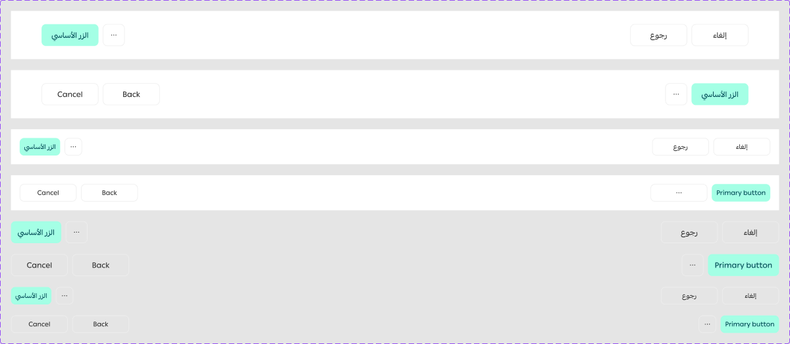

# Action Buttons

Figma node `24273:22005` · [open in Figma](https://www.figma.com/design/dnmyqzYKK9dUJjVHuIWMDS/?node-id=24273-22005)

## Action Buttons

Node `24273:22005` · 8 variants · [open](https://www.figma.com/design/dnmyqzYKK9dUJjVHuIWMDS/?node-id=24273-22005)

| Property | Values |
|---|---|
| `Type` | `Float`, `No Background` |
| `Langauge` | `Arabic`, `English` |
| `Mobile` | `Off`, `On` |

All variants

| Variant | Node | Size |
|---|---|---|
| Type=Float, Langauge=Arabic, Mobile=Off | `24751:36021` | 1404×88 |
| Type=Float, Langauge=English, Mobile=Off | `24751:36030` | 1404×88 |
| Type=Float, Langauge=Arabic, Mobile=On | `24751:36102` | 1404×64 |
| Type=Float, Langauge=English, Mobile=On | `24751:36093` | 1404×64 |
| Type=No Background, Langauge=Arabic, Mobile=Off | `24273:22012` | 1404×40 |
| Type=No Background, Langauge=English, Mobile=Off | `24313:19055` | 1404×40 |
| Type=No Background, Langauge=Arabic, Mobile=On | `24752:36227` | 1404×32 |
| Type=No Background, Langauge=English, Mobile=On | `24752:36236` | 1404×32 |

