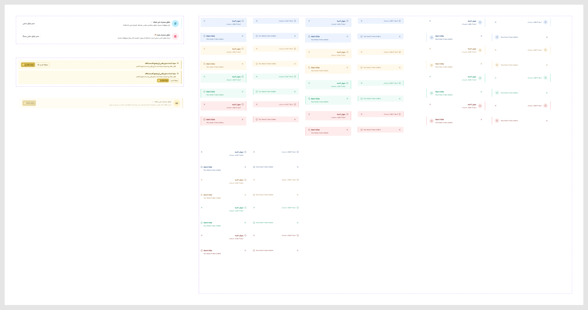
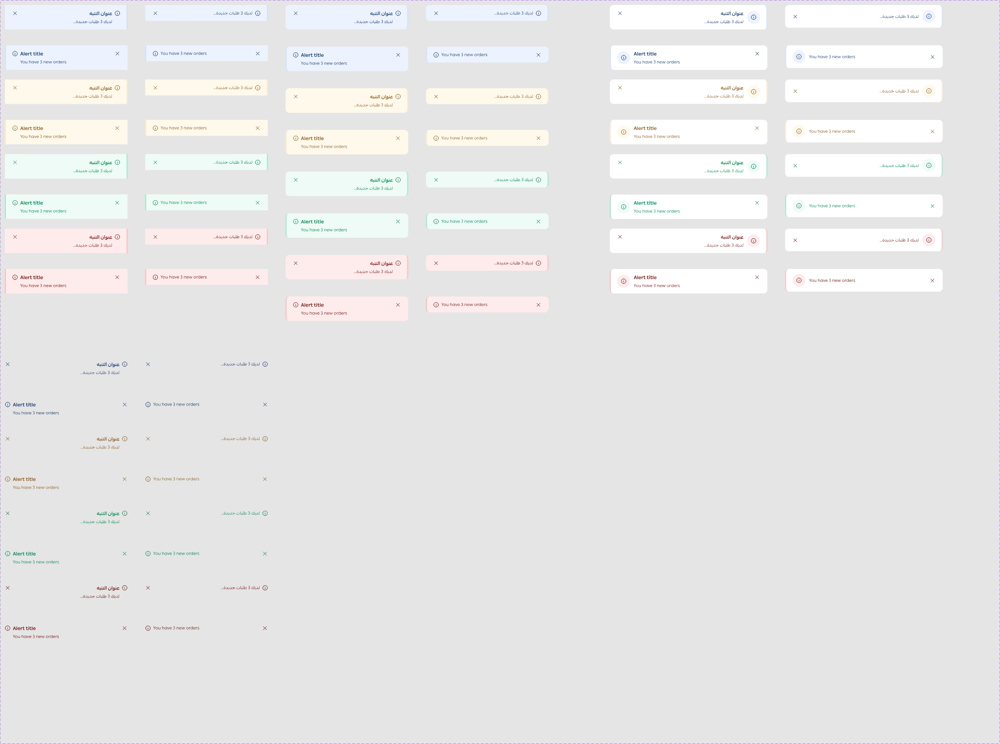

# Alertbox

Figma node `27737:13435` · [open in Figma](https://www.figma.com/design/dnmyqzYKK9dUJjVHuIWMDS/?node-id=27737-13435)

Design-to-code specs: [alertbox](../specs/alertbox.md)

### Figma exports (`figma/exports/alertbox/`, updated 2026-09-28)

**alertbox**

## Alertbox

Node `15375:52054` · 64 variants · [open](https://www.figma.com/design/dnmyqzYKK9dUJjVHuIWMDS/?node-id=15375-52054)

| Property | Values |
|---|---|
| `Language` | `Arabic`, `English` |
| `variant` | `--danger`, `--info`, `--success`, `--warning` |
| `Type` | `Default`, `Inline`, `white` |
| `Title` | `Off`, `On` |
| `Trasnparet` | `Off`, `On` |

All variants

| Variant | Node | Size |
|---|---|---|
| Language=Arabic, variant=--info, Type=Inline, Title=On, Trasnparet=Off | `15375:52053` | 400×80 |
| Language=Arabic, variant=--info, Type=Inline, Title=On, Trasnparet=On | `26812:8639` | 400×48 |
| Language=Arabic, variant=--info, Type=white, Title=On, Trasnparet=Off | `24958:6450` | 514×80 |
| Language=Arabic, variant=--info, Type=Inline, Title=Off, Trasnparet=Off | `19340:25076` | 400×52 |
| Language=Arabic, variant=--info, Type=Inline, Title=Off, Trasnparet=On | `26812:8651` | 400×20 |
| Language=Arabic, variant=--info, Type=white, Title=Off, Trasnparet=Off | `24958:6813` | 514×74 |
| Language=Arabic, variant=--info, Type=Default, Title=On, Trasnparet=Off | `18843:88056` | 400×80 |
| Language=Arabic, variant=--info, Type=Default, Title=Off, Trasnparet=Off | `19340:25382` | 400×52 |
| Language=English, variant=--info, Type=Inline, Title=On, Trasnparet=Off | `15376:60536` | 400×80 |
| Language=English, variant=--info, Type=Inline, Title=On, Trasnparet=On | `26812:8663` | 400×48 |
| Language=English, variant=--info, Type=white, Title=On, Trasnparet=Off | `24958:6462` | 514×80 |
| Language=English, variant=--info, Type=Inline, Title=Off, Trasnparet=Off | `19340:25088` | 400×52 |
| Language=English, variant=--info, Type=Inline, Title=Off, Trasnparet=On | `26812:8675` | 400×20 |
| Language=English, variant=--info, Type=white, Title=Off, Trasnparet=Off | `24958:6825` | 514×74 |
| Language=English, variant=--info, Type=Default, Title=On, Trasnparet=Off | `18843:88067` | 400×80 |
| Language=English, variant=--info, Type=Default, Title=Off, Trasnparet=Off | `19340:25392` | 400×52 |
| Language=Arabic, variant=--warning, Type=Inline, Title=On, Trasnparet=Off | `15375:52051` | 400×80 |
| Language=Arabic, variant=--warning, Type=Inline, Title=On, Trasnparet=On | `26812:8687` | 400×48 |
| Language=Arabic, variant=--warning, Type=white, Title=On, Trasnparet=Off | `24958:6474` | 514×80 |
| Language=Arabic, variant=--warning, Type=Inline, Title=Off, Trasnparet=Off | `19340:25100` | 400×52 |
| Language=Arabic, variant=--warning, Type=Inline, Title=Off, Trasnparet=On | `26812:8699` | 400×20 |
| Language=Arabic, variant=--warning, Type=white, Title=Off, Trasnparet=Off | `24958:6837` | 514×74 |
| Language=Arabic, variant=--warning, Type=Default, Title=On, Trasnparet=Off | `18843:88078` | 400×80 |
| Language=Arabic, variant=--warning, Type=Default, Title=Off, Trasnparet=Off | `19340:25402` | 400×52 |
| Language=English, variant=--warning, Type=Inline, Title=On, Trasnparet=Off | `15376:60545` | 400×80 |
| Language=English, variant=--warning, Type=Inline, Title=On, Trasnparet=On | `26812:8711` | 400×48 |
| Language=English, variant=--warning, Type=white, Title=On, Trasnparet=Off | `24958:6486` | 514×80 |
| Language=English, variant=--warning, Type=Inline, Title=Off, Trasnparet=Off | `19340:25112` | 400×52 |
| Language=English, variant=--warning, Type=Inline, Title=Off, Trasnparet=On | `26812:8723` | 400×20 |
| Language=English, variant=--warning, Type=white, Title=Off, Trasnparet=Off | `24958:6849` | 514×74 |
| Language=English, variant=--warning, Type=Default, Title=On, Trasnparet=Off | `18843:88089` | 400×80 |
| Language=English, variant=--warning, Type=Default, Title=Off, Trasnparet=Off | `19340:25412` | 400×52 |
| Language=Arabic, variant=--success, Type=Inline, Title=On, Trasnparet=Off | `18130:105119` | 400×80 |
| Language=Arabic, variant=--success, Type=Inline, Title=On, Trasnparet=On | `26812:8735` | 400×48 |
| Language=Arabic, variant=--success, Type=white, Title=On, Trasnparet=Off | `24958:6498` | 514×80 |
| Language=Arabic, variant=--success, Type=Inline, Title=Off, Trasnparet=Off | `19340:25124` | 400×52 |
| Language=Arabic, variant=--success, Type=Inline, Title=Off, Trasnparet=On | `26812:8747` | 400×20 |
| Language=Arabic, variant=--success, Type=white, Title=Off, Trasnparet=Off | `24958:6861` | 514×74 |
| Language=Arabic, variant=--success, Type=Default, Title=On, Trasnparet=Off | `18843:88100` | 400×80 |
| Language=Arabic, variant=--success, Type=Default, Title=Off, Trasnparet=Off | `19340:25422` | 400×52 |
| Language=English, variant=--success, Type=Inline, Title=On, Trasnparet=Off | `18130:105108` | 400×80 |
| Language=English, variant=--success, Type=Inline, Title=On, Trasnparet=On | `26812:8759` | 400×48 |
| Language=English, variant=--success, Type=white, Title=On, Trasnparet=Off | `24958:6510` | 514×80 |
| Language=English, variant=--success, Type=Inline, Title=Off, Trasnparet=Off | `19340:25136` | 400×52 |
| Language=English, variant=--success, Type=Inline, Title=Off, Trasnparet=On | `26812:8771` | 400×20 |
| Language=English, variant=--success, Type=white, Title=Off, Trasnparet=Off | `24958:6873` | 514×74 |
| Language=English, variant=--success, Type=Default, Title=On, Trasnparet=Off | `18843:88111` | 400×80 |
| Language=English, variant=--success, Type=Default, Title=Off, Trasnparet=Off | `19340:25432` | 400×52 |
| Language=Arabic, variant=--danger, Type=Inline, Title=On, Trasnparet=Off | `18130:105151` | 400×80 |
| Language=Arabic, variant=--danger, Type=Inline, Title=On, Trasnparet=On | `26812:8783` | 400×48 |
| Language=Arabic, variant=--danger, Type=white, Title=On, Trasnparet=Off | `24958:6522` | 514×80 |
| Language=Arabic, variant=--danger, Type=Inline, Title=Off, Trasnparet=Off | `19340:25148` | 400×52 |
| Language=Arabic, variant=--danger, Type=Inline, Title=Off, Trasnparet=On | `26812:8795` | 400×20 |
| Language=Arabic, variant=--danger, Type=white, Title=Off, Trasnparet=Off | `24958:6885` | 514×74 |
| Language=Arabic, variant=--danger, Type=Default, Title=On, Trasnparet=Off | `18843:88122` | 400×80 |
| Language=Arabic, variant=--danger, Type=Default, Title=Off, Trasnparet=Off | `19340:25442` | 400×52 |
| Language=English, variant=--danger, Type=Inline, Title=On, Trasnparet=Off | `18130:105162` | 400×80 |
| Language=English, variant=--danger, Type=Inline, Title=On, Trasnparet=On | `26812:8807` | 400×48 |
| Language=English, variant=--danger, Type=white, Title=On, Trasnparet=Off | `24958:6534` | 514×80 |
| Language=English, variant=--danger, Type=Inline, Title=Off, Trasnparet=Off | `19340:25160` | 400×52 |
| Language=English, variant=--danger, Type=Inline, Title=Off, Trasnparet=On | `26812:8819` | 400×20 |
| Language=English, variant=--danger, Type=white, Title=Off, Trasnparet=Off | `24958:6897` | 514×74 |
| Language=English, variant=--danger, Type=Default, Title=On, Trasnparet=Off | `18843:88133` | 400×80 |
| Language=English, variant=--danger, Type=Default, Title=Off, Trasnparet=Off | `19340:25452` | 400×52 |

## Alertbox_Banner

Node `25846:26798` · 2 variants · [open](https://www.figma.com/design/dnmyqzYKK9dUJjVHuIWMDS/?node-id=25846-26798)

| Property | Values |
|---|---|
| `Type` | `Type1`, `Type2` |

All variants

| Variant | Node | Size |
|---|---|---|
| Type=Type1 | `25846:26795` | 1427×92 |
| Type=Type2 | `25846:26796` | 1427×92 |

## Alertbox_Upgrade

Node `25860:20079` · 2 variants · [open](https://www.figma.com/design/dnmyqzYKK9dUJjVHuIWMDS/?node-id=25860-20079)

| Property | Values |
|---|---|
| `Device` | `Desktop`, `Mobile` |

All variants

| Variant | Node | Size |
|---|---|---|
| Device=Desktop | `25860:20080` | 1427×80 |
| Device=Mobile | `25860:20093` | 1427×120 |

