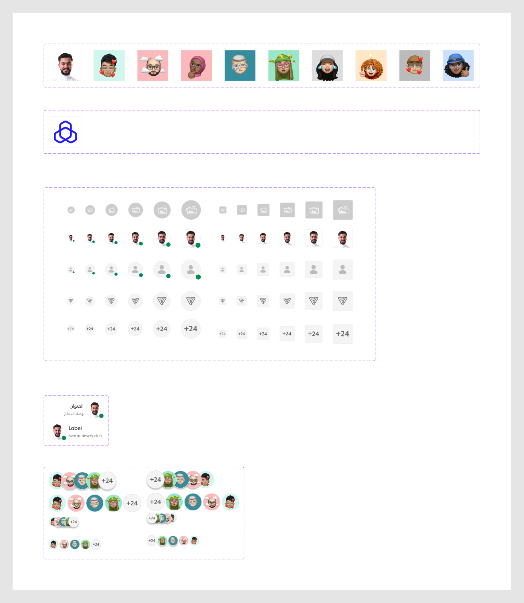

# Avatar

Figma node `27737:13082` · [open in Figma](https://www.figma.com/design/dnmyqzYKK9dUJjVHuIWMDS/?node-id=27737-13082)

Design-to-code specs: [avatar](../specs/avatar.md)

## Avatar

Node `15368:1123` · 60 variants · [open](https://www.figma.com/design/dnmyqzYKK9dUJjVHuIWMDS/?node-id=15368-1123)

| Property | Values |
|---|---|
| `Variant` | `--avatar`, `--avatar-fallback`, `--icon`, `--image-fallback`, `--text` |
| `Size` | `2xl`, `lg`, `md`, `sm`, `xl`, `xs` |
| `radius` | `--circular`, `--rectangular` |

All variants

| Variant | Node | Size |
|---|---|---|
| Variant=--avatar, Size=xs, radius=--circular | `15368:1124` | 24×24 |
| Variant=--image-fallback, Size=xs, radius=--circular | `16188:112224` | 24×24 |
| Variant=--avatar, Size=xs, radius=--rectangular | `15372:5409` | 24×24 |
| Variant=--image-fallback, Size=xs, radius=--rectangular | `16188:112227` | 24×24 |
| Variant=--avatar, Size=sm, radius=--circular | `15368:1127` | 32×32 |
| Variant=--image-fallback, Size=sm, radius=--circular | `16188:112229` | 32×32 |
| Variant=--avatar, Size=sm, radius=--rectangular | `15372:5412` | 32×32 |
| Variant=--image-fallback, Size=sm, radius=--rectangular | `16188:112232` | 32×32 |
| Variant=--avatar, Size=md, radius=--circular | `15368:1130` | 40×40 |
| Variant=--image-fallback, Size=md, radius=--circular | `16188:112234` | 40×40 |
| Variant=--avatar, Size=md, radius=--rectangular | `15372:5415` | 40×40 |
| Variant=--image-fallback, Size=md, radius=--rectangular | `16188:112237` | 40×40 |
| Variant=--avatar, Size=lg, radius=--circular | `15368:1133` | 48×48 |
| Variant=--image-fallback, Size=lg, radius=--circular | `16188:112239` | 48×48 |
| Variant=--avatar, Size=lg, radius=--rectangular | `15372:5418` | 48×48 |
| Variant=--image-fallback, Size=lg, radius=--rectangular | `16188:112242` | 48×48 |
| Variant=--avatar, Size=xl, radius=--circular | `15368:1136` | 56×56 |
| Variant=--image-fallback, Size=xl, radius=--circular | `16188:112244` | 56×56 |
| Variant=--avatar, Size=xl, radius=--rectangular | `15372:5421` | 56×56 |
| Variant=--image-fallback, Size=xl, radius=--rectangular | `16188:112247` | 56×56 |
| Variant=--avatar, Size=2xl, radius=--circular | `15368:1139` | 64×64 |
| Variant=--image-fallback, Size=2xl, radius=--circular | `16188:112249` | 64×64 |
| Variant=--avatar, Size=2xl, radius=--rectangular | `15372:5424` | 64×64 |
| Variant=--image-fallback, Size=2xl, radius=--rectangular | `16188:112252` | 64×64 |
| Variant=--avatar-fallback, Size=xs, radius=--circular | `15368:1142` | 24×24 |
| Variant=--avatar-fallback, Size=xs, radius=--rectangular | `15372:5427` | 24×24 |
| Variant=--icon, Size=xs, radius=--circular | `15370:1772` | 24×24 |
| Variant=--text, Size=xs, radius=--circular | `15374:393` | 24×24 |
| Variant=--text, Size=xs, radius=--rectangular | `15374:596` | 24×24 |
| Variant=--icon, Size=xs, radius=--rectangular | `15372:5430` | 24×24 |
| Variant=--avatar-fallback, Size=sm, radius=--circular | `15368:1145` | 32×32 |
| Variant=--avatar-fallback, Size=sm, radius=--rectangular | `15372:5433` | 32×32 |
| Variant=--icon, Size=sm, radius=--circular | `15370:1775` | 32×32 |
| Variant=--text, Size=sm, radius=--circular | `15374:398` | 32×32 |
| Variant=--text, Size=sm, radius=--rectangular | `15374:599` | 32×32 |
| Variant=--icon, Size=sm, radius=--rectangular | `15372:5436` | 32×32 |
| Variant=--avatar-fallback, Size=md, radius=--circular | `15368:1148` | 40×40 |
| Variant=--avatar-fallback, Size=md, radius=--rectangular | `15372:5439` | 40×40 |
| Variant=--icon, Size=md, radius=--circular | `15370:1778` | 40×40 |
| Variant=--text, Size=md, radius=--circular | `15374:403` | 40×40 |
| Variant=--text, Size=md, radius=--rectangular | `15374:602` | 40×40 |
| Variant=--icon, Size=md, radius=--rectangular | `15372:5442` | 40×40 |
| Variant=--avatar-fallback, Size=lg, radius=--circular | `15368:1151` | 48×48 |
| Variant=--avatar-fallback, Size=lg, radius=--rectangular | `15372:5445` | 48×48 |
| Variant=--icon, Size=lg, radius=--circular | `15370:1781` | 48×48 |
| Variant=--text, Size=lg, radius=--circular | `15374:408` | 48×48 |
| Variant=--text, Size=lg, radius=--rectangular | `15374:605` | 48×48 |
| Variant=--icon, Size=lg, radius=--rectangular | `15372:5448` | 48×48 |
| Variant=--avatar-fallback, Size=xl, radius=--circular | `15368:1154` | 56×56 |
| Variant=--avatar-fallback, Size=xl, radius=--rectangular | `15372:5451` | 56×56 |
| Variant=--icon, Size=xl, radius=--circular | `15370:1784` | 56×56 |
| Variant=--text, Size=xl, radius=--circular | `15374:413` | 56×56 |
| Variant=--text, Size=xl, radius=--rectangular | `15374:608` | 56×56 |
| Variant=--icon, Size=xl, radius=--rectangular | `15372:5454` | 56×56 |
| Variant=--avatar-fallback, Size=2xl, radius=--circular | `15368:1157` | 64×64 |
| Variant=--avatar-fallback, Size=2xl, radius=--rectangular | `15372:5457` | 64×64 |
| Variant=--icon, Size=2xl, radius=--circular | `15370:1787` | 64×64 |
| Variant=--text, Size=2xl, radius=--circular | `15374:418` | 64×64 |
| Variant=--text, Size=2xl, radius=--rectangular | `15374:612` | 64×64 |
| Variant=--icon, Size=2xl, radius=--rectangular | `15372:5460` | 64×64 |

## _AvatarplaholderImages *(internal, underscore-prefixed)*

Node `12497:12230` · 10 variants · [open](https://www.figma.com/design/dnmyqzYKK9dUJjVHuIWMDS/?node-id=12497-12230)

| Property | Values |
|---|---|
| `Image` | `1`, `2`, `3`, `4`, `5`, `6`, `7`, `8`, `9`, `arabic-male` |

All variants

| Variant | Node | Size |
|---|---|---|
| Image=arabic-male | `15370:1592` | 100×100 |
| Image=1 | `12497:12229` | 100×100 |
| Image=2 | `12497:12228` | 100×100 |
| Image=3 | `12497:12227` | 100×100 |
| Image=4 | `12497:12226` | 100×100 |
| Image=5 | `12497:12225` | 100×100 |
| Image=6 | `12497:12224` | 100×100 |
| Image=7 | `12497:12223` | 100×100 |
| Image=8 | `12497:12221` | 100×100 |
| Image=9 | `12497:12222` | 100×100 |

## _BanksPlaceholderImages *(internal, underscore-prefixed)*

Node `16188:112131` · 1 variants · [open](https://www.figma.com/design/dnmyqzYKK9dUJjVHuIWMDS/?node-id=16188-112131)

| Property | Values |
|---|---|
| `Image` | `Alarjhi` |

All variants

| Variant | Node | Size |
|---|---|---|
| Image=Alarjhi | `16188:112132` | 100×100 |

## AvatarWithText

Node `15374:278` · 2 variants · [open](https://www.figma.com/design/dnmyqzYKK9dUJjVHuIWMDS/?node-id=15374-278)

| Property | Values |
|---|---|
| `Language` | `Arabic`, `English` |

All variants

| Variant | Node | Size |
|---|---|---|
| Language=English | `15374:267` | 176×56 |
| Language=Arabic | `15374:311` | 176×56 |

## AvatarStack

Node `15374:459` · 8 variants · [open](https://www.figma.com/design/dnmyqzYKK9dUJjVHuIWMDS/?node-id=15374-459)

| Property | Values |
|---|---|
| `--overlapping` | `false`, `true` |
| `size` | `compact`, `default` |
| `Language` | `Arabic`, `English` |

All variants

| Variant | Node | Size |
|---|---|---|
| --overlapping=true, size=default, Language=English | `15374:458` | 216×56 |
| --overlapping=true, size=default, Language=Arabic | `15680:32886` | 216×56 |
| --overlapping=true, size=compact, Language=Arabic | `15680:33012` | 96×32 |
| --overlapping=true, size=compact, Language=English | `15680:32380` | 96×32 |
| --overlapping=false, size=default, Language=English | `15374:460` | 296×56 |
| --overlapping=false, size=default, Language=Arabic | `15680:32898` | 296×56 |
| --overlapping=false, size=compact, Language=Arabic | `15680:33018` | 168×32 |
| --overlapping=false, size=compact, Language=English | `15680:32386` | 168×32 |

