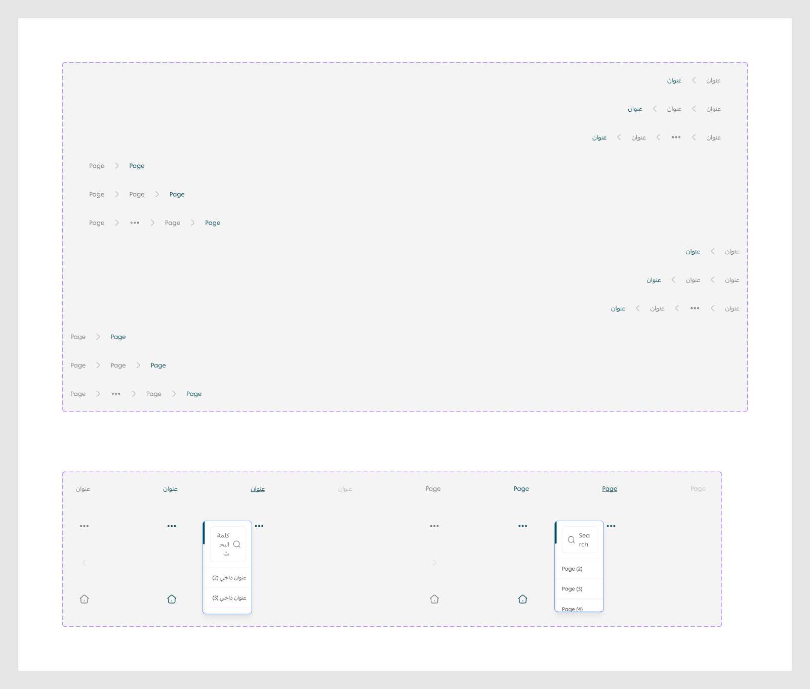

# Bread crumb

Figma node `27716:13116` · [open in Figma](https://www.figma.com/design/dnmyqzYKK9dUJjVHuIWMDS/?node-id=27716-13116)

Design-to-code specs: [breadcrumb](../specs/breadcrumb.md)

## _breadcrumbItem *(internal, underscore-prefixed)*

Node `15392:5075` · 20 variants · [open](https://www.figma.com/design/dnmyqzYKK9dUJjVHuIWMDS/?node-id=15392-5075)

| Property | Values |
|---|---|
| `Language` | `Arabic`, `English` |
| `Status` | `--active`, `--default`, `--disabled`, `--hover`, `--onclick` |
| `Type` | `Icon`, `More`, `Separator`, `Text` |

All variants

| Variant | Node | Size |
|---|---|---|
| Language=Arabic, Status=--default, Type=Text | `15392:5076` | 40×28 |
| Language=English, Status=--default, Type=Text | `15394:94839` | 42×28 |
| Language=Arabic, Status=--active, Type=Text | `15392:5078` | 40×28 |
| Language=English, Status=--active, Type=Text | `15394:94841` | 42×28 |
| Language=Arabic, Status=--hover, Type=Text | `15392:75898` | 40×28 |
| Language=Arabic, Status=--disabled, Type=Text | `15394:94915` | 40×28 |
| Language=English, Status=--disabled, Type=Text | `15394:94928` | 42×28 |
| Language=English, Status=--hover, Type=Text | `15394:94843` | 42×28 |
| Language=Arabic, Status=--default, Type=More | `15392:5080` | 32×32 |
| Language=English, Status=--default, Type=More | `15394:94845` | 32×32 |
| Language=Arabic, Status=--hover, Type=More | `15392:76136` | 32×32 |
| Language=English, Status=--hover, Type=More | `15394:94847` | 32×32 |
| Language=Arabic, Status=--onclick, Type=More | `15394:92733` | 32×32 |
| Language=English, Status=--onclick, Type=More | `15394:94849` | 32×32 |
| Language=Arabic, Status=--default, Type=Separator | `15392:75942` | 32×32 |
| Language=English, Status=--default, Type=Separator | `15394:94852` | 32×32 |
| Language=Arabic, Status=--default, Type=Icon | `15392:5084` | 32×32 |
| Language=English, Status=--default, Type=Icon | `15394:94856` | 32×32 |
| Language=Arabic, Status=--hover, Type=Icon | `15392:76140` | 32×32 |
| Language=English, Status=--hover, Type=Icon | `15394:94858` | 32×32 |

## Breadcrumb

Node `15392:76151` · 12 variants · [open](https://www.figma.com/design/dnmyqzYKK9dUJjVHuIWMDS/?node-id=15392-76151)

| Property | Values |
|---|---|
| `Language` | `Arabic`, `English` |
| `count` | `2`, `3`, `>5` |
| `device` | `Desktop`, `Mobile` |

All variants

| Variant | Node | Size |
|---|---|---|
| Language=Arabic, count=2, device=Desktop | `15392:76150` | 1536×48 |
| Language=Arabic, count=3, device=Desktop | `15392:76152` | 1536×48 |
| Language=Arabic, count=>5, device=Desktop | `15392:76237` | 1536×48 |
| Language=English, count=2, device=Desktop | `15394:94535` | 1536×48 |
| Language=English, count=3, device=Desktop | `15394:94540` | 1536×48 |
| Language=English, count=>5, device=Desktop | `15394:94567` | 1536×48 |
| Language=Arabic, count=2, device=Mobile | `19020:7560` | 1536×48 |
| Language=Arabic, count=3, device=Mobile | `19020:7565` | 1536×48 |
| Language=Arabic, count=>5, device=Mobile | `19020:7572` | 1536×48 |
| Language=English, count=2, device=Mobile | `19020:7581` | 1536×48 |
| Language=English, count=3, device=Mobile | `19020:7586` | 1536×48 |
| Language=English, count=>5, device=Mobile | `19020:7593` | 1536×48 |

