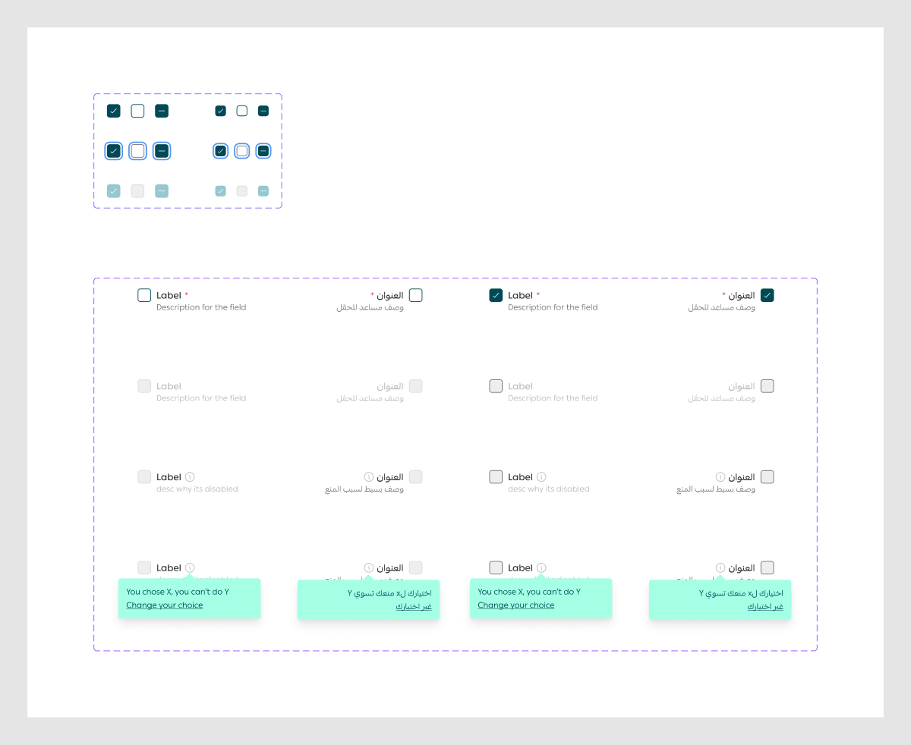

# check Box

Figma node `27716:13114` · [open in Figma](https://www.figma.com/design/dnmyqzYKK9dUJjVHuIWMDS/?node-id=27716-13114)

## checkBox

Node `12411:21809` · 18 variants · [open](https://www.figma.com/design/dnmyqzYKK9dUJjVHuIWMDS/?node-id=12411-21809)

| Property | Values |
|---|---|
| `--selected` | `false`, `mix`, `true` |
| `Status` | `--default`, `--disabled`, `--focus` |
| `size` | `md-20px`, `sm-16px` |

All variants

| Variant | Node | Size |
|---|---|---|
| --selected=true, Status=--default, size=md-20px | `12411:21810` | 20×20 |
| --selected=true, Status=--disabled, size=md-20px | `21800:23386` | 20×20 |
| --selected=mix, Status=--default, size=md-20px | `21800:23374` | 20×20 |
| --selected=true, Status=--default, size=sm-16px | `15345:79076` | 16×16 |
| --selected=mix, Status=--default, size=sm-16px | `21800:64913` | 16×16 |
| --selected=false, Status=--default, size=md-20px | `12411:21812` | 20×20 |
| --selected=false, Status=--default, size=sm-16px | `15345:79078` | 16×16 |
| --selected=true, Status=--focus, size=md-20px | `12448:11593` | 20×20 |
| --selected=mix, Status=--focus, size=md-20px | `21800:23376` | 20×20 |
| --selected=true, Status=--focus, size=sm-16px | `15345:79079` | 16×16 |
| --selected=mix, Status=--focus, size=sm-16px | `21800:64915` | 16×16 |
| --selected=false, Status=--focus, size=md-20px | `12448:11595` | 20×20 |
| --selected=false, Status=--focus, size=sm-16px | `15345:79081` | 16×16 |
| --selected=mix, Status=--disabled, size=md-20px | `21800:23378` | 20×20 |
| --selected=true, Status=--disabled, size=sm-16px | `15345:79082` | 16×16 |
| --selected=mix, Status=--disabled, size=sm-16px | `21800:64917` | 16×16 |
| --selected=false, Status=--disabled, size=md-20px | `12448:11526` | 20×20 |
| --selected=false, Status=--disabled, size=sm-16px | `15345:79084` | 16×16 |

## checkboxfield

Node `15146:146088` · 16 variants · [open](https://www.figma.com/design/dnmyqzYKK9dUJjVHuIWMDS/?node-id=15146-146088)

| Property | Values |
|---|---|
| `Language` | `Arabic`, `English` |
| `--disabled` | `--default`, `--disabled`, `--disabled-info`, `--disabled-info-tooltip` |
| `--selected` | `False`, `True` |

All variants

| Variant | Node | Size |
|---|---|---|
| Language=English, --disabled=--default, --selected=False | `15146:130481` | 163×36 |
| Language=English, --disabled=--default, --selected=True | `15333:171616` | 163×36 |
| Language=Arabic, --disabled=--default, --selected=False | `15146:146180` | 163×36 |
| Language=Arabic, --disabled=--default, --selected=True | `15333:171626` | 163×36 |
| Language=English, --disabled=--disabled, --selected=False | `15146:146089` | 163×36 |
| Language=English, --disabled=--disabled, --selected=True | `15333:171636` | 163×36 |
| Language=English, --disabled=--disabled-info, --selected=False | `15333:163065` | 163×36 |
| Language=English, --disabled=--disabled-info, --selected=True | `15333:171644` | 163×36 |
| Language=English, --disabled=--disabled-info-tooltip, --selected=False | `15333:171460` | 163×36 |
| Language=English, --disabled=--disabled-info-tooltip, --selected=True | `15333:171654` | 163×36 |
| Language=Arabic, --disabled=--disabled, --selected=False | `15146:146190` | 163×36 |
| Language=Arabic, --disabled=--disabled, --selected=True | `15333:171665` | 163×36 |
| Language=Arabic, --disabled=--disabled-info, --selected=False | `15333:163073` | 163×36 |
| Language=Arabic, --disabled=--disabled-info, --selected=True | `15333:171673` | 163×36 |
| Language=Arabic, --disabled=--disabled-info-tooltip, --selected=False | `15333:171470` | 163×36 |
| Language=Arabic, --disabled=--disabled-info-tooltip, --selected=True | `15333:171683` | 163×36 |

