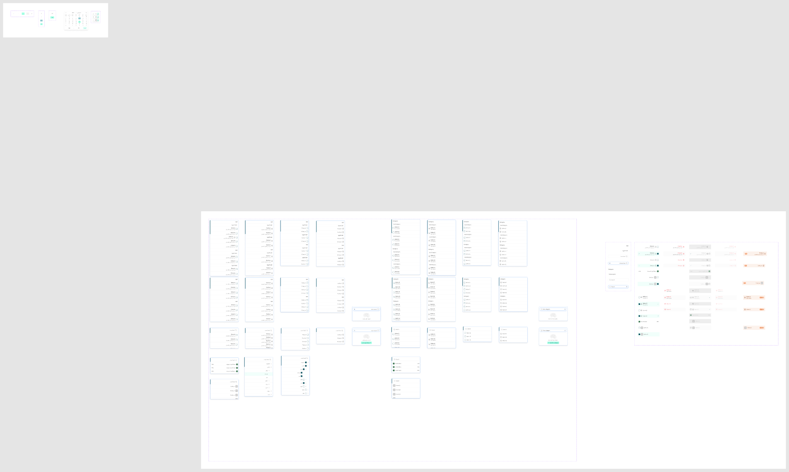

# Drop Down List

Figma node `27743:15948` · [open in Figma](https://www.figma.com/design/dnmyqzYKK9dUJjVHuIWMDS/?node-id=27743-15948)

## Drop Down List

Node `14952:281457` · 34 variants · [open](https://www.figma.com/design/dnmyqzYKK9dUJjVHuIWMDS/?node-id=14952-281457)

| Property | Values |
|---|---|
| `Language` | `Arabic`, `English` |
| `Variant` | `Accordion`, `No Results`, `No Results with add`, `One Layer`, `One Layer - Flag`, `One Layer - Image`, `Three layers`, `Two Layers` |
| `Checkbox` | `False`, `True` |
| `Icon` | `False`, `True` |
| `Description` | `False`, `True` |

All variants

| Variant | Node | Size |
|---|---|---|
| Language=Arabic, Variant=Three layers, Checkbox=True, Icon=False, Description=True | `14952:281456` | 375×735 |
| Language=English, Variant=Three layers, Checkbox=True, Icon=False, Description=True | `15119:297669` | 375×727 |
| Language=Arabic, Variant=Two Layers, Checkbox=True, Icon=False, Description=True | `14952:282353` | 375×580 |
| Language=English, Variant=Two Layers, Checkbox=True, Icon=False, Description=True | `15119:299883` | 375×579 |
| Language=English, Variant=Two Layers, Checkbox=False, Icon=True, Description=True | `15119:300239` | 375×579 |
| Language=Arabic, Variant=One Layer, Checkbox=True, Icon=False, Description=True | `14952:283021` | 375×270 |
| Language=English, Variant=One Layer, Checkbox=True, Icon=False, Description=True | `15119:297724` | 375×270 |
| Language=English, Variant=One Layer, Checkbox=True, Icon=False, Description=False | `15119:301062` | 375×205 |
| Language=Arabic, Variant=One Layer, Checkbox=True, Icon=False, Description=False | `14952:283425` | 375×291 |
| Language=Arabic, Variant=Three layers, Checkbox=True, Icon=False, Description=False | `14952:281670` | 375×599 |
| Language=English, Variant=Three layers, Checkbox=True, Icon=False, Description=False | `15119:299123` | 375×599 |
| Language=Arabic, Variant=Two Layers, Checkbox=True, Icon=False, Description=False | `14952:282385` | 375×452 |
| Language=English, Variant=Two Layers, Checkbox=True, Icon=False, Description=False | `15119:300349` | 375×451 |
| Language=Arabic, Variant=Three layers, Checkbox=False, Icon=True, Description=True | `14952:281454` | 375×727 |
| Language=English, Variant=Three layers, Checkbox=False, Icon=True, Description=True | `15119:298992` | 375×727 |
| Language=Arabic, Variant=Two Layers, Checkbox=False, Icon=True, Description=True | `14952:282417` | 375×579 |
| Language=Arabic, Variant=One Layer, Checkbox=False, Icon=True, Description=True | `14952:283069` | 375×270 |
| Language=English, Variant=One Layer, Checkbox=False, Icon=True, Description=True | `15119:300873` | 375×270 |
| Language=English, Variant=One Layer, Checkbox=False, Icon=True, Description=False | `15119:301076` | 375×205 |
| Language=Arabic, Variant=One Layer, Checkbox=False, Icon=True, Description=False | `14952:283439` | 375×210 |
| Language=Arabic, Variant=No Results with add, Checkbox=False, Icon=False, Description=False | `19543:7695` | 375×227 |
| Language=English, Variant=No Results with add, Checkbox=False, Icon=False, Description=False | `19554:16742` | 375×227 |
| Language=Arabic, Variant=No Results, Checkbox=False, Icon=False, Description=False | `19554:15808` | 375×185 |
| Language=English, Variant=No Results, Checkbox=False, Icon=False, Description=False | `19554:16750` | 375×185 |
| Language=Arabic, Variant=One Layer - Flag, Checkbox=False, Icon=True, Description=False | `14965:13249` | 375×210 |
| Language=English, Variant=One Layer - Flag, Checkbox=False, Icon=True, Description=False | `15119:297886` | 375×210 |
| Language=Arabic, Variant=One Layer - Image, Checkbox=False, Icon=True, Description=False | `14965:13681` | 375×261 |
| Language=English, Variant=One Layer - Image, Checkbox=False, Icon=True, Description=False | `15119:297899` | 375×261 |
| Language=Arabic, Variant=Three layers, Checkbox=False, Icon=True, Description=False | `14952:281906` | 375×599 |
| Language=English, Variant=Three layers, Checkbox=False, Icon=True, Description=False | `15119:299302` | 375×599 |
| Language=Arabic, Variant=Two Layers, Checkbox=False, Icon=True, Description=False | `14952:282449` | 375×451 |
| Language=English, Variant=Two Layers, Checkbox=False, Icon=True, Description=False | `15119:300619` | 375×451 |
| Language=Arabic, Variant=Accordion, Checkbox=True, Icon=False, Description=False | `22985:57304` | 375×516 |
| Language=Arabic, Variant=Accordion, Checkbox=False, Icon=False, Description=False | `22998:66671` | 375×516 |

## _listItem *(internal, underscore-prefixed)*

Node `14952:22457` · 50 variants · [open](https://www.figma.com/design/dnmyqzYKK9dUJjVHuIWMDS/?node-id=14952-22457)

| Property | Values |
|---|---|
| `Language` | `Arabic`, `English` |
| `Variant` | `--item`, `--item-description`, `--item-flag`, `--item-image` |
| `--danger` | `False`, `True` |
| `--selected` | `False`, `True` |
| `--disabled` | `false`, `true` |
| `--feature` | `false`, `true` |

All variants

| Variant | Node | Size |
|---|---|---|
| Language=Arabic, Variant=--item-description, --danger=False, --selected=False, --disabled=false, --feature=false | `14952:22458` | 286×60 |
| Language=Arabic, Variant=--item-description, --danger=False, --selected=False, --disabled=true, --feature=false | `15046:30755` | 286×60 |
| Language=Arabic, Variant=--item-description, --danger=True, --selected=False, --disabled=false, --feature=false | `14967:14483` | 286×60 |
| Language=Arabic, Variant=--item-description, --danger=True, --selected=False, --disabled=true, --feature=false | `15046:30764` | 286×60 |
| Language=Arabic, Variant=--item-description, --danger=False, --selected=True, --disabled=false, --feature=false | `14952:22461` | 286×60 |
| Language=Arabic, Variant=--item-description, --danger=False, --selected=True, --disabled=false, --feature=true | `17913:15161` | 309×60 |
| Language=Arabic, Variant=--item-description, --danger=False, --selected=True, --disabled=true, --feature=false | `15046:30772` | 286×60 |
| Language=Arabic, Variant=--item-description, --danger=True, --selected=True, --disabled=false, --feature=false | `14967:14489` | 286×60 |
| Language=Arabic, Variant=--item-description, --danger=True, --selected=True, --disabled=true, --feature=false | `15046:30783` | 286×60 |
| Language=Arabic, Variant=--item, --danger=False, --selected=False, --disabled=false, --feature=false | `14952:22470` | 286×44 |
| Language=Arabic, Variant=--item, --danger=False, --selected=False, --disabled=true, --feature=false | `15046:30791` | 286×44 |
| Language=Arabic, Variant=--item, --danger=True, --selected=False, --disabled=false, --feature=false | `14967:14497` | 286×44 |
| Language=Arabic, Variant=--item, --danger=True, --selected=False, --disabled=true, --feature=false | `15046:30797` | 286×44 |
| Language=Arabic, Variant=--item, --danger=False, --selected=True, --disabled=false, --feature=false | `14952:22473` | 286×44 |
| Language=Arabic, Variant=--item, --danger=False, --selected=True, --disabled=false, --feature=true | `17913:15172` | 286×44 |
| Language=Arabic, Variant=--item, --danger=False, --selected=True, --disabled=true, --feature=false | `15046:30802` | 286×44 |
| Language=Arabic, Variant=--item, --danger=True, --selected=True, --disabled=false, --feature=false | `14967:14501` | 286×44 |
| Language=Arabic, Variant=--item, --danger=True, --selected=True, --disabled=true, --feature=false | `15046:30810` | 286×44 |
| Language=Arabic, Variant=--item-flag, --danger=False, --selected=False, --disabled=false, --feature=false | `14952:22568` | 286×44 |
| Language=Arabic, Variant=--item-flag, --danger=False, --selected=False, --disabled=true, --feature=false | `15046:30815` | 286×44 |
| Language=Arabic, Variant=--item-image, --danger=False, --selected=False, --disabled=false, --feature=false | `14952:283525` | 286×56 |
| Language=Arabic, Variant=--item-image, --danger=False, --selected=False, --disabled=true, --feature=false | `15046:30821` | 286×56 |
| Language=Arabic, Variant=--item-image, --danger=False, --selected=True, --disabled=false, --feature=false | `14965:13024` | 286×56 |
| Language=Arabic, Variant=--item-image, --danger=False, --selected=True, --disabled=false, --feature=true | `17914:42593` | 286×56 |
| Language=Arabic, Variant=--item-image, --danger=False, --selected=True, --disabled=true, --feature=false | `15046:30826` | 286×56 |
| Language=English, Variant=--item-description, --danger=False, --selected=False, --disabled=false, --feature=false | `14963:11826` | 286×60 |
| Language=English, Variant=--item-description, --danger=False, --selected=False, --disabled=true, --feature=false | `15046:30831` | 286×60 |
| Language=English, Variant=--item-description, --danger=True, --selected=False, --disabled=false, --feature=false | `14967:14526` | 286×60 |
| Language=English, Variant=--item-description, --danger=True, --selected=False, --disabled=true, --feature=false | `15046:30840` | 286×60 |
| Language=English, Variant=--item-description, --danger=False, --selected=True, --disabled=false, --feature=false | `14963:11832` | 286×60 |
| Language=English, Variant=--item-description, --danger=False, --selected=True, --disabled=false, --feature=true | `17913:15180` | 286×60 |
| Language=English, Variant=--item-description, --danger=False, --selected=True, --disabled=true, --feature=false | `15046:30848` | 286×60 |
| Language=English, Variant=--item-description, --danger=True, --selected=True, --disabled=false, --feature=false | `14967:14532` | 286×60 |
| Language=English, Variant=--item-description, --danger=True, --selected=True, --disabled=true, --feature=false | `15046:30859` | 286×60 |
| Language=English, Variant=--item, --danger=False, --selected=False, --disabled=false, --feature=false | `14963:11840` | 286×44 |
| Language=English, Variant=--item, --danger=False, --selected=False, --disabled=true, --feature=false | `15046:30867` | 286×44 |
| Language=English, Variant=--item, --danger=True, --selected=False, --disabled=false, --feature=false | `14967:14540` | 286×44 |
| Language=English, Variant=--item, --danger=True, --selected=False, --disabled=true, --feature=false | `15046:30873` | 286×44 |
| Language=English, Variant=--item, --danger=False, --selected=True, --disabled=false, --feature=false | `14963:11844` | 286×44 |
| Language=English, Variant=--item, --danger=False, --selected=True, --disabled=false, --feature=true | `17913:15191` | 286×44 |
| Language=English, Variant=--item, --danger=False, --selected=True, --disabled=true, --feature=false | `15046:30878` | 286×44 |
| Language=English, Variant=--item, --danger=True, --selected=True, --disabled=false, --feature=false | `14967:14544` | 286×44 |
| Language=English, Variant=--item, --danger=True, --selected=True, --disabled=true, --feature=false | `15046:30886` | 286×44 |
| Language=English, Variant=--item-image, --danger=False, --selected=False, --disabled=false, --feature=false | `14963:11854` | 286×56 |
| Language=English, Variant=--item-image, --danger=False, --selected=False, --disabled=true, --feature=false | `15046:30891` | 286×56 |
| Language=English, Variant=--item-image, --danger=False, --selected=True, --disabled=false, --feature=false | `14965:13032` | 286×56 |
| Language=English, Variant=--item-image, --danger=False, --selected=True, --disabled=false, --feature=true | `17913:15199` | 286×56 |
| Language=English, Variant=--item-image, --danger=False, --selected=True, --disabled=true, --feature=false | `15046:30896` | 286×56 |
| Language=English, Variant=--item-flag, --danger=False, --selected=False, --disabled=false, --feature=false | `14952:280017` | 286×44 |
| Language=English, Variant=--item-flag, --danger=False, --selected=False, --disabled=true, --feature=false | `15046:30901` | 286×44 |

## _listTitle *(internal, underscore-prefixed)*

Node `14967:14633` · 8 variants · [open](https://www.figma.com/design/dnmyqzYKK9dUJjVHuIWMDS/?node-id=14967-14633)

| Property | Values |
|---|---|
| `Language` | `Arabic`, `English` |
| `Variant` | `Category`, `Search Active`, `Search Default`, `Subcategory` |

All variants

| Variant | Node | Size |
|---|---|---|
| Language=Arabic, Variant=Category | `14967:14634` | 286×44 |
| Language=Arabic, Variant=Subcategory | `14967:14636` | 286×36 |
| Language=Arabic, Variant=Search Default | `14967:14690` | 286×64 |
| Language=Arabic, Variant=Search Active | `19543:8147` | 286×64 |
| Language=English, Variant=Category | `14967:14693` | 286×44 |
| Language=English, Variant=Subcategory | `14967:14695` | 286×36 |
| Language=English, Variant=Search Default | `14967:14753` | 286×64 |
| Language=English, Variant=Search Active | `19543:8152` | 286×64 |

## Calender Time & Date

Node `27743:21522` · 1 variants · [open](https://www.figma.com/design/dnmyqzYKK9dUJjVHuIWMDS/?node-id=27743-21522)

All variants

| Variant | Node | Size |
|---|---|---|
| Calender Time & Date | `19223:3371` | 310×245 |

## _Date *(internal, underscore-prefixed)*

Node `19223:3467` · 4 variants · [open](https://www.figma.com/design/dnmyqzYKK9dUJjVHuIWMDS/?node-id=19223-3467)

| Property | Values |
|---|---|
| `Type` | `Current`, `Default`, `Disabled`, `Selected` |

All variants

| Variant | Node | Size |
|---|---|---|
| Type=Default | `19223:3468` | 30×23 |
| Type=Disabled | `19223:3470` | 30×23 |
| Type=Current | `19223:3472` | 30×23 |
| Type=Selected | `19223:3474` | 30×23 |

## _bigCalenderItems *(internal, underscore-prefixed)*

Node `19223:3476` · 5 variants · [open](https://www.figma.com/design/dnmyqzYKK9dUJjVHuIWMDS/?node-id=19223-3476)

| Property | Values |
|---|---|
| `Status` | `Default`, `Disable`, `Select`, `Variant4` |
| `Type` | `Day`, `Numbers` |

All variants

| Variant | Node | Size |
|---|---|---|
| Status=Default, Type=Numbers | `19223:3477` | 36.25×31 |
| Status=Disable, Type=Numbers | `19223:3479` | 36.25×31 |
| Status=Select, Type=Numbers | `19223:3481` | 36.25×31 |
| Status=Variant4, Type=Numbers | `19223:3483` | 36.25×31 |
| Status=Default, Type=Day | `19223:3485` | 16×19 |

## _Time *(internal, underscore-prefixed)*

Node `19223:3487` · 2 variants · [open](https://www.figma.com/design/dnmyqzYKK9dUJjVHuIWMDS/?node-id=19223-3487)

| Property | Values |
|---|---|
| `Type` | `Default`, `Selceted` |

All variants

| Variant | Node | Size |
|---|---|---|
| Type=Default | `19223:3488` | 47×27 |
| Type=Selceted | `19223:3490` | 47×27 |

## Time

Node `19719:15394` · 3 variants · [open](https://www.figma.com/design/dnmyqzYKK9dUJjVHuIWMDS/?node-id=19719-15394)

| Property | Values |
|---|---|
| `Status` | `Default`, `Edit`, `Hover` |

All variants

| Variant | Node | Size |
|---|---|---|
| Status=Default | `19719:15395` | 85×31 |
| Status=Hover | `19719:15388` | 85×31 |
| Status=Edit | `19719:44769` | 85×31 |

