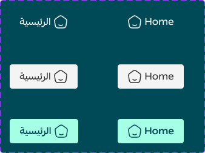

# Header Primary Tabs

Figma node `15412:79584` · [open in Figma](https://www.figma.com/design/dnmyqzYKK9dUJjVHuIWMDS/?node-id=15412-79584)

## Header Primary Tabs

Node `15412:79584` · 6 variants · [open](https://www.figma.com/design/dnmyqzYKK9dUJjVHuIWMDS/?node-id=15412-79584)

| Property | Values |
|---|---|
| `Language` | `Arabic`, `English` |
| `state` | `--active`, `--default`, `--hover` |

All variants

| Variant | Node | Size |
|---|---|---|
| Language=Arabic, state=--active | `15412:79583` | 113×40 |
| Language=English, state=--active | `15412:79713` | 109×40 |
| Language=Arabic, state=--default | `15412:79585` | 112×40 |
| Language=English, state=--default | `15412:79715` | 109×40 |
| Language=English, state=--hover | `15412:80078` | 109×40 |
| Language=Arabic, state=--hover | `15422:80220` | 112×40 |

