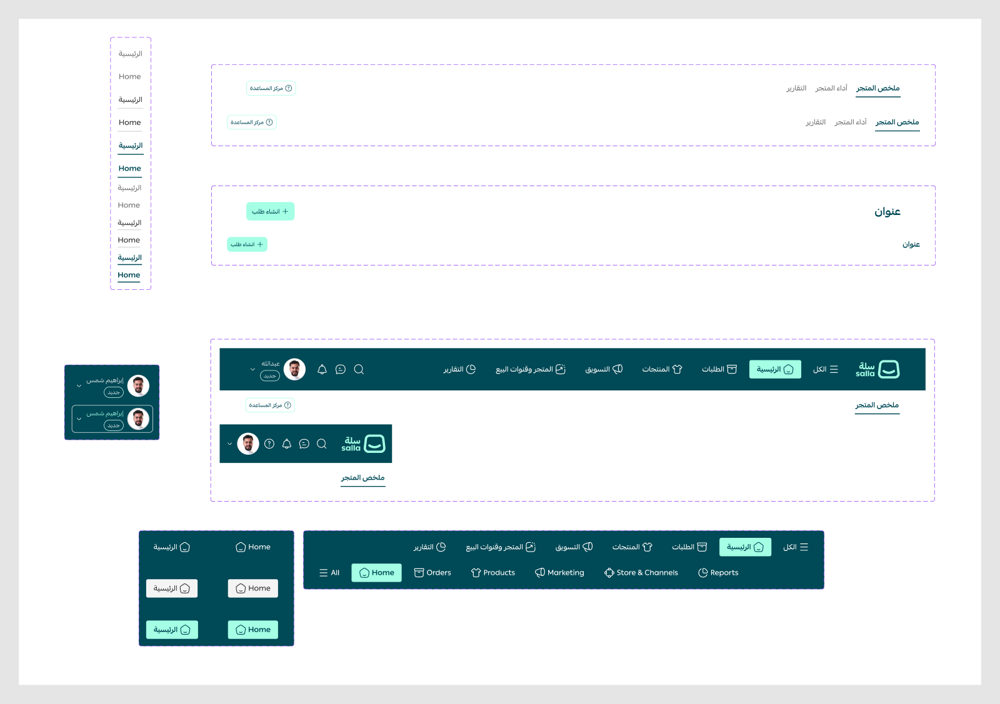

# Header

Figma node `27716:13115` · [open in Figma](https://www.figma.com/design/dnmyqzYKK9dUJjVHuIWMDS/?node-id=27716-13115)

## header Avatar

Node `15896:31776` · 2 variants · [open](https://www.figma.com/design/dnmyqzYKK9dUJjVHuIWMDS/?node-id=15896-31776)

| Property | Values |
|---|---|
| `state` | `Default`, `hover` |

All variants

| Variant | Node | Size |
|---|---|---|
| state=Default | `15896:31774` | 177×60 |
| state=hover | `15896:31777` | 177×60 |

## Header

Node `18081:20113` · 2 variants · [open](https://www.figma.com/design/dnmyqzYKK9dUJjVHuIWMDS/?node-id=18081-20113)

| Property | Values |
|---|---|
| `--device` | `desktop`, `mobile` |

All variants

| Variant | Node | Size |
|---|---|---|
| --device=desktop | `15895:36794` | 1536×156 |
| --device=mobile | `18081:20418` | 375×148 |

## Page Title

Node `19020:7259` · 2 variants · [open](https://www.figma.com/design/dnmyqzYKK9dUJjVHuIWMDS/?node-id=19020-7259)

| Property | Values |
|---|---|
| `--device` | `desktop`, `mobile` |

All variants

| Variant | Node | Size |
|---|---|---|
| --device=desktop | `18204:42579` | 1536×72 |
| --device=mobile | `19020:7260` | 1536×52 |

## Header Subcategory

Node `19020:7302` · 2 variants · [open](https://www.figma.com/design/dnmyqzYKK9dUJjVHuIWMDS/?node-id=19020-7302)

| Property | Values |
|---|---|
| `--device` | `desktop`, `mobile` |

All variants

| Variant | Node | Size |
|---|---|---|
| --device=desktop | `18204:40891` | 1536×64 |
| --device=mobile | `19020:7303` | 1536×64 |

## Header Secondary Tabs

Node `15456:85667` · 12 variants · [open](https://www.figma.com/design/dnmyqzYKK9dUJjVHuIWMDS/?node-id=15456-85667)

| Property | Values |
|---|---|
| `Language` | `Arabic`, `English` |
| `state` | `--active`, `--default`, `--hover` |
| `Contained` | `Off`, `On` |

All variants

| Variant | Node | Size |
|---|---|---|
| Language=Arabic, state=--default, Contained=On | `15456:85678` | 56×40 |
| Language=English, state=--default, Contained=On | `15456:85683` | 53×40 |
| Language=Arabic, state=--hover, Contained=On | `15456:85693` | 56×40 |
| Language=English, state=--hover, Contained=On | `15456:85688` | 53×40 |
| Language=Arabic, state=--active, Contained=On | `15456:85668` | 57×40 |
| Language=English, state=--active, Contained=On | `15456:85673` | 53×40 |
| Language=Arabic, state=--default, Contained=Off | `18211:133615` | 52×28 |
| Language=English, state=--default, Contained=Off | `18211:133620` | 49×28 |
| Language=Arabic, state=--hover, Contained=Off | `18211:133625` | 52×28 |
| Language=English, state=--hover, Contained=Off | `18211:133630` | 49×28 |
| Language=Arabic, state=--active, Contained=Off | `18211:133635` | 53×28 |
| Language=English, state=--active, Contained=Off | `18211:133640` | 49×28 |

## Primary Tabs List - Dashboard only

Node `15895:35397` · 2 variants · [open](https://www.figma.com/design/dnmyqzYKK9dUJjVHuIWMDS/?node-id=15895-35397)

| Property | Values |
|---|---|
| `Language` | `Arabic`, `English` |

All variants

| Variant | Node | Size |
|---|---|---|
| Language=Arabic | `15895:35360` | 1101.6×40 |
| Language=English | `15895:35398` | 1101.6×40 |

