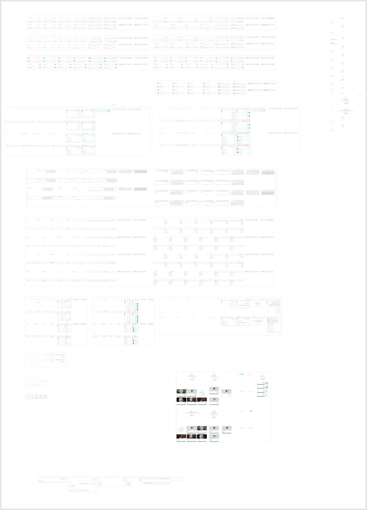

# Inputs

Figma node `27737:28091` · [open in Figma](https://www.figma.com/design/dnmyqzYKK9dUJjVHuIWMDS/?node-id=27737-28091)

Design-to-code specs: [text-input](../specs/text-input.md), [search-input](../specs/search-input.md), [input-wrapper](../specs/input-wrapper.md), [upload-input](../specs/upload-input.md)

## _TextInput *(internal, underscore-prefixed)*

Node `14805:10165` · 28 variants · [open](https://www.figma.com/design/dnmyqzYKK9dUJjVHuIWMDS/?node-id=14805-10165)

| Property | Values |
|---|---|
| `Language` | `Arabic`, `English` |
| `state` | `--Active`, `--Active-Filled`, `--default`, `--disabled`, `--filled`, `--hover`, `--preActive`, `--read-only` |
| `--error` | `False`, `True` |

All variants

| Variant | Node | Size |
|---|---|---|
| Language=Arabic, state=--default, --error=False | `14805:10166` | 375×40 |
| Language=English, state=--default, --error=False | `14900:16490` | 375×40 |
| Language=Arabic, state=--hover, --error=False | `14805:10182` | 375×40 |
| Language=English, state=--hover, --error=False | `14900:16503` | 375×40 |
| Language=Arabic, state=--preActive, --error=False | `14805:10190` | 375×40 |
| Language=English, state=--preActive, --error=False | `14900:16516` | 375×40 |
| Language=Arabic, state=--preActive, --error=True | `14900:10430` | 375×40 |
| Language=English, state=--preActive, --error=True | `14900:16530` | 375×40 |
| Language=Arabic, state=--Active, --error=False | `14805:10199` | 375×40 |
| Language=English, state=--Active, --error=False | `14900:16544` | 375×40 |
| Language=Arabic, state=--Active-Filled, --error=False | `14900:14664` | 375×40 |
| Language=Arabic, state=--filled, --error=False | `14900:22155` | 375×40 |
| Language=English, state=--Active-Filled, --error=False | `14900:16558` | 375×40 |
| Language=English, state=--filled, --error=False | `14900:22169` | 375×40 |
| Language=Arabic, state=--Active-Filled, --error=True | `14900:14698` | 375×40 |
| Language=Arabic, state=--filled, --error=True | `14900:22183` | 375×40 |
| Language=English, state=--Active-Filled, --error=True | `14900:16572` | 375×40 |
| Language=English, state=--filled, --error=True | `14900:22197` | 375×40 |
| Language=Arabic, state=--Active, --error=True | `14900:10645` | 375×40 |
| Language=English, state=--Active, --error=True | `14900:16586` | 375×40 |
| Language=Arabic, state=--default, --error=True | `14805:10209` | 375×40 |
| Language=English, state=--default, --error=True | `14900:16600` | 375×40 |
| Language=Arabic, state=--hover, --error=True | `14900:10317` | 375×40 |
| Language=English, state=--hover, --error=True | `14900:16613` | 375×40 |
| Language=Arabic, state=--disabled, --error=False | `14805:10217` | 375×40 |
| Language=English, state=--disabled, --error=False | `14900:16626` | 375×40 |
| Language=Arabic, state=--read-only, --error=False | `14805:10225` | 375×40 |
| Language=English, state=--read-only, --error=False | `14900:16639` | 375×40 |

## _inputWithButton *(internal, underscore-prefixed)*

Node `14970:12119` · 28 variants · [open](https://www.figma.com/design/dnmyqzYKK9dUJjVHuIWMDS/?node-id=14970-12119)

| Property | Values |
|---|---|
| `Language` | `Arabic`, `English` |
| `state` | `--Active`, `--Active-Filled`, `--default`, `--disabled`, `--filled`, `--hover`, `--preActive`, `--read-only` |
| `--error` | `False`, `True` |

All variants

| Variant | Node | Size |
|---|---|---|
| Language=Arabic, state=--default, --error=False | `14970:12120` | 375×40 |
| Language=English, state=--default, --error=False | `14970:12133` | 375×40 |
| Language=Arabic, state=--hover, --error=False | `14970:12146` | 375×40 |
| Language=English, state=--hover, --error=False | `14970:12159` | 375×40 |
| Language=Arabic, state=--preActive, --error=False | `14970:12172` | 375×40 |
| Language=English, state=--preActive, --error=False | `14970:12186` | 375×40 |
| Language=Arabic, state=--preActive, --error=True | `14970:12200` | 375×40 |
| Language=English, state=--preActive, --error=True | `14970:12214` | 375×40 |
| Language=Arabic, state=--Active, --error=False | `14970:12228` | 375×40 |
| Language=English, state=--Active, --error=False | `14970:12242` | 375×40 |
| Language=Arabic, state=--Active-Filled, --error=False | `14970:12256` | 375×40 |
| Language=Arabic, state=--filled, --error=False | `14970:12270` | 375×40 |
| Language=English, state=--Active-Filled, --error=False | `14970:12283` | 375×40 |
| Language=English, state=--filled, --error=False | `14970:12297` | 375×40 |
| Language=Arabic, state=--Active-Filled, --error=True | `14970:12310` | 375×40 |
| Language=Arabic, state=--filled, --error=True | `14970:12324` | 375×40 |
| Language=English, state=--Active-Filled, --error=True | `14970:12337` | 375×40 |
| Language=English, state=--filled, --error=True | `14970:12351` | 375×40 |
| Language=Arabic, state=--Active, --error=True | `14970:12364` | 375×40 |
| Language=English, state=--Active, --error=True | `14970:12378` | 375×40 |
| Language=Arabic, state=--default, --error=True | `14970:12392` | 375×40 |
| Language=English, state=--default, --error=True | `14970:12405` | 375×40 |
| Language=Arabic, state=--hover, --error=True | `14970:12418` | 375×40 |
| Language=English, state=--hover, --error=True | `14970:12431` | 375×40 |
| Language=Arabic, state=--disabled, --error=False | `14970:12444` | 375×40 |
| Language=English, state=--disabled, --error=False | `14970:12455` | 375×40 |
| Language=Arabic, state=--read-only, --error=False | `14970:12466` | 375×40 |
| Language=English, state=--read-only, --error=False | `14970:12477` | 375×40 |

## _InputWithImage *(internal, underscore-prefixed)*

Node `14970:13646` · 28 variants · [open](https://www.figma.com/design/dnmyqzYKK9dUJjVHuIWMDS/?node-id=14970-13646)

| Property | Values |
|---|---|
| `Language` | `Arabic`, `English` |
| `state` | `--Active`, `--Active-Filled`, `--default`, `--disabled`, `--filled`, `--hover`, `--preActive`, `--read-only` |
| `--error` | `False`, `True` |

All variants

| Variant | Node | Size |
|---|---|---|
| Language=Arabic, state=--default, --error=False | `14970:13647` | 375×40 |
| Language=English, state=--default, --error=False | `14970:13662` | 375×40 |
| Language=Arabic, state=--hover, --error=False | `14970:13677` | 375×40 |
| Language=English, state=--hover, --error=False | `14970:13692` | 375×40 |
| Language=Arabic, state=--preActive, --error=False | `14970:13707` | 375×40 |
| Language=English, state=--preActive, --error=False | `14970:13723` | 375×40 |
| Language=Arabic, state=--preActive, --error=True | `14970:13739` | 375×40 |
| Language=English, state=--preActive, --error=True | `14970:13755` | 375×40 |
| Language=Arabic, state=--Active, --error=False | `14970:13771` | 375×40 |
| Language=English, state=--Active, --error=False | `14970:13787` | 375×40 |
| Language=Arabic, state=--Active-Filled, --error=False | `14970:13803` | 375×40 |
| Language=Arabic, state=--filled, --error=False | `14970:13819` | 375×40 |
| Language=English, state=--Active-Filled, --error=False | `14970:13834` | 375×40 |
| Language=English, state=--filled, --error=False | `14970:13850` | 375×40 |
| Language=Arabic, state=--Active-Filled, --error=True | `14970:13865` | 375×40 |
| Language=Arabic, state=--filled, --error=True | `14970:13881` | 375×40 |
| Language=English, state=--Active-Filled, --error=True | `14970:13896` | 375×40 |
| Language=English, state=--filled, --error=True | `14970:13912` | 375×40 |
| Language=Arabic, state=--Active, --error=True | `14970:13927` | 375×40 |
| Language=English, state=--Active, --error=True | `14970:13943` | 375×40 |
| Language=Arabic, state=--default, --error=True | `14970:13959` | 375×40 |
| Language=English, state=--default, --error=True | `14970:13974` | 375×40 |
| Language=Arabic, state=--hover, --error=True | `14970:13989` | 375×40 |
| Language=English, state=--hover, --error=True | `14970:14004` | 375×40 |
| Language=Arabic, state=--disabled, --error=False | `14970:14019` | 375×40 |
| Language=English, state=--disabled, --error=False | `14970:14032` | 375×40 |
| Language=Arabic, state=--read-only, --error=False | `14970:14045` | 375×40 |
| Language=English, state=--read-only, --error=False | `14970:14058` | 375×40 |

## _InputCounter *(internal, underscore-prefixed)*

Node `14973:25847` · 28 variants · [open](https://www.figma.com/design/dnmyqzYKK9dUJjVHuIWMDS/?node-id=14973-25847)

| Property | Values |
|---|---|
| `Language` | `Arabic`, `English` |
| `state` | `--Active`, `--Active-Filled`, `--default`, `--disabled`, `--filled`, `--hover`, `--preActive`, `--read-only` |
| `--error` | `False`, `True` |

All variants

| Variant | Node | Size |
|---|---|---|
| Language=Arabic, state=--default, --error=False | `14973:25848` | 375×40 |
| Language=English, state=--default, --error=False | `14973:25863` | 375×40 |
| Language=Arabic, state=--hover, --error=False | `14973:25878` | 375×40 |
| Language=English, state=--hover, --error=False | `14973:25893` | 375×40 |
| Language=Arabic, state=--preActive, --error=False | `14973:25908` | 375×40 |
| Language=English, state=--preActive, --error=False | `14973:25924` | 375×40 |
| Language=Arabic, state=--preActive, --error=True | `14973:25940` | 375×40 |
| Language=English, state=--preActive, --error=True | `14973:25956` | 375×40 |
| Language=Arabic, state=--Active, --error=False | `14973:25972` | 375×40 |
| Language=English, state=--Active, --error=False | `14973:25988` | 375×40 |
| Language=Arabic, state=--Active-Filled, --error=False | `14973:26004` | 375×40 |
| Language=Arabic, state=--filled, --error=False | `14973:26020` | 375×40 |
| Language=English, state=--Active-Filled, --error=False | `14973:26035` | 375×40 |
| Language=English, state=--filled, --error=False | `14973:26051` | 375×40 |
| Language=Arabic, state=--Active-Filled, --error=True | `14973:26066` | 375×40 |
| Language=Arabic, state=--filled, --error=True | `14973:26082` | 375×40 |
| Language=English, state=--Active-Filled, --error=True | `14973:26097` | 375×40 |
| Language=English, state=--filled, --error=True | `14973:26113` | 375×40 |
| Language=Arabic, state=--Active, --error=True | `14973:26128` | 375×40 |
| Language=English, state=--Active, --error=True | `14973:26144` | 375×40 |
| Language=Arabic, state=--default, --error=True | `14973:26160` | 375×40 |
| Language=English, state=--default, --error=True | `14973:26175` | 375×40 |
| Language=Arabic, state=--hover, --error=True | `14973:26190` | 375×40 |
| Language=English, state=--hover, --error=True | `14973:26205` | 375×40 |
| Language=Arabic, state=--disabled, --error=False | `14973:26220` | 375×40 |
| Language=English, state=--disabled, --error=False | `14973:26233` | 375×40 |
| Language=Arabic, state=--read-only, --error=False | `14973:26246` | 375×40 |
| Language=English, state=--read-only, --error=False | `14973:26259` | 375×40 |

## _TextArea *(internal, underscore-prefixed)*

Node `14938:17400` · 56 variants · [open](https://www.figma.com/design/dnmyqzYKK9dUJjVHuIWMDS/?node-id=14938-17400)

| Property | Values |
|---|---|
| `State` | `--Active`, `--Active-Filled`, `--default`, `--disabled`, `--filled`, `--hover`, `--preActive`, `--read-only` |
| `--error` | `Fals`, `False`, `True` |
| `Language` | `Arabic`, `English` |
| `Rich text?` | `No`, `Yes` |

All variants

| Variant | Node | Size |
|---|---|---|
| State=--default, --error=False, Language=Arabic, Rich text?=No | `14938:17401` | 375×96 |
| State=--default, --error=False, Language=Arabic, Rich text?=Yes | `14938:29001` | 375×140 |
| State=--default, --error=False, Language=English, Rich text?=No | `14938:17414` | 375×96 |
| State=--default, --error=False, Language=English, Rich text?=Yes | `14938:29012` | 375×140 |
| State=--hover, --error=False, Language=Arabic, Rich text?=No | `14938:17427` | 375×96 |
| State=--hover, --error=False, Language=Arabic, Rich text?=Yes | `14938:29023` | 375×140 |
| State=--hover, --error=False, Language=English, Rich text?=No | `14938:17440` | 375×96 |
| State=--hover, --error=False, Language=English, Rich text?=Yes | `14938:29034` | 375×140 |
| State=--preActive, --error=False, Language=English, Rich text?=No | `14938:17467` | 375×96 |
| State=--preActive, --error=False, Language=English, Rich text?=Yes | `14938:29057` | 375×140 |
| State=--preActive, --error=True, Language=Arabic, Rich text?=No | `14938:17481` | 375×96 |
| State=--preActive, --error=False, Language=Arabic, Rich text?=No | `14938:30353` | 375×96 |
| State=--preActive, --error=True, Language=Arabic, Rich text?=Yes | `14938:29069` | 375×140 |
| State=--preActive, --error=Fals, Language=Arabic, Rich text?=Yes | `14938:30370` | 375×140 |
| State=--preActive, --error=True, Language=English, Rich text?=No | `14938:17495` | 375×96 |
| State=--preActive, --error=True, Language=English, Rich text?=Yes | `14938:29081` | 375×140 |
| State=--Active, --error=False, Language=Arabic, Rich text?=No | `14938:17509` | 375×96 |
| State=--Active, --error=False, Language=Arabic, Rich text?=Yes | `14938:29093` | 375×140 |
| State=--Active, --error=False, Language=English, Rich text?=No | `14938:17523` | 375×96 |
| State=--Active, --error=False, Language=English, Rich text?=Yes | `14938:29105` | 375×140 |
| State=--Active-Filled, --error=False, Language=Arabic, Rich text?=No | `14938:17537` | 375×96 |
| State=--Active-Filled, --error=False, Language=Arabic, Rich text?=Yes | `14938:29117` | 375×140 |
| State=--filled, --error=False, Language=Arabic, Rich text?=No | `14938:17551` | 375×96 |
| State=--filled, --error=False, Language=Arabic, Rich text?=Yes | `14938:29129` | 375×140 |
| State=--Active-Filled, --error=False, Language=English, Rich text?=No | `14938:17564` | 375×96 |
| State=--Active-Filled, --error=False, Language=English, Rich text?=Yes | `14938:29140` | 375×140 |
| State=--filled, --error=False, Language=English, Rich text?=No | `14938:17578` | 375×96 |
| State=--filled, --error=False, Language=English, Rich text?=Yes | `14938:29152` | 375×140 |
| State=--Active-Filled, --error=True, Language=Arabic, Rich text?=No | `14938:17591` | 375×96 |
| State=--Active-Filled, --error=True, Language=Arabic, Rich text?=Yes | `14938:29163` | 375×140 |
| State=--filled, --error=True, Language=Arabic, Rich text?=No | `14938:17605` | 375×96 |
| State=--filled, --error=True, Language=Arabic, Rich text?=Yes | `14938:29175` | 375×140 |
| State=--Active-Filled, --error=True, Language=English, Rich text?=No | `14938:17618` | 375×96 |
| State=--Active-Filled, --error=True, Language=English, Rich text?=Yes | `14938:29186` | 375×140 |
| State=--filled, --error=True, Language=English, Rich text?=No | `14938:17632` | 375×96 |
| State=--filled, --error=True, Language=English, Rich text?=Yes | `14938:29198` | 375×140 |
| State=--Active, --error=True, Language=Arabic, Rich text?=No | `14938:17645` | 375×96 |
| State=--Active, --error=True, Language=Arabic, Rich text?=Yes | `14938:29209` | 375×140 |
| State=--Active, --error=True, Language=English, Rich text?=No | `14938:17659` | 375×96 |
| State=--Active, --error=True, Language=English, Rich text?=Yes | `14938:29221` | 375×140 |
| State=--default, --error=True, Language=Arabic, Rich text?=No | `14938:17673` | 375×96 |
| State=--default, --error=True, Language=Arabic, Rich text?=Yes | `14938:29233` | 375×140 |
| State=--default, --error=True, Language=English, Rich text?=No | `14938:17686` | 375×96 |
| State=--default, --error=True, Language=English, Rich text?=Yes | `14938:29244` | 375×140 |
| State=--hover, --error=True, Language=Arabic, Rich text?=No | `14938:17699` | 375×96 |
| State=--hover, --error=True, Language=Arabic, Rich text?=Yes | `14938:29255` | 375×140 |
| State=--hover, --error=True, Language=English, Rich text?=No | `14938:17712` | 375×96 |
| State=--hover, --error=True, Language=English, Rich text?=Yes | `14938:29266` | 375×140 |
| State=--disabled, --error=False, Language=Arabic, Rich text?=No | `14938:17725` | 375×96 |
| State=--disabled, --error=False, Language=Arabic, Rich text?=Yes | `14938:29277` | 375×140 |
| State=--disabled, --error=False, Language=English, Rich text?=No | `14938:17736` | 375×96 |
| State=--disabled, --error=False, Language=English, Rich text?=Yes | `14938:29286` | 375×140 |
| State=--read-only, --error=False, Language=Arabic, Rich text?=No | `14938:17747` | 375×96 |
| State=--read-only, --error=False, Language=Arabic, Rich text?=Yes | `14938:29295` | 375×140 |
| State=--read-only, --error=False, Language=English, Rich text?=No | `14938:17758` | 375×96 |
| State=--read-only, --error=False, Language=English, Rich text?=Yes | `14938:29304` | 375×140 |

## _amountInput *(internal, underscore-prefixed)*

Node `14936:10894` · 28 variants · [open](https://www.figma.com/design/dnmyqzYKK9dUJjVHuIWMDS/?node-id=14936-10894)

| Property | Values |
|---|---|
| `State` | `--Active`, `--Active-Filled`, `--default`, `--disabled`, `--filled`, `--hover`, `--preActive`, `--read-only` |
| `--error` | `False`, `True` |
| `Language` | `Arabic`, `English` |

All variants

| Variant | Node | Size |
|---|---|---|
| State=--default, --error=False, Language=Arabic | `14936:10895` | 375×40 |
| State=--default, --error=False, Language=English | `14936:10908` | 375×40 |
| State=--hover, --error=False, Language=Arabic | `14936:10921` | 375×40 |
| State=--hover, --error=False, Language=English | `14936:10934` | 375×40 |
| State=--preActive, --error=False, Language=Arabic | `14936:10947` | 375×40 |
| State=--preActive, --error=False, Language=English | `14936:10961` | 375×40 |
| State=--preActive, --error=True, Language=Arabic | `14936:10975` | 375×40 |
| State=--preActive, --error=True, Language=English | `14936:10989` | 375×40 |
| State=--Active, --error=False, Language=Arabic | `14936:11003` | 375×40 |
| State=--Active, --error=False, Language=English | `14936:11017` | 375×40 |
| State=--Active-Filled, --error=False, Language=Arabic | `14936:11031` | 375×40 |
| State=--filled, --error=False, Language=Arabic | `14936:11045` | 375×40 |
| State=--Active-Filled, --error=False, Language=English | `14936:11058` | 375×40 |
| State=--filled, --error=False, Language=English | `14936:11072` | 375×40 |
| State=--Active-Filled, --error=True, Language=Arabic | `14936:11085` | 375×40 |
| State=--filled, --error=True, Language=Arabic | `14936:11099` | 375×40 |
| State=--Active-Filled, --error=True, Language=English | `14936:11112` | 375×40 |
| State=--filled, --error=True, Language=English | `14936:11126` | 375×40 |
| State=--Active, --error=True, Language=Arabic | `14936:11139` | 375×40 |
| State=--Active, --error=True, Language=English | `14936:11153` | 375×40 |
| State=--default, --error=True, Language=Arabic | `14936:11167` | 375×40 |
| State=--default, --error=True, Language=English | `14936:11180` | 375×40 |
| State=--hover, --error=True, Language=Arabic | `14936:11193` | 375×40 |
| State=--hover, --error=True, Language=English | `14936:11206` | 375×40 |
| State=--disabled, --error=False, Language=Arabic | `14936:11219` | 375×40 |
| State=--disabled, --error=False, Language=English | `14936:11230` | 375×40 |
| State=--read-only, --error=False, Language=Arabic | `14936:11241` | 375×40 |
| State=--read-only, --error=False, Language=English | `14936:11252` | 375×40 |

## _emailInput *(internal, underscore-prefixed)*

Node `14934:8857` · 28 variants · [open](https://www.figma.com/design/dnmyqzYKK9dUJjVHuIWMDS/?node-id=14934-8857)

| Property | Values |
|---|---|
| `State` | `--Active`, `--Active-Filled`, `--default`, `--disabled`, `--filled`, `--hover`, `--preActive`, `--read-only` |
| `--error` | `False`, `True` |
| `Language` | `Arabic`, `English` |

All variants

| Variant | Node | Size |
|---|---|---|
| State=--default, --error=False, Language=Arabic | `14934:8858` | 375×40 |
| State=--default, --error=False, Language=English | `14934:8871` | 375×40 |
| State=--hover, --error=False, Language=Arabic | `14934:8884` | 375×40 |
| State=--hover, --error=False, Language=English | `14934:8897` | 375×40 |
| State=--preActive, --error=False, Language=Arabic | `14934:8910` | 375×40 |
| State=--preActive, --error=False, Language=English | `14934:8924` | 375×40 |
| State=--preActive, --error=True, Language=Arabic | `14934:8938` | 375×40 |
| State=--preActive, --error=True, Language=English | `14934:8952` | 375×40 |
| State=--Active, --error=False, Language=Arabic | `14934:8966` | 375×40 |
| State=--Active, --error=False, Language=English | `14934:8980` | 375×40 |
| State=--Active-Filled, --error=False, Language=Arabic | `14934:8994` | 375×40 |
| State=--filled, --error=False, Language=Arabic | `14934:9008` | 375×40 |
| State=--Active-Filled, --error=False, Language=English | `14934:9021` | 375×40 |
| State=--filled, --error=False, Language=English | `14934:9035` | 375×40 |
| State=--Active-Filled, --error=True, Language=Arabic | `14934:9048` | 375×40 |
| State=--filled, --error=True, Language=Arabic | `14934:9062` | 375×40 |
| State=--Active-Filled, --error=True, Language=English | `14934:9075` | 375×40 |
| State=--filled, --error=True, Language=English | `14934:9089` | 375×40 |
| State=--Active, --error=True, Language=Arabic | `14934:9102` | 375×40 |
| State=--Active, --error=True, Language=English | `14934:9116` | 375×40 |
| State=--default, --error=True, Language=Arabic | `14934:9130` | 375×40 |
| State=--default, --error=True, Language=English | `14934:9143` | 375×40 |
| State=--hover, --error=True, Language=Arabic | `14934:9156` | 375×40 |
| State=--hover, --error=True, Language=English | `14934:9169` | 375×40 |
| State=--disabled, --error=False, Language=Arabic | `14934:9182` | 375×40 |
| State=--disabled, --error=False, Language=English | `14934:9193` | 375×40 |
| State=--read-only, --error=False, Language=Arabic | `14934:9204` | 375×40 |
| State=--read-only, --error=False, Language=English | `14934:9215` | 375×40 |

## _SingleDigit *(internal, underscore-prefixed)*

Node `14938:34222` · 14 variants · [open](https://www.figma.com/design/dnmyqzYKK9dUJjVHuIWMDS/?node-id=14938-34222)

| Property | Values |
|---|---|
| `State` | `--Active`, `--Active-Filled`, `--default`, `--disabled`, `--filled`, `--hover`, `--preActive`, `--read-only` |
| `--error` | `Fals`, `False`, `True` |
| `Language` | `Arabic` |

All variants

| Variant | Node | Size |
|---|---|---|
| State=--default, --error=False, Language=Arabic | `14938:34223` | 32×40 |
| State=--hover, --error=False, Language=Arabic | `14938:34237` | 32×40 |
| State=--preActive, --error=True, Language=Arabic | `14938:34267` | 32×40 |
| State=--preActive, --error=Fals, Language=Arabic | `14939:10608` | 32×40 |
| State=--Active, --error=False, Language=Arabic | `14938:34283` | 32×40 |
| State=--Active-Filled, --error=False, Language=Arabic | `14938:34299` | 32×40 |
| State=--filled, --error=False, Language=Arabic | `14938:34307` | 32×40 |
| State=--Active-Filled, --error=True, Language=Arabic | `14938:34329` | 32×40 |
| State=--filled, --error=True, Language=Arabic | `14938:34337` | 32×40 |
| State=--Active, --error=True, Language=Arabic | `14938:34359` | 32×40 |
| State=--default, --error=True, Language=Arabic | `14938:34375` | 32×40 |
| State=--hover, --error=True, Language=Arabic | `14938:34389` | 32×40 |
| State=--disabled, --error=False, Language=Arabic | `14938:34403` | 32×40 |
| State=--read-only, --error=False, Language=Arabic | `14938:34417` | 32×40 |

## Counter

Node `14939:11535` · 24 variants · [open](https://www.figma.com/design/dnmyqzYKK9dUJjVHuIWMDS/?node-id=14939-11535)

| Property | Values |
|---|---|
| `State` | `--Active`, `--Active-Filled`, `--Active-Filled-with-one`, `--default`, `--disabled`, `--filled`, `--filled-hover`, `--filled-with-one`, `--hover`, `--preActive`, `--read-only`, `--read-only-with-one` |
| `--error` | `Fals`, `False` |
| `--size` | `compact`, `default` |

All variants

| Variant | Node | Size |
|---|---|---|
| State=--default, --error=False, --size=compact | `14939:11536` | 112×32 |
| State=--default, --error=False, --size=default | `15493:24547` | 112×40 |
| State=--hover, --error=False, --size=compact | `14939:11541` | 112×32 |
| State=--preActive, --error=Fals, --size=compact | `14939:11552` | 112×32 |
| State=--preActive, --error=Fals, --size=default | `25188:6665` | 112×40 |
| State=--Active, --error=False, --size=compact | `14939:11558` | 112×32 |
| State=--Active, --error=False, --size=default | `25188:6673` | 112×40 |
| State=--Active-Filled, --error=False, --size=compact | `14942:11848` | 112×32 |
| State=--Active-Filled, --error=False, --size=default | `25188:6681` | 112×40 |
| State=--Active-Filled-with-one, --error=False, --size=compact | `14942:12021` | 112×32 |
| State=--Active-Filled-with-one, --error=False, --size=default | `25188:6689` | 112×40 |
| State=--filled, --error=False, --size=compact | `14939:11570` | 112×32 |
| State=--filled-hover, --error=False, --size=compact | `15730:70737` | 112×32 |
| State=--filled, --error=False, --size=default | `15493:24593` | 112×40 |
| State=--filled-hover, --error=False, --size=default | `15730:70722` | 112×40 |
| State=--hover, --error=False, --size=default | `15730:68532` | 112×40 |
| State=--filled-with-one, --error=False, --size=default | `15730:68508` | 112×40 |
| State=--filled-with-one, --error=False, --size=compact | `14942:12029` | 112×32 |
| State=--disabled, --error=False, --size=compact | `14939:11602` | 112×32 |
| State=--disabled, --error=False, --size=default | `25188:6697` | 112×40 |
| State=--read-only, --error=False, --size=compact | `14939:11607` | 112×32 |
| State=--read-only, --error=False, --size=default | `25188:6704` | 112×40 |
| State=--read-only-with-one, --error=False, --size=compact | `14942:12043` | 112×32 |
| State=--read-only-with-one, --error=False, --size=default | `25188:6711` | 112×40 |

## _passwordInput *(internal, underscore-prefixed)*

Node `14914:13360` · 112 variants · [open](https://www.figma.com/design/dnmyqzYKK9dUJjVHuIWMDS/?node-id=14914-13360)

| Property | Values |
|---|---|
| `Language` | `Arabic`, `English` |
| `State` | `--Active`, `--Active-Filled`, `--default`, `--disabled`, `--filled`, `--hover`, `--preActive`, `--read-only` |
| `--error` | `False`, `True` |
| `--hidden` | `False`, `True` |
| `--requirements` | `False`, `True` |

All variants

| Variant | Node | Size |
|---|---|---|
| Language=Arabic, State=--default, --error=False, --hidden=False, --requirements=False | `14914:13361` | 375×40 |
| Language=Arabic, State=--default, --error=False, --hidden=False, --requirements=True | `14914:16162` | 375×140 |
| Language=Arabic, State=--default, --error=False, --hidden=True, --requirements=False | `14914:14900` | 375×40 |
| Language=Arabic, State=--default, --error=False, --hidden=True, --requirements=True | `14914:16171` | 375×140 |
| Language=English, State=--default, --error=False, --hidden=False, --requirements=False | `14914:13374` | 375×40 |
| Language=English, State=--default, --error=False, --hidden=False, --requirements=True | `14914:16180` | 375×140 |
| Language=English, State=--default, --error=False, --hidden=True, --requirements=False | `14914:14909` | 375×40 |
| Language=English, State=--default, --error=False, --hidden=True, --requirements=True | `14914:16189` | 375×140 |
| Language=Arabic, State=--hover, --error=False, --hidden=False, --requirements=False | `14914:13387` | 375×40 |
| Language=Arabic, State=--hover, --error=False, --hidden=False, --requirements=True | `14914:16198` | 375×140 |
| Language=Arabic, State=--hover, --error=False, --hidden=True, --requirements=False | `14914:14918` | 375×40 |
| Language=Arabic, State=--hover, --error=False, --hidden=True, --requirements=True | `14914:16207` | 375×140 |
| Language=English, State=--hover, --error=False, --hidden=False, --requirements=False | `14914:13400` | 375×40 |
| Language=English, State=--hover, --error=False, --hidden=False, --requirements=True | `14914:16216` | 375×140 |
| Language=English, State=--hover, --error=False, --hidden=True, --requirements=False | `14914:14927` | 375×40 |
| Language=English, State=--hover, --error=False, --hidden=True, --requirements=True | `14914:16225` | 375×140 |
| Language=Arabic, State=--preActive, --error=False, --hidden=False, --requirements=False | `14914:13413` | 375×40 |
| Language=Arabic, State=--preActive, --error=False, --hidden=False, --requirements=True | `14914:16234` | 375×140 |
| Language=Arabic, State=--preActive, --error=False, --hidden=True, --requirements=False | `14914:14936` | 375×40 |
| Language=Arabic, State=--preActive, --error=False, --hidden=True, --requirements=True | `14914:16244` | 375×140 |
| Language=English, State=--preActive, --error=False, --hidden=False, --requirements=False | `14914:13427` | 375×40 |
| Language=English, State=--preActive, --error=False, --hidden=False, --requirements=True | `14914:16254` | 375×140 |
| Language=English, State=--preActive, --error=False, --hidden=True, --requirements=False | `14914:14946` | 375×40 |
| Language=English, State=--preActive, --error=False, --hidden=True, --requirements=True | `14914:16264` | 375×140 |
| Language=Arabic, State=--preActive, --error=True, --hidden=False, --requirements=False | `14914:13441` | 375×40 |
| Language=Arabic, State=--preActive, --error=True, --hidden=False, --requirements=True | `14914:16274` | 375×140 |
| Language=Arabic, State=--preActive, --error=True, --hidden=True, --requirements=False | `14914:14956` | 375×40 |
| Language=Arabic, State=--preActive, --error=True, --hidden=True, --requirements=True | `14914:16284` | 375×140 |
| Language=English, State=--preActive, --error=True, --hidden=False, --requirements=False | `14914:13455` | 375×40 |
| Language=English, State=--preActive, --error=True, --hidden=False, --requirements=True | `14914:16294` | 375×140 |
| Language=English, State=--preActive, --error=True, --hidden=True, --requirements=False | `14914:14966` | 375×40 |
| Language=English, State=--preActive, --error=True, --hidden=True, --requirements=True | `14914:16304` | 375×140 |
| Language=Arabic, State=--Active, --error=False, --hidden=False, --requirements=False | `14914:13469` | 375×40 |
| Language=Arabic, State=--Active, --error=False, --hidden=False, --requirements=True | `14914:16314` | 375×140 |
| Language=Arabic, State=--Active, --error=False, --hidden=True, --requirements=False | `14914:14976` | 375×40 |
| Language=Arabic, State=--Active, --error=False, --hidden=True, --requirements=True | `14914:16324` | 375×140 |
| Language=English, State=--Active, --error=False, --hidden=False, --requirements=False | `14914:13483` | 375×40 |
| Language=English, State=--Active, --error=False, --hidden=False, --requirements=True | `14914:16334` | 375×140 |
| Language=English, State=--Active, --error=False, --hidden=True, --requirements=False | `14914:14986` | 375×40 |
| Language=English, State=--Active, --error=False, --hidden=True, --requirements=True | `14914:16344` | 375×140 |
| Language=Arabic, State=--Active-Filled, --error=False, --hidden=False, --requirements=False | `14914:13497` | 375×40 |
| Language=Arabic, State=--Active-Filled, --error=False, --hidden=False, --requirements=True | `14914:16354` | 375×140 |
| Language=Arabic, State=--Active-Filled, --error=False, --hidden=True, --requirements=False | `14914:14996` | 375×40 |
| Language=Arabic, State=--Active-Filled, --error=False, --hidden=True, --requirements=True | `14914:16364` | 375×140 |
| Language=Arabic, State=--filled, --error=False, --hidden=False, --requirements=False | `14914:13511` | 375×40 |
| Language=Arabic, State=--filled, --error=False, --hidden=False, --requirements=True | `14914:16374` | 375×140 |
| Language=Arabic, State=--filled, --error=False, --hidden=True, --requirements=False | `14914:15006` | 375×40 |
| Language=Arabic, State=--filled, --error=False, --hidden=True, --requirements=True | `14914:16383` | 375×140 |
| Language=English, State=--Active-Filled, --error=False, --hidden=False, --requirements=False | `14914:13524` | 375×40 |
| Language=English, State=--Active-Filled, --error=False, --hidden=False, --requirements=True | `14914:16392` | 375×140 |
| Language=English, State=--Active-Filled, --error=False, --hidden=True, --requirements=False | `14914:15015` | 375×40 |
| Language=English, State=--Active-Filled, --error=False, --hidden=True, --requirements=True | `14914:16402` | 375×140 |
| Language=English, State=--filled, --error=False, --hidden=False, --requirements=False | `14914:13538` | 375×40 |
| Language=English, State=--filled, --error=False, --hidden=False, --requirements=True | `14914:16412` | 375×140 |
| Language=English, State=--filled, --error=False, --hidden=True, --requirements=False | `14914:15025` | 375×40 |
| Language=English, State=--filled, --error=False, --hidden=True, --requirements=True | `14914:16421` | 375×140 |
| Language=Arabic, State=--Active-Filled, --error=True, --hidden=False, --requirements=False | `14914:13551` | 375×40 |
| Language=Arabic, State=--Active-Filled, --error=True, --hidden=False, --requirements=True | `14914:16430` | 375×140 |
| Language=Arabic, State=--Active-Filled, --error=True, --hidden=True, --requirements=False | `14914:15034` | 375×40 |
| Language=Arabic, State=--Active-Filled, --error=True, --hidden=True, --requirements=True | `14914:16440` | 375×140 |
| Language=Arabic, State=--filled, --error=True, --hidden=False, --requirements=False | `14914:13565` | 375×40 |
| Language=Arabic, State=--filled, --error=True, --hidden=False, --requirements=True | `14914:16450` | 375×140 |
| Language=Arabic, State=--filled, --error=True, --hidden=True, --requirements=False | `14914:15044` | 375×40 |
| Language=Arabic, State=--filled, --error=True, --hidden=True, --requirements=True | `14914:16459` | 375×140 |
| Language=English, State=--Active-Filled, --error=True, --hidden=False, --requirements=False | `14914:13578` | 375×40 |
| Language=English, State=--Active-Filled, --error=True, --hidden=False, --requirements=True | `14914:16468` | 375×140 |
| Language=English, State=--Active-Filled, --error=True, --hidden=True, --requirements=False | `14914:15053` | 375×40 |
| Language=English, State=--Active-Filled, --error=True, --hidden=True, --requirements=True | `14914:16478` | 375×140 |
| Language=English, State=--filled, --error=True, --hidden=False, --requirements=False | `14914:13592` | 375×40 |
| Language=English, State=--filled, --error=True, --hidden=False, --requirements=True | `14914:16488` | 375×140 |
| Language=English, State=--filled, --error=True, --hidden=True, --requirements=False | `14914:15063` | 375×40 |
| Language=English, State=--filled, --error=True, --hidden=True, --requirements=True | `14914:16497` | 375×140 |
| Language=Arabic, State=--Active, --error=True, --hidden=False, --requirements=False | `14914:13605` | 375×40 |
| Language=Arabic, State=--Active, --error=True, --hidden=False, --requirements=True | `14914:16506` | 375×140 |
| Language=Arabic, State=--Active, --error=True, --hidden=True, --requirements=False | `14914:15072` | 375×40 |
| Language=Arabic, State=--Active, --error=True, --hidden=True, --requirements=True | `14914:16516` | 375×140 |
| Language=English, State=--Active, --error=True, --hidden=False, --requirements=False | `14914:13619` | 375×40 |
| Language=English, State=--Active, --error=True, --hidden=False, --requirements=True | `14914:16526` | 375×140 |
| Language=English, State=--Active, --error=True, --hidden=True, --requirements=False | `14914:15082` | 375×40 |
| Language=English, State=--Active, --error=True, --hidden=True, --requirements=True | `14914:16536` | 375×140 |
| Language=Arabic, State=--default, --error=True, --hidden=False, --requirements=False | `14914:13633` | 375×40 |
| Language=Arabic, State=--default, --error=True, --hidden=False, --requirements=True | `14914:16546` | 375×140 |
| Language=Arabic, State=--default, --error=True, --hidden=True, --requirements=False | `14914:15092` | 375×40 |
| Language=Arabic, State=--default, --error=True, --hidden=True, --requirements=True | `14914:16555` | 375×140 |
| Language=English, State=--default, --error=True, --hidden=False, --requirements=False | `14914:13646` | 375×40 |
| Language=English, State=--default, --error=True, --hidden=False, --requirements=True | `14914:16564` | 375×140 |
| Language=English, State=--default, --error=True, --hidden=True, --requirements=False | `14914:15101` | 375×40 |
| Language=English, State=--default, --error=True, --hidden=True, --requirements=True | `14914:16573` | 375×140 |
| Language=Arabic, State=--hover, --error=True, --hidden=False, --requirements=False | `14914:13659` | 375×40 |
| Language=Arabic, State=--hover, --error=True, --hidden=False, --requirements=True | `14914:16582` | 375×140 |
| Language=Arabic, State=--hover, --error=True, --hidden=True, --requirements=False | `14914:15110` | 375×40 |
| Language=Arabic, State=--hover, --error=True, --hidden=True, --requirements=True | `14914:16591` | 375×140 |
| Language=English, State=--hover, --error=True, --hidden=False, --requirements=False | `14914:13672` | 375×40 |
| Language=English, State=--hover, --error=True, --hidden=False, --requirements=True | `14914:16600` | 375×140 |
| Language=English, State=--hover, --error=True, --hidden=True, --requirements=False | `14914:15119` | 375×40 |
| Language=English, State=--hover, --error=True, --hidden=True, --requirements=True | `14914:16609` | 375×140 |
| Language=Arabic, State=--disabled, --error=False, --hidden=False, --requirements=False | `14914:13685` | 375×40 |
| Language=Arabic, State=--disabled, --error=False, --hidden=False, --requirements=True | `14914:16618` | 375×40 |
| Language=Arabic, State=--disabled, --error=False, --hidden=True, --requirements=False | `14914:15128` | 375×40 |
| Language=Arabic, State=--disabled, --error=False, --hidden=True, --requirements=True | `14914:16627` | 375×40 |
| Language=English, State=--disabled, --error=False, --hidden=False, --requirements=False | `14914:13696` | 375×40 |
| Language=English, State=--disabled, --error=False, --hidden=False, --requirements=True | `14914:16636` | 375×40 |
| Language=English, State=--disabled, --error=False, --hidden=True, --requirements=False | `14914:15137` | 375×40 |
| Language=English, State=--disabled, --error=False, --hidden=True, --requirements=True | `14914:16645` | 375×40 |
| Language=Arabic, State=--read-only, --error=False, --hidden=False, --requirements=False | `14914:13707` | 375×40 |
| Language=Arabic, State=--read-only, --error=False, --hidden=False, --requirements=True | `14914:16654` | 375×40 |
| Language=Arabic, State=--read-only, --error=False, --hidden=True, --requirements=False | `14914:15146` | 375×40 |
| Language=Arabic, State=--read-only, --error=False, --hidden=True, --requirements=True | `14914:16663` | 375×40 |
| Language=English, State=--read-only, --error=False, --hidden=False, --requirements=False | `14914:13718` | 375×40 |
| Language=English, State=--read-only, --error=False, --hidden=False, --requirements=True | `14914:16672` | 375×40 |
| Language=English, State=--read-only, --error=False, --hidden=True, --requirements=False | `14914:15155` | 375×40 |
| Language=English, State=--read-only, --error=False, --hidden=True, --requirements=True | `14914:16681` | 375×40 |

## _dropdown-single *(internal, underscore-prefixed)*

Node `14900:23388` · 29 variants · [open](https://www.figma.com/design/dnmyqzYKK9dUJjVHuIWMDS/?node-id=14900-23388)

| Property | Values |
|---|---|
| `Language` | `Arabic`, `English` |
| `state` | `--Active`, `--Active-Filled`, `--default`, `--disabled`, `--filled`, `--hover`, `--preActive`, `--read-only` |
| `--error` | `False`, `True` |
| `Add new value` | `Off`, `On` |

All variants

| Variant | Node | Size |
|---|---|---|
| Language=Arabic, state=--default, --error=False, Add new value=Off | `14900:23389` | 375×40 |
| Language=English, state=--default, --error=False, Add new value=Off | `14900:23402` | 375×40 |
| Language=Arabic, state=--hover, --error=False, Add new value=Off | `14900:23415` | 375×40 |
| Language=English, state=--hover, --error=False, Add new value=Off | `14900:23428` | 375×40 |
| Language=Arabic, state=--preActive, --error=False, Add new value=Off | `14900:23441` | 375×40 |
| Language=English, state=--preActive, --error=False, Add new value=Off | `14900:23455` | 375×40 |
| Language=Arabic, state=--preActive, --error=True, Add new value=Off | `14900:23469` | 375×40 |
| Language=English, state=--preActive, --error=True, Add new value=Off | `14900:23483` | 375×40 |
| Language=Arabic, state=--Active, --error=False, Add new value=Off | `14900:23497` | 375×40 |
| Language=English, state=--Active, --error=False, Add new value=Off | `14900:23511` | 375×40 |
| Language=Arabic, state=--Active-Filled, --error=False, Add new value=Off | `14900:23525` | 375×40 |
| Language=Arabic, state=--Active-Filled, --error=False, Add new value=On | `18580:15978` | 375×40 |
| Language=Arabic, state=--filled, --error=False, Add new value=Off | `14900:23539` | 375×40 |
| Language=English, state=--Active-Filled, --error=False, Add new value=Off | `14900:23552` | 375×40 |
| Language=English, state=--filled, --error=False, Add new value=Off | `14900:23566` | 375×40 |
| Language=Arabic, state=--Active-Filled, --error=True, Add new value=Off | `14900:23579` | 375×40 |
| Language=Arabic, state=--filled, --error=True, Add new value=Off | `14900:23593` | 375×40 |
| Language=English, state=--Active-Filled, --error=True, Add new value=Off | `14900:23606` | 375×40 |
| Language=English, state=--filled, --error=True, Add new value=Off | `14900:23620` | 375×40 |
| Language=Arabic, state=--Active, --error=True, Add new value=Off | `14900:23633` | 375×40 |
| Language=English, state=--Active, --error=True, Add new value=Off | `14900:23647` | 375×40 |
| Language=Arabic, state=--default, --error=True, Add new value=Off | `14900:23661` | 375×40 |
| Language=English, state=--default, --error=True, Add new value=Off | `14900:23674` | 375×40 |
| Language=Arabic, state=--hover, --error=True, Add new value=Off | `14900:23687` | 375×40 |
| Language=English, state=--hover, --error=True, Add new value=Off | `14900:23700` | 375×40 |
| Language=Arabic, state=--disabled, --error=False, Add new value=Off | `14900:23713` | 375×40 |
| Language=English, state=--disabled, --error=False, Add new value=Off | `14900:23724` | 375×40 |
| Language=Arabic, state=--read-only, --error=False, Add new value=Off | `14900:23735` | 375×40 |
| Language=English, state=--read-only, --error=False, Add new value=Off | `14900:23746` | 375×40 |

## searchInput

Node `14952:18115` · 16 variants · [open](https://www.figma.com/design/dnmyqzYKK9dUJjVHuIWMDS/?node-id=14952-18115)

| Property | Values |
|---|---|
| `State` | `--Active`, `--Active-Filled`, `--Active-Filled-noResult`, `--Active-recommendation`, `--default`, `--filled`, `--hover`, `--preActive` |
| `--error` | `False` |
| `Language` | `Arabic`, `English` |

All variants

| Variant | Node | Size |
|---|---|---|
| State=--default, --error=False, Language=Arabic | `14952:18116` | 375×40 |
| State=--default, --error=False, Language=English | `14952:18126` | 375×40 |
| State=--hover, --error=False, Language=Arabic | `14952:18136` | 375×40 |
| State=--hover, --error=False, Language=English | `14952:18146` | 375×40 |
| State=--preActive, --error=False, Language=Arabic | `14952:18156` | 375×40 |
| State=--preActive, --error=False, Language=English | `14952:18167` | 375×40 |
| State=--Active, --error=False, Language=Arabic | `14952:18200` | 375×251 |
| State=--Active-recommendation, --error=False, Language=Arabic | `14952:285087` | 375×424 |
| State=--Active-recommendation, --error=False, Language=English | `14963:12213` | 375×40 |
| State=--Active, --error=False, Language=English | `14952:18212` | 375×40 |
| State=--Active-Filled, --error=False, Language=Arabic | `14952:284741` | 375×40 |
| State=--Active-Filled-noResult, --error=False, Language=Arabic | `14952:284881` | 375×40 |
| State=--Active-Filled-noResult, --error=False, Language=English | `14963:11943` | 375×40 |
| State=--filled, --error=False, Language=Arabic | `14952:18236` | 375×40 |
| State=--Active-Filled, --error=False, Language=English | `14952:18246` | 375×40 |
| State=--filled, --error=False, Language=English | `14952:18258` | 375×40 |

## _dropdown-multiple *(internal, underscore-prefixed)*

Node `14912:8507` · 29 variants · [open](https://www.figma.com/design/dnmyqzYKK9dUJjVHuIWMDS/?node-id=14912-8507)

| Property | Values |
|---|---|
| `State` | `--Active`, `--Active-Filled`, `--default`, `--disabled`, `--filled`, `--hover`, `--preActive`, `--read-only` |
| `--error` | `False`, `True` |
| `Language` | `Arabic`, `English` |
| `Add new value` | `Off`, `On` |

All variants

| Variant | Node | Size |
|---|---|---|
| State=--default, --error=False, Language=Arabic, Add new value=Off | `14912:8508` | 375×40 |
| State=--default, --error=False, Language=English, Add new value=Off | `14912:8518` | 375×40 |
| State=--hover, --error=False, Language=Arabic, Add new value=Off | `14912:8528` | 375×40 |
| State=--hover, --error=False, Language=English, Add new value=Off | `14912:8538` | 375×40 |
| State=--preActive, --error=False, Language=Arabic, Add new value=Off | `14912:8548` | 375×40 |
| State=--preActive, --error=False, Language=English, Add new value=Off | `14912:8559` | 375×40 |
| State=--preActive, --error=True, Language=Arabic, Add new value=Off | `14912:8570` | 375×40 |
| State=--preActive, --error=True, Language=English, Add new value=Off | `14912:8581` | 375×40 |
| State=--Active, --error=False, Language=Arabic, Add new value=Off | `14912:8592` | 375×40 |
| State=--Active, --error=False, Language=English, Add new value=Off | `14912:8604` | 375×40 |
| State=--Active-Filled, --error=False, Language=Arabic, Add new value=Off | `14912:8616` | 375×40 |
| State=--Active-Filled, --error=False, Language=Arabic, Add new value=On | `18580:24033` | 375×40 |
| State=--filled, --error=False, Language=Arabic, Add new value=Off | `14912:8628` | 375×40 |
| State=--Active-Filled, --error=False, Language=English, Add new value=Off | `14912:8638` | 375×40 |
| State=--filled, --error=False, Language=English, Add new value=Off | `14912:8650` | 375×40 |
| State=--Active-Filled, --error=True, Language=Arabic, Add new value=Off | `14912:8660` | 375×40 |
| State=--filled, --error=True, Language=Arabic, Add new value=Off | `14912:8672` | 375×40 |
| State=--Active-Filled, --error=True, Language=English, Add new value=Off | `14912:8682` | 375×40 |
| State=--filled, --error=True, Language=English, Add new value=Off | `14912:8694` | 375×40 |
| State=--Active, --error=True, Language=Arabic, Add new value=Off | `14912:8704` | 375×40 |
| State=--Active, --error=True, Language=English, Add new value=Off | `14912:8716` | 375×40 |
| State=--default, --error=True, Language=Arabic, Add new value=Off | `14912:8728` | 375×40 |
| State=--default, --error=True, Language=English, Add new value=Off | `14912:8738` | 375×40 |
| State=--hover, --error=True, Language=Arabic, Add new value=Off | `14912:8748` | 375×40 |
| State=--hover, --error=True, Language=English, Add new value=Off | `14912:8758` | 375×40 |
| State=--disabled, --error=False, Language=Arabic, Add new value=Off | `14912:8768` | 375×40 |
| State=--disabled, --error=False, Language=English, Add new value=Off | `14912:8778` | 375×40 |
| State=--read-only, --error=False, Language=Arabic, Add new value=Off | `14912:8788` | 375×40 |
| State=--read-only, --error=False, Language=English, Add new value=Off | `14912:8798` | 375×40 |

## basic-dropdown-single

Node `14905:24820` · 29 variants · [open](https://www.figma.com/design/dnmyqzYKK9dUJjVHuIWMDS/?node-id=14905-24820)

| Property | Values |
|---|---|
| `State` | `--Active`, `--Active-Filled`, `--default`, `--disabled`, `--filled`, `--filled-hover`, `--hover`, `--preActive`, `--read-only` |
| `--error` | `False`, `True` |
| `Language` | `Arabic`, `English` |

All variants

| Variant | Node | Size |
|---|---|---|
| State=--default, --error=False, Language=Arabic | `14905:24821` | 168×40 |
| State=--default, --error=False, Language=English | `14905:24831` | 168×40 |
| State=--hover, --error=False, Language=Arabic | `14905:24841` | 168×40 |
| State=--filled-hover, --error=False, Language=Arabic | `15714:44632` | 168×40 |
| State=--hover, --error=False, Language=English | `14905:24851` | 168×40 |
| State=--preActive, --error=False, Language=Arabic | `14905:24861` | 168×40 |
| State=--preActive, --error=False, Language=English | `14905:24872` | 168×40 |
| State=--preActive, --error=True, Language=Arabic | `14905:24883` | 168×40 |
| State=--preActive, --error=True, Language=English | `14905:24894` | 168×40 |
| State=--Active, --error=False, Language=Arabic | `14905:24905` | 168×40 |
| State=--Active, --error=False, Language=English | `14905:24916` | 168×40 |
| State=--Active-Filled, --error=False, Language=Arabic | `14905:24927` | 168×40 |
| State=--filled, --error=False, Language=Arabic | `14905:24938` | 168×40 |
| State=--Active-Filled, --error=False, Language=English | `14905:24948` | 168×40 |
| State=--filled, --error=False, Language=English | `14905:24959` | 168×40 |
| State=--Active-Filled, --error=True, Language=Arabic | `14905:24969` | 168×40 |
| State=--filled, --error=True, Language=Arabic | `14905:24980` | 168×40 |
| State=--Active-Filled, --error=True, Language=English | `14905:24990` | 168×40 |
| State=--filled, --error=True, Language=English | `14905:25001` | 168×40 |
| State=--Active, --error=True, Language=Arabic | `14905:25011` | 168×40 |
| State=--Active, --error=True, Language=English | `14905:25022` | 168×40 |
| State=--default, --error=True, Language=Arabic | `14905:25033` | 168×40 |
| State=--default, --error=True, Language=English | `14905:25043` | 168×40 |
| State=--hover, --error=True, Language=Arabic | `14905:25053` | 168×40 |
| State=--hover, --error=True, Language=English | `14905:25063` | 168×40 |
| State=--disabled, --error=False, Language=Arabic | `14905:25073` | 168×40 |
| State=--disabled, --error=False, Language=English | `14905:25083` | 168×40 |
| State=--read-only, --error=False, Language=Arabic | `14905:25093` | 168×40 |
| State=--read-only, --error=False, Language=English | `14905:25103` | 168×40 |

## basic-dropdown-multiple

Node `14913:11564` · 28 variants · [open](https://www.figma.com/design/dnmyqzYKK9dUJjVHuIWMDS/?node-id=14913-11564)

| Property | Values |
|---|---|
| `State` | `--Active`, `--Active-Filled`, `--default`, `--disabled`, `--filled`, `--hover`, `--preActive`, `--read-only` |
| `--error` | `False`, `True` |
| `Language` | `Arabic`, `English` |

All variants

| Variant | Node | Size |
|---|---|---|
| State=--default, --error=False, Language=Arabic | `14913:11565` | 168×40 |
| State=--default, --error=False, Language=English | `14913:11573` | 168×40 |
| State=--hover, --error=False, Language=Arabic | `14913:11581` | 168×40 |
| State=--hover, --error=False, Language=English | `14913:11589` | 168×40 |
| State=--preActive, --error=False, Language=Arabic | `14913:11597` | 168×40 |
| State=--preActive, --error=False, Language=English | `14913:11606` | 168×40 |
| State=--preActive, --error=True, Language=Arabic | `14913:11615` | 168×40 |
| State=--preActive, --error=True, Language=English | `14913:11624` | 168×40 |
| State=--Active, --error=False, Language=Arabic | `14913:11633` | 168×40 |
| State=--Active, --error=False, Language=English | `14913:11643` | 168×40 |
| State=--Active-Filled, --error=False, Language=Arabic | `14913:11653` | 168×40 |
| State=--filled, --error=False, Language=Arabic | `14913:11663` | 168×40 |
| State=--Active-Filled, --error=False, Language=English | `14913:11671` | 168×40 |
| State=--filled, --error=False, Language=English | `14913:11681` | 168×40 |
| State=--Active-Filled, --error=True, Language=Arabic | `14913:11689` | 168×40 |
| State=--filled, --error=True, Language=Arabic | `14913:11699` | 168×40 |
| State=--Active-Filled, --error=True, Language=English | `14913:11707` | 168×40 |
| State=--filled, --error=True, Language=English | `14913:11717` | 168×40 |
| State=--Active, --error=True, Language=Arabic | `14913:11725` | 168×40 |
| State=--Active, --error=True, Language=English | `14913:11735` | 168×40 |
| State=--default, --error=True, Language=Arabic | `14913:11745` | 168×40 |
| State=--default, --error=True, Language=English | `14913:11753` | 168×40 |
| State=--hover, --error=True, Language=Arabic | `14913:11761` | 168×40 |
| State=--hover, --error=True, Language=English | `14913:11769` | 168×40 |
| State=--disabled, --error=False, Language=Arabic | `14913:11777` | 168×40 |
| State=--disabled, --error=False, Language=English | `14913:11785` | 168×40 |
| State=--read-only, --error=False, Language=Arabic | `14913:11793` | 168×40 |
| State=--read-only, --error=False, Language=English | `14913:11801` | 168×40 |

## _PhoneInputV1 *(internal, underscore-prefixed)*

Node `14900:20933` · 28 variants · [open](https://www.figma.com/design/dnmyqzYKK9dUJjVHuIWMDS/?node-id=14900-20933)

| Property | Values |
|---|---|
| `Language` | `Arabic`, `English` |
| `state` | `--active`, `--active-filled`, `--default`, `--disabled`, `--filled`, `--hover`, `--preActive`, `--read-only` |
| `--error` | `False`, `True` |

All variants

| Variant | Node | Size |
|---|---|---|
| Language=English, state=--default, --error=False | `14900:20947` | 375×40 |
| Language=Arabic, state=--default, --error=False | `14900:22423` | 375×40 |
| Language=English, state=--filled, --error=False | `14900:22251` | 375×40 |
| Language=Arabic, state=--filled, --error=False | `14900:22429` | 375×40 |
| Language=English, state=--hover, --error=False | `14900:20973` | 375×40 |
| Language=Arabic, state=--hover, --error=False | `14900:22435` | 375×40 |
| Language=English, state=--preActive, --error=False | `14900:21000` | 375×40 |
| Language=Arabic, state=--preActive, --error=False | `14900:22441` | 375×40 |
| Language=English, state=--preActive, --error=True | `14900:22007` | 375×40 |
| Language=Arabic, state=--preActive, --error=True | `14900:22448` | 375×40 |
| Language=English, state=--active, --error=False | `14900:21897` | 375×40 |
| Language=Arabic, state=--active, --error=False | `14900:22455` | 375×40 |
| Language=English, state=--active-filled, --error=False | `14900:22051` | 375×40 |
| Language=Arabic, state=--active-filled, --error=False | `14900:22462` | 375×40 |
| Language=English, state=--active, --error=True | `14900:22014` | 375×40 |
| Language=Arabic, state=--active, --error=True | `14900:22469` | 375×40 |
| Language=English, state=--active-filled, --error=True | `14900:22058` | 375×40 |
| Language=Arabic, state=--active-filled, --error=True | `14900:22476` | 375×40 |
| Language=English, state=--default, --error=True | `14900:21167` | 375×40 |
| Language=Arabic, state=--default, --error=True | `14900:22483` | 375×40 |
| Language=English, state=--filled, --error=True | `14900:22257` | 375×40 |
| Language=Arabic, state=--filled, --error=True | `14900:22489` | 375×40 |
| Language=English, state=--hover, --error=True | `14900:21193` | 375×40 |
| Language=Arabic, state=--hover, --error=True | `14900:22495` | 375×40 |
| Language=English, state=--disabled, --error=False | `14900:21217` | 375×40 |
| Language=Arabic, state=--disabled, --error=False | `14900:22501` | 375×40 |
| Language=English, state=--read-only, --error=False | `14900:21239` | 375×40 |
| Language=Arabic, state=--read-only, --error=False | `14900:22507` | 375×40 |

## InputWrapper

Node `14900:14749` · 24 variants · [open](https://www.figma.com/design/dnmyqzYKK9dUJjVHuIWMDS/?node-id=14900-14749)

| Property | Values |
|---|---|
| `Variant` | `--Search`, `--amount`, `--color picker`, `--dropdown-multiple`, `--dropdown-single`, `--dropdown-single-basic`, `--email`, `--password`, `--phone`, `--texArea`, `--text`, `--upload` |
| `Langauge` | `Arabic`, `English` |

All variants

| Variant | Node | Size |
|---|---|---|
| Variant=--text, Langauge=Arabic | `14900:14750` | 375×68 |
| Variant=--text, Langauge=English | `14900:15705` | 375×68 |
| Variant=--texArea, Langauge=Arabic | `16232:51811` | 375×124 |
| Variant=--texArea, Langauge=English | `16232:51818` | 375×124 |
| Variant=--phone, Langauge=Arabic | `14900:22838` | 375×68 |
| Variant=--phone, Langauge=English | `14900:22845` | 375×68 |
| Variant=--dropdown-single, Langauge=Arabic | `14905:24711` | 375×68 |
| Variant=--dropdown-single, Langauge=English | `14905:24718` | 375×68 |
| Variant=--dropdown-single-basic, Langauge=Arabic | `16232:65817` | 375×68 |
| Variant=--dropdown-single-basic, Langauge=English | `16232:65824` | 375×68 |
| Variant=--dropdown-multiple, Langauge=Arabic | `14914:12822` | 375×68 |
| Variant=--dropdown-multiple, Langauge=English | `14914:12829` | 375×68 |
| Variant=--password, Langauge=Arabic | `14915:21669` | 375×68 |
| Variant=--password, Langauge=English | `14915:21676` | 375×68 |
| Variant=--email, Langauge=Arabic | `14934:9573` | 375×68 |
| Variant=--email, Langauge=English | `14934:9580` | 375×68 |
| Variant=--amount, Langauge=Arabic | `14936:12562` | 375×68 |
| Variant=--amount, Langauge=English | `14936:12569` | 375×68 |
| Variant=--upload, Langauge=Arabic | `15046:19898` | 848×262 |
| Variant=--upload, Langauge=English | `15046:19905` | 848×246 |
| Variant=--color picker, Langauge=Arabic | `27070:7265` | 375×68 |
| Variant=--color picker, Langauge=English | `27070:10297` | 375×68 |
| Variant=--Search, Langauge=Arabic | `27070:10355` | 375×68 |
| Variant=--Search, Langauge=English | `27070:10361` | 375×68 |

## _inputLabel *(internal, underscore-prefixed)*

Node `8765:17212` · 2 variants · [open](https://www.figma.com/design/dnmyqzYKK9dUJjVHuIWMDS/?node-id=8765-17212)

| Property | Values |
|---|---|
| `Language` | `Arabic`, `English` |

All variants

| Variant | Node | Size |
|---|---|---|
| Language=Arabic | `8765:17211` | 752×44 |
| Language=English | `9008:36388` | 752×44 |

## _Text-cursor *(internal, underscore-prefixed)*

Node `14717:10131` · 2 variants · [open](https://www.figma.com/design/dnmyqzYKK9dUJjVHuIWMDS/?node-id=14717-10131)

| Property | Values |
|---|---|
| `State` | `Not visible`, `Visible` |

All variants

| Variant | Node | Size |
|---|---|---|
| State=Visible | `14717:10132` | 1×24 |
| State=Not visible | `14717:10133` | 1×24 |

## _inputTip *(internal, underscore-prefixed)*

Node `8765:17373` · 10 variants · [open](https://www.figma.com/design/dnmyqzYKK9dUJjVHuIWMDS/?node-id=8765-17373)

| Property | Values |
|---|---|
| `Type` | `Danger`, `Default`, `Delete File`, `Variables`, `character count` |
| `Langauge` | `Arabic`, `English` |

All variants

| Variant | Node | Size |
|---|---|---|
| Type=Default, Langauge=Arabic | `8765:17372` | 752×16 |
| Type=Danger, Langauge=Arabic | `19595:28517` | 752×16 |
| Type=Variables, Langauge=Arabic | `19341:56985` | 752×16 |
| Type=character count, Langauge=Arabic | `8782:55685` | 752×16 |
| Type=Delete File, Langauge=Arabic | `8765:17399` | 752×32 |
| Type=Default, Langauge=English | `9008:36442` | 752×16 |
| Type=Danger, Langauge=English | `19595:28521` | 752×16 |
| Type=character count, Langauge=English | `9008:36444` | 752×16 |
| Type=Variables, Langauge=English | `19341:58441` | 752×16 |
| Type=Delete File, Langauge=English | `9008:36467` | 752×32 |

## _passwordHints *(internal, underscore-prefixed)*

Node `14914:16802` · 6 variants · [open](https://www.figma.com/design/dnmyqzYKK9dUJjVHuIWMDS/?node-id=14914-16802)

| Property | Values |
|---|---|
| `Variant` | `Pending`, `danger`, `success` |
| `Langauge` | `Arabic`, `English` |

All variants

| Variant | Node | Size |
|---|---|---|
| Variant=Pending, Langauge=Arabic | `14914:16803` | 752×18 |
| Variant=success, Langauge=Arabic | `14915:16851` | 752×18 |
| Variant=danger, Langauge=Arabic | `14915:16858` | 752×18 |
| Variant=Pending, Langauge=English | `14915:16925` | 752×18 |
| Variant=success, Langauge=English | `14915:16930` | 752×18 |
| Variant=danger, Langauge=English | `14915:16935` | 752×18 |

## _passwordValidation *(internal, underscore-prefixed)*

Node `14915:17031` · 2 variants · [open](https://www.figma.com/design/dnmyqzYKK9dUJjVHuIWMDS/?node-id=14915-17031)

| Property | Values |
|---|---|
| `Language` | `Arabic`, `English` |

All variants

| Variant | Node | Size |
|---|---|---|
| Language=Arabic | `14915:17024` | 375×96 |
| Language=English | `14915:17032` | 375×96 |

## _Rich-Text-Panel *(internal, underscore-prefixed)*

Node `14938:26272` · 2 variants · [open](https://www.figma.com/design/dnmyqzYKK9dUJjVHuIWMDS/?node-id=14938-26272)

| Property | Values |
|---|---|
| `Language` | `Arabic`, `English` |

All variants

| Variant | Node | Size |
|---|---|---|
| Language=English | `14938:26271` | 752×44 |
| Language=Arabic | `14938:26270` | 752×44 |

## _counter-buttons *(internal, underscore-prefixed)*

Node `14939:10964` · 6 variants · [open](https://www.figma.com/design/dnmyqzYKK9dUJjVHuIWMDS/?node-id=14939-10964)

| Property | Values |
|---|---|
| `variant` | `left`, `left-delete`, `right` |
| `disabled?` | `False`, `True` |

All variants

| Variant | Node | Size |
|---|---|---|
| variant=right, disabled?=False | `14939:10963` | 28×32 |
| variant=right, disabled?=True | `14942:12262` | 28×32 |
| variant=left, disabled?=False | `14939:10962` | 28×32 |
| variant=left, disabled?=True | `14942:12266` | 28×32 |
| variant=left-delete, disabled?=False | `14939:10961` | 28×32 |
| variant=left-delete, disabled?=True | `14942:12270` | 28×32 |

## _Translation *(internal, underscore-prefixed)*

Node `9008:36654` · 2 variants · [open](https://www.figma.com/design/dnmyqzYKK9dUJjVHuIWMDS/?node-id=9008-36654)

| Property | Values |
|---|---|
| `Language` | `Arabic`, `English` |

All variants

| Variant | Node | Size |
|---|---|---|
| Language=Arabic | `8758:34256` | 49×24 |
| Language=English | `9008:36655` | 50×24 |

## _quantity-hotreload *(internal, underscore-prefixed)*

Node `14952:18868` · 10 variants · [open](https://www.figma.com/design/dnmyqzYKK9dUJjVHuIWMDS/?node-id=14952-18868)

| Property | Values |
|---|---|
| `State` | `--Active-Filled`, `--default`, `--filled`, `--hover`, `--preActive` |
| `--error` | `False` |
| `Language` | `Arabic`, `English` |

All variants

| Variant | Node | Size |
|---|---|---|
| State=--default, --error=False, Language=Arabic | `14952:18869` | 75×24 |
| State=--default, --error=False, Language=English | `14952:19535` | 74×24 |
| State=--filled, --error=False, Language=Arabic | `14952:19395` | 80×24 |
| State=--filled, --error=False, Language=English | `14952:19540` | 80×24 |
| State=--hover, --error=False, Language=Arabic | `14952:19400` | 80×24 |
| State=--hover, --error=False, Language=English | `14952:19545` | 80×24 |
| State=--preActive, --error=False, Language=Arabic | `14952:19411` | 80×24 |
| State=--preActive, --error=False, Language=English | `14952:19550` | 80×24 |
| State=--Active-Filled, --error=False, Language=Arabic | `14952:19436` | 80×24 |
| State=--Active-Filled, --error=False, Language=English | `14952:19556` | 80×24 |

## upload input

Node `15040:14614` · 17 variants · [open](https://www.figma.com/design/dnmyqzYKK9dUJjVHuIWMDS/?node-id=15040-14614)

| Property | Values |
|---|---|
| `Langugae` | `Arabic`, `English` |
| `variant` | `--inline`, `--multiple`, `--multiple vertical`, `--single-image`, `--single-video` |
| `state` | `--default`, `--filled` |
| `--error` | `false`, `true` |

All variants

| Variant | Node | Size |
|---|---|---|
| Langugae=Arabic, variant=--multiple, state=--default, --error=false | `15040:14565` | 848×234 |
| Langugae=English, variant=--multiple, state=--default, --error=false | `15046:20883` | 848×218 |
| Langugae=Arabic, variant=--single-image, state=--default, --error=false | `15040:15837` | 272×250 |
| Langugae=English, variant=--single-image, state=--default, --error=false | `15046:20885` | 272×270 |
| Langugae=Arabic, variant=--inline, state=--default, --error=false | `15040:19442` | 375×40 |
| Langugae=English, variant=--inline, state=--default, --error=false | `15046:20887` | 375×40 |
| Langugae=Arabic, variant=--inline, state=--filled, --error=false | `15040:19679` | 375×40 |
| Langugae=English, variant=--inline, state=--filled, --error=false | `15046:20889` | 375×40 |
| Langugae=Arabic, variant=--multiple, state=--filled, --error=false | `15040:14615` | 848×448 |
| Langugae=Arabic, variant=--multiple vertical, state=--filled, --error=false | `21683:91303` | 317×646 |
| Langugae=English, variant=--multiple, state=--filled, --error=false | `15046:20891` | 848×448 |
| Langugae=Arabic, variant=--single-image, state=--filled, --error=false | `15040:15839` | 272×216 |
| Langugae=Arabic, variant=--single-image, state=--filled, --error=true | `15309:81090` | 272×216 |
| Langugae=Arabic, variant=--single-video, state=--filled, --error=false | `15301:70018` | 272×216 |
| Langugae=English, variant=--single-image, state=--filled, --error=false | `15046:20898` | 272×216 |
| Langugae=English, variant=--single-image, state=--filled, --error=true | `15309:81148` | 272×216 |
| Langugae=English, variant=--single-video, state=--filled, --error=false | `15301:70073` | 272×216 |

