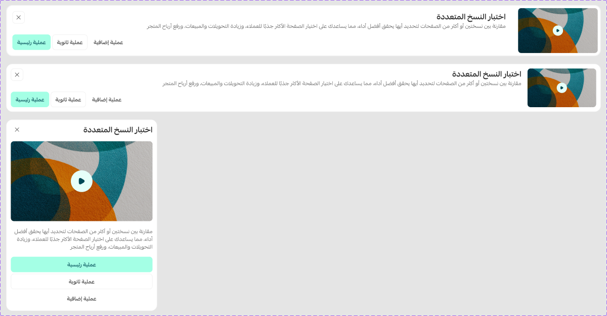

# Learn More

Figma node `26295:10177` · [open in Figma](https://www.figma.com/design/dnmyqzYKK9dUJjVHuIWMDS/?node-id=26295-10177)

## Learn More

Node `26295:10177` · 3 variants · [open](https://www.figma.com/design/dnmyqzYKK9dUJjVHuIWMDS/?node-id=26295-10177)

| Property | Values |
|---|---|
| `Type` | `Default`, `Desktop`, `Mobile` |
| `Size` | `Default`, `Small` |

All variants

| Variant | Node | Size |
|---|---|---|
| Type=Desktop, Size=Default | `26295:10178` | 1536×132 |
| Type=Default, Size=Small | `26295:10193` | 1536×124 |
| Type=Mobile, Size=Default | `26295:10209` | 390×494.487 |

