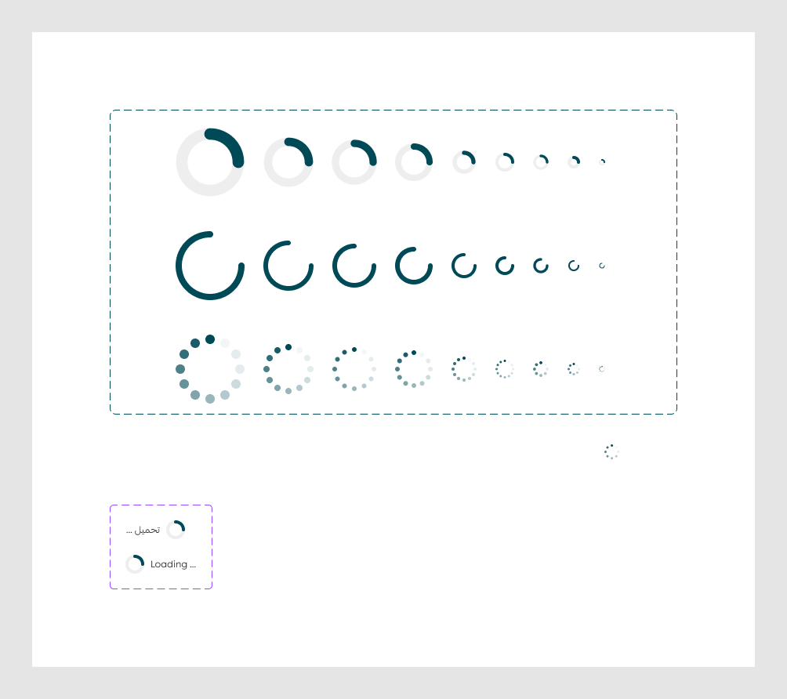

# Loader

Figma node `27716:13434` · [open in Figma](https://www.figma.com/design/dnmyqzYKK9dUJjVHuIWMDS/?node-id=27716-13434)

Design-to-code specs: [loading-indicator](../specs/loading-indicator.md)

## _LoadingIndicator *(internal, underscore-prefixed)*

Node `27716:13237` · 27 variants · [open](https://www.figma.com/design/dnmyqzYKK9dUJjVHuIWMDS/?node-id=27716-13237)

| Property | Values |
|---|---|
| `Size` | `lg- 56px`, `md- 48px`, `sm- 32px`, `xl- 64px`, `xs- 24px`, `xxl- 88px`, `xxs- 20px`, `xxxs- 16px`, `xxxxs-8px` |
| `Type` | `Dots`, `Line`, `Spinner` |

All variants

| Variant | Node | Size |
|---|---|---|
| Size=xxl- 88px, Type=Spinner | `27716:13238` | 88×88 |
| Size=xxl- 88px, Type=Dots | `27716:13240` | 88×88 |
| Size=xl- 64px, Type=Dots | `27716:13254` | 64×64 |
| Size=lg- 56px, Type=Dots | `27716:13268` | 56×56 |
| Size=md- 48px, Type=Dots | `27716:13282` | 48×48 |
| Size=sm- 32px, Type=Dots | `27716:13296` | 32×32 |
| Size=xs- 24px, Type=Dots | `27716:13310` | 24×24 |
| Size=xxxs- 16px, Type=Dots | `27716:13324` | 16×16 |
| Size=xxs- 20px, Type=Dots | `27716:13334` | 20×20 |
| Size=xxxxs-8px, Type=Dots | `27716:13344` | 8×8 |
| Size=xl- 64px, Type=Spinner | `27716:13354` | 64×64 |
| Size=lg- 56px, Type=Spinner | `27716:13356` | 56×56 |
| Size=md- 48px, Type=Spinner | `27716:13358` | 48×48 |
| Size=sm- 32px, Type=Spinner | `27716:13360` | 32×32 |
| Size=xs- 24px, Type=Line | `27716:13362` | 24×24 |
| Size=sm- 32px, Type=Line | `27716:13366` | 32×32 |
| Size=md- 48px, Type=Line | `27716:13370` | 48×48 |
| Size=lg- 56px, Type=Line | `27716:13374` | 56×56 |
| Size=xl- 64px, Type=Line | `27716:13378` | 64×64 |
| Size=xxl- 88px, Type=Line | `27716:13382` | 88×88 |
| Size=xxs- 20px, Type=Line | `27716:13386` | 20×20 |
| Size=xs- 24px, Type=Spinner | `27716:13390` | 24×24 |
| Size=xxxs- 16px, Type=Line | `27716:13392` | 16×16 |
| Size=xxxxs-8px, Type=Line | `27716:13396` | 8×8 |
| Size=xxxs- 16px, Type=Spinner | `27716:13400` | 16×16 |
| Size=xxxxs-8px, Type=Spinner | `27716:13402` | 8×8 |
| Size=xxs- 20px, Type=Spinner | `27716:13404` | 20×20 |

## Loading

Node `27716:13407` · 2 variants · [open](https://www.figma.com/design/dnmyqzYKK9dUJjVHuIWMDS/?node-id=27716-13407)

| Property | Values |
|---|---|
| `Language` | `Arabic`, `English` |

All variants

| Variant | Node | Size |
|---|---|---|
| Language=Arabic | `27716:13408` | 76×24 |
| Language=English | `27716:13413` | 91×24 |

