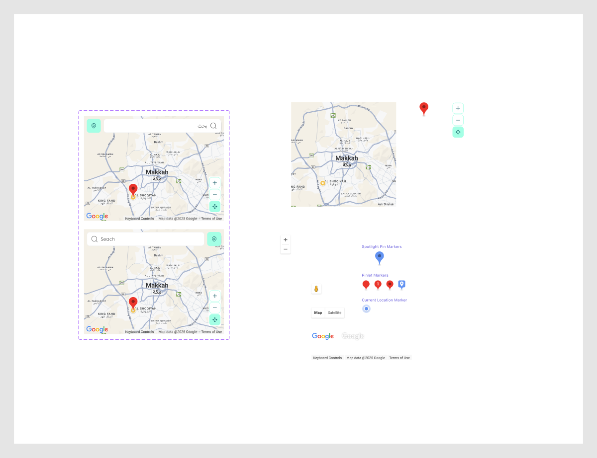

# Maps

Figma node `27743:11899` · [open in Figma](https://www.figma.com/design/dnmyqzYKK9dUJjVHuIWMDS/?node-id=27743-11899)

## Maps

Node `15570:51682` · 2 variants · [open](https://www.figma.com/design/dnmyqzYKK9dUJjVHuIWMDS/?node-id=15570-51682)

| Property | Values |
|---|---|
| `Language` | `Default`, `English` |

All variants

| Variant | Node | Size |
|---|---|---|
| Language=Default | `15570:51456` | 400×300 |
| Language=English | `15571:479` | 400×300 |

## Standalone components

| Name | Node | Size |
|---|---|---|
| Controls / Map Type | `15570:51423` | 94×29 |
| Controls / Street View | `15570:51428` | 28×28 |
| Controls / Zoom Controls | `15570:51431` | 28×53 |
| Google | `15570:51439` | 66×26 |
| Controls / Google Logo / White | `15570:51447` | 66×26 |
| controls | `15570:51449` | 287×15 |
| Markers / Pinlet Marker | `15570:51473` | 24×32 |
| Markers / Near Pinlet Marker | `15570:51479` | 24×32 |
| Markers / Pinlet Marker with Number | `15570:51481` | 24×32 |
| Markers / Pinlet Marker with Dot | `15570:51483` | 24×32 |
| Markers / Near Pin Marker | `15570:51492` | 27×43 |
| Markers / Current Location Marker | `15570:51494` | 24×24 |
| _MapImage | `15570:51466` | 300×300 |
| pin | `15570:51485` | 27×43 |
| _buttons container | `15571:663` | 36×104 |
