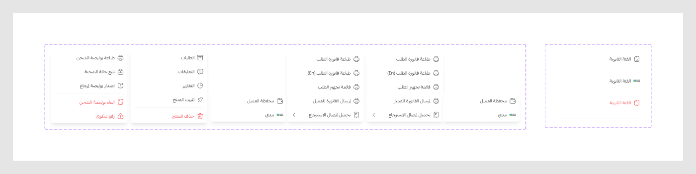

# More Menu

Figma node `27743:12927` · [open in Figma](https://www.figma.com/design/dnmyqzYKK9dUJjVHuIWMDS/?node-id=27743-12927)

Design-to-code specs: [more-menu](../specs/more-menu.md)

## _moreItems *(internal, underscore-prefixed)*

Node `19764:2483` · 4 variants · [open](https://www.figma.com/design/dnmyqzYKK9dUJjVHuIWMDS/?node-id=19764-2483)

| Property | Values |
|---|---|
| `Type` | `Icon`, `Image`, `Sperator` |
| `--danger` | `Off`, `On` |

All variants

| Variant | Node | Size |
|---|---|---|
| Type=Icon, --danger=Off | `19764:2487` | 286×44 |
| Type=Image, --danger=Off | `19859:17905` | 286×44 |
| Type=Icon, --danger=On | `19764:6825` | 286×44 |
| Type=Sperator, --danger=Off | `19764:6824` | 286×8 |

## More Menu

Node `19856:16147` · 4 variants · [open](https://www.figma.com/design/dnmyqzYKK9dUJjVHuIWMDS/?node-id=19856-16147)

| Property | Values |
|---|---|
| `Type` | `Type1`, `Type2`, `Type3` |
| `Dir` | `Left`, `Off`, `Right` |

All variants

| Variant | Node | Size |
|---|---|---|
| Type=Type1, Dir=Off | `19764:6970` | 240×228 |
| Type=Type2, Dir=Off | `19870:25736` | 240×228 |
| Type=Type3, Dir=Left | `19859:17923` | 480×220 |
| Type=Type3, Dir=Right | `19866:25484` | 480×220 |

