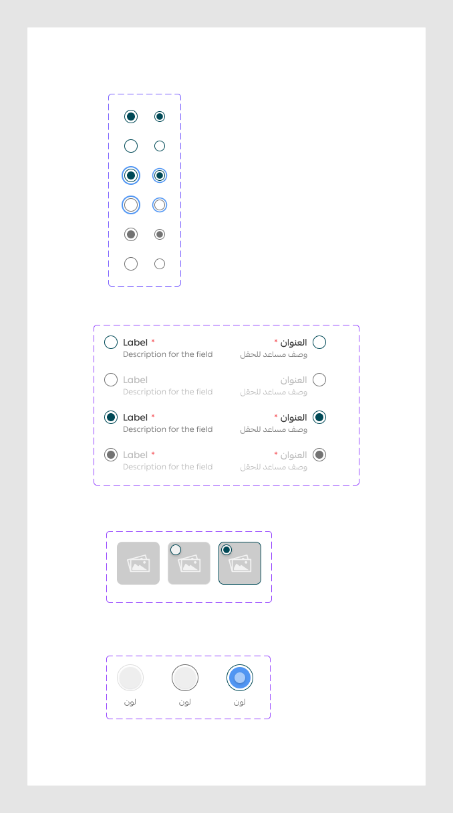

# radio Buttton

Figma node `27716:13113` · [open in Figma](https://www.figma.com/design/dnmyqzYKK9dUJjVHuIWMDS/?node-id=27716-13113)

Design-to-code specs: [radio](../specs/radio.md)

## radio

Node `12459:14978` · 12 variants · [open](https://www.figma.com/design/dnmyqzYKK9dUJjVHuIWMDS/?node-id=12459-14978)

| Property | Values |
|---|---|
| `Active` | `Off`, `On` |
| `Status` | `Default`, `Disabled`, `Focus` |
| `size` | `--md`, `--sm` |

All variants

| Variant | Node | Size |
|---|---|---|
| Active=On, Status=Default, size=--md | `12459:14981` | 20×20 |
| Active=On, Status=Default, size=--sm | `15304:69112` | 16×16 |
| Active=Off, Status=Default, size=--md | `12459:14991` | 20×20 |
| Active=Off, Status=Default, size=--sm | `15304:69114` | 16×16 |
| Active=On, Status=Focus, size=--md | `12459:14984` | 20×20 |
| Active=On, Status=Focus, size=--sm | `15304:69115` | 16×16 |
| Active=Off, Status=Focus, size=--md | `12459:14995` | 20×20 |
| Active=Off, Status=Focus, size=--sm | `15304:69117` | 16×16 |
| Active=On, Status=Disabled, size=--md | `12459:14987` | 20×20 |
| Active=On, Status=Disabled, size=--sm | `15304:69118` | 16×16 |
| Active=Off, Status=Disabled, size=--md | `12459:14997` | 20×20 |
| Active=Off, Status=Disabled, size=--sm | `15304:69120` | 16×16 |

## radiofield

Node `15162:151314` · 8 variants · [open](https://www.figma.com/design/dnmyqzYKK9dUJjVHuIWMDS/?node-id=15162-151314)

| Property | Values |
|---|---|
| `Language` | `Arabic`, `English` |
| `--disabled` | `false`, `true` |
| `--selected` | `false`, `true` |

All variants

| Variant | Node | Size |
|---|---|---|
| Language=English, --disabled=false, --selected=false | `15162:151315` | 163×36 |
| Language=English, --disabled=false, --selected=true | `15309:76069` | 163×36 |
| Language=Arabic, --disabled=false, --selected=false | `15162:151325` | 129×36 |
| Language=Arabic, --disabled=false, --selected=true | `15309:76079` | 129×36 |
| Language=English, --disabled=true, --selected=false | `15162:151335` | 163×36 |
| Language=English, --disabled=true, --selected=true | `15309:76089` | 163×36 |
| Language=Arabic, --disabled=true, --selected=false | `15162:151345` | 129×36 |
| Language=Arabic, --disabled=true, --selected=true | `15309:76099` | 129×36 |

## radioImage

Node `15304:64331` · 3 variants · [open](https://www.figma.com/design/dnmyqzYKK9dUJjVHuIWMDS/?node-id=15304-64331)

| Property | Values |
|---|---|
| `state` | `--defaullt`, `--hover`, `--selected` |

All variants

| Variant | Node | Size |
|---|---|---|
| state=--defaullt | `15304:64329` | 64×64 |
| state=--hover | `15309:82121` | 64×64 |
| state=--selected | `15304:64338` | 64×64 |

## radioColor

Node `15304:75773` · 3 variants · [open](https://www.figma.com/design/dnmyqzYKK9dUJjVHuIWMDS/?node-id=15304-75773)

| Property | Values |
|---|---|
| `state` | `--default`, `--hover`, `--selected` |

All variants

| Variant | Node | Size |
|---|---|---|
| state=--default | `15304:75771` | 44×68 |
| state=--hover | `15345:82580` | 44×68 |
| state=--selected | `15304:75796` | 44×68 |

