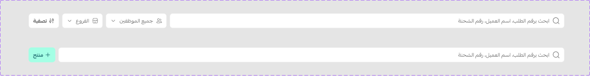

# searchbar

Figma node `15551:390797` · [open in Figma](https://www.figma.com/design/dnmyqzYKK9dUJjVHuIWMDS/?node-id=15551-390797)

## searchbar

Node `15551:390797` · 2 variants · [open](https://www.figma.com/design/dnmyqzYKK9dUJjVHuIWMDS/?node-id=15551-390797)

| Property | Values |
|---|---|
| `variant` | `btn-only`, `full` |

All variants

| Variant | Node | Size |
|---|---|---|
| variant=full | `15551:386679` | 1536×72 |
| variant=btn-only | `15551:390798` | 1536×72 |

