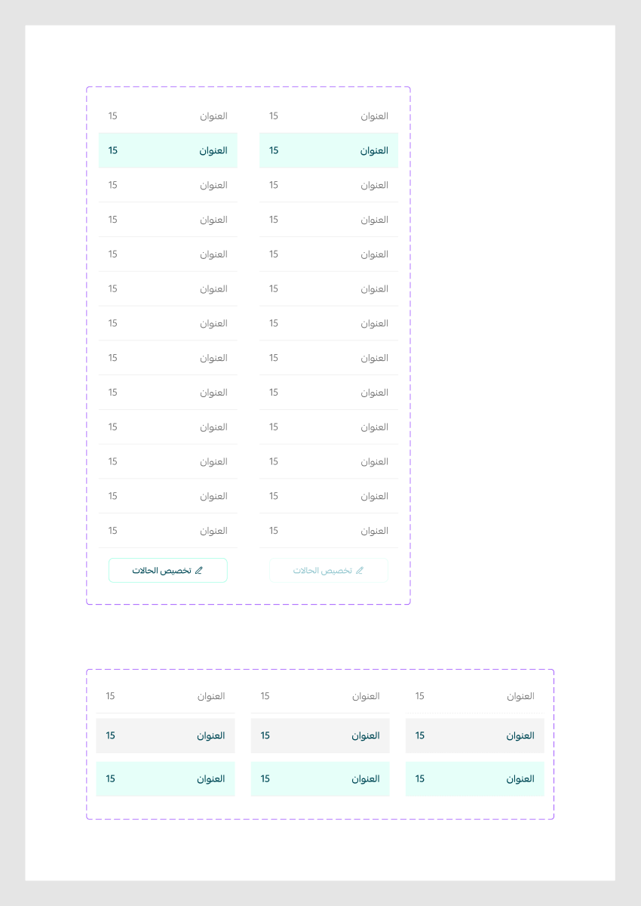

# Side menu

Figma node `27743:12073` · [open in Figma](https://www.figma.com/design/dnmyqzYKK9dUJjVHuIWMDS/?node-id=27743-12073)

Design-to-code specs: [side-menu](../specs/side-menu.md)

## Side menu

Node `15572:55610` · 2 variants · [open](https://www.figma.com/design/dnmyqzYKK9dUJjVHuIWMDS/?node-id=15572-55610)

| Property | Values |
|---|---|
| `Status` | `default`, `disabled` |

All variants

| Variant | Node | Size |
|---|---|---|
| Status=default | `15572:56380` | 225×800 |
| Status=disabled | `15572:56575` | 225×800 |

## sidemenu tab

Node `15572:54629` · 9 variants · [open](https://www.figma.com/design/dnmyqzYKK9dUJjVHuIWMDS/?node-id=15572-54629)

| Property | Values |
|---|---|
| `status` | `--active`, `--default`, `--hover` |
| `variant` | `first`, `last`, `middle` |

All variants

| Variant | Node | Size |
|---|---|---|
| status=--default, variant=middle | `15572:54609` | 225×56 |
| status=--default, variant=first | `15572:56529` | 225×56 |
| status=--default, variant=last | `15572:56545` | 225×56 |
| status=--active, variant=middle | `15572:54630` | 225×56 |
| status=--hover, variant=middle | `16245:126181` | 225×56 |
| status=--active, variant=first | `15572:56537` | 225×56 |
| status=--hover, variant=first | `16245:126179` | 225×56 |
| status=--active, variant=last | `15572:56553` | 225×56 |
| status=--hover, variant=last | `16245:126183` | 225×56 |

