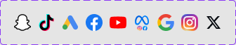

# Social media icons

Figma node `21732:67623` · [open in Figma](https://www.figma.com/design/dnmyqzYKK9dUJjVHuIWMDS/?node-id=21732-67623)

## Social media icons

Node `21732:67623` · 9 variants · [open](https://www.figma.com/design/dnmyqzYKK9dUJjVHuIWMDS/?node-id=21732-67623)

| Property | Values |
|---|---|
| `Name` | `Facebook`, `Google`, `Google_ads`, `Meta`, `Snapchat`, `TikTok`, `Youtube`, `instagram`, `twitter x logo` |

All variants

| Variant | Node | Size |
|---|---|---|
| Name=Snapchat | `21732:67524` | 24×24 |
| Name=TikTok | `21732:67523` | 24×24 |
| Name=Google_ads | `21732:67522` | 24.0006×24 |
| Name=Facebook | `21732:67584` | 24×24 |
| Name=Youtube | `21732:67614` | 24×24 |
| Name=Meta | `21732:67616` | 24×24 |
| Name=Google | `21732:67576` | 24×24 |
| Name=instagram | `21732:67513` | 24×24 |
| Name=twitter x logo | `21732:67570` | 24×24 |

