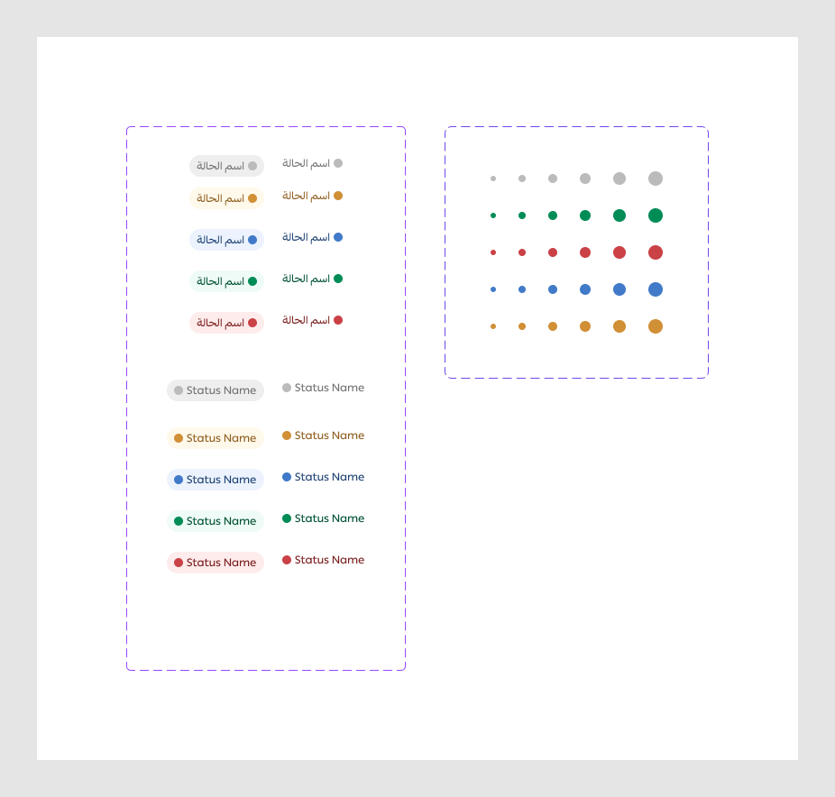
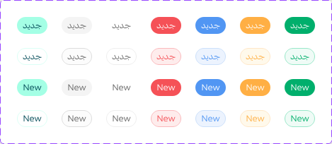

# Status

Figma node `27716:13442` · [open in Figma](https://www.figma.com/design/dnmyqzYKK9dUJjVHuIWMDS/?node-id=27716-13442)

Design-to-code specs: [status-badge](../specs/status-badge.md)

### Figma exports (`figma/exports/tag/`, updated 2026-09-28)

**tag**

## _Base Status Indicator *(internal, underscore-prefixed)*

Node `15339:59259` · 30 variants · [open](https://www.figma.com/design/dnmyqzYKK9dUJjVHuIWMDS/?node-id=15339-59259)

| Property | Values |
|---|---|
| `Color` | `--danger`, `--info`, `--neutral`, `--success`, `--warning` |
| `Size` | `2xl`, `lg`, `md`, `sm`, `xl`, `xs` |

All variants

| Variant | Node | Size |
|---|---|---|
| Color=--neutral, Size=xs | `15339:59260` | 6×6 |
| Color=--neutral, Size=sm | `15339:59263` | 8×8 |
| Color=--neutral, Size=md | `15339:59266` | 10×10 |
| Color=--neutral, Size=lg | `15339:59269` | 12×12 |
| Color=--neutral, Size=xl | `15339:59272` | 14×14 |
| Color=--neutral, Size=2xl | `15339:59275` | 16×16 |
| Color=--success, Size=xs | `15339:59261` | 6×6 |
| Color=--success, Size=sm | `15339:59264` | 8×8 |
| Color=--success, Size=md | `15339:59267` | 10×10 |
| Color=--success, Size=lg | `15339:59270` | 12×12 |
| Color=--success, Size=xl | `15339:59273` | 14×14 |
| Color=--success, Size=2xl | `15339:59276` | 16×16 |
| Color=--danger, Size=xs | `15339:59262` | 6×6 |
| Color=--danger, Size=sm | `15339:59265` | 8×8 |
| Color=--danger, Size=md | `15339:59268` | 10×10 |
| Color=--danger, Size=lg | `15339:59271` | 12×12 |
| Color=--danger, Size=xl | `15339:59274` | 14×14 |
| Color=--danger, Size=2xl | `15339:59277` | 16×16 |
| Color=--info, Size=xs | `15342:59426` | 6×6 |
| Color=--info, Size=sm | `15342:59427` | 8×8 |
| Color=--info, Size=md | `15342:59428` | 10×10 |
| Color=--info, Size=lg | `15342:59429` | 12×12 |
| Color=--info, Size=xl | `15342:59430` | 14×14 |
| Color=--info, Size=2xl | `15342:59431` | 16×16 |
| Color=--warning, Size=xs | `15342:59438` | 6×6 |
| Color=--warning, Size=sm | `15342:59439` | 8×8 |
| Color=--warning, Size=md | `15342:59440` | 10×10 |
| Color=--warning, Size=lg | `15342:59441` | 12×12 |
| Color=--warning, Size=xl | `15342:59442` | 14×14 |
| Color=--warning, Size=2xl | `15342:59443` | 16×16 |

## Status

Node `15342:59936` · 20 variants · [open](https://www.figma.com/design/dnmyqzYKK9dUJjVHuIWMDS/?node-id=15342-59936)

| Property | Values |
|---|---|
| `Language` | `Arabic`, `English` |
| `Type` | `--danger`, `--info`, `--neutral`, `--success`, `--warning` |
| `Appearance` | `--strong`, `--subtle` |

All variants

| Variant | Node | Size |
|---|---|---|
| Language=Arabic, Type=--warning, Appearance=--strong | `15342:59964` | 83×24 |
| Language=Arabic, Type=--neutral, Appearance=--strong | `15677:11171` | 83×24 |
| Language=Arabic, Type=--warning, Appearance=--subtle | `15342:59937` | 67×16 |
| Language=Arabic, Type=--neutral, Appearance=--subtle | `15677:11175` | 67×16 |
| Language=Arabic, Type=--info, Appearance=--strong | `15342:59972` | 83×24 |
| Language=Arabic, Type=--info, Appearance=--subtle | `15342:59940` | 67×16 |
| Language=Arabic, Type=--success, Appearance=--strong | `15342:60121` | 83×24 |
| Language=Arabic, Type=--success, Appearance=--subtle | `15342:59943` | 67×16 |
| Language=Arabic, Type=--danger, Appearance=--strong | `15342:60130` | 83×24 |
| Language=Arabic, Type=--danger, Appearance=--subtle | `15342:59946` | 67×16 |
| Language=English, Type=--warning, Appearance=--strong | `15342:60176` | 108×24 |
| Language=English, Type=--neutral, Appearance=--strong | `16307:158107` | 108×24 |
| Language=English, Type=--warning, Appearance=--subtle | `15342:60173` | 92×16 |
| Language=English, Type=--neutral, Appearance=--subtle | `16307:158111` | 92×16 |
| Language=English, Type=--info, Appearance=--strong | `15342:60179` | 108×24 |
| Language=English, Type=--info, Appearance=--subtle | `15342:60188` | 92×16 |
| Language=English, Type=--success, Appearance=--strong | `15342:60182` | 108×24 |
| Language=English, Type=--success, Appearance=--subtle | `15342:60191` | 92×16 |
| Language=English, Type=--danger, Appearance=--strong | `15342:60185` | 108×24 |
| Language=English, Type=--danger, Appearance=--subtle | `15342:60194` | 92×16 |

