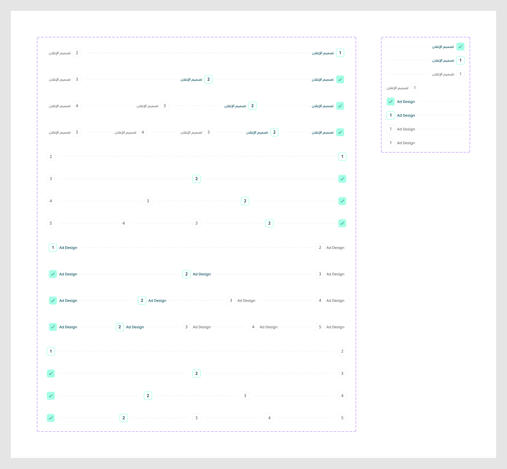

# Steps

Figma node `27743:46455` · [open in Figma](https://www.figma.com/design/dnmyqzYKK9dUJjVHuIWMDS/?node-id=27743-46455)

## _Step base *(internal, underscore-prefixed)*

Node `24006:17138` · 8 variants · [open](https://www.figma.com/design/dnmyqzYKK9dUJjVHuIWMDS/?node-id=24006-17138)

| Property | Values |
|---|---|
| `Type` | `Active`, `Default`, `Last`, `Success` |
| `Language` | `Arabic`, `English` |

All variants

| Variant | Node | Size |
|---|---|---|
| Type=Success, Language=Arabic | `24006:17139` | 295.674×32 |
| Type=Active, Language=Arabic | `24006:17144` | 295.674×32 |
| Type=Default, Language=Arabic | `24006:17149` | 295.674×32 |
| Type=Last, Language=Arabic | `24531:23019` | 123×32 |
| Type=Success, Language=English | `24006:17154` | 295.674×32 |
| Type=Active, Language=English | `24006:17159` | 295.674×32 |
| Type=Default, Language=English | `24006:17164` | 295.674×32 |
| Type=Last, Language=English | `24531:23024` | 108×32 |

## Steps

Node `24006:17190` · 16 variants · [open](https://www.figma.com/design/dnmyqzYKK9dUJjVHuIWMDS/?node-id=24006-17190)

| Property | Values |
|---|---|
| `Count` | `2`, `3`, `4`, `5` |
| `Type` | `Desktop`, `Mobile` |
| `Language` | `Arabic`, `English` |

All variants

| Variant | Node | Size |
|---|---|---|
| Count=2, Type=Desktop, Language=Arabic | `24006:17191` | 1166×80 |
| Count=3, Type=Desktop, Language=Arabic | `24006:17189` | 1166×80 |
| Count=4, Type=Desktop, Language=Arabic | `24006:17208` | 1166×80 |
| Count=5, Type=Desktop, Language=Arabic | `24006:17230` | 1166×80 |
| Count=2, Type=Mobile, Language=Arabic | `24006:35969` | 1166×64 |
| Count=3, Type=Mobile, Language=Arabic | `24006:35972` | 1166×64 |
| Count=4, Type=Mobile, Language=Arabic | `24006:35976` | 1166×64 |
| Count=5, Type=Mobile, Language=Arabic | `24006:35981` | 1166×64 |
| Count=2, Type=Desktop, Language=English | `24142:33061` | 1166×80 |
| Count=3, Type=Desktop, Language=English | `24142:33064` | 1166×80 |
| Count=4, Type=Desktop, Language=English | `24142:33068` | 1166×80 |
| Count=5, Type=Desktop, Language=English | `24142:33073` | 1166×80 |
| Count=2, Type=Mobile, Language=English | `24142:33079` | 1166×64 |
| Count=3, Type=Mobile, Language=English | `24142:33082` | 1166×64 |
| Count=4, Type=Mobile, Language=English | `24142:33086` | 1166×64 |
| Count=5, Type=Mobile, Language=English | `24142:33091` | 1166×64 |

