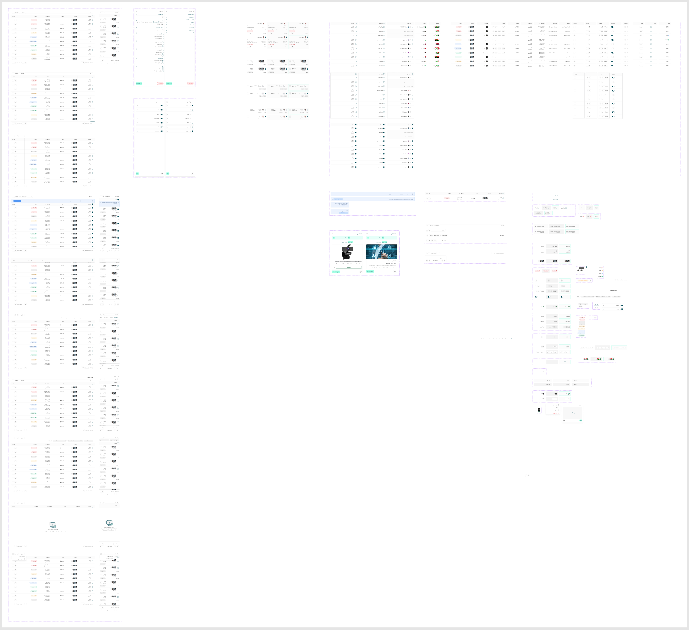

# Table

Figma node `27743:38351` · [open in Figma](https://www.figma.com/design/dnmyqzYKK9dUJjVHuIWMDS/?node-id=27743-38351)

## Table/Cell/Flag_with_text

Node `21566:55897` · 3 variants · [open](https://www.figma.com/design/dnmyqzYKK9dUJjVHuIWMDS/?node-id=21566-55897)

| Property | Values |
|---|---|
| `Type` | `Text + Flag` |
| `Status` | `Default`, `Edit`, `Hover` |

All variants

| Variant | Node | Size |
|---|---|---|
| Type=Text + Flag, Status=Default | `21566:55898` | 195×72 |
| Type=Text + Flag, Status=Hover | `21566:55903` | 195×72 |
| Type=Text + Flag, Status=Edit | `21566:55908` | 195×72 |

## Table/Cell/Markets

Node `26052:28536` · 3 variants · [open](https://www.figma.com/design/dnmyqzYKK9dUJjVHuIWMDS/?node-id=26052-28536)

| Property | Values |
|---|---|
| `Type` | `Text + Flag` |
| `Status` | `Default`, `Edit`, `Hover` |

All variants

| Variant | Node | Size |
|---|---|---|
| Type=Text + Flag, Status=Default | `26052:28537` | 195×72 |
| Type=Text + Flag, Status=Hover | `26052:28542` | 195×72 |
| Type=Text + Flag, Status=Edit | `26052:28547` | 195×72 |

## Table/Cell/Actions

Node `21566:55913` · 12 variants · [open](https://www.figma.com/design/dnmyqzYKK9dUJjVHuIWMDS/?node-id=21566-55913)

| Property | Values |
|---|---|
| `Type` | `Actions Toggle`, `Actions one icon`, `Actions three icons`, `Actions two icons` |
| `Status` | `Default`, `Focus`, `Hover` |

All variants

| Variant | Node | Size |
|---|---|---|
| Type=Actions one icon, Status=Default | `21566:55914` | 195×72 |
| Type=Actions one icon, Status=Hover | `21566:55917` | 195×72 |
| Type=Actions one icon, Status=Focus | `21566:55920` | 195×72 |
| Type=Actions two icons, Status=Default | `21566:55923` | 195×72 |
| Type=Actions two icons, Status=Hover | `21566:55927` | 195×72 |
| Type=Actions two icons, Status=Focus | `21566:55931` | 195×72 |
| Type=Actions three icons, Status=Default | `21566:55935` | 195×72 |
| Type=Actions three icons, Status=Hover | `21566:55940` | 195×72 |
| Type=Actions three icons, Status=Focus | `21566:55945` | 195×72 |
| Type=Actions Toggle, Status=Default | `21566:55950` | 195×72 |
| Type=Actions Toggle, Status=Hover | `21566:55952` | 195×72 |
| Type=Actions Toggle, Status=Focus | `21566:55954` | 195×72 |

## Table/Cell/Status

Node `21566:55956` · 3 variants · [open](https://www.figma.com/design/dnmyqzYKK9dUJjVHuIWMDS/?node-id=21566-55956)

| Property | Values |
|---|---|
| `Status` | `Default`, `Focus`, `Hover` |

All variants

| Variant | Node | Size |
|---|---|---|
| Status=Default | `21566:55957` | 125×72 |
| Status=Hover | `21566:55959` | 125×72 |
| Status=Focus | `21566:55961` | 125×72 |

## Table/Cell/Tags

Node `23084:46349` · 3 variants · [open](https://www.figma.com/design/dnmyqzYKK9dUJjVHuIWMDS/?node-id=23084-46349)

| Property | Values |
|---|---|
| `Status` | `Default`, `Focus`, `Hover` |

All variants

| Variant | Node | Size |
|---|---|---|
| Status=Default | `23084:46350` | 261×72 |
| Status=Hover | `23084:46352` | 261×72 |
| Status=Focus | `23084:46354` | 261×72 |

## Table/Cell/Products

Node `21566:55963` · 3 variants · [open](https://www.figma.com/design/dnmyqzYKK9dUJjVHuIWMDS/?node-id=21566-55963)

| Property | Values |
|---|---|
| `Status` | `Default`, `Focus`, `Hover` |
| `Hover` | `Off` |

All variants

| Variant | Node | Size |
|---|---|---|
| Status=Default, Hover=Off | `21566:55964` | 195×72 |
| Status=Hover, Hover=Off | `21566:55971` | 195×72 |
| Status=Focus, Hover=Off | `21566:55978` | 195×72 |

## Table/Cell/Image

Node `22980:43225` · 6 variants · [open](https://www.figma.com/design/dnmyqzYKK9dUJjVHuIWMDS/?node-id=22980-43225)

| Property | Values |
|---|---|
| `Status` | `Default`, `Focus`, `Hover` |
| `Hover` | `Off` |
| `Empty` | `Off`, `On` |

All variants

| Variant | Node | Size |
|---|---|---|
| Status=Default, Hover=Off, Empty=Off | `22980:43226` | 195×72 |
| Status=Hover, Hover=Off, Empty=Off | `22980:43233` | 195×72 |
| Status=Focus, Hover=Off, Empty=Off | `22980:43240` | 195×72 |
| Status=Default, Hover=Off, Empty=On | `22980:43323` | 195×72 |
| Status=Hover, Hover=Off, Empty=On | `22980:43326` | 195×72 |
| Status=Focus, Hover=Off, Empty=On | `22980:43329` | 195×72 |

## Table/Cell/Amount

Node `21566:55985` · 6 variants · [open](https://www.figma.com/design/dnmyqzYKK9dUJjVHuIWMDS/?node-id=21566-55985)

| Property | Values |
|---|---|
| `Status` | `Default`, `Focus`, `Hover` |
| `Type` | `Default`, `price with text` |

All variants

| Variant | Node | Size |
|---|---|---|
| Status=Default, Type=Default | `21566:55986` | 195×72 |
| Status=Hover, Type=Default | `21566:55990` | 195×72 |
| Status=Focus, Type=Default | `21566:55995` | 195×72 |
| Status=Default, Type=price with text | `21663:40246` | 195×72 |
| Status=Hover, Type=price with text | `21663:40250` | 195×72 |
| Status=Focus, Type=price with text | `21663:40255` | 195×72 |

## Table/Cell/Name

Node `21566:55999` · 6 variants · [open](https://www.figma.com/design/dnmyqzYKK9dUJjVHuIWMDS/?node-id=21566-55999)

| Property | Values |
|---|---|
| `Status` | `Default`, `Focus`, `Hover` |
| `Two Lines` | `Off`, `On` |

All variants

| Variant | Node | Size |
|---|---|---|
| Status=Default, Two Lines=Off | `21566:56000` | 121×72 |
| Status=Hover, Two Lines=Off | `21566:56013` | 145×72 |
| Status=Focus, Two Lines=Off | `21566:56026` | 121×72 |
| Status=Default, Two Lines=On | `21566:56039` | 136×72 |
| Status=Hover, Two Lines=On | `21566:56054` | 160×72 |
| Status=Focus, Two Lines=On | `21566:56069` | 136×72 |

## Table/Cell/Varient

Node `23013:67068` · 3 variants · [open](https://www.figma.com/design/dnmyqzYKK9dUJjVHuIWMDS/?node-id=23013-67068)

| Property | Values |
|---|---|
| `Status` | `Default`, `Focus`, `Hover` |

All variants

| Variant | Node | Size |
|---|---|---|
| Status=Default | `23013:67069` | 91×72 |
| Status=Hover | `23013:67082` | 115×72 |
| Status=Focus | `23013:67096` | 91×72 |

## Table/Cell/Percentage

Node `25087:66216` · 3 variants · [open](https://www.figma.com/design/dnmyqzYKK9dUJjVHuIWMDS/?node-id=25087-66216)

| Property | Values |
|---|---|
| `Status` | `Default`, `Focus`, `Hover` |

All variants

| Variant | Node | Size |
|---|---|---|
| Status=Default | `25087:66217` | 100.688×72 |
| Status=Hover | `25087:66227` | 100.688×72 |
| Status=Focus | `25087:66238` | 100.688×72 |

## Table/Cell/SubName

Node `22632:45451` · 6 variants · [open](https://www.figma.com/design/dnmyqzYKK9dUJjVHuIWMDS/?node-id=22632-45451)

| Property | Values |
|---|---|
| `Status` | `Default`, `Focus`, `Hover` |
| `Two Lines` | `Off`, `On` |

All variants

| Variant | Node | Size |
|---|---|---|
| Status=Default, Two Lines=Off | `22632:45452` | 236×72 |
| Status=Hover, Two Lines=Off | `22632:45465` | 260×72 |
| Status=Focus, Two Lines=Off | `22632:45479` | 236×72 |
| Status=Default, Two Lines=On | `22632:45492` | 236×72 |
| Status=Hover, Two Lines=On | `22632:45507` | 260×72 |
| Status=Focus, Two Lines=On | `22632:45523` | 236×72 |

## Table/Cell/Data

Node `21566:56084` · 9 variants · [open](https://www.figma.com/design/dnmyqzYKK9dUJjVHuIWMDS/?node-id=21566-56084)

| Property | Values |
|---|---|
| `Type` | `Date & Time`, `Dropdown`, `Text` |
| `Status` | `Default`, `Edit`, `Hover` |

All variants

| Variant | Node | Size |
|---|---|---|
| Type=Text, Status=Default | `21566:56085` | 195×72 |
| Type=Text, Status=Hover | `21566:56092` | 195×72 |
| Type=Text, Status=Edit | `21566:56100` | 195×72 |
| Type=Dropdown, Status=Default | `21566:56107` | 195×72 |
| Type=Dropdown, Status=Hover | `21566:56114` | 195×72 |
| Type=Dropdown, Status=Edit | `21566:56121` | 195×72 |
| Type=Date & Time, Status=Default | `21566:56128` | 195×72 |
| Type=Date & Time, Status=Hover | `21566:56135` | 195×72 |
| Type=Date & Time, Status=Edit | `21566:56143` | 195×72 |

## Table/Cell/Sort

Node `21652:40484` · 3 variants · [open](https://www.figma.com/design/dnmyqzYKK9dUJjVHuIWMDS/?node-id=21652-40484)

| Property | Values |
|---|---|
| `Type` | `Text` |
| `Status` | `Default`, `Hover`, `press` |

All variants

| Variant | Node | Size |
|---|---|---|
| Type=Text, Status=Default | `21652:40485` | 195×72 |
| Type=Text, Status=Hover | `21652:40492` | 195×72 |
| Type=Text, Status=press | `21652:40500` | 195×72 |

## Table/Cell/Checkbox

Node `22210:41522` · 3 variants · [open](https://www.figma.com/design/dnmyqzYKK9dUJjVHuIWMDS/?node-id=22210-41522)

| Property | Values |
|---|---|
| `Type` | `Text` |
| `Status` | `Default`, `Hover`, `press` |

All variants

| Variant | Node | Size |
|---|---|---|
| Type=Text, Status=Default | `22210:41523` | 195×72 |
| Type=Text, Status=Hover | `22210:41530` | 195×72 |
| Type=Text, Status=press | `22210:41537` | 195×72 |

## Table/Cell/Disabled

Node `22602:43109` · 1 variants · [open](https://www.figma.com/design/dnmyqzYKK9dUJjVHuIWMDS/?node-id=22602-43109)

| Property | Values |
|---|---|
| `Type` | `Text` |
| `Status` | `Default` |

All variants

| Variant | Node | Size |
|---|---|---|
| Type=Text, Status=Default | `22602:43110` | 195×72 |

## Table/Cell/Chip

Node `22176:41713` · 6 variants · [open](https://www.figma.com/design/dnmyqzYKK9dUJjVHuIWMDS/?node-id=22176-41713)

| Property | Values |
|---|---|
| `Count` | `Multi`, `One` |
| `Status` | `Default`, `Hover`, `press` |

All variants

| Variant | Node | Size |
|---|---|---|
| Count=One, Status=Default | `22176:41714` | 195×72 |
| Count=One, Status=Hover | `22176:41721` | 195×72 |
| Count=One, Status=press | `22176:41728` | 195×72 |
| Count=Multi, Status=Default | `22176:42006` | 195×72 |
| Count=Multi, Status=Hover | `22176:42012` | 195×72 |
| Count=Multi, Status=press | `22176:42018` | 195×72 |

## Table/Cell/Header

Node `21566:56150` · 6 variants · [open](https://www.figma.com/design/dnmyqzYKK9dUJjVHuIWMDS/?node-id=21566-56150)

| Property | Values |
|---|---|
| `Scroll` | `Off` |
| `Type` | `Default`, `End`, `Start` |
| `Status` | `Default`, `Hover` |

All variants

| Variant | Node | Size |
|---|---|---|
| Scroll=Off, Type=Start, Status=Default | `21566:56151` | 300×48 |
| Scroll=Off, Type=Default, Status=Default | `21566:56158` | 300×48 |
| Scroll=Off, Type=End, Status=Default | `21566:56165` | 300×48 |
| Scroll=Off, Type=Start, Status=Hover | `21566:56172` | 300×48 |
| Scroll=Off, Type=Default, Status=Hover | `21566:56179` | 300×48 |
| Scroll=Off, Type=End, Status=Hover | `21566:56186` | 300×48 |

## _Table/Tabs Item *(internal, underscore-prefixed)*

Node `21566:56193` · 2 variants · [open](https://www.figma.com/design/dnmyqzYKK9dUJjVHuIWMDS/?node-id=21566-56193)

| Property | Values |
|---|---|
| `Active` | `Off`, `On` |

All variants

| Variant | Node | Size |
|---|---|---|
| Active=On | `21566:56198` | 87×36 |
| Active=Off | `21566:56200` | 85×36 |

## _Table/Filter Results *(internal, underscore-prefixed)*

Node `21566:56202` · 2 variants · [open](https://www.figma.com/design/dnmyqzYKK9dUJjVHuIWMDS/?node-id=21566-56202)

| Property | Values |
|---|---|
| `Type` | `Close`, `Default` |

All variants

| Variant | Node | Size |
|---|---|---|
| Type=Default | `21566:56203` | 156×32 |
| Type=Close | `21566:56206` | 65×32 |

## Table/Bulk Edit Sheet

Node `21566:56262` · 2 variants · [open](https://www.figma.com/design/dnmyqzYKK9dUJjVHuIWMDS/?node-id=21566-56262)

| Property | Values |
|---|---|
| `Open` | `Off`, `On` |

All variants

| Variant | Node | Size |
|---|---|---|
| Open=On | `21566:56263` | 500×1300 |
| Open=Off | `21566:56375` | 500×1300 |

## Table/Header

Node `21566:56487` · 4 variants · [open](https://www.figma.com/design/dnmyqzYKK9dUJjVHuIWMDS/?node-id=21566-56487)

| Property | Values |
|---|---|
| `Device` | `Desktop`, `Mobile` |
| `Selected` | `Off`, `On` |

All variants

| Variant | Node | Size |
|---|---|---|
| Device=Desktop, Selected=Off | `21566:56488` | 1368×72 |
| Device=Mobile, Selected=Off | `21566:56509` | 361×60 |
| Device=Desktop, Selected=On | `21566:56526` | 1368×72 |
| Device=Mobile, Selected=On | `21566:56542` | 361×60 |

## Table/Status

Node `21566:56551` · 9 variants · [open](https://www.figma.com/design/dnmyqzYKK9dUJjVHuIWMDS/?node-id=21566-56551)

| Property | Values |
|---|---|
| `Status` | `cancelled`, `deleted`, `delevery`, `deliverd`, `in prograss`, `retrevied`, `shipped`, `wating payment`, `wating review` |

All variants

| Variant | Node | Size |
|---|---|---|
| Status=cancelled | `21566:56552` | 93×28 |
| Status=deleted | `21566:56557` | 91×28 |
| Status=shipped | `21566:56562` | 100×28 |
| Status=retrevied | `21566:56567` | 92×28 |
| Status=in prograss | `21566:56572` | 102×28 |
| Status=delevery | `21566:56577` | 119×28 |
| Status=wating payment | `21566:56582` | 108×28 |
| Status=wating review | `21566:56587` | 124×28 |
| Status=deliverd | `21566:56592` | 105×28 |

## _Table/Chips *(internal, underscore-prefixed)*

Node `22634:43916` · 1 variants · [open](https://www.figma.com/design/dnmyqzYKK9dUJjVHuIWMDS/?node-id=22634-43916)

| Property | Values |
|---|---|
| `Status` | `Gray` |

All variants

| Variant | Node | Size |
|---|---|---|
| Status=Gray | `22634:43932` | 58×28 |

## Table/Cells

Node `21566:56625` · 32 variants · [open](https://www.figma.com/design/dnmyqzYKK9dUJjVHuIWMDS/?node-id=21566-56625)

| Property | Values |
|---|---|
| `Type` | `Actions Toggle`, `Actions one icon`, `Actions three icons`, `Actions two icons`, `Bulk Edit`, `Checkbox`, `Chips`, `Date & Time`, `Drop Down`, `Image + Text one line`, `Image + Text two lines`, `Images`, `Markets`, `Percentage`, `Price`, `Price with text`, `Products`, `Sort`, `Status`, `Tags`, `Text`, `Text + Flag` |
| `Scroll` | `Off`, `On` |
| `Selected` | `Off`, `On` |

All variants

| Variant | Node | Size |
|---|---|---|
| Type=Image + Text two lines, Scroll=Off, Selected=Off | `21566:56626` | 460×779 |
| Type=Image + Text two lines, Scroll=Off, Selected=On | `21566:56649` | 460×779 |
| Type=Image + Text two lines, Scroll=On, Selected=Off | `21566:56672` | 460×779 |
| Type=Image + Text one line, Scroll=Off, Selected=Off | `21566:56695` | 460×779 |
| Type=Bulk Edit, Scroll=Off, Selected=Off | `22633:41590` | 460×779 |
| Type=Bulk Edit, Scroll=On, Selected=Off | `22633:50839` | 460×779 |
| Type=Bulk Edit, Scroll=Off, Selected=On | `22633:51308` | 460×779 |
| Type=Image + Text one line, Scroll=Off, Selected=On | `21566:56718` | 460×779 |
| Type=Image + Text one line, Scroll=On, Selected=Off | `21566:56741` | 460×779 |
| Type=Text + Flag, Scroll=Off, Selected=Off | `21566:56764` | 195×779 |
| Type=Markets, Scroll=Off, Selected=Off | `26052:26776` | 195×779 |
| Type=Status, Scroll=Off, Selected=Off | `21566:56787` | 195×779 |
| Type=Tags, Scroll=Off, Selected=Off | `23084:46575` | 260×779 |
| Type=Chips, Scroll=Off, Selected=Off | `22176:40670` | 195×784 |
| Type=Percentage, Scroll=Off, Selected=Off | `25087:66472` | 195×779 |
| Type=Checkbox, Scroll=Off, Selected=Off | `22288:45705` | 195×779 |
| Type=Products, Scroll=Off, Selected=Off | `21566:56810` | 195×779 |
| Type=Images, Scroll=Off, Selected=Off | `22980:50563` | 195×779 |
| Type=Price, Scroll=Off, Selected=Off | `21566:56833` | 195×779 |
| Type=Price with text, Scroll=Off, Selected=Off | `21663:40146` | 195×779 |
| Type=Date & Time, Scroll=Off, Selected=Off | `21566:56856` | 195×779 |
| Type=Sort, Scroll=Off, Selected=Off | `21652:40744` | 100×779 |
| Type=Drop Down, Scroll=Off, Selected=Off | `21566:56879` | 195×779 |
| Type=Text, Scroll=Off, Selected=Off | `21566:56902` | 195×779 |
| Type=Actions one icon, Scroll=Off, Selected=Off | `21566:56925` | 195×779 |
| Type=Actions Toggle, Scroll=Off, Selected=Off | `21566:56948` | 195×779 |
| Type=Actions Toggle, Scroll=On, Selected=Off | `21566:56971` | 195×779 |
| Type=Actions one icon, Scroll=On, Selected=Off | `21566:56994` | 195×779 |
| Type=Actions two icons, Scroll=Off, Selected=Off | `21566:57017` | 195×779 |
| Type=Actions two icons, Scroll=On, Selected=Off | `21566:57040` | 195×779 |
| Type=Actions three icons, Scroll=Off, Selected=Off | `21566:57063` | 195×779 |
| Type=Actions three icons, Scroll=On, Selected=Off | `21566:57086` | 195×779 |

## Table

Node `21566:57110` · 18 variants · [open](https://www.figma.com/design/dnmyqzYKK9dUJjVHuIWMDS/?node-id=21566-57110)

| Property | Values |
|---|---|
| `Status` | `Actions Scroll`, `Default`, `Filter Results`, `More Menu`, `No Results`, `Scroll Down`, `Selected`, `Tabs`, `Title`, `Title Scroll` |
| `Device` | `Desktop`, `Mobile` |

All variants

| Variant | Node | Size |
|---|---|---|
| Status=Default, Device=Desktop | `21566:57111` | 1424×915 |
| Status=Tabs, Device=Desktop | `21599:49426` | 1424×967 |
| Status=Title, Device=Desktop | `21599:53165` | 1424×967 |
| Status=Filter Results, Device=Desktop | `21599:57010` | 1424×963 |
| Status=More Menu, Device=Desktop | `21621:90614` | 1424×915 |
| Status=No Results, Device=Desktop | `21599:75136` | 1424×800 |
| Status=Title Scroll, Device=Desktop | `21566:57121` | 1424×919 |
| Status=Actions Scroll, Device=Desktop | `21566:57132` | 1424×919 |
| Status=Selected, Device=Desktop | `21566:57143` | 1424×979 |
| Status=Scroll Down, Device=Desktop | `21566:57167` | 1424×812 |
| Status=Default, Device=Mobile | `21566:57184` | 347×915 |
| Status=Tabs, Device=Mobile | `21599:49436` | 347×967 |
| Status=Title, Device=Mobile | `21599:53175` | 347×967 |
| Status=Filter Results, Device=Mobile | `21599:57020` | 347×1015 |
| Status=More Menu, Device=Mobile | `21621:90624` | 347×1015 |
| Status=No Results, Device=Mobile | `21599:75146` | 347×800 |
| Status=Scroll Down, Device=Mobile | `21566:57216` | 347×812 |
| Status=Selected, Device=Mobile | `21566:57263` | 347×980 |

## Table/Footer

Node `21566:57384` · 2 variants · [open](https://www.figma.com/design/dnmyqzYKK9dUJjVHuIWMDS/?node-id=21566-57384)

| Property | Values |
|---|---|
| `Device` | `Desktop`, `Mobile` |

All variants

| Variant | Node | Size |
|---|---|---|
| Device=Desktop | `21566:57385` | 1356×64 |
| Device=Mobile | `21566:57404` | 361×104 |

## previewContainer

Node `21566:57441` · 2 variants · [open](https://www.figma.com/design/dnmyqzYKK9dUJjVHuIWMDS/?node-id=21566-57441)

| Property | Values |
|---|---|
| `Type` | `Blog`, `Default` |

All variants

| Variant | Node | Size |
|---|---|---|
| Type=Default | `21566:57442` | 568×726 |
| Type=Blog | `21566:57459` | 568×717 |

## Table/mobile Order

Node `21566:57479` · 6 variants · [open](https://www.figma.com/design/dnmyqzYKK9dUJjVHuIWMDS/?node-id=21566-57479)

| Property | Values |
|---|---|
| `Type` | `Default`, `Focus`, `Hover` |
| `Selected` | `Off`, `On` |
| `Deleted` | `Off` |

All variants

| Variant | Node | Size |
|---|---|---|
| Type=Default, Selected=Off, Deleted=Off | `21566:57480` | 347×122 |
| Type=Hover, Selected=Off, Deleted=Off | `21566:57506` | 347×122 |
| Type=Focus, Selected=Off, Deleted=Off | `21566:57532` | 347×122 |
| Type=Default, Selected=On, Deleted=Off | `21566:57558` | 347×122 |
| Type=Hover, Selected=On, Deleted=Off | `21566:57584` | 347×122 |
| Type=Focus, Selected=On, Deleted=Off | `21566:57610` | 347×122 |

## Table/mobile Default

Node `25358:32903` · 6 variants · [open](https://www.figma.com/design/dnmyqzYKK9dUJjVHuIWMDS/?node-id=25358-32903)

| Property | Values |
|---|---|
| `Type` | `Default`, `Focus`, `Hover` |
| `Selected` | `Off`, `On` |
| `Deleted` | `Off` |

All variants

| Variant | Node | Size |
|---|---|---|
| Type=Default, Selected=Off, Deleted=Off | `25358:32904` | 347×222 |
| Type=Hover, Selected=Off, Deleted=Off | `25358:32928` | 347×222 |
| Type=Focus, Selected=Off, Deleted=Off | `25358:32952` | 347×222 |
| Type=Default, Selected=On, Deleted=Off | `25358:32976` | 347×222 |
| Type=Hover, Selected=On, Deleted=Off | `25358:33000` | 347×222 |
| Type=Focus, Selected=On, Deleted=Off | `25358:33024` | 347×222 |

## Table/mobile Product

Node `21566:57714` · 6 variants · [open](https://www.figma.com/design/dnmyqzYKK9dUJjVHuIWMDS/?node-id=21566-57714)

| Property | Values |
|---|---|
| `Type` | `Default`, `Focus`, `Hover` |
| `Selected` | `Off`, `On` |
| `Deleted` | `Off` |

All variants

| Variant | Node | Size |
|---|---|---|
| Type=Default, Selected=Off, Deleted=Off | `21566:57715` | 347×110 |
| Type=Hover, Selected=Off, Deleted=Off | `21566:57733` | 347×110 |
| Type=Focus, Selected=Off, Deleted=Off | `21566:57751` | 347×110 |
| Type=Default, Selected=On, Deleted=Off | `21566:57769` | 347×110 |
| Type=Hover, Selected=On, Deleted=Off | `21566:57787` | 347×110 |
| Type=Focus, Selected=On, Deleted=Off | `21566:57805` | 347×110 |

## Table/mobile Customer

Node `21566:57883` · 6 variants · [open](https://www.figma.com/design/dnmyqzYKK9dUJjVHuIWMDS/?node-id=21566-57883)

| Property | Values |
|---|---|
| `Type` | `Default`, `Focus`, `Hover` |
| `Selected` | `Off`, `On` |
| `Deleted` | `Off` |

All variants

| Variant | Node | Size |
|---|---|---|
| Type=Default, Selected=Off, Deleted=Off | `21566:57884` | 347×98 |
| Type=Hover, Selected=Off, Deleted=Off | `21566:57903` | 347×98 |
| Type=Focus, Selected=Off, Deleted=Off | `21566:57922` | 347×98 |
| Type=Default, Selected=On, Deleted=Off | `21566:57941` | 347×98 |
| Type=Hover, Selected=On, Deleted=Off | `21566:57960` | 347×98 |
| Type=Focus, Selected=On, Deleted=Off | `21566:57979` | 347×98 |

## Table/Alertbox

Node `21566:58055` · 4 variants · [open](https://www.figma.com/design/dnmyqzYKK9dUJjVHuIWMDS/?node-id=21566-58055)

| Property | Values |
|---|---|
| `Hover` | `Off`, `On` |
| `Device` | `Desktop`, `Mobile` |

All variants

| Variant | Node | Size |
|---|---|---|
| Hover=Off, Device=Desktop | `21566:58056` | 1424×64 |
| Hover=On, Device=Desktop | `21566:58068` | 1424×64 |
| Hover=Off, Device=Mobile | `21566:58086` | 312×94 |
| Hover=On, Device=Mobile | `21566:58099` | 312×94 |

## Table/Delete

Node `21566:58118` · 2 variants · [open](https://www.figma.com/design/dnmyqzYKK9dUJjVHuIWMDS/?node-id=21566-58118)

| Property | Values |
|---|---|
| `Location` | `Data`, `Header` |
| `Scroll` | `Off` |
| `Selected` | `Off` |
| `Deleted` | `Off` |

All variants

| Variant | Node | Size |
|---|---|---|
| Location=Header, Scroll=Off, Selected=Off, Deleted=Off | `21566:58119` | 1356×48 |
| Location=Data, Scroll=Off, Selected=Off, Deleted=Off | `21566:58126` | 1356×72 |

## _Table/Panel Header *(internal, underscore-prefixed)*

Node `21566:58144` · 2 variants · [open](https://www.figma.com/design/dnmyqzYKK9dUJjVHuIWMDS/?node-id=21566-58144)

| Property | Values |
|---|---|
| `Size` | `Default`, `Small` |

All variants

| Variant | Node | Size |
|---|---|---|
| Size=Default | `21566:58145` | 437×44 |
| Size=Small | `21566:58159` | 437×40 |

## _Table/Product Image *(internal, underscore-prefixed)*

Node `21566:58182` · 2 variants · [open](https://www.figma.com/design/dnmyqzYKK9dUJjVHuIWMDS/?node-id=21566-58182)

| Property | Values |
|---|---|
| `Active` | `Off`, `On` |

All variants

| Variant | Node | Size |
|---|---|---|
| Active=Off | `21566:58183` | 32×32 |
| Active=On | `21566:58187` | 56×32 |

## _Table/Refresh Button *(internal, underscore-prefixed)*

Node `21566:58192` · 2 variants · [open](https://www.figma.com/design/dnmyqzYKK9dUJjVHuIWMDS/?node-id=21566-58192)

| Property | Values |
|---|---|
| `Active` | `Off`, `On` |

All variants

| Variant | Node | Size |
|---|---|---|
| Active=On | `21566:58193` | 190×32 |
| Active=Off | `21566:58195` | 32×32 |

## _Table/Pin *(internal, underscore-prefixed)*

Node `21566:58197` · 2 variants · [open](https://www.figma.com/design/dnmyqzYKK9dUJjVHuIWMDS/?node-id=21566-58197)

| Property | Values |
|---|---|
| `Pin` | `Off`, `On` |

All variants

| Variant | Node | Size |
|---|---|---|
| Pin=Off | `21566:58198` | 366×56 |
| Pin=On | `21566:58207` | 366×56 |

## Table/Edit Sheet

Node `21621:88460` · 2 variants · [open](https://www.figma.com/design/dnmyqzYKK9dUJjVHuIWMDS/?node-id=21621-88460)

| Property | Values |
|---|---|
| `Type` | `Default`, `Min Cells` |

All variants

| Variant | Node | Size |
|---|---|---|
| Type=Default | `21621:88459` | 500×1300 |
| Type=Min Cells | `21621:88458` | 500×1300 |

## Image

Node `22980:43290` · 2 variants · [open](https://www.figma.com/design/dnmyqzYKK9dUJjVHuIWMDS/?node-id=22980-43290)

| Property | Values |
|---|---|
| `Hover` | `Off`, `On` |

All variants

| Variant | Node | Size |
|---|---|---|
| Hover=Off | `22980:43291` | 32×32 |
| Hover=On | `22980:43293` | 32×32 |

## _Percentage *(internal, underscore-prefixed)*

Node `19558:17950` · 4 variants · [open](https://www.figma.com/design/dnmyqzYKK9dUJjVHuIWMDS/?node-id=19558-17950)

| Property | Values |
|---|---|
| `Type` | `100%`, `25%`, `50%`, `75%` |

All variants

| Variant | Node | Size |
|---|---|---|
| Type=25% | `19558:17946` | 58.6875×28 |
| Type=50% | `19558:17949` | 59.6875×28 |
| Type=75% | `19558:17948` | 58.6875×28 |
| Type=100% | `19558:17947` | 68.6875×28 |

## Standalone components

| Name | Node | Size |
|---|---|---|
| Table/Filter Results | `21566:55892` | 758×32 |
| Table/Tabs | `21566:57417` | 563×36 |
| _Table/Title | `21566:58173` | 686×36 |
| _Table/Default Icon | `21566:58180` | 20×20 |
| Table/Cell/Image | `22980:44064` | 240×184 |
| Upload Image | `22980:46998` | 356×308 |
