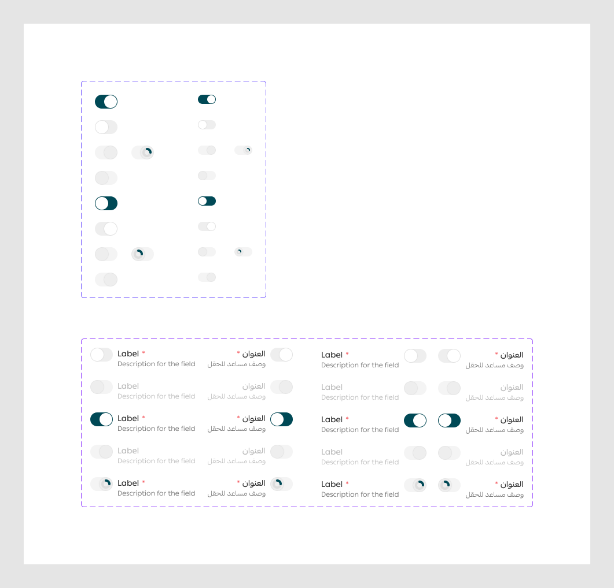

# Toggle

Figma node `27716:13230` · [open in Figma](https://www.figma.com/design/dnmyqzYKK9dUJjVHuIWMDS/?node-id=27716-13230)

## Toggle

Node `12411:21835` · 20 variants · [open](https://www.figma.com/design/dnmyqzYKK9dUJjVHuIWMDS/?node-id=12411-21835)

| Property | Values |
|---|---|
| `Language` | `Arabic`, `English` |
| `--selected` | `false`, `true` |
| `--disabled` | `false`, `true` |
| `--loading` | `false`, `true` |
| `size` | `default-24px`, `sm-16px` |

All variants

| Variant | Node | Size |
|---|---|---|
| Language=English, --selected=true, --disabled=false, --loading=false, size=default-24px | `12411:21836` | 39×24 |
| Language=English, --selected=true, --disabled=false, --loading=false, size=sm-16px | `15572:55240` | 31×16 |
| Language=English, --selected=false, --disabled=false, --loading=false, size=default-24px | `12411:21838` | 39×24 |
| Language=English, --selected=false, --disabled=false, --loading=false, size=sm-16px | `15572:55242` | 31×16 |
| Language=English, --selected=true, --disabled=true, --loading=false, size=default-24px | `12411:21840` | 39×24 |
| Language=English, --selected=true, --disabled=true, --loading=false, size=sm-16px | `15572:55244` | 31×16 |
| Language=English, --selected=true, --disabled=true, --loading=true, size=default-24px | `15336:178746` | 39×24 |
| Language=English, --selected=true, --disabled=true, --loading=true, size=sm-16px | `15572:55246` | 31×16 |
| Language=English, --selected=false, --disabled=true, --loading=false, size=default-24px | `12411:21842` | 39×24 |
| Language=English, --selected=false, --disabled=true, --loading=false, size=sm-16px | `15572:55251` | 31×16 |
| Language=Arabic, --selected=true, --disabled=false, --loading=false, size=default-24px | `12411:21844` | 39×24 |
| Language=Arabic, --selected=true, --disabled=false, --loading=false, size=sm-16px | `15572:55253` | 31×16 |
| Language=Arabic, --selected=false, --disabled=false, --loading=false, size=default-24px | `12411:21846` | 39×24 |
| Language=Arabic, --selected=false, --disabled=false, --loading=false, size=sm-16px | `15572:55255` | 31×16 |
| Language=Arabic, --selected=true, --disabled=true, --loading=false, size=default-24px | `12411:21848` | 39×24 |
| Language=Arabic, --selected=true, --disabled=true, --loading=false, size=sm-16px | `15572:55257` | 31×16 |
| Language=Arabic, --selected=true, --disabled=true, --loading=true, size=default-24px | `15336:178748` | 39×24 |
| Language=Arabic, --selected=true, --disabled=true, --loading=true, size=sm-16px | `15572:55259` | 31×16 |
| Language=Arabic, --selected=false, --disabled=true, --loading=false, size=default-24px | `12411:21850` | 39×24 |
| Language=Arabic, --selected=false, --disabled=true, --loading=false, size=sm-16px | `15572:55264` | 31×16 |

## toggleField

Node `15336:174644` · 20 variants · [open](https://www.figma.com/design/dnmyqzYKK9dUJjVHuIWMDS/?node-id=15336-174644)

| Property | Values |
|---|---|
| `Language` | `Arabic`, `English` |
| `togglePosition` | `ending`, `starting` |
| `--disabled` | `false`, `true` |
| `--selected` | `false`, `true` |
| `--loading` | `false`, `true` |

All variants

| Variant | Node | Size |
|---|---|---|
| Language=English, togglePosition=starting, --disabled=false, --selected=false, --loading=false | `15336:174645` | 182×36 |
| Language=English, togglePosition=ending, --disabled=false, --selected=false, --loading=false | `15633:20441` | 182×36 |
| Language=English, togglePosition=starting, --disabled=false, --selected=true, --loading=false | `15336:174655` | 182×36 |
| Language=English, togglePosition=ending, --disabled=false, --selected=true, --loading=false | `15633:20451` | 182×36 |
| Language=English, togglePosition=starting, --disabled=false, --selected=true, --loading=true | `15336:178654` | 182×36 |
| Language=English, togglePosition=ending, --disabled=false, --selected=true, --loading=true | `15633:20461` | 182×36 |
| Language=Arabic, togglePosition=starting, --disabled=false, --selected=false, --loading=false | `15336:174665` | 148×36 |
| Language=Arabic, togglePosition=ending, --disabled=false, --selected=false, --loading=false | `15633:20471` | 148×36 |
| Language=Arabic, togglePosition=starting, --disabled=false, --selected=true, --loading=false | `15336:174675` | 148×36 |
| Language=Arabic, togglePosition=ending, --disabled=false, --selected=true, --loading=false | `15633:20481` | 148×36 |
| Language=Arabic, togglePosition=starting, --disabled=false, --selected=true, --loading=true | `15336:178664` | 148×36 |
| Language=Arabic, togglePosition=ending, --disabled=false, --selected=true, --loading=true | `15633:20491` | 148×36 |
| Language=English, togglePosition=starting, --disabled=true, --selected=false, --loading=false | `15336:174685` | 182×36 |
| Language=English, togglePosition=ending, --disabled=true, --selected=false, --loading=false | `15633:20501` | 182×36 |
| Language=English, togglePosition=starting, --disabled=true, --selected=true, --loading=false | `15336:174695` | 182×36 |
| Language=English, togglePosition=ending, --disabled=true, --selected=true, --loading=false | `15633:20509` | 182×36 |
| Language=Arabic, togglePosition=starting, --disabled=true, --selected=false, --loading=false | `15336:174705` | 148×36 |
| Language=Arabic, togglePosition=ending, --disabled=true, --selected=false, --loading=false | `15633:20517` | 148×36 |
| Language=Arabic, togglePosition=starting, --disabled=true, --selected=true, --loading=false | `15336:174715` | 148×36 |
| Language=Arabic, togglePosition=ending, --disabled=true, --selected=true, --loading=false | `15633:20525` | 148×36 |

