# Screen layouts & UI patterns (from the merchant dashboard)

How the design system is actually composed in production at `s.salla.sa`. Captured from a
2-minute walkthrough of the dashboard (home → orders → products → marketing → shipping) on
2026-09-28; frames are in `docs/images/patterns/`. Use these as the reference layouts when
prototyping or reviewing a screen, and pair them with the components in
[storybook/](storybook/README.md) and the tokens in [foundations.md](foundations.md).

All screens are **RTL, Arabic-first**: primary content and headings hug the right edge, actions and
secondary panels sit on the left, chevrons point left for "forward", and numbers stay Western digits.

---

## 1. App shell

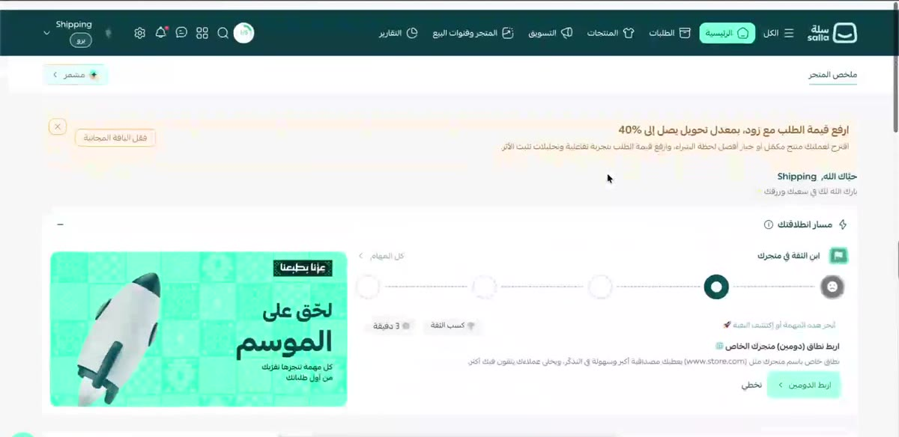

| Layer | What it is | Components / tokens |
|---|---|---|
| **Top bar** (72 px, `--nav-height: 4.5rem`) | Dark teal bar `#004956` (`--salla-background-primary-primary` / `--primary`). Right → left: Salla logo, primary nav (الكل, الرئيسية, الطلبات, المنتجات, التسويق, المتجر وقنوات البيع, التقارير) as icon + label; the active item is a mint pill `#a4ffe5` (`--salla-background-secondary-seconadry`) with dark text. Left cluster: setup progress ring (`1/5`), search, apps grid, chat, notifications (red dot), settings, then store switcher (store name + "برو" plan badge + chevron). | Figma **Header** → `docs/components/header.md`; **Header Primary Tabs**; icons `home-01`, `delivery-box-02`, `shirt-01`, `marketing`, `chart-breakout-square`, `pie-chart` (outline) |
| **Secondary tab row** (white, 1 px `#eeeeee` bottom border) | Section sub-navigation as underlined text tabs (active = `#004956` text + 2 px underline). Overflow collapses into "••• المزيد". Left side holds the section's primary CTA as a **mint `s-button theme=secondary`** (e.g. "+ طلب جديد", "+ منتج جديد") and a "مشمر" onboarding pill. | Figma **Header Secondary Tabs**; `s-button` `theme="secondary" size="md"` |
| **Mega menu** | Hovering a primary nav item opens a full-width white panel (`shadow-lg`, `rounded-lg`) with 4–6 columns; each column has an icon + bold title and a list of 14 px links; hot items carry a gold `s-tag` ("الأكثر زيارة", "كاشير مجاني"). A second band "الإعدادات والأدوات" repeats the pattern for settings. | 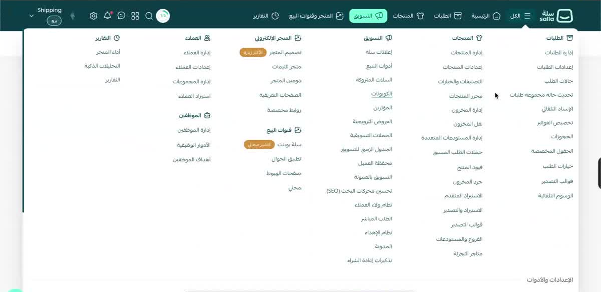 |
| **Single-column dropdown** | Narrow variant of the same menu when hovering one item (products): a white column with a 2 px teal accent bar on its start edge. | 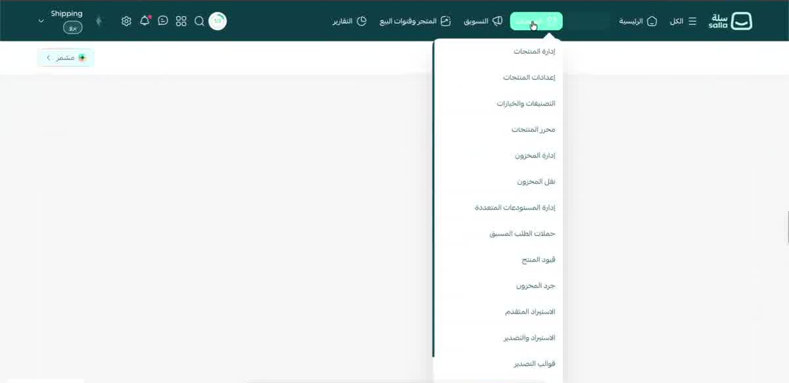 |
| **Breadcrumb row** | Below the tabs, right-aligned: `الطلبات › طلب #604042998`, 14 px, `#737373` with the current item in `#333333`. | `s-breadcrumbs` |
| **Page background** | `#f4f4f4` (`--salla-background-default-page`); every content block is a white card, `rounded-lg` (8 px), no border, `shadow-sm` or none. | `--salla-background-default-cards`, `--salla-radius-xl` |
| **Floating chips** | Bottom-left: green Intercom bubble and a white "+ سجل العمليات" (activity log) chip that stay fixed while scrolling. | `s-button theme=white shadow` |

## 2. Home dashboard

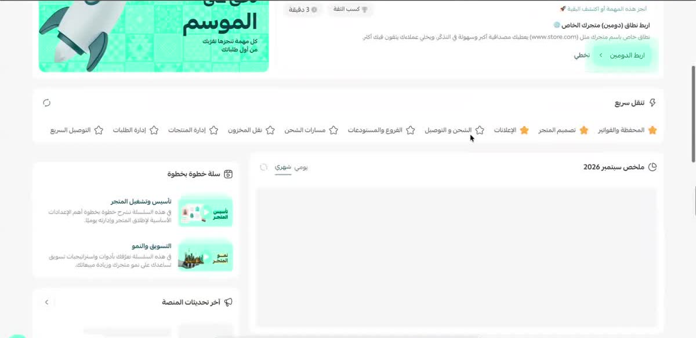

- **Dismissible hero** at the top of the page: a right-aligned bold headline + one-line body, a small close ✕ on the far left, an optional outline chip ("فعّل الباقة المجانية"). Below it a greeting line ("حياك الله، Shipping").
- **Onboarding / launch path** ("مسار انطلاقتك"): a horizontal stepper of 5 circular nodes joined by dashed lines (current node filled `#004956`), a task card with icon, title, body, two actions (mint primary "اربط الدومين ›" + text button "تخطي") and meta chips ("كسب الثقة", "3 دقيقة"), beside a 4:3 illustration card with a corner ribbon.
- **Quick nav** ("تنقل سريع"): one white card with a single row of favourite links (star icon + label), starred ones in gold.
- **Widget grid**: two columns, ~2/3 + 1/3. Main column: "ملخص سبتمبر 2026" card with يومي/شهري text tabs and a chart area, then **أحدث الطلبات** (recent orders) and **السلات المتروكة** (abandoned carts) tables with a refresh icon and a "‹" link to the full list. Side column: "سلة خطوة بخطوة" video cards, "آخر تحديثات المنصة" carousel, "مجتمع سلة" tabbed feed.
- Widgets share one header style: 16 px medium title with a leading outline icon, actions on the left.

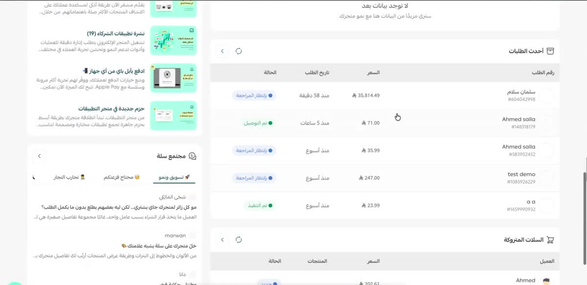

**Recent-orders table** is the canonical compact table: columns رقم الطلب (customer name over grey `#id`), السعر (Saudi Riyal glyph + amount), تاريخ الطلب (relative time), الحالة (**status pill**: dot + label, tinted background — بانتظار المراجعة blue, تم التوصيل green, تم التنفيذ green); rows separated by 1 px `#eeeeee`. Empty state: centered title "لا توجد بيانات بعد" + grey subtitle.

## 3. List ↔ detail (orders)

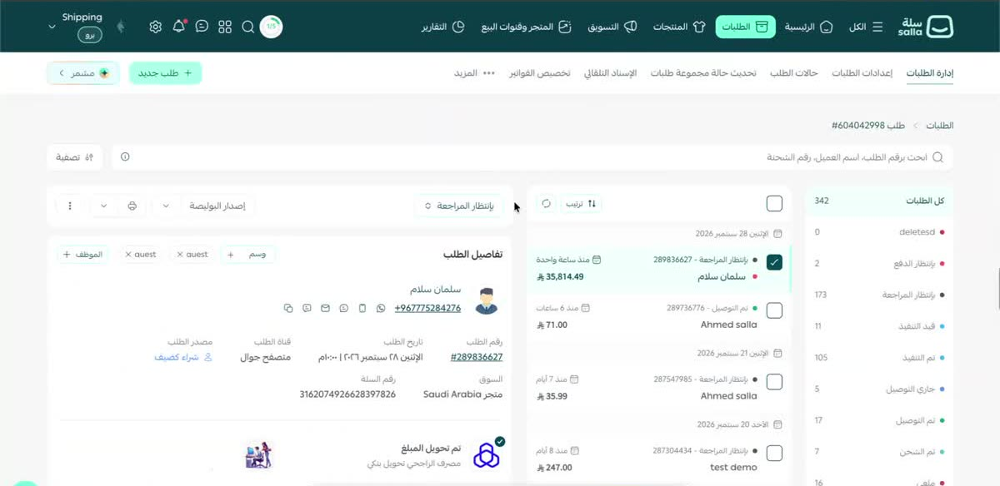

The most important operational layout. Three columns, right → left:

1. **Status rail** (≈180 px): "كل الطلبات 342" header, then one row per status with a coloured dot (matches the status pill colour), label and count; the selected status is bold. Footer button "تخصيص الحالات".
2. **Order list** (≈320 px): toolbar with select-all checkbox, "ترتيب" sort button and refresh; rows grouped by date headers ("الإثنين 28 سبتمبر 2026" with calendar icon). Each row: checkbox, `#id - status` line with dot, customer name, relative time ("منذ ساعة واحدة"), amount. The selected row gets a mint tint and a 2 px start border.
3. **Detail panel** (flex 1): a sticky action bar (status dropdown pill "بانتظار المراجعة", "إصدار البوليصة", print, more ⋮) then stacked white cards: **تفاصيل الطلب** (customer avatar + name + phone with a row of contact icons; 2-column key/value grid for رقم الطلب, تاريخ الطلب, قناة الطلب, مصدر الطلب, السوق, رقم السلة; tag chips + "+ وسم" / "+ الموظف"), a payment card (bank logo + "تم تحويل المبلغ"), **تفاصيل الشحن** (carrier logo, address key/value grid, "موقع العميل على الخريطة" link), **منتجات الطلب** table.

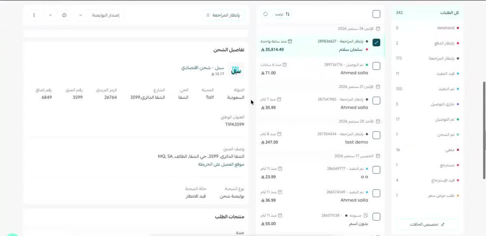

Key/value grids use a 12 px `#737373` label above a 14 px `#333333` value, 4–5 columns per row, right-aligned.

Above everything sits a full-width **search bar** ("ابحث برقم الطلب، اسم العميل، رقم الشحنة") with a "تصفية" filter button on the left — the same bar appears on products, coupons and shipping.

## 4. Data lists (products)

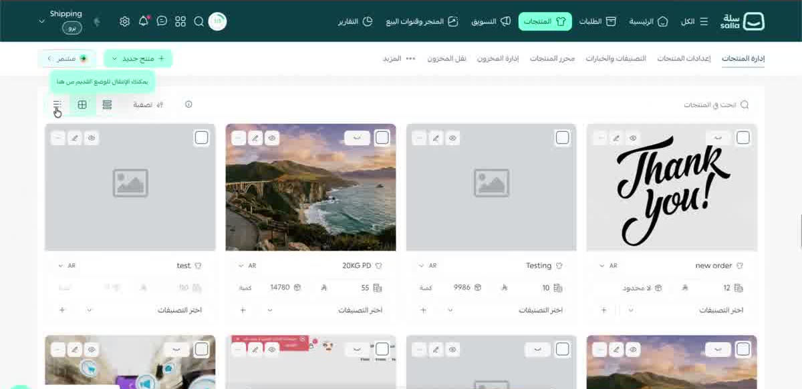
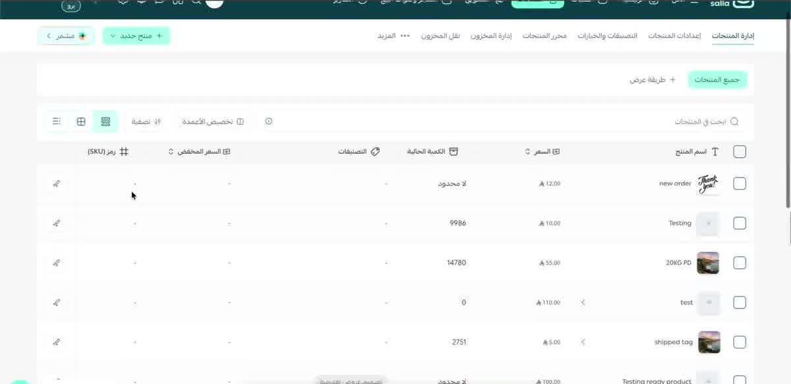

- A **view switcher** (list / grid / compact icons) sits left of the search bar together with "تصفية" and "تخصيص الأعمدة" (column picker). The toolbar row above it holds a mint "جميع المنتجات" filter chip and "+ طريقة عرض".
- **Grid view**: 4 cards per row, square image (or the placeholder illustration on `#f4f4f4`), a hover toolbar of small square icon buttons (delete, edit, preview) in the top-start corner, a checkbox top-end, then name + inline `AR` language switcher, and a row of stat fields (price, quantity) and a "اختر التصنيفات" select.
- **Table view**: checkbox column, thumbnail + name, price (riyal glyph), quantity (or "لا محدود"), categories, sale price, SKU, and an inline-edit pencil at the far left. Sortable headers show ⇅; header icons match the column type. Rows are 60 px, zebra-free, 1 px dividers.
- Rows that have variants show a "‹" expand chevron next to the name.

## 5. Master–detail edit (product editor)

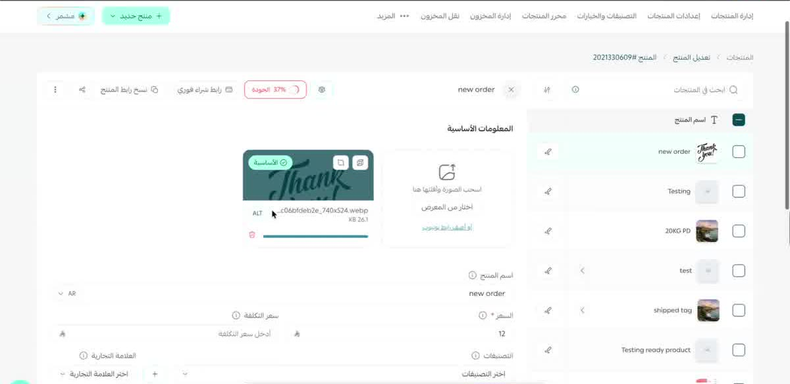

Editing keeps the list visible: a narrow **list rail** on the right (search, "اسم المنتج" header, product rows with edit pencils; the current product is highlighted) and the **form** on the left. The form's sticky header has the product name with a ✕ close, a quality meter tag ("الجودة 37%" in danger red), "رابط شراء فوري", "نسخ رابط المنتج", share and ⋮. Content is grouped under bold section titles ("المعلومات الأساسية") with an image uploader (dashed drop zone + gallery + thumbnail card with `ALT`, filename, size, delete), then two-column labelled fields (اسم المنتج with `AR` switch, السعر / سعر التكلفة with riyal adornment, التصنيفات / العلامة التجارية selects). Every label carries an ⓘ tooltip trigger.

## 6. Tables with inline controls (coupons)

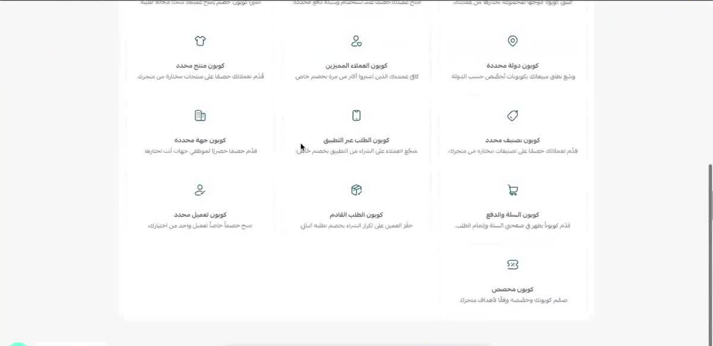

Card title ("كوبونات الخصم"), search + "تصدير الكوبونات" / "تخصيص الأعمدة" / "تصفية" buttons, then a row of **text filter tabs** (الكل, مفعل, معطل, منتهي الصلاحية, مجدول, مكتمل الاستخدام). Columns: checkbox, الخصم (9%), تاريخ البداية, تاريخ الانتهاء, السوق, حالة الكوبون (pill: green "مفعل", red "معطل", grey "منتهي الصلاحية"), then an **actions cluster** on the far left: `s-toggle` (on = `#004956`), chart, edit and a red delete icon. Dates render as Arabic weekday + day + month + year with time on a second line.

## 7. Choose-a-template → form → summary (coupon wizard)

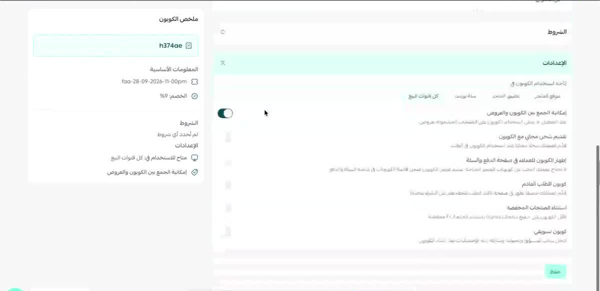
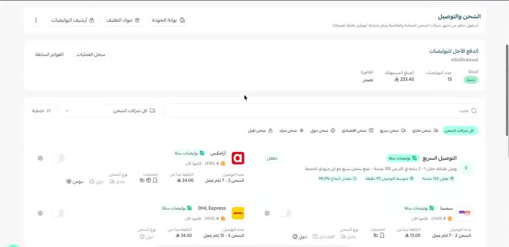

- **Type picker**: a 3-column grid of white tiles, each with a 24 px outline icon, bold title and one-line description; the last row can be a single tile. Preceded by a video hero card ("شاهد كيف تنشئ كوبون…").
- **Form + live summary**: the form on the right in collapsible sections (المعلومات الأساسية, الشروط, الإعدادات) with a numbered/collapsed header; on the left a sticky **summary card** ("ملخص الكوبون") showing the generated code in a mint box, then grouped key facts with icons. Setting rows are label + helper text on the right and an `s-toggle` on the left; a segmented "متاح للاستخدام في" uses text chips. The single mint "حفظ" button sits at the bottom start of the form.

## 8. Feature landing sections (shipping)

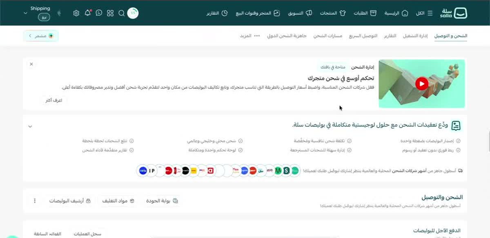
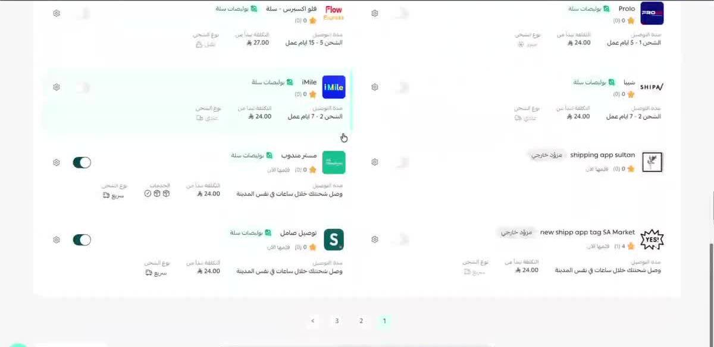

- **Section hero**: media card (thumbnail with play button) on the right, eyebrow tag ("متاحة في باقتك") + title + body + outline "اعرف أكثر" on the left, dismissible ✕. Followed by a **benefits strip** (icon + title, then a 4×2 grid of ✓ bullet points and a row of partner logos in circles).
- **Section header card**: title + subtitle on the right, a row of outline buttons with leading icons (بوابة الجودة, مواد التغليف, أرشيف البوليصات) and ⋮ on the left.
- **Stat card** ("الدفع الآجل للبوليصات"): status pill + 3 labelled values; tabs at the start for related logs.
- **Filter chips** row (mint active chip "كل شركات الشحن", others white with icons) above a **2-column card list** of carriers: logo, name, rating ★ (count), meta grid (مدة التوصيل, التكلفة تبدأ من, نوع الشحن, الخدمات as tiny icons), an `s-toggle` and a settings gear on the left. Recommended carrier gets a highlighted card with green metric chips ("معدل النجاح 98.5%"). Pagination `‹ 1 2 3` centred at the bottom.

## 9. Settings pages, banners and empty states

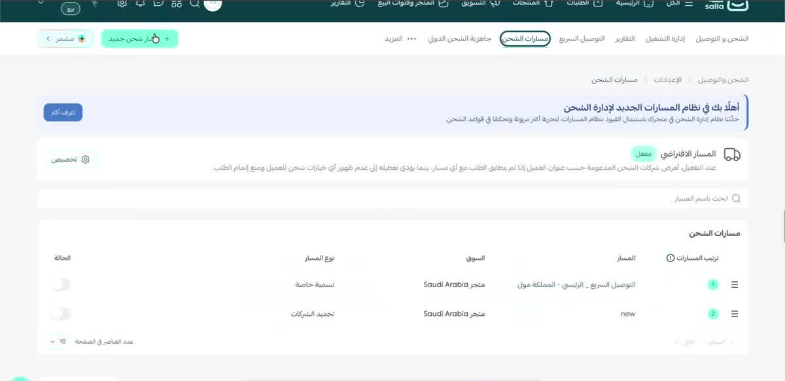
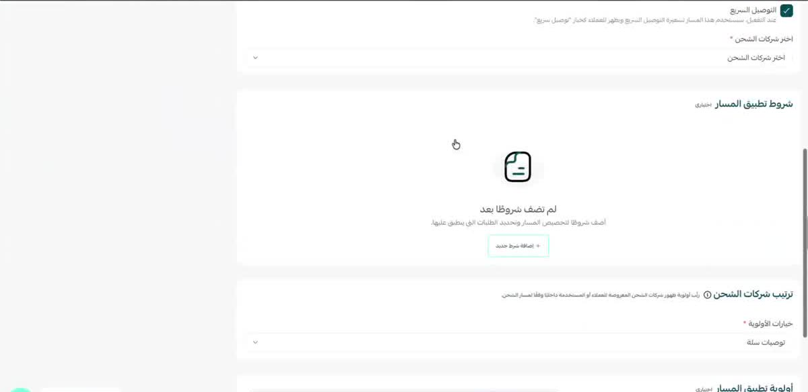

- **Info banner** (`info-100` background `#ecf3fe`, 3 px `#5196f3` start border): bold title + body, a solid info-blue "اعرف أكثر" button on the left.
- **Default-item card**: icon + title + gold "معطل"/"مفعل" tag + description, "تخصيص" outline button.
- **Sortable settings table**: drag handle ≡ + numbered green badge, name, market, type, `s-toggle` status; "عدد العناصر في الصفحة 10" pager at the bottom start.
- **Empty state** inside a section: centered rounded-square illustration (the `Illustrations Collection` style), bold title ("لم تضف شروطًا بعد"), grey helper, dashed-border outline button "+ إضافة شرط جديد".
- Skeletons: while data loads, tables render grey `s-skeleton` bars in the exact column layout.

## 10. KPI cards and radio-card forms

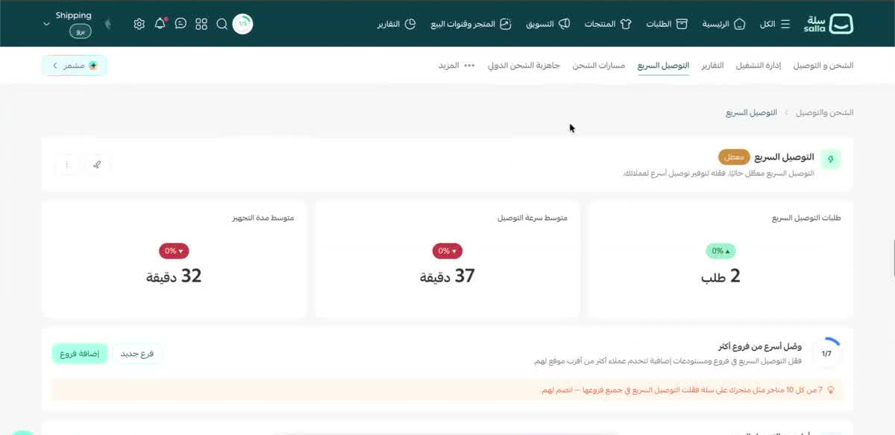
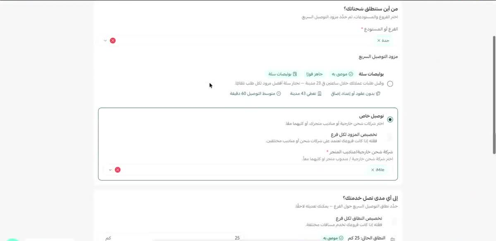

- **KPI cards**: three equal white cards; each has a 14 px grey label top-right, a 32 px bold value ("37 دقيقة") and a delta pill (green ▲ / red ▼ "0%") beside it. Followed by a checklist card with a circular progress ring ("1/7"), title/body and two buttons, plus an orange social-proof line.
- **Radio-card form** (quick-delivery settings): a question heading ("من أين ستنطلق شحناتك؟") with helper, a multi-select with removable chips, then **radio cards**: a bordered card per option with radio, title, body, feature chips ("موصى به ✓", "جاهز فورًا"); the selected card gets a 2 px `#004956` border and nested fields (a "شركة شحن خارجية/مناديب المتجر" multi-select with chips) appear inside it. A range with a numeric input follows ("النطاق الحالي: 25 كم").

## 11. Promotional modal

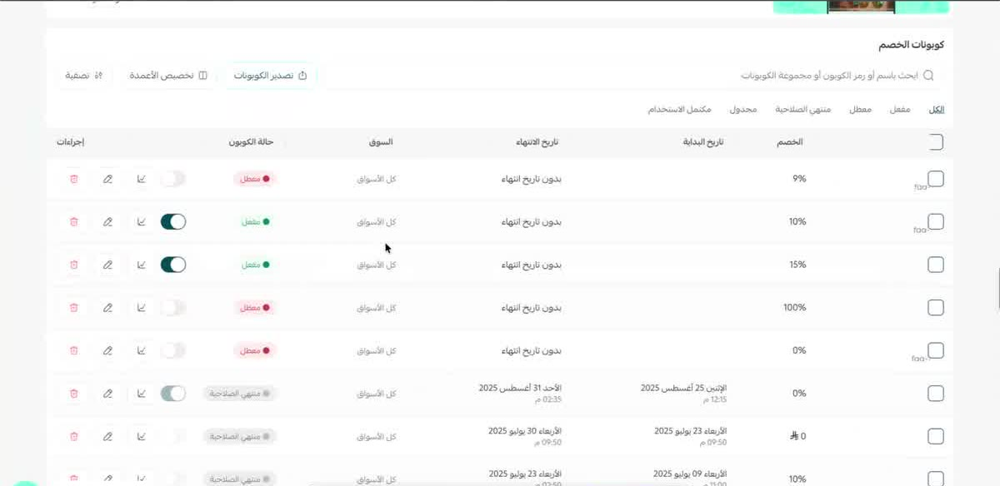

Marketing interstitials use a dark-framed `s-modal` (black header bar with logo + "سلة من Salla", ✕ on the start side) containing a full-bleed brand illustration and one solid dark-blue CTA. Background page is dimmed and blurred.

---

## Cheat-sheet: mapping patterns to the system

| Pattern | Storybook / Figma | Tokens |
|---|---|---|
| Primary CTA | `s-button theme="secondary"` (mint) — Figma Button `Variant=--primary` | `--salla-background-secondary-seconadry`, text `--salla-text-primary-primary` |
| Secondary / toolbar buttons | `s-button theme="white" outlined` with leading `s-icon` | border `--salla-border-default`, radius `--salla-radius-xl` |
| Status pill | `s-tag` with dot — Figma **Status** `Appearance=--subtle` | `--salla-background-status-*-lighter` + `text/status/*/darker` |
| Filter chips | `s-tag`/`s-button` group, active = mint | as primary CTA |
| Data table | `s-table` — Figma **Table** (cells: Header, Name, Amount, Status, Actions, Checkbox) | row divider `--salla-border-default` |
| Cards | `s-panel` — Figma *Panel* | bg `--salla-background-default-cards`, radius 8, `Shadows/sm` |
| Info banner | `s-alert-box variant="info"` — Figma **Alertbox** | `--salla-background-status-info-lighter`, border `--salla-border-status-info` |
| Toggles / checkboxes / radios | `s-toggle`, `s-checkbox`, `s-radio` | on colour `--salla-background-primary-primary` |
| Stepper | Figma **Steps** | dashed connector `--salla-border-hover` |
| Empty state | `s-placeholder` + `illustrations/` | text `--salla-text-gray-light` |
| Skeleton | `s-skeleton`, `s-table-skeleton` | `--salla-background-default-neutrals-dark` |
| Breadcrumb | `s-breadcrumbs` — Figma **Breadcrumb** | `--salla-text-gray-lighter` |
