# Accordion

Storybook title `Components/Accordion` · source `./src/components/s-accordion/s-accordion.stories.tsx`

Tags rendered: `<s-accordion>`, `<s-accordion-group>`

A collapsible content container that provides large amounts of content in a small space through progressive disclosure. Users get the essential details about the core content and can choose to expand this content within the constraints of the accordion.

## Props

| Prop | Type / control | Options | Default | Description |
|---|---|---|---|---|
| `theme` | string | `default`, `light`, `transparent`, `feature` | `default` | Accordion theme, you can set theme to light, transparent or feature if you need feature based dependency accordion |
| `outlined` | boolean |  | `false` | Adds an outline border to the accordion |
| `loading` | boolean |  | `false` | Accordion loading state |
| `disabled` | boolean |  | `false` | Disable accordion |
| `activeTab` | number |  | `0` | Initially active tab index |
| `autoCollapse` | boolean |  | `true` | AutoCollapse other accordions in the same group when one is expanded |
| `feature` | boolean |  | `true` | Feature based dependency accordion |
| `flatHeader` | boolean |  | `false` | Removes the expand/collapse icon from header, needed in certain cases |
| `isExpanded` | boolean |  | `false` | If you need accordion to be expanded by default |
| `layout` | select | `default`, `tight`, `relaxed` | `default` | You can set accordion layout to tight or relaxed if you have small area |
| `maxHeight` | text |  | `auto` | You can set max height for accordion body, will be scrollable when content is more than max height, set value as string like '200px' |
| `headerPadding` | text |  | `""` | Sets custom padding for the accordion header, set value as string like '1rem' or '16px 20px' |
| `readonly` | boolean |  | `false` | Readonly state |
| `onchange` |  |  |  | Emitted when the active tab changes. Provides the index of the new active tab. |
| `accordionToggle` |  |  |  | Emitted when the accordion is toggled. Provides event object with the state of the accordion. |

## Stories

### Default

Story id `components-accordion--default`


Args:

```json
{
  "theme": "default",
  "outlined": true,
  "loading": false,
  "disabled": false,
  "activeTab": 0
}
```

<details><summary>Rendered markup</summary>

```html
<s-accordion theme="default" outlined="" active-tab="0" class="hydrated">
      <div slot="head">Accordion Title</div>
      <div slot="body">The accordion component provides large amounts of content in a small space through progressive disclosure. Users get the essential details about the core content and can choose to expand this content within the constraints of the accordion.</div>
    </s-accordion>
```

</details>

### Light

Story id `components-accordion--light`

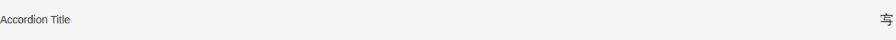

Args:

```json
{
  "theme": "light",
  "outlined": false,
  "loading": false,
  "disabled": false,
  "activeTab": 0
}
```

<details><summary>Rendered markup</summary>

```html
<s-accordion theme="light" active-tab="0" class="hydrated">
      <div slot="head">Accordion Title</div>
      <div slot="body">The accordion component provides large amounts of content in a small space through progressive disclosure. Users get the essential details about the core content and can choose to expand this content within the constraints of the accordion.</div>
    </s-accordion>
```

</details>

### Transparent

Story id `components-accordion--transparent`

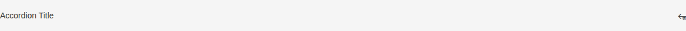

Args:

```json
{
  "theme": "transparent",
  "outlined": false,
  "loading": false,
  "disabled": false,
  "activeTab": 0
}
```

<details><summary>Rendered markup</summary>

```html
<s-accordion theme="transparent" active-tab="0" class="hydrated">
      <div slot="head">Accordion Title</div>
      <div slot="body">The accordion component provides large amounts of content in a small space through progressive disclosure. Users get the essential details about the core content and can choose to expand this content within the constraints of the accordion.</div>
    </s-accordion>
```

</details>

### Feature

Story id `components-accordion--feature`

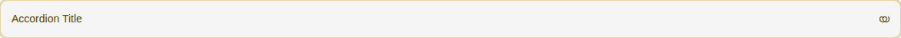

Args:

```json
{
  "theme": "feature",
  "outlined": true,
  "loading": false,
  "disabled": false,
  "activeTab": 0,
  "feature": true
}
```

<details><summary>Rendered markup</summary>

```html
<s-accordion theme="feature" feature="true" outlined="" active-tab="0" class="hydrated">
      <div slot="head">Accordion Title</div>
      <div slot="body">The accordion component provides large amounts of content in a small space through progressive disclosure. Users get the essential details about the core content and can choose to expand this content within the constraints of the accordion.</div>
    </s-accordion>
```

</details>

### Tight

Story id `components-accordion--tight`

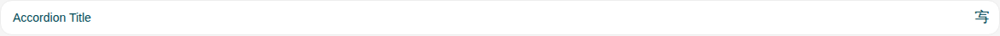

Args:

```json
{
  "theme": "default",
  "outlined": true,
  "loading": false,
  "disabled": false,
  "activeTab": 0,
  "layout": "tight"
}
```

<details><summary>Rendered markup</summary>

```html
<s-accordion theme="default" layout="tight" outlined="" active-tab="0" class="hydrated">
      <div slot="head">Accordion Title</div>
      <div slot="body">The accordion component provides large amounts of content in a small space through progressive disclosure. Users get the essential details about the core content and can choose to expand this content within the constraints of the accordion.</div>
    </s-accordion>
```

</details>

### Relaxed

Story id `components-accordion--relaxed`

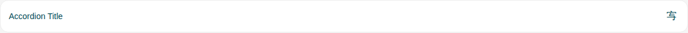

Args:

```json
{
  "theme": "default",
  "outlined": true,
  "loading": false,
  "disabled": false,
  "activeTab": 0,
  "layout": "relaxed"
}
```

<details><summary>Rendered markup</summary>

```html
<s-accordion theme="default" layout="relaxed" outlined="" active-tab="0" class="hydrated">
      <div slot="head">Accordion Title</div>
      <div slot="body">The accordion component provides large amounts of content in a small space through progressive disclosure. Users get the essential details about the core content and can choose to expand this content within the constraints of the accordion.</div>
    </s-accordion>
```

</details>

### Loading

Story id `components-accordion--loading`

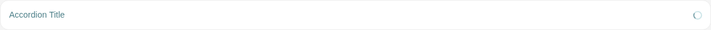

Args:

```json
{
  "theme": "default",
  "outlined": true,
  "loading": true,
  "disabled": false,
  "activeTab": 0
}
```

<details><summary>Rendered markup</summary>

```html
<s-accordion theme="default" loading="" outlined="" active-tab="0" class="hydrated">
      <div slot="head">Accordion Title</div>
      <div slot="body">The accordion component provides large amounts of content in a small space through progressive disclosure. Users get the essential details about the core content and can choose to expand this content within the constraints of the accordion.</div>
    </s-accordion>
```

</details>

### Disabled

Story id `components-accordion--disabled`


Args:

```json
{
  "theme": "default",
  "outlined": true,
  "loading": false,
  "disabled": true,
  "activeTab": 0
}
```

<details><summary>Rendered markup</summary>

```html
<div style="opacity: 0.6; pointer-events: none; filter: grayscale(0.5);">
      
    <s-accordion theme="default" disabled="" outlined="" active-tab="0" class="hydrated">
      <div slot="head">Accordion Title</div>
      <div slot="body">The accordion component provides large amounts of content in a small space through progressive disclosure. Users get the essential details about the core content and can choose to expand this content within the constraints of the accordion.</div>
    </s-accordion>
  
    </div>
```

</details>

### Expanded

Story id `components-accordion--expanded`

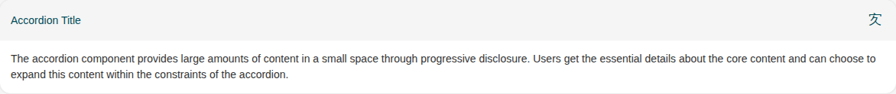

Args:

```json
{
  "theme": "default",
  "outlined": true,
  "loading": false,
  "disabled": false,
  "activeTab": 0,
  "isExpanded": true
}
```

<details><summary>Rendered markup</summary>

```html
<s-accordion theme="default" is-expanded="" outlined="" active-tab="0" class="hydrated">
      <div slot="head">Accordion Title</div>
      <div slot="body">The accordion component provides large amounts of content in a small space through progressive disclosure. Users get the essential details about the core content and can choose to expand this content within the constraints of the accordion.</div>
    </s-accordion>
```

</details>

### Outlined

Story id `components-accordion--outlined`


Args:

```json
{
  "theme": "default",
  "outlined": true,
  "loading": false,
  "disabled": false,
  "activeTab": 0
}
```

<details><summary>Rendered markup</summary>

```html
<s-accordion theme="default" outlined="" active-tab="0" class="hydrated">
      <div slot="head">Accordion Title</div>
      <div slot="body">The accordion component provides large amounts of content in a small space through progressive disclosure. Users get the essential details about the core content and can choose to expand this content within the constraints of the accordion.</div>
    </s-accordion>
```

</details>

### Max Height

Story id `components-accordion--max-height`

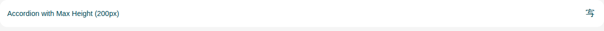

<details><summary>Rendered markup</summary>

```html
<div style="display: flex; flex-direction: column; gap: 1rem;">
      <s-accordion theme="default" max-height="200px" class="hydrated">
        <div slot="head">Accordion with Max Height (200px)</div>
        <div slot="body">
          <p>This accordion has a maximum height of 200px. When the content exceeds this height, it will become scrollable.</p>
          <p>Lorem ipsum dolor sit amet, consectetur adipiscing elit. Sed do eiusmod tempor incididunt ut labore et dolore magna aliqua. Ut enim ad minim veniam, quis nostrud exercitation ullamco laboris nisi ut aliquip ex ea commodo consequat.</p>
          <p>Duis aute irure dolor in reprehenderit in voluptate velit esse cillum dolore eu fugiat nulla pariatur. Excepteur sint occaecat cupidatat non proident, sunt in culpa qui officia deserunt mollit anim id est laborum.</p>
          <p>Sed ut perspiciatis unde omnis iste natus error sit voluptatem accusantium doloremque laudantium, totam rem aperiam, eaque ipsa quae ab illo inventore veritatis et quasi architecto beatae vitae dicta sunt explicabo.</p>
          <p>Nemo enim ipsam voluptatem quia voluptas sit aspernatur aut odit aut fugit, sed quia consequuntur magni dolores eos qui ratione voluptatem sequi nesciunt.</p>
        </div>
      </s-accordion>
    </div>
```

</details>

### Grouped

Story id `components-accordion--grouped`

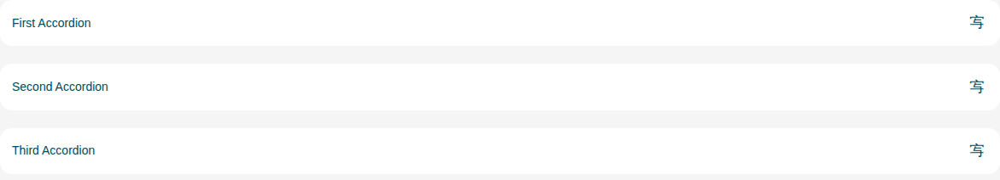

<details><summary>Rendered markup</summary>

```html
<div style="display: flex; flex-direction: column; gap: 1rem;">
      <s-accordion theme="default" class="hydrated">
        <div slot="head">First Accordion</div>
        <div slot="body">Content for first accordion</div>
      </s-accordion>
      <s-accordion theme="default" class="hydrated">
        <div slot="head">Second Accordion</div>
        <div slot="body">Content for second accordion</div>
      </s-accordion>
      <s-accordion theme="default" class="hydrated">
        <div slot="head">Third Accordion</div>
        <div slot="body">Content for third accordion</div>
      </s-accordion>
    </div>
```

</details>

### Nested

Story id `components-accordion--nested`

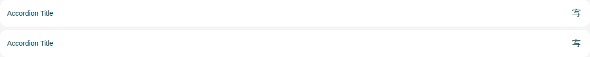

<details><summary>Rendered markup</summary>

```html
<s-accordion-group id="accordion_id" name="accordion_light__grouped" grouped="false" wide="" role="group" class="hydrated">
      <s-accordion name="accordion_light__grouped" theme="default" class="hydrated">
        <div slot="head">Accordion Title</div>
        <div slot="body">
          <s-accordion-group name="group_name" theme="light" grouped="false" wide="" role="group" class="hydrated">
            <s-accordion theme="transparent" name="accordion_light__grouped" class="hydrated">
              <div slot="head">Nested Accordion Title</div>
              <div slot="body">
                <p>
                  The accordion component provides large amounts of content in a small space through progressive disclosure. Users get the essential details about the core content and can choose to expand this content within the constraints of the accordion.
                </p>
              </div>
            </s-accordion>
            <s-accordion theme="transparent" name="accordion_light__grouped" class="hydrated">
              <div slot="head">Nested Accordion Title</div>
              <div slot="body">
                <p>
                  The accordion component provides large amounts of content in a small space through progressive disclosure. Users get the essential details about the core content and can choose to expand this content within the constraints of the accordion.
                </p>
              </div>
            </s-accordion>
          </s-accordion-group>
        </div>
      </s-accordion>
      <s-accordion name="accordion_light__grouped" theme="default" class="hydrated">
        <div slot="head">Accordion Title</div>
        <div slot="body">
          <s-accordion-group name="group_name" grouped="false" wide="" role="group" class="hydrated">
            <s-accordion auto-collapse="false" theme="transparent" class="text-sm hydrated" name="accordion_light__grouped">
              <div slot="head">Nested Accordion Title</div>
              <div slot="body">
                <p>
                  The accordion component provides large amounts of content in a small space through progressive disclosure. Users get the essential details about the core content and can choose to expand this content within the constraints of the accordion.
                </p>
              </div>
            </s-accordion>
            <s-accordion auto-collapse="false" theme="transparent" class="text-sm hydrated" name="accordion_light__grouped">
              <div slot="head">Nested Accordion Title</div>
              <div slot="body">
                <p>
                  The accordion component provides large amounts of content in a small space through progressive disclosure. Users get the essential details about the core content and can choose to expand this content within the constraints of the accordion.
                </p>
              </div>
            </s-accordion>
          </s-accordion-group>
        </div>
      </s-accordion>
    </s-accordion-group>
```

</details>

### Read Only

Story id `components-accordion--read-only`

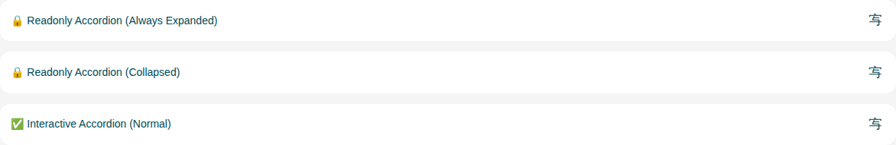

<details><summary>Rendered markup</summary>

```html
<div class="space-y-4">
      <s-accordion readonly="" class="hydrated">
        <div slot="head">🔒 Readonly Accordion (Always Expanded)</div>
        <div slot="body">
          <p>This accordion is readonly and cannot be toggled. It stays expanded and shows content for informational purposes only.</p>
          <p>Try clicking on the header - it won't collapse!</p>
        </div>
      </s-accordion>
      
      <s-accordion readonly="" class="hydrated">
        <div slot="head">🔒 Readonly Accordion (Collapsed)</div>
        <div slot="body">
          <p>This content is hidden because the accordion is readonly and not expanded.</p>
        </div>
      </s-accordion>
      
      <s-accordion class="hydrated">
        <div slot="head">✅ Interactive Accordion (Normal)</div>
        <div slot="body">
          <p>This is a normal accordion that can be toggled by clicking on the header.</p>
        </div>
      </s-accordion>
    </div>
```

</details>
