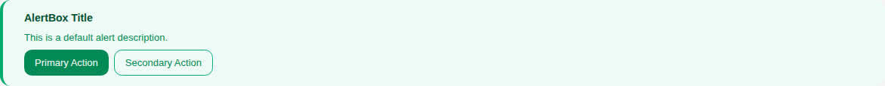
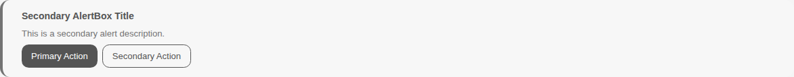
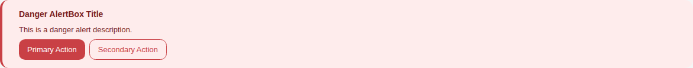
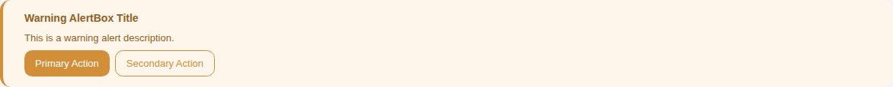
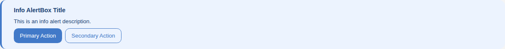
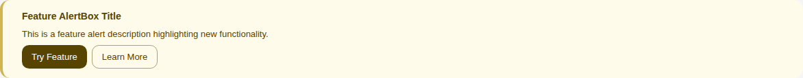
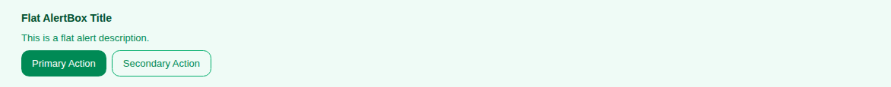
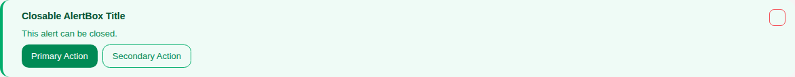
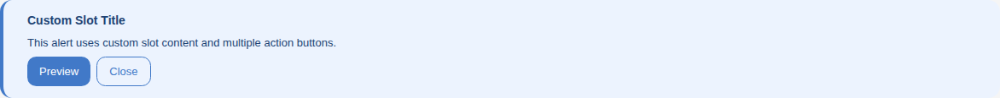

# AlertBox

Storybook title `Components/AlertBox` · source `./src/components/s-alert-box/s-alert-box.stories.tsx`

Tags rendered: `<s-alert-box>`, `<s-alert-box-action>`

A message box provides contextual feedback to users. It can be used to display success, warning, error, or info messages.

## Props

| Prop | Type / control | Options | Default | Description |
|---|---|---|---|---|
| `theme` | string | `default`, `secondary`, `danger`, `warning`, `info`, `feature` | `default` | Alert box Theme, you can set theme to default, secondary, danger, warning, info or feature |
| `layout` | string | `default`, `flat` | `default` | Alert box Layout, you can set layout to default or flat |
| `closable` | boolean |  | `false` | Show close button, if you want user to to be able to close the alert box |
| `horizontal` | boolean |  |  | If true, the alert box will be displayed in a horizontal layout. |
| `centerAlign` | boolean |  |  | set to true to center the alert box content |
| `onclick` |  |  |  | Emitted when the alert box is clicked. |
| `onclose` |  |  |  | Emitted when the alert box is closed. |

## Stories

### Default

Story id `components-alertbox--default`



Args:

```json
{
  "theme": "default",
  "layout": "default",
  "closable": false
}
```

<details><summary>Rendered markup</summary>

```html
<s-alert-box theme="default" layout="default" class="s-alert-box s-alert-box--default default ltr hydrated">
      <i slot="icon" class="hgi-stroke hgi-alert-02"></i>
      <h4 slot="title">AlertBox Title</h4>
      <article slot="desc">
        <p>This is a default alert description.</p>
      </article>
      <div slot="action">
        <s-alert-box-action slot="action" layout="btn" theme="default" href="https://example.com" target="_blank" class="hydrated">Primary Action</s-alert-box-action>
        <s-alert-box-action slot="action" layout="outlined" theme="default" href="https://example.com" target="_blank" class="hydrated">Secondary Action</s-alert-box-action>
      </div>
    </s-alert-box>
```

</details>

### Secondary

Story id `components-alertbox--secondary`



Args:

```json
{
  "theme": "secondary",
  "layout": "default",
  "closable": false
}
```

<details><summary>Rendered markup</summary>

```html
<s-alert-box theme="secondary" layout="default" class="s-alert-box s-alert-box--secondary default ltr hydrated">
      <i slot="icon" class="hgi-stroke hgi-alert-diamond"></i>
      <h4 slot="title">Secondary AlertBox Title</h4>
      <article slot="desc">
        <p>This is a secondary alert description.</p>
      </article>
      <div slot="action">
        <s-alert-box-action slot="action" layout="btn" theme="secondary" href="https://example.com" target="_blank" class="hydrated">Primary Action</s-alert-box-action>
        <s-alert-box-action slot="action" layout="outlined" theme="secondary" href="https://example.com" target="_blank" class="hydrated">Secondary Action</s-alert-box-action>
      </div>
    </s-alert-box>
```

</details>

### Danger

Story id `components-alertbox--danger`



Args:

```json
{
  "theme": "danger",
  "layout": "default",
  "closable": false
}
```

<details><summary>Rendered markup</summary>

```html
<s-alert-box theme="danger" layout="default" class="s-alert-box s-alert-box--danger default ltr hydrated">
      <i slot="icon" class="hgi-stroke hgi-megaphone-02"></i>
      <h4 slot="title">Danger AlertBox Title</h4>
      <article slot="desc">
        <p>This is a danger alert description.</p>
      </article>
      <div slot="action">
        <s-alert-box-action slot="action" layout="btn" theme="danger" href="https://example.com" target="_blank" class="hydrated">Primary Action</s-alert-box-action>
        <s-alert-box-action slot="action" layout="outlined" theme="danger" href="https://example.com" target="_blank" class="hydrated">Secondary Action</s-alert-box-action>
      </div>
    </s-alert-box>
```

</details>

### Warning

Story id `components-alertbox--warning`



Args:

```json
{
  "theme": "warning",
  "layout": "default",
  "closable": false
}
```

<details><summary>Rendered markup</summary>

```html
<s-alert-box theme="warning" layout="default" class="s-alert-box s-alert-box--warning default ltr hydrated">
      <i slot="icon" class="hgi-stroke hgi-chart-line-data-01"></i>
      <h4 slot="title">Warning AlertBox Title</h4>
      <article slot="desc">
        <p>This is a warning alert description.</p>
      </article>
      <div slot="action">
        <s-alert-box-action slot="action" layout="btn" theme="warning" href="https://example.com" target="_blank" class="hydrated">Primary Action</s-alert-box-action>
        <s-alert-box-action slot="action" layout="outlined" theme="warning" href="https://example.com" target="_blank" class="hydrated">Secondary Action</s-alert-box-action>
      </div>
    </s-alert-box>
```

</details>

### Info

Story id `components-alertbox--info`



Args:

```json
{
  "theme": "info",
  "layout": "default",
  "closable": false
}
```

<details><summary>Rendered markup</summary>

```html
<s-alert-box theme="info" layout="default" class="s-alert-box s-alert-box--info default ltr hydrated">
      <i slot="icon" class="hgi-stroke hgi-store-verified-02"></i>
      <h4 slot="title">Info AlertBox Title</h4>
      <article slot="desc">
        <p>This is an info alert description.</p>
      </article>
      <div slot="action">
        <s-alert-box-action slot="action" layout="btn" theme="info" href="https://example.com" target="_blank" class="hydrated">Primary Action</s-alert-box-action>
        <s-alert-box-action slot="action" layout="outlined" theme="info" href="https://example.com" target="_blank" class="hydrated">Secondary Action</s-alert-box-action>
      </div>
    </s-alert-box>
```

</details>

### Feature

Story id `components-alertbox--feature`



Args:

```json
{
  "theme": "feature",
  "layout": "default",
  "closable": false
}
```

<details><summary>Rendered markup</summary>

```html
<s-alert-box theme="feature" layout="default" class="s-alert-box s-alert-box--feature default ltr hydrated">
      <i slot="icon" class="hgi-stroke hgi-star-01"></i>
      <h4 slot="title">Feature AlertBox Title</h4>
      <article slot="desc">
        <p>This is a feature alert description highlighting new functionality.</p>
      </article>
      <div slot="action">
        <s-alert-box-action slot="action" layout="btn" theme="feature" href="https://example.com" target="_blank" class="hydrated">Try Feature</s-alert-box-action>
        <s-alert-box-action slot="action" layout="outlined" theme="feature" href="https://example.com" target="_blank" class="hydrated">Learn More</s-alert-box-action>
      </div>
    </s-alert-box>
```

</details>

### Flat

Story id `components-alertbox--flat`



Args:

```json
{
  "theme": "default",
  "layout": "flat",
  "closable": false
}
```

<details><summary>Rendered markup</summary>

```html
<s-alert-box theme="default" layout="flat" class="s-alert-box s-alert-box--default flat ltr hydrated">
      <i slot="icon" class="hgi-stroke hgi-alert-02"></i>
      <h4 slot="title">Flat AlertBox Title</h4>
      <article slot="desc">
        <p>This is a flat alert description.</p>
      </article>
      <div slot="action">
        <s-alert-box-action slot="action" layout="btn" theme="default" href="https://example.com" target="_blank" class="hydrated">Primary Action</s-alert-box-action>
        <s-alert-box-action slot="action" layout="outlined" theme="default" href="https://example.com" target="_blank" class="hydrated">Secondary Action</s-alert-box-action>
      </div>
    </s-alert-box>
```

</details>

### Closable

Story id `components-alertbox--closable`



Args:

```json
{
  "theme": "default",
  "layout": "default",
  "closable": true
}
```

<details><summary>Rendered markup</summary>

```html
<s-alert-box theme="default" layout="default" closable="" class="s-alert-box s-alert-box--default closable default ltr hydrated">
      <i slot="icon" class="hgi-stroke hgi-alert-02"></i>
      <h4 slot="title">Closable AlertBox Title</h4>
      <article slot="desc">
        <p>This alert can be closed.</p>
      </article>
      <div slot="action">
        <s-alert-box-action slot="action" layout="btn" theme="default" href="https://example.com" target="_blank" class="hydrated">Primary Action</s-alert-box-action>
        <s-alert-box-action slot="action" layout="outlined" theme="default" href="https://example.com" target="_blank" class="hydrated">Secondary Action</s-alert-box-action>
      </div>
    </s-alert-box>
```

</details>

### Horizontal

Story id `components-alertbox--horizontal`


Args:

```json
{
  "horizontal": true
}
```

<details><summary>Rendered markup</summary>

```html
<s-alert-box horizontal="" theme="default" layout="default" class="s-alert-box s-alert-box--default default ltr hydrated">
      <h4 slot="title">Horizontal AlertBox Title</h4>
    </s-alert-box>
```

</details>

### Center Align

Story id `components-alertbox--center-align`


Args:

```json
{
  "centerAlign": true
}
```

<details><summary>Rendered markup</summary>

```html
<s-alert-box theme="default" layout="default" centeralign="" class="s-alert-box s-alert-box--default default ltr hydrated">
      <h4 slot="title">Center Align AlertBox Title</h4>
    </s-alert-box>
```

</details>

### Custom Slot

Story id `components-alertbox--custom-slot`



<details><summary>Rendered markup</summary>

```html
<s-alert-box theme="info" layout="default" class="s-alert-box s-alert-box--info default ltr hydrated">
      <i slot="icon" class="hgi-stroke hgi-store-verified-02"></i>
      <h4 slot="title">Custom Slot Title</h4>
      <article slot="desc">
        <p>This alert uses custom slot content and multiple action buttons.</p>
      </article>
      <div slot="action">
        <s-alert-box-action slot="action" layout="btn" theme="info" href="https://example.com" target="_blank" class="hydrated">Preview</s-alert-box-action>
        <s-alert-box-action slot="action" layout="outlined" theme="info" href="https://example.com" target="_blank" class="hydrated">Close</s-alert-box-action>
      </div>
    </s-alert-box>
```

</details>
