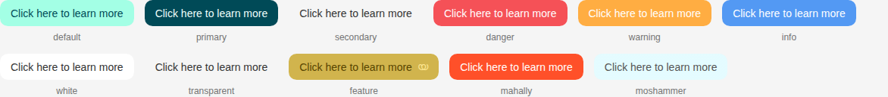
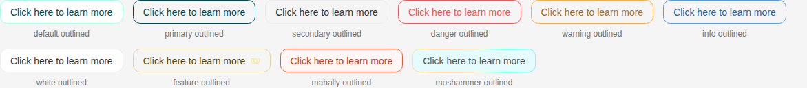
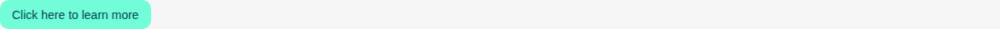
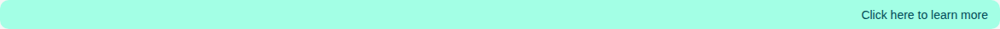
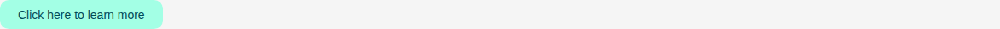
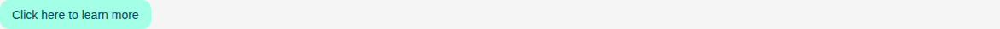

# Button

Storybook title `Components/Button` · source `./src/components/s-button/s-button.stories.tsx`

Tags rendered: `<s-button>`, `<s-icon>`

A button is a clickable element that triggers an action when clicked.

## Props

| Prop | Type / control | Options | Default | Description |
|---|---|---|---|---|
| `label` | string |  | `null` | you can dynamically set the label of the button if needed |
| `theme` | select | `default`, `primary`, `secondary`, `danger`, `warning`, `info`, `white`, `transparent`, `feature`, `mahally`, `moshammer` | `default` | Button theme |
| `layout` | select | `default`, `circular` | `default` | Button layout variant, you can default or circular, for circular button, best to use style prop to set the width and height sizes to get a perfect circle |
| `type` | select | `button`, `submit`, `reset` | `button` | Button type, you can use button, submit or reset (optional) |
| `size` | select | `sm`, `md`, `lg` | `md` | Button size |
| `outlined` | boolean |  | `false` | Set to true to get an outlined button |
| `noPadding` | boolean |  | `false` | Remove button padding |
| `textAlignment` | select | `start`, `center`, `end` | `center` | Text alignment within the button |
| `wide` | boolean |  | `false` | Make button fill container width |
| `loading` | boolean |  | `false` | Loading state |
| `disabled` | boolean |  | `false` | Disable the button |
| `active` | boolean |  | `false` | Set to true to get an active button state |
| `feature` | boolean |  | `false` | Feature based button |
| `autoHeight` | boolean |  | `false` | If the button should have auto height instead of pre-defined height, better used with transparent theme if needed |
| `href` | text |  | `null` | if applied, the button will behave as a link and will have a href attribute |
| `target` | select | `_blank`, `_self`, `_parent`, `_top` | `_self` | target attribute for the button if it is a link |
| `shadow` | boolean |  | `false` | Add shadow to the button |
| `style` | string |  |  |  |

## Stories

### Default

Story id `components-button--default`


Args:

```json
{
  "label": "Click here to learn more"
}
```

<details><summary>Rendered markup</summary>

```html
<s-button default="" class="s-btn s-btn--default default md ltr hydrated" theme="default" target="_self">Click here to learn more</s-button>
```

</details>

### Theme Variants

Story id `components-button--theme-variants`



Args:

```json
{
  "label": "Click here to learn more"
}
```

<details><summary>Rendered markup</summary>

```html
<div class="flex flex-wrap gap-4">
        
          <div class="flex flex-col items-center gap-2">
            <s-button theme="default" class="s-btn s-btn--default default md ltr hydrated" target="_self">Click here to learn more</s-button>
            <span class="text-xs text-dark-100">default</span>
          </div>
        
          <div class="flex flex-col items-center gap-2">
            <s-button theme="primary" class="s-btn s-btn--primary default md ltr hydrated" target="_self">Click here to learn more</s-button>
            <span class="text-xs text-dark-100">primary</span>
          </div>
        
          <div class="flex flex-col items-center gap-2">
            <s-button theme="secondary" class="s-btn s-btn--secondary default md ltr hydrated" target="_self">Click here to learn more</s-button>
            <span class="text-xs text-dark-100">secondary</span>
          </div>
        
          <div class="flex flex-col items-center gap-2">
            <s-button theme="danger" class="s-btn s-btn--danger default md ltr hydrated" target="_self">Click here to learn more</s-button>
            <span class="text-xs text-dark-100">danger</span>
          </div>
        
          <div class="flex flex-col items-center gap-2">
            <s-button theme="warning" class="s-btn s-btn--warning default md ltr hydrated" target="_self">Click here to learn more</s-button>
            <span class="text-xs text-dark-100">warning</span>
          </div>
        
          <div class="flex flex-col items-center gap-2">
            <s-button theme="info" class="s-btn s-btn--info default md ltr hydrated" target="_self">Click here to learn more</s-button>
            <span class="text-xs text-dark-100">info</span>
          </div>
        
          <div class="flex flex-col items-center gap-2">
            <s-button theme="white" class="s-btn s-btn--white default md ltr hydrated" target="_self">Click here to learn more</s-button>
            <span class="text-xs text-dark-100">white</span>
          </div>
        
          <div class="flex flex-col items-center gap-2">
            <s-button theme="transparent" class="s-btn s-btn--transparent default md ltr hydrated" target="_self">Click here to learn more</s-button>
            <span class="text-xs text-dark-100">transparent</span>
          </div>
        
          <div class="flex flex-col items-center gap-2">
            <s-button theme="feature" class="s-btn s-btn--feature default md ltr hydrated" target="_self">Click here to learn more</s-button>
            <span class="text-xs text-dark-100">feature</span>
          </div>
        
          <div class="flex flex-col items-center gap-2">
            <s-button theme="mahally" class="s-btn s-btn--mahally default md ltr hydrated" target="_self">Click here to learn more</s-button>
            <span class="text-xs text-dark-100">mahally</span>
          </div>
        
          <div class="flex flex-col items-center gap-2">
            <s-button theme="moshammer" class="s-btn s-btn--moshammer default md ltr hydrated" target="_self">Click here to learn more</s-button>
            <span class="text-xs text-dark-100">moshammer</span>
          </div>
        
      </div>
```

</details>

### Size Variants

Story id `components-button--size-variants`


Args:

```json
{
  "label": "Click here to learn more"
}
```

<details><summary>Rendered markup</summary>

```html
<div class="flex flex-wrap gap-4 items-end">
        
          <div class="flex flex-col items-center gap-2">
            <s-button size="lg" class="s-btn s-btn--default default lg ltr hydrated" theme="default" target="_self">Click here to learn more</s-button>
            <span class="text-xs text-dark-100">lg</span>
          </div>
        
          <div class="flex flex-col items-center gap-2">
            <s-button size="md" class="s-btn s-btn--default default md ltr hydrated" theme="default" target="_self">Click here to learn more</s-button>
            <span class="text-xs text-dark-100">md</span>
          </div>
        
          <div class="flex flex-col items-center gap-2">
            <s-button size="sm" class="s-btn s-btn--default default sm ltr hydrated" theme="default" target="_self">Click here to learn more</s-button>
            <span class="text-xs text-dark-100">sm</span>
          </div>
        
      </div>
```

</details>

### Outlined Variants

Story id `components-button--outlined-variants`



Args:

```json
{
  "label": "Click here to learn more"
}
```

<details><summary>Rendered markup</summary>

```html
<div class="flex flex-wrap gap-4">
        
          <div class="flex flex-col items-center gap-2">
            <s-button theme="default" outlined="" class="s-btn s-btn--default default md outlined ltr hydrated" target="_self">Click here to learn more</s-button>
            <span class="text-xs text-dark-100">default outlined</span>
          </div>
        
          <div class="flex flex-col items-center gap-2">
            <s-button theme="primary" outlined="" class="s-btn s-btn--primary default md outlined ltr hydrated" target="_self">Click here to learn more</s-button>
            <span class="text-xs text-dark-100">primary outlined</span>
          </div>
        
          <div class="flex flex-col items-center gap-2">
            <s-button theme="secondary" outlined="" class="s-btn s-btn--secondary default md outlined ltr hydrated" target="_self">Click here to learn more</s-button>
            <span class="text-xs text-dark-100">secondary outlined</span>
          </div>
        
          <div class="flex flex-col items-center gap-2">
            <s-button theme="danger" outlined="" class="s-btn s-btn--danger default md outlined ltr hydrated" target="_self">Click here to learn more</s-button>
            <span class="text-xs text-dark-100">danger outlined</span>
          </div>
        
          <div class="flex flex-col items-center gap-2">
            <s-button theme="warning" outlined="" class="s-btn s-btn--warning default md outlined ltr hydrated" target="_self">Click here to learn more</s-button>
            <span class="text-xs text-dark-100">warning outlined</span>
          </div>
        
          <div class="flex flex-col items-center gap-2">
            <s-button theme="info" outlined="" class="s-btn s-btn--info default md outlined ltr hydrated" target="_self">Click here to learn more</s-button>
            <span class="text-xs text-dark-100">info outlined</span>
          </div>
        
          <div class="flex flex-col items-center gap-2">
            <s-button theme="white" outlined="" class="s-btn s-btn--white default md outlined ltr hydrated" target="_self">Click here to learn more</s-button>
            <span class="text-xs text-dark-100">white outlined</span>
          </div>
        
          <div class="flex flex-col items-center gap-2">
            <s-button theme="feature" outlined="" class="s-btn s-btn--feature default md outlined ltr hydrated" target="_self">Click here to learn more</s-button>
            <span class="text-xs text-dark-100">feature outlined</span>
          </div>
        
          <div class="flex flex-col items-center gap-2">
            <s-button theme="mahally" outlined="" class="s-btn s-btn--mahally default md outlined ltr hydrated" target="_self">Click here to learn more</s-button>
            <span class="text-xs text-dark-100">mahally outlined</span>
          </div>
        
          <div class="flex flex-col items-center gap-2">
            <s-button theme="moshammer" outlined="" class="s-btn s-btn--moshammer default md outlined ltr hydrated" target="_self">Click here to learn more</s-button>
            <span class="text-xs text-dark-100">moshammer outlined</span>
          </div>
        
      </div>
```

</details>

### Loading

Story id `components-button--loading`


Args:

```json
{
  "label": "Click here to learn more",
  "style": "width: 3.75rem;",
  "loading": true
}
```

<details><summary>Rendered markup</summary>

```html
<s-button default="" loading="" style="width: 3.75rem;" class="s-btn s-btn--default default md loading ltr hydrated" theme="default" target="_self">Click here to learn more</s-button>
```

</details>

### Disabled

Story id `components-button--disabled`


Args:

```json
{
  "label": "Click here to learn more",
  "disabled": true
}
```

<details><summary>Rendered markup</summary>

```html
<s-button default="" disabled="" class="s-btn s-btn--default default md disabled ltr hydrated" theme="default" target="_self">Click here to learn more</s-button>
```

</details>

### Active

Story id `components-button--active`



Args:

```json
{
  "label": "Click here to learn more",
  "active": true
}
```

<details><summary>Rendered markup</summary>

```html
<s-button default="" active="" class="s-btn s-btn--default default md active ltr hydrated" theme="default" target="_self">Click here to learn more</s-button>
```

</details>

### Wide

Story id `components-button--wide`


Args:

```json
{
  "label": "Click here to learn more",
  "wide": true
}
```

<details><summary>Rendered markup</summary>

```html
<s-button default="" wide="" class="s-btn s-btn--default default md !w-full ltr hydrated" theme="default" target="_self">Click here to learn more</s-button>
```

</details>

### Text Start

Story id `components-button--text-start`


Args:

```json
{
  "label": "Click here to learn more",
  "wide": true,
  "textAlignment": "start"
}
```

<details><summary>Rendered markup</summary>

```html
<s-button default="" text-alignment="start" wide="" class="s-btn s-btn--default default md !w-full ltr hydrated" theme="default" target="_self">Click here to learn more</s-button>
```

</details>

### Text End

Story id `components-button--text-end`



Args:

```json
{
  "label": "Click here to learn more",
  "wide": true,
  "textAlignment": "end"
}
```

<details><summary>Rendered markup</summary>

```html
<s-button default="" text-alignment="end" wide="" class="s-btn s-btn--default default md !w-full ltr hydrated" theme="default" target="_self">Click here to learn more</s-button>
```

</details>

### Has Icons

Story id `components-button--has-icons`



Args:

```json
{
  "label": "<s-icon icon=\"hgi-stroke hgi-user\"></s-icon> Click here to learn more <s-icon icon=\"hgi-stroke hgi-help-circle\"></s-icon>"
}
```

<details><summary>Rendered markup</summary>

```html
<s-button default="" class="s-btn s-btn--default default md ltr hydrated" theme="default" target="_self"><s-icon icon="hgi-stroke hgi-user" class="hydrated"></s-icon> Click here to learn more <s-icon icon="hgi-stroke hgi-help-circle" class="hydrated"></s-icon></s-button>
```

</details>

### Circular

Story id `components-button--circular`


Args:

```json
{
  "label": "<s-icon icon=\"hgi-stroke hgi-help-circle\"></s-icon>",
  "style": "width: 3.75rem; height: 3.75rem;",
  "layout": "circular"
}
```

<details><summary>Rendered markup</summary>

```html
<s-button default="" layout="circular" style="width: 3.75rem; height: 3.75rem;" class="s-btn s-btn--default circular md ltr hydrated" theme="default" target="_self"><s-icon icon="hgi-stroke hgi-help-circle" class="hydrated"></s-icon></s-button>
```

</details>

### Link

Story id `components-button--link`



Args:

```json
{
  "label": "Click here to learn more",
  "href": "https://www.salla.com",
  "target": "_blank"
}
```

<details><summary>Rendered markup</summary>

```html
<s-button href="https://www.salla.com" target="_blank" default="" class="s-btn s-btn--default default md ltr hydrated" theme="default">Click here to learn more</s-button>
```

</details>

### Auto Height

Story id `components-button--auto-height`


Args:

```json
{
  "label": "Click here to learn more",
  "theme": "transparent",
  "autoHeight": true
}
```

<details><summary>Rendered markup</summary>

```html
<s-button theme="transparent" auto-height="" class="s-btn s-btn--transparent default md ltr h-auto hydrated" target="_self">Click here to learn more</s-button>
```

</details>

### Feature

Story id `components-button--feature`


Args:

```json
{
  "label": "Click here to learn more",
  "theme": "feature"
}
```

<details><summary>Rendered markup</summary>

```html
<s-button theme="feature" class="s-btn s-btn--feature default md ltr hydrated" target="_self">Click here to learn more</s-button>
```

</details>
