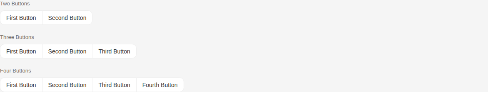
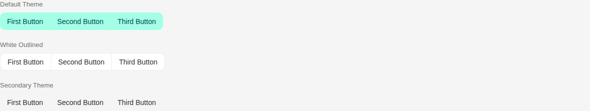
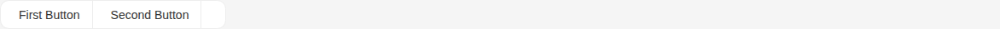

# ButtonsGroup

Storybook title `Components/ButtonsGroup` · source `./src/components/s-buttons-group/s-buttons-group.stories.tsx`

Tags rendered: `<s-button>`, `<s-buttons-group>`, `<s-dropdown>`

A buttons group is a container that groups related buttons together, providing visual cohesion and proper spacing.

## Props

| Prop | Type / control | Options | Default | Description |
|---|---|---|---|---|
| `layout` | select | `horizontal` | `horizontal` | Layout direction of the buttons group, currently only horizontal is supported.. vertical will be supported soon |

## Stories

### Default

Story id `components-buttonsgroup--default`


<details><summary>Rendered markup</summary>

```html
<s-buttons-group class="s-btn-group s-btn-group--horizontal hydrated">
      <s-button theme="white" outlined="" class="s-btn s-btn--white default md outlined ltr hydrated s-btn-group-item s-btn-group-item--start" target="_self">First Button</s-button>
      <s-button theme="white" outlined="" class="s-btn s-btn--white default md outlined ltr hydrated s-btn-group-item s-btn-group-item--end" target="_self">Second Button</s-button>
    </s-buttons-group>
```

</details>

### Button Count Variants

Story id `components-buttonsgroup--button-count-variants`



<details><summary>Rendered markup</summary>

```html
<div class="flex flex-col gap-6">
        
          <div class="flex flex-col gap-2">
            <span class="text-sm font-medium text-dark-100">Two Buttons</span>
            <s-buttons-group class="s-btn-group s-btn-group--horizontal hydrated">
          <s-button theme="white" outlined="" class="s-btn s-btn--white default md outlined ltr hydrated s-btn-group-item s-btn-group-item--start" target="_self">First Button</s-button>
          <s-button theme="white" outlined="" class="s-btn s-btn--white default md outlined ltr hydrated s-btn-group-item s-btn-group-item--end" target="_self">Second Button</s-button>
        </s-buttons-group>
          </div>
        
          <div class="flex flex-col gap-2">
            <span class="text-sm font-medium text-dark-100">Three Buttons</span>
            <s-buttons-group class="s-btn-group s-btn-group--horizontal hydrated">
          <s-button theme="white" outlined="" class="s-btn s-btn--white default md outlined ltr hydrated s-btn-group-item s-btn-group-item--start" target="_self">First Button</s-button>
          <s-button theme="white" outlined="" class="s-btn s-btn--white default md outlined ltr hydrated s-btn-group-item" target="_self">Second Button</s-button>
          <s-button theme="white" outlined="" class="s-btn s-btn--white default md outlined ltr hydrated s-btn-group-item s-btn-group-item--end is-last" target="_self">Third Button</s-button>
        </s-buttons-group>
          </div>
        
          <div class="flex flex-col gap-2">
            <span class="text-sm font-medium text-dark-100">Four Buttons</span>
            <s-buttons-group class="s-btn-group s-btn-group--horizontal hydrated">
          <s-button theme="white" outlined="" class="s-btn s-btn--white default md outlined ltr hydrated s-btn-group-item s-btn-group-item--start" target="_self">First Button</s-button>
          <s-button theme="white" outlined="" class="s-btn s-btn--white default md outlined ltr hydrated s-btn-group-item" target="_self">Second Button</s-button>
          <s-button theme="white" outlined="" class="s-btn s-btn--white default md outlined ltr hydrated s-btn-group-item" target="_self">Third Button</s-button>
          <s-button theme="white" outlined="" class="s-btn s-btn--white default md outlined ltr hydrated s-btn-group-item s-btn-group-item--end is-last" target="_self">Fourth Button</s-button>
        </s-buttons-group>
          </div>
        
      </div>
```

</details>

### Theme Variants

Story id `components-buttonsgroup--theme-variants`



<details><summary>Rendered markup</summary>

```html
<div class="flex flex-col gap-6">
        
          <div class="flex flex-col gap-2">
            <span class="text-sm font-medium text-dark-100">Default Theme</span>
            <s-buttons-group class="s-btn-group s-btn-group--horizontal hydrated">
          <s-button class="s-btn s-btn--default default md ltr hydrated s-btn-group-item s-btn-group-item--start" theme="default" target="_self">First Button</s-button>
          <s-button class="s-btn s-btn--default default md ltr hydrated s-btn-group-item" theme="default" target="_self">Second Button</s-button>
          <s-button class="s-btn s-btn--default default md ltr hydrated s-btn-group-item s-btn-group-item--end is-last" theme="default" target="_self">Third Button</s-button>
        </s-buttons-group>
          </div>
        
          <div class="flex flex-col gap-2">
            <span class="text-sm font-medium text-dark-100">White Outlined</span>
            <s-buttons-group class="s-btn-group s-btn-group--horizontal hydrated">
          <s-button theme="white" outlined="" class="s-btn s-btn--white default md outlined ltr hydrated s-btn-group-item s-btn-group-item--start" target="_self">First Button</s-button>
          <s-button theme="white" outlined="" class="s-btn s-btn--white default md outlined ltr hydrated s-btn-group-item" target="_self">Second Button</s-button>
          <s-button theme="white" outlined="" class="s-btn s-btn--white default md outlined ltr hydrated s-btn-group-item s-btn-group-item--end is-last" target="_self">Third Button</s-button>
        </s-buttons-group>
          </div>
        
          <div class="flex flex-col gap-2">
            <span class="text-sm font-medium text-dark-100">Secondary Theme</span>
            <s-buttons-group class="s-btn-group s-btn-group--horizontal hydrated">
          <s-button theme="secondary" class="s-btn s-btn--secondary default md ltr hydrated s-btn-group-item s-btn-group-item--start" target="_self">First Button</s-button>
          <s-button theme="secondary" class="s-btn s-btn--secondary default md ltr hydrated s-btn-group-item" target="_self">Second Button</s-button>
          <s-button theme="secondary" class="s-btn s-btn--secondary default md ltr hydrated s-btn-group-item s-btn-group-item--end is-last" target="_self">Third Button</s-button>
        </s-buttons-group>
          </div>
        
      </div>
```

</details>

### With Dropdown

Story id `components-buttonsgroup--with-dropdown`


<details><summary>Rendered markup</summary>

```html
<s-buttons-group class="s-btn-group s-btn-group--horizontal hydrated">
      <s-button theme="white" outlined="" class="s-btn s-btn--white default md outlined ltr hydrated s-btn-group-item s-btn-group-item--start" target="_self">First Button</s-button>
      <s-button theme="white" outlined="" class="s-btn s-btn--white default md outlined ltr hydrated s-btn-group-item" target="_self">Second Button</s-button>
      <s-dropdown name="input-name" layout="end" items="[{&quot;id&quot;:0,&quot;label&quot;:&quot;Sort Items&quot;,&quot;icon&quot;:&quot;hgi-stroke hgi-sorting-01&quot;},{&quot;id&quot;:1,&quot;label&quot;:&quot;Settings&quot;,&quot;icon&quot;:&quot;hgi-stroke hgi-settings-01&quot;},{&quot;id&quot;:2,&quot;label&quot;:&quot;Copy Selected Products&quot;,&quot;icon&quot;:&quot;hgi-stroke hgi-copy-01&quot;,&quot;route&quot;:&quot;/&quot;},{&quot;id&quot;:3,&quot;label&quot;:&quot;Export&quot;,&quot;icon&quot;:&quot;hgi-stroke hgi-share-05&quot;,&quot;route&quot;:&quot;/&quot;},{&quot;id&quot;:4,&quot;label&quot;:&quot;Delete&quot;,&quot;icon&quot;:&quot;hgi-stroke hgi-delete-02&quot;,&quot;route&quot;:&quot;/&quot;,&quot;type&quot;:&quot;danger&quot;}]" class="h-fit end ltr hydrated s-btn-group-item s-btn-group-item--end is-last">
        <s-button theme="white" outlined="" slot="dropdown-head" data-toggle="true" class="s-btn s-btn--white default md outlined ltr hydrated s-btn-group-item s-btn-group-item--end is-last" target="_self">
          <i class="hgi-stroke hgi-more-horizontal"></i>
        </s-button>
      </s-dropdown>
    </s-buttons-group>
```

</details>

### Dropdown In Middle

Story id `components-buttonsgroup--dropdown-in-middle`


<details><summary>Rendered markup</summary>

```html
<s-buttons-group class="s-btn-group s-btn-group--horizontal hydrated">
        <s-button theme="white" outlined="" class="s-btn s-btn--white default md outlined ltr hydrated s-btn-group-item s-btn-group-item--start" target="_self">First Button</s-button>
        <s-dropdown name="input-name" layout="end" items="[{&quot;id&quot;:0,&quot;label&quot;:&quot;Sort Items&quot;,&quot;icon&quot;:&quot;hgi-stroke hgi-sorting-01&quot;},{&quot;id&quot;:1,&quot;label&quot;:&quot;Settings&quot;,&quot;icon&quot;:&quot;hgi-stroke hgi-settings-01&quot;},{&quot;id&quot;:2,&quot;label&quot;:&quot;Copy Selected Products&quot;,&quot;icon&quot;:&quot;hgi-stroke hgi-copy-01&quot;,&quot;route&quot;:&quot;/&quot;},{&quot;id&quot;:3,&quot;label&quot;:&quot;Export&quot;,&quot;icon&quot;:&quot;hgi-stroke hgi-share-05&quot;,&quot;route&quot;:&quot;/&quot;},{&quot;id&quot;:4,&quot;label&quot;:&quot;Delete&quot;,&quot;icon&quot;:&quot;hgi-stroke hgi-delete-02&quot;,&quot;route&quot;:&quot;/&quot;,&quot;type&quot;:&quot;danger&quot;}]" class="h-fit end ltr hydrated s-btn-group-item">
          <s-button theme="white" outlined="" slot="dropdown-head" data-toggle="true" class="s-btn s-btn--white default md outlined ltr hydrated s-btn-group-item" target="_self">
            <i class="hgi-stroke hgi-arrow-down-01"></i>
          </s-button>
        </s-dropdown>
        <s-button theme="white" outlined="" class="s-btn s-btn--white default md outlined ltr hydrated s-btn-group-item s-btn-group-item--end is-last" target="_self">Second Button</s-button>
      </s-buttons-group>
```

</details>

### Buttons With Icons

Story id `components-buttonsgroup--buttons-with-icons`



<details><summary>Rendered markup</summary>

```html
<s-buttons-group class="s-btn-group s-btn-group--horizontal hydrated">
      <s-button theme="white" outlined="" class="s-btn s-btn--white default md outlined ltr hydrated s-btn-group-item s-btn-group-item--start" target="_self">
        <i class="hgi-stroke hgi-file-add"></i>
        First Button
      </s-button>
      <s-button theme="white" outlined="" class="s-btn s-btn--white default md outlined ltr hydrated s-btn-group-item" target="_self">
        <i class="hgi-stroke hgi-edit-02"></i>
        Second Button
      </s-button>
      <s-dropdown name="actions" layout="end" items="[{&quot;id&quot;:0,&quot;label&quot;:&quot;Sort Items&quot;,&quot;icon&quot;:&quot;hgi-stroke hgi-sorting-01&quot;},{&quot;id&quot;:1,&quot;label&quot;:&quot;Settings&quot;,&quot;icon&quot;:&quot;hgi-stroke hgi-settings-01&quot;},{&quot;id&quot;:2,&quot;label&quot;:&quot;Copy Selected Products&quot;,&quot;icon&quot;:&quot;hgi-stroke hgi-copy-01&quot;,&quot;route&quot;:&quot;/&quot;},{&quot;id&quot;:3,&quot;label&quot;:&quot;Export&quot;,&quot;icon&quot;:&quot;hgi-stroke hgi-share-05&quot;,&quot;route&quot;:&quot;/&quot;},{&quot;id&quot;:4,&quot;label&quot;:&quot;Delete&quot;,&quot;icon&quot;:&quot;hgi-stroke hgi-delete-02&quot;,&quot;route&quot;:&quot;/&quot;,&quot;type&quot;:&quot;danger&quot;}]" class="h-fit end ltr hydrated s-btn-group-item s-btn-group-item--end is-last">
        <s-button theme="white" outlined="" slot="dropdown-head" data-toggle="true" class="s-btn s-btn--white default md outlined ltr hydrated s-btn-group-item s-btn-group-item--end is-last" target="_self">
          <i class="hgi-stroke hgi-more-horizontal"></i>
        </s-button>
      </s-dropdown>
    </s-buttons-group>
```

</details>

### With Disabled States

Story id `components-buttonsgroup--with-disabled-states`


<details><summary>Rendered markup</summary>

```html
<s-buttons-group class="s-btn-group s-btn-group--horizontal hydrated">
      <s-button theme="white" outlined="" class="s-btn s-btn--white default md outlined ltr hydrated s-btn-group-item s-btn-group-item--start" target="_self">First Button</s-button>
      <s-button theme="white" outlined="" disabled="" class="s-btn s-btn--white default md outlined disabled ltr hydrated s-btn-group-item" target="_self">Second Button</s-button>
      <s-button theme="white" outlined="" disabled="" class="s-btn s-btn--white default md outlined disabled ltr hydrated s-btn-group-item s-btn-group-item--end is-last" target="_self">Third Button</s-button>
    </s-buttons-group>
```

</details>
