# Checkbox

Storybook title `Components/Checkbox` · source `./src/components/s-checkbox/s-checkbox.stories.tsx`

Tags rendered: `<s-checkbox>`

A checkbox is a form element that allows users to select one or more options from a list. It is commonly used in forms to gather user preferences or choices.

## Props

| Prop | Type / control | Options | Default | Description |
|---|---|---|---|---|
| `label` | string |  |  | Checkbox label |
| `desc` | string |  |  | Checkbox description |
| `required` | boolean |  | `false` | If the checkbox is required |
| `disabled` | boolean |  | `false` | Disabled state |
| `readonly` | boolean |  | `false` | Freezes the value without the disabled styling — the box keeps its normal contrast and the input never receives the `disabled` attribute. |
| `hasError` | boolean |  | `false` | Checkbox error state |
| `checked` | boolean |  | `false` | Checked state |
| `direction` | string |  | `col` | Sets the layout direction, col or row, with default col |
| `feature` | boolean |  | `true` | Feature based state |
| `value` | text |  |  | Single Checkbox value |
| `items` | text |  | `[]` | Multiple Checkbox value |
| `indeterminate` | boolean |  | `false` | IF the checkbox is partially selected |
| `loading` | boolean |  | `false` | Replaces every option with a skeleton placeholder so the row height is preserved during data fetches. Per-option loading is supported via `loading: true` on an individual item. |
| `valueChanged` |  |  |  | Emitted when the checkbox value changes. |

## Stories

### Default

Story id `components-checkbox--default`

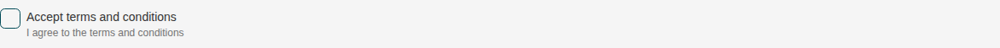

Args:

```json
{
  "label": "Accept terms and conditions",
  "desc": "I agree to the terms and conditions",
  "required": false,
  "disabled": false,
  "readonly": false,
  "hasError": false,
  "checked": false,
  "direction": "col",
  "feature": true
}
```

<details><summary>Rendered markup</summary>

```html
<s-checkbox label="Accept terms and conditions" desc="I agree to the terms and conditions" direction="col" feature="true" @valuechanged="ev=&gt;console.log(" value="" changed:",ev.detail)"="" class="s-checkbox ltr hydrated"></s-checkbox>
```

</details>

### Checked

Story id `components-checkbox--checked`


Args:

```json
{
  "label": "Accept terms and conditions",
  "desc": "I agree to the terms and conditions",
  "required": false,
  "disabled": false,
  "readonly": false,
  "hasError": false,
  "checked": true,
  "direction": "col",
  "feature": true
}
```

<details><summary>Rendered markup</summary>

```html
<s-checkbox label="Accept terms and conditions" desc="I agree to the terms and conditions" checked="" direction="col" feature="true" @valuechanged="ev=&gt;console.log(" value="" changed:",ev.detail)"="" class="s-checkbox ltr hydrated"></s-checkbox>
```

</details>

### Indeterminate

Story id `components-checkbox--indeterminate`

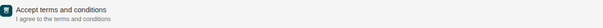

Args:

```json
{
  "label": "Accept terms and conditions",
  "desc": "I agree to the terms and conditions",
  "required": false,
  "disabled": false,
  "readonly": false,
  "hasError": false,
  "checked": false,
  "direction": "col",
  "feature": true,
  "indeterminate": true
}
```

<details><summary>Rendered markup</summary>

```html
<s-checkbox label="Accept terms and conditions" desc="I agree to the terms and conditions" indeterminate="" direction="col" feature="true" @valuechanged="ev=&gt;console.log(" value="" changed:",ev.detail)"="" class="s-checkbox ltr hydrated"></s-checkbox>
```

</details>

### Group Options

Story id `components-checkbox--group-options`

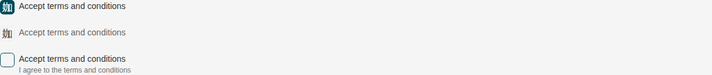

Args:

```json
{
  "label": "Accept terms and conditions",
  "desc": "I agree to the terms and conditions",
  "required": true,
  "disabled": false,
  "readonly": false,
  "hasError": false,
  "checked": false,
  "direction": "col",
  "feature": true,
  "items": "[{\"id\":0,\"value\":\"option-1\",\"label\":\"Accept terms and conditions\", \"checked\": true},{\"id\":1,\"value\":\"option-2\",\"label\":\"Accept terms and conditions\", \"feature\": false, \"checked\": true},{\"id\":2,\"value\":\"option-3\",\"label\":\"Accept terms and conditions\",\"desc\":\"I agree to the terms and conditions\"}]"
}
```

<details><summary>Rendered markup</summary>

```html
<s-checkbox items="[{&quot;id&quot;:0,&quot;value&quot;:&quot;option-1&quot;,&quot;label&quot;:&quot;Accept terms and conditions&quot;, &quot;checked&quot;: true},{&quot;id&quot;:1,&quot;value&quot;:&quot;option-2&quot;,&quot;label&quot;:&quot;Accept terms and conditions&quot;, &quot;feature&quot;: false, &quot;checked&quot;: true},{&quot;id&quot;:2,&quot;value&quot;:&quot;option-3&quot;,&quot;label&quot;:&quot;Accept terms and conditions&quot;,&quot;desc&quot;:&quot;I agree to the terms and conditions&quot;}]" label="Accept terms and conditions" desc="I agree to the terms and conditions" required="" direction="col" feature="true" @valuechanged="ev=&gt;console.log(" value="" changed:",ev.detail)"="" class="s-checkbox ltr hydrated"></s-checkbox>
```

</details>

### Row Direction

Story id `components-checkbox--row-direction`

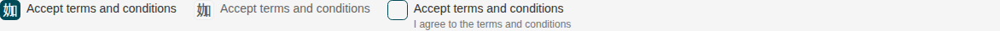

Args:

```json
{
  "label": "Accept terms and conditions",
  "desc": "I agree to the terms and conditions",
  "required": true,
  "disabled": false,
  "readonly": false,
  "hasError": false,
  "checked": false,
  "direction": "row",
  "feature": true,
  "items": "[{\"id\":0,\"value\":\"option-1\",\"label\":\"Accept terms and conditions\", \"checked\": true},{\"id\":1,\"value\":\"option-2\",\"label\":\"Accept terms and conditions\", \"feature\": false, \"checked\": true},{\"id\":2,\"value\":\"option-3\",\"label\":\"Accept terms and conditions\",\"desc\":\"I agree to the terms and conditions\"}]"
}
```

<details><summary>Rendered markup</summary>

```html
<s-checkbox items="[{&quot;id&quot;:0,&quot;value&quot;:&quot;option-1&quot;,&quot;label&quot;:&quot;Accept terms and conditions&quot;, &quot;checked&quot;: true},{&quot;id&quot;:1,&quot;value&quot;:&quot;option-2&quot;,&quot;label&quot;:&quot;Accept terms and conditions&quot;, &quot;feature&quot;: false, &quot;checked&quot;: true},{&quot;id&quot;:2,&quot;value&quot;:&quot;option-3&quot;,&quot;label&quot;:&quot;Accept terms and conditions&quot;,&quot;desc&quot;:&quot;I agree to the terms and conditions&quot;}]" label="Accept terms and conditions" desc="I agree to the terms and conditions" required="" direction="row" feature="true" @valuechanged="ev=&gt;console.log(" value="" changed:",ev.detail)"="" class="s-checkbox ltr hydrated"></s-checkbox>
```

</details>

### Exclusive Option

Story id `components-checkbox--exclusive-option`

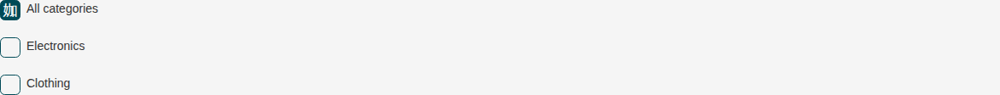

Args:

```json
{
  "label": "Accept terms and conditions",
  "desc": "I agree to the terms and conditions",
  "required": false,
  "disabled": false,
  "readonly": false,
  "hasError": false,
  "checked": false,
  "direction": "col",
  "feature": true,
  "items": "[{\"id\":0,\"value\":\"all\",\"label\":\"All categories\",\"exclusive\":true,\"checked\":true},{\"id\":1,\"value\":\"a\",\"label\":\"Electronics\"},{\"id\":2,\"value\":\"b\",\"label\":\"Clothing\"}]"
}
```

<details><summary>Rendered markup</summary>

```html
<s-checkbox items="[{&quot;id&quot;:0,&quot;value&quot;:&quot;all&quot;,&quot;label&quot;:&quot;All categories&quot;,&quot;exclusive&quot;:true,&quot;checked&quot;:true},{&quot;id&quot;:1,&quot;value&quot;:&quot;a&quot;,&quot;label&quot;:&quot;Electronics&quot;},{&quot;id&quot;:2,&quot;value&quot;:&quot;b&quot;,&quot;label&quot;:&quot;Clothing&quot;}]" label="Accept terms and conditions" desc="I agree to the terms and conditions" direction="col" feature="true" @valuechanged="ev=&gt;console.log(" value="" changed:",ev.detail)"="" class="s-checkbox ltr hydrated"></s-checkbox>
```

</details>

### Required

Story id `components-checkbox--required`

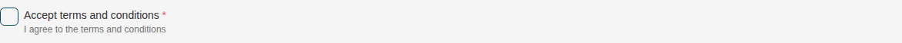

Args:

```json
{
  "label": "Accept terms and conditions",
  "desc": "I agree to the terms and conditions",
  "required": true,
  "disabled": false,
  "readonly": false,
  "hasError": false,
  "checked": false,
  "direction": "col",
  "feature": true
}
```

<details><summary>Rendered markup</summary>

```html
<s-checkbox label="Accept terms and conditions" desc="I agree to the terms and conditions" required="" direction="col" feature="true" @valuechanged="ev=&gt;console.log(" value="" changed:",ev.detail)"="" class="s-checkbox ltr hydrated"></s-checkbox>
```

</details>

### Feature Based

Story id `components-checkbox--feature-based`

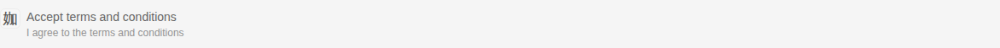

Args:

```json
{
  "label": "Accept terms and conditions",
  "desc": "I agree to the terms and conditions",
  "required": false,
  "disabled": false,
  "readonly": false,
  "hasError": false,
  "checked": true,
  "direction": "col",
  "feature": false
}
```

<details><summary>Rendered markup</summary>

```html
<s-checkbox label="Accept terms and conditions" desc="I agree to the terms and conditions" checked="" direction="col" feature="false" @valuechanged="ev=&gt;console.log(" value="" changed:",ev.detail)"="" class="s-checkbox is-feature ltr hydrated"></s-checkbox>
```

</details>

### Disabled

Story id `components-checkbox--disabled`

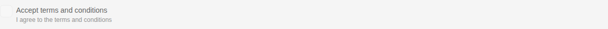

Args:

```json
{
  "label": "Accept terms and conditions",
  "desc": "I agree to the terms and conditions",
  "required": false,
  "disabled": true,
  "readonly": false,
  "hasError": false,
  "checked": false,
  "direction": "col",
  "feature": true
}
```

<details><summary>Rendered markup</summary>

```html
<s-checkbox label="Accept terms and conditions" desc="I agree to the terms and conditions" disabled="" direction="col" feature="true" @valuechanged="ev=&gt;console.log(" value="" changed:",ev.detail)"="" class="s-checkbox ltr hydrated"></s-checkbox>
```

</details>

### Readonly

Story id `components-checkbox--readonly`

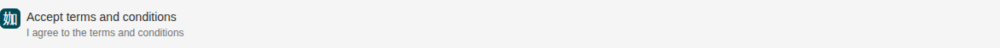

Args:

```json
{
  "label": "Accept terms and conditions",
  "desc": "I agree to the terms and conditions",
  "required": false,
  "disabled": false,
  "readonly": true,
  "hasError": false,
  "checked": true,
  "direction": "col",
  "feature": true
}
```

<details><summary>Rendered markup</summary>

```html
<s-checkbox label="Accept terms and conditions" desc="I agree to the terms and conditions" readonly="" checked="" direction="col" feature="true" @valuechanged="ev=&gt;console.log(" value="" changed:",ev.detail)"="" class="s-checkbox readonly ltr hydrated"></s-checkbox>
```

</details>

### Disabled Item

Story id `components-checkbox--disabled-item`

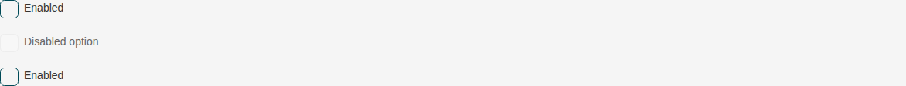

Args:

```json
{
  "label": "Accept terms and conditions",
  "desc": "I agree to the terms and conditions",
  "required": false,
  "disabled": false,
  "readonly": false,
  "hasError": false,
  "checked": false,
  "direction": "col",
  "feature": true,
  "items": "[{\"id\":0,\"value\":\"a\",\"label\":\"Enabled\"},{\"id\":1,\"value\":\"b\",\"label\":\"Disabled option\",\"disabled\":true},{\"id\":2,\"value\":\"c\",\"label\":\"Enabled\"}]"
}
```

<details><summary>Rendered markup</summary>

```html
<s-checkbox items="[{&quot;id&quot;:0,&quot;value&quot;:&quot;a&quot;,&quot;label&quot;:&quot;Enabled&quot;},{&quot;id&quot;:1,&quot;value&quot;:&quot;b&quot;,&quot;label&quot;:&quot;Disabled option&quot;,&quot;disabled&quot;:true},{&quot;id&quot;:2,&quot;value&quot;:&quot;c&quot;,&quot;label&quot;:&quot;Enabled&quot;}]" label="Accept terms and conditions" desc="I agree to the terms and conditions" direction="col" feature="true" @valuechanged="ev=&gt;console.log(" value="" changed:",ev.detail)"="" class="s-checkbox ltr hydrated"></s-checkbox>
```

</details>

### Loading

Story id `components-checkbox--loading`


Args:

```json
{
  "label": "Accept terms and conditions",
  "desc": "I agree to the terms and conditions",
  "required": false,
  "disabled": false,
  "readonly": false,
  "hasError": false,
  "checked": false,
  "direction": "col",
  "feature": true,
  "items": "[{\"id\":0,\"value\":\"option-1\",\"label\":\"Accept terms and conditions\", \"checked\": true},{\"id\":1,\"value\":\"option-2\",\"label\":\"Accept terms and conditions\", \"feature\": false, \"checked\": true},{\"id\":2,\"value\":\"option-3\",\"label\":\"Accept terms and conditions\",\"desc\":\"I agree to the terms and conditions\"}]",
  "loading": true
}
```

<details><summary>Rendered markup</summary>

```html
<s-checkbox items="[{&quot;id&quot;:0,&quot;value&quot;:&quot;option-1&quot;,&quot;label&quot;:&quot;Accept terms and conditions&quot;, &quot;checked&quot;: true},{&quot;id&quot;:1,&quot;value&quot;:&quot;option-2&quot;,&quot;label&quot;:&quot;Accept terms and conditions&quot;, &quot;feature&quot;: false, &quot;checked&quot;: true},{&quot;id&quot;:2,&quot;value&quot;:&quot;option-3&quot;,&quot;label&quot;:&quot;Accept terms and conditions&quot;,&quot;desc&quot;:&quot;I agree to the terms and conditions&quot;}]" label="Accept terms and conditions" desc="I agree to the terms and conditions" direction="col" feature="true" loading="" @valuechanged="ev=&gt;console.log(" value="" changed:",ev.detail)"="" class="s-checkbox is-loading ltr hydrated" aria-busy="true"></s-checkbox>
```

</details>

### Loading Item

Story id `components-checkbox--loading-item`

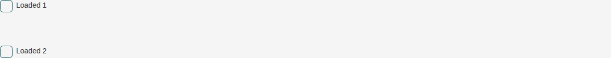

Args:

```json
{
  "label": "Accept terms and conditions",
  "desc": "I agree to the terms and conditions",
  "required": false,
  "disabled": false,
  "readonly": false,
  "hasError": false,
  "checked": false,
  "direction": "col",
  "feature": true,
  "items": "[{\"id\":0,\"value\":\"a\",\"label\":\"Loaded 1\"},{\"id\":1,\"value\":\"b\",\"label\":\"Loading\",\"loading\":true},{\"id\":2,\"value\":\"c\",\"label\":\"Loaded 2\"}]"
}
```

<details><summary>Rendered markup</summary>

```html
<s-checkbox items="[{&quot;id&quot;:0,&quot;value&quot;:&quot;a&quot;,&quot;label&quot;:&quot;Loaded 1&quot;},{&quot;id&quot;:1,&quot;value&quot;:&quot;b&quot;,&quot;label&quot;:&quot;Loading&quot;,&quot;loading&quot;:true},{&quot;id&quot;:2,&quot;value&quot;:&quot;c&quot;,&quot;label&quot;:&quot;Loaded 2&quot;}]" label="Accept terms and conditions" desc="I agree to the terms and conditions" direction="col" feature="true" @valuechanged="ev=&gt;console.log(" value="" changed:",ev.detail)"="" class="s-checkbox ltr hydrated" aria-busy="true"></s-checkbox>
```

</details>

### Has Error

Story id `components-checkbox--has-error`

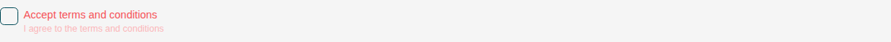

Args:

```json
{
  "label": "Accept terms and conditions",
  "desc": "I agree to the terms and conditions",
  "required": false,
  "disabled": false,
  "readonly": false,
  "hasError": true,
  "checked": false,
  "direction": "col",
  "feature": true
}
```

<details><summary>Rendered markup</summary>

```html
<s-checkbox label="Accept terms and conditions" desc="I agree to the terms and conditions" has-error="" direction="col" feature="true" @valuechanged="ev=&gt;console.log(" value="" changed:",ev.detail)"="" class="s-checkbox has-error ltr hydrated"></s-checkbox>
```

</details>
