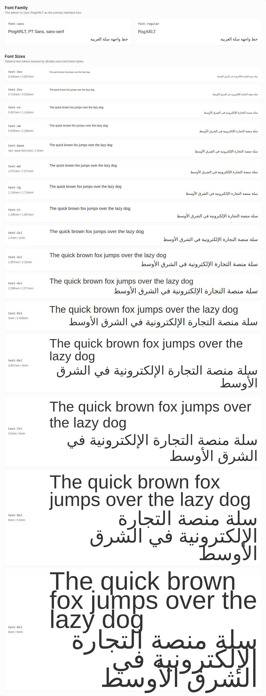

# Design System/Typography

Storybook title `Design System/Typography` · source `./src/design-system/typography.stories.ts`

Salla design-system typography tokens from @salla.sa/ui-merchant-styles. Use the Tailwind class names in application and component code.

## Stories

### Font Sizes

Story id `design-system-typography--font-sizes`



<details><summary>Rendered markup</summary>

```html
<div class="flex flex-col gap-10 rounded-xl bg-gray-100 p-6 text-dark">
    
  <section class="flex flex-col gap-4">
    <div>
      <h2 class="text-xl font-bold text-dark">Font Family</h2>
      <p class="text-sm text-dark-100">The admin UI uses PingARLT as the primary interface font.</p>
    </div>
    <div class="grid gap-4 md:grid-cols-2">
      <div class="rounded-lg border border-gray-300 bg-white p-4 shadow-xs">
        <code class="text-sm text-dark">font-sans</code>
        <p class="mt-3 font-sans text-xl text-dark">PingARLT, PT Sans, sans-serif</p>
        <p class="mt-2 font-sans text-xl text-dark" dir="rtl">خط واجهة سلة العربية</p>
      </div>
      <div class="rounded-lg border border-gray-300 bg-white p-4 shadow-xs">
        <code class="text-sm text-dark">font-regular</code>
        <p class="mt-3 font-regular text-xl text-dark">PingARLT</p>
        <p class="mt-2 font-regular text-xl text-dark" dir="rtl">خط واجهة سلة العربية</p>
      </div>
    </div>
  </section>

    
  <section class="flex flex-col gap-4">
    <div>
      <h2 class="text-xl font-bold text-dark">Font Sizes</h2>
      <p class="text-sm text-dark-100">Tailwind text tokens backed by @salla.sa/ui-merchant-styles.</p>
    </div>
    <div class="flex flex-col gap-3">
      
  <div class="grid gap-4 rounded-lg border border-gray-300 bg-white p-4 shadow-xs md:grid-cols-[12rem_1fr] md:items-center">
    <div class="flex flex-col gap-1">
      <code class="text-sm text-dark">text-3xs</code>
      <span class="text-xs text-dark-100">0.643rem / 0.857rem</span>
    </div>
    <div class="flex flex-col gap-2">
      <p class="text-3xs text-dark">The quick brown fox jumps over the lazy dog</p>
      <p class="text-3xs text-dark" dir="rtl">سلة منصة التجارة الإلكترونية في الشرق الأوسط</p>
    </div>
  </div>

  <div class="grid gap-4 rounded-lg border border-gray-300 bg-white p-4 shadow-xs md:grid-cols-[12rem_1fr] md:items-center">
    <div class="flex flex-col gap-1">
      <code class="text-sm text-dark">text-2xs</code>
      <span class="text-xs text-dark-100">0.714rem / 0.929rem</span>
    </div>
    <div class="flex flex-col gap-2">
      <p class="text-2xs text-dark">The quick brown fox jumps over the lazy dog</p>
      <p class="text-2xs text-dark" dir="rtl">سلة منصة التجارة الإلكترونية في الشرق الأوسط</p>
    </div>
  </div>

  <div class="grid gap-4 rounded-lg border border-gray-300 bg-white p-4 shadow-xs md:grid-cols-[12rem_1fr] md:items-center">
    <div class="flex flex-col gap-1">
      <code class="text-sm text-dark">text-xs</code>
      <span class="text-xs text-dark-100">0.857rem / 1.143rem</span>
    </div>
    <div class="flex flex-col gap-2">
      <p class="text-xs text-dark">The quick brown fox jumps over the lazy dog</p>
      <p class="text-xs text-dark" dir="rtl">سلة منصة التجارة الإلكترونية في الشرق الأوسط</p>
    </div>
  </div>

  <div class="grid gap-4 rounded-lg border border-gray-300 bg-white p-4 shadow-xs md:grid-cols-[12rem_1fr] md:items-center">
    <div class="flex flex-col gap-1">
      <code class="text-sm text-dark">text-sm</code>
      <span class="text-xs text-dark-100">0.929rem / 1.286rem</span>
    </div>
    <div class="flex flex-col gap-2">
      <p class="text-sm text-dark">The quick brown fox jumps over the lazy dog</p>
      <p class="text-sm text-dark" dir="rtl">سلة منصة التجارة الإلكترونية في الشرق الأوسط</p>
    </div>
  </div>

  <div class="grid gap-4 rounded-lg border border-gray-300 bg-white p-4 shadow-xs md:grid-cols-[12rem_1fr] md:items-center">
    <div class="flex flex-col gap-1">
      <code class="text-sm text-dark">text-base</code>
      <span class="text-xs text-dark-100">var(--base-font-size) / 1.5rem</span>
    </div>
    <div class="flex flex-col gap-2">
      <p class="text-base text-dark">The quick brown fox jumps over the lazy dog</p>
      <p class="text-base text-dark" dir="rtl">سلة منصة التجارة الإلكترونية في الشرق الأوسط</p>
    </div>
  </div>

  <div class="grid gap-4 rounded-lg border border-gray-300 bg-white p-4 shadow-xs md:grid-cols-[12rem_1fr] md:items-center">
    <div class="flex flex-col gap-1">
      <code class="text-sm text-dark">text-md</code>
      <span class="text-xs text-dark-100">1.071rem / 1.571rem</span>
    </div>
    <div class="flex flex-col gap-2">
      <p class="text-md text-dark">The quick brown fox jumps over the lazy dog</p>
      <p class="text-md text-dark" dir="rtl">سلة منصة التجارة الإلكترونية في الشرق الأوسط</p>
    </div>
  </div>

  <div class="grid gap-4 rounded-lg border border-gray-300 bg-white p-4 shadow-xs md:grid-cols-[12rem_1fr] md:items-center">
    <div class="flex flex-col gap-1">
      <code class="text-sm text-dark">text-lg</code>
      <span class="text-xs text-dark-100">1.143rem / 1.714rem</span>
    </div>
    <div class="flex flex-col gap-2">
      <p class="text-lg text-dark">The quick brown fox jumps over the lazy dog</p>
      <p class="text-lg text-dark" dir="rtl">سلة منصة التجارة الإلكترونية في الشرق الأوسط</p>
    </div>
  </div>

  <div class="grid gap-4 rounded-lg border border-gray-300 bg-white p-4 shadow-xs md:grid-cols-[12rem_1fr] md:items-center">
    <div class="flex flex-col gap-1">
      <code class="text-sm text-dark">text-xl</code>
      <span class="text-xs text-dark-100">1.286rem / 1.857rem</span>
    </div>
    <div class="flex flex-col gap-2">
      <p class="text-xl text-dark">The quick brown fox jumps over the lazy dog</p>
      <p class="text-xl text-dark" dir="rtl">سلة منصة التجارة الإلكترونية في الشرق الأوسط</p>
    </div>
  </div>

  <div class="grid gap-4 rounded-lg border border-gray-300 bg-white p-4 shadow-xs md:grid-cols-[12rem_1fr] md:items-center">
    <div class="flex flex-col gap-1">
      <code class="text-sm text-dark">text-2xl</code>
      <span class="text-xs text-dark-100">1.5rem / 2rem</span>
    </div>
    <div class="flex flex-col gap-2">
      <p class="text-2xl text-dark">The quick brown fox jumps over the lazy dog</p>
      <p class="text-2xl text-dark" dir="rtl">سلة منصة التجارة الإلكترونية في الشرق الأوسط</p>
    </div>
  </div>

  <div class="grid gap-4 rounded-lg border border-gray-300 bg-white p-4 shadow-xs md:grid-cols-[12rem_1fr] md:items-center">
    <div class="flex flex-col gap-1">
      <code class="text-sm text-dark">text-3xl</code>
      <span class="text-xs text-dark-100">1.857rem / 2.25rem</span>
    </div>
    <div class="flex flex-col gap-2">
      <p class="text-3xl text-dark">The quick brown fox jumps over the lazy dog</p>
      <p class="text-3xl text-dark" dir="rtl">سلة منصة التجارة الإلكترونية في الشرق الأوسط</p>
    </div>
  </div>

  <div class="grid gap-4 rounded-lg border border-gray-300 bg-white p-4 shadow-xs md:grid-cols-[12rem_1fr] md:items-center">
    <div class="flex flex-col gap-1">
      <code class="text-sm text-dark">text-4xl</code>
      <span class="text-xs text-dark-100">2.286rem / 2.571rem</span>
    </div>
    <div class="flex flex-col gap-2">
      <p class="text-4xl text-dark">The quick brown fox jumps over the lazy dog</p>
      <p class="text-4xl text-dark" dir="rtl">سلة منصة التجارة الإلكترونية في الشرق الأوسط</p>
    </div>
  </div>

  <div class="grid gap-4 rounded-lg border border-gray-300 bg-white p-4 shadow-xs md:grid-cols-[12rem_1fr] md:items-center">
    <div class="flex flex-col gap-1">
      <code class="text-sm text-dark">text-5xl</code>
      <span class="text-xs text-dark-100">3rem / 3.429rem</span>
    </div>
    <div class="flex flex-col gap-2">
      <p class="text-5xl text-dark">The quick brown fox jumps over the lazy dog</p>
      <p class="text-5xl text-dark" dir="rtl">سلة منصة التجارة الإلكترونية في الشرق الأوسط</p>
    </div>
  </div>

  <div class="grid gap-4 rounded-lg border border-gray-300 bg-white p-4 shadow-xs md:grid-cols-[12rem_1fr] md:items-center">
    <div class="flex flex-col gap-1">
      <code class="text-sm text-dark">text-6xl</code>
      <span class="text-xs text-dark-100">3.857rem / 4rem</span>
    </div>
    <div class="flex flex-col gap-2">
      <p class="text-6xl text-dark">The quick brown fox jumps over the lazy dog</p>
      <p class="text-6xl text-dark" dir="rtl">سلة منصة التجارة الإلكترونية في الشرق الأوسط</p>
    </div>
  </div>

  <div class="grid gap-4 rounded-lg border border-gray-300 bg-white p-4 shadow-xs md:grid-cols-[12rem_1fr] md:items-center">
    <div class="flex flex-col gap-1">
      <code class="text-sm text-dark">text-7xl</code>
      <span class="text-xs text-dark-100">4.5rem / 5rem</span>
    </div>
    <div class="flex flex-col gap-2">
      <p class="text-7xl text-dark">The quick brown fox jumps over the lazy dog</p>
      <p class="text-7xl text-dark" dir="rtl">سلة منصة التجارة الإلكترونية في الشرق الأوسط</p>
    </div>
  </div>

  <div class="grid gap-4 rounded-lg border border-gray-300 bg-white p-4 shadow-xs md:grid-cols-[12rem_1fr] md:items-center">
    <div class="flex flex-col gap-1">
      <code class="text-sm text-dark">text-8xl</code>
      <span class="text-xs text-dark-100">6rem / 5.5rem</span>
    </div>
    <div class="flex flex-col gap-2">
      <p class="text-8xl text-dark">The quick brown fox jumps over the lazy dog</p>
      <p class="text-8xl text-dark" dir="rtl">سلة منصة التجارة الإلكترونية في الشرق الأوسط</p>
    </div>
  </div>

  <div class="grid gap-4 rounded-lg border border-gray-300 bg-white p-4 shadow-xs md:grid-cols-[12rem_1fr] md:items-center">
    <div class="flex flex-col gap-1">
      <code class="text-sm text-dark">text-9xl</code>
      <span class="text-xs text-dark-100">8rem / 6rem</span>
    </div>
    <div class="flex flex-col gap-2">
      <p class="text-9xl text-dark">The quick brown fox jumps over the lazy dog</p>
      <p class="text-9xl text-dark" dir="rtl">سلة منصة التجارة الإلكترونية في الشرق الأوسط</p>
    </div>
  </div>

    </div>
  </section>

  </div>
```

</details>
