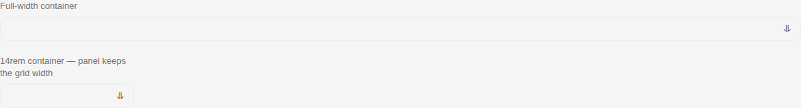
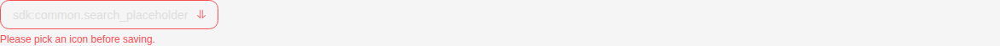
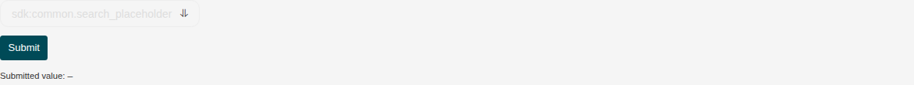

# IconPicker

Storybook title `Components/IconPicker` · source `./src/components/s-icon-picker/s-icon-picker.stories.tsx`

Tags rendered: `<s-icon-picker>`

Searchable, paginated icon grid rendered inside a built-in dropdown. Renders the currently-picked icon in a trigger button; the grid opens on click.

## Props

| Prop | Type / control | Options | Default | Description |
|---|---|---|---|---|
| `source` | string | `hugeicons`, `sicon` | `hugeicons` | Icon library — `hugeicons` (prefixed) or `sicon`. |
| `value` | text |  |  | Selected icon name / class token. |
| `name` | text |  |  | Form field name (participates in native `<form>` submission). |
| `placeholder` | text |  |  | Search-input placeholder. |
| `searchable` | boolean |  | `true` | Show the search input above the grid. |
| `minWidth` | text |  | `10rem` | Minimum width of the trigger button. Any CSS length. Ignored when `wide` is set. |
| `wide` | boolean |  |  | Stretch the trigger to fill its container; the panel widens to match. Takes precedence over `min-width`. |
| `iconSize` | text |  | `1.25rem` | Font size of icons inside grid cells. |
| `iconCellSize` | text |  | `2.5rem` | Height / width of each grid tile. |
| `required` | boolean |  |  | Marks the field as required for native form validity. |
| `disabled` | boolean |  |  | Disables the picker — trigger becomes non-interactive and the dropdown won't open. |
| `hasError` | boolean |  |  | Renders the trigger in an error state (danger border/text). |
| `errorMessage` | text |  |  | Optional error message shown under the trigger when `hasError` is true. |
| `feature` | boolean |  | `true` | Feature-flag guard. When locked, the trigger won't open and clicks reroute to the upgrade flow. |
| `valueChanged` |  |  |  | Emitted when an icon is picked. `event.detail.payload.value` carries the token. |

## Stories

### Default

Story id `components-iconpicker--default`


Args:

```json
{
  "source": "hugeicons"
}
```

<details><summary>Rendered markup</summary>

```html
<s-icon-picker source="hugeicons" class="s-icon-picker hydrated" style="--picker-min-width: 10rem; --picker-cell-size: 2.5rem; --picker-overlay-width: calc(2.5rem * 5 + 6rem); --picker-trigger-width: 1172px;"></s-icon-picker>
```

</details>

### With Value

Story id `components-iconpicker--with-value`


Args:

```json
{
  "source": "hugeicons",
  "value": "home-01"
}
```

<details><summary>Rendered markup</summary>

```html
<s-icon-picker value="home-01" source="hugeicons" class="s-icon-picker hydrated" style="--picker-min-width: 10rem; --picker-cell-size: 2.5rem; --picker-overlay-width: calc(2.5rem * 5 + 6rem); --picker-trigger-width: 1172px;"></s-icon-picker>
```

</details>

### Salla Icons

Story id `components-iconpicker--salla-icons`


Args:

```json
{
  "source": "sicon",
  "value": "sicon-cart"
}
```

<details><summary>Rendered markup</summary>

```html
<s-icon-picker value="sicon-cart" source="sicon" class="s-icon-picker hydrated" style="--picker-min-width: 10rem; --picker-cell-size: 2.5rem; --picker-overlay-width: calc(2.5rem * 5 + 6rem); --picker-trigger-width: 1172px;"></s-icon-picker>
```

</details>

### No Search

Story id `components-iconpicker--no-search`


Args:

```json
{
  "source": "hugeicons",
  "searchable": false
}
```

<details><summary>Rendered markup</summary>

```html
<s-icon-picker source="hugeicons" searchable="false" class="s-icon-picker hydrated" style="--picker-min-width: 10rem; --picker-cell-size: 2.5rem; --picker-overlay-width: calc(2.5rem * 5 + 6rem); --picker-trigger-width: 1172px;"></s-icon-picker>
```

</details>

### Custom Sizing

Story id `components-iconpicker--custom-sizing`


Args:

```json
{
  "source": "hugeicons",
  "minWidth": "14rem",
  "iconCellSize": "3rem",
  "iconSize": "1.25rem"
}
```

<details><summary>Rendered markup</summary>

```html
<s-icon-picker source="hugeicons" min-width="14rem" icon-size="1.25rem" icon-cell-size="3rem" class="s-icon-picker hydrated" style="--picker-min-width: 14rem; --picker-cell-size: 3rem; --picker-overlay-width: calc(3rem * 5 + 6rem); --picker-trigger-width: 1172px;"></s-icon-picker>
```

</details>

### Wide

Story id `components-iconpicker--wide`



Args:

```json
{
  "source": "hugeicons",
  "wide": true,
  "value": "home-01"
}
```

<details><summary>Rendered markup</summary>

```html
<div class="flex flex-col gap-6 items-start">
      <div class="w-full">
        <p class="text-sm text-dark-100 mb-2">Full-width container</p>
        <s-icon-picker value="home-01" source="hugeicons" wide="" class="s-icon-picker s-icon-picker--wide hydrated" style="--picker-min-width: 10rem; --picker-cell-size: 2.5rem; --picker-overlay-width: calc(2.5rem * 5 + 6rem); --picker-trigger-width: 1172px;"></s-icon-picker>
      </div>
      <div style="width: 14rem;">
        <p class="text-sm text-dark-100 mb-2">14rem container — panel keeps the grid width</p>
        <s-icon-picker value="home-01" source="hugeicons" wide="" class="s-icon-picker s-icon-picker--wide hydrated" style="--picker-min-width: 10rem; --picker-cell-size: 2.5rem; --picker-overlay-width: calc(2.5rem * 5 + 6rem); --picker-trigger-width: 196px;"></s-icon-picker>
      </div>
    </div>
```

</details>

### Feature Locked

Story id `components-iconpicker--feature-locked`


Args:

```json
{
  "source": "hugeicons",
  "value": "home-01",
  "feature": false
}
```

<details><summary>Rendered markup</summary>

```html
<s-icon-picker value="home-01" source="hugeicons" feature="false" class="s-icon-picker hydrated" style="--picker-min-width: 10rem; --picker-cell-size: 2.5rem; --picker-overlay-width: calc(2.5rem * 5 + 6rem); --picker-trigger-width: 1172px;"></s-icon-picker>
```

</details>

### Disabled

Story id `components-iconpicker--disabled`


Args:

```json
{
  "source": "hugeicons",
  "value": "home-01",
  "disabled": true
}
```

<details><summary>Rendered markup</summary>

```html
<s-icon-picker value="home-01" source="hugeicons" disabled="" class="s-icon-picker hydrated" style="--picker-min-width: 10rem; --picker-cell-size: 2.5rem; --picker-overlay-width: calc(2.5rem * 5 + 6rem); --picker-trigger-width: 1172px;"></s-icon-picker>
```

</details>

### With Error

Story id `components-iconpicker--with-error`



Args:

```json
{
  "source": "hugeicons",
  "hasError": true,
  "errorMessage": "Please pick an icon before saving."
}
```

<details><summary>Rendered markup</summary>

```html
<s-icon-picker source="hugeicons" has-error="" error-message="Please pick an icon before saving." class="s-icon-picker hydrated" style="--picker-min-width: 10rem; --picker-cell-size: 2.5rem; --picker-overlay-width: calc(2.5rem * 5 + 6rem); --picker-trigger-width: 1172px;"></s-icon-picker>
```

</details>

### Required

Story id `components-iconpicker--required`



Args:

```json
{
  "source": "hugeicons",
  "name": "category_icon",
  "required": true
}
```

<details><summary>Rendered markup</summary>

```html
<form id="picker-required-form" onsubmit="event.preventDefault(); document.getElementById('picker-required-out').textContent = new FormData(this).get('category_icon') ?? '—';">
      <div class="flex flex-col gap-3 items-start">
        <s-icon-picker id="picker-required" name="category_icon" source="hugeicons" required="" class="s-icon-picker hydrated" style="--picker-min-width: 10rem; --picker-cell-size: 2.5rem; --picker-overlay-width: calc(2.5rem * 5 + 6rem); --picker-trigger-width: 0px;"></s-icon-picker>
        <button type="submit" class="px-3 py-2 rounded bg-primary text-white text-sm">Submit</button>
        <small>Submitted value: <code id="picker-required-out">—</code></small>
      </div>
    </form>
```

</details>

### With Value Display

Story id `components-iconpicker--with-value-display`


Args:

```json
{
  "source": "hugeicons",
  "value": "home-01"
}
```

<details><summary>Rendered markup</summary>

```html
<div class="flex flex-col gap-3 items-start">
      <s-icon-picker id="picker-value-display" value="home-01" source="hugeicons" class="s-icon-picker hydrated" style="--picker-min-width: 10rem; --picker-cell-size: 2.5rem; --picker-overlay-width: calc(2.5rem * 5 + 6rem); --picker-trigger-width: 0px;"></s-icon-picker>
      <p class="text-sm text-dark-100">Selected: <code id="picker-value-display-code" class="text-primary">home-01</code></p>
      
    </div>
```

</details>

### Shared Cache

Story id `components-iconpicker--shared-cache`


Args:

```json
{
  "source": "hugeicons"
}
```

<details><summary>Rendered markup</summary>

```html
<div class="grid grid-cols-2 gap-4">
      <s-icon-picker source="hugeicons" class="s-icon-picker hydrated" style="--picker-min-width: 10rem; --picker-cell-size: 2.5rem; --picker-overlay-width: calc(2.5rem * 5 + 6rem); --picker-trigger-width: 579px;"></s-icon-picker>
      <s-icon-picker source="hugeicons" class="s-icon-picker hydrated" style="--picker-min-width: 10rem; --picker-cell-size: 2.5rem; --picker-overlay-width: calc(2.5rem * 5 + 6rem); --picker-trigger-width: 579px;"></s-icon-picker>
    </div>
```

</details>
