# Input

Storybook title `Components/Input` · source `./src/components/s-input/s-input.stories.tsx`

Tags rendered: `<s-button>`, `<s-dropdown>`, `<s-icon>`, `<s-input>`

Input component is one of the most used components in any application, it is used to get user different types of input in a text field.

## Props

| Prop | Type / control | Options | Default | Description |
|---|---|---|---|---|
| `value` | string |  | `Default input value` | Input value |
| `placeholder` | string |  | `Enter your text here...` | Input placeholder |
| `type` | string |  | `text` | Type of the input |
| `size` | string |  | `md` | Input field size |
| `disabled` | boolean |  | `false` | Disabled state |
| `hasError` | boolean |  | `false` | Error state |
| `hasPreview` | boolean |  | `false` | Enable input preview |
| `wide` | boolean |  | `true` | Wide input mode |
| `textAlignment` | string |  | `start` | Text alignment within the input |
| `multilingual` | boolean |  | `false` | Enables multilingual support, if true, the input will be able to handle multiple languages, the language will be detected automatically based on merchant supported languages |
| `noBorder` | boolean |  | `false` | Remove input borders, use it in complex component in your app if needed |
| `shadow` | boolean |  | `false` | Add shadow to the input |
| `startSlot` | string |  |  |  |
| `desc` | text |  | `undefined` | Input description, you can use it to add a description to the input |
| `aiSuggestion` | object |  | `undefined` | AI suggestion config (object or JSON string): { enabled, regenerable, source }. When `enabled`, the input gets the Moshammer AI highlight and reveals the `actions` slot (regenerate / dismiss). `regenerable` keeps the slot visible without the highlight. |
| `pattern` | text |  | `undefined` | Regular expression for input validation |
| `min` | number |  | `undefined` | Input Minimum value |
| `max` | number |  | `undefined` | Input Maximum value |
| `step` | number |  | `undefined` | Steps for number inputs only, default is 0 |
| `valueChanged` |  |  |  | Emitted when the input value changes. |
| `autocomplete` | array |  |  |  |
| `endSlot` | string |  |  |  |

## Stories

### Default

Story id `components-input--default`


Args:

```json
{
  "value": "Default input value",
  "placeholder": "Enter your text here...",
  "type": "text",
  "size": "md",
  "disabled": false,
  "hasError": false,
  "hasPreview": false,
  "wide": true,
  "textAlignment": "start",
  "multilingual": false,
  "noBorder": false,
  "shadow": false,
  "startSlot": "<s-icon slot=\"start\" icon=\"hgi-stroke hgi-text\"></s-icon>"
}
```

<details><summary>Rendered markup</summary>

```html
<s-input id="" name="" value="Default input value" type="text" placeholder="Enter your text here..." size="md" text-alignment="start" wide="" class="w-full md ltr hydrated">
    <s-icon slot="start" icon="hgi-stroke hgi-text" class="hydrated"></s-icon>
    
    
  </s-input>
```

</details>

### Has Preview

Story id `components-input--has-preview`

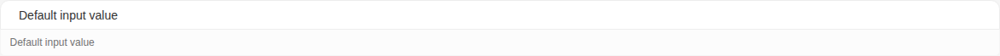

Args:

```json
{
  "value": "Default input value",
  "placeholder": "Enter your text here...",
  "type": "text",
  "size": "md",
  "disabled": false,
  "hasError": false,
  "hasPreview": true,
  "wide": true,
  "textAlignment": "start",
  "multilingual": false,
  "noBorder": false,
  "shadow": false,
  "startSlot": "<s-icon slot=\"start\" icon=\"hgi-stroke hgi-text\"></s-icon>"
}
```

<details><summary>Rendered markup</summary>

```html
<s-input id="" name="" value="Default input value" type="text" placeholder="Enter your text here..." size="md" text-alignment="start" has-preview="" wide="" class="w-full has-preview md ltr hydrated">
    <s-icon slot="start" icon="hgi-stroke hgi-text" class="hydrated"></s-icon>
    
    
  </s-input>
```

</details>

### Large Size

Story id `components-input--large-size`

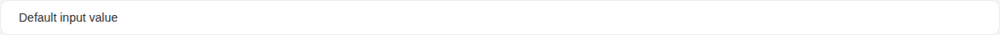

Args:

```json
{
  "value": "Default input value",
  "placeholder": "Enter your text here...",
  "type": "text",
  "size": "lg",
  "disabled": false,
  "hasError": false,
  "hasPreview": false,
  "wide": true,
  "textAlignment": "start",
  "multilingual": false,
  "noBorder": false,
  "shadow": false,
  "startSlot": "<s-icon slot=\"start\" icon=\"hgi-stroke hgi-text\"></s-icon>"
}
```

<details><summary>Rendered markup</summary>

```html
<s-input id="" name="" value="Default input value" type="text" placeholder="Enter your text here..." size="lg" text-alignment="start" wide="" class="w-full lg ltr hydrated">
    <s-icon slot="start" icon="hgi-stroke hgi-text" class="hydrated"></s-icon>
    
    
  </s-input>
```

</details>

### Text Alignment Center

Story id `components-input--text-alignment-center`

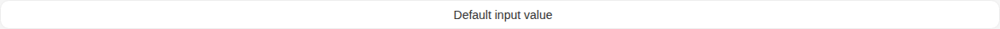

Args:

```json
{
  "value": "Default input value",
  "placeholder": "Enter your text here...",
  "type": "text",
  "size": "md",
  "disabled": false,
  "hasError": false,
  "hasPreview": false,
  "wide": true,
  "textAlignment": "center",
  "multilingual": false,
  "noBorder": false,
  "shadow": false,
  "startSlot": "<s-icon slot=\"start\" icon=\"hgi-stroke hgi-text\"></s-icon>"
}
```

<details><summary>Rendered markup</summary>

```html
<s-input id="" name="" value="Default input value" type="text" placeholder="Enter your text here..." size="md" text-alignment="center" wide="" class="w-full md ltr hydrated">
    <s-icon slot="start" icon="hgi-stroke hgi-text" class="hydrated"></s-icon>
    
    
  </s-input>
```

</details>

### Text Alignment End

Story id `components-input--text-alignment-end`

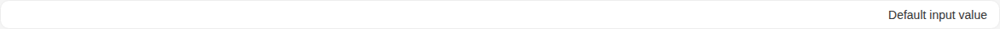

Args:

```json
{
  "value": "Default input value",
  "placeholder": "Enter your text here...",
  "type": "text",
  "size": "md",
  "disabled": false,
  "hasError": false,
  "hasPreview": false,
  "wide": true,
  "textAlignment": "end",
  "multilingual": false,
  "noBorder": false,
  "shadow": false,
  "startSlot": "<s-icon slot=\"start\" icon=\"hgi-stroke hgi-text\"></s-icon>"
}
```

<details><summary>Rendered markup</summary>

```html
<s-input id="" name="" value="Default input value" type="text" placeholder="Enter your text here..." size="md" text-alignment="end" wide="" class="w-full md ltr hydrated">
    <s-icon slot="start" icon="hgi-stroke hgi-text" class="hydrated"></s-icon>
    
    
  </s-input>
```

</details>

### Multilingual

Story id `components-input--multilingual`


Args:

```json
{
  "value": "Default input value",
  "placeholder": "Enter your text here...",
  "type": "text",
  "size": "md",
  "disabled": false,
  "hasError": false,
  "hasPreview": false,
  "wide": true,
  "textAlignment": "start",
  "multilingual": true,
  "noBorder": false,
  "shadow": false,
  "startSlot": "<s-icon slot=\"start\" icon=\"hgi-stroke hgi-text\"></s-icon>"
}
```

<details><summary>Rendered markup</summary>

```html
<s-input id="" name="" value="Default input value" type="text" placeholder="Enter your text here..." size="md" text-alignment="start" wide="" multilingual="" class="w-full multilingual md ltr hydrated">
    <s-icon slot="start" icon="hgi-stroke hgi-text" class="hydrated"></s-icon>
    
    
  </s-input>
```

</details>

### Border Less

Story id `components-input--border-less`

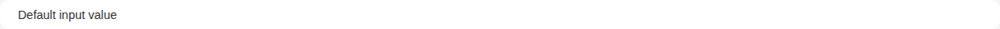

Args:

```json
{
  "value": "Default input value",
  "placeholder": "Enter your text here...",
  "type": "text",
  "size": "md",
  "disabled": false,
  "hasError": false,
  "hasPreview": false,
  "wide": true,
  "textAlignment": "start",
  "multilingual": false,
  "noBorder": true,
  "shadow": false,
  "startSlot": "<s-icon slot=\"start\" icon=\"hgi-stroke hgi-text\"></s-icon>"
}
```

<details><summary>Rendered markup</summary>

```html
<s-input id="" name="" value="Default input value" type="text" placeholder="Enter your text here..." size="md" text-alignment="start" wide="" no-border="" class="w-full md ltr hydrated">
    <s-icon slot="start" icon="hgi-stroke hgi-text" class="hydrated"></s-icon>
    
    
  </s-input>
```

</details>

### Reg Ex Pattern

Story id `components-input--reg-ex-pattern`

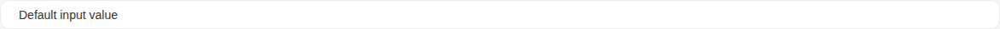

Args:

```json
{
  "value": "Default input value",
  "placeholder": "Enter 3 letters...",
  "type": "text",
  "size": "md",
  "disabled": false,
  "hasError": false,
  "hasPreview": false,
  "wide": true,
  "textAlignment": "start",
  "multilingual": false,
  "noBorder": false,
  "shadow": false,
  "pattern": "[A-Za-z]{3}",
  "startSlot": "<s-icon slot=\"start\" icon=\"hgi-stroke hgi-text\"></s-icon>"
}
```

<details><summary>Rendered markup</summary>

```html
<s-input id="" name="" value="Default input value" type="text" placeholder="Enter 3 letters..." size="md" text-alignment="start" wide="" pattern="[A-Za-z]{3}" class="w-full md ltr hydrated">
    <s-icon slot="start" icon="hgi-stroke hgi-text" class="hydrated"></s-icon>
    
    
  </s-input>
```

</details>

### Description

Story id `components-input--description`

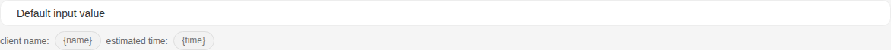

Args:

```json
{
  "value": "Default input value",
  "placeholder": "Enter your text here...",
  "type": "text",
  "size": "md",
  "disabled": false,
  "hasError": false,
  "hasPreview": false,
  "wide": true,
  "textAlignment": "start",
  "multilingual": false,
  "noBorder": false,
  "shadow": false,
  "desc": "client name: {name} estimated time: {time}",
  "startSlot": "<s-icon slot=\"start\" icon=\"hgi-stroke hgi-text\"></s-icon>"
}
```

<details><summary>Rendered markup</summary>

```html
<s-input id="" name="" value="Default input value" type="text" placeholder="Enter your text here..." size="md" text-alignment="start" wide="" desc="client name: {name} estimated time: {time}" class="w-full md ltr hydrated">
    <s-icon slot="start" icon="hgi-stroke hgi-text" class="hydrated"></s-icon>
    
    
  </s-input>
```

</details>

### Email

Story id `components-input--email`

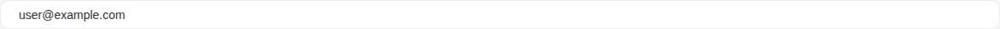

Args:

```json
{
  "value": "user@example.com",
  "placeholder": "Enter your email...",
  "type": "email",
  "size": "md",
  "disabled": false,
  "hasError": false,
  "hasPreview": false,
  "wide": true,
  "textAlignment": "start",
  "multilingual": false,
  "noBorder": false,
  "shadow": false,
  "startSlot": "<s-icon slot=\"start\" icon=\"hgi-stroke hgi-mail-02\"></s-icon>"
}
```

<details><summary>Rendered markup</summary>

```html
<s-input id="" name="" value="user@example.com" type="email" placeholder="Enter your email..." size="md" text-alignment="start" wide="" class="w-full md ltr hydrated">
    <s-icon slot="start" icon="hgi-stroke hgi-mail-02" class="hydrated"></s-icon>
    
    
  </s-input>
```

</details>

### Auto Complete

Story id `components-input--auto-complete`

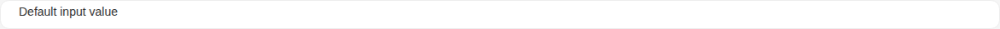

Args:

```json
{
  "value": "Default input value",
  "placeholder": "Enter to search...",
  "type": "autocomplete",
  "size": "md",
  "disabled": false,
  "hasError": false,
  "hasPreview": false,
  "wide": true,
  "textAlignment": "start",
  "multilingual": false,
  "noBorder": false,
  "shadow": false,
  "autocomplete": [
    {
      "id": "0",
      "label": "ترتيب العناصر",
      "value": "val_0",
      "icon": "hgi-stroke hgi-sorting-01"
    }
  ],
  "startSlot": "<s-icon slot=\"start\" icon=\"hgi-stroke hgi-search-02\"></s-icon>"
}
```

<details><summary>Rendered markup</summary>

```html
<s-input id="" name="" value="Default input value" type="autocomplete" placeholder="Enter to search..." size="md" text-alignment="start" wide="" class="w-full md ltr hydrated">
    <s-icon slot="start" icon="hgi-stroke hgi-search-02" class="hydrated"></s-icon>
    
    
  </s-input>
```

</details>

### Password

Story id `components-input--password`

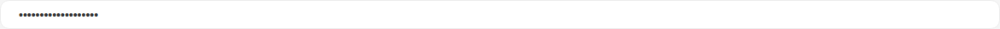

Args:

```json
{
  "value": "",
  "placeholder": "Enter your password...",
  "type": "password",
  "size": "md",
  "disabled": false,
  "hasError": false,
  "hasPreview": false,
  "wide": true,
  "textAlignment": "start",
  "multilingual": false,
  "noBorder": false,
  "shadow": false,
  "startSlot": "<s-icon slot=\"start\" icon=\"hgi-stroke hgi-square-lock-02\"></s-icon>"
}
```

<details><summary>Rendered markup</summary>

```html
<s-input id="" name="" value="Default input value" type="password" placeholder="Enter your password..." size="md" text-alignment="start" wide="" class="w-full md ltr hydrated">
    <s-icon slot="start" icon="hgi-stroke hgi-square-lock-02" class="hydrated"></s-icon>
    
    
  </s-input>
```

</details>

### Number

Story id `components-input--number`

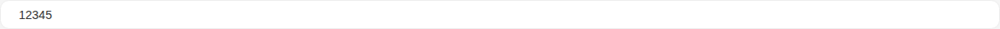

Args:

```json
{
  "value": "12345",
  "placeholder": "Enter a number...",
  "type": "number",
  "size": "md",
  "disabled": false,
  "hasError": false,
  "hasPreview": false,
  "wide": true,
  "textAlignment": "start",
  "multilingual": false,
  "noBorder": false,
  "shadow": false,
  "min": 0,
  "max": 100,
  "step": 1,
  "startSlot": "<s-icon slot=\"start\" icon=\"hgi-stroke hgi-text-number-sign\"></s-icon>"
}
```

<details><summary>Rendered markup</summary>

```html
<s-input id="" name="" value="12345" type="number" placeholder="Enter a number..." size="md" text-alignment="start" wide="" max="100" step="1" class="w-full md ltr hydrated">
    <s-icon slot="start" icon="hgi-stroke hgi-text-number-sign" class="hydrated"></s-icon>
    
    
  </s-input>
```

</details>

### With Slots

Story id `components-input--with-slots`

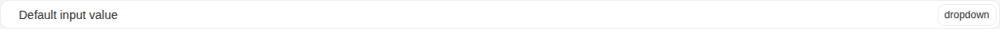

Args:

```json
{
  "value": "Default input value",
  "placeholder": "Input with start and end slots...",
  "type": "text",
  "size": "md",
  "disabled": false,
  "hasError": false,
  "hasPreview": false,
  "wide": true,
  "textAlignment": "start",
  "multilingual": false,
  "noBorder": false,
  "shadow": false,
  "startSlot": "<s-icon slot=\"start\" icon=\"hgi-stroke hgi-text\"></s-icon>",
  "endSlot": "<s-dropdown slot=\"end\" items='[{\"id\":0,\"label\":\"Option 1\",\"icon\":\"hgi-stroke hgi-sorting-01\"},{\"id\":1,\"label\":\"Option 2\",\"icon\":\"hgi-stroke hgi-settings-01\"}]'><s-button theme=\"white\" outlined size=\"sm\" auto-height data-toggle=\"true\" slot=\"dropdown-head\" class=\"h-full\">dropdown</s-button></s-dropdown>"
}
```

<details><summary>Rendered markup</summary>

```html
<s-input id="" name="" value="Default input value" type="text" placeholder="Input with start and end slots..." size="md" text-alignment="start" wide="" class="w-full md ltr hydrated">
    <s-icon slot="start" icon="hgi-stroke hgi-text" class="hydrated"></s-icon>
    
    <s-dropdown slot="end" items="[{&quot;id&quot;:0,&quot;label&quot;:&quot;Option 1&quot;,&quot;icon&quot;:&quot;hgi-stroke hgi-sorting-01&quot;},{&quot;id&quot;:1,&quot;label&quot;:&quot;Option 2&quot;,&quot;icon&quot;:&quot;hgi-stroke hgi-settings-01&quot;}]" class="start ltr hydrated" overlay-alignment="end"><s-button theme="white" outlined="" size="sm" auto-height="" data-toggle="true" slot="dropdown-head" class="h-full s-btn s-btn--white default sm outlined ltr h-auto hydrated" target="_self">dropdown</s-button></s-dropdown>
  </s-input>
```

</details>

### Has Error

Story id `components-input--has-error`

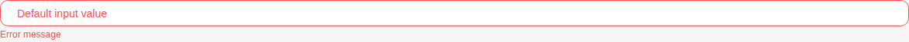

Args:

```json
{
  "value": "Default input value",
  "placeholder": "Enter your text here...",
  "type": "text",
  "size": "md",
  "disabled": false,
  "hasError": true,
  "hasPreview": false,
  "wide": true,
  "textAlignment": "start",
  "multilingual": false,
  "noBorder": false,
  "shadow": false,
  "startSlot": "<s-icon slot=\"start\" icon=\"hgi-stroke hgi-text\"></s-icon>"
}
```

<details><summary>Rendered markup</summary>

```html
<s-input id="" name="" value="Default input value" type="text" placeholder="Enter your text here..." size="md" text-alignment="start" has-error="" wide="" class="w-full has-error md ltr hydrated">
    <s-icon slot="start" icon="hgi-stroke hgi-text" class="hydrated"></s-icon>
    
    
  </s-input>
  <small class="text-xs text-danger">Error message</small>
```

</details>

### Disabled

Story id `components-input--disabled`

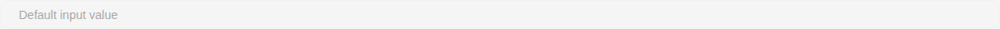

Args:

```json
{
  "value": "Default input value",
  "placeholder": "Enter your text here...",
  "type": "text",
  "size": "md",
  "disabled": true,
  "hasError": false,
  "hasPreview": false,
  "wide": true,
  "textAlignment": "start",
  "multilingual": false,
  "noBorder": false,
  "shadow": false,
  "startSlot": "<s-icon slot=\"start\" icon=\"hgi-stroke hgi-text\"></s-icon>"
}
```

<details><summary>Rendered markup</summary>

```html
<s-input id="" name="" value="Default input value" type="text" placeholder="Enter your text here..." size="md" text-alignment="start" disabled="" wide="" class="w-full disabled md ltr hydrated">
    <s-icon slot="start" icon="hgi-stroke hgi-text" class="hydrated"></s-icon>
    
    
  </s-input>
```

</details>

### Ai Suggestion

Story id `components-input--ai-suggestion`

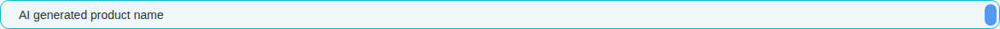

Args:

```json
{
  "value": "AI generated product name",
  "placeholder": "Enter your text here...",
  "type": "text",
  "size": "md",
  "disabled": false,
  "hasError": false,
  "hasPreview": false,
  "wide": true,
  "textAlignment": "start",
  "multilingual": false,
  "noBorder": false,
  "shadow": false,
  "aiSuggestion": {
    "enabled": true,
    "source": "ai",
    "regenerable": true
  },
  "startSlot": "<s-icon slot=\"start\" icon=\"hgi-stroke hgi-text\"></s-icon>"
}
```

<details><summary>Rendered markup</summary>

```html
<s-input id="" name="" value="AI generated product name" type="text" placeholder="Enter your text here..." size="md" text-alignment="start" wide="" ai-suggestion="{&quot;enabled&quot;:true,&quot;source&quot;:&quot;ai&quot;,&quot;regenerable&quot;:true}" class="w-full s-input--ai-suggestion md ltr hydrated">
    <s-icon slot="start" icon="hgi-stroke hgi-text" class="hydrated"></s-icon>
    
    <s-button slot="actions" layout="circular" size="sm" theme="info" title="Regenerate" class="s-btn s-btn--info circular sm ltr hydrated" target="_self">
      <s-icon icon="hgi-stroke hgi-refresh" class="hydrated"></s-icon>
    </s-button>
    
  </s-input>
```

</details>
