# LingualField

Storybook title `Components/LingualField` · source `./src/components/s-lingual-field/s-lingual-field.stories.tsx`

Tags rendered: `<s-button>`, `<s-dropdown>`, `<s-editor>`, `<s-editor-desc>`, `<s-editor-toolbar>`, `<s-icon>`, `<s-input>`, `<s-lingual-field>`, `<s-textarea>`

Lingual field component is used to handle multilingual input fields, allowing users to input content in multiple languages with automatic language detection and switching capabilities.

## Props

| Prop | Type / control | Options | Default | Description |
|---|---|---|---|---|
| `value` | string |  | `{"en": "Hello", "ar": "مرحبا"}` | JSON string mapping languages to their respective values |
| `type` | string |  | `input` | Input type, can be input, textarea or richText |
| `placeholder` | string |  | `Enter your text here...` | Input placeholder |
| `size` | string |  | `md` | Input size |
| `required` | boolean |  | `false` | Required state |
| `disabled` | boolean |  | `false` | Disabled state |
| `hasError` | boolean |  | `false` | Error state |
| `language` | string |  | `ar` | Input current language |
| `languages` | object |  | `undefined` | Languages configuration object with feature flag, supported languages, and current language |
| `noBorder` | boolean |  | `false` | Remove input borders, use it in complex component in your app if needed |
| `startSlot` | string |  | `undefined` | Input start slot, it accepts icon class name from hugeIcons or Sallaicons |
| `aiSuggestion` | object |  | `undefined` | AI suggestion config (object or JSON string): { enabled, source, regenerable, languages }. When active, the field gets the Moshammer AI highlight and reveals the `actions` slot (input/textarea end area, richText overlay). Per-language `languages: { [lang]: { content, status: 'pending' } }` auto-applies suggested content. |
| `min` | number |  | `undefined` | Input Minimum value |
| `max` | number |  | `undefined` | Input Maximum value |
| `showCount` | boolean |  | `false` | Live `current/max` counter under the field (textarea + editor). Requires `max`. Counter follows the document direction so it stays anchored when the editor's per-language RTL flips. Turns danger-red under `has-error`. |
| `rows` | number |  | `3` | Row count for `type: 'textarea'`. |
| `fullHeight` | boolean |  | `false` | Make the textarea fill its container's height (textarea only). |
| `fullToolbar` | boolean |  | `false` | Show the full rich-text toolbar (richText only). |
| `hasPreview` | boolean |  | `false` | Enable inline preview panel below the field. |
| `desc` | text |  | `undefined` | Input description, you can use it to add a description to the input |
| `endSlot` | text |  | `undefined` | Input end slot, it accepts strings only, such as SAR or USD for example |
| `languageChanged` |  |  |  | Emitted when the language is changed. |
| `valueChanged` |  |  |  | Emitted when the field value changes. |
| `toolbar` | array |  |  |  |

## Stories

### Default

Story id `components-lingualfield--default`

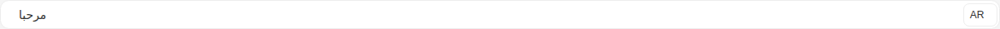

Args:

```json
{
  "value": "{\"en\": \"Hello\", \"ar\": \"مرحبا\"}",
  "type": "input",
  "placeholder": "Enter your text here...",
  "size": "md",
  "required": false,
  "disabled": false,
  "hasError": false,
  "language": "ar",
  "languages": {
    "feature": true,
    "supported": [],
    "current": {
      "id": 0,
      "label": "English",
      "value": "en"
    }
  },
  "noBorder": false,
  "startSlot": "hgi-stroke hgi-language-square"
}
```

<details><summary>Rendered markup</summary>

```html
<s-lingual-field name="undefined" value="{&quot;en&quot;: &quot;Hello&quot;, &quot;ar&quot;: &quot;مرحبا&quot;}" type="input" placeholder="Enter your text here..." size="md" language="ar" start-slot="hgi-stroke hgi-language-square" languages="{&quot;feature&quot;:true,&quot;supported&quot;:[],&quot;current&quot;:{&quot;id&quot;:0,&quot;label&quot;:&quot;English&quot;,&quot;value&quot;:&quot;en&quot;}}" dir="rtl" class="s-lingual-field s-lingual-field--input rtl w-full relative flex items-start justify-start gap-4 hydrated"><!----><s-input class="flex-1 md rtl multilingual ltr hydrated" dir="rtl" value="مرحبا"><s-icon slot="start" class="hydrated"></s-icon><div slot="end" class="s-lingual-field__actions-end s-lingual-field__actions-end--hidden" data-lingual-field-internal-slot=""><div class="s-lingual-field__actions-end__reserve s-lingual-field__actions-end--hidden" aria-hidden="true">
    
  </div></div></s-input><s-dropdown dir="ltr" class="h-fit end ltr hydrated" overlay-alignment="start"><s-button data-toggle="true" slot="dropdown-head" class="s-btn s-btn--white default sm outlined ltr hydrated" theme="white" target="_self">AR<s-icon class="hydrated"></s-icon></s-button></s-dropdown></s-lingual-field>
```

</details>

### Text Area Field

Story id `components-lingualfield--text-area-field`

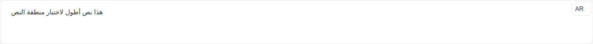

Args:

```json
{
  "value": "{\"en\": \"This is a longer text for textarea testing\", \"ar\": \"هذا نص أطول لاختبار منطقة النص\"}",
  "type": "textarea",
  "placeholder": "Enter your text here...",
  "size": "md",
  "required": false,
  "disabled": false,
  "hasError": false,
  "language": "ar",
  "languages": {
    "feature": true,
    "supported": [],
    "current": {
      "id": 0,
      "label": "English",
      "value": "en"
    }
  },
  "noBorder": false,
  "startSlot": "hgi-stroke hgi-language-square"
}
```

<details><summary>Rendered markup</summary>

```html
<s-lingual-field name="undefined" value="{&quot;en&quot;: &quot;This is a longer text for textarea testing&quot;, &quot;ar&quot;: &quot;هذا نص أطول لاختبار منطقة النص&quot;}" type="textarea" placeholder="Enter your text here..." size="md" language="ar" start-slot="hgi-stroke hgi-language-square" languages="{&quot;feature&quot;:true,&quot;supported&quot;:[],&quot;current&quot;:{&quot;id&quot;:0,&quot;label&quot;:&quot;English&quot;,&quot;value&quot;:&quot;en&quot;}}" dir="rtl" class="s-lingual-field s-lingual-field--textarea rtl w-full relative flex items-start justify-start gap-4 hydrated"><!----><s-textarea type="textarea" class="flex-1 md rtl multilingual ltr hydrated" size="md" dir="rtl" value="هذا نص أطول لاختبار منطقة النص"><s-icon slot="start" class="hydrated"></s-icon><div slot="end" class="s-lingual-field__actions-end s-lingual-field__actions-end--hidden" data-lingual-field-internal-slot=""><div class="s-lingual-field__actions-end__reserve s-lingual-field__actions-end--hidden" aria-hidden="true">
    
  </div></div></s-textarea><s-dropdown dir="ltr" class="h-fit end ltr hydrated" overlay-alignment="start"><s-button data-toggle="true" slot="dropdown-head" class="s-btn s-btn--white default sm outlined ltr hydrated" theme="white" target="_self">AR<s-icon class="hydrated"></s-icon></s-button></s-dropdown></s-lingual-field>
```

</details>

### Editor Field

Story id `components-lingualfield--editor-field`

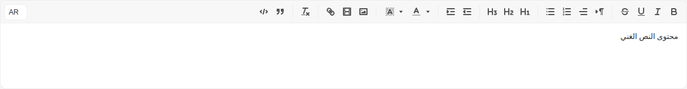

Args:

```json
{
  "value": "{\"en\": \"Rich text content\", \"ar\": \"محتوى النص الغني\"}",
  "type": "richText",
  "placeholder": "Enter your text here...",
  "size": "md",
  "required": false,
  "disabled": false,
  "hasError": false,
  "language": "ar",
  "languages": {
    "feature": true,
    "supported": [],
    "current": {
      "id": 0,
      "label": "English",
      "value": "en"
    }
  },
  "noBorder": false,
  "startSlot": "hgi-stroke hgi-language-square"
}
```

<details><summary>Rendered markup</summary>

```html
<s-lingual-field name="undefined" value="{&quot;en&quot;: &quot;Rich text content&quot;, &quot;ar&quot;: &quot;محتوى النص الغني&quot;}" type="richText" placeholder="Enter your text here..." size="md" language="ar" start-slot="hgi-stroke hgi-language-square" languages="{&quot;feature&quot;:true,&quot;supported&quot;:[],&quot;current&quot;:{&quot;id&quot;:0,&quot;label&quot;:&quot;English&quot;,&quot;value&quot;:&quot;en&quot;}}" dir="rtl" class="s-lingual-field s-lingual-field--richText rtl w-full relative flex items-start justify-start gap-4 hydrated"><!----><div class="s-lingual-field__editor-wrap" dir="rtl"><s-editor type="richText" class="flex-1 md rtl s-editor multilingual hydrated" size="md" dir="rtl"><!----><div class="s-editor__wrapper"><s-editor-toolbar class="hydrated"><div id="toolbar" class="s-editor__toolbar ql-toolbar ql-snow" role="toolbar" aria-label="Editor toolbar"><span class="ql-formats" role="group" aria-label="Formatting options group"><button type="button" class="ql-bold" title="Bold" aria-label="Bold" aria-pressed="false"><svg viewBox="0 0 18 18"><path class="ql-stroke" d="M5,4H9.5A2.5,2.5,0,0,1,12,6.5v0A2.5,2.5,0,0,1,9.5,9H5A0,0,0,0,1,5,9V4A0,0,0,0,1,5,4Z"></path><path class="ql-stroke" d="M5,9h5.5A2.5,2.5,0,0,1,13,11.5v0A2.5,2.5,0,0,1,10.5,14H5a0,0,0,0,1,0,0V9A0,0,0,0,1,5,9Z"></path></svg></button><button type="button" class="ql-italic" title="Italic" aria-label="Italic" aria-pressed="false"><svg viewBox="0 0 18 18"><line class="ql-stroke" x1="7" x2="13" y1="4" y2="4"></line><line class="ql-stroke" x1="5" x2="11" y1="14" y2="14"></line><line class="ql-stroke" x1="8" x2="10" y1="14" y2="4"></line></svg></button><button type="button" class="ql-underline" title="Underline" aria-label="Underline" aria-pressed="false"><svg viewBox="0 0 18 18"><path class="ql-stroke" d="M5,3V9a4.012,4.012,0,0,0,4,4H9a4.012,4.012,0,0,0,4-4V3"></path><rect class="ql-fill" height="1" rx="0.5" ry="0.5" width="12" x="3" y="15"></rect></svg></button><button type="button" class="ql-strike" title="Strikethrough" aria-label="Strikethrough" aria-pressed="false"><svg viewBox="0 0 18 18"><line class="ql-stroke ql-thin" x1="15.5" x2="2.5" y1="8.5" y2="9.5"></line><path class="ql-fill" d="M9.007,8C6.542,7.791,6,7.519,6,6.5,6,5.792,7.283,5,9,5c1.571,0,2.765.679,2.969,1.309a1,1,0,0,0,1.9-.617C13.356,4.106,11.354,3,9,3,6.2,3,4,4.538,4,6.5a3.2,3.2,0,0,0,.5,1.843Z"></path><path class="ql-fill" d="M8.984,10C11.457,10.208,12,10.479,12,11.5c0,0.708-1.283,1.5-3,1.5-1.571,0-2.765-.679-2.969-1.309a1,1,0,1,0-1.9.617C4.644,13.894,6.646,15,9,15c2.8,0,5-1.538,5-3.5a3.2,3.2,0,0,0-.5-1.843Z"></path></svg></button></span><span class="ql-formats" role="group" aria-label="Formatting options group"><button type="button" class="ql-direction" value="rtl" title="Format direction: rtl" aria-label="Format direction: rtl" aria-pressed="false"><svg viewBox="0 0 18 18"><polygon class="ql-stroke ql-fill" points="3 11 5 9 3 7 3 11"></polygon><line class="ql-stroke ql-fill" x1="15" x2="11" y1="4" y2="4"></line><path class="ql-fill" d="M11,3a3,3,0,0,0,0,6h1V3H11Z"></path><rect class="ql-fill" height="11" width="1" x="11" y="4"></rect><rect class="ql-fill" height="11" width="1" x="13" y="4"></rect></svg><svg viewBox="0 0 18 18"><polygon class="ql-stroke ql-fill" points="15 12 13 10 15 8 15 12"></polygon><line class="ql-stroke ql-fill" x1="9" x2="5" y1="4" y2="4"></line><path class="ql-fill" d="M5,3A3,3,0,0,0,5,9H6V3H5Z"></path><rect class="ql-fill" height="11" width="1" x="5" y="4"></rect><rect class="ql-fill" height="11" width="1" x="7" y="4"></rect></svg></button><span class="ql-align ql-picker ql-icon-picker" title="Text alignment" aria-label="Text alignment"><span class="ql-picker-label" tabindex="0" role="button" aria-expanded="false" aria-controls="ql-picker-options-0" data-value="start" data-label="Align to the leading edge"><svg viewBox="0 0 18 18"><line class="ql-stroke" x1="3" x2="15" y1="9" y2="9"></line><line class="ql-stroke" x1="3" x2="13" y1="14" y2="14"></line><line class="ql-stroke" x1="3" x2="9" y1="4" y2="4"></line></svg></span><span class="ql-picker-options" aria-hidden="true" tabindex="-1" id="ql-picker-options-0"><span tabindex="0" role="button" class="ql-picker-item" data-value="start" data-label="Align to the leading edge"><svg viewBox="0 0 18 18"><line class="ql-stroke" x1="3" x2="15" y1="9" y2="9"></line><line class="ql-stroke" x1="3" x2="13" y1="14" y2="14"></line><line class="ql-stroke" x1="3" x2="9" y1="4" y2="4"></line></svg></span><span tabindex="0" role="button" class="ql-picker-item" data-value="center" data-label="Center"><svg viewBox="0 0 18 18"><line class="ql-stroke" x1="15" x2="3" y1="9" y2="9"></line><line class="ql-stroke" x1="14" x2="4" y1="14" y2="14"></line><line class="ql-stroke" x1="12" x2="6" y1="4" y2="4"></line></svg></span><span tabindex="0" role="button" class="ql-picker-item" data-value="end" data-label="Align to the trailing edge"><svg viewBox="0 0 18 18"><line class="ql-stroke" x1="15" x2="3" y1="9" y2="9"></line><line class="ql-stroke" x1="15" x2="5" y1="14" y2="14"></line><line class="ql-stroke" x1="15" x2="9" y1="4" y2="4"></line></svg></span><span tabindex="0" role="button" class="ql-picker-item" data-value="justify" data-label="Justify"><svg viewBox="0 0 18 18"><line class="ql-stroke" x1="15" x2="3" y1="9" y2="9"></line><line class="ql-stroke" x1="15" x2="3" y1="14" y2="14"></line><line class="ql-stroke" x1="15" x2="3" y1="4" y2="4"></line></svg></span></span></span><select class="ql-align" title="Text alignment" aria-label="Text alignment" style="display: none;"><option value="start" aria-label="Align to the leading edge">Align to the leading edge</option><option value="center" aria-label="Center">Center</option><option value="end" aria-label="Align to the trailing edge">Align to the trailing edge</option><option value="justify" aria-label="Justify">Justify</option></select><button type="button" class="ql-list" value="ordered" title="Format list: ordered" aria-label="Format list: ordered" aria-pressed="false"><svg viewBox="0 0 18 18"><line class="ql-stroke" x1="7" x2="15" y1="4" y2="4"></line><line class="ql-stroke" x1="7" x2="15" y1="9" y2="9"></line><line class="ql-stroke" x1="7" x2="15" y1="14" y2="14"></line><line class="ql-stroke ql-thin" x1="2.5" x2="4.5" y1="5.5" y2="5.5"></line><path class="ql-fill" d="M3.5,6A0.5,0.5,0,0,1,3,5.5V3.085l-0.276.138A0.5,0.5,0,0,1,2.053,3c-0.124-.247-0.023-0.324.224-0.447l1-.5A0.5,0.5,0,0,1,4,2.5v3A0.5,0.5,0,0,1,3.5,6Z"></path><path class="ql-stroke ql-thin" d="M4.5,10.5h-2c0-.234,1.85-1.076,1.85-2.234A0.959,0.959,0,0,0,2.5,8.156"></path><path class="ql-stroke ql-thin" d="M2.5,14.846a0.959,0.959,0,0,0,1.85-.109A0.7,0.7,0,0,0,3.75,14a0.688,0.688,0,0,0,.6-0.736,0.959,0.959,0,0,0-1.85-.109"></path></svg></button><button type="button" class="ql-list" value="bullet" title="Format list: bullet" aria-label="Format list: bullet" aria-pressed="false"><svg viewBox="0 0 18 18"><line class="ql-stroke" x1="6" x2="15" y1="4" y2="4"></line><line class="ql-stroke" x1="6" x2="15" y1="9" y2="9"></line><line class="ql-stroke" x1="6" x2="15" y1="14" y2="14"></line><line class="ql-stroke" x1="3" x2="3" y1="4" y2="4"></line><line class="ql-stroke" x1="3" x2="3" y1="9" y2="9"></line><line class="ql-stroke" x1="3" x2="3" y1="14" y2="14"></line></svg></button></span><span class="ql-formats" role="group" aria-label="Formatting options group"><button type="button" class="ql-header" value="1" title="Format header: 1" aria-label="Format header: 1" aria-pressed="false"><svg viewBox="0 0 18 18"><path class="ql-fill" d="M10,4V14a1,1,0,0,1-2,0V10H3v4a1,1,0,0,1-2,0V4A1,1,0,0,1,3,4V8H8V4a1,1,0,0,1,2,0Zm6.06787,9.209H14.98975V7.59863a.54085.54085,0,0,0-.605-.60547h-.62744a1.01119,1.01119,0,0,0-.748.29688L11.645,8.56641a.5435.5435,0,0,0-.022.8584l.28613.30762a.53861.53861,0,0,0,.84717.0332l.09912-.08789a1.2137,1.2137,0,0,0,.2417-.35254h.02246s-.01123.30859-.01123.60547V13.209H12.041a.54085.54085,0,0,0-.605.60547v.43945a.54085.54085,0,0,0,.605.60547h4.02686a.54085.54085,0,0,0,.605-.60547v-.43945A.54085.54085,0,0,0,16.06787,13.209Z"></path></svg></button><button type="button" class="ql-header" value="2" title="Format header: 2" aria-label="Format header: 2" aria-pressed="false"><svg viewBox="0 0 18 18"><path class="ql-fill" d="M16.73975,13.81445v.43945a.54085.54085,0,0,1-.605.60547H11.855a.58392.58392,0,0,1-.64893-.60547V14.0127c0-2.90527,3.39941-3.42187,3.39941-4.55469a.77675.77675,0,0,0-.84717-.78125,1.17684,1.17684,0,0,0-.83594.38477c-.2749.26367-.561.374-.85791.13184l-.4292-.34082c-.30811-.24219-.38525-.51758-.1543-.81445a2.97155,2.97155,0,0,1,2.45361-1.17676,2.45393,2.45393,0,0,1,2.68408,2.40918c0,2.45312-3.1792,2.92676-3.27832,3.93848h2.79443A.54085.54085,0,0,1,16.73975,13.81445ZM9,3A.99974.99974,0,0,0,8,4V8H3V4A1,1,0,0,0,1,4V14a1,1,0,0,0,2,0V10H8v4a1,1,0,0,0,2,0V4A.99974.99974,0,0,0,9,3Z"></path></svg></button><button type="button" class="ql-header" value="3" title="Format header: 3" aria-label="Format header: 3" aria-pressed="false"><svg viewBox="0 0 18 18"><path class="ql-fill" d="M16.65186,12.30664a2.6742,2.6742,0,0,1-2.915,2.68457,3.96592,3.96592,0,0,1-2.25537-.6709.56007.56007,0,0,1-.13232-.83594L11.64648,13c.209-.34082.48389-.36328.82471-.1543a2.32654,2.32654,0,0,0,1.12256.33008c.71484,0,1.12207-.35156,1.12207-.78125,0-.61523-.61621-.86816-1.46338-.86816H13.2085a.65159.65159,0,0,1-.68213-.41895l-.05518-.10937a.67114.67114,0,0,1,.14307-.78125l.71533-.86914a8.55289,8.55289,0,0,1,.68213-.7373V8.58887a3.93913,3.93913,0,0,1-.748.05469H11.9873a.54085.54085,0,0,1-.605-.60547V7.59863a.54085.54085,0,0,1,.605-.60547h3.75146a.53773.53773,0,0,1,.60547.59375v.17676a1.03723,1.03723,0,0,1-.27539.748L14.74854,10.0293A2.31132,2.31132,0,0,1,16.65186,12.30664ZM9,3A.99974.99974,0,0,0,8,4V8H3V4A1,1,0,0,0,1,4V14a1,1,0,0,0,2,0V10H8v4a1,1,0,0,0,2,0V4A.99974.99974,0,0,0,9,3Z"></path></svg></button></span><span class="ql-formats" role="group" aria-label="Formatting options group"><button type="button" class="ql-indent" value="-1" title="Format indent: -1" aria-label="Format indent: -1" aria-pressed="false"><svg viewBox="0 0 18 18"><line class="ql-stroke" x1="3" x2="15" y1="14" y2="14"></line><line class="ql-stroke" x1="3" x2="15" y1="4" y2="4"></line><line class="ql-stroke" x1="9" x2="15" y1="9" y2="9"></line><polyline class="ql-stroke" points="5 7 5 11 3 9 5 7"></polyline></svg></button><button type="button" class="ql-indent" value="+1" title="Format indent: +1" aria-label="Format indent: +1" aria-pressed="false"><svg viewBox="0 0 18 18"><line class="ql-stroke" x1="3" x2="15" y1="14" y2="14"></line><line class="ql-stroke" x1="3" x2="15" y1="4" y2="4"></line><line class="ql-stroke" x1="9" x2="15" y1="9" y2="9"></line><polyline class="ql-fill ql-stroke" points="3 7 3 11 5 9 3 7"></polyline></svg></button></span><span class="ql-formats" role="group" aria-label="Formatting options group"><span class="ql-color ql-picker ql-color-picker keep-color" title="Text color" aria-label="Text color"><span class="ql-picker-label" tabindex="0" role="button" aria-expanded="false" aria-controls="ql-picker-options-1" data-value=""><svg viewBox="0 0 18 18"><line class="ql-color-label ql-stroke ql-transparent" x1="3" x2="15" y1="15" y2="15"></line><polyline class="ql-stroke" points="5.5 11 9 3 12.5 11"></polyline><line class="ql-stroke" x1="11.63" x2="6.38" y1="9" y2="9"></line></svg></span><span class="ql-picker-expand"><svg viewBox="0 0 32 32"><path fill="currentColor" d="m24 12l-8 10l-8-10z"></path></svg></span><span class="ql-picker-options" aria-hidden="true" tabindex="-1" id="ql-picker-options-1"><p tabindex="0" role="button" class="ql-picker-item blank" data-value="" data-dark="true"><span>Remove color</span></p><p tabindex="0" role="button" class="ql-picker-item" data-value="rgb(255, 255, 255)" style="--bg: rgb(255, 255, 255);"></p><p tabindex="0" role="button" class="ql-picker-item" data-value="rgb(0, 0, 0)" data-dark="true" style="--bg: rgb(0, 0, 0);"></p><p tabindex="0" role="button" class="ql-picker-item" data-value="rgb(72, 83, 104)" data-dark="true" style="--bg: rgb(72, 83, 104);"></p><p tabindex="0" role="button" class="ql-picker-item" data-value="rgb(41, 114, 244)" data-dark="true" style="--bg: rgb(41, 114, 244);"></p><p tabindex="0" role="button" class="ql-picker-item" data-value="rgb(0, 163, 245)" data-dark="true" style="--bg: rgb(0, 163, 245);"></p><p tabindex="0" role="button" class="ql-picker-item" data-value="rgb(49, 155, 98)" data-dark="true" style="--bg: rgb(49, 155, 98);"></p><p tabindex="0" role="button" class="ql-picker-item" data-value="rgb(222, 60, 54)" data-dark="true" style="--bg: rgb(222, 60, 54);"></p><p tabindex="0" role="button" class="ql-picker-item" data-value="rgb(248, 136, 37)" style="--bg: rgb(248, 136, 37);"></p><p tabindex="0" role="button" class="ql-picker-item" data-value="rgb(245, 196, 0)" style="--bg: rgb(245, 196, 0);"></p><p tabindex="0" role="button" class="ql-picker-item" data-value="rgb(153, 56, 215)" data-dark="true" style="--bg: rgb(153, 56, 215);"></p><p tabindex="0" role="button" class="ql-picker-item" data-value="rgb(242, 242, 242)" style="--bg: rgb(242, 242, 242);"></p><p tabindex="0" role="button" class="ql-picker-item" data-value="rgb(127, 127, 127)" data-dark="true" style="--bg: rgb(127, 127, 127);"></p><p tabindex="0" role="button" class="ql-picker-item" data-value="rgb(243, 245, 247)" style="--bg: rgb(243, 245, 247);"></p><p tabindex="0" role="button" class="ql-picker-item" data-value="rgb(229, 239, 255)" style="--bg: rgb(229, 239, 255);"></p><p tabindex="0" role="button" class="ql-picker-item" data-value="rgb(229, 246, 255)" style="--bg: rgb(229, 246, 255);"></p><p tabindex="0" role="button" class="ql-picker-item" data-value="rgb(234, 250, 241)" style="--bg: rgb(234, 250, 241);"></p><p tabindex="0" role="button" class="ql-picker-item" data-value="rgb(254, 233, 232)" style="--bg: rgb(254, 233, 232);"></p><p tabindex="0" role="button" class="ql-picker-item" data-value="rgb(254, 243, 235)" style="--bg: rgb(254, 243, 235);"></p><p tabindex="0" role="button" class="ql-picker-item" data-value="rgb(254, 249, 227)" style="--bg: rgb(254, 249, 227);"></p><p tabindex="0" role="button" class="ql-picker-item" data-value="rgb(253, 235, 255)" style="--bg: rgb(253, 235, 255);"></p><p tabindex="0" role="button" class="ql-picker-item" data-value="rgb(216, 216, 216)" style="--bg: rgb(216, 216, 216);"></p><p tabindex="0" role="button" class="ql-picker-item" data-value="rgb(89, 89, 89)" data-dark="true" style="--bg: rgb(89, 89, 89);"></p><p tabindex="0" role="button" class="ql-picker-item" data-value="rgb(197, 202, 211)" style="--bg: rgb(197, 202, 211);"></p><p tabindex="0" role="button" class="ql-picker-item" data-value="rgb(199, 220, 255)" style="--bg: rgb(199, 220, 255);"></p><p tabindex="0" role="button" class="ql-picker-item" data-value="rgb(199, 236, 255)" style="--bg: rgb(199, 236, 255);"></p><p tabindex="0" role="button" class="ql-picker-item" data-value="rgb(195, 234, 213)" style="--bg: rgb(195, 234, 213);"></p><p tabindex="0" role="button" class="ql-picker-item" data-value="rgb(255, 201, 199)" style="--bg: rgb(255, 201, 199);"></p><p tabindex="0" role="button" class="ql-picker-item" data-value="rgb(255, 220, 196)" style="--bg: rgb(255, 220, 196);"></p><p tabindex="0" role="button" class="ql-picker-item" data-value="rgb(255, 238, 173)" style="--bg: rgb(255, 238, 173);"></p><p tabindex="0" role="button" class="ql-picker-item" data-value="rgb(242, 199, 255)" style="--bg: rgb(242, 199, 255);"></p><p tabindex="0" role="button" class="ql-picker-item" data-value="rgb(191, 191, 191)" style="--bg: rgb(191, 191, 191);"></p><p tabindex="0" role="button" class="ql-picker-item" data-value="rgb(63, 63, 63)" data-dark="true" style="--bg: rgb(63, 63, 63);"></p><p tabindex="0" role="button" class="ql-picker-item" data-value="rgb(128, 139, 158)" style="--bg: rgb(128, 139, 158);"></p><p tabindex="0" role="button" class="ql-picker-item" data-value="rgb(153, 190, 255)" style="--bg: rgb(153, 190, 255);"></p><p tabindex="0" role="button" class="ql-picker-item" data-value="rgb(153, 221, 255)" style="--bg: rgb(153, 221, 255);"></p><p tabindex="0" role="button" class="ql-picker-item" data-value="rgb(152, 215, 182)" style="--bg: rgb(152, 215, 182);"></p><p tabindex="0" role="button" class="ql-picker-item" data-value="rgb(255, 156, 153)" style="--bg: rgb(255, 156, 153);"></p><p tabindex="0" role="button" class="ql-picker-item" data-value="rgb(255, 186, 132)" style="--bg: rgb(255, 186, 132);"></p><p tabindex="0" role="button" class="ql-picker-item" data-value="rgb(255, 226, 112)" style="--bg: rgb(255, 226, 112);"></p><p tabindex="0" role="button" class="ql-picker-item" data-value="rgb(213, 142, 255)" style="--bg: rgb(213, 142, 255);"></p><p tabindex="0" role="button" class="ql-picker-item" data-value="rgb(165, 165, 165)" style="--bg: rgb(165, 165, 165);"></p><p tabindex="0" role="button" class="ql-picker-item" data-value="rgb(38, 38, 38)" data-dark="true" style="--bg: rgb(38, 38, 38);"></p><p tabindex="0" role="button" class="ql-picker-item" data-value="rgb(53, 59, 69)" data-dark="true" style="--bg: rgb(53, 59, 69);"></p><p tabindex="0" role="button" class="ql-picker-item" data-value="rgb(20, 80, 184)" data-dark="true" style="--bg: rgb(20, 80, 184);"></p><p tabindex="0" role="button" class="ql-picker-item" data-value="rgb(18, 116, 165)" data-dark="true" style="--bg: rgb(18, 116, 165);"></p><p tabindex="0" role="button" class="ql-picker-item" data-value="rgb(39, 124, 79)" data-dark="true" style="--bg: rgb(39, 124, 79);"></p><p tabindex="0" role="button" class="ql-picker-item" data-value="rgb(158, 30, 26)" data-dark="true" style="--bg: rgb(158, 30, 26);"></p><p tabindex="0" role="button" class="ql-picker-item" data-value="rgb(184, 96, 20)" data-dark="true" style="--bg: rgb(184, 96, 20);"></p><p tabindex="0" role="button" class="ql-picker-item" data-value="rgb(163, 130, 0)" data-dark="true" style="--bg: rgb(163, 130, 0);"></p><p tabindex="0" role="button" class="ql-picker-item" data-value="rgb(94, 34, 129)" data-dark="true" style="--bg: rgb(94, 34, 129);"></p><p tabindex="0" role="button" class="ql-picker-item" data-value="rgb(147, 147, 147)" style="--bg: rgb(147, 147, 147);"></p><p tabindex="0" role="button" class="ql-picker-item" data-value="rgb(13, 13, 13)" data-dark="true" style="--bg: rgb(13, 13, 13);"></p><p tabindex="0" role="button" class="ql-picker-item" data-value="rgb(36, 39, 46)" data-dark="true" style="--bg: rgb(36, 39, 46);"></p><p tabindex="0" role="button" class="ql-picker-item" data-value="rgb(12, 48, 110)" data-dark="true" style="--bg: rgb(12, 48, 110);"></p><p tabindex="0" role="button" class="ql-picker-item" data-value="rgb(10, 65, 92)" data-dark="true" style="--bg: rgb(10, 65, 92);"></p><p tabindex="0" role="button" class="ql-picker-item" data-value="rgb(24, 78, 50)" data-dark="true" style="--bg: rgb(24, 78, 50);"></p><p tabindex="0" role="button" class="ql-picker-item" data-value="rgb(88, 17, 14)" data-dark="true" style="--bg: rgb(88, 17, 14);"></p><p tabindex="0" role="button" class="ql-picker-item" data-value="rgb(92, 48, 10)" data-dark="true" style="--bg: rgb(92, 48, 10);"></p><p tabindex="0" role="button" class="ql-picker-item" data-value="rgb(102, 82, 0)" data-dark="true" style="--bg: rgb(102, 82, 0);"></p><p tabindex="0" role="button" class="ql-picker-item" data-value="rgb(59, 21, 81)" data-dark="true" style="--bg: rgb(59, 21, 81);"></p><div class="custom ql-picker-item"><span>sdk:common.choose_color</span></div><div class="used"><div class="used-list"></div></div></span></span><select class="ql-color" title="Text color" aria-label="Text color" style="display: none;"><option value=""></option><option value="rgb(255, 255, 255)"></option><option value="rgb(0, 0, 0)"></option><option value="rgb(72, 83, 104)"></option><option value="rgb(41, 114, 244)"></option><option value="rgb(0, 163, 245)"></option><option value="rgb(49, 155, 98)"></option><option value="rgb(222, 60, 54)"></option><option value="rgb(248, 136, 37)"></option><option value="rgb(245, 196, 0)"></option><option value="rgb(153, 56, 215)"></option><option value="rgb(242, 242, 242)"></option><option value="rgb(127, 127, 127)"></option><option value="rgb(243, 245, 247)"></option><option value="rgb(229, 239, 255)"></option><option value="rgb(229, 246, 255)"></option><option value="rgb(234, 250, 241)"></option><option value="rgb(254, 233, 232)"></option><option value="rgb(254, 243, 235)"></option><option value="rgb(254, 249, 227)"></option><option value="rgb(253, 235, 255)"></option><option value="rgb(216, 216, 216)"></option><option value="rgb(89, 89, 89)"></option><option value="rgb(197, 202, 211)"></option><option value="rgb(199, 220, 255)"></option><option value="rgb(199, 236, 255)"></option><option value="rgb(195, 234, 213)"></option><option value="rgb(255, 201, 199)"></option><option value="rgb(255, 220, 196)"></option><option value="rgb(255, 238, 173)"></option><option value="rgb(242, 199, 255)"></option><option value="rgb(191, 191, 191)"></option><option value="rgb(63, 63, 63)"></option><option value="rgb(128, 139, 158)"></option><option value="rgb(153, 190, 255)"></option><option value="rgb(153, 221, 255)"></option><option value="rgb(152, 215, 182)"></option><option value="rgb(255, 156, 153)"></option><option value="rgb(255, 186, 132)"></option><option value="rgb(255, 226, 112)"></option><option value="rgb(213, 142, 255)"></option><option value="rgb(165, 165, 165)"></option><option value="rgb(38, 38, 38)"></option><option value="rgb(53, 59, 69)"></option><option value="rgb(20, 80, 184)"></option><option value="rgb(18, 116, 165)"></option><option value="rgb(39, 124, 79)"></option><option value="rgb(158, 30, 26)"></option><option value="rgb(184, 96, 20)"></option><option value="rgb(163, 130, 0)"></option><option value="rgb(94, 34, 129)"></option><option value="rgb(147, 147, 147)"></option><option value="rgb(13, 13, 13)"></option><option value="rgb(36, 39, 46)"></option><option value="rgb(12, 48, 110)"></option><option value="rgb(10, 65, 92)"></option><option value="rgb(24, 78, 50)"></option><option value="rgb(88, 17, 14)"></option><option value="rgb(92, 48, 10)"></option><option value="rgb(102, 82, 0)"></option><option value="rgb(59, 21, 81)"></option><option value="custom"></option></select><span class="ql-background ql-picker ql-color-picker keep-color" title="Background color" aria-label="Background color"><span class="ql-picker-label" tabindex="0" role="button" aria-expanded="false" aria-controls="ql-picker-options-2" data-value=""><svg viewBox="0 0 18 18"><g class="ql-fill ql-color-label"><polygon points="6 6.868 6 6 5 6 5 7 5.942 7 6 6.868"></polygon><rect height="1" width="1" x="4" y="4"></rect><polygon points="6.817 5 6 5 6 6 6.38 6 6.817 5"></polygon><rect height="1" width="1" x="2" y="6"></rect><rect height="1" width="1" x="3" y="5"></rect><rect height="1" width="1" x="4" y="7"></rect><polygon points="4 11.439 4 11 3 11 3 12 3.755 12 4 11.439"></polygon><rect height="1" width="1" x="2" y="12"></rect><rect height="1" width="1" x="2" y="9"></rect><rect height="1" width="1" x="2" y="15"></rect><polygon points="4.63 10 4 10 4 11 4.192 11 4.63 10"></polygon><rect height="1" width="1" x="3" y="8"></rect><path d="M10.832,4.2L11,4.582V4H10.708A1.948,1.948,0,0,1,10.832,4.2Z"></path><path d="M7,4.582L7.168,4.2A1.929,1.929,0,0,1,7.292,4H7V4.582Z"></path><path d="M8,13H7.683l-0.351.8a1.933,1.933,0,0,1-.124.2H8V13Z"></path><rect height="1" width="1" x="12" y="2"></rect><rect height="1" width="1" x="11" y="3"></rect><path d="M9,3H8V3.282A1.985,1.985,0,0,1,9,3Z"></path><rect height="1" width="1" x="2" y="3"></rect><rect height="1" width="1" x="6" y="2"></rect><rect height="1" width="1" x="3" y="2"></rect><rect height="1" width="1" x="5" y="3"></rect><rect height="1" width="1" x="9" y="2"></rect><rect height="1" width="1" x="15" y="14"></rect><polygon points="13.447 10.174 13.469 10.225 13.472 10.232 13.808 11 14 11 14 10 13.37 10 13.447 10.174"></polygon><rect height="1" width="1" x="13" y="7"></rect><rect height="1" width="1" x="15" y="5"></rect><rect height="1" width="1" x="14" y="6"></rect><rect height="1" width="1" x="15" y="8"></rect><rect height="1" width="1" x="14" y="9"></rect><path d="M3.775,14H3v1H4V14.314A1.97,1.97,0,0,1,3.775,14Z"></path><rect height="1" width="1" x="14" y="3"></rect><polygon points="12 6.868 12 6 11.62 6 12 6.868"></polygon><rect height="1" width="1" x="15" y="2"></rect><rect height="1" width="1" x="12" y="5"></rect><rect height="1" width="1" x="13" y="4"></rect><polygon points="12.933 9 13 9 13 8 12.495 8 12.933 9"></polygon><rect height="1" width="1" x="9" y="14"></rect><rect height="1" width="1" x="8" y="15"></rect><path d="M6,14.926V15H7V14.316A1.993,1.993,0,0,1,6,14.926Z"></path><rect height="1" width="1" x="5" y="15"></rect><path d="M10.668,13.8L10.317,13H10v1h0.792A1.947,1.947,0,0,1,10.668,13.8Z"></path><rect height="1" width="1" x="11" y="15"></rect><path d="M14.332,12.2a1.99,1.99,0,0,1,.166.8H15V12H14.245Z"></path><rect height="1" width="1" x="14" y="15"></rect><rect height="1" width="1" x="15" y="11"></rect></g><polyline class="ql-stroke" points="5.5 13 9 5 12.5 13"></polyline><line class="ql-stroke" x1="11.63" x2="6.38" y1="11" y2="11"></line></svg></span><span class="ql-picker-expand"><svg viewBox="0 0 32 32"><path fill="currentColor" d="m24 12l-8 10l-8-10z"></path></svg></span><span class="ql-picker-options" aria-hidden="true" tabindex="-1" id="ql-picker-options-2"><p tabindex="0" role="button" class="ql-picker-item blank" data-value="" data-dark="true"><span>Remove color</span></p><p tabindex="0" role="button" class="ql-picker-item" data-value="rgb(255, 255, 255)" style="--bg: rgb(255, 255, 255);"></p><p tabindex="0" role="button" class="ql-picker-item" data-value="rgb(0, 0, 0)" data-dark="true" style="--bg: rgb(0, 0, 0);"></p><p tabindex="0" role="button" class="ql-picker-item" data-value="rgb(72, 83, 104)" data-dark="true" style="--bg: rgb(72, 83, 104);"></p><p tabindex="0" role="button" class="ql-picker-item" data-value="rgb(41, 114, 244)" data-dark="true" style="--bg: rgb(41, 114, 244);"></p><p tabindex="0" role="button" class="ql-picker-item" data-value="rgb(0, 163, 245)" data-dark="true" style="--bg: rgb(0, 163, 245);"></p><p tabindex="0" role="button" class="ql-picker-item" data-value="rgb(49, 155, 98)" data-dark="true" style="--bg: rgb(49, 155, 98);"></p><p tabindex="0" role="button" class="ql-picker-item" data-value="rgb(222, 60, 54)" data-dark="true" style="--bg: rgb(222, 60, 54);"></p><p tabindex="0" role="button" class="ql-picker-item" data-value="rgb(248, 136, 37)" style="--bg: rgb(248, 136, 37);"></p><p tabindex="0" role="button" class="ql-picker-item" data-value="rgb(245, 196, 0)" style="--bg: rgb(245, 196, 0);"></p><p tabindex="0" role="button" class="ql-picker-item" data-value="rgb(153, 56, 215)" data-dark="true" style="--bg: rgb(153, 56, 215);"></p><p tabindex="0" role="button" class="ql-picker-item" data-value="rgb(242, 242, 242)" style="--bg: rgb(242, 242, 242);"></p><p tabindex="0" role="button" class="ql-picker-item" data-value="rgb(127, 127, 127)" data-dark="true" style="--bg: rgb(127, 127, 127);"></p><p tabindex="0" role="button" class="ql-picker-item" data-value="rgb(243, 245, 247)" style="--bg: rgb(243, 245, 247);"></p><p tabindex="0" role="button" class="ql-picker-item" data-value="rgb(229, 239, 255)" style="--bg: rgb(229, 239, 255);"></p><p tabindex="0" role="button" class="ql-picker-item" data-value="rgb(229, 246, 255)" style="--bg: rgb(229, 246, 255);"></p><p tabindex="0" role="button" class="ql-picker-item" data-value="rgb(234, 250, 241)" style="--bg: rgb(234, 250, 241);"></p><p tabindex="0" role="button" class="ql-picker-item" data-value="rgb(254, 233, 232)" style="--bg: rgb(254, 233, 232);"></p><p tabindex="0" role="button" class="ql-picker-item" data-value="rgb(254, 243, 235)" style="--bg: rgb(254, 243, 235);"></p><p tabindex="0" role="button" class="ql-picker-item" data-value="rgb(254, 249, 227)" style="--bg: rgb(254, 249, 227);"></p><p tabindex="0" role="button" class="ql-picker-item" data-value="rgb(253, 235, 255)" style="--bg: rgb(253, 235, 255);"></p><p tabindex="0" role="button" class="ql-picker-item" data-value="rgb(216, 216, 216)" style="--bg: rgb(216, 216, 216);"></p><p tabindex="0" role="button" class="ql-picker-item" data-value="rgb(89, 89, 89)" data-dark="true" style="--bg: rgb(89, 89, 89);"></p><p tabindex="0" role="button" class="ql-picker-item" data-value="rgb(197, 202, 211)" style="--bg: rgb(197, 202, 211);"></p><p tabindex="0" role="button" class="ql-picker-item" data-value="rgb(199, 220, 255)" style="--bg: rgb(199, 220, 255);"></p><p tabindex="0" role="button" class="ql-picker-item" data-value="rgb(199, 236, 255)" style="--bg: rgb(199, 236, 255);"></p><p tabindex="0" role="button" class="ql-picker-item" data-value="rgb(195, 234, 213)" style="--bg: rgb(195, 234, 213);"></p><p tabindex="0" role="button" class="ql-picker-item" data-value="rgb(255, 201, 199)" style="--bg: rgb(255, 201, 199);"></p><p tabindex="0" role="button" class="ql-picker-item" data-value="rgb(255, 220, 196)" style="--bg: rgb(255, 220, 196);"></p><p tabindex="0" role="button" class="ql-picker-item" data-value="rgb(255, 238, 173)" style="--bg: rgb(255, 238, 173);"></p><p tabindex="0" role="button" class="ql-picker-item" data-value="rgb(242, 199, 255)" style="--bg: rgb(242, 199, 255);"></p><p tabindex="0" role="button" class="ql-picker-item" data-value="rgb(191, 191, 191)" style="--bg: rgb(191, 191, 191);"></p><p tabindex="0" role="button" class="ql-picker-item" data-value="rgb(63, 63, 63)" data-dark="true" style="--bg: rgb(63, 63, 63);"></p><p tabindex="0" role="button" class="ql-picker-item" data-value="rgb(128, 139, 158)" style="--bg: rgb(128, 139, 158);"></p><p tabindex="0" role="button" class="ql-picker-item" data-value="rgb(153, 190, 255)" style="--bg: rgb(153, 190, 255);"></p><p tabindex="0" role="button" class="ql-picker-item" data-value="rgb(153, 221, 255)" style="--bg: rgb(153, 221, 255);"></p><p tabindex="0" role="button" class="ql-picker-item" data-value="rgb(152, 215, 182)" style="--bg: rgb(152, 215, 182);"></p><p tabindex="0" role="button" class="ql-picker-item" data-value="rgb(255, 156, 153)" style="--bg: rgb(255, 156, 153);"></p><p tabindex="0" role="button" class="ql-picker-item" data-value="rgb(255, 186, 132)" style="--bg: rgb(255, 186, 132);"></p><p tabindex="0" role="button" class="ql-picker-item" data-value="rgb(255, 226, 112)" style="--bg: rgb(255, 226, 112);"></p><p tabindex="0" role="button" class="ql-picker-item" data-value="rgb(213, 142, 255)" style="--bg: rgb(213, 142, 255);"></p><p tabindex="0" role="button" class="ql-picker-item" data-value="rgb(165, 165, 165)" style="--bg: rgb(165, 165, 165);"></p><p tabindex="0" role="button" class="ql-picker-item" data-value="rgb(38, 38, 38)" data-dark="true" style="--bg: rgb(38, 38, 38);"></p><p tabindex="0" role="button" class="ql-picker-item" data-value="rgb(53, 59, 69)" data-dark="true" style="--bg: rgb(53, 59, 69);"></p><p tabindex="0" role="button" class="ql-picker-item" data-value="rgb(20, 80, 184)" data-dark="true" style="--bg: rgb(20, 80, 184);"></p><p tabindex="0" role="button" class="ql-picker-item" data-value="rgb(18, 116, 165)" data-dark="true" style="--bg: rgb(18, 116, 165);"></p><p tabindex="0" role="button" class="ql-picker-item" data-value="rgb(39, 124, 79)" data-dark="true" style="--bg: rgb(39, 124, 79);"></p><p tabindex="0" role="button" class="ql-picker-item" data-value="rgb(158, 30, 26)" data-dark="true" style="--bg: rgb(158, 30, 26);"></p><p tabindex="0" role="button" class="ql-picker-item" data-value="rgb(184, 96, 20)" data-dark="true" style="--bg: rgb(184, 96, 20);"></p><p tabindex="0" role="button" class="ql-picker-item" data-value="rgb(163, 130, 0)" data-dark="true" style="--bg: rgb(163, 130, 0);"></p><p tabindex="0" role="button" class="ql-picker-item" data-value="rgb(94, 34, 129)" data-dark="true" style="--bg: rgb(94, 34, 129);"></p><p tabindex="0" role="button" class="ql-picker-item" data-value="rgb(147, 147, 147)" style="--bg: rgb(147, 147, 147);"></p><p tabindex="0" role="button" class="ql-picker-item" data-value="rgb(13, 13, 13)" data-dark="true" style="--bg: rgb(13, 13, 13);"></p><p tabindex="0" role="button" class="ql-picker-item" data-value="rgb(36, 39, 46)" data-dark="true" style="--bg: rgb(36, 39, 46);"></p><p tabindex="0" role="button" class="ql-picker-item" data-value="rgb(12, 48, 110)" data-dark="true" style="--bg: rgb(12, 48, 110);"></p><p tabindex="0" role="button" class="ql-picker-item" data-value="rgb(10, 65, 92)" data-dark="true" style="--bg: rgb(10, 65, 92);"></p><p tabindex="0" role="button" class="ql-picker-item" data-value="rgb(24, 78, 50)" data-dark="true" style="--bg: rgb(24, 78, 50);"></p><p tabindex="0" role="button" class="ql-picker-item" data-value="rgb(88, 17, 14)" data-dark="true" style="--bg: rgb(88, 17, 14);"></p><p tabindex="0" role="button" class="ql-picker-item" data-value="rgb(92, 48, 10)" data-dark="true" style="--bg: rgb(92, 48, 10);"></p><p tabindex="0" role="button" class="ql-picker-item" data-value="rgb(102, 82, 0)" data-dark="true" style="--bg: rgb(102, 82, 0);"></p><p tabindex="0" role="button" class="ql-picker-item" data-value="rgb(59, 21, 81)" data-dark="true" style="--bg: rgb(59, 21, 81);"></p><div class="custom ql-picker-item"><span>sdk:common.choose_color</span></div><div class="used"><div class="used-list"></div></div></span></span><select class="ql-background" title="Background color" aria-label="Background color" style="display: none;"><option value=""></option><option value="rgb(255, 255, 255)"></option><option value="rgb(0, 0, 0)"></option><option value="rgb(72, 83, 104)"></option><option value="rgb(41, 114, 244)"></option><option value="rgb(0, 163, 245)"></option><option value="rgb(49, 155, 98)"></option><option value="rgb(222, 60, 54)"></option><option value="rgb(248, 136, 37)"></option><option value="rgb(245, 196, 0)"></option><option value="rgb(153, 56, 215)"></option><option value="rgb(242, 242, 242)"></option><option value="rgb(127, 127, 127)"></option><option value="rgb(243, 245, 247)"></option><option value="rgb(229, 239, 255)"></option><option value="rgb(229, 246, 255)"></option><option value="rgb(234, 250, 241)"></option><option value="rgb(254, 233, 232)"></option><option value="rgb(254, 243, 235)"></option><option value="rgb(254, 249, 227)"></option><option value="rgb(253, 235, 255)"></option><option value="rgb(216, 216, 216)"></option><option value="rgb(89, 89, 89)"></option><option value="rgb(197, 202, 211)"></option><option value="rgb(199, 220, 255)"></option><option value="rgb(199, 236, 255)"></option><option value="rgb(195, 234, 213)"></option><option value="rgb(255, 201, 199)"></option><option value="rgb(255, 220, 196)"></option><option value="rgb(255, 238, 173)"></option><option value="rgb(242, 199, 255)"></option><option value="rgb(191, 191, 191)"></option><option value="rgb(63, 63, 63)"></option><option value="rgb(128, 139, 158)"></option><option value="rgb(153, 190, 255)"></option><option value="rgb(153, 221, 255)"></option><option value="rgb(152, 215, 182)"></option><option value="rgb(255, 156, 153)"></option><option value="rgb(255, 186, 132)"></option><option value="rgb(255, 226, 112)"></option><option value="rgb(213, 142, 255)"></option><option value="rgb(165, 165, 165)"></option><option value="rgb(38, 38, 38)"></option><option value="rgb(53, 59, 69)"></option><option value="rgb(20, 80, 184)"></option><option value="rgb(18, 116, 165)"></option><option value="rgb(39, 124, 79)"></option><option value="rgb(158, 30, 26)"></option><option value="rgb(184, 96, 20)"></option><option value="rgb(163, 130, 0)"></option><option value="rgb(94, 34, 129)"></option><option value="rgb(147, 147, 147)"></option><option value="rgb(13, 13, 13)"></option><option value="rgb(36, 39, 46)"></option><option value="rgb(12, 48, 110)"></option><option value="rgb(10, 65, 92)"></option><option value="rgb(24, 78, 50)"></option><option value="rgb(88, 17, 14)"></option><option value="rgb(92, 48, 10)"></option><option value="rgb(102, 82, 0)"></option><option value="rgb(59, 21, 81)"></option><option value="custom"></option></select></span><span class="ql-formats" role="group" aria-label="Formatting options group"><button type="button" class="ql-image" title="Insert image" aria-label="Insert image" aria-pressed="false"><svg viewBox="0 0 18 18"><rect class="ql-stroke" height="10" width="12" x="3" y="4"></rect><circle class="ql-fill" cx="6" cy="7" r="1"></circle><polyline class="ql-even ql-fill" points="5 12 5 11 7 9 8 10 11 7 13 9 13 12 5 12"></polyline></svg></button><button type="button" class="ql-video" title="Insert video" aria-label="Insert video" aria-pressed="false"><svg viewBox="0 0 18 18"><rect class="ql-stroke" height="12" width="12" x="3" y="3"></rect><rect class="ql-fill" height="12" width="1" x="5" y="3"></rect><rect class="ql-fill" height="12" width="1" x="12" y="3"></rect><rect class="ql-fill" height="2" width="8" x="5" y="8"></rect><rect class="ql-fill" height="1" width="3" x="3" y="5"></rect><rect class="ql-fill" height="1" width="3" x="3" y="7"></rect><rect class="ql-fill" height="1" width="3" x="3" y="10"></rect><rect class="ql-fill" height="1" width="3" x="3" y="12"></rect><rect class="ql-fill" height="1" width="3" x="12" y="5"></rect><rect class="ql-fill" height="1" width="3" x="12" y="7"></rect><rect class="ql-fill" height="1" width="3" x="12" y="10"></rect><rect class="ql-fill" height="1" width="3" x="12" y="12"></rect></svg></button><button type="button" class="ql-link" title="Insert link" aria-label="Insert link" aria-pressed="false"><svg viewBox="0 0 18 18"><line class="ql-stroke" x1="7" x2="11" y1="7" y2="11"></line><path class="ql-even ql-stroke" d="M8.9,4.577a3.476,3.476,0,0,1,.36,4.679A3.476,3.476,0,0,1,4.577,8.9C3.185,7.5,2.035,6.4,4.217,4.217S7.5,3.185,8.9,4.577Z"></path><path class="ql-even ql-stroke" d="M13.423,9.1a3.476,3.476,0,0,0-4.679-.36,3.476,3.476,0,0,0,.36,4.679c1.392,1.392,2.5,2.542,4.679.36S14.815,10.5,13.423,9.1Z"></path></svg></button></span><span class="ql-formats" role="group" aria-label="Formatting options group"><button type="button" class="ql-clean" title="Clear formatting" aria-label="Clear formatting" aria-pressed="false"><svg class="" viewBox="0 0 18 18"><line class="ql-stroke" x1="5" x2="13" y1="3" y2="3"></line><line class="ql-stroke" x1="6" x2="9.35" y1="12" y2="3"></line><line class="ql-stroke" x1="11" x2="15" y1="11" y2="15"></line><line class="ql-stroke" x1="15" x2="11" y1="11" y2="15"></line><rect class="ql-fill" height="1" rx="0.5" ry="0.5" width="7" x="2" y="14"></rect></svg></button></span><span class="ql-formats" role="group" aria-label="Formatting options group"><button type="button" class="ql-blockquote" title="Block quote" aria-label="Block quote" aria-pressed="false"><svg viewBox="0 0 18 18"><rect class="ql-fill ql-stroke" height="3" width="3" x="4" y="5"></rect><rect class="ql-fill ql-stroke" height="3" width="3" x="11" y="5"></rect><path class="ql-even ql-fill ql-stroke" d="M7,8c0,4.031-3,5-3,5"></path><path class="ql-even ql-fill ql-stroke" d="M14,8c0,4.031-3,5-3,5"></path></svg></button><button type="button" class="ql-code-block" title="Code block" aria-label="Code block" aria-pressed="false"><svg viewBox="0 0 18 18"><polyline class="ql-even ql-stroke" points="5 7 3 9 5 11"></polyline><polyline class="ql-even ql-stroke" points="13 7 15 9 13 11"></polyline><line class="ql-stroke" x1="10" x2="8" y1="5" y2="13"></line></svg></button></span></div></s-editor-toolbar><div class="s-editor__body" dir="rtl"><div id="editor" dir="ltr" class="s-editor__container notranslate ql-container ql-snow" data-placeholder="Enter your text here..." translate="no"><div class="ql-editor notranslate" contenteditable="true" aria-owns="quill-mention-list" data-placeholder="Enter your text here..." translate="no"><p class="ql-direction-rtl">محتوى النص الغني</p></div><div class="ql-tooltip ql-hidden"><a class="ql-preview" rel="noopener noreferrer" target="_blank" href="about:blank"></a><input type="text" data-formula="e=mc^2" data-link="https://quilljs.com" data-video="Embed URL"><a class="ql-action"></a><a class="ql-remove"></a></div></div></div></div></s-editor><div class="s-lingual-field__editor-actions s-lingual-field__editor-actions--hidden">
    
  </div></div><s-dropdown dir="ltr" class="h-fit end ltr hydrated" overlay-alignment="start"><s-button data-toggle="true" slot="dropdown-head" class="s-btn s-btn--white default sm outlined ltr hydrated" theme="white" target="_self">AR<s-icon class="hydrated"></s-icon></s-button></s-dropdown></s-lingual-field>
```

</details>

### Ai Suggestion

Story id `components-lingualfield--ai-suggestion`

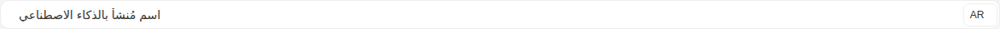

Args:

```json
{
  "value": "{\"en\": \"AI generated name\", \"ar\": \"اسم مُنشأ بالذكاء الاصطناعي\"}",
  "type": "input",
  "placeholder": "Enter your text here...",
  "size": "md",
  "required": false,
  "disabled": false,
  "hasError": false,
  "language": "ar",
  "languages": {
    "feature": true,
    "supported": [],
    "current": {
      "id": 0,
      "label": "English",
      "value": "en"
    }
  },
  "noBorder": false,
  "startSlot": "hgi-stroke hgi-language-square",
  "aiSuggestion": {
    "enabled": true,
    "source": "ai",
    "regenerable": true
  }
}
```

<details><summary>Rendered markup</summary>

```html
<s-lingual-field name="undefined" value="{&quot;en&quot;: &quot;AI generated name&quot;, &quot;ar&quot;: &quot;اسم مُنشأ بالذكاء الاصطناعي&quot;}" type="input" placeholder="Enter your text here..." size="md" language="ar" start-slot="hgi-stroke hgi-language-square" languages="{&quot;feature&quot;:true,&quot;supported&quot;:[],&quot;current&quot;:{&quot;id&quot;:0,&quot;label&quot;:&quot;English&quot;,&quot;value&quot;:&quot;en&quot;}}" ai-suggestion="{&quot;enabled&quot;:true,&quot;source&quot;:&quot;ai&quot;,&quot;regenerable&quot;:true}" dir="rtl" class="s-lingual-field s-lingual-field--input rtl w-full relative flex items-start justify-start gap-4 hydrated"><!----><s-input class="flex-1 md rtl multilingual ltr hydrated" dir="rtl" value="اسم مُنشأ بالذكاء الاصطناعي"><s-icon slot="start" class="hydrated"></s-icon><div slot="end" class="s-lingual-field__actions-end s-lingual-field__actions-end--hidden" data-lingual-field-internal-slot=""><div class="s-lingual-field__actions-end__reserve s-lingual-field__actions-end--hidden" aria-hidden="true"><s-button slot="actions" layout="circular" size="sm" theme="info" title="Regenerate" class="s-btn s-btn--info circular sm ltr hydrated" target="_self">
      <s-icon icon="hgi-stroke hgi-refresh" class="hydrated"></s-icon>
    </s-button>
    
    
  </div></div></s-input><s-dropdown dir="ltr" class="h-fit end ltr hydrated" overlay-alignment="start"><s-button data-toggle="true" slot="dropdown-head" class="s-btn s-btn--white default sm outlined ltr hydrated" theme="white" target="_self">AR<s-icon class="hydrated"></s-icon></s-button></s-dropdown></s-lingual-field>
```

</details>

### Ai Suggestion Rich Text

Story id `components-lingualfield--ai-suggestion-rich-text`

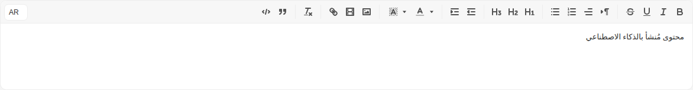

Args:

```json
{
  "value": "{\"en\": \"AI generated content\", \"ar\": \"محتوى مُنشأ بالذكاء الاصطناعي\"}",
  "type": "richText",
  "placeholder": "Enter your text here...",
  "size": "md",
  "required": false,
  "disabled": false,
  "hasError": false,
  "language": "ar",
  "languages": {
    "feature": true,
    "supported": [],
    "current": {
      "id": 0,
      "label": "English",
      "value": "en"
    }
  },
  "noBorder": false,
  "startSlot": "hgi-stroke hgi-language-square",
  "aiSuggestion": {
    "enabled": true,
    "source": "ai",
    "regenerable": true
  }
}
```

<details><summary>Rendered markup</summary>

```html
<s-lingual-field name="undefined" value="{&quot;en&quot;: &quot;AI generated content&quot;, &quot;ar&quot;: &quot;محتوى مُنشأ بالذكاء الاصطناعي&quot;}" type="richText" placeholder="Enter your text here..." size="md" language="ar" start-slot="hgi-stroke hgi-language-square" languages="{&quot;feature&quot;:true,&quot;supported&quot;:[],&quot;current&quot;:{&quot;id&quot;:0,&quot;label&quot;:&quot;English&quot;,&quot;value&quot;:&quot;en&quot;}}" ai-suggestion="{&quot;enabled&quot;:true,&quot;source&quot;:&quot;ai&quot;,&quot;regenerable&quot;:true}" dir="rtl" class="s-lingual-field s-lingual-field--richText rtl w-full relative flex items-start justify-start gap-4 hydrated"><!----><div class="s-lingual-field__editor-wrap" dir="rtl"><s-editor type="richText" class="flex-1 md rtl s-editor multilingual hydrated" size="md" dir="rtl"><!----><div class="s-editor__wrapper"><s-editor-toolbar class="hydrated"><div id="toolbar" class="s-editor__toolbar ql-toolbar ql-snow" role="toolbar" aria-label="Editor toolbar"><span class="ql-formats" role="group" aria-label="Formatting options group"><button type="button" class="ql-bold" title="Bold" aria-label="Bold" aria-pressed="false"><svg viewBox="0 0 18 18"><path class="ql-stroke" d="M5,4H9.5A2.5,2.5,0,0,1,12,6.5v0A2.5,2.5,0,0,1,9.5,9H5A0,0,0,0,1,5,9V4A0,0,0,0,1,5,4Z"></path><path class="ql-stroke" d="M5,9h5.5A2.5,2.5,0,0,1,13,11.5v0A2.5,2.5,0,0,1,10.5,14H5a0,0,0,0,1,0,0V9A0,0,0,0,1,5,9Z"></path></svg></button><button type="button" class="ql-italic" title="Italic" aria-label="Italic" aria-pressed="false"><svg viewBox="0 0 18 18"><line class="ql-stroke" x1="7" x2="13" y1="4" y2="4"></line><line class="ql-stroke" x1="5" x2="11" y1="14" y2="14"></line><line class="ql-stroke" x1="8" x2="10" y1="14" y2="4"></line></svg></button><button type="button" class="ql-underline" title="Underline" aria-label="Underline" aria-pressed="false"><svg viewBox="0 0 18 18"><path class="ql-stroke" d="M5,3V9a4.012,4.012,0,0,0,4,4H9a4.012,4.012,0,0,0,4-4V3"></path><rect class="ql-fill" height="1" rx="0.5" ry="0.5" width="12" x="3" y="15"></rect></svg></button><button type="button" class="ql-strike" title="Strikethrough" aria-label="Strikethrough" aria-pressed="false"><svg viewBox="0 0 18 18"><line class="ql-stroke ql-thin" x1="15.5" x2="2.5" y1="8.5" y2="9.5"></line><path class="ql-fill" d="M9.007,8C6.542,7.791,6,7.519,6,6.5,6,5.792,7.283,5,9,5c1.571,0,2.765.679,2.969,1.309a1,1,0,0,0,1.9-.617C13.356,4.106,11.354,3,9,3,6.2,3,4,4.538,4,6.5a3.2,3.2,0,0,0,.5,1.843Z"></path><path class="ql-fill" d="M8.984,10C11.457,10.208,12,10.479,12,11.5c0,0.708-1.283,1.5-3,1.5-1.571,0-2.765-.679-2.969-1.309a1,1,0,1,0-1.9.617C4.644,13.894,6.646,15,9,15c2.8,0,5-1.538,5-3.5a3.2,3.2,0,0,0-.5-1.843Z"></path></svg></button></span><span class="ql-formats" role="group" aria-label="Formatting options group"><button type="button" class="ql-direction" value="rtl" title="Format direction: rtl" aria-label="Format direction: rtl" aria-pressed="false"><svg viewBox="0 0 18 18"><polygon class="ql-stroke ql-fill" points="3 11 5 9 3 7 3 11"></polygon><line class="ql-stroke ql-fill" x1="15" x2="11" y1="4" y2="4"></line><path class="ql-fill" d="M11,3a3,3,0,0,0,0,6h1V3H11Z"></path><rect class="ql-fill" height="11" width="1" x="11" y="4"></rect><rect class="ql-fill" height="11" width="1" x="13" y="4"></rect></svg><svg viewBox="0 0 18 18"><polygon class="ql-stroke ql-fill" points="15 12 13 10 15 8 15 12"></polygon><line class="ql-stroke ql-fill" x1="9" x2="5" y1="4" y2="4"></line><path class="ql-fill" d="M5,3A3,3,0,0,0,5,9H6V3H5Z"></path><rect class="ql-fill" height="11" width="1" x="5" y="4"></rect><rect class="ql-fill" height="11" width="1" x="7" y="4"></rect></svg></button><span class="ql-align ql-picker ql-icon-picker" title="Text alignment" aria-label="Text alignment"><span class="ql-picker-label" tabindex="0" role="button" aria-expanded="false" aria-controls="ql-picker-options-0" data-value="start" data-label="Align to the leading edge"><svg viewBox="0 0 18 18"><line class="ql-stroke" x1="3" x2="15" y1="9" y2="9"></line><line class="ql-stroke" x1="3" x2="13" y1="14" y2="14"></line><line class="ql-stroke" x1="3" x2="9" y1="4" y2="4"></line></svg></span><span class="ql-picker-options" aria-hidden="true" tabindex="-1" id="ql-picker-options-0"><span tabindex="0" role="button" class="ql-picker-item" data-value="start" data-label="Align to the leading edge"><svg viewBox="0 0 18 18"><line class="ql-stroke" x1="3" x2="15" y1="9" y2="9"></line><line class="ql-stroke" x1="3" x2="13" y1="14" y2="14"></line><line class="ql-stroke" x1="3" x2="9" y1="4" y2="4"></line></svg></span><span tabindex="0" role="button" class="ql-picker-item" data-value="center" data-label="Center"><svg viewBox="0 0 18 18"><line class="ql-stroke" x1="15" x2="3" y1="9" y2="9"></line><line class="ql-stroke" x1="14" x2="4" y1="14" y2="14"></line><line class="ql-stroke" x1="12" x2="6" y1="4" y2="4"></line></svg></span><span tabindex="0" role="button" class="ql-picker-item" data-value="end" data-label="Align to the trailing edge"><svg viewBox="0 0 18 18"><line class="ql-stroke" x1="15" x2="3" y1="9" y2="9"></line><line class="ql-stroke" x1="15" x2="5" y1="14" y2="14"></line><line class="ql-stroke" x1="15" x2="9" y1="4" y2="4"></line></svg></span><span tabindex="0" role="button" class="ql-picker-item" data-value="justify" data-label="Justify"><svg viewBox="0 0 18 18"><line class="ql-stroke" x1="15" x2="3" y1="9" y2="9"></line><line class="ql-stroke" x1="15" x2="3" y1="14" y2="14"></line><line class="ql-stroke" x1="15" x2="3" y1="4" y2="4"></line></svg></span></span></span><select class="ql-align" title="Text alignment" aria-label="Text alignment" style="display: none;"><option value="start" aria-label="Align to the leading edge">Align to the leading edge</option><option value="center" aria-label="Center">Center</option><option value="end" aria-label="Align to the trailing edge">Align to the trailing edge</option><option value="justify" aria-label="Justify">Justify</option></select><button type="button" class="ql-list" value="ordered" title="Format list: ordered" aria-label="Format list: ordered" aria-pressed="false"><svg viewBox="0 0 18 18"><line class="ql-stroke" x1="7" x2="15" y1="4" y2="4"></line><line class="ql-stroke" x1="7" x2="15" y1="9" y2="9"></line><line class="ql-stroke" x1="7" x2="15" y1="14" y2="14"></line><line class="ql-stroke ql-thin" x1="2.5" x2="4.5" y1="5.5" y2="5.5"></line><path class="ql-fill" d="M3.5,6A0.5,0.5,0,0,1,3,5.5V3.085l-0.276.138A0.5,0.5,0,0,1,2.053,3c-0.124-.247-0.023-0.324.224-0.447l1-.5A0.5,0.5,0,0,1,4,2.5v3A0.5,0.5,0,0,1,3.5,6Z"></path><path class="ql-stroke ql-thin" d="M4.5,10.5h-2c0-.234,1.85-1.076,1.85-2.234A0.959,0.959,0,0,0,2.5,8.156"></path><path class="ql-stroke ql-thin" d="M2.5,14.846a0.959,0.959,0,0,0,1.85-.109A0.7,0.7,0,0,0,3.75,14a0.688,0.688,0,0,0,.6-0.736,0.959,0.959,0,0,0-1.85-.109"></path></svg></button><button type="button" class="ql-list" value="bullet" title="Format list: bullet" aria-label="Format list: bullet" aria-pressed="false"><svg viewBox="0 0 18 18"><line class="ql-stroke" x1="6" x2="15" y1="4" y2="4"></line><line class="ql-stroke" x1="6" x2="15" y1="9" y2="9"></line><line class="ql-stroke" x1="6" x2="15" y1="14" y2="14"></line><line class="ql-stroke" x1="3" x2="3" y1="4" y2="4"></line><line class="ql-stroke" x1="3" x2="3" y1="9" y2="9"></line><line class="ql-stroke" x1="3" x2="3" y1="14" y2="14"></line></svg></button></span><span class="ql-formats" role="group" aria-label="Formatting options group"><button type="button" class="ql-header" value="1" title="Format header: 1" aria-label="Format header: 1" aria-pressed="false"><svg viewBox="0 0 18 18"><path class="ql-fill" d="M10,4V14a1,1,0,0,1-2,0V10H3v4a1,1,0,0,1-2,0V4A1,1,0,0,1,3,4V8H8V4a1,1,0,0,1,2,0Zm6.06787,9.209H14.98975V7.59863a.54085.54085,0,0,0-.605-.60547h-.62744a1.01119,1.01119,0,0,0-.748.29688L11.645,8.56641a.5435.5435,0,0,0-.022.8584l.28613.30762a.53861.53861,0,0,0,.84717.0332l.09912-.08789a1.2137,1.2137,0,0,0,.2417-.35254h.02246s-.01123.30859-.01123.60547V13.209H12.041a.54085.54085,0,0,0-.605.60547v.43945a.54085.54085,0,0,0,.605.60547h4.02686a.54085.54085,0,0,0,.605-.60547v-.43945A.54085.54085,0,0,0,16.06787,13.209Z"></path></svg></button><button type="button" class="ql-header" value="2" title="Format header: 2" aria-label="Format header: 2" aria-pressed="false"><svg viewBox="0 0 18 18"><path class="ql-fill" d="M16.73975,13.81445v.43945a.54085.54085,0,0,1-.605.60547H11.855a.58392.58392,0,0,1-.64893-.60547V14.0127c0-2.90527,3.39941-3.42187,3.39941-4.55469a.77675.77675,0,0,0-.84717-.78125,1.17684,1.17684,0,0,0-.83594.38477c-.2749.26367-.561.374-.85791.13184l-.4292-.34082c-.30811-.24219-.38525-.51758-.1543-.81445a2.97155,2.97155,0,0,1,2.45361-1.17676,2.45393,2.45393,0,0,1,2.68408,2.40918c0,2.45312-3.1792,2.92676-3.27832,3.93848h2.79443A.54085.54085,0,0,1,16.73975,13.81445ZM9,3A.99974.99974,0,0,0,8,4V8H3V4A1,1,0,0,0,1,4V14a1,1,0,0,0,2,0V10H8v4a1,1,0,0,0,2,0V4A.99974.99974,0,0,0,9,3Z"></path></svg></button><button type="button" class="ql-header" value="3" title="Format header: 3" aria-label="Format header: 3" aria-pressed="false"><svg viewBox="0 0 18 18"><path class="ql-fill" d="M16.65186,12.30664a2.6742,2.6742,0,0,1-2.915,2.68457,3.96592,3.96592,0,0,1-2.25537-.6709.56007.56007,0,0,1-.13232-.83594L11.64648,13c.209-.34082.48389-.36328.82471-.1543a2.32654,2.32654,0,0,0,1.12256.33008c.71484,0,1.12207-.35156,1.12207-.78125,0-.61523-.61621-.86816-1.46338-.86816H13.2085a.65159.65159,0,0,1-.68213-.41895l-.05518-.10937a.67114.67114,0,0,1,.14307-.78125l.71533-.86914a8.55289,8.55289,0,0,1,.68213-.7373V8.58887a3.93913,3.93913,0,0,1-.748.05469H11.9873a.54085.54085,0,0,1-.605-.60547V7.59863a.54085.54085,0,0,1,.605-.60547h3.75146a.53773.53773,0,0,1,.60547.59375v.17676a1.03723,1.03723,0,0,1-.27539.748L14.74854,10.0293A2.31132,2.31132,0,0,1,16.65186,12.30664ZM9,3A.99974.99974,0,0,0,8,4V8H3V4A1,1,0,0,0,1,4V14a1,1,0,0,0,2,0V10H8v4a1,1,0,0,0,2,0V4A.99974.99974,0,0,0,9,3Z"></path></svg></button></span><span class="ql-formats" role="group" aria-label="Formatting options group"><button type="button" class="ql-indent" value="-1" title="Format indent: -1" aria-label="Format indent: -1" aria-pressed="false"><svg viewBox="0 0 18 18"><line class="ql-stroke" x1="3" x2="15" y1="14" y2="14"></line><line class="ql-stroke" x1="3" x2="15" y1="4" y2="4"></line><line class="ql-stroke" x1="9" x2="15" y1="9" y2="9"></line><polyline class="ql-stroke" points="5 7 5 11 3 9 5 7"></polyline></svg></button><button type="button" class="ql-indent" value="+1" title="Format indent: +1" aria-label="Format indent: +1" aria-pressed="false"><svg viewBox="0 0 18 18"><line class="ql-stroke" x1="3" x2="15" y1="14" y2="14"></line><line class="ql-stroke" x1="3" x2="15" y1="4" y2="4"></line><line class="ql-stroke" x1="9" x2="15" y1="9" y2="9"></line><polyline class="ql-fill ql-stroke" points="3 7 3 11 5 9 3 7"></polyline></svg></button></span><span class="ql-formats" role="group" aria-label="Formatting options group"><span class="ql-color ql-picker ql-color-picker keep-color" title="Text color" aria-label="Text color"><span class="ql-picker-label" tabindex="0" role="button" aria-expanded="false" aria-controls="ql-picker-options-1" data-value=""><svg viewBox="0 0 18 18"><line class="ql-color-label ql-stroke ql-transparent" x1="3" x2="15" y1="15" y2="15"></line><polyline class="ql-stroke" points="5.5 11 9 3 12.5 11"></polyline><line class="ql-stroke" x1="11.63" x2="6.38" y1="9" y2="9"></line></svg></span><span class="ql-picker-expand"><svg viewBox="0 0 32 32"><path fill="currentColor" d="m24 12l-8 10l-8-10z"></path></svg></span><span class="ql-picker-options" aria-hidden="true" tabindex="-1" id="ql-picker-options-1"><p tabindex="0" role="button" class="ql-picker-item blank" data-value="" data-dark="true"><span>Remove color</span></p><p tabindex="0" role="button" class="ql-picker-item" data-value="rgb(255, 255, 255)" style="--bg: rgb(255, 255, 255);"></p><p tabindex="0" role="button" class="ql-picker-item" data-value="rgb(0, 0, 0)" data-dark="true" style="--bg: rgb(0, 0, 0);"></p><p tabindex="0" role="button" class="ql-picker-item" data-value="rgb(72, 83, 104)" data-dark="true" style="--bg: rgb(72, 83, 104);"></p><p tabindex="0" role="button" class="ql-picker-item" data-value="rgb(41, 114, 244)" data-dark="true" style="--bg: rgb(41, 114, 244);"></p><p tabindex="0" role="button" class="ql-picker-item" data-value="rgb(0, 163, 245)" data-dark="true" style="--bg: rgb(0, 163, 245);"></p><p tabindex="0" role="button" class="ql-picker-item" data-value="rgb(49, 155, 98)" data-dark="true" style="--bg: rgb(49, 155, 98);"></p><p tabindex="0" role="button" class="ql-picker-item" data-value="rgb(222, 60, 54)" data-dark="true" style="--bg: rgb(222, 60, 54);"></p><p tabindex="0" role="button" class="ql-picker-item" data-value="rgb(248, 136, 37)" style="--bg: rgb(248, 136, 37);"></p><p tabindex="0" role="button" class="ql-picker-item" data-value="rgb(245, 196, 0)" style="--bg: rgb(245, 196, 0);"></p><p tabindex="0" role="button" class="ql-picker-item" data-value="rgb(153, 56, 215)" data-dark="true" style="--bg: rgb(153, 56, 215);"></p><p tabindex="0" role="button" class="ql-picker-item" data-value="rgb(242, 242, 242)" style="--bg: rgb(242, 242, 242);"></p><p tabindex="0" role="button" class="ql-picker-item" data-value="rgb(127, 127, 127)" data-dark="true" style="--bg: rgb(127, 127, 127);"></p><p tabindex="0" role="button" class="ql-picker-item" data-value="rgb(243, 245, 247)" style="--bg: rgb(243, 245, 247);"></p><p tabindex="0" role="button" class="ql-picker-item" data-value="rgb(229, 239, 255)" style="--bg: rgb(229, 239, 255);"></p><p tabindex="0" role="button" class="ql-picker-item" data-value="rgb(229, 246, 255)" style="--bg: rgb(229, 246, 255);"></p><p tabindex="0" role="button" class="ql-picker-item" data-value="rgb(234, 250, 241)" style="--bg: rgb(234, 250, 241);"></p><p tabindex="0" role="button" class="ql-picker-item" data-value="rgb(254, 233, 232)" style="--bg: rgb(254, 233, 232);"></p><p tabindex="0" role="button" class="ql-picker-item" data-value="rgb(254, 243, 235)" style="--bg: rgb(254, 243, 235);"></p><p tabindex="0" role="button" class="ql-picker-item" data-value="rgb(254, 249, 227)" style="--bg: rgb(254, 249, 227);"></p><p tabindex="0" role="button" class="ql-picker-item" data-value="rgb(253, 235, 255)" style="--bg: rgb(253, 235, 255);"></p><p tabindex="0" role="button" class="ql-picker-item" data-value="rgb(216, 216, 216)" style="--bg: rgb(216, 216, 216);"></p><p tabindex="0" role="button" class="ql-picker-item" data-value="rgb(89, 89, 89)" data-dark="true" style="--bg: rgb(89, 89, 89);"></p><p tabindex="0" role="button" class="ql-picker-item" data-value="rgb(197, 202, 211)" style="--bg: rgb(197, 202, 211);"></p><p tabindex="0" role="button" class="ql-picker-item" data-value="rgb(199, 220, 255)" style="--bg: rgb(199, 220, 255);"></p><p tabindex="0" role="button" class="ql-picker-item" data-value="rgb(199, 236, 255)" style="--bg: rgb(199, 236, 255);"></p><p tabindex="0" role="button" class="ql-picker-item" data-value="rgb(195, 234, 213)" style="--bg: rgb(195, 234, 213);"></p><p tabindex="0" role="button" class="ql-picker-item" data-value="rgb(255, 201, 199)" style="--bg: rgb(255, 201, 199);"></p><p tabindex="0" role="button" class="ql-picker-item" data-value="rgb(255, 220, 196)" style="--bg: rgb(255, 220, 196);"></p><p tabindex="0" role="button" class="ql-picker-item" data-value="rgb(255, 238, 173)" style="--bg: rgb(255, 238, 173);"></p><p tabindex="0" role="button" class="ql-picker-item" data-value="rgb(242, 199, 255)" style="--bg: rgb(242, 199, 255);"></p><p tabindex="0" role="button" class="ql-picker-item" data-value="rgb(191, 191, 191)" style="--bg: rgb(191, 191, 191);"></p><p tabindex="0" role="button" class="ql-picker-item" data-value="rgb(63, 63, 63)" data-dark="true" style="--bg: rgb(63, 63, 63);"></p><p tabindex="0" role="button" class="ql-picker-item" data-value="rgb(128, 139, 158)" style="--bg: rgb(128, 139, 158);"></p><p tabindex="0" role="button" class="ql-picker-item" data-value="rgb(153, 190, 255)" style="--bg: rgb(153, 190, 255);"></p><p tabindex="0" role="button" class="ql-picker-item" data-value="rgb(153, 221, 255)" style="--bg: rgb(153, 221, 255);"></p><p tabindex="0" role="button" class="ql-picker-item" data-value="rgb(152, 215, 182)" style="--bg: rgb(152, 215, 182);"></p><p tabindex="0" role="button" class="ql-picker-item" data-value="rgb(255, 156, 153)" style="--bg: rgb(255, 156, 153);"></p><p tabindex="0" role="button" class="ql-picker-item" data-value="rgb(255, 186, 132)" style="--bg: rgb(255, 186, 132);"></p><p tabindex="0" role="button" class="ql-picker-item" data-value="rgb(255, 226, 112)" style="--bg: rgb(255, 226, 112);"></p><p tabindex="0" role="button" class="ql-picker-item" data-value="rgb(213, 142, 255)" style="--bg: rgb(213, 142, 255);"></p><p tabindex="0" role="button" class="ql-picker-item" data-value="rgb(165, 165, 165)" style="--bg: rgb(165, 165, 165);"></p><p tabindex="0" role="button" class="ql-picker-item" data-value="rgb(38, 38, 38)" data-dark="true" style="--bg: rgb(38, 38, 38);"></p><p tabindex="0" role="button" class="ql-picker-item" data-value="rgb(53, 59, 69)" data-dark="true" style="--bg: rgb(53, 59, 69);"></p><p tabindex="0" role="button" class="ql-picker-item" data-value="rgb(20, 80, 184)" data-dark="true" style="--bg: rgb(20, 80, 184);"></p><p tabindex="0" role="button" class="ql-picker-item" data-value="rgb(18, 116, 165)" data-dark="true" style="--bg: rgb(18, 116, 165);"></p><p tabindex="0" role="button" class="ql-picker-item" data-value="rgb(39, 124, 79)" data-dark="true" style="--bg: rgb(39, 124, 79);"></p><p tabindex="0" role="button" class="ql-picker-item" data-value="rgb(158, 30, 26)" data-dark="true" style="--bg: rgb(158, 30, 26);"></p><p tabindex="0" role="button" class="ql-picker-item" data-value="rgb(184, 96, 20)" data-dark="true" style="--bg: rgb(184, 96, 20);"></p><p tabindex="0" role="button" class="ql-picker-item" data-value="rgb(163, 130, 0)" data-dark="true" style="--bg: rgb(163, 130, 0);"></p><p tabindex="0" role="button" class="ql-picker-item" data-value="rgb(94, 34, 129)" data-dark="true" style="--bg: rgb(94, 34, 129);"></p><p tabindex="0" role="button" class="ql-picker-item" data-value="rgb(147, 147, 147)" style="--bg: rgb(147, 147, 147);"></p><p tabindex="0" role="button" class="ql-picker-item" data-value="rgb(13, 13, 13)" data-dark="true" style="--bg: rgb(13, 13, 13);"></p><p tabindex="0" role="button" class="ql-picker-item" data-value="rgb(36, 39, 46)" data-dark="true" style="--bg: rgb(36, 39, 46);"></p><p tabindex="0" role="button" class="ql-picker-item" data-value="rgb(12, 48, 110)" data-dark="true" style="--bg: rgb(12, 48, 110);"></p><p tabindex="0" role="button" class="ql-picker-item" data-value="rgb(10, 65, 92)" data-dark="true" style="--bg: rgb(10, 65, 92);"></p><p tabindex="0" role="button" class="ql-picker-item" data-value="rgb(24, 78, 50)" data-dark="true" style="--bg: rgb(24, 78, 50);"></p><p tabindex="0" role="button" class="ql-picker-item" data-value="rgb(88, 17, 14)" data-dark="true" style="--bg: rgb(88, 17, 14);"></p><p tabindex="0" role="button" class="ql-picker-item" data-value="rgb(92, 48, 10)" data-dark="true" style="--bg: rgb(92, 48, 10);"></p><p tabindex="0" role="button" class="ql-picker-item" data-value="rgb(102, 82, 0)" data-dark="true" style="--bg: rgb(102, 82, 0);"></p><p tabindex="0" role="button" class="ql-picker-item" data-value="rgb(59, 21, 81)" data-dark="true" style="--bg: rgb(59, 21, 81);"></p><div class="custom ql-picker-item"><span>sdk:common.choose_color</span></div><div class="used"><div class="used-list"></div></div></span></span><select class="ql-color" title="Text color" aria-label="Text color" style="display: none;"><option value=""></option><option value="rgb(255, 255, 255)"></option><option value="rgb(0, 0, 0)"></option><option value="rgb(72, 83, 104)"></option><option value="rgb(41, 114, 244)"></option><option value="rgb(0, 163, 245)"></option><option value="rgb(49, 155, 98)"></option><option value="rgb(222, 60, 54)"></option><option value="rgb(248, 136, 37)"></option><option value="rgb(245, 196, 0)"></option><option value="rgb(153, 56, 215)"></option><option value="rgb(242, 242, 242)"></option><option value="rgb(127, 127, 127)"></option><option value="rgb(243, 245, 247)"></option><option value="rgb(229, 239, 255)"></option><option value="rgb(229, 246, 255)"></option><option value="rgb(234, 250, 241)"></option><option value="rgb(254, 233, 232)"></option><option value="rgb(254, 243, 235)"></option><option value="rgb(254, 249, 227)"></option><option value="rgb(253, 235, 255)"></option><option value="rgb(216, 216, 216)"></option><option value="rgb(89, 89, 89)"></option><option value="rgb(197, 202, 211)"></option><option value="rgb(199, 220, 255)"></option><option value="rgb(199, 236, 255)"></option><option value="rgb(195, 234, 213)"></option><option value="rgb(255, 201, 199)"></option><option value="rgb(255, 220, 196)"></option><option value="rgb(255, 238, 173)"></option><option value="rgb(242, 199, 255)"></option><option value="rgb(191, 191, 191)"></option><option value="rgb(63, 63, 63)"></option><option value="rgb(128, 139, 158)"></option><option value="rgb(153, 190, 255)"></option><option value="rgb(153, 221, 255)"></option><option value="rgb(152, 215, 182)"></option><option value="rgb(255, 156, 153)"></option><option value="rgb(255, 186, 132)"></option><option value="rgb(255, 226, 112)"></option><option value="rgb(213, 142, 255)"></option><option value="rgb(165, 165, 165)"></option><option value="rgb(38, 38, 38)"></option><option value="rgb(53, 59, 69)"></option><option value="rgb(20, 80, 184)"></option><option value="rgb(18, 116, 165)"></option><option value="rgb(39, 124, 79)"></option><option value="rgb(158, 30, 26)"></option><option value="rgb(184, 96, 20)"></option><option value="rgb(163, 130, 0)"></option><option value="rgb(94, 34, 129)"></option><option value="rgb(147, 147, 147)"></option><option value="rgb(13, 13, 13)"></option><option value="rgb(36, 39, 46)"></option><option value="rgb(12, 48, 110)"></option><option value="rgb(10, 65, 92)"></option><option value="rgb(24, 78, 50)"></option><option value="rgb(88, 17, 14)"></option><option value="rgb(92, 48, 10)"></option><option value="rgb(102, 82, 0)"></option><option value="rgb(59, 21, 81)"></option><option value="custom"></option></select><span class="ql-background ql-picker ql-color-picker keep-color" title="Background color" aria-label="Background color"><span class="ql-picker-label" tabindex="0" role="button" aria-expanded="false" aria-controls="ql-picker-options-2" data-value=""><svg viewBox="0 0 18 18"><g class="ql-fill ql-color-label"><polygon points="6 6.868 6 6 5 6 5 7 5.942 7 6 6.868"></polygon><rect height="1" width="1" x="4" y="4"></rect><polygon points="6.817 5 6 5 6 6 6.38 6 6.817 5"></polygon><rect height="1" width="1" x="2" y="6"></rect><rect height="1" width="1" x="3" y="5"></rect><rect height="1" width="1" x="4" y="7"></rect><polygon points="4 11.439 4 11 3 11 3 12 3.755 12 4 11.439"></polygon><rect height="1" width="1" x="2" y="12"></rect><rect height="1" width="1" x="2" y="9"></rect><rect height="1" width="1" x="2" y="15"></rect><polygon points="4.63 10 4 10 4 11 4.192 11 4.63 10"></polygon><rect height="1" width="1" x="3" y="8"></rect><path d="M10.832,4.2L11,4.582V4H10.708A1.948,1.948,0,0,1,10.832,4.2Z"></path><path d="M7,4.582L7.168,4.2A1.929,1.929,0,0,1,7.292,4H7V4.582Z"></path><path d="M8,13H7.683l-0.351.8a1.933,1.933,0,0,1-.124.2H8V13Z"></path><rect height="1" width="1" x="12" y="2"></rect><rect height="1" width="1" x="11" y="3"></rect><path d="M9,3H8V3.282A1.985,1.985,0,0,1,9,3Z"></path><rect height="1" width="1" x="2" y="3"></rect><rect height="1" width="1" x="6" y="2"></rect><rect height="1" width="1" x="3" y="2"></rect><rect height="1" width="1" x="5" y="3"></rect><rect height="1" width="1" x="9" y="2"></rect><rect height="1" width="1" x="15" y="14"></rect><polygon points="13.447 10.174 13.469 10.225 13.472 10.232 13.808 11 14 11 14 10 13.37 10 13.447 10.174"></polygon><rect height="1" width="1" x="13" y="7"></rect><rect height="1" width="1" x="15" y="5"></rect><rect height="1" width="1" x="14" y="6"></rect><rect height="1" width="1" x="15" y="8"></rect><rect height="1" width="1" x="14" y="9"></rect><path d="M3.775,14H3v1H4V14.314A1.97,1.97,0,0,1,3.775,14Z"></path><rect height="1" width="1" x="14" y="3"></rect><polygon points="12 6.868 12 6 11.62 6 12 6.868"></polygon><rect height="1" width="1" x="15" y="2"></rect><rect height="1" width="1" x="12" y="5"></rect><rect height="1" width="1" x="13" y="4"></rect><polygon points="12.933 9 13 9 13 8 12.495 8 12.933 9"></polygon><rect height="1" width="1" x="9" y="14"></rect><rect height="1" width="1" x="8" y="15"></rect><path d="M6,14.926V15H7V14.316A1.993,1.993,0,0,1,6,14.926Z"></path><rect height="1" width="1" x="5" y="15"></rect><path d="M10.668,13.8L10.317,13H10v1h0.792A1.947,1.947,0,0,1,10.668,13.8Z"></path><rect height="1" width="1" x="11" y="15"></rect><path d="M14.332,12.2a1.99,1.99,0,0,1,.166.8H15V12H14.245Z"></path><rect height="1" width="1" x="14" y="15"></rect><rect height="1" width="1" x="15" y="11"></rect></g><polyline class="ql-stroke" points="5.5 13 9 5 12.5 13"></polyline><line class="ql-stroke" x1="11.63" x2="6.38" y1="11" y2="11"></line></svg></span><span class="ql-picker-expand"><svg viewBox="0 0 32 32"><path fill="currentColor" d="m24 12l-8 10l-8-10z"></path></svg></span><span class="ql-picker-options" aria-hidden="true" tabindex="-1" id="ql-picker-options-2"><p tabindex="0" role="button" class="ql-picker-item blank" data-value="" data-dark="true"><span>Remove color</span></p><p tabindex="0" role="button" class="ql-picker-item" data-value="rgb(255, 255, 255)" style="--bg: rgb(255, 255, 255);"></p><p tabindex="0" role="button" class="ql-picker-item" data-value="rgb(0, 0, 0)" data-dark="true" style="--bg: rgb(0, 0, 0);"></p><p tabindex="0" role="button" class="ql-picker-item" data-value="rgb(72, 83, 104)" data-dark="true" style="--bg: rgb(72, 83, 104);"></p><p tabindex="0" role="button" class="ql-picker-item" data-value="rgb(41, 114, 244)" data-dark="true" style="--bg: rgb(41, 114, 244);"></p><p tabindex="0" role="button" class="ql-picker-item" data-value="rgb(0, 163, 245)" data-dark="true" style="--bg: rgb(0, 163, 245);"></p><p tabindex="0" role="button" class="ql-picker-item" data-value="rgb(49, 155, 98)" data-dark="true" style="--bg: rgb(49, 155, 98);"></p><p tabindex="0" role="button" class="ql-picker-item" data-value="rgb(222, 60, 54)" data-dark="true" style="--bg: rgb(222, 60, 54);"></p><p tabindex="0" role="button" class="ql-picker-item" data-value="rgb(248, 136, 37)" style="--bg: rgb(248, 136, 37);"></p><p tabindex="0" role="button" class="ql-picker-item" data-value="rgb(245, 196, 0)" style="--bg: rgb(245, 196, 0);"></p><p tabindex="0" role="button" class="ql-picker-item" data-value="rgb(153, 56, 215)" data-dark="true" style="--bg: rgb(153, 56, 215);"></p><p tabindex="0" role="button" class="ql-picker-item" data-value="rgb(242, 242, 242)" style="--bg: rgb(242, 242, 242);"></p><p tabindex="0" role="button" class="ql-picker-item" data-value="rgb(127, 127, 127)" data-dark="true" style="--bg: rgb(127, 127, 127);"></p><p tabindex="0" role="button" class="ql-picker-item" data-value="rgb(243, 245, 247)" style="--bg: rgb(243, 245, 247);"></p><p tabindex="0" role="button" class="ql-picker-item" data-value="rgb(229, 239, 255)" style="--bg: rgb(229, 239, 255);"></p><p tabindex="0" role="button" class="ql-picker-item" data-value="rgb(229, 246, 255)" style="--bg: rgb(229, 246, 255);"></p><p tabindex="0" role="button" class="ql-picker-item" data-value="rgb(234, 250, 241)" style="--bg: rgb(234, 250, 241);"></p><p tabindex="0" role="button" class="ql-picker-item" data-value="rgb(254, 233, 232)" style="--bg: rgb(254, 233, 232);"></p><p tabindex="0" role="button" class="ql-picker-item" data-value="rgb(254, 243, 235)" style="--bg: rgb(254, 243, 235);"></p><p tabindex="0" role="button" class="ql-picker-item" data-value="rgb(254, 249, 227)" style="--bg: rgb(254, 249, 227);"></p><p tabindex="0" role="button" class="ql-picker-item" data-value="rgb(253, 235, 255)" style="--bg: rgb(253, 235, 255);"></p><p tabindex="0" role="button" class="ql-picker-item" data-value="rgb(216, 216, 216)" style="--bg: rgb(216, 216, 216);"></p><p tabindex="0" role="button" class="ql-picker-item" data-value="rgb(89, 89, 89)" data-dark="true" style="--bg: rgb(89, 89, 89);"></p><p tabindex="0" role="button" class="ql-picker-item" data-value="rgb(197, 202, 211)" style="--bg: rgb(197, 202, 211);"></p><p tabindex="0" role="button" class="ql-picker-item" data-value="rgb(199, 220, 255)" style="--bg: rgb(199, 220, 255);"></p><p tabindex="0" role="button" class="ql-picker-item" data-value="rgb(199, 236, 255)" style="--bg: rgb(199, 236, 255);"></p><p tabindex="0" role="button" class="ql-picker-item" data-value="rgb(195, 234, 213)" style="--bg: rgb(195, 234, 213);"></p><p tabindex="0" role="button" class="ql-picker-item" data-value="rgb(255, 201, 199)" style="--bg: rgb(255, 201, 199);"></p><p tabindex="0" role="button" class="ql-picker-item" data-value="rgb(255, 220, 196)" style="--bg: rgb(255, 220, 196);"></p><p tabindex="0" role="button" class="ql-picker-item" data-value="rgb(255, 238, 173)" style="--bg: rgb(255, 238, 173);"></p><p tabindex="0" role="button" class="ql-picker-item" data-value="rgb(242, 199, 255)" style="--bg: rgb(242, 199, 255);"></p><p tabindex="0" role="button" class="ql-picker-item" data-value="rgb(191, 191, 191)" style="--bg: rgb(191, 191, 191);"></p><p tabindex="0" role="button" class="ql-picker-item" data-value="rgb(63, 63, 63)" data-dark="true" style="--bg: rgb(63, 63, 63);"></p><p tabindex="0" role="button" class="ql-picker-item" data-value="rgb(128, 139, 158)" style="--bg: rgb(128, 139, 158);"></p><p tabindex="0" role="button" class="ql-picker-item" data-value="rgb(153, 190, 255)" style="--bg: rgb(153, 190, 255);"></p><p tabindex="0" role="button" class="ql-picker-item" data-value="rgb(153, 221, 255)" style="--bg: rgb(153, 221, 255);"></p><p tabindex="0" role="button" class="ql-picker-item" data-value="rgb(152, 215, 182)" style="--bg: rgb(152, 215, 182);"></p><p tabindex="0" role="button" class="ql-picker-item" data-value="rgb(255, 156, 153)" style="--bg: rgb(255, 156, 153);"></p><p tabindex="0" role="button" class="ql-picker-item" data-value="rgb(255, 186, 132)" style="--bg: rgb(255, 186, 132);"></p><p tabindex="0" role="button" class="ql-picker-item" data-value="rgb(255, 226, 112)" style="--bg: rgb(255, 226, 112);"></p><p tabindex="0" role="button" class="ql-picker-item" data-value="rgb(213, 142, 255)" style="--bg: rgb(213, 142, 255);"></p><p tabindex="0" role="button" class="ql-picker-item" data-value="rgb(165, 165, 165)" style="--bg: rgb(165, 165, 165);"></p><p tabindex="0" role="button" class="ql-picker-item" data-value="rgb(38, 38, 38)" data-dark="true" style="--bg: rgb(38, 38, 38);"></p><p tabindex="0" role="button" class="ql-picker-item" data-value="rgb(53, 59, 69)" data-dark="true" style="--bg: rgb(53, 59, 69);"></p><p tabindex="0" role="button" class="ql-picker-item" data-value="rgb(20, 80, 184)" data-dark="true" style="--bg: rgb(20, 80, 184);"></p><p tabindex="0" role="button" class="ql-picker-item" data-value="rgb(18, 116, 165)" data-dark="true" style="--bg: rgb(18, 116, 165);"></p><p tabindex="0" role="button" class="ql-picker-item" data-value="rgb(39, 124, 79)" data-dark="true" style="--bg: rgb(39, 124, 79);"></p><p tabindex="0" role="button" class="ql-picker-item" data-value="rgb(158, 30, 26)" data-dark="true" style="--bg: rgb(158, 30, 26);"></p><p tabindex="0" role="button" class="ql-picker-item" data-value="rgb(184, 96, 20)" data-dark="true" style="--bg: rgb(184, 96, 20);"></p><p tabindex="0" role="button" class="ql-picker-item" data-value="rgb(163, 130, 0)" data-dark="true" style="--bg: rgb(163, 130, 0);"></p><p tabindex="0" role="button" class="ql-picker-item" data-value="rgb(94, 34, 129)" data-dark="true" style="--bg: rgb(94, 34, 129);"></p><p tabindex="0" role="button" class="ql-picker-item" data-value="rgb(147, 147, 147)" style="--bg: rgb(147, 147, 147);"></p><p tabindex="0" role="button" class="ql-picker-item" data-value="rgb(13, 13, 13)" data-dark="true" style="--bg: rgb(13, 13, 13);"></p><p tabindex="0" role="button" class="ql-picker-item" data-value="rgb(36, 39, 46)" data-dark="true" style="--bg: rgb(36, 39, 46);"></p><p tabindex="0" role="button" class="ql-picker-item" data-value="rgb(12, 48, 110)" data-dark="true" style="--bg: rgb(12, 48, 110);"></p><p tabindex="0" role="button" class="ql-picker-item" data-value="rgb(10, 65, 92)" data-dark="true" style="--bg: rgb(10, 65, 92);"></p><p tabindex="0" role="button" class="ql-picker-item" data-value="rgb(24, 78, 50)" data-dark="true" style="--bg: rgb(24, 78, 50);"></p><p tabindex="0" role="button" class="ql-picker-item" data-value="rgb(88, 17, 14)" data-dark="true" style="--bg: rgb(88, 17, 14);"></p><p tabindex="0" role="button" class="ql-picker-item" data-value="rgb(92, 48, 10)" data-dark="true" style="--bg: rgb(92, 48, 10);"></p><p tabindex="0" role="button" class="ql-picker-item" data-value="rgb(102, 82, 0)" data-dark="true" style="--bg: rgb(102, 82, 0);"></p><p tabindex="0" role="button" class="ql-picker-item" data-value="rgb(59, 21, 81)" data-dark="true" style="--bg: rgb(59, 21, 81);"></p><div class="custom ql-picker-item"><span>sdk:common.choose_color</span></div><div class="used"><div class="used-list"></div></div></span></span><select class="ql-background" title="Background color" aria-label="Background color" style="display: none;"><option value=""></option><option value="rgb(255, 255, 255)"></option><option value="rgb(0, 0, 0)"></option><option value="rgb(72, 83, 104)"></option><option value="rgb(41, 114, 244)"></option><option value="rgb(0, 163, 245)"></option><option value="rgb(49, 155, 98)"></option><option value="rgb(222, 60, 54)"></option><option value="rgb(248, 136, 37)"></option><option value="rgb(245, 196, 0)"></option><option value="rgb(153, 56, 215)"></option><option value="rgb(242, 242, 242)"></option><option value="rgb(127, 127, 127)"></option><option value="rgb(243, 245, 247)"></option><option value="rgb(229, 239, 255)"></option><option value="rgb(229, 246, 255)"></option><option value="rgb(234, 250, 241)"></option><option value="rgb(254, 233, 232)"></option><option value="rgb(254, 243, 235)"></option><option value="rgb(254, 249, 227)"></option><option value="rgb(253, 235, 255)"></option><option value="rgb(216, 216, 216)"></option><option value="rgb(89, 89, 89)"></option><option value="rgb(197, 202, 211)"></option><option value="rgb(199, 220, 255)"></option><option value="rgb(199, 236, 255)"></option><option value="rgb(195, 234, 213)"></option><option value="rgb(255, 201, 199)"></option><option value="rgb(255, 220, 196)"></option><option value="rgb(255, 238, 173)"></option><option value="rgb(242, 199, 255)"></option><option value="rgb(191, 191, 191)"></option><option value="rgb(63, 63, 63)"></option><option value="rgb(128, 139, 158)"></option><option value="rgb(153, 190, 255)"></option><option value="rgb(153, 221, 255)"></option><option value="rgb(152, 215, 182)"></option><option value="rgb(255, 156, 153)"></option><option value="rgb(255, 186, 132)"></option><option value="rgb(255, 226, 112)"></option><option value="rgb(213, 142, 255)"></option><option value="rgb(165, 165, 165)"></option><option value="rgb(38, 38, 38)"></option><option value="rgb(53, 59, 69)"></option><option value="rgb(20, 80, 184)"></option><option value="rgb(18, 116, 165)"></option><option value="rgb(39, 124, 79)"></option><option value="rgb(158, 30, 26)"></option><option value="rgb(184, 96, 20)"></option><option value="rgb(163, 130, 0)"></option><option value="rgb(94, 34, 129)"></option><option value="rgb(147, 147, 147)"></option><option value="rgb(13, 13, 13)"></option><option value="rgb(36, 39, 46)"></option><option value="rgb(12, 48, 110)"></option><option value="rgb(10, 65, 92)"></option><option value="rgb(24, 78, 50)"></option><option value="rgb(88, 17, 14)"></option><option value="rgb(92, 48, 10)"></option><option value="rgb(102, 82, 0)"></option><option value="rgb(59, 21, 81)"></option><option value="custom"></option></select></span><span class="ql-formats" role="group" aria-label="Formatting options group"><button type="button" class="ql-image" title="Insert image" aria-label="Insert image" aria-pressed="false"><svg viewBox="0 0 18 18"><rect class="ql-stroke" height="10" width="12" x="3" y="4"></rect><circle class="ql-fill" cx="6" cy="7" r="1"></circle><polyline class="ql-even ql-fill" points="5 12 5 11 7 9 8 10 11 7 13 9 13 12 5 12"></polyline></svg></button><button type="button" class="ql-video" title="Insert video" aria-label="Insert video" aria-pressed="false"><svg viewBox="0 0 18 18"><rect class="ql-stroke" height="12" width="12" x="3" y="3"></rect><rect class="ql-fill" height="12" width="1" x="5" y="3"></rect><rect class="ql-fill" height="12" width="1" x="12" y="3"></rect><rect class="ql-fill" height="2" width="8" x="5" y="8"></rect><rect class="ql-fill" height="1" width="3" x="3" y="5"></rect><rect class="ql-fill" height="1" width="3" x="3" y="7"></rect><rect class="ql-fill" height="1" width="3" x="3" y="10"></rect><rect class="ql-fill" height="1" width="3" x="3" y="12"></rect><rect class="ql-fill" height="1" width="3" x="12" y="5"></rect><rect class="ql-fill" height="1" width="3" x="12" y="7"></rect><rect class="ql-fill" height="1" width="3" x="12" y="10"></rect><rect class="ql-fill" height="1" width="3" x="12" y="12"></rect></svg></button><button type="button" class="ql-link" title="Insert link" aria-label="Insert link" aria-pressed="false"><svg viewBox="0 0 18 18"><line class="ql-stroke" x1="7" x2="11" y1="7" y2="11"></line><path class="ql-even ql-stroke" d="M8.9,4.577a3.476,3.476,0,0,1,.36,4.679A3.476,3.476,0,0,1,4.577,8.9C3.185,7.5,2.035,6.4,4.217,4.217S7.5,3.185,8.9,4.577Z"></path><path class="ql-even ql-stroke" d="M13.423,9.1a3.476,3.476,0,0,0-4.679-.36,3.476,3.476,0,0,0,.36,4.679c1.392,1.392,2.5,2.542,4.679.36S14.815,10.5,13.423,9.1Z"></path></svg></button></span><span class="ql-formats" role="group" aria-label="Formatting options group"><button type="button" class="ql-clean" title="Clear formatting" aria-label="Clear formatting" aria-pressed="false"><svg class="" viewBox="0 0 18 18"><line class="ql-stroke" x1="5" x2="13" y1="3" y2="3"></line><line class="ql-stroke" x1="6" x2="9.35" y1="12" y2="3"></line><line class="ql-stroke" x1="11" x2="15" y1="11" y2="15"></line><line class="ql-stroke" x1="15" x2="11" y1="11" y2="15"></line><rect class="ql-fill" height="1" rx="0.5" ry="0.5" width="7" x="2" y="14"></rect></svg></button></span><span class="ql-formats" role="group" aria-label="Formatting options group"><button type="button" class="ql-blockquote" title="Block quote" aria-label="Block quote" aria-pressed="false"><svg viewBox="0 0 18 18"><rect class="ql-fill ql-stroke" height="3" width="3" x="4" y="5"></rect><rect class="ql-fill ql-stroke" height="3" width="3" x="11" y="5"></rect><path class="ql-even ql-fill ql-stroke" d="M7,8c0,4.031-3,5-3,5"></path><path class="ql-even ql-fill ql-stroke" d="M14,8c0,4.031-3,5-3,5"></path></svg></button><button type="button" class="ql-code-block" title="Code block" aria-label="Code block" aria-pressed="false"><svg viewBox="0 0 18 18"><polyline class="ql-even ql-stroke" points="5 7 3 9 5 11"></polyline><polyline class="ql-even ql-stroke" points="13 7 15 9 13 11"></polyline><line class="ql-stroke" x1="10" x2="8" y1="5" y2="13"></line></svg></button></span></div></s-editor-toolbar><div class="s-editor__body" dir="rtl"><div id="editor" dir="ltr" class="s-editor__container notranslate ql-container ql-snow" data-placeholder="Enter your text here..." translate="no"><div class="ql-editor notranslate" contenteditable="true" aria-owns="quill-mention-list" data-placeholder="Enter your text here..." translate="no"><p class="ql-direction-rtl">محتوى مُنشأ بالذكاء الاصطناعي</p></div><div class="ql-tooltip ql-hidden"><a class="ql-preview" rel="noopener noreferrer" target="_blank" href="about:blank"></a><input type="text" data-formula="e=mc^2" data-link="https://quilljs.com" data-video="Embed URL"><a class="ql-action"></a><a class="ql-remove"></a></div></div></div></div></s-editor><div class="s-lingual-field__editor-actions s-lingual-field__editor-actions--hidden"><s-button slot="actions" layout="circular" size="sm" theme="info" title="Regenerate" class="s-btn s-btn--info circular sm ltr hydrated" target="_self">
      <s-icon icon="hgi-stroke hgi-refresh" class="hydrated"></s-icon>
    </s-button>
    
    
  </div></div><s-dropdown dir="ltr" class="h-fit end ltr hydrated" overlay-alignment="start"><s-button data-toggle="true" slot="dropdown-head" class="s-btn s-btn--white default sm outlined ltr hydrated" theme="white" target="_self">AR<s-icon class="hydrated"></s-icon></s-button></s-dropdown></s-lingual-field>
```

</details>

### Multiple Languages

Story id `components-lingualfield--multiple-languages`


Args:

```json
{
  "value": "{\"en\": \"Hello\", \"ar\": \"مرحبا\"}",
  "type": "input",
  "placeholder": "Enter your text here...",
  "size": "md",
  "required": false,
  "disabled": false,
  "hasError": false,
  "language": "ar",
  "languages": {
    "feature": true,
    "supported": [
      {
        "id": 0,
        "label": "English",
        "value": "en",
        "icon": "https://assets.salla.sa/images/flags/en.svg",
        "active": false
      },
      {
        "id": 1,
        "label": "العربية",
        "value": "ar",
        "icon": "https://assets.salla.sa/images/flags/ar.svg",
        "active": true
      },
      {
        "id": 2,
        "label": "Français",
        "value": "fr",
        "icon": "https://assets.salla.sa/images/flags/fr.svg",
        "active": false
      },
      {
        "id": 3,
        "label": "Español",
        "value": "es",
        "icon": "https://assets.salla.sa/images/flags/es.svg",
        "active": false
      }
    ],
    "current": {
      "id": 1,
      "label": "العربية",
      "value": "ar",
      "icon": "https://assets.salla.sa/images/flags/ar.svg",
      "active": true
    }
  },
  "noBorder": false,
  "startSlot": "hgi-stroke hgi-language-square"
}
```

<details><summary>Rendered markup</summary>

```html
<s-lingual-field name="undefined" value="{&quot;en&quot;: &quot;Hello&quot;, &quot;ar&quot;: &quot;مرحبا&quot;}" type="input" placeholder="Enter your text here..." size="md" language="ar" start-slot="hgi-stroke hgi-language-square" languages="{&quot;feature&quot;:true,&quot;supported&quot;:[{&quot;id&quot;:0,&quot;label&quot;:&quot;English&quot;,&quot;value&quot;:&quot;en&quot;,&quot;icon&quot;:&quot;https://assets.salla.sa/images/flags/en.svg&quot;,&quot;active&quot;:false},{&quot;id&quot;:1,&quot;label&quot;:&quot;العربية&quot;,&quot;value&quot;:&quot;ar&quot;,&quot;icon&quot;:&quot;https://assets.salla.sa/images/flags/ar.svg&quot;,&quot;active&quot;:true},{&quot;id&quot;:2,&quot;label&quot;:&quot;Français&quot;,&quot;value&quot;:&quot;fr&quot;,&quot;icon&quot;:&quot;https://assets.salla.sa/images/flags/fr.svg&quot;,&quot;active&quot;:false},{&quot;id&quot;:3,&quot;label&quot;:&quot;Español&quot;,&quot;value&quot;:&quot;es&quot;,&quot;icon&quot;:&quot;https://assets.salla.sa/images/flags/es.svg&quot;,&quot;active&quot;:false}],&quot;current&quot;:{&quot;id&quot;:1,&quot;label&quot;:&quot;العربية&quot;,&quot;value&quot;:&quot;ar&quot;,&quot;icon&quot;:&quot;https://assets.salla.sa/images/flags/ar.svg&quot;,&quot;active&quot;:true}}" dir="rtl" class="s-lingual-field s-lingual-field--input rtl w-full relative flex items-start justify-start gap-4 hydrated"><!----><s-input class="flex-1 md rtl multilingual ltr hydrated" dir="rtl" value="مرحبا"><s-icon slot="start" class="hydrated"></s-icon><div slot="end" class="s-lingual-field__actions-end s-lingual-field__actions-end--hidden" data-lingual-field-internal-slot=""><div class="s-lingual-field__actions-end__reserve s-lingual-field__actions-end--hidden" aria-hidden="true">
    
  </div></div></s-input><s-dropdown dir="ltr" class="h-fit end ltr hydrated" overlay-alignment="start"><s-button data-toggle="true" slot="dropdown-head" class="s-btn s-btn--white default sm outlined ltr hydrated" theme="white" target="_self">AR<s-icon class="hydrated"></s-icon></s-button></s-dropdown></s-lingual-field>
```

</details>

### Large Size

Story id `components-lingualfield--large-size`

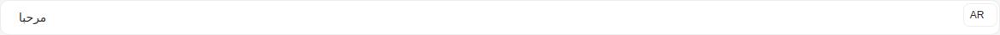

Args:

```json
{
  "value": "{\"en\": \"Hello\", \"ar\": \"مرحبا\"}",
  "type": "input",
  "placeholder": "Enter your text here...",
  "size": "lg",
  "required": false,
  "disabled": false,
  "hasError": false,
  "language": "ar",
  "languages": {
    "feature": true,
    "supported": [],
    "current": {
      "id": 0,
      "label": "English",
      "value": "en"
    }
  },
  "noBorder": false,
  "startSlot": "hgi-stroke hgi-language-square"
}
```

<details><summary>Rendered markup</summary>

```html
<s-lingual-field name="undefined" value="{&quot;en&quot;: &quot;Hello&quot;, &quot;ar&quot;: &quot;مرحبا&quot;}" type="input" placeholder="Enter your text here..." size="lg" language="ar" start-slot="hgi-stroke hgi-language-square" languages="{&quot;feature&quot;:true,&quot;supported&quot;:[],&quot;current&quot;:{&quot;id&quot;:0,&quot;label&quot;:&quot;English&quot;,&quot;value&quot;:&quot;en&quot;}}" dir="rtl" class="s-lingual-field s-lingual-field--input rtl w-full relative flex items-start justify-start gap-4 hydrated"><!----><s-input class="flex-1 lg rtl multilingual ltr hydrated" dir="rtl" value="مرحبا"><s-icon slot="start" class="hydrated"></s-icon><div slot="end" class="s-lingual-field__actions-end s-lingual-field__actions-end--hidden" data-lingual-field-internal-slot=""><div class="s-lingual-field__actions-end__reserve s-lingual-field__actions-end--hidden" aria-hidden="true">
    
  </div></div></s-input><s-dropdown dir="ltr" class="h-fit end ltr hydrated" overlay-alignment="start"><s-button data-toggle="true" slot="dropdown-head" class="s-btn s-btn--white default sm outlined ltr hydrated" theme="white" target="_self">AR<s-icon class="hydrated"></s-icon></s-button></s-dropdown></s-lingual-field>
```

</details>

### Min Length

Story id `components-lingualfield--min-length`


Args:

```json
{
  "value": "{\"en\": \"Hello\", \"ar\": \"مرحبا\"}",
  "type": "input",
  "placeholder": "Enter your text here...",
  "size": "md",
  "required": false,
  "disabled": false,
  "hasError": false,
  "language": "ar",
  "languages": {
    "feature": true,
    "supported": [],
    "current": {
      "id": 0,
      "label": "English",
      "value": "en"
    }
  },
  "noBorder": false,
  "startSlot": "hgi-stroke hgi-language-square",
  "min": 10,
  "desc": "Minimum 10 characters allowed"
}
```

<details><summary>Rendered markup</summary>

```html
<s-lingual-field name="undefined" value="{&quot;en&quot;: &quot;Hello&quot;, &quot;ar&quot;: &quot;مرحبا&quot;}" type="input" placeholder="Enter your text here..." size="md" language="ar" min="10" desc="Minimum 10 characters allowed" start-slot="hgi-stroke hgi-language-square" languages="{&quot;feature&quot;:true,&quot;supported&quot;:[],&quot;current&quot;:{&quot;id&quot;:0,&quot;label&quot;:&quot;English&quot;,&quot;value&quot;:&quot;en&quot;}}" dir="rtl" class="s-lingual-field s-lingual-field--input rtl w-full relative flex items-start justify-start gap-4 hydrated"><!----><s-input class="flex-1 md rtl multilingual ltr hydrated" dir="rtl" value="مرحبا"><s-icon slot="start" class="hydrated"></s-icon><div slot="end" class="s-lingual-field__actions-end s-lingual-field__actions-end--hidden" data-lingual-field-internal-slot=""><div class="s-lingual-field__actions-end__reserve s-lingual-field__actions-end--hidden" aria-hidden="true">
    
  </div></div></s-input><s-dropdown dir="ltr" class="h-fit end ltr hydrated" overlay-alignment="start"><s-button data-toggle="true" slot="dropdown-head" class="s-btn s-btn--white default sm outlined ltr hydrated" theme="white" target="_self">AR<s-icon class="hydrated"></s-icon></s-button></s-dropdown></s-lingual-field>
```

</details>

### Max Length

Story id `components-lingualfield--max-length`


Args:

```json
{
  "value": "{\"en\": \"Hello\", \"ar\": \"مرحبا\"}",
  "type": "input",
  "placeholder": "Enter your text here...",
  "size": "md",
  "required": false,
  "disabled": false,
  "hasError": false,
  "language": "ar",
  "languages": {
    "feature": true,
    "supported": [],
    "current": {
      "id": 0,
      "label": "English",
      "value": "en"
    }
  },
  "noBorder": false,
  "startSlot": "hgi-stroke hgi-language-square",
  "max": 50,
  "desc": "Maximum 50 characters allowed"
}
```

<details><summary>Rendered markup</summary>

```html
<s-lingual-field name="undefined" value="{&quot;en&quot;: &quot;Hello&quot;, &quot;ar&quot;: &quot;مرحبا&quot;}" type="input" placeholder="Enter your text here..." size="md" language="ar" max="50" desc="Maximum 50 characters allowed" start-slot="hgi-stroke hgi-language-square" languages="{&quot;feature&quot;:true,&quot;supported&quot;:[],&quot;current&quot;:{&quot;id&quot;:0,&quot;label&quot;:&quot;English&quot;,&quot;value&quot;:&quot;en&quot;}}" dir="rtl" class="s-lingual-field s-lingual-field--input rtl w-full relative flex items-start justify-start gap-4 hydrated"><!----><s-input class="flex-1 md rtl multilingual ltr hydrated" dir="rtl" maxlength="50" value="مرحبا"><s-icon slot="start" class="hydrated"></s-icon><div slot="end" class="s-lingual-field__actions-end s-lingual-field__actions-end--hidden" data-lingual-field-internal-slot=""><div class="s-lingual-field__actions-end__reserve s-lingual-field__actions-end--hidden" aria-hidden="true">
    
  </div></div></s-input><s-dropdown dir="ltr" class="h-fit end ltr hydrated" overlay-alignment="start"><s-button data-toggle="true" slot="dropdown-head" class="s-btn s-btn--white default sm outlined ltr hydrated" theme="white" target="_self">AR<s-icon class="hydrated"></s-icon></s-button></s-dropdown></s-lingual-field>
```

</details>

### With Character Counter Textarea

Story id `components-lingualfield--with-character-counter-textarea`

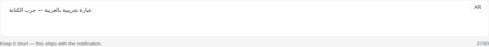

Args:

```json
{
  "value": "{\"en\": \"Sample English phrase — try typing.\", \"ar\": \"عبارة تجريبية بالعربية — جرب الكتابة.\"}",
  "type": "textarea",
  "placeholder": "Enter your text here...",
  "size": "md",
  "required": false,
  "disabled": false,
  "hasError": false,
  "language": "ar",
  "languages": {
    "feature": true,
    "supported": [],
    "current": {
      "id": 0,
      "label": "English",
      "value": "en"
    }
  },
  "noBorder": false,
  "startSlot": "hgi-stroke hgi-language-square",
  "max": 80,
  "showCount": true,
  "desc": "Keep it short — this ships with the notification."
}
```

<details><summary>Rendered markup</summary>

```html
<s-lingual-field name="undefined" value="{&quot;en&quot;: &quot;Sample English phrase — try typing.&quot;, &quot;ar&quot;: &quot;عبارة تجريبية بالعربية — جرب الكتابة.&quot;}" type="textarea" placeholder="Enter your text here..." size="md" language="ar" max="80" show-count="" desc="Keep it short — this ships with the notification." start-slot="hgi-stroke hgi-language-square" languages="{&quot;feature&quot;:true,&quot;supported&quot;:[],&quot;current&quot;:{&quot;id&quot;:0,&quot;label&quot;:&quot;English&quot;,&quot;value&quot;:&quot;en&quot;}}" dir="rtl" class="s-lingual-field s-lingual-field--textarea rtl w-full relative flex items-start justify-start gap-4 hydrated"><!----><s-textarea type="textarea" class="flex-1 md rtl multilingual ltr hydrated" size="md" dir="rtl" maxlength="80" value="عبارة تجريبية بالعربية — جرب الكتابة."><s-icon slot="start" class="hydrated"></s-icon><div slot="end" class="s-lingual-field__actions-end s-lingual-field__actions-end--hidden" data-lingual-field-internal-slot=""><div class="s-lingual-field__actions-end__reserve s-lingual-field__actions-end--hidden" aria-hidden="true">
    
  </div></div></s-textarea><s-dropdown dir="ltr" class="h-fit end ltr hydrated" overlay-alignment="start"><s-button data-toggle="true" slot="dropdown-head" class="s-btn s-btn--white default sm outlined ltr hydrated" theme="white" target="_self">AR<s-icon class="hydrated"></s-icon></s-button></s-dropdown></s-lingual-field>
```

</details>

### With Character Counter Only

Story id `components-lingualfield--with-character-counter-only`

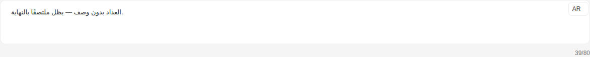

Args:

```json
{
  "value": "{\"en\": \"Counter without desc — should stay pinned to the end.\", \"ar\": \"العداد بدون وصف — يظل ملتصقًا بالنهاية.\"}",
  "type": "textarea",
  "placeholder": "Enter your text here...",
  "size": "md",
  "required": false,
  "disabled": false,
  "hasError": false,
  "language": "ar",
  "languages": {
    "feature": true,
    "supported": [],
    "current": {
      "id": 0,
      "label": "English",
      "value": "en"
    }
  },
  "noBorder": false,
  "startSlot": "hgi-stroke hgi-language-square",
  "max": 80,
  "showCount": true
}
```

<details><summary>Rendered markup</summary>

```html
<s-lingual-field name="undefined" value="{&quot;en&quot;: &quot;Counter without desc — should stay pinned to the end.&quot;, &quot;ar&quot;: &quot;العداد بدون وصف — يظل ملتصقًا بالنهاية.&quot;}" type="textarea" placeholder="Enter your text here..." size="md" language="ar" max="80" show-count="" start-slot="hgi-stroke hgi-language-square" languages="{&quot;feature&quot;:true,&quot;supported&quot;:[],&quot;current&quot;:{&quot;id&quot;:0,&quot;label&quot;:&quot;English&quot;,&quot;value&quot;:&quot;en&quot;}}" dir="rtl" class="s-lingual-field s-lingual-field--textarea rtl w-full relative flex items-start justify-start gap-4 hydrated"><!----><s-textarea type="textarea" class="flex-1 md rtl multilingual ltr hydrated" size="md" dir="rtl" maxlength="80" value="العداد بدون وصف — يظل ملتصقًا بالنهاية."><s-icon slot="start" class="hydrated"></s-icon><div slot="end" class="s-lingual-field__actions-end s-lingual-field__actions-end--hidden" data-lingual-field-internal-slot=""><div class="s-lingual-field__actions-end__reserve s-lingual-field__actions-end--hidden" aria-hidden="true">
    
  </div></div></s-textarea><s-dropdown dir="ltr" class="h-fit end ltr hydrated" overlay-alignment="start"><s-button data-toggle="true" slot="dropdown-head" class="s-btn s-btn--white default sm outlined ltr hydrated" theme="white" target="_self">AR<s-icon class="hydrated"></s-icon></s-button></s-dropdown></s-lingual-field>
```

</details>

### With Character Counter Rich Text

Story id `components-lingualfield--with-character-counter-rich-text`

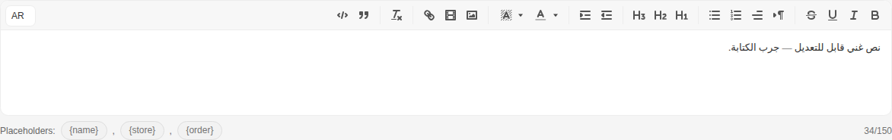

Args:

```json
{
  "value": "{\"en\": \"<p>Editable rich text — try typing.</p>\", \"ar\": \"<p>نص غني قابل للتعديل — جرب الكتابة.</p>\"}",
  "type": "richText",
  "placeholder": "Enter your text here...",
  "size": "md",
  "required": false,
  "disabled": false,
  "hasError": false,
  "language": "ar",
  "languages": {
    "feature": true,
    "supported": [],
    "current": {
      "id": 0,
      "label": "English",
      "value": "en"
    }
  },
  "noBorder": false,
  "startSlot": "hgi-stroke hgi-language-square",
  "max": 150,
  "showCount": true,
  "desc": "Placeholders: {name}, {store}, {order}"
}
```

<details><summary>Rendered markup</summary>

```html
<s-lingual-field name="undefined" value="{&quot;en&quot;: &quot;&lt;p&gt;Editable rich text — try typing.&lt;/p&gt;&quot;, &quot;ar&quot;: &quot;&lt;p&gt;نص غني قابل للتعديل — جرب الكتابة.&lt;/p&gt;&quot;}" type="richText" placeholder="Enter your text here..." size="md" language="ar" max="150" show-count="" desc="Placeholders: {name}, {store}, {order}" start-slot="hgi-stroke hgi-language-square" languages="{&quot;feature&quot;:true,&quot;supported&quot;:[],&quot;current&quot;:{&quot;id&quot;:0,&quot;label&quot;:&quot;English&quot;,&quot;value&quot;:&quot;en&quot;}}" dir="rtl" class="s-lingual-field s-lingual-field--richText rtl w-full relative flex items-start justify-start gap-4 hydrated"><!----><div class="s-lingual-field__editor-wrap" dir="rtl"><s-editor type="richText" class="flex-1 md rtl s-editor multilingual hydrated" size="md" dir="rtl" maxlength="150"><!----><div class="s-editor__wrapper"><s-editor-toolbar class="hydrated"><div id="toolbar" class="s-editor__toolbar ql-toolbar ql-snow" role="toolbar" aria-label="Editor toolbar"><span class="ql-formats" role="group" aria-label="Formatting options group"><button type="button" class="ql-bold" title="Bold" aria-label="Bold" aria-pressed="false"><svg viewBox="0 0 18 18"><path class="ql-stroke" d="M5,4H9.5A2.5,2.5,0,0,1,12,6.5v0A2.5,2.5,0,0,1,9.5,9H5A0,0,0,0,1,5,9V4A0,0,0,0,1,5,4Z"></path><path class="ql-stroke" d="M5,9h5.5A2.5,2.5,0,0,1,13,11.5v0A2.5,2.5,0,0,1,10.5,14H5a0,0,0,0,1,0,0V9A0,0,0,0,1,5,9Z"></path></svg></button><button type="button" class="ql-italic" title="Italic" aria-label="Italic" aria-pressed="false"><svg viewBox="0 0 18 18"><line class="ql-stroke" x1="7" x2="13" y1="4" y2="4"></line><line class="ql-stroke" x1="5" x2="11" y1="14" y2="14"></line><line class="ql-stroke" x1="8" x2="10" y1="14" y2="4"></line></svg></button><button type="button" class="ql-underline" title="Underline" aria-label="Underline" aria-pressed="false"><svg viewBox="0 0 18 18"><path class="ql-stroke" d="M5,3V9a4.012,4.012,0,0,0,4,4H9a4.012,4.012,0,0,0,4-4V3"></path><rect class="ql-fill" height="1" rx="0.5" ry="0.5" width="12" x="3" y="15"></rect></svg></button><button type="button" class="ql-strike" title="Strikethrough" aria-label="Strikethrough" aria-pressed="false"><svg viewBox="0 0 18 18"><line class="ql-stroke ql-thin" x1="15.5" x2="2.5" y1="8.5" y2="9.5"></line><path class="ql-fill" d="M9.007,8C6.542,7.791,6,7.519,6,6.5,6,5.792,7.283,5,9,5c1.571,0,2.765.679,2.969,1.309a1,1,0,0,0,1.9-.617C13.356,4.106,11.354,3,9,3,6.2,3,4,4.538,4,6.5a3.2,3.2,0,0,0,.5,1.843Z"></path><path class="ql-fill" d="M8.984,10C11.457,10.208,12,10.479,12,11.5c0,0.708-1.283,1.5-3,1.5-1.571,0-2.765-.679-2.969-1.309a1,1,0,1,0-1.9.617C4.644,13.894,6.646,15,9,15c2.8,0,5-1.538,5-3.5a3.2,3.2,0,0,0-.5-1.843Z"></path></svg></button></span><span class="ql-formats" role="group" aria-label="Formatting options group"><button type="button" class="ql-direction" value="rtl" title="Format direction: rtl" aria-label="Format direction: rtl" aria-pressed="false"><svg viewBox="0 0 18 18"><polygon class="ql-stroke ql-fill" points="3 11 5 9 3 7 3 11"></polygon><line class="ql-stroke ql-fill" x1="15" x2="11" y1="4" y2="4"></line><path class="ql-fill" d="M11,3a3,3,0,0,0,0,6h1V3H11Z"></path><rect class="ql-fill" height="11" width="1" x="11" y="4"></rect><rect class="ql-fill" height="11" width="1" x="13" y="4"></rect></svg><svg viewBox="0 0 18 18"><polygon class="ql-stroke ql-fill" points="15 12 13 10 15 8 15 12"></polygon><line class="ql-stroke ql-fill" x1="9" x2="5" y1="4" y2="4"></line><path class="ql-fill" d="M5,3A3,3,0,0,0,5,9H6V3H5Z"></path><rect class="ql-fill" height="11" width="1" x="5" y="4"></rect><rect class="ql-fill" height="11" width="1" x="7" y="4"></rect></svg></button><span class="ql-align ql-picker ql-icon-picker" title="Text alignment" aria-label="Text alignment"><span class="ql-picker-label" tabindex="0" role="button" aria-expanded="false" aria-controls="ql-picker-options-0" data-value="start" data-label="Align to the leading edge"><svg viewBox="0 0 18 18"><line class="ql-stroke" x1="3" x2="15" y1="9" y2="9"></line><line class="ql-stroke" x1="3" x2="13" y1="14" y2="14"></line><line class="ql-stroke" x1="3" x2="9" y1="4" y2="4"></line></svg></span><span class="ql-picker-options" aria-hidden="true" tabindex="-1" id="ql-picker-options-0"><span tabindex="0" role="button" class="ql-picker-item" data-value="start" data-label="Align to the leading edge"><svg viewBox="0 0 18 18"><line class="ql-stroke" x1="3" x2="15" y1="9" y2="9"></line><line class="ql-stroke" x1="3" x2="13" y1="14" y2="14"></line><line class="ql-stroke" x1="3" x2="9" y1="4" y2="4"></line></svg></span><span tabindex="0" role="button" class="ql-picker-item" data-value="center" data-label="Center"><svg viewBox="0 0 18 18"><line class="ql-stroke" x1="15" x2="3" y1="9" y2="9"></line><line class="ql-stroke" x1="14" x2="4" y1="14" y2="14"></line><line class="ql-stroke" x1="12" x2="6" y1="4" y2="4"></line></svg></span><span tabindex="0" role="button" class="ql-picker-item" data-value="end" data-label="Align to the trailing edge"><svg viewBox="0 0 18 18"><line class="ql-stroke" x1="15" x2="3" y1="9" y2="9"></line><line class="ql-stroke" x1="15" x2="5" y1="14" y2="14"></line><line class="ql-stroke" x1="15" x2="9" y1="4" y2="4"></line></svg></span><span tabindex="0" role="button" class="ql-picker-item" data-value="justify" data-label="Justify"><svg viewBox="0 0 18 18"><line class="ql-stroke" x1="15" x2="3" y1="9" y2="9"></line><line class="ql-stroke" x1="15" x2="3" y1="14" y2="14"></line><line class="ql-stroke" x1="15" x2="3" y1="4" y2="4"></line></svg></span></span></span><select class="ql-align" title="Text alignment" aria-label="Text alignment" style="display: none;"><option value="start" aria-label="Align to the leading edge">Align to the leading edge</option><option value="center" aria-label="Center">Center</option><option value="end" aria-label="Align to the trailing edge">Align to the trailing edge</option><option value="justify" aria-label="Justify">Justify</option></select><button type="button" class="ql-list" value="ordered" title="Format list: ordered" aria-label="Format list: ordered" aria-pressed="false"><svg viewBox="0 0 18 18"><line class="ql-stroke" x1="7" x2="15" y1="4" y2="4"></line><line class="ql-stroke" x1="7" x2="15" y1="9" y2="9"></line><line class="ql-stroke" x1="7" x2="15" y1="14" y2="14"></line><line class="ql-stroke ql-thin" x1="2.5" x2="4.5" y1="5.5" y2="5.5"></line><path class="ql-fill" d="M3.5,6A0.5,0.5,0,0,1,3,5.5V3.085l-0.276.138A0.5,0.5,0,0,1,2.053,3c-0.124-.247-0.023-0.324.224-0.447l1-.5A0.5,0.5,0,0,1,4,2.5v3A0.5,0.5,0,0,1,3.5,6Z"></path><path class="ql-stroke ql-thin" d="M4.5,10.5h-2c0-.234,1.85-1.076,1.85-2.234A0.959,0.959,0,0,0,2.5,8.156"></path><path class="ql-stroke ql-thin" d="M2.5,14.846a0.959,0.959,0,0,0,1.85-.109A0.7,0.7,0,0,0,3.75,14a0.688,0.688,0,0,0,.6-0.736,0.959,0.959,0,0,0-1.85-.109"></path></svg></button><button type="button" class="ql-list" value="bullet" title="Format list: bullet" aria-label="Format list: bullet" aria-pressed="false"><svg viewBox="0 0 18 18"><line class="ql-stroke" x1="6" x2="15" y1="4" y2="4"></line><line class="ql-stroke" x1="6" x2="15" y1="9" y2="9"></line><line class="ql-stroke" x1="6" x2="15" y1="14" y2="14"></line><line class="ql-stroke" x1="3" x2="3" y1="4" y2="4"></line><line class="ql-stroke" x1="3" x2="3" y1="9" y2="9"></line><line class="ql-stroke" x1="3" x2="3" y1="14" y2="14"></line></svg></button></span><span class="ql-formats" role="group" aria-label="Formatting options group"><button type="button" class="ql-header" value="1" title="Format header: 1" aria-label="Format header: 1" aria-pressed="false"><svg viewBox="0 0 18 18"><path class="ql-fill" d="M10,4V14a1,1,0,0,1-2,0V10H3v4a1,1,0,0,1-2,0V4A1,1,0,0,1,3,4V8H8V4a1,1,0,0,1,2,0Zm6.06787,9.209H14.98975V7.59863a.54085.54085,0,0,0-.605-.60547h-.62744a1.01119,1.01119,0,0,0-.748.29688L11.645,8.56641a.5435.5435,0,0,0-.022.8584l.28613.30762a.53861.53861,0,0,0,.84717.0332l.09912-.08789a1.2137,1.2137,0,0,0,.2417-.35254h.02246s-.01123.30859-.01123.60547V13.209H12.041a.54085.54085,0,0,0-.605.60547v.43945a.54085.54085,0,0,0,.605.60547h4.02686a.54085.54085,0,0,0,.605-.60547v-.43945A.54085.54085,0,0,0,16.06787,13.209Z"></path></svg></button><button type="button" class="ql-header" value="2" title="Format header: 2" aria-label="Format header: 2" aria-pressed="false"><svg viewBox="0 0 18 18"><path class="ql-fill" d="M16.73975,13.81445v.43945a.54085.54085,0,0,1-.605.60547H11.855a.58392.58392,0,0,1-.64893-.60547V14.0127c0-2.90527,3.39941-3.42187,3.39941-4.55469a.77675.77675,0,0,0-.84717-.78125,1.17684,1.17684,0,0,0-.83594.38477c-.2749.26367-.561.374-.85791.13184l-.4292-.34082c-.30811-.24219-.38525-.51758-.1543-.81445a2.97155,2.97155,0,0,1,2.45361-1.17676,2.45393,2.45393,0,0,1,2.68408,2.40918c0,2.45312-3.1792,2.92676-3.27832,3.93848h2.79443A.54085.54085,0,0,1,16.73975,13.81445ZM9,3A.99974.99974,0,0,0,8,4V8H3V4A1,1,0,0,0,1,4V14a1,1,0,0,0,2,0V10H8v4a1,1,0,0,0,2,0V4A.99974.99974,0,0,0,9,3Z"></path></svg></button><button type="button" class="ql-header" value="3" title="Format header: 3" aria-label="Format header: 3" aria-pressed="false"><svg viewBox="0 0 18 18"><path class="ql-fill" d="M16.65186,12.30664a2.6742,2.6742,0,0,1-2.915,2.68457,3.96592,3.96592,0,0,1-2.25537-.6709.56007.56007,0,0,1-.13232-.83594L11.64648,13c.209-.34082.48389-.36328.82471-.1543a2.32654,2.32654,0,0,0,1.12256.33008c.71484,0,1.12207-.35156,1.12207-.78125,0-.61523-.61621-.86816-1.46338-.86816H13.2085a.65159.65159,0,0,1-.68213-.41895l-.05518-.10937a.67114.67114,0,0,1,.14307-.78125l.71533-.86914a8.55289,8.55289,0,0,1,.68213-.7373V8.58887a3.93913,3.93913,0,0,1-.748.05469H11.9873a.54085.54085,0,0,1-.605-.60547V7.59863a.54085.54085,0,0,1,.605-.60547h3.75146a.53773.53773,0,0,1,.60547.59375v.17676a1.03723,1.03723,0,0,1-.27539.748L14.74854,10.0293A2.31132,2.31132,0,0,1,16.65186,12.30664ZM9,3A.99974.99974,0,0,0,8,4V8H3V4A1,1,0,0,0,1,4V14a1,1,0,0,0,2,0V10H8v4a1,1,0,0,0,2,0V4A.99974.99974,0,0,0,9,3Z"></path></svg></button></span><span class="ql-formats" role="group" aria-label="Formatting options group"><button type="button" class="ql-indent" value="-1" title="Format indent: -1" aria-label="Format indent: -1" aria-pressed="false"><svg viewBox="0 0 18 18"><line class="ql-stroke" x1="3" x2="15" y1="14" y2="14"></line><line class="ql-stroke" x1="3" x2="15" y1="4" y2="4"></line><line class="ql-stroke" x1="9" x2="15" y1="9" y2="9"></line><polyline class="ql-stroke" points="5 7 5 11 3 9 5 7"></polyline></svg></button><button type="button" class="ql-indent" value="+1" title="Format indent: +1" aria-label="Format indent: +1" aria-pressed="false"><svg viewBox="0 0 18 18"><line class="ql-stroke" x1="3" x2="15" y1="14" y2="14"></line><line class="ql-stroke" x1="3" x2="15" y1="4" y2="4"></line><line class="ql-stroke" x1="9" x2="15" y1="9" y2="9"></line><polyline class="ql-fill ql-stroke" points="3 7 3 11 5 9 3 7"></polyline></svg></button></span><span class="ql-formats" role="group" aria-label="Formatting options group"><span class="ql-color ql-picker ql-color-picker keep-color" title="Text color" aria-label="Text color"><span class="ql-picker-label" tabindex="0" role="button" aria-expanded="false" aria-controls="ql-picker-options-1" data-value=""><svg viewBox="0 0 18 18"><line class="ql-color-label ql-stroke ql-transparent" x1="3" x2="15" y1="15" y2="15"></line><polyline class="ql-stroke" points="5.5 11 9 3 12.5 11"></polyline><line class="ql-stroke" x1="11.63" x2="6.38" y1="9" y2="9"></line></svg></span><span class="ql-picker-expand"><svg viewBox="0 0 32 32"><path fill="currentColor" d="m24 12l-8 10l-8-10z"></path></svg></span><span class="ql-picker-options" aria-hidden="true" tabindex="-1" id="ql-picker-options-1"><p tabindex="0" role="button" class="ql-picker-item blank" data-value="" data-dark="true"><span>Remove color</span></p><p tabindex="0" role="button" class="ql-picker-item" data-value="rgb(255, 255, 255)" style="--bg: rgb(255, 255, 255);"></p><p tabindex="0" role="button" class="ql-picker-item" data-value="rgb(0, 0, 0)" data-dark="true" style="--bg: rgb(0, 0, 0);"></p><p tabindex="0" role="button" class="ql-picker-item" data-value="rgb(72, 83, 104)" data-dark="true" style="--bg: rgb(72, 83, 104);"></p><p tabindex="0" role="button" class="ql-picker-item" data-value="rgb(41, 114, 244)" data-dark="true" style="--bg: rgb(41, 114, 244);"></p><p tabindex="0" role="button" class="ql-picker-item" data-value="rgb(0, 163, 245)" data-dark="true" style="--bg: rgb(0, 163, 245);"></p><p tabindex="0" role="button" class="ql-picker-item" data-value="rgb(49, 155, 98)" data-dark="true" style="--bg: rgb(49, 155, 98);"></p><p tabindex="0" role="button" class="ql-picker-item" data-value="rgb(222, 60, 54)" data-dark="true" style="--bg: rgb(222, 60, 54);"></p><p tabindex="0" role="button" class="ql-picker-item" data-value="rgb(248, 136, 37)" style="--bg: rgb(248, 136, 37);"></p><p tabindex="0" role="button" class="ql-picker-item" data-value="rgb(245, 196, 0)" style="--bg: rgb(245, 196, 0);"></p><p tabindex="0" role="button" class="ql-picker-item" data-value="rgb(153, 56, 215)" data-dark="true" style="--bg: rgb(153, 56, 215);"></p><p tabindex="0" role="button" class="ql-picker-item" data-value="rgb(242, 242, 242)" style="--bg: rgb(242, 242, 242);"></p><p tabindex="0" role="button" class="ql-picker-item" data-value="rgb(127, 127, 127)" data-dark="true" style="--bg: rgb(127, 127, 127);"></p><p tabindex="0" role="button" class="ql-picker-item" data-value="rgb(243, 245, 247)" style="--bg: rgb(243, 245, 247);"></p><p tabindex="0" role="button" class="ql-picker-item" data-value="rgb(229, 239, 255)" style="--bg: rgb(229, 239, 255);"></p><p tabindex="0" role="button" class="ql-picker-item" data-value="rgb(229, 246, 255)" style="--bg: rgb(229, 246, 255);"></p><p tabindex="0" role="button" class="ql-picker-item" data-value="rgb(234, 250, 241)" style="--bg: rgb(234, 250, 241);"></p><p tabindex="0" role="button" class="ql-picker-item" data-value="rgb(254, 233, 232)" style="--bg: rgb(254, 233, 232);"></p><p tabindex="0" role="button" class="ql-picker-item" data-value="rgb(254, 243, 235)" style="--bg: rgb(254, 243, 235);"></p><p tabindex="0" role="button" class="ql-picker-item" data-value="rgb(254, 249, 227)" style="--bg: rgb(254, 249, 227);"></p><p tabindex="0" role="button" class="ql-picker-item" data-value="rgb(253, 235, 255)" style="--bg: rgb(253, 235, 255);"></p><p tabindex="0" role="button" class="ql-picker-item" data-value="rgb(216, 216, 216)" style="--bg: rgb(216, 216, 216);"></p><p tabindex="0" role="button" class="ql-picker-item" data-value="rgb(89, 89, 89)" data-dark="true" style="--bg: rgb(89, 89, 89);"></p><p tabindex="0" role="button" class="ql-picker-item" data-value="rgb(197, 202, 211)" style="--bg: rgb(197, 202, 211);"></p><p tabindex="0" role="button" class="ql-picker-item" data-value="rgb(199, 220, 255)" style="--bg: rgb(199, 220, 255);"></p><p tabindex="0" role="button" class="ql-picker-item" data-value="rgb(199, 236, 255)" style="--bg: rgb(199, 236, 255);"></p><p tabindex="0" role="button" class="ql-picker-item" data-value="rgb(195, 234, 213)" style="--bg: rgb(195, 234, 213);"></p><p tabindex="0" role="button" class="ql-picker-item" data-value="rgb(255, 201, 199)" style="--bg: rgb(255, 201, 199);"></p><p tabindex="0" role="button" class="ql-picker-item" data-value="rgb(255, 220, 196)" style="--bg: rgb(255, 220, 196);"></p><p tabindex="0" role="button" class="ql-picker-item" data-value="rgb(255, 238, 173)" style="--bg: rgb(255, 238, 173);"></p><p tabindex="0" role="button" class="ql-picker-item" data-value="rgb(242, 199, 255)" style="--bg: rgb(242, 199, 255);"></p><p tabindex="0" role="button" class="ql-picker-item" data-value="rgb(191, 191, 191)" style="--bg: rgb(191, 191, 191);"></p><p tabindex="0" role="button" class="ql-picker-item" data-value="rgb(63, 63, 63)" data-dark="true" style="--bg: rgb(63, 63, 63);"></p><p tabindex="0" role="button" class="ql-picker-item" data-value="rgb(128, 139, 158)" style="--bg: rgb(128, 139, 158);"></p><p tabindex="0" role="button" class="ql-picker-item" data-value="rgb(153, 190, 255)" style="--bg: rgb(153, 190, 255);"></p><p tabindex="0" role="button" class="ql-picker-item" data-value="rgb(153, 221, 255)" style="--bg: rgb(153, 221, 255);"></p><p tabindex="0" role="button" class="ql-picker-item" data-value="rgb(152, 215, 182)" style="--bg: rgb(152, 215, 182);"></p><p tabindex="0" role="button" class="ql-picker-item" data-value="rgb(255, 156, 153)" style="--bg: rgb(255, 156, 153);"></p><p tabindex="0" role="button" class="ql-picker-item" data-value="rgb(255, 186, 132)" style="--bg: rgb(255, 186, 132);"></p><p tabindex="0" role="button" class="ql-picker-item" data-value="rgb(255, 226, 112)" style="--bg: rgb(255, 226, 112);"></p><p tabindex="0" role="button" class="ql-picker-item" data-value="rgb(213, 142, 255)" style="--bg: rgb(213, 142, 255);"></p><p tabindex="0" role="button" class="ql-picker-item" data-value="rgb(165, 165, 165)" style="--bg: rgb(165, 165, 165);"></p><p tabindex="0" role="button" class="ql-picker-item" data-value="rgb(38, 38, 38)" data-dark="true" style="--bg: rgb(38, 38, 38);"></p><p tabindex="0" role="button" class="ql-picker-item" data-value="rgb(53, 59, 69)" data-dark="true" style="--bg: rgb(53, 59, 69);"></p><p tabindex="0" role="button" class="ql-picker-item" data-value="rgb(20, 80, 184)" data-dark="true" style="--bg: rgb(20, 80, 184);"></p><p tabindex="0" role="button" class="ql-picker-item" data-value="rgb(18, 116, 165)" data-dark="true" style="--bg: rgb(18, 116, 165);"></p><p tabindex="0" role="button" class="ql-picker-item" data-value="rgb(39, 124, 79)" data-dark="true" style="--bg: rgb(39, 124, 79);"></p><p tabindex="0" role="button" class="ql-picker-item" data-value="rgb(158, 30, 26)" data-dark="true" style="--bg: rgb(158, 30, 26);"></p><p tabindex="0" role="button" class="ql-picker-item" data-value="rgb(184, 96, 20)" data-dark="true" style="--bg: rgb(184, 96, 20);"></p><p tabindex="0" role="button" class="ql-picker-item" data-value="rgb(163, 130, 0)" data-dark="true" style="--bg: rgb(163, 130, 0);"></p><p tabindex="0" role="button" class="ql-picker-item" data-value="rgb(94, 34, 129)" data-dark="true" style="--bg: rgb(94, 34, 129);"></p><p tabindex="0" role="button" class="ql-picker-item" data-value="rgb(147, 147, 147)" style="--bg: rgb(147, 147, 147);"></p><p tabindex="0" role="button" class="ql-picker-item" data-value="rgb(13, 13, 13)" data-dark="true" style="--bg: rgb(13, 13, 13);"></p><p tabindex="0" role="button" class="ql-picker-item" data-value="rgb(36, 39, 46)" data-dark="true" style="--bg: rgb(36, 39, 46);"></p><p tabindex="0" role="button" class="ql-picker-item" data-value="rgb(12, 48, 110)" data-dark="true" style="--bg: rgb(12, 48, 110);"></p><p tabindex="0" role="button" class="ql-picker-item" data-value="rgb(10, 65, 92)" data-dark="true" style="--bg: rgb(10, 65, 92);"></p><p tabindex="0" role="button" class="ql-picker-item" data-value="rgb(24, 78, 50)" data-dark="true" style="--bg: rgb(24, 78, 50);"></p><p tabindex="0" role="button" class="ql-picker-item" data-value="rgb(88, 17, 14)" data-dark="true" style="--bg: rgb(88, 17, 14);"></p><p tabindex="0" role="button" class="ql-picker-item" data-value="rgb(92, 48, 10)" data-dark="true" style="--bg: rgb(92, 48, 10);"></p><p tabindex="0" role="button" class="ql-picker-item" data-value="rgb(102, 82, 0)" data-dark="true" style="--bg: rgb(102, 82, 0);"></p><p tabindex="0" role="button" class="ql-picker-item" data-value="rgb(59, 21, 81)" data-dark="true" style="--bg: rgb(59, 21, 81);"></p><div class="custom ql-picker-item"><span>sdk:common.choose_color</span></div><div class="used"><div class="used-list"></div></div></span></span><select class="ql-color" title="Text color" aria-label="Text color" style="display: none;"><option value=""></option><option value="rgb(255, 255, 255)"></option><option value="rgb(0, 0, 0)"></option><option value="rgb(72, 83, 104)"></option><option value="rgb(41, 114, 244)"></option><option value="rgb(0, 163, 245)"></option><option value="rgb(49, 155, 98)"></option><option value="rgb(222, 60, 54)"></option><option value="rgb(248, 136, 37)"></option><option value="rgb(245, 196, 0)"></option><option value="rgb(153, 56, 215)"></option><option value="rgb(242, 242, 242)"></option><option value="rgb(127, 127, 127)"></option><option value="rgb(243, 245, 247)"></option><option value="rgb(229, 239, 255)"></option><option value="rgb(229, 246, 255)"></option><option value="rgb(234, 250, 241)"></option><option value="rgb(254, 233, 232)"></option><option value="rgb(254, 243, 235)"></option><option value="rgb(254, 249, 227)"></option><option value="rgb(253, 235, 255)"></option><option value="rgb(216, 216, 216)"></option><option value="rgb(89, 89, 89)"></option><option value="rgb(197, 202, 211)"></option><option value="rgb(199, 220, 255)"></option><option value="rgb(199, 236, 255)"></option><option value="rgb(195, 234, 213)"></option><option value="rgb(255, 201, 199)"></option><option value="rgb(255, 220, 196)"></option><option value="rgb(255, 238, 173)"></option><option value="rgb(242, 199, 255)"></option><option value="rgb(191, 191, 191)"></option><option value="rgb(63, 63, 63)"></option><option value="rgb(128, 139, 158)"></option><option value="rgb(153, 190, 255)"></option><option value="rgb(153, 221, 255)"></option><option value="rgb(152, 215, 182)"></option><option value="rgb(255, 156, 153)"></option><option value="rgb(255, 186, 132)"></option><option value="rgb(255, 226, 112)"></option><option value="rgb(213, 142, 255)"></option><option value="rgb(165, 165, 165)"></option><option value="rgb(38, 38, 38)"></option><option value="rgb(53, 59, 69)"></option><option value="rgb(20, 80, 184)"></option><option value="rgb(18, 116, 165)"></option><option value="rgb(39, 124, 79)"></option><option value="rgb(158, 30, 26)"></option><option value="rgb(184, 96, 20)"></option><option value="rgb(163, 130, 0)"></option><option value="rgb(94, 34, 129)"></option><option value="rgb(147, 147, 147)"></option><option value="rgb(13, 13, 13)"></option><option value="rgb(36, 39, 46)"></option><option value="rgb(12, 48, 110)"></option><option value="rgb(10, 65, 92)"></option><option value="rgb(24, 78, 50)"></option><option value="rgb(88, 17, 14)"></option><option value="rgb(92, 48, 10)"></option><option value="rgb(102, 82, 0)"></option><option value="rgb(59, 21, 81)"></option><option value="custom"></option></select><span class="ql-background ql-picker ql-color-picker keep-color" title="Background color" aria-label="Background color"><span class="ql-picker-label" tabindex="0" role="button" aria-expanded="false" aria-controls="ql-picker-options-2" data-value=""><svg viewBox="0 0 18 18"><g class="ql-fill ql-color-label"><polygon points="6 6.868 6 6 5 6 5 7 5.942 7 6 6.868"></polygon><rect height="1" width="1" x="4" y="4"></rect><polygon points="6.817 5 6 5 6 6 6.38 6 6.817 5"></polygon><rect height="1" width="1" x="2" y="6"></rect><rect height="1" width="1" x="3" y="5"></rect><rect height="1" width="1" x="4" y="7"></rect><polygon points="4 11.439 4 11 3 11 3 12 3.755 12 4 11.439"></polygon><rect height="1" width="1" x="2" y="12"></rect><rect height="1" width="1" x="2" y="9"></rect><rect height="1" width="1" x="2" y="15"></rect><polygon points="4.63 10 4 10 4 11 4.192 11 4.63 10"></polygon><rect height="1" width="1" x="3" y="8"></rect><path d="M10.832,4.2L11,4.582V4H10.708A1.948,1.948,0,0,1,10.832,4.2Z"></path><path d="M7,4.582L7.168,4.2A1.929,1.929,0,0,1,7.292,4H7V4.582Z"></path><path d="M8,13H7.683l-0.351.8a1.933,1.933,0,0,1-.124.2H8V13Z"></path><rect height="1" width="1" x="12" y="2"></rect><rect height="1" width="1" x="11" y="3"></rect><path d="M9,3H8V3.282A1.985,1.985,0,0,1,9,3Z"></path><rect height="1" width="1" x="2" y="3"></rect><rect height="1" width="1" x="6" y="2"></rect><rect height="1" width="1" x="3" y="2"></rect><rect height="1" width="1" x="5" y="3"></rect><rect height="1" width="1" x="9" y="2"></rect><rect height="1" width="1" x="15" y="14"></rect><polygon points="13.447 10.174 13.469 10.225 13.472 10.232 13.808 11 14 11 14 10 13.37 10 13.447 10.174"></polygon><rect height="1" width="1" x="13" y="7"></rect><rect height="1" width="1" x="15" y="5"></rect><rect height="1" width="1" x="14" y="6"></rect><rect height="1" width="1" x="15" y="8"></rect><rect height="1" width="1" x="14" y="9"></rect><path d="M3.775,14H3v1H4V14.314A1.97,1.97,0,0,1,3.775,14Z"></path><rect height="1" width="1" x="14" y="3"></rect><polygon points="12 6.868 12 6 11.62 6 12 6.868"></polygon><rect height="1" width="1" x="15" y="2"></rect><rect height="1" width="1" x="12" y="5"></rect><rect height="1" width="1" x="13" y="4"></rect><polygon points="12.933 9 13 9 13 8 12.495 8 12.933 9"></polygon><rect height="1" width="1" x="9" y="14"></rect><rect height="1" width="1" x="8" y="15"></rect><path d="M6,14.926V15H7V14.316A1.993,1.993,0,0,1,6,14.926Z"></path><rect height="1" width="1" x="5" y="15"></rect><path d="M10.668,13.8L10.317,13H10v1h0.792A1.947,1.947,0,0,1,10.668,13.8Z"></path><rect height="1" width="1" x="11" y="15"></rect><path d="M14.332,12.2a1.99,1.99,0,0,1,.166.8H15V12H14.245Z"></path><rect height="1" width="1" x="14" y="15"></rect><rect height="1" width="1" x="15" y="11"></rect></g><polyline class="ql-stroke" points="5.5 13 9 5 12.5 13"></polyline><line class="ql-stroke" x1="11.63" x2="6.38" y1="11" y2="11"></line></svg></span><span class="ql-picker-expand"><svg viewBox="0 0 32 32"><path fill="currentColor" d="m24 12l-8 10l-8-10z"></path></svg></span><span class="ql-picker-options" aria-hidden="true" tabindex="-1" id="ql-picker-options-2"><p tabindex="0" role="button" class="ql-picker-item blank" data-value="" data-dark="true"><span>Remove color</span></p><p tabindex="0" role="button" class="ql-picker-item" data-value="rgb(255, 255, 255)" style="--bg: rgb(255, 255, 255);"></p><p tabindex="0" role="button" class="ql-picker-item" data-value="rgb(0, 0, 0)" data-dark="true" style="--bg: rgb(0, 0, 0);"></p><p tabindex="0" role="button" class="ql-picker-item" data-value="rgb(72, 83, 104)" data-dark="true" style="--bg: rgb(72, 83, 104);"></p><p tabindex="0" role="button" class="ql-picker-item" data-value="rgb(41, 114, 244)" data-dark="true" style="--bg: rgb(41, 114, 244);"></p><p tabindex="0" role="button" class="ql-picker-item" data-value="rgb(0, 163, 245)" data-dark="true" style="--bg: rgb(0, 163, 245);"></p><p tabindex="0" role="button" class="ql-picker-item" data-value="rgb(49, 155, 98)" data-dark="true" style="--bg: rgb(49, 155, 98);"></p><p tabindex="0" role="button" class="ql-picker-item" data-value="rgb(222, 60, 54)" data-dark="true" style="--bg: rgb(222, 60, 54);"></p><p tabindex="0" role="button" class="ql-picker-item" data-value="rgb(248, 136, 37)" style="--bg: rgb(248, 136, 37);"></p><p tabindex="0" role="button" class="ql-picker-item" data-value="rgb(245, 196, 0)" style="--bg: rgb(245, 196, 0);"></p><p tabindex="0" role="button" class="ql-picker-item" data-value="rgb(153, 56, 215)" data-dark="true" style="--bg: rgb(153, 56, 215);"></p><p tabindex="0" role="button" class="ql-picker-item" data-value="rgb(242, 242, 242)" style="--bg: rgb(242, 242, 242);"></p><p tabindex="0" role="button" class="ql-picker-item" data-value="rgb(127, 127, 127)" data-dark="true" style="--bg: rgb(127, 127, 127);"></p><p tabindex="0" role="button" class="ql-picker-item" data-value="rgb(243, 245, 247)" style="--bg: rgb(243, 245, 247);"></p><p tabindex="0" role="button" class="ql-picker-item" data-value="rgb(229, 239, 255)" style="--bg: rgb(229, 239, 255);"></p><p tabindex="0" role="button" class="ql-picker-item" data-value="rgb(229, 246, 255)" style="--bg: rgb(229, 246, 255);"></p><p tabindex="0" role="button" class="ql-picker-item" data-value="rgb(234, 250, 241)" style="--bg: rgb(234, 250, 241);"></p><p tabindex="0" role="button" class="ql-picker-item" data-value="rgb(254, 233, 232)" style="--bg: rgb(254, 233, 232);"></p><p tabindex="0" role="button" class="ql-picker-item" data-value="rgb(254, 243, 235)" style="--bg: rgb(254, 243, 235);"></p><p tabindex="0" role="button" class="ql-picker-item" data-value="rgb(254, 249, 227)" style="--bg: rgb(254, 249, 227);"></p><p tabindex="0" role="button" class="ql-picker-item" data-value="rgb(253, 235, 255)" style="--bg: rgb(253, 235, 255);"></p><p tabindex="0" role="button" class="ql-picker-item" data-value="rgb(216, 216, 216)" style="--bg: rgb(216, 216, 216);"></p><p tabindex="0" role="button" class="ql-picker-item" data-value="rgb(89, 89, 89)" data-dark="true" style="--bg: rgb(89, 89, 89);"></p><p tabindex="0" role="button" class="ql-picker-item" data-value="rgb(197, 202, 211)" style="--bg: rgb(197, 202, 211);"></p><p tabindex="0" role="button" class="ql-picker-item" data-value="rgb(199, 220, 255)" style="--bg: rgb(199, 220, 255);"></p><p tabindex="0" role="button" class="ql-picker-item" data-value="rgb(199, 236, 255)" style="--bg: rgb(199, 236, 255);"></p><p tabindex="0" role="button" class="ql-picker-item" data-value="rgb(195, 234, 213)" style="--bg: rgb(195, 234, 213);"></p><p tabindex="0" role="button" class="ql-picker-item" data-value="rgb(255, 201, 199)" style="--bg: rgb(255, 201, 199);"></p><p tabindex="0" role="button" class="ql-picker-item" data-value="rgb(255, 220, 196)" style="--bg: rgb(255, 220, 196);"></p><p tabindex="0" role="button" class="ql-picker-item" data-value="rgb(255, 238, 173)" style="--bg: rgb(255, 238, 173);"></p><p tabindex="0" role="button" class="ql-picker-item" data-value="rgb(242, 199, 255)" style="--bg: rgb(242, 199, 255);"></p><p tabindex="0" role="button" class="ql-picker-item" data-value="rgb(191, 191, 191)" style="--bg: rgb(191, 191, 191);"></p><p tabindex="0" role="button" class="ql-picker-item" data-value="rgb(63, 63, 63)" data-dark="true" style="--bg: rgb(63, 63, 63);"></p><p tabindex="0" role="button" class="ql-picker-item" data-value="rgb(128, 139, 158)" style="--bg: rgb(128, 139, 158);"></p><p tabindex="0" role="button" class="ql-picker-item" data-value="rgb(153, 190, 255)" style="--bg: rgb(153, 190, 255);"></p><p tabindex="0" role="button" class="ql-picker-item" data-value="rgb(153, 221, 255)" style="--bg: rgb(153, 221, 255);"></p><p tabindex="0" role="button" class="ql-picker-item" data-value="rgb(152, 215, 182)" style="--bg: rgb(152, 215, 182);"></p><p tabindex="0" role="button" class="ql-picker-item" data-value="rgb(255, 156, 153)" style="--bg: rgb(255, 156, 153);"></p><p tabindex="0" role="button" class="ql-picker-item" data-value="rgb(255, 186, 132)" style="--bg: rgb(255, 186, 132);"></p><p tabindex="0" role="button" class="ql-picker-item" data-value="rgb(255, 226, 112)" style="--bg: rgb(255, 226, 112);"></p><p tabindex="0" role="button" class="ql-picker-item" data-value="rgb(213, 142, 255)" style="--bg: rgb(213, 142, 255);"></p><p tabindex="0" role="button" class="ql-picker-item" data-value="rgb(165, 165, 165)" style="--bg: rgb(165, 165, 165);"></p><p tabindex="0" role="button" class="ql-picker-item" data-value="rgb(38, 38, 38)" data-dark="true" style="--bg: rgb(38, 38, 38);"></p><p tabindex="0" role="button" class="ql-picker-item" data-value="rgb(53, 59, 69)" data-dark="true" style="--bg: rgb(53, 59, 69);"></p><p tabindex="0" role="button" class="ql-picker-item" data-value="rgb(20, 80, 184)" data-dark="true" style="--bg: rgb(20, 80, 184);"></p><p tabindex="0" role="button" class="ql-picker-item" data-value="rgb(18, 116, 165)" data-dark="true" style="--bg: rgb(18, 116, 165);"></p><p tabindex="0" role="button" class="ql-picker-item" data-value="rgb(39, 124, 79)" data-dark="true" style="--bg: rgb(39, 124, 79);"></p><p tabindex="0" role="button" class="ql-picker-item" data-value="rgb(158, 30, 26)" data-dark="true" style="--bg: rgb(158, 30, 26);"></p><p tabindex="0" role="button" class="ql-picker-item" data-value="rgb(184, 96, 20)" data-dark="true" style="--bg: rgb(184, 96, 20);"></p><p tabindex="0" role="button" class="ql-picker-item" data-value="rgb(163, 130, 0)" data-dark="true" style="--bg: rgb(163, 130, 0);"></p><p tabindex="0" role="button" class="ql-picker-item" data-value="rgb(94, 34, 129)" data-dark="true" style="--bg: rgb(94, 34, 129);"></p><p tabindex="0" role="button" class="ql-picker-item" data-value="rgb(147, 147, 147)" style="--bg: rgb(147, 147, 147);"></p><p tabindex="0" role="button" class="ql-picker-item" data-value="rgb(13, 13, 13)" data-dark="true" style="--bg: rgb(13, 13, 13);"></p><p tabindex="0" role="button" class="ql-picker-item" data-value="rgb(36, 39, 46)" data-dark="true" style="--bg: rgb(36, 39, 46);"></p><p tabindex="0" role="button" class="ql-picker-item" data-value="rgb(12, 48, 110)" data-dark="true" style="--bg: rgb(12, 48, 110);"></p><p tabindex="0" role="button" class="ql-picker-item" data-value="rgb(10, 65, 92)" data-dark="true" style="--bg: rgb(10, 65, 92);"></p><p tabindex="0" role="button" class="ql-picker-item" data-value="rgb(24, 78, 50)" data-dark="true" style="--bg: rgb(24, 78, 50);"></p><p tabindex="0" role="button" class="ql-picker-item" data-value="rgb(88, 17, 14)" data-dark="true" style="--bg: rgb(88, 17, 14);"></p><p tabindex="0" role="button" class="ql-picker-item" data-value="rgb(92, 48, 10)" data-dark="true" style="--bg: rgb(92, 48, 10);"></p><p tabindex="0" role="button" class="ql-picker-item" data-value="rgb(102, 82, 0)" data-dark="true" style="--bg: rgb(102, 82, 0);"></p><p tabindex="0" role="button" class="ql-picker-item" data-value="rgb(59, 21, 81)" data-dark="true" style="--bg: rgb(59, 21, 81);"></p><div class="custom ql-picker-item"><span>sdk:common.choose_color</span></div><div class="used"><div class="used-list"></div></div></span></span><select class="ql-background" title="Background color" aria-label="Background color" style="display: none;"><option value=""></option><option value="rgb(255, 255, 255)"></option><option value="rgb(0, 0, 0)"></option><option value="rgb(72, 83, 104)"></option><option value="rgb(41, 114, 244)"></option><option value="rgb(0, 163, 245)"></option><option value="rgb(49, 155, 98)"></option><option value="rgb(222, 60, 54)"></option><option value="rgb(248, 136, 37)"></option><option value="rgb(245, 196, 0)"></option><option value="rgb(153, 56, 215)"></option><option value="rgb(242, 242, 242)"></option><option value="rgb(127, 127, 127)"></option><option value="rgb(243, 245, 247)"></option><option value="rgb(229, 239, 255)"></option><option value="rgb(229, 246, 255)"></option><option value="rgb(234, 250, 241)"></option><option value="rgb(254, 233, 232)"></option><option value="rgb(254, 243, 235)"></option><option value="rgb(254, 249, 227)"></option><option value="rgb(253, 235, 255)"></option><option value="rgb(216, 216, 216)"></option><option value="rgb(89, 89, 89)"></option><option value="rgb(197, 202, 211)"></option><option value="rgb(199, 220, 255)"></option><option value="rgb(199, 236, 255)"></option><option value="rgb(195, 234, 213)"></option><option value="rgb(255, 201, 199)"></option><option value="rgb(255, 220, 196)"></option><option value="rgb(255, 238, 173)"></option><option value="rgb(242, 199, 255)"></option><option value="rgb(191, 191, 191)"></option><option value="rgb(63, 63, 63)"></option><option value="rgb(128, 139, 158)"></option><option value="rgb(153, 190, 255)"></option><option value="rgb(153, 221, 255)"></option><option value="rgb(152, 215, 182)"></option><option value="rgb(255, 156, 153)"></option><option value="rgb(255, 186, 132)"></option><option value="rgb(255, 226, 112)"></option><option value="rgb(213, 142, 255)"></option><option value="rgb(165, 165, 165)"></option><option value="rgb(38, 38, 38)"></option><option value="rgb(53, 59, 69)"></option><option value="rgb(20, 80, 184)"></option><option value="rgb(18, 116, 165)"></option><option value="rgb(39, 124, 79)"></option><option value="rgb(158, 30, 26)"></option><option value="rgb(184, 96, 20)"></option><option value="rgb(163, 130, 0)"></option><option value="rgb(94, 34, 129)"></option><option value="rgb(147, 147, 147)"></option><option value="rgb(13, 13, 13)"></option><option value="rgb(36, 39, 46)"></option><option value="rgb(12, 48, 110)"></option><option value="rgb(10, 65, 92)"></option><option value="rgb(24, 78, 50)"></option><option value="rgb(88, 17, 14)"></option><option value="rgb(92, 48, 10)"></option><option value="rgb(102, 82, 0)"></option><option value="rgb(59, 21, 81)"></option><option value="custom"></option></select></span><span class="ql-formats" role="group" aria-label="Formatting options group"><button type="button" class="ql-image" title="Insert image" aria-label="Insert image" aria-pressed="false"><svg viewBox="0 0 18 18"><rect class="ql-stroke" height="10" width="12" x="3" y="4"></rect><circle class="ql-fill" cx="6" cy="7" r="1"></circle><polyline class="ql-even ql-fill" points="5 12 5 11 7 9 8 10 11 7 13 9 13 12 5 12"></polyline></svg></button><button type="button" class="ql-video" title="Insert video" aria-label="Insert video" aria-pressed="false"><svg viewBox="0 0 18 18"><rect class="ql-stroke" height="12" width="12" x="3" y="3"></rect><rect class="ql-fill" height="12" width="1" x="5" y="3"></rect><rect class="ql-fill" height="12" width="1" x="12" y="3"></rect><rect class="ql-fill" height="2" width="8" x="5" y="8"></rect><rect class="ql-fill" height="1" width="3" x="3" y="5"></rect><rect class="ql-fill" height="1" width="3" x="3" y="7"></rect><rect class="ql-fill" height="1" width="3" x="3" y="10"></rect><rect class="ql-fill" height="1" width="3" x="3" y="12"></rect><rect class="ql-fill" height="1" width="3" x="12" y="5"></rect><rect class="ql-fill" height="1" width="3" x="12" y="7"></rect><rect class="ql-fill" height="1" width="3" x="12" y="10"></rect><rect class="ql-fill" height="1" width="3" x="12" y="12"></rect></svg></button><button type="button" class="ql-link" title="Insert link" aria-label="Insert link" aria-pressed="false"><svg viewBox="0 0 18 18"><line class="ql-stroke" x1="7" x2="11" y1="7" y2="11"></line><path class="ql-even ql-stroke" d="M8.9,4.577a3.476,3.476,0,0,1,.36,4.679A3.476,3.476,0,0,1,4.577,8.9C3.185,7.5,2.035,6.4,4.217,4.217S7.5,3.185,8.9,4.577Z"></path><path class="ql-even ql-stroke" d="M13.423,9.1a3.476,3.476,0,0,0-4.679-.36,3.476,3.476,0,0,0,.36,4.679c1.392,1.392,2.5,2.542,4.679.36S14.815,10.5,13.423,9.1Z"></path></svg></button></span><span class="ql-formats" role="group" aria-label="Formatting options group"><button type="button" class="ql-clean" title="Clear formatting" aria-label="Clear formatting" aria-pressed="false"><svg class="" viewBox="0 0 18 18"><line class="ql-stroke" x1="5" x2="13" y1="3" y2="3"></line><line class="ql-stroke" x1="6" x2="9.35" y1="12" y2="3"></line><line class="ql-stroke" x1="11" x2="15" y1="11" y2="15"></line><line class="ql-stroke" x1="15" x2="11" y1="11" y2="15"></line><rect class="ql-fill" height="1" rx="0.5" ry="0.5" width="7" x="2" y="14"></rect></svg></button></span><span class="ql-formats" role="group" aria-label="Formatting options group"><button type="button" class="ql-blockquote" title="Block quote" aria-label="Block quote" aria-pressed="false"><svg viewBox="0 0 18 18"><rect class="ql-fill ql-stroke" height="3" width="3" x="4" y="5"></rect><rect class="ql-fill ql-stroke" height="3" width="3" x="11" y="5"></rect><path class="ql-even ql-fill ql-stroke" d="M7,8c0,4.031-3,5-3,5"></path><path class="ql-even ql-fill ql-stroke" d="M14,8c0,4.031-3,5-3,5"></path></svg></button><button type="button" class="ql-code-block" title="Code block" aria-label="Code block" aria-pressed="false"><svg viewBox="0 0 18 18"><polyline class="ql-even ql-stroke" points="5 7 3 9 5 11"></polyline><polyline class="ql-even ql-stroke" points="13 7 15 9 13 11"></polyline><line class="ql-stroke" x1="10" x2="8" y1="5" y2="13"></line></svg></button></span></div></s-editor-toolbar><div class="s-editor__body" dir="rtl"><div id="editor" dir="ltr" class="s-editor__container notranslate ql-container ql-snow" data-placeholder="Enter your text here..." translate="no"><div class="ql-editor notranslate" contenteditable="true" aria-owns="quill-mention-list" data-placeholder="Enter your text here..." translate="no"><p class="ql-direction-rtl">نص غني قابل للتعديل — جرب الكتابة.</p></div><div class="ql-tooltip ql-hidden"><a class="ql-preview" rel="noopener noreferrer" target="_blank" href="about:blank"></a><input type="text" data-formula="e=mc^2" data-link="https://quilljs.com" data-video="Embed URL"><a class="ql-action"></a><a class="ql-remove"></a></div></div></div></div><div class="s-editor__footer" dir="ltr"><s-editor-desc class="hydrated"></s-editor-desc><div class="s-editor__count" aria-label="34 / 150" aria-live="off">34/150</div></div></s-editor><div class="s-lingual-field__editor-actions s-lingual-field__editor-actions--hidden">
    
  </div></div><s-dropdown dir="ltr" class="h-fit end ltr hydrated" overlay-alignment="start"><s-button data-toggle="true" slot="dropdown-head" class="s-btn s-btn--white default sm outlined ltr hydrated" theme="white" target="_self">AR<s-icon class="hydrated"></s-icon></s-button></s-dropdown></s-lingual-field>
```

</details>

### Description

Story id `components-lingualfield--description`


Args:

```json
{
  "value": "{\"en\": \"Hello\", \"ar\": \"مرحبا\"}",
  "type": "input",
  "placeholder": "Enter your text here...",
  "size": "md",
  "required": false,
  "disabled": false,
  "hasError": false,
  "language": "ar",
  "languages": {
    "feature": true,
    "supported": [],
    "current": {
      "id": 0,
      "label": "English",
      "value": "en"
    }
  },
  "noBorder": false,
  "startSlot": "hgi-stroke hgi-language-square",
  "desc": "This field supports multiple languages"
}
```

<details><summary>Rendered markup</summary>

```html
<s-lingual-field name="undefined" value="{&quot;en&quot;: &quot;Hello&quot;, &quot;ar&quot;: &quot;مرحبا&quot;}" type="input" placeholder="Enter your text here..." size="md" language="ar" desc="This field supports multiple languages" start-slot="hgi-stroke hgi-language-square" languages="{&quot;feature&quot;:true,&quot;supported&quot;:[],&quot;current&quot;:{&quot;id&quot;:0,&quot;label&quot;:&quot;English&quot;,&quot;value&quot;:&quot;en&quot;}}" dir="rtl" class="s-lingual-field s-lingual-field--input rtl w-full relative flex items-start justify-start gap-4 hydrated"><!----><s-input class="flex-1 md rtl multilingual ltr hydrated" dir="rtl" value="مرحبا"><s-icon slot="start" class="hydrated"></s-icon><div slot="end" class="s-lingual-field__actions-end s-lingual-field__actions-end--hidden" data-lingual-field-internal-slot=""><div class="s-lingual-field__actions-end__reserve s-lingual-field__actions-end--hidden" aria-hidden="true">
    
  </div></div></s-input><s-dropdown dir="ltr" class="h-fit end ltr hydrated" overlay-alignment="start"><s-button data-toggle="true" slot="dropdown-head" class="s-btn s-btn--white default sm outlined ltr hydrated" theme="white" target="_self">AR<s-icon class="hydrated"></s-icon></s-button></s-dropdown></s-lingual-field>
```

</details>

### Border Less

Story id `components-lingualfield--border-less`

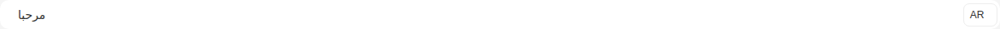

Args:

```json
{
  "value": "{\"en\": \"Hello\", \"ar\": \"مرحبا\"}",
  "type": "input",
  "placeholder": "Enter your text here...",
  "size": "md",
  "required": false,
  "disabled": false,
  "hasError": false,
  "language": "ar",
  "languages": {
    "feature": true,
    "supported": [],
    "current": {
      "id": 0,
      "label": "English",
      "value": "en"
    }
  },
  "noBorder": true,
  "startSlot": "hgi-stroke hgi-language-square"
}
```

<details><summary>Rendered markup</summary>

```html
<s-lingual-field name="undefined" value="{&quot;en&quot;: &quot;Hello&quot;, &quot;ar&quot;: &quot;مرحبا&quot;}" type="input" placeholder="Enter your text here..." size="md" language="ar" no-border="" start-slot="hgi-stroke hgi-language-square" languages="{&quot;feature&quot;:true,&quot;supported&quot;:[],&quot;current&quot;:{&quot;id&quot;:0,&quot;label&quot;:&quot;English&quot;,&quot;value&quot;:&quot;en&quot;}}" dir="rtl" class="s-lingual-field s-lingual-field--input rtl w-full relative flex items-start justify-start gap-4 hydrated"><!----><s-input class="flex-1 md rtl multilingual ltr hydrated" dir="rtl" value="مرحبا"><s-icon slot="start" class="hydrated"></s-icon><div slot="end" class="s-lingual-field__actions-end s-lingual-field__actions-end--hidden" data-lingual-field-internal-slot=""><div class="s-lingual-field__actions-end__reserve s-lingual-field__actions-end--hidden" aria-hidden="true">
    
  </div></div></s-input><s-dropdown dir="ltr" class="h-fit end ltr hydrated" overlay-alignment="start"><s-button data-toggle="true" slot="dropdown-head" class="s-btn s-btn--white default sm outlined ltr hydrated" theme="white" target="_self">AR<s-icon class="hydrated"></s-icon></s-button></s-dropdown></s-lingual-field>
```

</details>

### End Slot

Story id `components-lingualfield--end-slot`

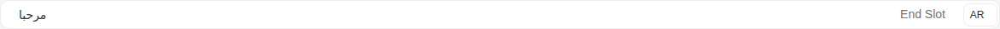

Args:

```json
{
  "value": "{\"en\": \"Hello\", \"ar\": \"مرحبا\"}",
  "type": "input",
  "placeholder": "Lingual field with start and end slots...",
  "size": "md",
  "required": false,
  "disabled": false,
  "hasError": false,
  "language": "ar",
  "languages": {
    "feature": true,
    "supported": [],
    "current": {
      "id": 0,
      "label": "English",
      "value": "en"
    }
  },
  "noBorder": false,
  "startSlot": "hgi-stroke hgi-language-square",
  "endSlot": "End Slot"
}
```

<details><summary>Rendered markup</summary>

```html
<s-lingual-field name="undefined" value="{&quot;en&quot;: &quot;Hello&quot;, &quot;ar&quot;: &quot;مرحبا&quot;}" type="input" placeholder="Lingual field with start and end slots..." size="md" language="ar" start-slot="hgi-stroke hgi-language-square" end-slot="End Slot" languages="{&quot;feature&quot;:true,&quot;supported&quot;:[],&quot;current&quot;:{&quot;id&quot;:0,&quot;label&quot;:&quot;English&quot;,&quot;value&quot;:&quot;en&quot;}}" dir="rtl" class="s-lingual-field s-lingual-field--input rtl w-full relative flex items-start justify-start gap-4 hydrated"><!----><s-input class="flex-1 md rtl multilingual ltr hydrated" dir="rtl" value="مرحبا"><s-icon slot="start" class="hydrated"></s-icon><div slot="end" class="s-lingual-field__actions-end" data-lingual-field-internal-slot=""><slot-fb name="end"><span>End Slot</span></slot-fb><div class="s-lingual-field__actions-end__reserve s-lingual-field__actions-end--hidden" aria-hidden="true">
    
  </div></div></s-input><s-dropdown dir="ltr" class="h-fit end ltr hydrated" overlay-alignment="start"><s-button data-toggle="true" slot="dropdown-head" class="s-btn s-btn--white default sm outlined ltr hydrated" theme="white" target="_self">AR<s-icon class="hydrated"></s-icon></s-button></s-dropdown></s-lingual-field>
```

</details>

### Has Error

Story id `components-lingualfield--has-error`

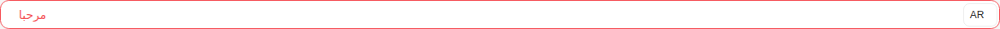

Args:

```json
{
  "value": "{\"en\": \"Hello\", \"ar\": \"مرحبا\"}",
  "type": "input",
  "placeholder": "Enter your text here...",
  "size": "md",
  "required": false,
  "disabled": false,
  "hasError": true,
  "language": "ar",
  "languages": {
    "feature": true,
    "supported": [],
    "current": {
      "id": 0,
      "label": "English",
      "value": "en"
    }
  },
  "noBorder": false,
  "startSlot": "hgi-stroke hgi-language-square"
}
```

<details><summary>Rendered markup</summary>

```html
<s-lingual-field name="undefined" value="{&quot;en&quot;: &quot;Hello&quot;, &quot;ar&quot;: &quot;مرحبا&quot;}" type="input" placeholder="Enter your text here..." size="md" language="ar" has-error="" start-slot="hgi-stroke hgi-language-square" languages="{&quot;feature&quot;:true,&quot;supported&quot;:[],&quot;current&quot;:{&quot;id&quot;:0,&quot;label&quot;:&quot;English&quot;,&quot;value&quot;:&quot;en&quot;}}" dir="rtl" class="s-lingual-field s-lingual-field--input rtl w-full relative flex items-start justify-start gap-4 hydrated"><!----><s-input class="flex-1 has-error md rtl multilingual ltr hydrated" dir="rtl" value="مرحبا"><s-icon slot="start" class="hydrated"></s-icon><div slot="end" class="s-lingual-field__actions-end s-lingual-field__actions-end--hidden" data-lingual-field-internal-slot=""><div class="s-lingual-field__actions-end__reserve s-lingual-field__actions-end--hidden" aria-hidden="true">
    
  </div></div></s-input><s-dropdown dir="ltr" class="h-fit end ltr hydrated" overlay-alignment="start"><s-button data-toggle="true" slot="dropdown-head" class="s-btn s-btn--white default sm outlined ltr hydrated" theme="white" target="_self">AR<s-icon class="hydrated"></s-icon></s-button></s-dropdown></s-lingual-field>
```

</details>

### Disabled

Story id `components-lingualfield--disabled`

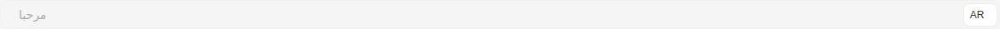

Args:

```json
{
  "value": "{\"en\": \"Hello\", \"ar\": \"مرحبا\"}",
  "type": "input",
  "placeholder": "Enter your text here...",
  "size": "md",
  "required": false,
  "disabled": true,
  "hasError": false,
  "language": "ar",
  "languages": {
    "feature": true,
    "supported": [],
    "current": {
      "id": 0,
      "label": "English",
      "value": "en"
    }
  },
  "noBorder": false,
  "startSlot": "hgi-stroke hgi-language-square"
}
```

<details><summary>Rendered markup</summary>

```html
<s-lingual-field name="undefined" value="{&quot;en&quot;: &quot;Hello&quot;, &quot;ar&quot;: &quot;مرحبا&quot;}" type="input" placeholder="Enter your text here..." size="md" language="ar" disabled="" start-slot="hgi-stroke hgi-language-square" languages="{&quot;feature&quot;:true,&quot;supported&quot;:[],&quot;current&quot;:{&quot;id&quot;:0,&quot;label&quot;:&quot;English&quot;,&quot;value&quot;:&quot;en&quot;}}" dir="rtl" class="s-lingual-field s-lingual-field--input rtl w-full relative flex items-start justify-start gap-4 hydrated"><!----><s-input class="flex-1 md rtl disabled multilingual ltr hydrated" dir="rtl" value="مرحبا"><s-icon slot="start" class="hydrated"></s-icon><div slot="end" class="s-lingual-field__actions-end s-lingual-field__actions-end--hidden" data-lingual-field-internal-slot=""><div class="s-lingual-field__actions-end__reserve s-lingual-field__actions-end--hidden" aria-hidden="true">
    
  </div></div></s-input><s-dropdown dir="ltr" class="h-fit end ltr hydrated" overlay-alignment="start"><s-button data-toggle="true" slot="dropdown-head" class="s-btn s-btn--white default sm outlined ltr hydrated" theme="white" target="_self">AR<s-icon class="hydrated"></s-icon></s-button></s-dropdown></s-lingual-field>
```

</details>

### Custom Toolbar

Story id `components-lingualfield--custom-toolbar`

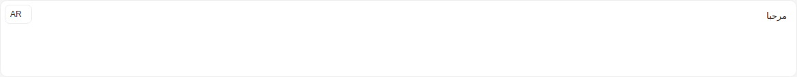

Args:

```json
{
  "value": "{\"en\": \"Hello\", \"ar\": \"مرحبا\"}",
  "type": "richText",
  "placeholder": "Enter your text here...",
  "size": "md",
  "required": false,
  "disabled": false,
  "hasError": false,
  "language": "ar",
  "languages": {
    "feature": true,
    "supported": [],
    "current": {
      "id": 0,
      "label": "English",
      "value": "en"
    }
  },
  "noBorder": false,
  "startSlot": "hgi-stroke hgi-language-square",
  "toolbar": [
    [
      "bold",
      "italic",
      "underline"
    ],
    [
      {
        "list": "ordered"
      },
      {
        "list": "bullet"
      }
    ],
    [
      "link",
      "image"
    ]
  ]
}
```

<details><summary>Rendered markup</summary>

```html
<s-lingual-field name="undefined" value="{&quot;en&quot;: &quot;Hello&quot;, &quot;ar&quot;: &quot;مرحبا&quot;}" type="richText" placeholder="Enter your text here..." size="md" language="ar" start-slot="hgi-stroke hgi-language-square" languages="{&quot;feature&quot;:true,&quot;supported&quot;:[],&quot;current&quot;:{&quot;id&quot;:0,&quot;label&quot;:&quot;English&quot;,&quot;value&quot;:&quot;en&quot;}}" toolbar="[[&quot;bold&quot;,&quot;italic&quot;,&quot;underline&quot;],[{&quot;list&quot;:&quot;ordered&quot;},{&quot;list&quot;:&quot;bullet&quot;}],[&quot;link&quot;,&quot;image&quot;]]" dir="rtl" class="s-lingual-field s-lingual-field--richText rtl w-full relative flex items-start justify-start gap-4 hydrated"><!----><div class="s-lingual-field__editor-wrap" dir="rtl"><s-editor type="richText" class="flex-1 md rtl s-editor multilingual hydrated" size="md" dir="rtl"><!----><div class="s-editor__wrapper"><s-editor-toolbar class="hydrated"></s-editor-toolbar><div class="s-editor__body" dir="rtl"><div id="editor" dir="ltr" class="s-editor__container notranslate ql-container ql-snow" data-placeholder="Enter your text here..." translate="no"><div class="ql-editor notranslate" contenteditable="true" aria-owns="quill-mention-list" data-placeholder="Enter your text here..." translate="no"><p class="ql-direction-rtl">مرحبا</p></div></div></div></div></s-editor><div class="s-lingual-field__editor-actions s-lingual-field__editor-actions--hidden">
    
  </div></div><s-dropdown dir="ltr" class="h-fit end ltr hydrated" overlay-alignment="start"><s-button data-toggle="true" slot="dropdown-head" class="s-btn s-btn--white default sm outlined ltr hydrated" theme="white" target="_self">AR<s-icon class="hydrated"></s-icon></s-button></s-dropdown></s-lingual-field>
```

</details>
