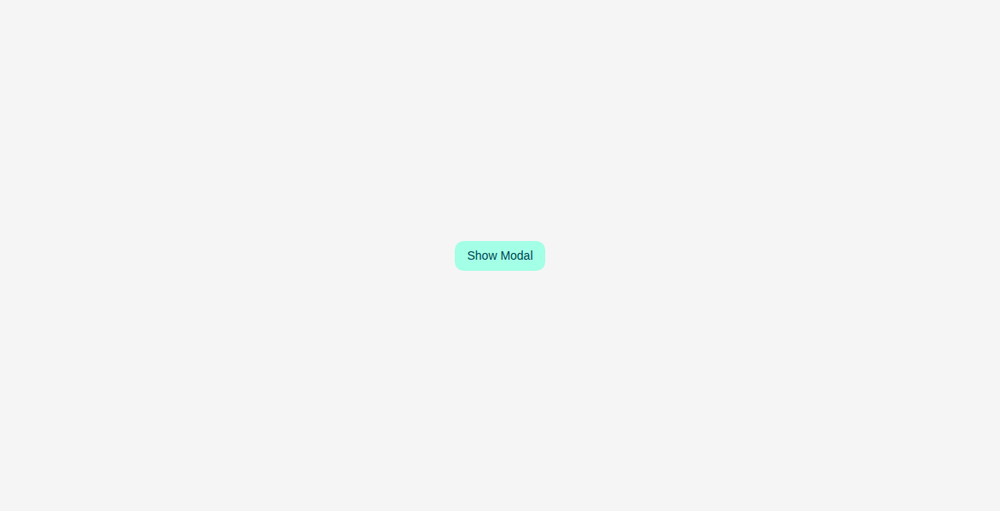

# Modal

Storybook title `Components/Modal` · source `./src/components/s-modal/s-modal.stories.tsx`

Tags rendered: `<s-button>`, `<s-modal>`, `<s-modal-body>`, `<s-modal-footer>`, `<s-modal-head>`

A modal component that displays a list of selectable items. It supports various states, search functionality, and different toggle elements.

## Props

| Prop | Type / control | Options | Default | Description |
|---|---|---|---|---|
| `size` | string |  | `md` | Modal size, sm, md, lg, xlg |
| `theme` | string |  | `default` | Modal theme, default or light |
| `closable` | boolean |  | `false` | Backdrop clickable to close the modal |
| `onopen` |  |  |  | Emitted when the modal opens. |
| `onclose` |  |  |  | Emitted when the modal closes. |

## Stories

### Default

Story id `components-modal--default`



Args:

```json
{
  "size": "md",
  "theme": "default",
  "closable": false
}
```

<details><summary>Rendered markup</summary>

```html
<div>
    <style>
    #story--components-modal--default--primary-inner {
      height: 600px !important;
    }
  
    #story--components-modal--small--primary-inner {
      height: 600px !important;
    }
  
    #story--components-modal--large--primary-inner {
      height: 600px !important;
    }
  
    #story--components-modal--extra-large--primary-inner {
      height: 600px !important;
    }
  
    #story--components-modal--light-theme--primary-inner {
      height: 600px !important;
    }
  
    #story--components-modal--closable--primary-inner {
      height: 600px !important;
    }
  
    #story--components-modal--loading--primary-inner {
      height: 600px !important;
    }
  
    #story--components-modal--complex-content--primary-inner {
      height: 600px !important;
    }
  </style>
    <div class="relative w-full h-full min-h-[600px] flex items-center justify-center">
      <s-button id="s_modal_toggle_s_modal" class="s-btn s-btn--default default md ltr hydrated" theme="default" target="_self">Show Modal</s-button>
      <s-modal id="s_modal" name="" size="md" theme="default" class="s-modal s-modal--default md hydrated" role="dialog" data-scrollable="" scrollable="">
        
  <s-modal-head class="hydrated">
    <h4 class="text-base font-bold">Modal Title</h4>
    <s-button size="sm" theme="danger" outlined="" data-modal-close="" class="s-btn s-btn--danger default sm outlined ltr hydrated" target="_self">
      <i class="hgi-stroke hgi-cancel-01"></i>
    </s-button>
  </s-modal-head>
  <s-modal-body class="hydrated">
    <div class="flex flex-col w-full gap-4">
      <article class="text-sm leading-[1.5]">
        <h4 class="block font-bold mb-2">Sample Content</h4>
        <p>This is the default modal content. You can customize it using the content control.</p>
      </article>
    </div>
  </s-modal-body>
  <s-modal-footer class="hydrated">
    <s-button class="s-btn s-btn--default default md ltr hydrated" theme="default" target="_self">Confirm</s-button>
    <s-button theme="danger" outlined="" data-modal-close="" class="s-btn s-btn--danger default md outlined ltr hydrated" target="_self">Cancel</s-button>
  </s-modal-footer>

      </s-modal>
    </div>
  </div>
```

</details>
