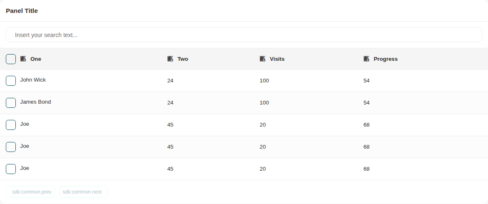
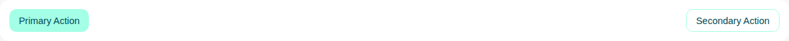

# Panel

Storybook title `Components/Panel` · source `./src/components/s-panel/s-panel.stories.tsx`

Tags rendered: `<s-button>`, `<s-dropdown>`, `<s-panel>`, `<s-panel-body>`, `<s-panel-head>`, `<s-table>`

The content wrapper component

## Props

| Prop | Type / control | Options | Default | Description |
|---|---|---|---|---|
| `noPadding` | boolean |  |  | Remove panel body padding, useful for full width panels with tables inside panel body |
| `overflowHidden` | boolean |  |  | overflow hidden for panel body |
| `collapsable` | boolean |  | `false` | Make panel collapsable |
| `collapsed` | boolean |  | `true` | Set collapse prop |
| `layout` | string |  | `relaxed` | for some scenarions, you may need a compact layout for panel |
| `title` | string |  |  | Panel title, you can add the title via `<s-panel-head />` and use the `title` slot |
| `content` | string |  |  | Panel content, use the `<s-panel-body />` to add all your content inside this slot |
| `actions` | string |  |  |  |

## Stories

### Default

Story id `components-panel--default`


Args:

```json
{
  "noPadding": false,
  "overflowHidden": false,
  "collapsable": false,
  "collapsed": true,
  "layout": "relaxed",
  "title": "Panel Title",
  "content": "Panel content, you can add any content here inside this slot"
}
```

<details><summary>Rendered markup</summary>

```html
<s-panel collapsed="" layout="relaxed" class="s-panel ltr hydrated">
    
    <s-panel-head data-collapsed="true" class="hydrated">
      <div slot="title">Panel Title</div>
      
    </s-panel-head>
    
    <s-panel-body class="hydrated">
      Panel content, you can add any content here inside this slot
    </s-panel-body>
  </s-panel>
```

</details>

### No Padding

Story id `components-panel--no-padding`



Args:

```json
{
  "noPadding": true,
  "overflowHidden": false,
  "collapsable": false,
  "collapsed": true,
  "layout": "relaxed",
  "title": "Panel Title",
  "content": "<s-table\n                      searchable=\"true\"\n                      selectable=\"true\"\n                      sortable=\"true\"\n                      sort-by='[\"name\", \"age\", \"visits\", \"progress\"]'\n                      items-per-page='[\"5\", \"8\", \"10\"]'\n                      headers='[\"one\", \"two\"]'\n                      search-placeholder=\"Insert your search text...\"\n                      items='[{\"name\":\"John Wick\",\"age\":\"24\",\"visits\":\"100\",\"progress\":\"54\"},{\"name\":\"James Bond\",\"age\":\"24\",\"visits\":\"100\",\"progress\":\"54\"},{\"name\":\"Joe\",\"age\":\"45\",\"visits\":\"20\",\"progress\":\"68\",\"options\":\"\"},{\"name\":\"Joe\",\"age\":\"45\",\"visits\":\"20\",\"progress\":\"68\",\"options\":\"\"},{\"name\":\"Joe\",\"age\":\"45\",\"visits\":\"20\",\"progress\":\"68\",\"options\":\"\"},{\"name\":\"Joe\",\"age\":\"45\",\"visits\":\"20\",\"progress\":\"68\",\"options\":\"\"},{\"name\":\"Joe\",\"age\":\"45\",\"visits\":\"20\",\"progress\":\"68\",\"options\":\"\"},{\"name\":\"Joe\",\"age\":\"45\",\"visits\":\"20\",\"progress\":\"68\",\"options\":\"\"},{\"name\":\"Joe\",\"age\":\"45\",\"visits\":\"20\",\"progress\":\"68\",\"options\":\"\"},{\"name\":\"Joe\",\"age\":\"45\",\"visits\":\"20\",\"progress\":\"68\",\"options\":\"\"},{\"name\":\"Joe\",\"age\":\"45\",\"visits\":\"20\",\"progress\":\"68\",\"options\":\"\"},{\"name\":\"Joe\",\"age\":\"45\",\"visits\":\"20\",\"progress\":\"68\",\"options\":\"\"},{\"name\":\"Joe\",\"age\":\"45\",\"visits\":\"20\",\"progress\":\"68\",\"options\":\"\"},{\"name\":\"Joe\",\"age\":\"45\",\"visits\":\"20\",\"progress\":\"68\",\"options\":\"\"}]'\n                    >\n                    </s-table>"
}
```

<details><summary>Rendered markup</summary>

```html
<s-panel no-padding="" collapsed="" layout="relaxed" class="s-panel no-padding ltr hydrated">
    
    <s-panel-head data-collapsed="true" class="hydrated">
      <div slot="title">Panel Title</div>
      
    </s-panel-head>
    
    <s-panel-body class="hydrated">
      <s-table searchable="true" selectable="true" sortable="true" sort-by="[&quot;name&quot;, &quot;age&quot;, &quot;visits&quot;, &quot;progress&quot;]" items-per-page="[&quot;5&quot;, &quot;8&quot;, &quot;10&quot;]" headers="[&quot;one&quot;, &quot;two&quot;]" search-placeholder="Insert your search text..." items="[{&quot;name&quot;:&quot;John Wick&quot;,&quot;age&quot;:&quot;24&quot;,&quot;visits&quot;:&quot;100&quot;,&quot;progress&quot;:&quot;54&quot;},{&quot;name&quot;:&quot;James Bond&quot;,&quot;age&quot;:&quot;24&quot;,&quot;visits&quot;:&quot;100&quot;,&quot;progress&quot;:&quot;54&quot;},{&quot;name&quot;:&quot;Joe&quot;,&quot;age&quot;:&quot;45&quot;,&quot;visits&quot;:&quot;20&quot;,&quot;progress&quot;:&quot;68&quot;,&quot;options&quot;:&quot;&quot;},{&quot;name&quot;:&quot;Joe&quot;,&quot;age&quot;:&quot;45&quot;,&quot;visits&quot;:&quot;20&quot;,&quot;progress&quot;:&quot;68&quot;,&quot;options&quot;:&quot;&quot;},{&quot;name&quot;:&quot;Joe&quot;,&quot;age&quot;:&quot;45&quot;,&quot;visits&quot;:&quot;20&quot;,&quot;progress&quot;:&quot;68&quot;,&quot;options&quot;:&quot;&quot;},{&quot;name&quot;:&quot;Joe&quot;,&quot;age&quot;:&quot;45&quot;,&quot;visits&quot;:&quot;20&quot;,&quot;progress&quot;:&quot;68&quot;,&quot;options&quot;:&quot;&quot;},{&quot;name&quot;:&quot;Joe&quot;,&quot;age&quot;:&quot;45&quot;,&quot;visits&quot;:&quot;20&quot;,&quot;progress&quot;:&quot;68&quot;,&quot;options&quot;:&quot;&quot;},{&quot;name&quot;:&quot;Joe&quot;,&quot;age&quot;:&quot;45&quot;,&quot;visits&quot;:&quot;20&quot;,&quot;progress&quot;:&quot;68&quot;,&quot;options&quot;:&quot;&quot;},{&quot;name&quot;:&quot;Joe&quot;,&quot;age&quot;:&quot;45&quot;,&quot;visits&quot;:&quot;20&quot;,&quot;progress&quot;:&quot;68&quot;,&quot;options&quot;:&quot;&quot;},{&quot;name&quot;:&quot;Joe&quot;,&quot;age&quot;:&quot;45&quot;,&quot;visits&quot;:&quot;20&quot;,&quot;progress&quot;:&quot;68&quot;,&quot;options&quot;:&quot;&quot;},{&quot;name&quot;:&quot;Joe&quot;,&quot;age&quot;:&quot;45&quot;,&quot;visits&quot;:&quot;20&quot;,&quot;progress&quot;:&quot;68&quot;,&quot;options&quot;:&quot;&quot;},{&quot;name&quot;:&quot;Joe&quot;,&quot;age&quot;:&quot;45&quot;,&quot;visits&quot;:&quot;20&quot;,&quot;progress&quot;:&quot;68&quot;,&quot;options&quot;:&quot;&quot;},{&quot;name&quot;:&quot;Joe&quot;,&quot;age&quot;:&quot;45&quot;,&quot;visits&quot;:&quot;20&quot;,&quot;progress&quot;:&quot;68&quot;,&quot;options&quot;:&quot;&quot;},{&quot;name&quot;:&quot;Joe&quot;,&quot;age&quot;:&quot;45&quot;,&quot;visits&quot;:&quot;20&quot;,&quot;progress&quot;:&quot;68&quot;,&quot;options&quot;:&quot;&quot;}]" class="s-table scroll ltr hydrated">
                    </s-table>
    </s-panel-body>
  </s-panel>
```

</details>

### Collapsable

Story id `components-panel--collapsable`


Args:

```json
{
  "noPadding": false,
  "overflowHidden": false,
  "collapsable": true,
  "collapsed": true,
  "layout": "relaxed",
  "title": "Panel Title",
  "content": "Panel content, you can add any content here inside this slot"
}
```

<details><summary>Rendered markup</summary>

```html
<s-panel collapsable="" collapsed="" layout="relaxed" class="s-panel ltr hydrated" data-collapsed="true">
    
    <s-panel-head data-collapsed="true" class="hydrated" collapsable="true">
      <div slot="title">Panel Title</div>
      
    </s-panel-head>
    
    <s-panel-body class="hydrated" data-collapsed="true">
      Panel content, you can add any content here inside this slot
    </s-panel-body>
  </s-panel>
```

</details>

### Header Actions Slot

Story id `components-panel--header-actions-slot`


Args:

```json
{
  "noPadding": false,
  "overflowHidden": false,
  "collapsable": false,
  "collapsed": true,
  "layout": "relaxed",
  "title": "Panel Title",
  "content": "Panel content, you can add any content here inside this slot",
  "actions": "\n      <div class=\"flex gap-2\">\n        <s-button size=\"sm\" outlined>\n          <i class=\"hgi-stroke hgi-add-01\"></i>\n            Add New\n        </s-button>\n        <s-dropdown items='[{\"id\":0,\"label\":\"Option 1\"},{\"id\":1,\"label\":\"Option 2\"}]' layout=\"end\">\n        <s-button size=\"sm\" outlined data-toggle=\"true\" slot=\"dropdown-head\">\n          <i class=\"hgi-stroke hgi-settings-01\"></i>\n          Settings\n        </s-button>\n      </s-dropdown>        \n      </div>\n    "
}
```

<details><summary>Rendered markup</summary>

```html
<s-panel collapsed="" layout="relaxed" class="s-panel ltr hydrated">
    
    <s-panel-head data-collapsed="true" class="hydrated">
      <div slot="title">Panel Title</div>
      <div slot="actions">
      <div class="flex gap-2">
        <s-button size="sm" outlined="" class="s-btn s-btn--default default sm outlined ltr hydrated" theme="default" target="_self">
          <i class="hgi-stroke hgi-add-01"></i>
            Add New
        </s-button>
        <s-dropdown items="[{&quot;id&quot;:0,&quot;label&quot;:&quot;Option 1&quot;},{&quot;id&quot;:1,&quot;label&quot;:&quot;Option 2&quot;}]" layout="end" class="end ltr hydrated">
        <s-button size="sm" outlined="" data-toggle="true" slot="dropdown-head" class="s-btn s-btn--default default sm outlined ltr hydrated" theme="default" target="_self">
          <i class="hgi-stroke hgi-settings-01"></i>
          Settings
        </s-button>
      </s-dropdown>        
      </div>
    </div>
    </s-panel-head>
    
    <s-panel-body class="hydrated">
      Panel content, you can add any content here inside this slot
    </s-panel-body>
  </s-panel>
```

</details>

### Compact Layout

Story id `components-panel--compact-layout`


Args:

```json
{
  "noPadding": false,
  "overflowHidden": false,
  "collapsable": false,
  "collapsed": true,
  "layout": "compact",
  "title": "Panel Title",
  "content": "Panel content, you can add any content here inside this slot"
}
```

<details><summary>Rendered markup</summary>

```html
<s-panel collapsed="" layout="compact" class="s-panel s-panel--compact ltr hydrated">
    
    <s-panel-head data-collapsed="true" class="hydrated">
      <div slot="title">Panel Title</div>
      
    </s-panel-head>
    
    <s-panel-body class="hydrated">
      Panel content, you can add any content here inside this slot
    </s-panel-body>
  </s-panel>
```

</details>

### Headless Panel

Story id `components-panel--headless-panel`



Args:

```json
{
  "noPadding": false,
  "overflowHidden": false,
  "collapsable": false,
  "collapsed": true,
  "layout": "relaxed",
  "title": "",
  "content": "\n    <div class=\"flex items-center justify-between\">\n      <s-button>Primary Action</s-button>\n      <s-button outlined>Secondary Action</s-button>\n    </div>\n    "
}
```

<details><summary>Rendered markup</summary>

```html
<s-panel collapsed="" layout="relaxed" class="s-panel ltr hydrated">
    
    <s-panel-body class="hydrated">
      
    <div class="flex items-center justify-between">
      <s-button class="s-btn s-btn--default default md ltr hydrated" theme="default" target="_self">Primary Action</s-button>
      <s-button outlined="" class="s-btn s-btn--default default md outlined ltr hydrated" theme="default" target="_self">Secondary Action</s-button>
    </div>
    
    </s-panel-body>
  </s-panel>
```

</details>
