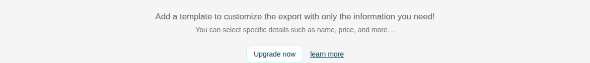
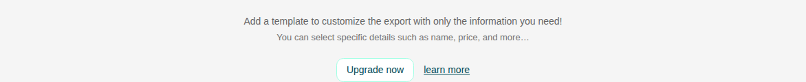
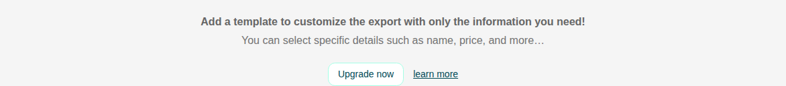

# Placeholder

Storybook title `Components/Placeholder` · source `./src/components/s-placeholder/s-placeholder.stories.tsx`

Tags rendered: `<s-button>`, `<s-icon>`, `<s-placeholder>`

Placeholder component is used to display a placeholder for a component or page.

## Props

| Prop | Type / control | Options | Default | Description |
|---|---|---|---|---|
| `label` | string |  | `Add a template to customize the export with only the information you need!` | Placeholder label |
| `desc` | string |  | `You can select specific details such as name, price, and more…` | Placeholder description (optional) |
| `size` | string |  | `md` | Placeholder size |
| `icon` | string |  | `hgi-stroke hgi-package-open` | Hugeicons class name rendered in the `icon` slot |
| `actions` | text |  | `Upgrade now & learn more buttons` | Actions slot content - insert your action buttons in the `actions` slot |

## Stories

### Default

Story id `components-placeholder--default`



Args:

```json
{
  "label": "Add a template to customize the export with only the information you need!",
  "desc": "You can select specific details such as name, price, and more…",
  "size": "md",
  "icon": "hgi-stroke hgi-package-open"
}
```

<details><summary>Rendered markup</summary>

```html
<s-placeholder label="Add a template to customize the export with only the information you need!" desc="You can select specific details such as name, price, and more…" size="md" class="s-placeholder md hydrated">
    <div slot="icon">
      <s-icon icon="hgi-stroke hgi-package-open" size="4rem" class="hydrated"></s-icon>
    </div>
    <div slot="actions">
      <s-button outlined="" class="s-btn s-btn--default default md outlined ltr hydrated" theme="default" target="_self">Upgrade now</s-button>
      <s-button theme="transparent" no-padding="true" class="text-primary underline s-btn s-btn--transparent default md ltr hydrated" target="_self">learn more</s-button>
    </div>
  </s-placeholder>
```

</details>

### Small

Story id `components-placeholder--small`



Args:

```json
{
  "label": "Add a template to customize the export with only the information you need!",
  "desc": "You can select specific details such as name, price, and more…",
  "size": "sm",
  "icon": "hgi-stroke hgi-package-open"
}
```

<details><summary>Rendered markup</summary>

```html
<s-placeholder label="Add a template to customize the export with only the information you need!" desc="You can select specific details such as name, price, and more…" size="sm" class="s-placeholder sm hydrated">
    <div slot="icon">
      <s-icon icon="hgi-stroke hgi-package-open" size="4rem" class="hydrated"></s-icon>
    </div>
    <div slot="actions">
      <s-button outlined="" class="s-btn s-btn--default default md outlined ltr hydrated" theme="default" target="_self">Upgrade now</s-button>
      <s-button theme="transparent" no-padding="true" class="text-primary underline s-btn s-btn--transparent default md ltr hydrated" target="_self">learn more</s-button>
    </div>
  </s-placeholder>
```

</details>

### Large

Story id `components-placeholder--large`



Args:

```json
{
  "label": "Add a template to customize the export with only the information you need!",
  "desc": "You can select specific details such as name, price, and more…",
  "size": "lg",
  "icon": "hgi-stroke hgi-package-open"
}
```

<details><summary>Rendered markup</summary>

```html
<s-placeholder label="Add a template to customize the export with only the information you need!" desc="You can select specific details such as name, price, and more…" size="lg" class="s-placeholder lg hydrated">
    <div slot="icon">
      <s-icon icon="hgi-stroke hgi-package-open" size="4rem" class="hydrated"></s-icon>
    </div>
    <div slot="actions">
      <s-button outlined="" class="s-btn s-btn--default default md outlined ltr hydrated" theme="default" target="_self">Upgrade now</s-button>
      <s-button theme="transparent" no-padding="true" class="text-primary underline s-btn s-btn--transparent default md ltr hydrated" target="_self">learn more</s-button>
    </div>
  </s-placeholder>
```

</details>
