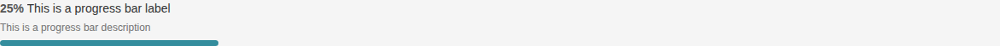
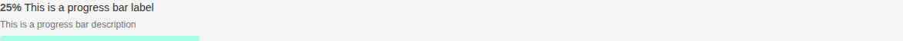
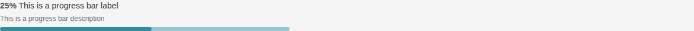
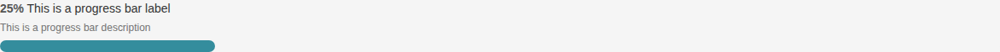
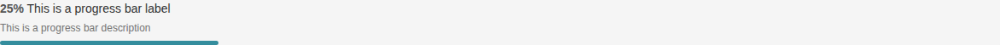

# Progress Bar

Storybook title `Components/Progress Bar` · source `./src/components/s-progress-bar/s-progress-bar.stories.tsx`

Tags rendered: `<s-progress-bar>`

A progress bar component, helping you adding a graphical element to your app. It supports various states, loading, and different toggle elements.

## Props

| Prop | Type / control | Options | Default | Description |
|---|---|---|---|---|
| `label` | string |  | `This is a progress bar label` | Progress bar label |
| `desc` | string |  | `This is a progress bar description` | Progress bar description |
| `theme` | string |  | `default` | Progress bar theme, default or secondary |
| `size` | string |  | `md` | Progress bar size |
| `percentage` | number |  | `25` | Progress bar percentage |
| `showPercentage` | boolean |  | `true` | Show or hide the percentage value on the progress bar |
| `shortLabel` | boolean |  | `false` | If you need to make the label shorter, you can use this prop |
| `secondaryPercentage` | number |  | `undefined` | You can add a secondary percentage to the progress bar if needed |
| `onchange` |  |  |  | Emitted when the progress bar value changes. |
| `onclick` |  |  |  | Emitted when the progress bar is clicked. |

## Stories

### Default

Story id `components-progress-bar--default`


Args:

```json
{
  "label": "This is a progress bar label",
  "desc": "This is a progress bar description",
  "theme": "default",
  "size": "md",
  "percentage": 25,
  "showPercentage": true,
  "shortLabel": false
}
```

<details><summary>Rendered markup</summary>

```html
<s-progress-bar label="This is a progress bar label" desc="This is a progress bar description" theme="default" size="md" percentage="25" show-percentage="true" class="w-full s-progress-bar flex flex-col gap-2 default md ltr hydrated"></s-progress-bar>
```

</details>

### Short Label

Story id `components-progress-bar--short-label`



Args:

```json
{
  "label": "This is a progress bar label",
  "desc": "This is a progress bar description",
  "theme": "default",
  "size": "md",
  "percentage": 25,
  "showPercentage": true,
  "shortLabel": true
}
```

<details><summary>Rendered markup</summary>

```html
<s-progress-bar label="This is a progress bar label" desc="This is a progress bar description" theme="default" size="md" percentage="25" show-percentage="true" short-label="" class="w-full s-progress-bar flex flex-col gap-2 default md ltr hydrated"></s-progress-bar>
```

</details>

### Secondary Theme

Story id `components-progress-bar--secondary-theme`



Args:

```json
{
  "label": "This is a progress bar label",
  "desc": "This is a progress bar description",
  "theme": "secondary",
  "size": "md",
  "percentage": 25,
  "showPercentage": true,
  "shortLabel": false
}
```

<details><summary>Rendered markup</summary>

```html
<s-progress-bar label="This is a progress bar label" desc="This is a progress bar description" theme="secondary" size="md" percentage="25" show-percentage="true" class="w-full s-progress-bar flex flex-col gap-2 secondary md ltr hydrated"></s-progress-bar>
```

</details>

### Secondary Percentage

Story id `components-progress-bar--secondary-percentage`



Args:

```json
{
  "label": "This is a progress bar label",
  "desc": "This is a progress bar description",
  "theme": "default",
  "size": "md",
  "percentage": 25,
  "showPercentage": true,
  "shortLabel": false,
  "secondaryPercentage": 75
}
```

<details><summary>Rendered markup</summary>

```html
<s-progress-bar label="This is a progress bar label" desc="This is a progress bar description" theme="default" size="md" percentage="25" secondary-percentage="75" show-percentage="true" class="w-full s-progress-bar flex flex-col gap-2 default md ltr hydrated"></s-progress-bar>
```

</details>

### Large

Story id `components-progress-bar--large`



Args:

```json
{
  "label": "This is a progress bar label",
  "desc": "This is a progress bar description",
  "theme": "default",
  "size": "lg",
  "percentage": 25,
  "showPercentage": true,
  "shortLabel": false
}
```

<details><summary>Rendered markup</summary>

```html
<s-progress-bar label="This is a progress bar label" desc="This is a progress bar description" theme="default" size="lg" percentage="25" show-percentage="true" class="w-full s-progress-bar flex flex-col gap-2 default lg ltr hydrated"></s-progress-bar>
```

</details>

### Small

Story id `components-progress-bar--small`



Args:

```json
{
  "label": "This is a progress bar label",
  "desc": "This is a progress bar description",
  "theme": "default",
  "size": "sm",
  "percentage": 25,
  "showPercentage": true,
  "shortLabel": false
}
```

<details><summary>Rendered markup</summary>

```html
<s-progress-bar label="This is a progress bar label" desc="This is a progress bar description" theme="default" size="sm" percentage="25" show-percentage="true" class="w-full s-progress-bar flex flex-col gap-2 default sm ltr hydrated"></s-progress-bar>
```

</details>
