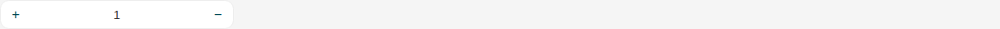
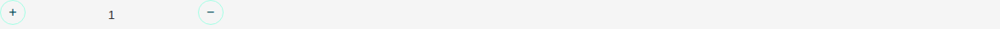
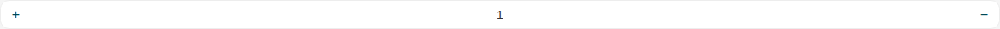
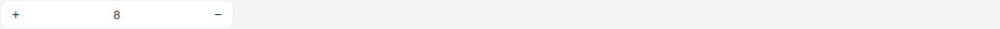
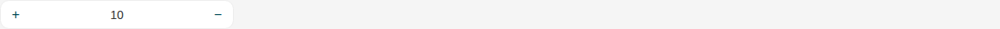
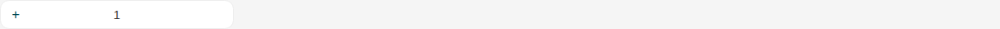
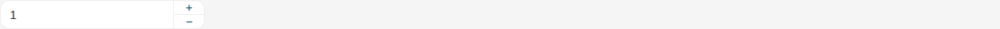
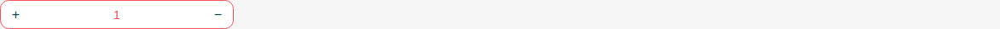

# Qty

Storybook title `Components/Qty` · source `./src/components/s-qty/s-qty.stories.tsx`

Tags rendered: `<s-qty>`

The Qty component represents a quantity input field. It allows users to input numeric quantities and provides buttons to increment or decrement the value.

## Props

| Prop | Type / control | Options | Default | Description |
|---|---|---|---|---|
| `value` | number |  | `1` | Field value |
| `theme` | string |  | `default` | Field theme, you can choose between default and circular |
| `layout` | string |  | `sides` | Field layout, you can choose between sides and end |
| `min` | number |  | `0` | Field minimum value |
| `max` | number |  | `100` | Field maximum value |
| `step` | number |  | `1` | Field step, it's the value to increment or decrement when clicking the buttons. Default is 1. |
| `placeholder` | string |  | `Enter the required quantity` | Field placeholder |
| `required` | boolean |  | `false` | Required state |
| `disabled` | boolean |  | `false` | Disabled state |
| `hasError` | boolean |  | `false` | Error state |
| `wide` | boolean |  | `false` | Wide state |
| `deletable` | boolean |  | `false` | Enable this to show delete button instead of minus button when value is 1 an event will be emitted with the following payload { payload: { target, min, max, value, leastValue, deletable } } |
| `valueChanged` |  |  |  | Emitted when the quantity input field value changes. |
| `increaseClicked` |  |  |  | Emitted when the increase button is clicked. |
| `decreaseClicked` |  |  |  | Emitted when the decrease button is clicked. |

## Stories

### Default

Story id `components-qty--default`



Args:

```json
{
  "value": 1,
  "theme": "default",
  "layout": "sides",
  "min": 1,
  "max": 100,
  "step": 1,
  "placeholder": "Enter Qty",
  "required": false,
  "disabled": false,
  "hasError": false,
  "wide": false,
  "deletable": false
}
```

<details><summary>Rendered markup</summary>

```html
<s-qty value="1" theme="default" layout="sides" min="1" max="100" step="1" placeholder="Enter Qty" class="s-qty s-qty--default ltr hydrated"></s-qty>
```

</details>

### Circular

Story id `components-qty--circular`



Args:

```json
{
  "value": 1,
  "theme": "circular",
  "layout": "sides",
  "min": 1,
  "max": 100,
  "step": 1,
  "placeholder": "Enter Qty",
  "required": false,
  "disabled": false,
  "hasError": false,
  "wide": false,
  "deletable": false
}
```

<details><summary>Rendered markup</summary>

```html
<s-qty value="1" theme="circular" layout="sides" min="1" max="100" step="1" placeholder="Enter Qty" class="s-qty s-qty--circular ltr hydrated"></s-qty>
```

</details>

### Wide

Story id `components-qty--wide`



Args:

```json
{
  "value": 1,
  "theme": "default",
  "layout": "sides",
  "min": 1,
  "max": 100,
  "step": 1,
  "placeholder": "Enter Qty",
  "required": false,
  "disabled": false,
  "hasError": false,
  "wide": true,
  "deletable": false
}
```

<details><summary>Rendered markup</summary>

```html
<s-qty value="1" theme="default" layout="sides" min="1" max="100" step="1" placeholder="Enter Qty" wide="" class="s-qty s-qty--default w-full ltr hydrated"></s-qty>
```

</details>

### Min Max Values

Story id `components-qty--min-max-values`



Args:

```json
{
  "value": 8,
  "theme": "default",
  "layout": "sides",
  "min": 5,
  "max": 10,
  "step": 1,
  "placeholder": "Enter Qty",
  "required": false,
  "disabled": false,
  "hasError": false,
  "wide": false,
  "deletable": false
}
```

<details><summary>Rendered markup</summary>

```html
<s-qty value="8" theme="default" layout="sides" min="5" max="10" step="1" placeholder="Enter Qty" class="s-qty s-qty--default ltr hydrated"></s-qty>
```

</details>

### Step

Story id `components-qty--step`



Args:

```json
{
  "value": 10,
  "theme": "default",
  "layout": "sides",
  "min": 0,
  "max": 50,
  "step": 10,
  "placeholder": "Enter Qty",
  "required": false,
  "disabled": false,
  "hasError": false,
  "wide": false,
  "deletable": false
}
```

<details><summary>Rendered markup</summary>

```html
<s-qty value="10" theme="default" layout="sides" min="1" max="50" step="10" placeholder="Enter Qty" class="s-qty s-qty--default ltr hydrated"></s-qty>
```

</details>

### Deletable

Story id `components-qty--deletable`



Args:

```json
{
  "value": 1,
  "theme": "default",
  "layout": "sides",
  "min": 1,
  "max": 1,
  "step": 1,
  "placeholder": "Enter Qty",
  "required": false,
  "disabled": false,
  "hasError": false,
  "wide": false,
  "deletable": true
}
```

<details><summary>Rendered markup</summary>

```html
<s-qty value="1" theme="default" layout="sides" min="1" max="1" step="1" placeholder="Enter Qty" deletable="" class="s-qty s-qty--default ltr hydrated"></s-qty>
```

</details>

### Layout End

Story id `components-qty--layout-end`



Args:

```json
{
  "value": 1,
  "theme": "default",
  "layout": "end",
  "min": 1,
  "max": 100,
  "step": 1,
  "placeholder": "Enter Qty",
  "required": false,
  "disabled": false,
  "hasError": false,
  "wide": false,
  "deletable": false
}
```

<details><summary>Rendered markup</summary>

```html
<s-qty value="1" theme="default" layout="end" min="1" max="100" step="1" placeholder="Enter Qty" class="s-qty s-qty--default ltr hydrated"></s-qty>
```

</details>

### Has Error

Story id `components-qty--has-error`



Args:

```json
{
  "value": 1,
  "theme": "default",
  "layout": "sides",
  "min": 1,
  "max": 100,
  "step": 1,
  "placeholder": "Enter Qty",
  "required": false,
  "disabled": false,
  "hasError": true,
  "wide": false,
  "deletable": false
}
```

<details><summary>Rendered markup</summary>

```html
<s-qty value="1" theme="default" layout="sides" min="1" max="100" step="1" placeholder="Enter Qty" has-error="" class="s-qty s-qty--default has-error ltr hydrated"></s-qty>
```

</details>

### Disabled

Story id `components-qty--disabled`


Args:

```json
{
  "value": 1,
  "theme": "default",
  "layout": "sides",
  "min": 1,
  "max": 100,
  "step": 1,
  "placeholder": "Enter Qty",
  "required": false,
  "disabled": true,
  "hasError": false,
  "wide": false,
  "deletable": false
}
```

<details><summary>Rendered markup</summary>

```html
<s-qty value="1" theme="default" layout="sides" min="1" max="100" step="1" placeholder="Enter Qty" disabled="" class="s-qty s-qty--default disabled ltr hydrated"></s-qty>
```

</details>
