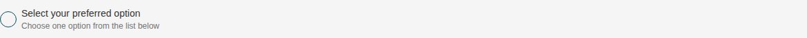
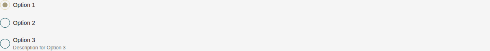
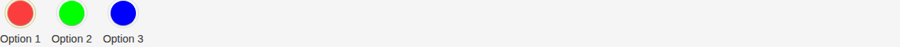
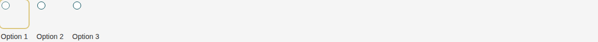
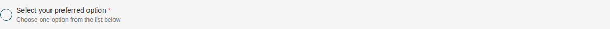
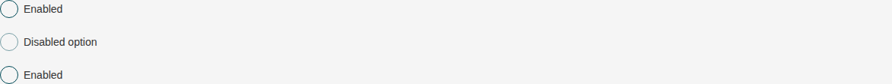
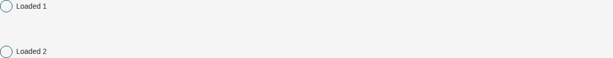
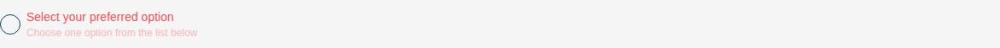

# Radio

Storybook title `Components/Radio` · source `./src/components/s-radio/s-radio.stories.tsx`

Tags rendered: `<s-radio>`

A radio button is a form element that allows users to select one option from a list of mutually exclusive choices. It is commonly used in forms where only one selection is allowed.

## Props

| Prop | Type / control | Options | Default | Description |
|---|---|---|---|---|
| `label` | string |  |  | Radio label |
| `desc` | string |  |  | Radio description |
| `required` | boolean |  | `false` | If the radio is required |
| `disabled` | boolean |  | `false` | Boolean indicating whether the radio is disabled |
| `hasError` | boolean |  | `false` | Boolean indicating whether the radio has an error |
| `checked` | boolean |  | `false` | Radio checked state |
| `direction` | string |  | `col` | Radio direction, you can choose between col (vertical) or row (horizontal) |
| `layout` | string |  | `default` | Radio layout style, you can choose between default, text, image, color |
| `wide` | boolean |  | `false` | Boolean indicating whether the radio occupies full width |
| `value` | text |  |  | Single Radio value |
| `items` | text |  | `[]` | Multiple Radio value |
| `feature` | boolean |  | `true` | Feature based state |
| `autoHeight` | boolean |  | `false` | If the text radio should fill the available height. Applies when layout is "text". |
| `loading` | boolean |  | `false` | Replaces every option with a skeleton placeholder shaped like the current layout. Per-option loading is also supported via `loading: true` on an individual item. |
| `onValueChanged` |  |  |  | Emitted when the radio value changes. Payload includes value, checked state, and all options. |
| `onChange` |  |  |  | Emitted when the radio selection changes (native change event). |
| `onInput` |  |  |  | Emitted when the radio input is modified (native input event). |

## Stories

### Default

Story id `components-radio--default`



Args:

```json
{
  "label": "Select your preferred option",
  "desc": "Choose one option from the list below",
  "required": false,
  "disabled": false,
  "hasError": false,
  "checked": false,
  "direction": "col",
  "layout": "default",
  "wide": false
}
```

<details><summary>Rendered markup</summary>

```html
<s-radio label="Select your preferred option" desc="Choose one option from the list below" layout="default" direction="col" class="s-radio s-radio--default ltr hydrated"></s-radio>
```

</details>

### Checked

Story id `components-radio--checked`


Args:

```json
{
  "label": "Select your preferred option",
  "desc": "Choose one option from the list below",
  "required": false,
  "disabled": false,
  "hasError": false,
  "checked": true,
  "direction": "col",
  "layout": "default",
  "wide": false
}
```

<details><summary>Rendered markup</summary>

```html
<s-radio label="Select your preferred option" desc="Choose one option from the list below" layout="default" direction="col" checked="" class="s-radio s-radio--default ltr hydrated"></s-radio>
```

</details>

### Group Options

Story id `components-radio--group-options`



Args:

```json
{
  "label": "Select your preferred option",
  "desc": "Choose one option from the list below",
  "required": true,
  "disabled": false,
  "hasError": false,
  "checked": false,
  "direction": "col",
  "layout": "default",
  "wide": false,
  "items": "[{\"id\":0,\"value\":\"option-1\",\"label\":\"Option 1\", \"checked\": true, \"feature\": false},{\"id\":1,\"value\":\"option-2\",\"label\":\"Option 2\", \"checked\": false},{\"id\":2,\"value\":\"option-3\",\"label\":\"Option 3\",\"desc\":\"Description for Option 3\"}]"
}
```

<details><summary>Rendered markup</summary>

```html
<s-radio items="[{&quot;id&quot;:0,&quot;value&quot;:&quot;option-1&quot;,&quot;label&quot;:&quot;Option 1&quot;, &quot;checked&quot;: true, &quot;feature&quot;: false},{&quot;id&quot;:1,&quot;value&quot;:&quot;option-2&quot;,&quot;label&quot;:&quot;Option 2&quot;, &quot;checked&quot;: false},{&quot;id&quot;:2,&quot;value&quot;:&quot;option-3&quot;,&quot;label&quot;:&quot;Option 3&quot;,&quot;desc&quot;:&quot;Description for Option 3&quot;}]" label="Select your preferred option" desc="Choose one option from the list below" required="" layout="default" direction="col" class="s-radio s-radio--default group ltr hydrated"></s-radio>
```

</details>

### Row Direction

Story id `components-radio--row-direction`


Args:

```json
{
  "label": "Select your preferred option",
  "desc": "Choose one option from the list below",
  "required": true,
  "disabled": false,
  "hasError": false,
  "checked": false,
  "direction": "row",
  "layout": "default",
  "wide": false,
  "items": "[{\"id\":0,\"value\":\"option-1\",\"label\":\"Option 1\", \"feature\": false},{\"id\":1,\"value\":\"option-2\",\"label\":\"Option 2\"},{\"id\":2,\"value\":\"option-3\",\"label\":\"Option 3\"}]"
}
```

<details><summary>Rendered markup</summary>

```html
<s-radio items="[{&quot;id&quot;:0,&quot;value&quot;:&quot;option-1&quot;,&quot;label&quot;:&quot;Option 1&quot;, &quot;feature&quot;: false},{&quot;id&quot;:1,&quot;value&quot;:&quot;option-2&quot;,&quot;label&quot;:&quot;Option 2&quot;},{&quot;id&quot;:2,&quot;value&quot;:&quot;option-3&quot;,&quot;label&quot;:&quot;Option 3&quot;}]" label="Select your preferred option" desc="Choose one option from the list below" required="" layout="default" direction="row" class="s-radio s-radio--default group ltr hydrated"></s-radio>
```

</details>

### Text Layout

Story id `components-radio--text-layout`


Args:

```json
{
  "label": "Select your preferred option",
  "desc": "Choose one option from the list below",
  "required": false,
  "disabled": false,
  "hasError": false,
  "checked": false,
  "direction": "col",
  "layout": "text",
  "wide": false,
  "items": "[{\"id\":0,\"value\":\"option-1\",\"label\":\"Option 1\", \"feature\": false},{\"id\":1,\"value\":\"option-2\",\"label\":\"Option 2\"},{\"id\":2,\"value\":\"option-3\",\"label\":\"Option 3\"}]"
}
```

<details><summary>Rendered markup</summary>

```html
<s-radio items="[{&quot;id&quot;:0,&quot;value&quot;:&quot;option-1&quot;,&quot;label&quot;:&quot;Option 1&quot;, &quot;feature&quot;: false},{&quot;id&quot;:1,&quot;value&quot;:&quot;option-2&quot;,&quot;label&quot;:&quot;Option 2&quot;},{&quot;id&quot;:2,&quot;value&quot;:&quot;option-3&quot;,&quot;label&quot;:&quot;Option 3&quot;}]" label="Select your preferred option" desc="Choose one option from the list below" layout="text" direction="col" class="s-radio s-radio--text group ltr hydrated"></s-radio>
```

</details>

### Text Layout Auto Height

Story id `components-radio--text-layout-auto-height`


Args:

```json
{
  "label": "Select your preferred option",
  "desc": "Choose one option from the list below",
  "required": false,
  "disabled": false,
  "hasError": false,
  "checked": false,
  "direction": "col",
  "layout": "text",
  "wide": false,
  "items": "[{\"id\":0,\"value\":\"option-1\",\"label\":\"Option 1\", \"feature\": false},{\"id\":1,\"value\":\"option-2\",\"label\":\"Option 2\"},{\"id\":2,\"value\":\"option-3\",\"label\":\"Option 3\"}]",
  "autoHeight": true
}
```

<details><summary>Rendered markup</summary>

```html
<div class="h-16 flex items-stretch">
        <s-radio items="[{&quot;id&quot;:0,&quot;value&quot;:&quot;option-1&quot;,&quot;label&quot;:&quot;Option 1&quot;, &quot;feature&quot;: false},{&quot;id&quot;:1,&quot;value&quot;:&quot;option-2&quot;,&quot;label&quot;:&quot;Option 2&quot;},{&quot;id&quot;:2,&quot;value&quot;:&quot;option-3&quot;,&quot;label&quot;:&quot;Option 3&quot;}]" label="Select your preferred option" desc="Choose one option from the list below" layout="text" direction="col" auto-height="" class="s-radio s-radio--text s-radio--auto-height group ltr hydrated"></s-radio>
      </div>
```

</details>

### Color Layout

Story id `components-radio--color-layout`



Args:

```json
{
  "label": "Select your preferred option",
  "desc": "Choose one option from the list below",
  "required": false,
  "disabled": false,
  "hasError": false,
  "checked": false,
  "direction": "row",
  "layout": "color",
  "wide": false,
  "items": "[{\"id\":0,\"value\":\"option-1\",\"label\":\"Option 1\",\"color\":\"#ff0000\", \"feature\": false},{\"id\":1,\"value\":\"option-2\",\"label\":\"Option 2\",\"color\":\"#00ff00\"},{\"id\":2,\"value\":\"option-3\",\"label\":\"Option 3\",\"color\":\"#0000ff\"}]"
}
```

<details><summary>Rendered markup</summary>

```html
<s-radio items="[{&quot;id&quot;:0,&quot;value&quot;:&quot;option-1&quot;,&quot;label&quot;:&quot;Option 1&quot;,&quot;color&quot;:&quot;#ff0000&quot;, &quot;feature&quot;: false},{&quot;id&quot;:1,&quot;value&quot;:&quot;option-2&quot;,&quot;label&quot;:&quot;Option 2&quot;,&quot;color&quot;:&quot;#00ff00&quot;},{&quot;id&quot;:2,&quot;value&quot;:&quot;option-3&quot;,&quot;label&quot;:&quot;Option 3&quot;,&quot;color&quot;:&quot;#0000ff&quot;}]" label="Select your preferred option" desc="Choose one option from the list below" layout="color" direction="row" class="s-radio s-radio--color group ltr hydrated"></s-radio>
```

</details>

### Image Layout

Story id `components-radio--image-layout`



Args:

```json
{
  "label": "Select your preferred option",
  "desc": "Choose one option from the list below",
  "required": false,
  "disabled": false,
  "hasError": false,
  "checked": false,
  "direction": "row",
  "layout": "image",
  "wide": false,
  "items": "[{\"id\":0,\"value\":\"option-1\",\"label\":\"Option 1\",\"image\":\"https://i.pravatar.cc/100\", \"feature\": false},{\"id\":1,\"value\":\"option-2\",\"label\":\"Option 2\",\"image\":\"https://i.pravatar.cc/100\"},{\"id\":2,\"value\":\"option-3\",\"label\":\"Option 3\",\"image\":\"https://i.pravatar.cc/100\"}]"
}
```

<details><summary>Rendered markup</summary>

```html
<s-radio items="[{&quot;id&quot;:0,&quot;value&quot;:&quot;option-1&quot;,&quot;label&quot;:&quot;Option 1&quot;,&quot;image&quot;:&quot;https://i.pravatar.cc/100&quot;, &quot;feature&quot;: false},{&quot;id&quot;:1,&quot;value&quot;:&quot;option-2&quot;,&quot;label&quot;:&quot;Option 2&quot;,&quot;image&quot;:&quot;https://i.pravatar.cc/100&quot;},{&quot;id&quot;:2,&quot;value&quot;:&quot;option-3&quot;,&quot;label&quot;:&quot;Option 3&quot;,&quot;image&quot;:&quot;https://i.pravatar.cc/100&quot;}]" label="Select your preferred option" desc="Choose one option from the list below" layout="image" direction="row" class="s-radio s-radio--image group ltr hydrated"></s-radio>
```

</details>

### Required

Story id `components-radio--required`



Args:

```json
{
  "label": "Select your preferred option",
  "desc": "Choose one option from the list below",
  "required": true,
  "disabled": false,
  "hasError": false,
  "checked": false,
  "direction": "col",
  "layout": "default",
  "wide": false
}
```

<details><summary>Rendered markup</summary>

```html
<s-radio label="Select your preferred option" desc="Choose one option from the list below" required="" layout="default" direction="col" class="s-radio s-radio--default ltr hydrated"></s-radio>
```

</details>

### Feature Based

Story id `components-radio--feature-based`


Args:

```json
{
  "label": "Select your preferred option",
  "desc": "Choose one option from the list below",
  "required": false,
  "disabled": false,
  "hasError": false,
  "checked": true,
  "direction": "col",
  "layout": "default",
  "wide": false,
  "feature": false
}
```

<details><summary>Rendered markup</summary>

```html
<s-radio label="Select your preferred option" desc="Choose one option from the list below" layout="default" direction="col" checked="" feature="false" class="s-radio s-radio--default is-feature ltr hydrated"></s-radio>
```

</details>

### Disabled

Story id `components-radio--disabled`


Args:

```json
{
  "label": "Select your preferred option",
  "desc": "Choose one option from the list below",
  "required": false,
  "disabled": true,
  "hasError": false,
  "checked": false,
  "direction": "col",
  "layout": "default",
  "wide": false
}
```

<details><summary>Rendered markup</summary>

```html
<s-radio label="Select your preferred option" desc="Choose one option from the list below" layout="default" direction="col" disabled="" class="s-radio s-radio--default disabled ltr hydrated"></s-radio>
```

</details>

### Disabled Item

Story id `components-radio--disabled-item`



Args:

```json
{
  "label": "Select your preferred option",
  "desc": "Choose one option from the list below",
  "required": false,
  "disabled": false,
  "hasError": false,
  "checked": false,
  "direction": "col",
  "layout": "default",
  "wide": false,
  "items": "[{\"id\":0,\"value\":\"opt-1\",\"label\":\"Enabled\"},{\"id\":1,\"value\":\"opt-2\",\"label\":\"Disabled option\",\"disabled\":true},{\"id\":2,\"value\":\"opt-3\",\"label\":\"Enabled\"}]"
}
```

<details><summary>Rendered markup</summary>

```html
<s-radio items="[{&quot;id&quot;:0,&quot;value&quot;:&quot;opt-1&quot;,&quot;label&quot;:&quot;Enabled&quot;},{&quot;id&quot;:1,&quot;value&quot;:&quot;opt-2&quot;,&quot;label&quot;:&quot;Disabled option&quot;,&quot;disabled&quot;:true},{&quot;id&quot;:2,&quot;value&quot;:&quot;opt-3&quot;,&quot;label&quot;:&quot;Enabled&quot;}]" label="Select your preferred option" desc="Choose one option from the list below" layout="default" direction="col" class="s-radio s-radio--default group ltr hydrated"></s-radio>
```

</details>

### Loading

Story id `components-radio--loading`


Args:

```json
{
  "label": "Select your preferred option",
  "desc": "Choose one option from the list below",
  "required": false,
  "disabled": false,
  "hasError": false,
  "checked": false,
  "direction": "col",
  "layout": "default",
  "wide": false,
  "items": "[{\"id\":0,\"value\":\"option-1\",\"label\":\"Option 1\", \"checked\": true, \"feature\": false},{\"id\":1,\"value\":\"option-2\",\"label\":\"Option 2\", \"checked\": false},{\"id\":2,\"value\":\"option-3\",\"label\":\"Option 3\",\"desc\":\"Description for Option 3\"}]",
  "loading": true
}
```

<details><summary>Rendered markup</summary>

```html
<s-radio items="[{&quot;id&quot;:0,&quot;value&quot;:&quot;option-1&quot;,&quot;label&quot;:&quot;Option 1&quot;, &quot;checked&quot;: true, &quot;feature&quot;: false},{&quot;id&quot;:1,&quot;value&quot;:&quot;option-2&quot;,&quot;label&quot;:&quot;Option 2&quot;, &quot;checked&quot;: false},{&quot;id&quot;:2,&quot;value&quot;:&quot;option-3&quot;,&quot;label&quot;:&quot;Option 3&quot;,&quot;desc&quot;:&quot;Description for Option 3&quot;}]" label="Select your preferred option" desc="Choose one option from the list below" layout="default" direction="col" loading="" class="s-radio s-radio--default group is-loading ltr hydrated" aria-busy="true"></s-radio>
```

</details>

### Loading Item

Story id `components-radio--loading-item`



Args:

```json
{
  "label": "Select your preferred option",
  "desc": "Choose one option from the list below",
  "required": false,
  "disabled": false,
  "hasError": false,
  "checked": false,
  "direction": "col",
  "layout": "default",
  "wide": false,
  "items": "[{\"id\":0,\"value\":\"opt-1\",\"label\":\"Loaded 1\"},{\"id\":1,\"value\":\"opt-2\",\"label\":\"Loading\",\"loading\":true},{\"id\":2,\"value\":\"opt-3\",\"label\":\"Loaded 2\"}]"
}
```

<details><summary>Rendered markup</summary>

```html
<s-radio items="[{&quot;id&quot;:0,&quot;value&quot;:&quot;opt-1&quot;,&quot;label&quot;:&quot;Loaded 1&quot;},{&quot;id&quot;:1,&quot;value&quot;:&quot;opt-2&quot;,&quot;label&quot;:&quot;Loading&quot;,&quot;loading&quot;:true},{&quot;id&quot;:2,&quot;value&quot;:&quot;opt-3&quot;,&quot;label&quot;:&quot;Loaded 2&quot;}]" label="Select your preferred option" desc="Choose one option from the list below" layout="default" direction="col" class="s-radio s-radio--default group ltr hydrated" aria-busy="true"></s-radio>
```

</details>

### Has Error

Story id `components-radio--has-error`



Args:

```json
{
  "label": "Select your preferred option",
  "desc": "Choose one option from the list below",
  "required": false,
  "disabled": false,
  "hasError": true,
  "checked": false,
  "direction": "col",
  "layout": "default",
  "wide": false
}
```

<details><summary>Rendered markup</summary>

```html
<s-radio label="Select your preferred option" desc="Choose one option from the list below" layout="default" direction="col" has-error="" class="s-radio s-radio--default has-error ltr hydrated"></s-radio>
```

</details>
