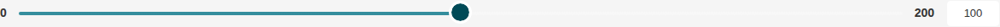
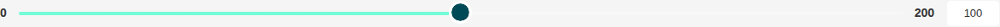
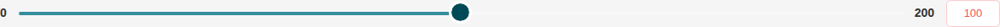
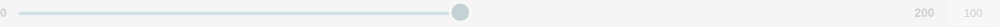

# Range Slider

Storybook title `Components/Range Slider` · source `./src/components/s-range-slider/s-range-slider.stories.tsx`

Tags rendered: `<s-range-slider>`

The s-range-slider component represents a range slider that allows users to select a value within a specified range. It offers a visual slider input and a numerical input for selecting values.

## Props

| Prop | Type / control | Options | Default | Description |
|---|---|---|---|---|
| `value` | number |  | `100` | Slider value |
| `theme` | string | `default`, `secondary` | `default` | Slider theme, you can choose between default and secondary |
| `min` | number |  | `0` | Slider minimum value |
| `max` | number |  | `200` | Slider maximum value |
| `step` | number |  | `1` | Step value for the range slider |
| `disabled` | boolean |  | `false` | Disabled state |
| `hasError` | boolean |  | `false` | Error state |
| `onChange` |  |  |  | Emitted when the value of the range slider changes. |
| `onValueChanged` |  |  |  | Emitted when the value of the range slider changes. Payload includes target, min, max, step, and value. |
| `onchange` |  |  |  | Emitted when the range slider value changes. Provides the new value as a number. |
| `valueChanged` |  |  |  | Emitted when the value of the range slider changes. Provides detailed change information. |

## Stories

### Default

Story id `components-range-slider--default`


Args:

```json
{
  "value": 100,
  "theme": "default",
  "min": 0,
  "max": 200,
  "step": 1,
  "disabled": false,
  "hasError": false
}
```

<details><summary>Rendered markup</summary>

```html
<s-range-slider value="100" theme="default" max="200" step="1" class="w-full s-range-slider ltr hydrated"></s-range-slider>
```

</details>

### Step

Story id `components-range-slider--step`



Args:

```json
{
  "value": 100,
  "theme": "default",
  "min": 0,
  "max": 200,
  "step": 10,
  "disabled": false,
  "hasError": false
}
```

<details><summary>Rendered markup</summary>

```html
<s-range-slider value="100" theme="default" max="200" step="10" class="w-full s-range-slider ltr hydrated"></s-range-slider>
```

</details>

### Secondary Theme

Story id `components-range-slider--secondary-theme`



Args:

```json
{
  "value": 100,
  "theme": "secondary",
  "min": 0,
  "max": 200,
  "step": 1,
  "disabled": false,
  "hasError": false
}
```

<details><summary>Rendered markup</summary>

```html
<s-range-slider value="100" theme="secondary" max="200" step="1" class="w-full s-range-slider ltr hydrated"></s-range-slider>
```

</details>

### Has Error

Story id `components-range-slider--has-error`



Args:

```json
{
  "value": 100,
  "theme": "default",
  "min": 0,
  "max": 200,
  "step": 1,
  "disabled": false,
  "hasError": true
}
```

<details><summary>Rendered markup</summary>

```html
<s-range-slider value="100" theme="default" max="200" step="1" has-error="" class="w-full s-range-slider has-error ltr hydrated"></s-range-slider>
```

</details>

### Disabled

Story id `components-range-slider--disabled`



Args:

```json
{
  "value": 100,
  "theme": "default",
  "min": 0,
  "max": 200,
  "step": 1,
  "disabled": true,
  "hasError": false
}
```

<details><summary>Rendered markup</summary>

```html
<s-range-slider value="100" theme="default" max="200" step="1" disabled="" class="w-full s-range-slider disabled ltr hydrated"></s-range-slider>
```

</details>
