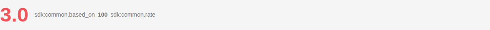
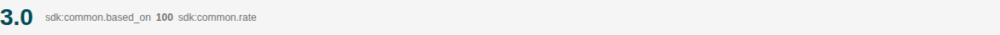

# Rate

Storybook title `Components/Rate` · source `./src/components/s-rate/s-rate.stories.tsx`

Tags rendered: `<s-rate>`

The s-rate component represents a rating system that allows users to provide or view ratings. It supports two icon styles: `star` (classic half-star capable stars) and `emoji` (5 expressive face icons: angry → confused → neutral → happy → star-face). In emoji mode the value is always a whole number (1–5) and the `rateChanged` payload contains the selected emoji icon class instead of maxStars/totalRate.

## Props

| Prop | Type / control | Options | Default | Description |
|---|---|---|---|---|
| `value` | number |  | `3` | Rate value |
| `theme` | string | `default`, `secondary`, `danger`, `warning`, `info` | `default` | Rate theme |
| `hideValue` | boolean |  | `true` | Hide rate value |
| `maxStars` | number |  | `5` | Rate max stars |
| `totalRate` | number |  | `100` | Total rate |
| `readOnly` | boolean |  | `false` | Enable this if you want to make the rate read only |
| `required` | boolean |  |  |  |
| `size` | string | `sm`, `md`, `lg` | `md` | Rate size, you can choose between `sm`, `md` and `lg` |
| `iconStyle` | string | `star`, `emoji` | `star` | Icon style for the rating. `star` uses the classic star icons; `emoji` uses expressive face icons (angry → sad → neutral → happy → star-face). |
| `onRateChanged` |  |  |  | Emitted when the rating value changes. In `star` mode the payload contains `{ value, maxStars, totalRate }`; in `emoji` mode it contains `{ value, emoji }` where `emoji` is the selected HugeIcons class (e.g. `hgi-solid hgi-smile`). |
| `rateChanged` |  |  |  | Emitted when a star or emoji is clicked, providing the new value and mode-specific payload. |

## Stories

### Default

Story id `components-rate--default`


Args:

```json
{
  "value": 3,
  "theme": "default",
  "hideValue": false,
  "maxStars": 5,
  "totalRate": 100,
  "readOnly": false,
  "required": false,
  "size": "md",
  "iconStyle": "star"
}
```

<details><summary>Rendered markup</summary>

```html
<s-rate value="3" theme="default" max-stars="5" total-rate="100" size="md" icon-style="star" class="s-rate s-rate--default s-rate--horizontal ltr md hydrated" id="" name="" layout="horizontal" maxstars="5" totalrate="100" iconstyle="star"></s-rate>
```

</details>

### Read Only

Story id `components-rate--read-only`


Args:

```json
{
  "value": 3,
  "theme": "default",
  "hideValue": false,
  "maxStars": 5,
  "totalRate": 100,
  "readOnly": true,
  "required": false,
  "size": "md",
  "iconStyle": "star"
}
```

<details><summary>Rendered markup</summary>

```html
<s-rate value="3" theme="default" max-stars="5" total-rate="100" read-only="" size="md" icon-style="star" class="s-rate s-rate--default s-rate--horizontal ltr md read-only hydrated" id="" name="" layout="horizontal" maxstars="5" totalrate="100" readonly="" iconstyle="star"></s-rate>
```

</details>

### Hide Value

Story id `components-rate--hide-value`


Args:

```json
{
  "value": 3,
  "theme": "default",
  "hideValue": true,
  "maxStars": 5,
  "totalRate": 100,
  "readOnly": false,
  "required": false,
  "size": "md",
  "iconStyle": "star"
}
```

<details><summary>Rendered markup</summary>

```html
<s-rate value="3" theme="default" hide-value="true" max-stars="5" total-rate="100" size="md" icon-style="star" class="s-rate s-rate--default s-rate--horizontal ltr md hydrated" id="" name="" layout="horizontal" hidevalue="" maxstars="5" totalrate="100" iconstyle="star"></s-rate>
```

</details>

### Warning Theme

Story id `components-rate--warning-theme`


Args:

```json
{
  "value": 3,
  "theme": "warning",
  "hideValue": false,
  "maxStars": 5,
  "totalRate": 100,
  "readOnly": false,
  "required": false,
  "size": "md",
  "iconStyle": "star"
}
```

<details><summary>Rendered markup</summary>

```html
<s-rate value="3" theme="warning" max-stars="5" total-rate="100" size="md" icon-style="star" class="s-rate s-rate--warning s-rate--horizontal ltr md hydrated" id="" name="" layout="horizontal" maxstars="5" totalrate="100" iconstyle="star"></s-rate>
```

</details>

### Danger Theme

Story id `components-rate--danger-theme`



Args:

```json
{
  "value": 3,
  "theme": "danger",
  "hideValue": false,
  "maxStars": 5,
  "totalRate": 100,
  "readOnly": false,
  "required": false,
  "size": "md",
  "iconStyle": "star"
}
```

<details><summary>Rendered markup</summary>

```html
<s-rate value="3" theme="danger" max-stars="5" total-rate="100" size="md" icon-style="star" class="s-rate s-rate--danger s-rate--horizontal ltr md hydrated" id="" name="" layout="horizontal" maxstars="5" totalrate="100" iconstyle="star"></s-rate>
```

</details>

### Large

Story id `components-rate--large`


Args:

```json
{
  "value": 3,
  "theme": "default",
  "hideValue": false,
  "maxStars": 5,
  "totalRate": 100,
  "readOnly": false,
  "required": false,
  "size": "lg",
  "iconStyle": "star"
}
```

<details><summary>Rendered markup</summary>

```html
<s-rate value="3" theme="default" max-stars="5" total-rate="100" size="lg" icon-style="star" class="s-rate s-rate--default s-rate--horizontal ltr lg hydrated" id="" name="" layout="horizontal" maxstars="5" totalrate="100" iconstyle="star"></s-rate>
```

</details>

### Small

Story id `components-rate--small`



Args:

```json
{
  "value": 3,
  "theme": "default",
  "hideValue": false,
  "maxStars": 5,
  "totalRate": 100,
  "readOnly": false,
  "required": false,
  "size": "sm",
  "iconStyle": "star"
}
```

<details><summary>Rendered markup</summary>

```html
<s-rate value="3" theme="default" max-stars="5" total-rate="100" size="sm" icon-style="star" class="s-rate s-rate--default s-rate--horizontal ltr sm hydrated" id="" name="" layout="horizontal" maxstars="5" totalrate="100" iconstyle="star"></s-rate>
```

</details>

### Emoji

Story id `components-rate--emoji`


Args:

```json
{
  "iconStyle": "emoji",
  "value": 4,
  "theme": "default",
  "size": "md",
  "hideValue": false,
  "readOnly": false
}
```

<details><summary>Rendered markup</summary>

```html
<s-rate value="4" theme="default" size="md" icon-style="emoji" class="s-rate s-rate--default s-rate--horizontal s-rate--emoji ltr md hydrated" id="" name="" layout="horizontal" maxstars="5" iconstyle="emoji"></s-rate>
```

</details>

### Emoji Read Only

Story id `components-rate--emoji-read-only`


Args:

```json
{
  "iconStyle": "emoji",
  "value": 3,
  "theme": "default",
  "size": "md",
  "hideValue": false,
  "readOnly": true
}
```

<details><summary>Rendered markup</summary>

```html
<s-rate value="3" theme="default" read-only="" size="md" icon-style="emoji" class="s-rate s-rate--default s-rate--horizontal s-rate--emoji ltr md read-only hydrated" id="" name="" layout="horizontal" maxstars="5" readonly="" iconstyle="emoji"></s-rate>
```

</details>
