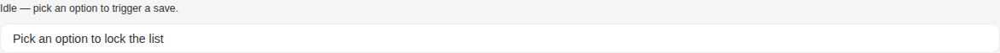
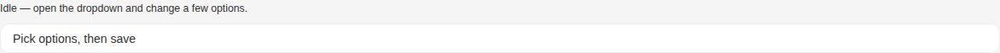

# Select

Storybook title `Components/Select` · source `./src/components/s-select/s-select.stories.tsx`

Tags rendered: `<s-button>`, `<s-select>`

Select component provides a dropdown interface for choosing from a list of options. It supports single and multiple selection, search functionality, grouping, and various customization options.

## Props

| Prop | Type / control | Options | Default | Description |
|---|---|---|---|---|
| `placeholder` | string |  |  | Placeholder text |
| `value` | string |  |  | Selected value(s) |
| `required` | boolean |  |  | Required state |
| `searchable` | boolean |  |  | Enables search functionality |
| `autocomplete` | boolean |  |  | Enables this option to fetch items from server dynamically based on the search query |
| `multiselect` | boolean |  |  | Enables multiple selection mode, you can then choose either tags or count of selected items, count is default |
| `selectAll` | boolean |  |  | Shows a select-all row in the dropdown. Works only when multiselect is enabled. |
| `hasError` | boolean |  |  | Error state |
| `loading` | boolean |  | `false` | Loading state |
| `disabled` | boolean |  | `false` | Disabled state |
| `readonly` | boolean |  | `false` | The value cannot change, but the component stays usable: the dropdown still opens and closes, and the search box still filters. Selecting, select-all, add-new, drawer navigation, the clear button and tag removal are all locked. Use it for async work that must not be interrupted, or for view-only permissions; unlike `disabled`, it never greys out the whole component or force-closes the overlay. |
| `tags` | boolean |  |  | Display selections as tags |
| `hideClearButton` | boolean |  | `false` | Hide the clear button, useful in certain cases |
| `addMissingItem` | boolean |  | `false` | Allow adding new items |
| `confirmable` | boolean |  |  | Buffers the selection behind sticky confirm/cancel actions at the end of the dropdown. No `selectChange` is emitted while the dropdown is open — confirm emits it once (plus `selectConfirm`), cancel emits `selectCancel` and restores the value the dropdown opened with. |
| `overlayAlignment` | string | `start`, `end` | `start` | Horizontal alignment preference for the dropdown overlay |
| `items` | array |  | `[]` | Options for the select |
| `wide` | boolean |  |  | Full width |
| `size` | select | `md`, `lg` |  | Size of the select component |
| `responsive` | boolean |  |  | Responsive mode |
| `sheetTitle` | text |  |  | Optional title shown in the mobile sheet header |
| `confirmLabel` | text |  |  | Label of the confirm action. Defaults to the translated "Save". |
| `cancelLabel` | text |  |  | Label of the cancel action. Defaults to the translated "Cancel". |
| `layout` | select | `default`, `drawer` | `default` | Layout mode for the select dropdown |
| `allowParentSelect` | boolean |  | `true` | When false and layout is drawer, clicking a parent item opens the drawer/toggles children instead of selecting the parent. When true, parent items remain selectable. |
| `searchPlaceholder` | text |  | `undefined` | Search input placeholder |
| `endSlot` | text |  | `undefined` | HTML content to render in the end slot |
| `toggleSlot` | text |  | `undefined` | HTML content to render in the toggle slot. When provided, replaces the default input-wrapper. Element should have data-toggle attribute. |
| `selectChange` |  |  |  | Emitted when the value of the select component changes. |
| `searchValueChange` |  |  |  | Emitted when the search value changes in searchable mode. |
| `optionsChange` |  |  |  | Emitted when the value of options changes. |
| `addNewItem` |  |  |  | Emitted when user clicks to add a missing item. Provides value and searchString. |
| `children` | string |  |  |  |

## Stories

### Default

Story id `components-select--default`


Args:

```json
{
  "placeholder": "Select an option...",
  "value": "",
  "required": false,
  "searchable": false,
  "autocomplete": false,
  "multiselect": false,
  "selectAll": false,
  "hasError": false,
  "loading": false,
  "disabled": false,
  "readonly": false,
  "tags": false,
  "hideClearButton": false,
  "addMissingItem": false,
  "confirmable": false,
  "overlayAlignment": "start",
  "items": [
    {
      "id": 1,
      "type": "option",
      "value": "option1",
      "label": "Option 1",
      "selected": false
    },
    {
      "id": 2,
      "type": "option",
      "value": "option2",
      "label": "Option 2",
      "selected": false
    },
    {
      "id": 3,
      "type": "option",
      "value": "option3",
      "label": "Option 3",
      "selected": true
    },
    {
      "id": 4,
      "type": "option",
      "value": "option4",
      "label": "Option 4",
      "disabled": true,
      "selected": false
    }
  ]
}
```

<details><summary>Rendered markup</summary>

```html
<div style="display: contents;"><div children="[object Object]" style="overflow: hidden;"><s-select class="w-full md ltr hydrated" value=""></s-select></div></div>
```

</details>

### Searchable

Story id `components-select--searchable`


Args:

```json
{
  "placeholder": "Select an option...",
  "value": "",
  "required": false,
  "searchable": true,
  "autocomplete": false,
  "multiselect": false,
  "selectAll": false,
  "hasError": false,
  "loading": false,
  "disabled": false,
  "readonly": false,
  "tags": false,
  "hideClearButton": false,
  "addMissingItem": false,
  "confirmable": false,
  "overlayAlignment": "start",
  "items": [
    {
      "id": 1,
      "type": "option",
      "value": "option1",
      "label": "Option 1",
      "selected": false
    },
    {
      "id": 2,
      "type": "option",
      "value": "option2",
      "label": "Option 2",
      "selected": false
    },
    {
      "id": 3,
      "type": "option",
      "value": "option3",
      "label": "Option 3",
      "selected": true
    },
    {
      "id": 4,
      "type": "option",
      "value": "option4",
      "label": "Option 4",
      "disabled": true,
      "selected": false
    }
  ]
}
```

<details><summary>Rendered markup</summary>

```html
<div style="display: contents;"><div children="[object Object]" style="overflow: hidden;"><s-select class="w-full md ltr hydrated" value=""></s-select></div></div>
```

</details>

### Auto Complete

Story id `components-select--auto-complete`


Args:

```json
{
  "placeholder": "Select an option...",
  "value": "",
  "required": false,
  "searchable": true,
  "autocomplete": true,
  "multiselect": false,
  "selectAll": false,
  "hasError": false,
  "loading": false,
  "disabled": false,
  "readonly": false,
  "tags": false,
  "hideClearButton": false,
  "addMissingItem": false,
  "confirmable": false,
  "overlayAlignment": "start",
  "items": [
    {
      "id": 1,
      "type": "option",
      "value": "option1",
      "label": "Option 1",
      "selected": false
    },
    {
      "id": 2,
      "type": "option",
      "value": "option2",
      "label": "Option 2",
      "selected": false
    },
    {
      "id": 3,
      "type": "option",
      "value": "option3",
      "label": "Option 3",
      "selected": true
    },
    {
      "id": 4,
      "type": "option",
      "value": "option4",
      "label": "Option 4",
      "disabled": true,
      "selected": false
    }
  ]
}
```

<details><summary>Rendered markup</summary>

```html
<div style="display: contents;"><div children="[object Object]" style="overflow: hidden;"><s-select class="w-full md ltr hydrated" value=""></s-select></div></div>
```

</details>

### With End Slot

Story id `components-select--with-end-slot`


Args:

```json
{
  "placeholder": "Select an option...",
  "value": "",
  "required": false,
  "searchable": false,
  "autocomplete": false,
  "multiselect": false,
  "selectAll": false,
  "hasError": false,
  "loading": false,
  "disabled": false,
  "readonly": false,
  "tags": false,
  "hideClearButton": false,
  "addMissingItem": false,
  "confirmable": false,
  "overlayAlignment": "start",
  "items": [
    {
      "id": 1,
      "type": "option",
      "value": "option1",
      "label": "Option 1",
      "selected": false
    },
    {
      "id": 2,
      "type": "option",
      "value": "option2",
      "label": "Option 2",
      "selected": false
    },
    {
      "id": 3,
      "type": "option",
      "value": "option3",
      "label": "Option 3",
      "selected": true
    },
    {
      "id": 4,
      "type": "option",
      "value": "option4",
      "label": "Option 4",
      "disabled": true,
      "selected": false
    }
  ],
  "children": "<s-button slot=\"end\">Action</s-button>"
}
```

<details><summary>Rendered markup</summary>

```html
<div style="display: contents;"><div children="[object Object]" style="overflow: hidden;"><s-select class="w-full md ltr hydrated flex flex-row gap-4" value=""><s-button slot="end" class="s-btn s-btn--default default md ltr hydrated" theme="default" target="_self">Action</s-button></s-select></div></div>
```

</details>

### With End Overlay Alignment

Story id `components-select--with-end-overlay-alignment`


Args:

```json
{
  "placeholder": "Open me near viewport edge",
  "value": "",
  "required": false,
  "searchable": true,
  "autocomplete": false,
  "multiselect": false,
  "selectAll": false,
  "hasError": false,
  "loading": false,
  "disabled": false,
  "readonly": false,
  "tags": false,
  "hideClearButton": false,
  "addMissingItem": false,
  "confirmable": false,
  "overlayAlignment": "end",
  "items": [
    {
      "id": 1,
      "type": "option",
      "value": "option1",
      "label": "Option 1",
      "selected": false
    },
    {
      "id": 2,
      "type": "option",
      "value": "option2",
      "label": "Option 2",
      "selected": false
    },
    {
      "id": 3,
      "type": "option",
      "value": "option3",
      "label": "Option 3",
      "selected": true
    },
    {
      "id": 4,
      "type": "option",
      "value": "option4",
      "label": "Option 4",
      "disabled": true,
      "selected": false
    }
  ]
}
```

<details><summary>Rendered markup</summary>

```html
<div style="display: contents;"><div children="[object Object],[object Object]" style="overflow: hidden; width: 100%; display: flex; justify-content: flex-end;"><style children="
          #alignment-demo::part(overlay) {
            min-width: 14rem !important;
            max-width: max-content !important;
          }
        ">
          #alignment-demo::part(overlay) {
            min-width: 14rem !important;
            max-width: max-content !important;
          }
        </style><s-select id="alignment-demo" style="width: 12rem;" class="w-full md ltr hydrated" value=""></s-select></div></div>
```

</details>

### With Toggle Slot

Story id `components-select--with-toggle-slot`


Args:

```json
{
  "placeholder": "Select an option...",
  "value": "",
  "required": false,
  "searchable": true,
  "autocomplete": false,
  "multiselect": true,
  "selectAll": false,
  "hasError": false,
  "loading": false,
  "disabled": false,
  "readonly": false,
  "tags": false,
  "hideClearButton": false,
  "addMissingItem": false,
  "confirmable": false,
  "overlayAlignment": "start",
  "items": [
    {
      "id": 1,
      "type": "option",
      "value": "option1",
      "label": "Option 1",
      "selected": false
    },
    {
      "id": 2,
      "type": "option",
      "value": "option2",
      "label": "Option 2",
      "selected": false
    },
    {
      "id": 3,
      "type": "option",
      "value": "option3",
      "label": "Option 3",
      "selected": true
    },
    {
      "id": 4,
      "type": "option",
      "value": "option4",
      "label": "Option 4",
      "disabled": true,
      "selected": false
    }
  ],
  "children": "<s-button slot=\"toggle\" data-toggle size=\"sm\">Select Option</s-button>"
}
```

<details><summary>Rendered markup</summary>

```html
<div style="display: contents;"><div children="[object Object]" style="overflow: hidden;"><s-select class="w-fit md ltr hydrated" value=""><s-button slot="toggle" data-toggle="" size="sm" class="s-btn s-btn--default default sm ltr hydrated" theme="default" target="_self">Select Option</s-button></s-select></div></div>
```

</details>

### With Groups And Thumbnails

Story id `components-select--with-groups-and-thumbnails`


Args:

```json
{
  "placeholder": "Select an option...",
  "value": "",
  "required": false,
  "searchable": false,
  "autocomplete": false,
  "multiselect": false,
  "selectAll": false,
  "hasError": false,
  "loading": false,
  "disabled": false,
  "readonly": false,
  "tags": false,
  "hideClearButton": false,
  "addMissingItem": false,
  "confirmable": false,
  "overlayAlignment": "start",
  "items": [
    {
      "id": "1",
      "type": "title",
      "value": "group1",
      "label": "Team Members"
    },
    {
      "id": "2",
      "type": "option",
      "value": "user1",
      "label": "John Doe",
      "desc": "Frontend Developer",
      "icon": "https://i.pravatar.cc/50?img=1",
      "selected": false
    },
    {
      "id": "3",
      "type": "option",
      "value": "user2",
      "label": "Jane Smith",
      "desc": "UI/UX Designer",
      "icon": "https://i.pravatar.cc/50?img=2",
      "selected": false
    },
    {
      "id": "4",
      "type": "title",
      "value": "group2",
      "label": "Management"
    },
    {
      "id": "5",
      "type": "option",
      "value": "user3",
      "label": "Mike Johnson",
      "desc": "Project Manager",
      "icon": "https://i.pravatar.cc/50?img=3",
      "selected": true
    },
    {
      "id": "6",
      "type": "option",
      "value": "user4",
      "label": "Sarah Wilson",
      "desc": "Team Lead",
      "icon": "https://i.pravatar.cc/50?img=4",
      "disabled": true,
      "selected": false
    }
  ]
}
```

<details><summary>Rendered markup</summary>

```html
<div style="display: contents;"><div children="[object Object]" style="overflow: hidden;"><s-select class="w-full md ltr hydrated" value=""></s-select></div></div>
```

</details>

### Nested Options

Story id `components-select--nested-options`


Args:

```json
{
  "placeholder": "Select categories",
  "value": [
    "laptops",
    "kitchen"
  ],
  "required": false,
  "searchable": true,
  "autocomplete": false,
  "multiselect": true,
  "selectAll": false,
  "hasError": false,
  "loading": false,
  "disabled": false,
  "readonly": false,
  "tags": true,
  "hideClearButton": false,
  "addMissingItem": false,
  "confirmable": false,
  "overlayAlignment": "start",
  "items": [
    {
      "id": "cat-1",
      "type": "option",
      "value": "electronics",
      "label": "Electronics",
      "children": [
        {
          "id": "cat-1-1",
          "type": "option",
          "value": "computers",
          "label": "Computers",
          "children": [
            {
              "id": "cat-1-1-1",
              "type": "option",
              "value": "laptops",
              "label": "Laptops"
            },
            {
              "id": "cat-1-1-2",
              "type": "option",
              "value": "desktops",
              "label": "Desktops"
            }
          ]
        },
        {
          "id": "cat-1-2",
          "type": "option",
          "value": "phones",
          "label": "Phones",
          "children": [
            {
              "id": "cat-1-2-1",
              "type": "option",
              "value": "android",
              "label": "Android"
            },
            {
              "id": "cat-1-2-2",
              "type": "option",
              "value": "ios",
              "label": "iOS",
              "disabled": true
            }
          ]
        }
      ]
    },
    {
      "id": "cat-2",
      "type": "option",
      "value": "home",
      "label": "Home & Garden",
      "children": [
        {
          "id": "cat-2-1",
          "type": "option",
          "value": "kitchen",
          "label": "Kitchen"
        },
        {
          "id": "cat-2-2",
          "type": "option",
          "value": "furniture",
          "label": "Furniture"
        }
      ]
    },
    {
      "id": "cat-3",
      "type": "option",
      "value": "gift-cards",
      "label": "Gift Cards"
    }
  ]
}
```

<details><summary>Rendered markup</summary>

```html
<div style="display: contents;"><div children="[object Object]" style="overflow: hidden;"><s-select class="w-full md ltr hydrated"></s-select></div></div>
```

</details>

### Drawer Layout

Story id `components-select--drawer-layout`


Args:

```json
{
  "placeholder": "Select an option...",
  "value": "",
  "required": false,
  "searchable": false,
  "autocomplete": false,
  "multiselect": false,
  "selectAll": false,
  "hasError": false,
  "loading": false,
  "disabled": false,
  "readonly": false,
  "tags": false,
  "hideClearButton": false,
  "addMissingItem": false,
  "confirmable": false,
  "overlayAlignment": "start",
  "items": [
    {
      "id": 1,
      "type": "option",
      "value": "option1",
      "label": "Option 1",
      "selected": false
    },
    {
      "id": 2,
      "type": "option",
      "value": "option2",
      "label": "Option 2",
      "selected": false
    },
    {
      "id": 3,
      "type": "option",
      "value": "option3",
      "label": "Option 3",
      "selected": true
    },
    {
      "id": 4,
      "type": "option",
      "value": "option4",
      "label": "Option 4",
      "disabled": true,
      "selected": false
    }
  ]
}
```

<details><summary>Rendered markup</summary>

```html
<div style="overflow: hidden;"><s-select class="s-select-drawer w-full md ltr hydrated" value=""></s-select></div>
```

</details>

### Drawer Layout No Parent Select

Story id `components-select--drawer-layout-no-parent-select`


Args:

```json
{
  "placeholder": "Select an option...",
  "value": "",
  "required": false,
  "searchable": false,
  "autocomplete": false,
  "multiselect": false,
  "selectAll": false,
  "hasError": false,
  "loading": false,
  "disabled": false,
  "readonly": false,
  "tags": false,
  "hideClearButton": false,
  "addMissingItem": false,
  "confirmable": false,
  "overlayAlignment": "start",
  "items": [
    {
      "id": 1,
      "type": "option",
      "value": "option1",
      "label": "Option 1",
      "selected": false
    },
    {
      "id": 2,
      "type": "option",
      "value": "option2",
      "label": "Option 2",
      "selected": false
    },
    {
      "id": 3,
      "type": "option",
      "value": "option3",
      "label": "Option 3",
      "selected": true
    },
    {
      "id": 4,
      "type": "option",
      "value": "option4",
      "label": "Option 4",
      "disabled": true,
      "selected": false
    }
  ]
}
```

<details><summary>Rendered markup</summary>

```html
<div style="overflow: hidden;"><s-select class="s-select-drawer w-full md ltr hydrated" value=""></s-select></div>
```

</details>

### Nested With Child Icons

Story id `components-select--nested-with-child-icons`


Args:

```json
{
  "placeholder": "Select an option...",
  "value": "",
  "required": false,
  "searchable": false,
  "autocomplete": false,
  "multiselect": false,
  "selectAll": false,
  "hasError": false,
  "loading": false,
  "disabled": false,
  "readonly": false,
  "tags": false,
  "hideClearButton": false,
  "addMissingItem": false,
  "confirmable": false,
  "overlayAlignment": "start",
  "items": [
    {
      "id": 1,
      "type": "option",
      "value": "option1",
      "label": "Option 1",
      "selected": false
    },
    {
      "id": 2,
      "type": "option",
      "value": "option2",
      "label": "Option 2",
      "selected": false
    },
    {
      "id": 3,
      "type": "option",
      "value": "option3",
      "label": "Option 3",
      "selected": true
    },
    {
      "id": 4,
      "type": "option",
      "value": "option4",
      "label": "Option 4",
      "disabled": true,
      "selected": false
    }
  ]
}
```

<details><summary>Rendered markup</summary>

```html
<div style="overflow: hidden;"><s-select class="w-full md ltr hydrated" value="short-text"></s-select></div>
```

</details>

### Multi Select

Story id `components-select--multi-select`


Args:

```json
{
  "placeholder": "Select an option...",
  "value": "",
  "required": false,
  "searchable": false,
  "autocomplete": false,
  "multiselect": true,
  "selectAll": false,
  "hasError": false,
  "loading": false,
  "disabled": false,
  "readonly": false,
  "tags": false,
  "hideClearButton": false,
  "addMissingItem": false,
  "confirmable": false,
  "overlayAlignment": "start",
  "items": [
    {
      "id": 1,
      "type": "option",
      "value": "option1",
      "label": "Option 1",
      "selected": false
    },
    {
      "id": 2,
      "type": "option",
      "value": "option2",
      "label": "Option 2",
      "selected": false
    },
    {
      "id": 3,
      "type": "option",
      "value": "option3",
      "label": "Option 3",
      "selected": true
    },
    {
      "id": 4,
      "type": "option",
      "value": "option4",
      "label": "Option 4",
      "disabled": true,
      "selected": false
    }
  ]
}
```

<details><summary>Rendered markup</summary>

```html
<div style="display: contents;"><div children="[object Object]" style="overflow: hidden;"><s-select class="w-full md ltr hydrated" value=""></s-select></div></div>
```

</details>

### Multi Select Tags Layout

Story id `components-select--multi-select-tags-layout`


Args:

```json
{
  "placeholder": "Select an option...",
  "value": "",
  "required": false,
  "searchable": false,
  "autocomplete": false,
  "multiselect": true,
  "selectAll": false,
  "hasError": false,
  "loading": false,
  "disabled": false,
  "readonly": false,
  "tags": true,
  "hideClearButton": false,
  "addMissingItem": false,
  "confirmable": false,
  "overlayAlignment": "start",
  "items": [
    {
      "id": 1,
      "type": "option",
      "value": "option1",
      "label": "Option 1",
      "selected": false
    },
    {
      "id": 2,
      "type": "option",
      "value": "option2",
      "label": "Option 2",
      "selected": false
    },
    {
      "id": 3,
      "type": "option",
      "value": "option3",
      "label": "Option 3",
      "selected": true
    },
    {
      "id": 4,
      "type": "option",
      "value": "option4",
      "label": "Option 4",
      "disabled": true,
      "selected": false
    }
  ]
}
```

<details><summary>Rendered markup</summary>

```html
<div style="display: contents;"><div children="[object Object]" style="overflow: hidden;"><s-select class="w-full md ltr hydrated" value=""></s-select></div></div>
```

</details>

### Multi Select With Select All

Story id `components-select--multi-select-with-select-all`


Args:

```json
{
  "placeholder": "Select multiple options",
  "value": "",
  "required": false,
  "searchable": true,
  "autocomplete": false,
  "multiselect": true,
  "selectAll": true,
  "hasError": false,
  "loading": false,
  "disabled": false,
  "readonly": false,
  "tags": true,
  "hideClearButton": false,
  "addMissingItem": false,
  "confirmable": false,
  "overlayAlignment": "start",
  "items": [
    {
      "id": "sa-1",
      "type": "option",
      "value": "apple",
      "label": "Apple"
    },
    {
      "id": "sa-2",
      "type": "option",
      "value": "banana",
      "label": "Banana"
    },
    {
      "id": "sa-3",
      "type": "option",
      "value": "orange",
      "label": "Orange"
    },
    {
      "id": "sa-4",
      "type": "option",
      "value": "grape",
      "label": "Grape",
      "disabled": true
    }
  ]
}
```

<details><summary>Rendered markup</summary>

```html
<div style="display: contents;"><div children="[object Object]" style="overflow: hidden;"><s-select class="w-full md ltr hydrated" value=""></s-select></div></div>
```

</details>

### Add Missing Item

Story id `components-select--add-missing-item`


Args:

```json
{
  "placeholder": "Select an option...",
  "value": "",
  "required": false,
  "searchable": true,
  "autocomplete": false,
  "multiselect": true,
  "selectAll": false,
  "hasError": false,
  "loading": false,
  "disabled": false,
  "readonly": false,
  "tags": false,
  "hideClearButton": false,
  "addMissingItem": true,
  "confirmable": false,
  "overlayAlignment": "start",
  "items": [
    {
      "id": 1,
      "type": "option",
      "value": "option1",
      "label": "Option 1",
      "selected": false
    },
    {
      "id": 2,
      "type": "option",
      "value": "option2",
      "label": "Option 2",
      "selected": false
    },
    {
      "id": 3,
      "type": "option",
      "value": "option3",
      "label": "Option 3",
      "selected": true
    },
    {
      "id": 4,
      "type": "option",
      "value": "option4",
      "label": "Option 4",
      "disabled": true,
      "selected": false
    }
  ]
}
```

<details><summary>Rendered markup</summary>

```html
<div style="display: contents;"><div children="[object Object]" style="overflow: hidden;"><s-select class="w-full md ltr hydrated" value=""></s-select></div></div>
```

</details>

### Hide Clear Button

Story id `components-select--hide-clear-button`


Args:

```json
{
  "placeholder": "Select an option...",
  "value": "",
  "required": false,
  "searchable": false,
  "autocomplete": false,
  "multiselect": true,
  "selectAll": false,
  "hasError": false,
  "loading": false,
  "disabled": false,
  "readonly": false,
  "tags": true,
  "hideClearButton": true,
  "addMissingItem": false,
  "confirmable": false,
  "overlayAlignment": "start",
  "items": [
    {
      "id": 1,
      "type": "option",
      "value": "option1",
      "label": "Option 1",
      "selected": false
    },
    {
      "id": 2,
      "type": "option",
      "value": "option2",
      "label": "Option 2",
      "selected": false
    },
    {
      "id": 3,
      "type": "option",
      "value": "option3",
      "label": "Option 3",
      "selected": true
    },
    {
      "id": 4,
      "type": "option",
      "value": "option4",
      "label": "Option 4",
      "disabled": true,
      "selected": false
    }
  ]
}
```

<details><summary>Rendered markup</summary>

```html
<div style="display: contents;"><div children="[object Object]" style="overflow: hidden;"><s-select class="w-full md ltr hydrated" value=""></s-select></div></div>
```

</details>

### Loading

Story id `components-select--loading`


Args:

```json
{
  "placeholder": "Select an option...",
  "value": "",
  "required": false,
  "searchable": false,
  "autocomplete": false,
  "multiselect": false,
  "selectAll": false,
  "hasError": false,
  "loading": true,
  "disabled": false,
  "readonly": false,
  "tags": false,
  "hideClearButton": false,
  "addMissingItem": false,
  "confirmable": false,
  "overlayAlignment": "start",
  "items": [
    {
      "id": 1,
      "type": "option",
      "value": "option1",
      "label": "Option 1",
      "selected": false
    },
    {
      "id": 2,
      "type": "option",
      "value": "option2",
      "label": "Option 2",
      "selected": false
    },
    {
      "id": 3,
      "type": "option",
      "value": "option3",
      "label": "Option 3",
      "selected": true
    },
    {
      "id": 4,
      "type": "option",
      "value": "option4",
      "label": "Option 4",
      "disabled": true,
      "selected": false
    }
  ]
}
```

<details><summary>Rendered markup</summary>

```html
<div style="display: contents;"><div children="[object Object]" style="overflow: hidden;"><s-select class="loading w-full md ltr hydrated" value=""></s-select></div></div>
```

</details>

### Has Error

Story id `components-select--has-error`


Args:

```json
{
  "placeholder": "Select an option...",
  "value": "",
  "required": false,
  "searchable": false,
  "autocomplete": false,
  "multiselect": false,
  "selectAll": false,
  "hasError": true,
  "loading": false,
  "disabled": false,
  "readonly": false,
  "tags": false,
  "hideClearButton": false,
  "addMissingItem": false,
  "confirmable": false,
  "overlayAlignment": "start",
  "items": [
    {
      "id": 1,
      "type": "option",
      "value": "option1",
      "label": "Option 1",
      "selected": false
    },
    {
      "id": 2,
      "type": "option",
      "value": "option2",
      "label": "Option 2",
      "selected": false
    },
    {
      "id": 3,
      "type": "option",
      "value": "option3",
      "label": "Option 3",
      "selected": true
    },
    {
      "id": 4,
      "type": "option",
      "value": "option4",
      "label": "Option 4",
      "disabled": true,
      "selected": false
    }
  ]
}
```

<details><summary>Rendered markup</summary>

```html
<div style="display: contents;"><div children="[object Object]" style="overflow: hidden;"><s-select class="has-error w-full md ltr hydrated" value=""></s-select></div></div>
```

</details>

### Disabled

Story id `components-select--disabled`


Args:

```json
{
  "placeholder": "Select an option...",
  "value": "",
  "required": false,
  "searchable": false,
  "autocomplete": false,
  "multiselect": false,
  "selectAll": false,
  "hasError": false,
  "loading": false,
  "disabled": true,
  "readonly": false,
  "tags": false,
  "hideClearButton": false,
  "addMissingItem": false,
  "confirmable": false,
  "overlayAlignment": "start",
  "items": [
    {
      "id": 1,
      "type": "option",
      "value": "option1",
      "label": "Option 1",
      "selected": false
    },
    {
      "id": 2,
      "type": "option",
      "value": "option2",
      "label": "Option 2",
      "selected": false
    },
    {
      "id": 3,
      "type": "option",
      "value": "option3",
      "label": "Option 3",
      "selected": true
    },
    {
      "id": 4,
      "type": "option",
      "value": "option4",
      "label": "Option 4",
      "disabled": true,
      "selected": false
    }
  ]
}
```

<details><summary>Rendered markup</summary>

```html
<div style="display: contents;"><div children="[object Object]" style="overflow: hidden;"><s-select class="w-full disabled md ltr hydrated" value=""></s-select></div></div>
```

</details>

### Disabled Item

Story id `components-select--disabled-item`


Args:

```json
{
  "placeholder": "Select an option...",
  "value": "",
  "required": false,
  "searchable": false,
  "autocomplete": false,
  "multiselect": false,
  "selectAll": false,
  "hasError": false,
  "loading": false,
  "disabled": false,
  "readonly": false,
  "tags": false,
  "hideClearButton": false,
  "addMissingItem": false,
  "confirmable": false,
  "overlayAlignment": "start",
  "items": [
    {
      "id": "opt-1",
      "type": "option",
      "value": "opt-1",
      "label": "Enabled 1",
      "selected": false
    },
    {
      "id": "opt-2",
      "type": "option",
      "value": "opt-2",
      "label": "Disabled option",
      "selected": false,
      "disabled": true
    },
    {
      "id": "opt-3",
      "type": "option",
      "value": "opt-3",
      "label": "Enabled 2",
      "selected": false
    }
  ]
}
```

<details><summary>Rendered markup</summary>

```html
<div style="display: contents;"><div children="[object Object]" style="overflow: hidden;"><s-select class="w-full md ltr hydrated" value=""></s-select></div></div>
```

</details>

### Disabled Nested Item

Story id `components-select--disabled-nested-item`


Args:

```json
{
  "placeholder": "Select an option...",
  "value": "",
  "required": false,
  "searchable": false,
  "autocomplete": false,
  "multiselect": false,
  "selectAll": false,
  "hasError": false,
  "loading": false,
  "disabled": false,
  "readonly": false,
  "tags": false,
  "hideClearButton": false,
  "addMissingItem": false,
  "confirmable": false,
  "overlayAlignment": "start",
  "items": [
    {
      "id": "grp-1",
      "type": "option",
      "value": "electronics",
      "label": "Electronics",
      "children": [
        {
          "id": "grp-1-1",
          "type": "option",
          "value": "laptops",
          "label": "Laptops"
        },
        {
          "id": "grp-1-2",
          "type": "option",
          "value": "phones-legacy",
          "label": "Phones (out of stock)",
          "disabled": true
        }
      ]
    },
    {
      "id": "grp-2",
      "type": "option",
      "value": "clothing",
      "label": "Clothing",
      "disabled": true,
      "children": [
        {
          "id": "grp-2-1",
          "type": "option",
          "value": "shirts",
          "label": "Shirts"
        },
        {
          "id": "grp-2-2",
          "type": "option",
          "value": "pants",
          "label": "Pants"
        }
      ]
    }
  ]
}
```

<details><summary>Rendered markup</summary>

```html
<div style="display: contents;"><div children="[object Object]" style="overflow: hidden;"><s-select class="w-full md ltr hydrated" value=""></s-select></div></div>
```

</details>

### Disabled Item Multiselect

Story id `components-select--disabled-item-multiselect`


Args:

```json
{
  "placeholder": "Select an option...",
  "value": "",
  "required": false,
  "searchable": false,
  "autocomplete": false,
  "multiselect": true,
  "selectAll": true,
  "hasError": false,
  "loading": false,
  "disabled": false,
  "readonly": false,
  "tags": false,
  "hideClearButton": false,
  "addMissingItem": false,
  "confirmable": false,
  "overlayAlignment": "start",
  "items": [
    {
      "id": "m-1",
      "type": "option",
      "value": "m-1",
      "label": "Selectable A"
    },
    {
      "id": "m-2",
      "type": "option",
      "value": "m-2",
      "label": "Locked (disabled)",
      "disabled": true
    },
    {
      "id": "m-3",
      "type": "option",
      "value": "m-3",
      "label": "Selectable B"
    }
  ]
}
```

<details><summary>Rendered markup</summary>

```html
<div style="display: contents;"><div children="[object Object]" style="overflow: hidden;"><s-select class="w-full md ltr hydrated" value=""></s-select></div></div>
```

</details>

### Readonly

Story id `components-select--readonly`


Args:

```json
{
  "placeholder": "Open me — the list is locked",
  "value": "",
  "required": false,
  "searchable": false,
  "autocomplete": false,
  "multiselect": false,
  "selectAll": false,
  "hasError": false,
  "loading": false,
  "disabled": false,
  "readonly": true,
  "tags": false,
  "hideClearButton": false,
  "addMissingItem": false,
  "confirmable": false,
  "overlayAlignment": "start",
  "items": [
    {
      "id": 1,
      "type": "option",
      "value": "option1",
      "label": "Option 1",
      "selected": false
    },
    {
      "id": 2,
      "type": "option",
      "value": "option2",
      "label": "Option 2",
      "selected": false
    },
    {
      "id": 3,
      "type": "option",
      "value": "option3",
      "label": "Option 3",
      "selected": true
    },
    {
      "id": 4,
      "type": "option",
      "value": "option4",
      "label": "Option 4",
      "disabled": true,
      "selected": false
    }
  ]
}
```

<details><summary>Rendered markup</summary>

```html
<div style="display: contents;"><div children="[object Object]" style="overflow: hidden;"><s-select class="w-full md ltr hydrated" value=""></s-select></div></div>
```

</details>

### Readonly Searchable

Story id `components-select--readonly-searchable`


Args:

```json
{
  "placeholder": "Searchable + locked list",
  "value": "",
  "required": false,
  "searchable": true,
  "autocomplete": false,
  "multiselect": false,
  "selectAll": false,
  "hasError": false,
  "loading": false,
  "disabled": false,
  "readonly": true,
  "tags": false,
  "hideClearButton": false,
  "addMissingItem": true,
  "confirmable": false,
  "overlayAlignment": "start",
  "items": [
    {
      "id": 1,
      "type": "option",
      "value": "option1",
      "label": "Option 1",
      "selected": false
    },
    {
      "id": 2,
      "type": "option",
      "value": "option2",
      "label": "Option 2",
      "selected": false
    },
    {
      "id": 3,
      "type": "option",
      "value": "option3",
      "label": "Option 3",
      "selected": true
    },
    {
      "id": 4,
      "type": "option",
      "value": "option4",
      "label": "Option 4",
      "disabled": true,
      "selected": false
    }
  ],
  "searchPlaceholder": "Search still works"
}
```

<details><summary>Rendered markup</summary>

```html
<div style="display: contents;"><div children="[object Object]" style="overflow: hidden;"><s-select class="w-full md ltr hydrated" value=""></s-select></div></div>
```

</details>

### Readonly Multiselect

Story id `components-select--readonly-multiselect`


Args:

```json
{
  "placeholder": "Select an option...",
  "value": [
    "m-1"
  ],
  "required": false,
  "searchable": true,
  "autocomplete": false,
  "multiselect": true,
  "selectAll": true,
  "hasError": false,
  "loading": false,
  "disabled": false,
  "readonly": true,
  "tags": true,
  "hideClearButton": false,
  "addMissingItem": false,
  "confirmable": false,
  "overlayAlignment": "start",
  "items": [
    {
      "id": "m-1",
      "type": "option",
      "value": "m-1",
      "label": "Selectable A"
    },
    {
      "id": "m-2",
      "type": "option",
      "value": "m-2",
      "label": "Locked (disabled)",
      "disabled": true
    },
    {
      "id": "m-3",
      "type": "option",
      "value": "m-3",
      "label": "Selectable B"
    }
  ]
}
```

<details><summary>Rendered markup</summary>

```html
<div style="display: contents;"><div children="[object Object]" style="overflow: hidden;"><s-select class="w-full md ltr hydrated"></s-select></div></div>
```

</details>

### Readonly Nested

Story id `components-select--readonly-nested`


Args:

```json
{
  "placeholder": "Nested options — locked",
  "value": "",
  "required": false,
  "searchable": false,
  "autocomplete": false,
  "multiselect": true,
  "selectAll": false,
  "hasError": false,
  "loading": false,
  "disabled": false,
  "readonly": true,
  "tags": true,
  "hideClearButton": false,
  "addMissingItem": false,
  "confirmable": false,
  "overlayAlignment": "start",
  "items": [
    {
      "id": "cat-1",
      "type": "option",
      "value": "electronics",
      "label": "Electronics",
      "children": [
        {
          "id": "cat-1-1",
          "type": "option",
          "value": "computers",
          "label": "Computers",
          "children": [
            {
              "id": "cat-1-1-1",
              "type": "option",
              "value": "laptops",
              "label": "Laptops"
            },
            {
              "id": "cat-1-1-2",
              "type": "option",
              "value": "desktops",
              "label": "Desktops"
            }
          ]
        },
        {
          "id": "cat-1-2",
          "type": "option",
          "value": "phones",
          "label": "Phones",
          "children": [
            {
              "id": "cat-1-2-1",
              "type": "option",
              "value": "android",
              "label": "Android"
            },
            {
              "id": "cat-1-2-2",
              "type": "option",
              "value": "ios",
              "label": "iOS",
              "disabled": true
            }
          ]
        }
      ]
    },
    {
      "id": "cat-2",
      "type": "option",
      "value": "home",
      "label": "Home & Garden",
      "children": [
        {
          "id": "cat-2-1",
          "type": "option",
          "value": "kitchen",
          "label": "Kitchen"
        },
        {
          "id": "cat-2-2",
          "type": "option",
          "value": "furniture",
          "label": "Furniture"
        }
      ]
    },
    {
      "id": "cat-3",
      "type": "option",
      "value": "gift-cards",
      "label": "Gift Cards"
    }
  ]
}
```

<details><summary>Rendered markup</summary>

```html
<div style="display: contents;"><div children="[object Object]" style="overflow: hidden;"><s-select class="w-full md ltr hydrated" value=""></s-select></div></div>
```

</details>

### Readonly Drawer

Story id `components-select--readonly-drawer`


Args:

```json
{
  "placeholder": "Select an option...",
  "value": "",
  "required": false,
  "searchable": false,
  "autocomplete": false,
  "multiselect": false,
  "selectAll": false,
  "hasError": false,
  "loading": false,
  "disabled": false,
  "readonly": false,
  "tags": false,
  "hideClearButton": false,
  "addMissingItem": false,
  "confirmable": false,
  "overlayAlignment": "start",
  "items": [
    {
      "id": 1,
      "type": "option",
      "value": "option1",
      "label": "Option 1",
      "selected": false
    },
    {
      "id": 2,
      "type": "option",
      "value": "option2",
      "label": "Option 2",
      "selected": false
    },
    {
      "id": 3,
      "type": "option",
      "value": "option3",
      "label": "Option 3",
      "selected": true
    },
    {
      "id": 4,
      "type": "option",
      "value": "option4",
      "label": "Option 4",
      "disabled": true,
      "selected": false
    }
  ]
}
```

<details><summary>Rendered markup</summary>

```html
<div style="overflow: hidden;"><s-select class="s-select-drawer w-full md ltr hydrated" value=""></s-select></div>
```

</details>

### Readonly While Saving

Story id `components-select--readonly-while-saving`



Args:

```json
{
  "placeholder": "Select an option...",
  "value": "",
  "required": false,
  "searchable": false,
  "autocomplete": false,
  "multiselect": false,
  "selectAll": false,
  "hasError": false,
  "loading": false,
  "disabled": false,
  "readonly": false,
  "tags": false,
  "hideClearButton": false,
  "addMissingItem": false,
  "confirmable": false,
  "overlayAlignment": "start",
  "items": [
    {
      "id": 1,
      "type": "option",
      "value": "option1",
      "label": "Option 1",
      "selected": false
    },
    {
      "id": 2,
      "type": "option",
      "value": "option2",
      "label": "Option 2",
      "selected": false
    },
    {
      "id": 3,
      "type": "option",
      "value": "option3",
      "label": "Option 3",
      "selected": true
    },
    {
      "id": 4,
      "type": "option",
      "value": "option4",
      "label": "Option 4",
      "disabled": true,
      "selected": false
    }
  ]
}
```

<details><summary>Rendered markup</summary>

```html
<div style="overflow: hidden;"><p style="margin: 0px 0px 0.5rem; font-size: 0.875rem;">Idle — pick an option to trigger a save.</p><s-select class="w-full md ltr hydrated" value=""></s-select></div>
```

</details>

### Confirmable Actions

Story id `components-select--confirmable-actions`



Args:

```json
{
  "placeholder": "Select an option...",
  "value": "",
  "required": false,
  "searchable": false,
  "autocomplete": false,
  "multiselect": false,
  "selectAll": false,
  "hasError": false,
  "loading": false,
  "disabled": false,
  "readonly": false,
  "tags": false,
  "hideClearButton": false,
  "addMissingItem": false,
  "confirmable": false,
  "overlayAlignment": "start",
  "items": [
    {
      "id": 1,
      "type": "option",
      "value": "option1",
      "label": "Option 1",
      "selected": false
    },
    {
      "id": 2,
      "type": "option",
      "value": "option2",
      "label": "Option 2",
      "selected": false
    },
    {
      "id": 3,
      "type": "option",
      "value": "option3",
      "label": "Option 3",
      "selected": true
    },
    {
      "id": 4,
      "type": "option",
      "value": "option4",
      "label": "Option 4",
      "disabled": true,
      "selected": false
    }
  ]
}
```

<details><summary>Rendered markup</summary>

```html
<div style="overflow: hidden;"><p style="margin: 0px 0px 0.5rem; font-size: 0.875rem;">Idle — open the dropdown and change a few options.</p><s-select class="w-full md ltr hydrated" value=""></s-select></div>
```

</details>
