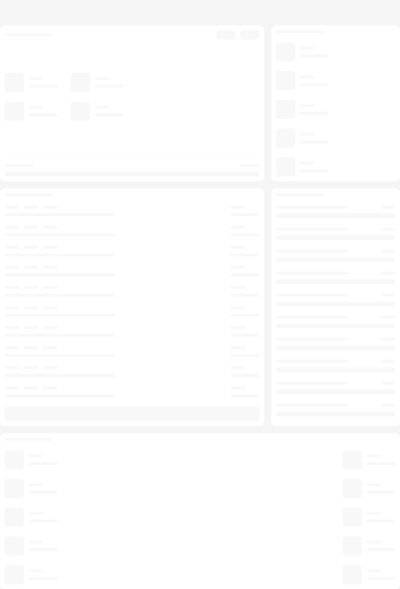
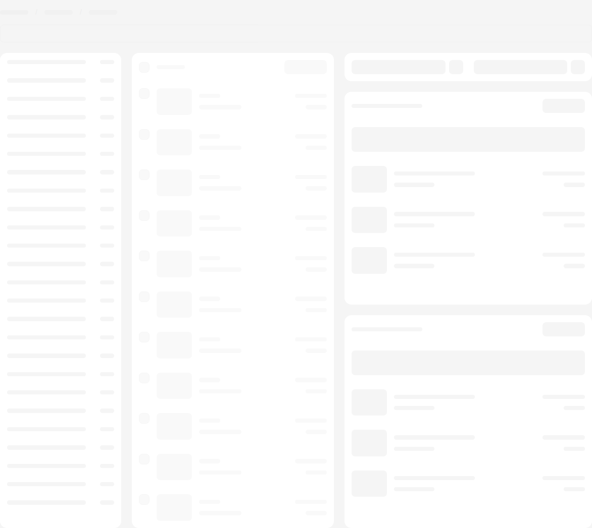
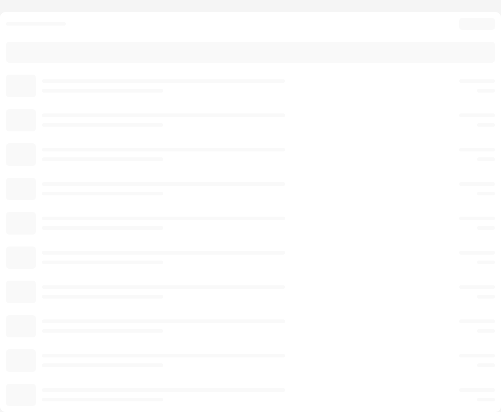

# Skeleton

Storybook title `Components/Skeleton` · source `./src/components/s-skeleton/s-skeleton.stories.tsx`

Tags rendered: `<s-skeleton>`

The Skeleton component provides loading placeholders that mimic the structure of content while it's being loaded.

## Props

| Prop | Type / control | Options | Default | Description |
|---|---|---|---|---|
| `layout` | string | `inline`, `list-entry`, `article`, `rich-content`, `cart`, `checkout`, `table`, `settings`, `header`, `home-page`, `resource-page`, `sections-page`, `iframe-page` | `inline` | Skeleton layout |

## Stories

### Default

Story id `components-skeleton--default`


Args:

```json
{
  "layout": "inline"
}
```

<details><summary>Rendered markup</summary>

```html
<s-skeleton layout="inline" role="status" class="s-skeleton s-skeleton--inline hydrated"></s-skeleton>
```

</details>

### Inline

Story id `components-skeleton--inline`


Args:

```json
{
  "layout": "inline"
}
```

<details><summary>Rendered markup</summary>

```html
<s-skeleton layout="inline" role="status" class="s-skeleton s-skeleton--inline hydrated"></s-skeleton>
```

</details>

### List Entry

Story id `components-skeleton--list-entry`


Args:

```json
{
  "layout": "list-entry"
}
```

<details><summary>Rendered markup</summary>

```html
<s-skeleton layout="list-entry" role="status" class="s-skeleton s-skeleton--list-entry hydrated"></s-skeleton>
```

</details>

### Article

Story id `components-skeleton--article`


Args:

```json
{
  "layout": "article"
}
```

<details><summary>Rendered markup</summary>

```html
<s-skeleton layout="article" role="status" class="s-skeleton s-skeleton--article hydrated"></s-skeleton>
```

</details>

### Rich Content

Story id `components-skeleton--rich-content`


Args:

```json
{
  "layout": "rich-content"
}
```

<details><summary>Rendered markup</summary>

```html
<s-skeleton layout="rich-content" role="status" class="s-skeleton s-skeleton--rich-content hydrated"></s-skeleton>
```

</details>

### Cart Content

Story id `components-skeleton--cart-content`


Args:

```json
{
  "layout": "cart"
}
```

<details><summary>Rendered markup</summary>

```html
<s-skeleton layout="cart" role="status" class="s-skeleton s-skeleton--cart hydrated"></s-skeleton>
```

</details>

### Checkout

Story id `components-skeleton--checkout`


Args:

```json
{
  "layout": "checkout"
}
```

<details><summary>Rendered markup</summary>

```html
<s-skeleton layout="checkout" role="status" class="s-skeleton s-skeleton--checkout hydrated"></s-skeleton>
```

</details>

### Table Content

Story id `components-skeleton--table-content`


Args:

```json
{
  "layout": "table"
}
```

<details><summary>Rendered markup</summary>

```html
<s-skeleton layout="table" role="status" class="s-skeleton s-skeleton--table hydrated"></s-skeleton>
```

</details>

### Settings

Story id `components-skeleton--settings`


Args:

```json
{
  "layout": "settings"
}
```

<details><summary>Rendered markup</summary>

```html
<s-skeleton layout="settings" role="status" class="s-skeleton s-skeleton--settings hydrated"></s-skeleton>
```

</details>

### Header

Story id `components-skeleton--header`


Args:

```json
{
  "layout": "header"
}
```

<details><summary>Rendered markup</summary>

```html
<s-skeleton layout="header" role="status" class="s-skeleton s-skeleton--header hydrated"></s-skeleton>
```

</details>

### Home Page

Story id `components-skeleton--home-page`



Args:

```json
{
  "layout": "home-page"
}
```

<details><summary>Rendered markup</summary>

```html
<s-skeleton layout="home-page" role="status" class="s-skeleton s-skeleton--home-page hydrated"></s-skeleton>
```

</details>

### Resource Page

Story id `components-skeleton--resource-page`



Args:

```json
{
  "layout": "resource-page"
}
```

<details><summary>Rendered markup</summary>

```html
<s-skeleton layout="resource-page" role="status" class="s-skeleton s-skeleton--resource-page hydrated"></s-skeleton>
```

</details>

### Sections Page

Story id `components-skeleton--sections-page`


Args:

```json
{
  "layout": "sections-page"
}
```

<details><summary>Rendered markup</summary>

```html
<s-skeleton layout="sections-page" role="status" class="s-skeleton s-skeleton--sections-page hydrated"></s-skeleton>
```

</details>

### Iframe Page

Story id `components-skeleton--iframe-page`



Args:

```json
{
  "layout": "iframe-page"
}
```

<details><summary>Rendered markup</summary>

```html
<s-skeleton layout="iframe-page" role="status" class="s-skeleton s-skeleton--iframe-page hydrated"></s-skeleton>
```

</details>
