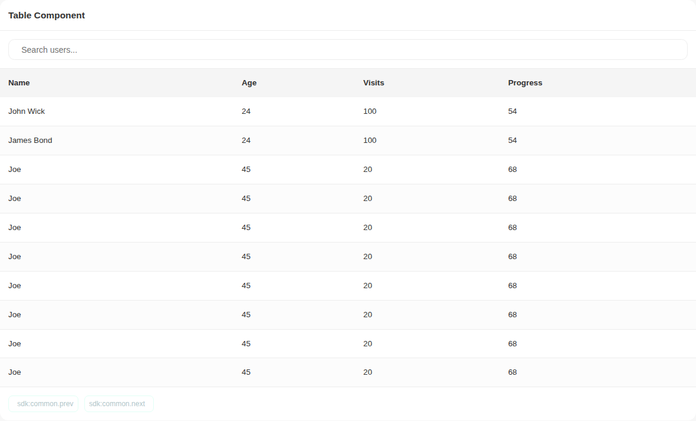
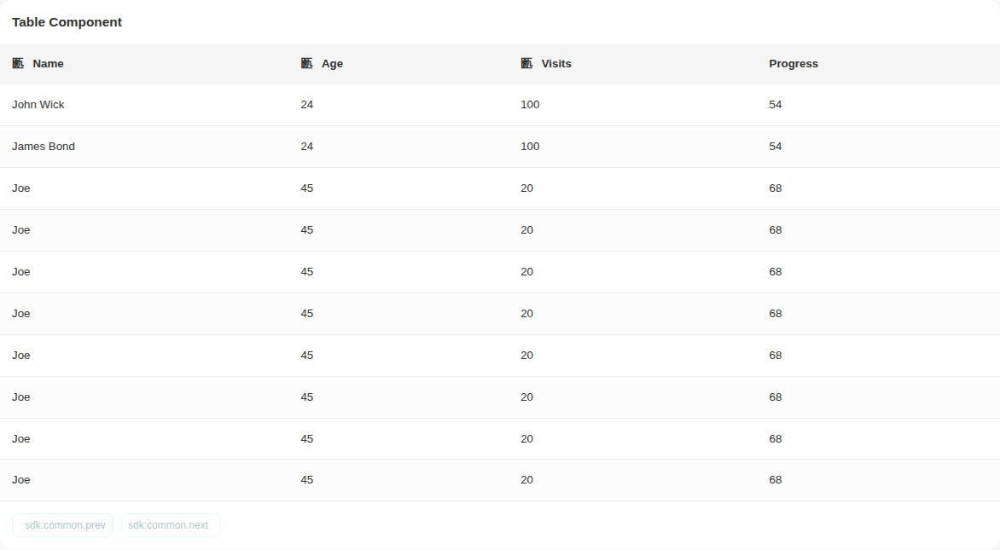
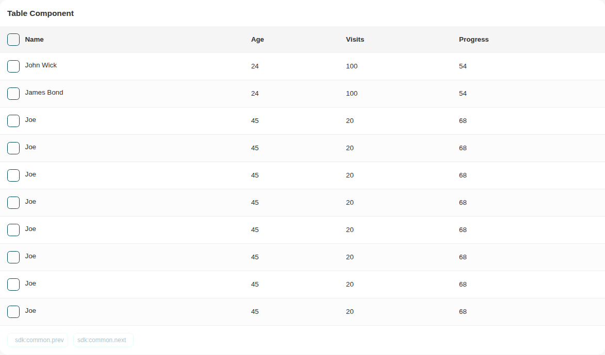
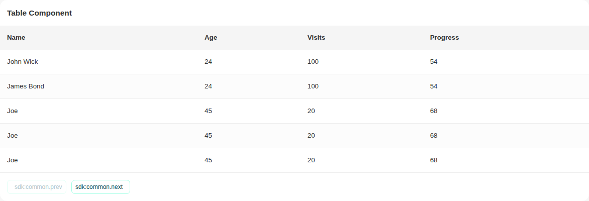
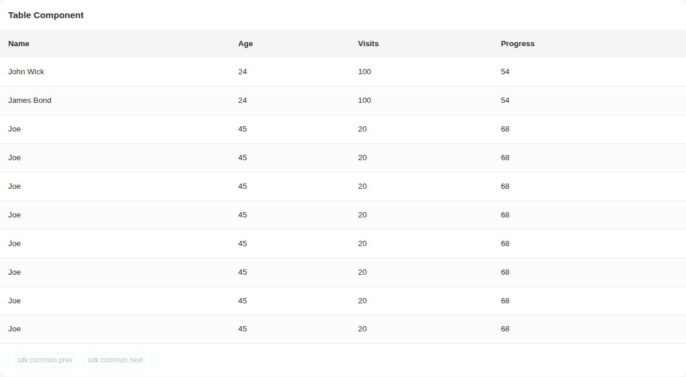
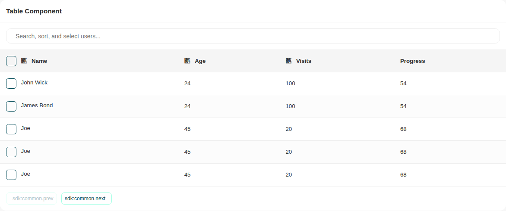

# Table

Storybook title `Components/Table` · source `./src/components/s-table/s-table.stories.tsx`

Tags rendered: `<s-panel>`, `<s-panel-body>`, `<s-panel-head>`, `<s-table>`

The table component is a customizable table that provides functionalities for sorting, pagination, and filtering.

## Props

| Prop | Type / control | Options | Default | Description |
|---|---|---|---|---|
| `items` | array |  | `TABLE_ITEMS` | Table data |
| `headers` | array |  | `["Name", "Age", "Visits", "Progress"]` | Table headers |
| `searchable` | boolean |  | `false` | Enable table search |
| `sortable` | boolean |  | `false` | Enable table sorting |
| `pagination` | boolean |  | `true` | Table pagination |
| `loading` | boolean |  | `false` | Loading state |
| `layout` | string |  | `scroll` | Table layout, scroll or responsive, default is scroll |
| `selectable` | boolean |  | `false` | Enable table row selection |
| `searchPlaceholder` | string |  | `Search...` | Table search placeholder |
| `itemsPerPage` | string |  | `["10", "20", "30", "40", "50"]` | Items per page |
| `fetchUrl` | text |  | `undefined` | Table data source url |
| `transform` | object |  | `undefined` | Transform data before passing to the component |
| `sortBy` | object |  | `undefined` | Sorting configuration for columns in the table |
| `emptyPlaceholderIcon` | text |  | `undefined` | Icon to display when there's no data |
| `emptyPlaceholderLabel` | text |  | `undefined` | Label to display when there's no data |
| `emptyPlaceholderDesc` | text |  | `undefined` | Description to display when there's no data |
| `hasNextPage` | boolean |  | `false` | Indicates if there is a next page available |
| `hasPrevPage` | boolean |  | `false` | Indicates if there is a previous page available |
| `onNextButtonClicked` |  |  |  | Event emitted when next page button is clicked |
| `onSelect` |  |  |  | Event emitted when single or all rows are selected |
| `onPrevButtonClicked` |  |  |  | Event emitted when previous page button is clicked |
| `children` | string |  |  |  |

## Stories

### Default

Story id `components-table--default`


Args:

```json
{
  "items": [
    {
      "name": "John Wick",
      "age": "24",
      "visits": "100",
      "progress": "54"
    },
    {
      "name": "James Bond",
      "age": "24",
      "visits": "100",
      "progress": "54"
    },
    {
      "name": "Joe",
      "age": "45",
      "visits": "20",
      "progress": "68",
      "options": ""
    },
    {
      "name": "Joe",
      "age": "45",
      "visits": "20",
      "progress": "68",
      "options": ""
    },
    {
      "name": "Joe",
      "age": "45",
      "visits": "20",
      "progress": "68",
      "options": ""
    },
    {
      "name": "Joe",
      "age": "45",
      "visits": "20",
      "progress": "68",
      "options": ""
    },
    {
      "name": "Joe",
      "age": "45",
      "visits": "20",
      "progress": "68",
      "options": ""
    },
    {
      "name": "Joe",
      "age": "45",
      "visits": "20",
      "progress": "68",
      "options": ""
    },
    {
      "name": "Joe",
      "age": "45",
      "visits": "20",
      "progress": "68",
      "options": ""
    },
    {
      "name": "Joe",
      "age": "45",
      "visits": "20",
      "progress": "68",
      "options": ""
    },
    {
      "name": "Joe",
      "age": "45",
      "visits": "20",
      "progress": "68",
      "options": ""
    },
    {
      "name": "Joe",
      "age": "45",
      "visits": "20",
      "progress": "68",
      "options": ""
    },
    {
      "name": "Joe",
      "age": "45",
      "visits": "20",
      "progress": "68",
      "options": ""
    },
    {
      "name": "Joe",
      "age": "45",
      "visits": "20",
      "progress": "68",
      "options": ""
    }
  ],
  "headers": [
    "Name",
    "Age",
    "Visits",
    "Progress"
  ],
  "searchable": false,
  "sortable": false,
  "pagination": true,
  "loading": false,
  "layout": "scroll",
  "selectable": false,
  "searchPlaceholder": "Search...",
  "itemsPerPage": "[\"10\", \"20\", \"30\", \"40\", \"50\"]"
}
```

<details><summary>Rendered markup</summary>

```html
<s-panel no-padding="" class="s-panel no-padding ltr hydrated">
    <s-panel-head data-collapsed="true" class="hydrated">
      <h2 slot="title">Table Component</h2>
    </s-panel-head>
    <s-panel-body class="hydrated">
      <s-table items="[{&quot;name&quot;:&quot;John Wick&quot;,&quot;age&quot;:&quot;24&quot;,&quot;visits&quot;:&quot;100&quot;,&quot;progress&quot;:&quot;54&quot;},{&quot;name&quot;:&quot;James Bond&quot;,&quot;age&quot;:&quot;24&quot;,&quot;visits&quot;:&quot;100&quot;,&quot;progress&quot;:&quot;54&quot;},{&quot;name&quot;:&quot;Joe&quot;,&quot;age&quot;:&quot;45&quot;,&quot;visits&quot;:&quot;20&quot;,&quot;progress&quot;:&quot;68&quot;,&quot;options&quot;:&quot;&quot;},{&quot;name&quot;:&quot;Joe&quot;,&quot;age&quot;:&quot;45&quot;,&quot;visits&quot;:&quot;20&quot;,&quot;progress&quot;:&quot;68&quot;,&quot;options&quot;:&quot;&quot;},{&quot;name&quot;:&quot;Joe&quot;,&quot;age&quot;:&quot;45&quot;,&quot;visits&quot;:&quot;20&quot;,&quot;progress&quot;:&quot;68&quot;,&quot;options&quot;:&quot;&quot;},{&quot;name&quot;:&quot;Joe&quot;,&quot;age&quot;:&quot;45&quot;,&quot;visits&quot;:&quot;20&quot;,&quot;progress&quot;:&quot;68&quot;,&quot;options&quot;:&quot;&quot;},{&quot;name&quot;:&quot;Joe&quot;,&quot;age&quot;:&quot;45&quot;,&quot;visits&quot;:&quot;20&quot;,&quot;progress&quot;:&quot;68&quot;,&quot;options&quot;:&quot;&quot;},{&quot;name&quot;:&quot;Joe&quot;,&quot;age&quot;:&quot;45&quot;,&quot;visits&quot;:&quot;20&quot;,&quot;progress&quot;:&quot;68&quot;,&quot;options&quot;:&quot;&quot;},{&quot;name&quot;:&quot;Joe&quot;,&quot;age&quot;:&quot;45&quot;,&quot;visits&quot;:&quot;20&quot;,&quot;progress&quot;:&quot;68&quot;,&quot;options&quot;:&quot;&quot;},{&quot;name&quot;:&quot;Joe&quot;,&quot;age&quot;:&quot;45&quot;,&quot;visits&quot;:&quot;20&quot;,&quot;progress&quot;:&quot;68&quot;,&quot;options&quot;:&quot;&quot;},{&quot;name&quot;:&quot;Joe&quot;,&quot;age&quot;:&quot;45&quot;,&quot;visits&quot;:&quot;20&quot;,&quot;progress&quot;:&quot;68&quot;,&quot;options&quot;:&quot;&quot;},{&quot;name&quot;:&quot;Joe&quot;,&quot;age&quot;:&quot;45&quot;,&quot;visits&quot;:&quot;20&quot;,&quot;progress&quot;:&quot;68&quot;,&quot;options&quot;:&quot;&quot;},{&quot;name&quot;:&quot;Joe&quot;,&quot;age&quot;:&quot;45&quot;,&quot;visits&quot;:&quot;20&quot;,&quot;progress&quot;:&quot;68&quot;,&quot;options&quot;:&quot;&quot;},{&quot;name&quot;:&quot;Joe&quot;,&quot;age&quot;:&quot;45&quot;,&quot;visits&quot;:&quot;20&quot;,&quot;progress&quot;:&quot;68&quot;,&quot;options&quot;:&quot;&quot;}]" layout="scroll" pagination="" headers="[&quot;Name&quot;,&quot;Age&quot;,&quot;Visits&quot;,&quot;Progress&quot;]" items-per-page="[&quot;10&quot;, &quot;20&quot;, &quot;30&quot;, &quot;40&quot;, &quot;50&quot;]" search-placeholder="Search..." onnextbuttonclicked="(event) =&gt; console.log('Next button clicked:', event.detail)" onprevbuttonclicked="(event) =&gt; console.log('Previous button clicked:', event.detail)" onselect="(event) =&gt; console.log('single or all row selected:', event.detail)" class="s-table scroll ltr hydrated">
        
      </s-table>  
    </s-panel-body>
  </s-panel>
```

</details>

### With Search

Story id `components-table--with-search`



Args:

```json
{
  "items": [
    {
      "name": "John Wick",
      "age": "24",
      "visits": "100",
      "progress": "54"
    },
    {
      "name": "James Bond",
      "age": "24",
      "visits": "100",
      "progress": "54"
    },
    {
      "name": "Joe",
      "age": "45",
      "visits": "20",
      "progress": "68",
      "options": ""
    },
    {
      "name": "Joe",
      "age": "45",
      "visits": "20",
      "progress": "68",
      "options": ""
    },
    {
      "name": "Joe",
      "age": "45",
      "visits": "20",
      "progress": "68",
      "options": ""
    },
    {
      "name": "Joe",
      "age": "45",
      "visits": "20",
      "progress": "68",
      "options": ""
    },
    {
      "name": "Joe",
      "age": "45",
      "visits": "20",
      "progress": "68",
      "options": ""
    },
    {
      "name": "Joe",
      "age": "45",
      "visits": "20",
      "progress": "68",
      "options": ""
    },
    {
      "name": "Joe",
      "age": "45",
      "visits": "20",
      "progress": "68",
      "options": ""
    },
    {
      "name": "Joe",
      "age": "45",
      "visits": "20",
      "progress": "68",
      "options": ""
    },
    {
      "name": "Joe",
      "age": "45",
      "visits": "20",
      "progress": "68",
      "options": ""
    },
    {
      "name": "Joe",
      "age": "45",
      "visits": "20",
      "progress": "68",
      "options": ""
    },
    {
      "name": "Joe",
      "age": "45",
      "visits": "20",
      "progress": "68",
      "options": ""
    },
    {
      "name": "Joe",
      "age": "45",
      "visits": "20",
      "progress": "68",
      "options": ""
    }
  ],
  "headers": [
    "Name",
    "Age",
    "Visits",
    "Progress"
  ],
  "searchable": true,
  "sortable": false,
  "pagination": true,
  "loading": false,
  "layout": "scroll",
  "selectable": false,
  "searchPlaceholder": "Search users...",
  "itemsPerPage": "[\"10\", \"20\", \"30\", \"40\", \"50\"]"
}
```

<details><summary>Rendered markup</summary>

```html
<s-panel no-padding="" class="s-panel no-padding ltr hydrated">
    <s-panel-head data-collapsed="true" class="hydrated">
      <h2 slot="title">Table Component</h2>
    </s-panel-head>
    <s-panel-body class="hydrated">
      <s-table items="[{&quot;name&quot;:&quot;John Wick&quot;,&quot;age&quot;:&quot;24&quot;,&quot;visits&quot;:&quot;100&quot;,&quot;progress&quot;:&quot;54&quot;},{&quot;name&quot;:&quot;James Bond&quot;,&quot;age&quot;:&quot;24&quot;,&quot;visits&quot;:&quot;100&quot;,&quot;progress&quot;:&quot;54&quot;},{&quot;name&quot;:&quot;Joe&quot;,&quot;age&quot;:&quot;45&quot;,&quot;visits&quot;:&quot;20&quot;,&quot;progress&quot;:&quot;68&quot;,&quot;options&quot;:&quot;&quot;},{&quot;name&quot;:&quot;Joe&quot;,&quot;age&quot;:&quot;45&quot;,&quot;visits&quot;:&quot;20&quot;,&quot;progress&quot;:&quot;68&quot;,&quot;options&quot;:&quot;&quot;},{&quot;name&quot;:&quot;Joe&quot;,&quot;age&quot;:&quot;45&quot;,&quot;visits&quot;:&quot;20&quot;,&quot;progress&quot;:&quot;68&quot;,&quot;options&quot;:&quot;&quot;},{&quot;name&quot;:&quot;Joe&quot;,&quot;age&quot;:&quot;45&quot;,&quot;visits&quot;:&quot;20&quot;,&quot;progress&quot;:&quot;68&quot;,&quot;options&quot;:&quot;&quot;},{&quot;name&quot;:&quot;Joe&quot;,&quot;age&quot;:&quot;45&quot;,&quot;visits&quot;:&quot;20&quot;,&quot;progress&quot;:&quot;68&quot;,&quot;options&quot;:&quot;&quot;},{&quot;name&quot;:&quot;Joe&quot;,&quot;age&quot;:&quot;45&quot;,&quot;visits&quot;:&quot;20&quot;,&quot;progress&quot;:&quot;68&quot;,&quot;options&quot;:&quot;&quot;},{&quot;name&quot;:&quot;Joe&quot;,&quot;age&quot;:&quot;45&quot;,&quot;visits&quot;:&quot;20&quot;,&quot;progress&quot;:&quot;68&quot;,&quot;options&quot;:&quot;&quot;},{&quot;name&quot;:&quot;Joe&quot;,&quot;age&quot;:&quot;45&quot;,&quot;visits&quot;:&quot;20&quot;,&quot;progress&quot;:&quot;68&quot;,&quot;options&quot;:&quot;&quot;},{&quot;name&quot;:&quot;Joe&quot;,&quot;age&quot;:&quot;45&quot;,&quot;visits&quot;:&quot;20&quot;,&quot;progress&quot;:&quot;68&quot;,&quot;options&quot;:&quot;&quot;},{&quot;name&quot;:&quot;Joe&quot;,&quot;age&quot;:&quot;45&quot;,&quot;visits&quot;:&quot;20&quot;,&quot;progress&quot;:&quot;68&quot;,&quot;options&quot;:&quot;&quot;},{&quot;name&quot;:&quot;Joe&quot;,&quot;age&quot;:&quot;45&quot;,&quot;visits&quot;:&quot;20&quot;,&quot;progress&quot;:&quot;68&quot;,&quot;options&quot;:&quot;&quot;},{&quot;name&quot;:&quot;Joe&quot;,&quot;age&quot;:&quot;45&quot;,&quot;visits&quot;:&quot;20&quot;,&quot;progress&quot;:&quot;68&quot;,&quot;options&quot;:&quot;&quot;}]" layout="scroll" pagination="" searchable="" headers="[&quot;Name&quot;,&quot;Age&quot;,&quot;Visits&quot;,&quot;Progress&quot;]" items-per-page="[&quot;10&quot;, &quot;20&quot;, &quot;30&quot;, &quot;40&quot;, &quot;50&quot;]" search-placeholder="Search users..." onnextbuttonclicked="(event) =&gt; console.log('Next button clicked:', event.detail)" onprevbuttonclicked="(event) =&gt; console.log('Previous button clicked:', event.detail)" onselect="(event) =&gt; console.log('single or all row selected:', event.detail)" class="s-table scroll ltr hydrated">
        
      </s-table>  
    </s-panel-body>
  </s-panel>
```

</details>

### Sorting

Story id `components-table--sorting`



Args:

```json
{
  "items": [
    {
      "name": "John Wick",
      "age": "24",
      "visits": "100",
      "progress": "54"
    },
    {
      "name": "James Bond",
      "age": "24",
      "visits": "100",
      "progress": "54"
    },
    {
      "name": "Joe",
      "age": "45",
      "visits": "20",
      "progress": "68",
      "options": ""
    },
    {
      "name": "Joe",
      "age": "45",
      "visits": "20",
      "progress": "68",
      "options": ""
    },
    {
      "name": "Joe",
      "age": "45",
      "visits": "20",
      "progress": "68",
      "options": ""
    },
    {
      "name": "Joe",
      "age": "45",
      "visits": "20",
      "progress": "68",
      "options": ""
    },
    {
      "name": "Joe",
      "age": "45",
      "visits": "20",
      "progress": "68",
      "options": ""
    },
    {
      "name": "Joe",
      "age": "45",
      "visits": "20",
      "progress": "68",
      "options": ""
    },
    {
      "name": "Joe",
      "age": "45",
      "visits": "20",
      "progress": "68",
      "options": ""
    },
    {
      "name": "Joe",
      "age": "45",
      "visits": "20",
      "progress": "68",
      "options": ""
    },
    {
      "name": "Joe",
      "age": "45",
      "visits": "20",
      "progress": "68",
      "options": ""
    },
    {
      "name": "Joe",
      "age": "45",
      "visits": "20",
      "progress": "68",
      "options": ""
    },
    {
      "name": "Joe",
      "age": "45",
      "visits": "20",
      "progress": "68",
      "options": ""
    },
    {
      "name": "Joe",
      "age": "45",
      "visits": "20",
      "progress": "68",
      "options": ""
    }
  ],
  "headers": [
    "Name",
    "Age",
    "Visits",
    "Progress"
  ],
  "searchable": false,
  "sortable": true,
  "pagination": true,
  "loading": false,
  "layout": "scroll",
  "selectable": false,
  "searchPlaceholder": "Search...",
  "itemsPerPage": "[\"10\", \"20\", \"30\", \"40\", \"50\"]",
  "sortBy": [
    "name",
    "age",
    "visits"
  ]
}
```

<details><summary>Rendered markup</summary>

```html
<s-panel no-padding="" class="s-panel no-padding ltr hydrated">
    <s-panel-head data-collapsed="true" class="hydrated">
      <h2 slot="title">Table Component</h2>
    </s-panel-head>
    <s-panel-body class="hydrated">
      <s-table items="[{&quot;name&quot;:&quot;John Wick&quot;,&quot;age&quot;:&quot;24&quot;,&quot;visits&quot;:&quot;100&quot;,&quot;progress&quot;:&quot;54&quot;},{&quot;name&quot;:&quot;James Bond&quot;,&quot;age&quot;:&quot;24&quot;,&quot;visits&quot;:&quot;100&quot;,&quot;progress&quot;:&quot;54&quot;},{&quot;name&quot;:&quot;Joe&quot;,&quot;age&quot;:&quot;45&quot;,&quot;visits&quot;:&quot;20&quot;,&quot;progress&quot;:&quot;68&quot;,&quot;options&quot;:&quot;&quot;},{&quot;name&quot;:&quot;Joe&quot;,&quot;age&quot;:&quot;45&quot;,&quot;visits&quot;:&quot;20&quot;,&quot;progress&quot;:&quot;68&quot;,&quot;options&quot;:&quot;&quot;},{&quot;name&quot;:&quot;Joe&quot;,&quot;age&quot;:&quot;45&quot;,&quot;visits&quot;:&quot;20&quot;,&quot;progress&quot;:&quot;68&quot;,&quot;options&quot;:&quot;&quot;},{&quot;name&quot;:&quot;Joe&quot;,&quot;age&quot;:&quot;45&quot;,&quot;visits&quot;:&quot;20&quot;,&quot;progress&quot;:&quot;68&quot;,&quot;options&quot;:&quot;&quot;},{&quot;name&quot;:&quot;Joe&quot;,&quot;age&quot;:&quot;45&quot;,&quot;visits&quot;:&quot;20&quot;,&quot;progress&quot;:&quot;68&quot;,&quot;options&quot;:&quot;&quot;},{&quot;name&quot;:&quot;Joe&quot;,&quot;age&quot;:&quot;45&quot;,&quot;visits&quot;:&quot;20&quot;,&quot;progress&quot;:&quot;68&quot;,&quot;options&quot;:&quot;&quot;},{&quot;name&quot;:&quot;Joe&quot;,&quot;age&quot;:&quot;45&quot;,&quot;visits&quot;:&quot;20&quot;,&quot;progress&quot;:&quot;68&quot;,&quot;options&quot;:&quot;&quot;},{&quot;name&quot;:&quot;Joe&quot;,&quot;age&quot;:&quot;45&quot;,&quot;visits&quot;:&quot;20&quot;,&quot;progress&quot;:&quot;68&quot;,&quot;options&quot;:&quot;&quot;},{&quot;name&quot;:&quot;Joe&quot;,&quot;age&quot;:&quot;45&quot;,&quot;visits&quot;:&quot;20&quot;,&quot;progress&quot;:&quot;68&quot;,&quot;options&quot;:&quot;&quot;},{&quot;name&quot;:&quot;Joe&quot;,&quot;age&quot;:&quot;45&quot;,&quot;visits&quot;:&quot;20&quot;,&quot;progress&quot;:&quot;68&quot;,&quot;options&quot;:&quot;&quot;},{&quot;name&quot;:&quot;Joe&quot;,&quot;age&quot;:&quot;45&quot;,&quot;visits&quot;:&quot;20&quot;,&quot;progress&quot;:&quot;68&quot;,&quot;options&quot;:&quot;&quot;},{&quot;name&quot;:&quot;Joe&quot;,&quot;age&quot;:&quot;45&quot;,&quot;visits&quot;:&quot;20&quot;,&quot;progress&quot;:&quot;68&quot;,&quot;options&quot;:&quot;&quot;}]" layout="scroll" pagination="" sortable="" headers="[&quot;Name&quot;,&quot;Age&quot;,&quot;Visits&quot;,&quot;Progress&quot;]" sort-by="[&quot;name&quot;,&quot;age&quot;,&quot;visits&quot;]" items-per-page="[&quot;10&quot;, &quot;20&quot;, &quot;30&quot;, &quot;40&quot;, &quot;50&quot;]" search-placeholder="Search..." onnextbuttonclicked="(event) =&gt; console.log('Next button clicked:', event.detail)" onprevbuttonclicked="(event) =&gt; console.log('Previous button clicked:', event.detail)" onselect="(event) =&gt; console.log('single or all row selected:', event.detail)" class="s-table scroll ltr hydrated">
        
      </s-table>  
    </s-panel-body>
  </s-panel>
```

</details>

### Selection

Story id `components-table--selection`



Args:

```json
{
  "items": [
    {
      "name": "John Wick",
      "age": "24",
      "visits": "100",
      "progress": "54"
    },
    {
      "name": "James Bond",
      "age": "24",
      "visits": "100",
      "progress": "54"
    },
    {
      "name": "Joe",
      "age": "45",
      "visits": "20",
      "progress": "68",
      "options": ""
    },
    {
      "name": "Joe",
      "age": "45",
      "visits": "20",
      "progress": "68",
      "options": ""
    },
    {
      "name": "Joe",
      "age": "45",
      "visits": "20",
      "progress": "68",
      "options": ""
    },
    {
      "name": "Joe",
      "age": "45",
      "visits": "20",
      "progress": "68",
      "options": ""
    },
    {
      "name": "Joe",
      "age": "45",
      "visits": "20",
      "progress": "68",
      "options": ""
    },
    {
      "name": "Joe",
      "age": "45",
      "visits": "20",
      "progress": "68",
      "options": ""
    },
    {
      "name": "Joe",
      "age": "45",
      "visits": "20",
      "progress": "68",
      "options": ""
    },
    {
      "name": "Joe",
      "age": "45",
      "visits": "20",
      "progress": "68",
      "options": ""
    },
    {
      "name": "Joe",
      "age": "45",
      "visits": "20",
      "progress": "68",
      "options": ""
    },
    {
      "name": "Joe",
      "age": "45",
      "visits": "20",
      "progress": "68",
      "options": ""
    },
    {
      "name": "Joe",
      "age": "45",
      "visits": "20",
      "progress": "68",
      "options": ""
    },
    {
      "name": "Joe",
      "age": "45",
      "visits": "20",
      "progress": "68",
      "options": ""
    }
  ],
  "headers": [
    "Name",
    "Age",
    "Visits",
    "Progress"
  ],
  "searchable": false,
  "sortable": false,
  "pagination": true,
  "loading": false,
  "layout": "scroll",
  "selectable": true,
  "searchPlaceholder": "Search...",
  "itemsPerPage": "[\"10\", \"20\", \"30\", \"40\", \"50\"]"
}
```

<details><summary>Rendered markup</summary>

```html
<s-panel no-padding="" class="s-panel no-padding ltr hydrated">
    <s-panel-head data-collapsed="true" class="hydrated">
      <h2 slot="title">Table Component</h2>
    </s-panel-head>
    <s-panel-body class="hydrated">
      <s-table items="[{&quot;name&quot;:&quot;John Wick&quot;,&quot;age&quot;:&quot;24&quot;,&quot;visits&quot;:&quot;100&quot;,&quot;progress&quot;:&quot;54&quot;},{&quot;name&quot;:&quot;James Bond&quot;,&quot;age&quot;:&quot;24&quot;,&quot;visits&quot;:&quot;100&quot;,&quot;progress&quot;:&quot;54&quot;},{&quot;name&quot;:&quot;Joe&quot;,&quot;age&quot;:&quot;45&quot;,&quot;visits&quot;:&quot;20&quot;,&quot;progress&quot;:&quot;68&quot;,&quot;options&quot;:&quot;&quot;},{&quot;name&quot;:&quot;Joe&quot;,&quot;age&quot;:&quot;45&quot;,&quot;visits&quot;:&quot;20&quot;,&quot;progress&quot;:&quot;68&quot;,&quot;options&quot;:&quot;&quot;},{&quot;name&quot;:&quot;Joe&quot;,&quot;age&quot;:&quot;45&quot;,&quot;visits&quot;:&quot;20&quot;,&quot;progress&quot;:&quot;68&quot;,&quot;options&quot;:&quot;&quot;},{&quot;name&quot;:&quot;Joe&quot;,&quot;age&quot;:&quot;45&quot;,&quot;visits&quot;:&quot;20&quot;,&quot;progress&quot;:&quot;68&quot;,&quot;options&quot;:&quot;&quot;},{&quot;name&quot;:&quot;Joe&quot;,&quot;age&quot;:&quot;45&quot;,&quot;visits&quot;:&quot;20&quot;,&quot;progress&quot;:&quot;68&quot;,&quot;options&quot;:&quot;&quot;},{&quot;name&quot;:&quot;Joe&quot;,&quot;age&quot;:&quot;45&quot;,&quot;visits&quot;:&quot;20&quot;,&quot;progress&quot;:&quot;68&quot;,&quot;options&quot;:&quot;&quot;},{&quot;name&quot;:&quot;Joe&quot;,&quot;age&quot;:&quot;45&quot;,&quot;visits&quot;:&quot;20&quot;,&quot;progress&quot;:&quot;68&quot;,&quot;options&quot;:&quot;&quot;},{&quot;name&quot;:&quot;Joe&quot;,&quot;age&quot;:&quot;45&quot;,&quot;visits&quot;:&quot;20&quot;,&quot;progress&quot;:&quot;68&quot;,&quot;options&quot;:&quot;&quot;},{&quot;name&quot;:&quot;Joe&quot;,&quot;age&quot;:&quot;45&quot;,&quot;visits&quot;:&quot;20&quot;,&quot;progress&quot;:&quot;68&quot;,&quot;options&quot;:&quot;&quot;},{&quot;name&quot;:&quot;Joe&quot;,&quot;age&quot;:&quot;45&quot;,&quot;visits&quot;:&quot;20&quot;,&quot;progress&quot;:&quot;68&quot;,&quot;options&quot;:&quot;&quot;},{&quot;name&quot;:&quot;Joe&quot;,&quot;age&quot;:&quot;45&quot;,&quot;visits&quot;:&quot;20&quot;,&quot;progress&quot;:&quot;68&quot;,&quot;options&quot;:&quot;&quot;},{&quot;name&quot;:&quot;Joe&quot;,&quot;age&quot;:&quot;45&quot;,&quot;visits&quot;:&quot;20&quot;,&quot;progress&quot;:&quot;68&quot;,&quot;options&quot;:&quot;&quot;}]" layout="scroll" pagination="" selectable="" headers="[&quot;Name&quot;,&quot;Age&quot;,&quot;Visits&quot;,&quot;Progress&quot;]" items-per-page="[&quot;10&quot;, &quot;20&quot;, &quot;30&quot;, &quot;40&quot;, &quot;50&quot;]" search-placeholder="Search..." onnextbuttonclicked="(event) =&gt; console.log('Next button clicked:', event.detail)" onprevbuttonclicked="(event) =&gt; console.log('Previous button clicked:', event.detail)" onselect="(event) =&gt; console.log('single or all row selected:', event.detail)" class="s-table scroll ltr hydrated">
        
      </s-table>  
    </s-panel-body>
  </s-panel>
```

</details>

### Custom Pagination

Story id `components-table--custom-pagination`



Args:

```json
{
  "items": [
    {
      "name": "John Wick",
      "age": "24",
      "visits": "100",
      "progress": "54"
    },
    {
      "name": "James Bond",
      "age": "24",
      "visits": "100",
      "progress": "54"
    },
    {
      "name": "Joe",
      "age": "45",
      "visits": "20",
      "progress": "68",
      "options": ""
    },
    {
      "name": "Joe",
      "age": "45",
      "visits": "20",
      "progress": "68",
      "options": ""
    },
    {
      "name": "Joe",
      "age": "45",
      "visits": "20",
      "progress": "68",
      "options": ""
    },
    {
      "name": "Joe",
      "age": "45",
      "visits": "20",
      "progress": "68",
      "options": ""
    },
    {
      "name": "Joe",
      "age": "45",
      "visits": "20",
      "progress": "68",
      "options": ""
    },
    {
      "name": "Joe",
      "age": "45",
      "visits": "20",
      "progress": "68",
      "options": ""
    },
    {
      "name": "Joe",
      "age": "45",
      "visits": "20",
      "progress": "68",
      "options": ""
    },
    {
      "name": "Joe",
      "age": "45",
      "visits": "20",
      "progress": "68",
      "options": ""
    },
    {
      "name": "Joe",
      "age": "45",
      "visits": "20",
      "progress": "68",
      "options": ""
    },
    {
      "name": "Joe",
      "age": "45",
      "visits": "20",
      "progress": "68",
      "options": ""
    },
    {
      "name": "Joe",
      "age": "45",
      "visits": "20",
      "progress": "68",
      "options": ""
    },
    {
      "name": "Joe",
      "age": "45",
      "visits": "20",
      "progress": "68",
      "options": ""
    }
  ],
  "headers": [
    "Name",
    "Age",
    "Visits",
    "Progress"
  ],
  "searchable": false,
  "sortable": false,
  "pagination": true,
  "loading": false,
  "layout": "scroll",
  "selectable": false,
  "searchPlaceholder": "Search...",
  "itemsPerPage": [
    "5",
    "10",
    "15",
    "20"
  ],
  "hasNextPage": true,
  "hasPrevPage": false
}
```

<details><summary>Rendered markup</summary>

```html
<s-panel no-padding="" class="s-panel no-padding ltr hydrated">
    <s-panel-head data-collapsed="true" class="hydrated">
      <h2 slot="title">Table Component</h2>
    </s-panel-head>
    <s-panel-body class="hydrated">
      <s-table items="[{&quot;name&quot;:&quot;John Wick&quot;,&quot;age&quot;:&quot;24&quot;,&quot;visits&quot;:&quot;100&quot;,&quot;progress&quot;:&quot;54&quot;},{&quot;name&quot;:&quot;James Bond&quot;,&quot;age&quot;:&quot;24&quot;,&quot;visits&quot;:&quot;100&quot;,&quot;progress&quot;:&quot;54&quot;},{&quot;name&quot;:&quot;Joe&quot;,&quot;age&quot;:&quot;45&quot;,&quot;visits&quot;:&quot;20&quot;,&quot;progress&quot;:&quot;68&quot;,&quot;options&quot;:&quot;&quot;},{&quot;name&quot;:&quot;Joe&quot;,&quot;age&quot;:&quot;45&quot;,&quot;visits&quot;:&quot;20&quot;,&quot;progress&quot;:&quot;68&quot;,&quot;options&quot;:&quot;&quot;},{&quot;name&quot;:&quot;Joe&quot;,&quot;age&quot;:&quot;45&quot;,&quot;visits&quot;:&quot;20&quot;,&quot;progress&quot;:&quot;68&quot;,&quot;options&quot;:&quot;&quot;},{&quot;name&quot;:&quot;Joe&quot;,&quot;age&quot;:&quot;45&quot;,&quot;visits&quot;:&quot;20&quot;,&quot;progress&quot;:&quot;68&quot;,&quot;options&quot;:&quot;&quot;},{&quot;name&quot;:&quot;Joe&quot;,&quot;age&quot;:&quot;45&quot;,&quot;visits&quot;:&quot;20&quot;,&quot;progress&quot;:&quot;68&quot;,&quot;options&quot;:&quot;&quot;},{&quot;name&quot;:&quot;Joe&quot;,&quot;age&quot;:&quot;45&quot;,&quot;visits&quot;:&quot;20&quot;,&quot;progress&quot;:&quot;68&quot;,&quot;options&quot;:&quot;&quot;},{&quot;name&quot;:&quot;Joe&quot;,&quot;age&quot;:&quot;45&quot;,&quot;visits&quot;:&quot;20&quot;,&quot;progress&quot;:&quot;68&quot;,&quot;options&quot;:&quot;&quot;},{&quot;name&quot;:&quot;Joe&quot;,&quot;age&quot;:&quot;45&quot;,&quot;visits&quot;:&quot;20&quot;,&quot;progress&quot;:&quot;68&quot;,&quot;options&quot;:&quot;&quot;},{&quot;name&quot;:&quot;Joe&quot;,&quot;age&quot;:&quot;45&quot;,&quot;visits&quot;:&quot;20&quot;,&quot;progress&quot;:&quot;68&quot;,&quot;options&quot;:&quot;&quot;},{&quot;name&quot;:&quot;Joe&quot;,&quot;age&quot;:&quot;45&quot;,&quot;visits&quot;:&quot;20&quot;,&quot;progress&quot;:&quot;68&quot;,&quot;options&quot;:&quot;&quot;},{&quot;name&quot;:&quot;Joe&quot;,&quot;age&quot;:&quot;45&quot;,&quot;visits&quot;:&quot;20&quot;,&quot;progress&quot;:&quot;68&quot;,&quot;options&quot;:&quot;&quot;},{&quot;name&quot;:&quot;Joe&quot;,&quot;age&quot;:&quot;45&quot;,&quot;visits&quot;:&quot;20&quot;,&quot;progress&quot;:&quot;68&quot;,&quot;options&quot;:&quot;&quot;}]" layout="scroll" pagination="" headers="[&quot;Name&quot;,&quot;Age&quot;,&quot;Visits&quot;,&quot;Progress&quot;]" items-per-page="[&quot;5&quot;,&quot;10&quot;,&quot;15&quot;,&quot;20&quot;]" search-placeholder="Search..." has-next-page="" onnextbuttonclicked="(event) =&gt; console.log('Next button clicked:', event.detail)" onprevbuttonclicked="(event) =&gt; console.log('Previous button clicked:', event.detail)" onselect="(event) =&gt; console.log('single or all row selected:', event.detail)" class="s-table scroll ltr hydrated">
        
      </s-table>  
    </s-panel-body>
  </s-panel>
```

</details>

### Empty State

Story id `components-table--empty-state`


Args:

```json
{
  "items": [],
  "headers": [
    "Name",
    "Age",
    "Visits",
    "Progress"
  ],
  "searchable": false,
  "sortable": false,
  "pagination": true,
  "loading": false,
  "layout": "scroll",
  "selectable": false,
  "searchPlaceholder": "Search...",
  "itemsPerPage": "[\"10\", \"20\", \"30\", \"40\", \"50\"]",
  "emptyPlaceholderIcon": "hgi-stroke hgi-users-01",
  "emptyPlaceholderLabel": "No users found",
  "emptyPlaceholderDesc": "Try adjusting your search criteria or add new users"
}
```

<details><summary>Rendered markup</summary>

```html
<s-panel no-padding="" class="s-panel no-padding ltr hydrated">
    <s-panel-head data-collapsed="true" class="hydrated">
      <h2 slot="title">Table Component</h2>
    </s-panel-head>
    <s-panel-body class="hydrated">
      <s-table items="[]" layout="scroll" pagination="" headers="[&quot;Name&quot;,&quot;Age&quot;,&quot;Visits&quot;,&quot;Progress&quot;]" items-per-page="[&quot;10&quot;, &quot;20&quot;, &quot;30&quot;, &quot;40&quot;, &quot;50&quot;]" search-placeholder="Search..." empty-placeholder-icon="hgi-stroke hgi-users-01" empty-placeholder-label="No users found" empty-placeholder-desc="Try adjusting your search criteria or add new users" onnextbuttonclicked="(event) =&gt; console.log('Next button clicked:', event.detail)" onprevbuttonclicked="(event) =&gt; console.log('Previous button clicked:', event.detail)" onselect="(event) =&gt; console.log('single or all row selected:', event.detail)" class="s-table scroll ltr hydrated">
        
      </s-table>  
    </s-panel-body>
  </s-panel>
```

</details>

### Responsive Layout

Story id `components-table--responsive-layout`


Args:

```json
{
  "items": [
    {
      "name": "John Wick",
      "age": "24",
      "visits": "100",
      "progress": "54"
    },
    {
      "name": "James Bond",
      "age": "24",
      "visits": "100",
      "progress": "54"
    },
    {
      "name": "Joe",
      "age": "45",
      "visits": "20",
      "progress": "68",
      "options": ""
    },
    {
      "name": "Joe",
      "age": "45",
      "visits": "20",
      "progress": "68",
      "options": ""
    },
    {
      "name": "Joe",
      "age": "45",
      "visits": "20",
      "progress": "68",
      "options": ""
    },
    {
      "name": "Joe",
      "age": "45",
      "visits": "20",
      "progress": "68",
      "options": ""
    },
    {
      "name": "Joe",
      "age": "45",
      "visits": "20",
      "progress": "68",
      "options": ""
    },
    {
      "name": "Joe",
      "age": "45",
      "visits": "20",
      "progress": "68",
      "options": ""
    },
    {
      "name": "Joe",
      "age": "45",
      "visits": "20",
      "progress": "68",
      "options": ""
    },
    {
      "name": "Joe",
      "age": "45",
      "visits": "20",
      "progress": "68",
      "options": ""
    },
    {
      "name": "Joe",
      "age": "45",
      "visits": "20",
      "progress": "68",
      "options": ""
    },
    {
      "name": "Joe",
      "age": "45",
      "visits": "20",
      "progress": "68",
      "options": ""
    },
    {
      "name": "Joe",
      "age": "45",
      "visits": "20",
      "progress": "68",
      "options": ""
    },
    {
      "name": "Joe",
      "age": "45",
      "visits": "20",
      "progress": "68",
      "options": ""
    }
  ],
  "headers": [
    "Name",
    "Age",
    "Visits",
    "Progress"
  ],
  "searchable": false,
  "sortable": false,
  "pagination": true,
  "loading": false,
  "layout": "responsive",
  "selectable": false,
  "searchPlaceholder": "Search...",
  "itemsPerPage": "[\"10\", \"20\", \"30\", \"40\", \"50\"]"
}
```

<details><summary>Rendered markup</summary>

```html
<s-panel no-padding="" class="s-panel no-padding ltr hydrated">
    <s-panel-head data-collapsed="true" class="hydrated">
      <h2 slot="title">Table Component</h2>
    </s-panel-head>
    <s-panel-body class="hydrated">
      <s-table items="[{&quot;name&quot;:&quot;John Wick&quot;,&quot;age&quot;:&quot;24&quot;,&quot;visits&quot;:&quot;100&quot;,&quot;progress&quot;:&quot;54&quot;},{&quot;name&quot;:&quot;James Bond&quot;,&quot;age&quot;:&quot;24&quot;,&quot;visits&quot;:&quot;100&quot;,&quot;progress&quot;:&quot;54&quot;},{&quot;name&quot;:&quot;Joe&quot;,&quot;age&quot;:&quot;45&quot;,&quot;visits&quot;:&quot;20&quot;,&quot;progress&quot;:&quot;68&quot;,&quot;options&quot;:&quot;&quot;},{&quot;name&quot;:&quot;Joe&quot;,&quot;age&quot;:&quot;45&quot;,&quot;visits&quot;:&quot;20&quot;,&quot;progress&quot;:&quot;68&quot;,&quot;options&quot;:&quot;&quot;},{&quot;name&quot;:&quot;Joe&quot;,&quot;age&quot;:&quot;45&quot;,&quot;visits&quot;:&quot;20&quot;,&quot;progress&quot;:&quot;68&quot;,&quot;options&quot;:&quot;&quot;},{&quot;name&quot;:&quot;Joe&quot;,&quot;age&quot;:&quot;45&quot;,&quot;visits&quot;:&quot;20&quot;,&quot;progress&quot;:&quot;68&quot;,&quot;options&quot;:&quot;&quot;},{&quot;name&quot;:&quot;Joe&quot;,&quot;age&quot;:&quot;45&quot;,&quot;visits&quot;:&quot;20&quot;,&quot;progress&quot;:&quot;68&quot;,&quot;options&quot;:&quot;&quot;},{&quot;name&quot;:&quot;Joe&quot;,&quot;age&quot;:&quot;45&quot;,&quot;visits&quot;:&quot;20&quot;,&quot;progress&quot;:&quot;68&quot;,&quot;options&quot;:&quot;&quot;},{&quot;name&quot;:&quot;Joe&quot;,&quot;age&quot;:&quot;45&quot;,&quot;visits&quot;:&quot;20&quot;,&quot;progress&quot;:&quot;68&quot;,&quot;options&quot;:&quot;&quot;},{&quot;name&quot;:&quot;Joe&quot;,&quot;age&quot;:&quot;45&quot;,&quot;visits&quot;:&quot;20&quot;,&quot;progress&quot;:&quot;68&quot;,&quot;options&quot;:&quot;&quot;},{&quot;name&quot;:&quot;Joe&quot;,&quot;age&quot;:&quot;45&quot;,&quot;visits&quot;:&quot;20&quot;,&quot;progress&quot;:&quot;68&quot;,&quot;options&quot;:&quot;&quot;},{&quot;name&quot;:&quot;Joe&quot;,&quot;age&quot;:&quot;45&quot;,&quot;visits&quot;:&quot;20&quot;,&quot;progress&quot;:&quot;68&quot;,&quot;options&quot;:&quot;&quot;},{&quot;name&quot;:&quot;Joe&quot;,&quot;age&quot;:&quot;45&quot;,&quot;visits&quot;:&quot;20&quot;,&quot;progress&quot;:&quot;68&quot;,&quot;options&quot;:&quot;&quot;},{&quot;name&quot;:&quot;Joe&quot;,&quot;age&quot;:&quot;45&quot;,&quot;visits&quot;:&quot;20&quot;,&quot;progress&quot;:&quot;68&quot;,&quot;options&quot;:&quot;&quot;}]" layout="responsive" pagination="" headers="[&quot;Name&quot;,&quot;Age&quot;,&quot;Visits&quot;,&quot;Progress&quot;]" items-per-page="[&quot;10&quot;, &quot;20&quot;, &quot;30&quot;, &quot;40&quot;, &quot;50&quot;]" search-placeholder="Search..." onnextbuttonclicked="(event) =&gt; console.log('Next button clicked:', event.detail)" onprevbuttonclicked="(event) =&gt; console.log('Previous button clicked:', event.detail)" onselect="(event) =&gt; console.log('single or all row selected:', event.detail)" class="s-table responsive ltr hydrated">
        
      </s-table>  
    </s-panel-body>
  </s-panel>
```

</details>

### Custom Slots

Story id `components-table--custom-slots`



Args:

```json
{
  "items": [
    {
      "name": "John Wick",
      "age": "24",
      "visits": "100",
      "progress": "54"
    },
    {
      "name": "James Bond",
      "age": "24",
      "visits": "100",
      "progress": "54"
    },
    {
      "name": "Joe",
      "age": "45",
      "visits": "20",
      "progress": "68",
      "options": ""
    },
    {
      "name": "Joe",
      "age": "45",
      "visits": "20",
      "progress": "68",
      "options": ""
    },
    {
      "name": "Joe",
      "age": "45",
      "visits": "20",
      "progress": "68",
      "options": ""
    },
    {
      "name": "Joe",
      "age": "45",
      "visits": "20",
      "progress": "68",
      "options": ""
    },
    {
      "name": "Joe",
      "age": "45",
      "visits": "20",
      "progress": "68",
      "options": ""
    },
    {
      "name": "Joe",
      "age": "45",
      "visits": "20",
      "progress": "68",
      "options": ""
    },
    {
      "name": "Joe",
      "age": "45",
      "visits": "20",
      "progress": "68",
      "options": ""
    },
    {
      "name": "Joe",
      "age": "45",
      "visits": "20",
      "progress": "68",
      "options": ""
    },
    {
      "name": "Joe",
      "age": "45",
      "visits": "20",
      "progress": "68",
      "options": ""
    },
    {
      "name": "Joe",
      "age": "45",
      "visits": "20",
      "progress": "68",
      "options": ""
    },
    {
      "name": "Joe",
      "age": "45",
      "visits": "20",
      "progress": "68",
      "options": ""
    },
    {
      "name": "Joe",
      "age": "45",
      "visits": "20",
      "progress": "68",
      "options": ""
    }
  ],
  "headers": [
    "Name",
    "Age",
    "Visits",
    "Progress"
  ],
  "searchable": false,
  "sortable": false,
  "pagination": true,
  "loading": false,
  "layout": "scroll",
  "selectable": false,
  "searchPlaceholder": "Search...",
  "itemsPerPage": "[\"10\", \"20\", \"30\", \"40\", \"50\"]",
  "children": "\n      <div slot=\"name\" style=\"color: #007bff; font-weight: bold;\">\n        Custom name slot content\n      </div>\n      <div slot=\"progress\" style=\"color: #28a745; font-weight: bold;\">\n        Custom progress slot content\n      </div>\n    "
}
```

<details><summary>Rendered markup</summary>

```html
<s-panel no-padding="" class="s-panel no-padding ltr hydrated">
    <s-panel-head data-collapsed="true" class="hydrated">
      <h2 slot="title">Table Component</h2>
    </s-panel-head>
    <s-panel-body class="hydrated">
      <s-table items="[{&quot;name&quot;:&quot;John Wick&quot;,&quot;age&quot;:&quot;24&quot;,&quot;visits&quot;:&quot;100&quot;,&quot;progress&quot;:&quot;54&quot;},{&quot;name&quot;:&quot;James Bond&quot;,&quot;age&quot;:&quot;24&quot;,&quot;visits&quot;:&quot;100&quot;,&quot;progress&quot;:&quot;54&quot;},{&quot;name&quot;:&quot;Joe&quot;,&quot;age&quot;:&quot;45&quot;,&quot;visits&quot;:&quot;20&quot;,&quot;progress&quot;:&quot;68&quot;,&quot;options&quot;:&quot;&quot;},{&quot;name&quot;:&quot;Joe&quot;,&quot;age&quot;:&quot;45&quot;,&quot;visits&quot;:&quot;20&quot;,&quot;progress&quot;:&quot;68&quot;,&quot;options&quot;:&quot;&quot;},{&quot;name&quot;:&quot;Joe&quot;,&quot;age&quot;:&quot;45&quot;,&quot;visits&quot;:&quot;20&quot;,&quot;progress&quot;:&quot;68&quot;,&quot;options&quot;:&quot;&quot;},{&quot;name&quot;:&quot;Joe&quot;,&quot;age&quot;:&quot;45&quot;,&quot;visits&quot;:&quot;20&quot;,&quot;progress&quot;:&quot;68&quot;,&quot;options&quot;:&quot;&quot;},{&quot;name&quot;:&quot;Joe&quot;,&quot;age&quot;:&quot;45&quot;,&quot;visits&quot;:&quot;20&quot;,&quot;progress&quot;:&quot;68&quot;,&quot;options&quot;:&quot;&quot;},{&quot;name&quot;:&quot;Joe&quot;,&quot;age&quot;:&quot;45&quot;,&quot;visits&quot;:&quot;20&quot;,&quot;progress&quot;:&quot;68&quot;,&quot;options&quot;:&quot;&quot;},{&quot;name&quot;:&quot;Joe&quot;,&quot;age&quot;:&quot;45&quot;,&quot;visits&quot;:&quot;20&quot;,&quot;progress&quot;:&quot;68&quot;,&quot;options&quot;:&quot;&quot;},{&quot;name&quot;:&quot;Joe&quot;,&quot;age&quot;:&quot;45&quot;,&quot;visits&quot;:&quot;20&quot;,&quot;progress&quot;:&quot;68&quot;,&quot;options&quot;:&quot;&quot;},{&quot;name&quot;:&quot;Joe&quot;,&quot;age&quot;:&quot;45&quot;,&quot;visits&quot;:&quot;20&quot;,&quot;progress&quot;:&quot;68&quot;,&quot;options&quot;:&quot;&quot;},{&quot;name&quot;:&quot;Joe&quot;,&quot;age&quot;:&quot;45&quot;,&quot;visits&quot;:&quot;20&quot;,&quot;progress&quot;:&quot;68&quot;,&quot;options&quot;:&quot;&quot;},{&quot;name&quot;:&quot;Joe&quot;,&quot;age&quot;:&quot;45&quot;,&quot;visits&quot;:&quot;20&quot;,&quot;progress&quot;:&quot;68&quot;,&quot;options&quot;:&quot;&quot;},{&quot;name&quot;:&quot;Joe&quot;,&quot;age&quot;:&quot;45&quot;,&quot;visits&quot;:&quot;20&quot;,&quot;progress&quot;:&quot;68&quot;,&quot;options&quot;:&quot;&quot;}]" layout="scroll" pagination="" headers="[&quot;Name&quot;,&quot;Age&quot;,&quot;Visits&quot;,&quot;Progress&quot;]" items-per-page="[&quot;10&quot;, &quot;20&quot;, &quot;30&quot;, &quot;40&quot;, &quot;50&quot;]" search-placeholder="Search..." onnextbuttonclicked="(event) =&gt; console.log('Next button clicked:', event.detail)" onprevbuttonclicked="(event) =&gt; console.log('Previous button clicked:', event.detail)" onselect="(event) =&gt; console.log('single or all row selected:', event.detail)" class="s-table scroll ltr hydrated">
        
      <div slot="name" style="color: #007bff; font-weight: bold;">
        Custom name slot content
      </div>
      <div slot="progress" style="color: #28a745; font-weight: bold;">
        Custom progress slot content
      </div>
    
      </s-table>  
    </s-panel-body>
  </s-panel>
```

</details>

### All Features

Story id `components-table--all-features`



Args:

```json
{
  "items": [
    {
      "name": "John Wick",
      "age": "24",
      "visits": "100",
      "progress": "54"
    },
    {
      "name": "James Bond",
      "age": "24",
      "visits": "100",
      "progress": "54"
    },
    {
      "name": "Joe",
      "age": "45",
      "visits": "20",
      "progress": "68",
      "options": ""
    },
    {
      "name": "Joe",
      "age": "45",
      "visits": "20",
      "progress": "68",
      "options": ""
    },
    {
      "name": "Joe",
      "age": "45",
      "visits": "20",
      "progress": "68",
      "options": ""
    },
    {
      "name": "Joe",
      "age": "45",
      "visits": "20",
      "progress": "68",
      "options": ""
    },
    {
      "name": "Joe",
      "age": "45",
      "visits": "20",
      "progress": "68",
      "options": ""
    },
    {
      "name": "Joe",
      "age": "45",
      "visits": "20",
      "progress": "68",
      "options": ""
    },
    {
      "name": "Joe",
      "age": "45",
      "visits": "20",
      "progress": "68",
      "options": ""
    },
    {
      "name": "Joe",
      "age": "45",
      "visits": "20",
      "progress": "68",
      "options": ""
    },
    {
      "name": "Joe",
      "age": "45",
      "visits": "20",
      "progress": "68",
      "options": ""
    },
    {
      "name": "Joe",
      "age": "45",
      "visits": "20",
      "progress": "68",
      "options": ""
    },
    {
      "name": "Joe",
      "age": "45",
      "visits": "20",
      "progress": "68",
      "options": ""
    },
    {
      "name": "Joe",
      "age": "45",
      "visits": "20",
      "progress": "68",
      "options": ""
    }
  ],
  "headers": [
    "Name",
    "Age",
    "Visits",
    "Progress"
  ],
  "searchable": true,
  "sortable": true,
  "pagination": true,
  "loading": false,
  "layout": "scroll",
  "selectable": true,
  "searchPlaceholder": "Search, sort, and select users...",
  "itemsPerPage": [
    "5",
    "10",
    "15",
    "20"
  ],
  "sortBy": [
    "name",
    "age",
    "visits"
  ],
  "hasNextPage": true,
  "hasPrevPage": false
}
```

<details><summary>Rendered markup</summary>

```html
<s-panel no-padding="" class="s-panel no-padding ltr hydrated">
    <s-panel-head data-collapsed="true" class="hydrated">
      <h2 slot="title">Table Component</h2>
    </s-panel-head>
    <s-panel-body class="hydrated">
      <s-table items="[{&quot;name&quot;:&quot;John Wick&quot;,&quot;age&quot;:&quot;24&quot;,&quot;visits&quot;:&quot;100&quot;,&quot;progress&quot;:&quot;54&quot;},{&quot;name&quot;:&quot;James Bond&quot;,&quot;age&quot;:&quot;24&quot;,&quot;visits&quot;:&quot;100&quot;,&quot;progress&quot;:&quot;54&quot;},{&quot;name&quot;:&quot;Joe&quot;,&quot;age&quot;:&quot;45&quot;,&quot;visits&quot;:&quot;20&quot;,&quot;progress&quot;:&quot;68&quot;,&quot;options&quot;:&quot;&quot;},{&quot;name&quot;:&quot;Joe&quot;,&quot;age&quot;:&quot;45&quot;,&quot;visits&quot;:&quot;20&quot;,&quot;progress&quot;:&quot;68&quot;,&quot;options&quot;:&quot;&quot;},{&quot;name&quot;:&quot;Joe&quot;,&quot;age&quot;:&quot;45&quot;,&quot;visits&quot;:&quot;20&quot;,&quot;progress&quot;:&quot;68&quot;,&quot;options&quot;:&quot;&quot;},{&quot;name&quot;:&quot;Joe&quot;,&quot;age&quot;:&quot;45&quot;,&quot;visits&quot;:&quot;20&quot;,&quot;progress&quot;:&quot;68&quot;,&quot;options&quot;:&quot;&quot;},{&quot;name&quot;:&quot;Joe&quot;,&quot;age&quot;:&quot;45&quot;,&quot;visits&quot;:&quot;20&quot;,&quot;progress&quot;:&quot;68&quot;,&quot;options&quot;:&quot;&quot;},{&quot;name&quot;:&quot;Joe&quot;,&quot;age&quot;:&quot;45&quot;,&quot;visits&quot;:&quot;20&quot;,&quot;progress&quot;:&quot;68&quot;,&quot;options&quot;:&quot;&quot;},{&quot;name&quot;:&quot;Joe&quot;,&quot;age&quot;:&quot;45&quot;,&quot;visits&quot;:&quot;20&quot;,&quot;progress&quot;:&quot;68&quot;,&quot;options&quot;:&quot;&quot;},{&quot;name&quot;:&quot;Joe&quot;,&quot;age&quot;:&quot;45&quot;,&quot;visits&quot;:&quot;20&quot;,&quot;progress&quot;:&quot;68&quot;,&quot;options&quot;:&quot;&quot;},{&quot;name&quot;:&quot;Joe&quot;,&quot;age&quot;:&quot;45&quot;,&quot;visits&quot;:&quot;20&quot;,&quot;progress&quot;:&quot;68&quot;,&quot;options&quot;:&quot;&quot;},{&quot;name&quot;:&quot;Joe&quot;,&quot;age&quot;:&quot;45&quot;,&quot;visits&quot;:&quot;20&quot;,&quot;progress&quot;:&quot;68&quot;,&quot;options&quot;:&quot;&quot;},{&quot;name&quot;:&quot;Joe&quot;,&quot;age&quot;:&quot;45&quot;,&quot;visits&quot;:&quot;20&quot;,&quot;progress&quot;:&quot;68&quot;,&quot;options&quot;:&quot;&quot;},{&quot;name&quot;:&quot;Joe&quot;,&quot;age&quot;:&quot;45&quot;,&quot;visits&quot;:&quot;20&quot;,&quot;progress&quot;:&quot;68&quot;,&quot;options&quot;:&quot;&quot;}]" layout="scroll" pagination="" searchable="" selectable="" sortable="" headers="[&quot;Name&quot;,&quot;Age&quot;,&quot;Visits&quot;,&quot;Progress&quot;]" sort-by="[&quot;name&quot;,&quot;age&quot;,&quot;visits&quot;]" items-per-page="[&quot;5&quot;,&quot;10&quot;,&quot;15&quot;,&quot;20&quot;]" search-placeholder="Search, sort, and select users..." has-next-page="" onnextbuttonclicked="(event) =&gt; console.log('Next button clicked:', event.detail)" onprevbuttonclicked="(event) =&gt; console.log('Previous button clicked:', event.detail)" onselect="(event) =&gt; console.log('single or all row selected:', event.detail)" class="s-table scroll ltr hydrated">
        
      </s-table>  
    </s-panel-body>
  </s-panel>
```

</details>
