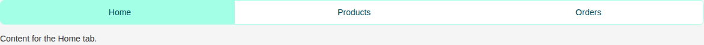
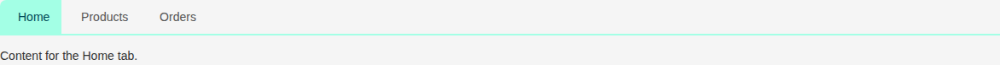
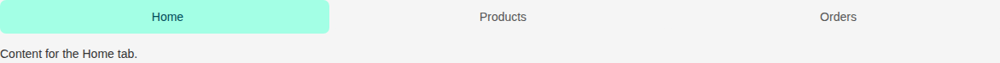
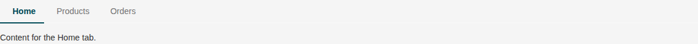
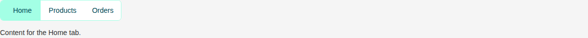

# Tabs

Storybook title `Components/Tabs` · source `./src/components/s-tabs-group/s-tabs-group.stories.tsx`

Tags rendered: `<s-tab-body>`, `<s-tab-head>`, `<s-tabs-group>`

The `s-tabs-group` component represents a group of tabs in a tabbed interface. It handles the display of tab headers and bodies, providing properties for customization, using the `s-tab-head` and `s-tab-body` components. to create a tabbed interface.

## Props

| Prop | Type / control | Options | Default | Description |
|---|---|---|---|---|
| `id` | string |  | `''` | Tabs group unique identifier |
| `name` | string |  | `''` | Tabs group unique name |
| `theme` | string | `default`, `stack`, `buttons`, `underline` | `default` | Tabs group theme style, you can choose between 'default', 'stack', 'buttons' and 'underline' |
| `wide` | boolean |  | `true` | Enable full width |
| `loading` | boolean |  | `false` | Loading state |
| `tabChanged` |  |  |  | Emitted when the active tab changes. Provides index, value, and payload information. |

## Stories

### Default

Story id `components-tabs--default`



Args:

```json
{
  "id": "tabs_group_default",
  "name": "Default Tabs Group",
  "theme": "default",
  "wide": true,
  "loading": false
}
```

<details><summary>Rendered markup</summary>

```html
<div class="flex items-start flex-col gap-4">
    <s-tabs-group id="tabs_group_default" name="Default Tabs Group" theme="default" wide="" class="s-tabs-group s-tabs-group--default w-full ltr hydrated">
      <div slot="head">
        <s-tab-head value="tab_home" active="" class="s-tab-head s-tab-head--default active ltr hydrated">
          <i class="hgi-stroke hgi-home-01"></i>
          Home
        </s-tab-head>

        <s-tab-head value="tab_products" class="s-tab-head s-tab-head--default ltr hydrated">
          <i class="hgi-stroke hgi-shirt-01"></i>
          Products
        </s-tab-head>

        <s-tab-head value="tab_orders" class="s-tab-head s-tab-head--default ltr hydrated">
          <i class="hgi-stroke hgi-archive-02"></i>
          Orders
        </s-tab-head>
      </div>
      <div slot="body">
        <s-tab-body id="tab_home" active="" class="s-tab-body s-tab-body--default active ltr hydrated">
          <article>
            <p>Content for the Home tab.</p>
          </article>
        </s-tab-body>
        <s-tab-body id="tab_products" class="s-tab-body s-tab-body--default ltr hydrated">
          <article>
            <p>Content for the Products tab.</p>
          </article>
        </s-tab-body>
        <s-tab-body id="tab_orders" class="s-tab-body s-tab-body--default ltr hydrated">
          <article>
            <p>Content for the Orders tab.</p>
          </article>
        </s-tab-body>
      </div>
    </s-tabs-group>
  </div>
```

</details>

### Stack

Story id `components-tabs--stack`



Args:

```json
{
  "id": "tabs_group_stack",
  "name": "Stack Tabs Group",
  "theme": "stack",
  "wide": true,
  "loading": false
}
```

<details><summary>Rendered markup</summary>

```html
<div class="flex items-start flex-col gap-4">
    <s-tabs-group id="tabs_group_stack" name="Stack Tabs Group" theme="stack" wide="" class="s-tabs-group s-tabs-group--stack w-full ltr hydrated">
      <div slot="head">
        <s-tab-head value="tab_home" active="" class="s-tab-head s-tab-head--stack active ltr hydrated">
          <i class="hgi-stroke hgi-home-01"></i>
          Home
        </s-tab-head>

        <s-tab-head value="tab_products" class="s-tab-head s-tab-head--stack ltr hydrated">
          <i class="hgi-stroke hgi-shirt-01"></i>
          Products
        </s-tab-head>

        <s-tab-head value="tab_orders" class="s-tab-head s-tab-head--stack ltr hydrated">
          <i class="hgi-stroke hgi-archive-02"></i>
          Orders
        </s-tab-head>
      </div>
      <div slot="body">
        <s-tab-body id="tab_home" active="" class="s-tab-body s-tab-body--stack active ltr hydrated">
          <article>
            <p>Content for the Home tab.</p>
          </article>
        </s-tab-body>
        <s-tab-body id="tab_products" class="s-tab-body s-tab-body--stack ltr hydrated">
          <article>
            <p>Content for the Products tab.</p>
          </article>
        </s-tab-body>
        <s-tab-body id="tab_orders" class="s-tab-body s-tab-body--stack ltr hydrated">
          <article>
            <p>Content for the Orders tab.</p>
          </article>
        </s-tab-body>
      </div>
    </s-tabs-group>
  </div>
```

</details>

### Buttons

Story id `components-tabs--buttons`



Args:

```json
{
  "id": "tabs_group_buttons",
  "name": "Buttons Tabs Group",
  "theme": "buttons",
  "wide": true,
  "loading": false
}
```

<details><summary>Rendered markup</summary>

```html
<div class="flex items-start flex-col gap-4">
    <s-tabs-group id="tabs_group_buttons" name="Buttons Tabs Group" theme="buttons" wide="" class="s-tabs-group s-tabs-group--buttons w-full ltr hydrated">
      <div slot="head">
        <s-tab-head value="tab_home" active="" class="s-tab-head s-tab-head--buttons active ltr hydrated">
          <i class="hgi-stroke hgi-home-01"></i>
          Home
        </s-tab-head>

        <s-tab-head value="tab_products" class="s-tab-head s-tab-head--buttons ltr hydrated">
          <i class="hgi-stroke hgi-shirt-01"></i>
          Products
        </s-tab-head>

        <s-tab-head value="tab_orders" class="s-tab-head s-tab-head--buttons ltr hydrated">
          <i class="hgi-stroke hgi-archive-02"></i>
          Orders
        </s-tab-head>
      </div>
      <div slot="body">
        <s-tab-body id="tab_home" active="" class="s-tab-body s-tab-body--buttons active ltr hydrated">
          <article>
            <p>Content for the Home tab.</p>
          </article>
        </s-tab-body>
        <s-tab-body id="tab_products" class="s-tab-body s-tab-body--buttons ltr hydrated">
          <article>
            <p>Content for the Products tab.</p>
          </article>
        </s-tab-body>
        <s-tab-body id="tab_orders" class="s-tab-body s-tab-body--buttons ltr hydrated">
          <article>
            <p>Content for the Orders tab.</p>
          </article>
        </s-tab-body>
      </div>
    </s-tabs-group>
  </div>
```

</details>

### Underline

Story id `components-tabs--underline`



Args:

```json
{
  "id": "tabs_group_underline",
  "name": "Underline Tabs Group",
  "theme": "underline",
  "wide": true,
  "loading": false
}
```

<details><summary>Rendered markup</summary>

```html
<div class="flex items-start flex-col gap-4">
    <s-tabs-group id="tabs_group_underline" name="Underline Tabs Group" theme="underline" wide="" class="s-tabs-group s-tabs-group--underline w-full ltr hydrated">
      <div slot="head">
        <s-tab-head value="tab_home" active="" class="s-tab-head s-tab-head--underline active ltr hydrated">
          <i class="hgi-stroke hgi-home-01"></i>
          Home
        </s-tab-head>

        <s-tab-head value="tab_products" class="s-tab-head s-tab-head--underline ltr hydrated">
          <i class="hgi-stroke hgi-shirt-01"></i>
          Products
        </s-tab-head>

        <s-tab-head value="tab_orders" class="s-tab-head s-tab-head--underline ltr hydrated">
          <i class="hgi-stroke hgi-archive-02"></i>
          Orders
        </s-tab-head>
      </div>
      <div slot="body">
        <s-tab-body id="tab_home" active="" class="s-tab-body s-tab-body--underline active ltr hydrated">
          <article>
            <p>Content for the Home tab.</p>
          </article>
        </s-tab-body>
        <s-tab-body id="tab_products" class="s-tab-body s-tab-body--underline ltr hydrated">
          <article>
            <p>Content for the Products tab.</p>
          </article>
        </s-tab-body>
        <s-tab-body id="tab_orders" class="s-tab-body s-tab-body--underline ltr hydrated">
          <article>
            <p>Content for the Orders tab.</p>
          </article>
        </s-tab-body>
      </div>
    </s-tabs-group>
  </div>
```

</details>

### Fit Width

Story id `components-tabs--fit-width`



Args:

```json
{
  "id": "tabs_group_narrow",
  "name": "Narrow Tabs Group",
  "theme": "default",
  "wide": false,
  "loading": false
}
```

<details><summary>Rendered markup</summary>

```html
<div class="flex items-start flex-col gap-4">
    <s-tabs-group id="tabs_group_narrow" name="Narrow Tabs Group" theme="default" class="s-tabs-group s-tabs-group--default ltr hydrated">
      <div slot="head">
        <s-tab-head value="tab_home" active="" class="s-tab-head s-tab-head--default active ltr hydrated">
          <i class="hgi-stroke hgi-home-01"></i>
          Home
        </s-tab-head>

        <s-tab-head value="tab_products" class="s-tab-head s-tab-head--default ltr hydrated">
          <i class="hgi-stroke hgi-shirt-01"></i>
          Products
        </s-tab-head>

        <s-tab-head value="tab_orders" class="s-tab-head s-tab-head--default ltr hydrated">
          <i class="hgi-stroke hgi-archive-02"></i>
          Orders
        </s-tab-head>
      </div>
      <div slot="body">
        <s-tab-body id="tab_home" active="" class="s-tab-body s-tab-body--default active ltr hydrated">
          <article>
            <p>Content for the Home tab.</p>
          </article>
        </s-tab-body>
        <s-tab-body id="tab_products" class="s-tab-body s-tab-body--default ltr hydrated">
          <article>
            <p>Content for the Products tab.</p>
          </article>
        </s-tab-body>
        <s-tab-body id="tab_orders" class="s-tab-body s-tab-body--default ltr hydrated">
          <article>
            <p>Content for the Orders tab.</p>
          </article>
        </s-tab-body>
      </div>
    </s-tabs-group>
  </div>
```

</details>
