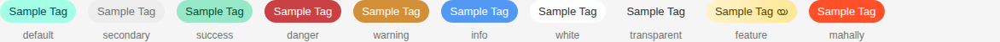
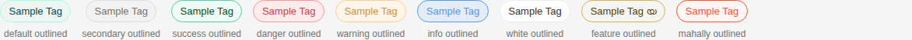
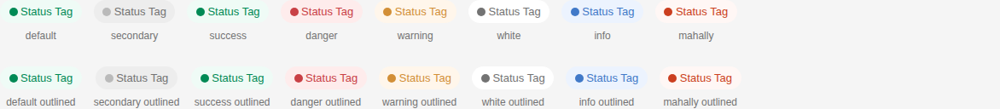

# Tag

Storybook title `Components/Tag` · source `./src/components/s-tag/s-tag.stories.tsx`

Tags rendered: `<s-tag>`

A tag is a visual element used for categorization, labeling, or marking content. Tags can be customized with different themes, sizes, and behaviors.

## Props

| Prop | Type / control | Options | Default | Description |
|---|---|---|---|---|
| `label` | string |  |  |  |
| `theme` | select | `default`, `secondary`, `success`, `danger`, `warning`, `info`, `white`, `transparent`, `feature`, `mahally` | `default` | Tag theme |
| `size` | select | `sm`, `md` | `md` | Tag size |
| `layout` | select | `default`, `status` | `default` | Tag layout |
| `outlined` | boolean |  | `false` | Outlined state |
| `closable` | boolean |  | `false` | Enable closable tag |
| `disabled` | boolean |  | `false` | Disabled state |
| `nowrap` | boolean |  | `true` | Prevent text wrapping inside the tag |
| `feature` | boolean |  | `true` | Show feature tag for a certain element |
| `onclose` |  |  |  | Emitted when the tag is closed. |

## Stories

### Default

Story id `components-tag--default`


Args:

```json
{
  "label": "New"
}
```

<details><summary>Rendered markup</summary>

```html
<s-tag class="s-tag s-tag--default whitespace-nowrap md ltr hydrated">New</s-tag>
```

</details>

### Theme Variants

Story id `components-tag--theme-variants`



Args:

```json
{
  "label": "Sample Tag"
}
```

<details><summary>Rendered markup</summary>

```html
<div class="flex flex-wrap gap-4">
        
          <div class="flex flex-col items-center gap-2">
            <s-tag theme="default" class="s-tag s-tag--default whitespace-nowrap md ltr hydrated">Sample Tag</s-tag>
            <span class="text-xs text-dark-100">default</span>
          </div>
        
          <div class="flex flex-col items-center gap-2">
            <s-tag theme="secondary" class="s-tag s-tag--secondary whitespace-nowrap md ltr hydrated">Sample Tag</s-tag>
            <span class="text-xs text-dark-100">secondary</span>
          </div>
        
          <div class="flex flex-col items-center gap-2">
            <s-tag theme="success" class="s-tag s-tag--success whitespace-nowrap md ltr hydrated">Sample Tag</s-tag>
            <span class="text-xs text-dark-100">success</span>
          </div>
        
          <div class="flex flex-col items-center gap-2">
            <s-tag theme="danger" class="s-tag s-tag--danger whitespace-nowrap md ltr hydrated">Sample Tag</s-tag>
            <span class="text-xs text-dark-100">danger</span>
          </div>
        
          <div class="flex flex-col items-center gap-2">
            <s-tag theme="warning" class="s-tag s-tag--warning whitespace-nowrap md ltr hydrated">Sample Tag</s-tag>
            <span class="text-xs text-dark-100">warning</span>
          </div>
        
          <div class="flex flex-col items-center gap-2">
            <s-tag theme="info" class="s-tag s-tag--info whitespace-nowrap md ltr hydrated">Sample Tag</s-tag>
            <span class="text-xs text-dark-100">info</span>
          </div>
        
          <div class="flex flex-col items-center gap-2">
            <s-tag theme="white" class="s-tag s-tag--white whitespace-nowrap md ltr hydrated">Sample Tag</s-tag>
            <span class="text-xs text-dark-100">white</span>
          </div>
        
          <div class="flex flex-col items-center gap-2">
            <s-tag theme="transparent" class="s-tag s-tag--transparent whitespace-nowrap md ltr hydrated">Sample Tag</s-tag>
            <span class="text-xs text-dark-100">transparent</span>
          </div>
        
          <div class="flex flex-col items-center gap-2">
            <s-tag theme="feature" class="s-tag s-tag--feature whitespace-nowrap md ltr hydrated">Sample Tag</s-tag>
            <span class="text-xs text-dark-100">feature</span>
          </div>
        
          <div class="flex flex-col items-center gap-2">
            <s-tag theme="mahally" class="s-tag s-tag--mahally whitespace-nowrap md ltr hydrated">Sample Tag</s-tag>
            <span class="text-xs text-dark-100">mahally</span>
          </div>
        
      </div>
```

</details>

### Size Variants

Story id `components-tag--size-variants`


Args:

```json
{
  "label": "Sample Tag"
}
```

<details><summary>Rendered markup</summary>

```html
<div class="flex flex-wrap gap-4 items-end">
        
          <div class="flex flex-col items-center gap-2">
            <s-tag size="md" class="s-tag s-tag--default whitespace-nowrap md ltr hydrated">Sample Tag</s-tag>
            <span class="text-xs text-dark-100">md</span>
          </div>
        
          <div class="flex flex-col items-center gap-2">
            <s-tag size="sm" class="s-tag s-tag--default whitespace-nowrap sm ltr hydrated">Sample Tag</s-tag>
            <span class="text-xs text-dark-100">sm</span>
          </div>
        
      </div>
```

</details>

### Outlined Variants

Story id `components-tag--outlined-variants`



Args:

```json
{
  "label": "Sample Tag"
}
```

<details><summary>Rendered markup</summary>

```html
<div class="flex flex-wrap gap-4">
        
          <div class="flex flex-col items-center gap-2">
            <s-tag theme="default" outlined="" class="s-tag s-tag--default whitespace-nowrap outlined md ltr hydrated">Sample Tag</s-tag>
            <span class="text-xs text-dark-100">default outlined</span>
          </div>
        
          <div class="flex flex-col items-center gap-2">
            <s-tag theme="secondary" outlined="" class="s-tag s-tag--secondary whitespace-nowrap outlined md ltr hydrated">Sample Tag</s-tag>
            <span class="text-xs text-dark-100">secondary outlined</span>
          </div>
        
          <div class="flex flex-col items-center gap-2">
            <s-tag theme="success" outlined="" class="s-tag s-tag--success whitespace-nowrap outlined md ltr hydrated">Sample Tag</s-tag>
            <span class="text-xs text-dark-100">success outlined</span>
          </div>
        
          <div class="flex flex-col items-center gap-2">
            <s-tag theme="danger" outlined="" class="s-tag s-tag--danger whitespace-nowrap outlined md ltr hydrated">Sample Tag</s-tag>
            <span class="text-xs text-dark-100">danger outlined</span>
          </div>
        
          <div class="flex flex-col items-center gap-2">
            <s-tag theme="warning" outlined="" class="s-tag s-tag--warning whitespace-nowrap outlined md ltr hydrated">Sample Tag</s-tag>
            <span class="text-xs text-dark-100">warning outlined</span>
          </div>
        
          <div class="flex flex-col items-center gap-2">
            <s-tag theme="info" outlined="" class="s-tag s-tag--info whitespace-nowrap outlined md ltr hydrated">Sample Tag</s-tag>
            <span class="text-xs text-dark-100">info outlined</span>
          </div>
        
          <div class="flex flex-col items-center gap-2">
            <s-tag theme="white" outlined="" class="s-tag s-tag--white whitespace-nowrap outlined md ltr hydrated">Sample Tag</s-tag>
            <span class="text-xs text-dark-100">white outlined</span>
          </div>
        
          <div class="flex flex-col items-center gap-2">
            <s-tag theme="feature" outlined="" class="s-tag s-tag--feature whitespace-nowrap outlined md ltr hydrated">Sample Tag</s-tag>
            <span class="text-xs text-dark-100">feature outlined</span>
          </div>
        
          <div class="flex flex-col items-center gap-2">
            <s-tag theme="mahally" outlined="" class="s-tag s-tag--mahally whitespace-nowrap outlined md ltr hydrated">Sample Tag</s-tag>
            <span class="text-xs text-dark-100">mahally outlined</span>
          </div>
        
      </div>
```

</details>

### Status Layout

Story id `components-tag--status-layout`



Args:

```json
{
  "label": "Status Tag",
  "layout": "status"
}
```

<details><summary>Rendered markup</summary>

```html
<div class="flex flex-col gap-8">
        <div class="flex flex-wrap gap-4">
          
            <div class="flex flex-col items-center gap-2">
              <s-tag layout="status" theme="default" class="s-tag s-tag--default s-tag--status whitespace-nowrap md ltr hydrated">Status Tag</s-tag>
              <span class="text-xs text-dark-100">default</span>
            </div>
          
            <div class="flex flex-col items-center gap-2">
              <s-tag layout="status" theme="secondary" class="s-tag s-tag--secondary s-tag--status whitespace-nowrap md ltr hydrated">Status Tag</s-tag>
              <span class="text-xs text-dark-100">secondary</span>
            </div>
          
            <div class="flex flex-col items-center gap-2">
              <s-tag layout="status" theme="success" class="s-tag s-tag--success s-tag--status whitespace-nowrap md ltr hydrated">Status Tag</s-tag>
              <span class="text-xs text-dark-100">success</span>
            </div>
          
            <div class="flex flex-col items-center gap-2">
              <s-tag layout="status" theme="danger" class="s-tag s-tag--danger s-tag--status whitespace-nowrap md ltr hydrated">Status Tag</s-tag>
              <span class="text-xs text-dark-100">danger</span>
            </div>
          
            <div class="flex flex-col items-center gap-2">
              <s-tag layout="status" theme="warning" class="s-tag s-tag--warning s-tag--status whitespace-nowrap md ltr hydrated">Status Tag</s-tag>
              <span class="text-xs text-dark-100">warning</span>
            </div>
          
            <div class="flex flex-col items-center gap-2">
              <s-tag layout="status" theme="white" class="s-tag s-tag--white s-tag--status whitespace-nowrap md ltr hydrated">Status Tag</s-tag>
              <span class="text-xs text-dark-100">white</span>
            </div>
          
            <div class="flex flex-col items-center gap-2">
              <s-tag layout="status" theme="info" class="s-tag s-tag--info s-tag--status whitespace-nowrap md ltr hydrated">Status Tag</s-tag>
              <span class="text-xs text-dark-100">info</span>
            </div>
          
            <div class="flex flex-col items-center gap-2">
              <s-tag layout="status" theme="mahally" class="s-tag s-tag--mahally s-tag--status whitespace-nowrap md ltr hydrated">Status Tag</s-tag>
              <span class="text-xs text-dark-100">mahally</span>
            </div>
          
        </div>

        <div class="flex flex-wrap gap-4">
          
            <div class="flex flex-col items-center gap-2">
              <s-tag layout="status" theme="default" outlined="" class="s-tag s-tag--default s-tag--status whitespace-nowrap outlined md ltr hydrated">Status Tag</s-tag>
              <span class="text-xs text-dark-100">default outlined</span>
            </div>
          
            <div class="flex flex-col items-center gap-2">
              <s-tag layout="status" theme="secondary" outlined="" class="s-tag s-tag--secondary s-tag--status whitespace-nowrap outlined md ltr hydrated">Status Tag</s-tag>
              <span class="text-xs text-dark-100">secondary outlined</span>
            </div>
          
            <div class="flex flex-col items-center gap-2">
              <s-tag layout="status" theme="success" outlined="" class="s-tag s-tag--success s-tag--status whitespace-nowrap outlined md ltr hydrated">Status Tag</s-tag>
              <span class="text-xs text-dark-100">success outlined</span>
            </div>
          
            <div class="flex flex-col items-center gap-2">
              <s-tag layout="status" theme="danger" outlined="" class="s-tag s-tag--danger s-tag--status whitespace-nowrap outlined md ltr hydrated">Status Tag</s-tag>
              <span class="text-xs text-dark-100">danger outlined</span>
            </div>
          
            <div class="flex flex-col items-center gap-2">
              <s-tag layout="status" theme="warning" outlined="" class="s-tag s-tag--warning s-tag--status whitespace-nowrap outlined md ltr hydrated">Status Tag</s-tag>
              <span class="text-xs text-dark-100">warning outlined</span>
            </div>
          
            <div class="flex flex-col items-center gap-2">
              <s-tag layout="status" theme="white" outlined="" class="s-tag s-tag--white s-tag--status whitespace-nowrap outlined md ltr hydrated">Status Tag</s-tag>
              <span class="text-xs text-dark-100">white outlined</span>
            </div>
          
            <div class="flex flex-col items-center gap-2">
              <s-tag layout="status" theme="info" outlined="" class="s-tag s-tag--info s-tag--status whitespace-nowrap outlined md ltr hydrated">Status Tag</s-tag>
              <span class="text-xs text-dark-100">info outlined</span>
            </div>
          
            <div class="flex flex-col items-center gap-2">
              <s-tag layout="status" theme="mahally" outlined="" class="s-tag s-tag--mahally s-tag--status whitespace-nowrap outlined md ltr hydrated">Status Tag</s-tag>
              <span class="text-xs text-dark-100">mahally outlined</span>
            </div>
          
        </div>
      </div>
```

</details>

### Closable

Story id `components-tag--closable`


Args:

```json
{
  "label": "Closable Tag",
  "closable": true
}
```

<details><summary>Rendered markup</summary>

```html
<s-tag closable="" class="s-tag s-tag--default whitespace-nowrap closable md ltr hydrated">Closable Tag</s-tag>
```

</details>

### Disabled

Story id `components-tag--disabled`


Args:

```json
{
  "label": "Disabled Tag",
  "disabled": true
}
```

<details><summary>Rendered markup</summary>

```html
<s-tag disabled="" class="s-tag s-tag--default whitespace-nowrap disabled md ltr hydrated">Disabled Tag</s-tag>
```

</details>

### Closable Theme Variants

Story id `components-tag--closable-theme-variants`


Args:

```json
{
  "label": "Closable"
}
```

<details><summary>Rendered markup</summary>

```html
<div class="flex flex-wrap gap-4">
        
          <div class="flex flex-col items-center gap-2">
            <s-tag theme="default" closable="" class="s-tag s-tag--default whitespace-nowrap closable md ltr hydrated">Closable</s-tag>
            <span class="text-xs text-dark-100">default</span>
          </div>
        
          <div class="flex flex-col items-center gap-2">
            <s-tag theme="secondary" closable="" class="s-tag s-tag--secondary whitespace-nowrap closable md ltr hydrated">Closable</s-tag>
            <span class="text-xs text-dark-100">secondary</span>
          </div>
        
          <div class="flex flex-col items-center gap-2">
            <s-tag theme="success" closable="" class="s-tag s-tag--success whitespace-nowrap closable md ltr hydrated">Closable</s-tag>
            <span class="text-xs text-dark-100">success</span>
          </div>
        
          <div class="flex flex-col items-center gap-2">
            <s-tag theme="danger" closable="" class="s-tag s-tag--danger whitespace-nowrap closable md ltr hydrated">Closable</s-tag>
            <span class="text-xs text-dark-100">danger</span>
          </div>
        
          <div class="flex flex-col items-center gap-2">
            <s-tag theme="warning" closable="" class="s-tag s-tag--warning whitespace-nowrap closable md ltr hydrated">Closable</s-tag>
            <span class="text-xs text-dark-100">warning</span>
          </div>
        
          <div class="flex flex-col items-center gap-2">
            <s-tag theme="info" closable="" class="s-tag s-tag--info whitespace-nowrap closable md ltr hydrated">Closable</s-tag>
            <span class="text-xs text-dark-100">info</span>
          </div>
        
          <div class="flex flex-col items-center gap-2">
            <s-tag theme="mahally" closable="" class="s-tag s-tag--mahally whitespace-nowrap closable md ltr hydrated">Closable</s-tag>
            <span class="text-xs text-dark-100">mahally</span>
          </div>
        
      </div>
```

</details>

### Long Text

Story id `components-tag--long-text`


Args:

```json
{
  "label": "This is a very long tag text that might wrap",
  "nowrap": false
}
```

<details><summary>Rendered markup</summary>

```html
<s-tag class="s-tag s-tag--default whitespace-nowrap md ltr hydrated">This is a very long tag text that might wrap</s-tag>
```

</details>

### No Wrap

Story id `components-tag--no-wrap`


Args:

```json
{
  "label": "This is a very long tag text that should not wrap",
  "nowrap": true
}
```

<details><summary>Rendered markup</summary>

```html
<s-tag nowrap="" class="s-tag s-tag--default whitespace-nowrap md ltr hydrated">This is a very long tag text that should not wrap</s-tag>
```

</details>

### With Feature

Story id `components-tag--with-feature`


Args:

```json
{
  "label": "Feature Tag",
  "theme": "feature",
  "feature": true
}
```

<details><summary>Rendered markup</summary>

```html
<s-tag theme="feature" feature="true" class="s-tag s-tag--feature whitespace-nowrap md ltr hydrated">Feature Tag</s-tag>
```

</details>

### Disabled Feature

Story id `components-tag--disabled-feature`


Args:

```json
{
  "label": "Disabled Feature",
  "theme": "feature",
  "feature": false
}
```

<details><summary>Rendered markup</summary>

```html
<s-tag theme="feature" feature="false" class="s-tag s-tag--feature whitespace-nowrap md ltr hydrated">Disabled Feature</s-tag>
```

</details>

### Mixed Examples

Story id `components-tag--mixed-examples`


Args:

```json
{
  "label": "Mixed"
}
```

<details><summary>Rendered markup</summary>

```html
<div class="flex flex-col gap-6">
      <div class="flex flex-wrap gap-3">
        <s-tag theme="success" class="s-tag s-tag--success whitespace-nowrap md ltr hydrated">Active</s-tag>
        <s-tag theme="warning" class="s-tag s-tag--warning whitespace-nowrap md ltr hydrated">Pending</s-tag>
        <s-tag theme="danger" class="s-tag s-tag--danger whitespace-nowrap md ltr hydrated">Error</s-tag>
        <s-tag theme="info" class="s-tag s-tag--info whitespace-nowrap md ltr hydrated">Information</s-tag>
      </div>
      
      <div class="flex flex-wrap gap-3">
        <s-tag theme="secondary" size="sm" class="s-tag s-tag--secondary whitespace-nowrap sm ltr hydrated">Small</s-tag>
        <s-tag theme="secondary" size="md" class="s-tag s-tag--secondary whitespace-nowrap md ltr hydrated">Medium</s-tag>
      </div>
      
      <div class="flex flex-wrap gap-3">
        <s-tag theme="default" outlined="" class="s-tag s-tag--default whitespace-nowrap outlined md ltr hydrated">Outlined Default</s-tag>
        <s-tag theme="success" outlined="" class="s-tag s-tag--success whitespace-nowrap outlined md ltr hydrated">Outlined Success</s-tag>
        <s-tag theme="danger" outlined="" class="s-tag s-tag--danger whitespace-nowrap outlined md ltr hydrated">Outlined Danger</s-tag>
      </div>
      
      <div class="flex flex-wrap gap-3">
        <s-tag theme="secondary" closable="" class="s-tag s-tag--secondary whitespace-nowrap closable md ltr hydrated">Closable Secondary</s-tag>
        <s-tag theme="warning" closable="" class="s-tag s-tag--warning whitespace-nowrap closable md ltr hydrated">Closable Warning</s-tag>
        <s-tag theme="info" closable="" class="s-tag s-tag--info whitespace-nowrap closable md ltr hydrated">Closable Info</s-tag>
      </div>
    </div>
```

</details>
