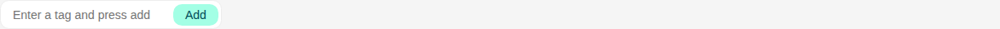
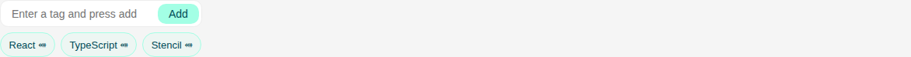
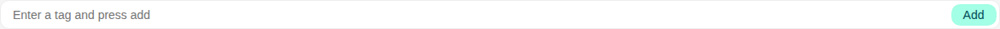
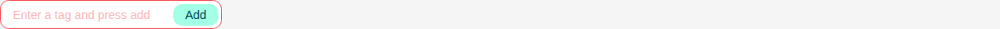

# Tags Input

Storybook title `Components/Tags Input` · source `./src/components/s-tags/s-tags.stories.tsx`

Tags rendered: `<s-tags>`

A tags input component that allows users to add, remove, and manage multiple tag values. Supports customizable themes, maximum limits, and form validation.

## Props

| Prop | Type / control | Options | Default | Description |
|---|---|---|---|---|
| `placeholder` | string |  | `undefined` | Placeholder text |
| `value` | object |  | `[]` | Array of current tag values |
| `max` | number |  | `undefined` | Maximum number of tags allowed |
| `wide` | boolean |  | `false` | Makes the input take full width |
| `hasError` | boolean |  | `false` | Error state |
| `disabled` | boolean |  | `false` | Disabled state |
| `buttonLabel` | text |  | `Add` | Button label |
| `buttonTheme` | select | `default`, `secondary`, `danger`, `warning`, `info`, `white`, `transparent`, `feature` | `default` | Button theme |
| `tagTheme` | select | `default`, `secondary`, `success`, `danger`, `warning`, `info`, `white`, `transparent`, `feature` | `white` | Tag theme |
| `tagSize` | select | `sm`, `md` | `md` | Tag size |
| `valueChanged` |  |  |  | Emitted when the tags value changes. |

## Stories

### Default

Story id `components-tags-input--default`



Args:

```json
{
  "placeholder": "Enter a tag and press add"
}
```

<details><summary>Rendered markup</summary>

```html
<s-tags id="tags-q0e7xn8nq" placeholder="Enter a tag and press add" button-label="Add" tag-theme="default" tags-size="sm" class="flex flex-col gap-2 hydrated"></s-tags>
```

</details>

### Initial Values

Story id `components-tags-input--initial-values`



Args:

```json
{
  "value": [
    "React",
    "TypeScript",
    "Stencil"
  ],
  "placeholder": "Enter a tag and press add"
}
```

<details><summary>Rendered markup</summary>

```html
<s-tags id="tags-xzblzzvct" placeholder="Enter a tag and press add" button-label="Add" tag-theme="default" tags-size="sm" class="flex flex-col gap-2 hydrated"></s-tags>
```

</details>

### Max Limit

Story id `components-tags-input--max-limit`


Args:

```json
{
  "max": 3,
  "placeholder": "Enter a tag and press add"
}
```

<details><summary>Rendered markup</summary>

```html
<s-tags id="tags-9qws3psu1" max="3" placeholder="Enter a tag and press add" button-label="Add" tag-theme="default" tags-size="sm" class="flex flex-col gap-2 hydrated"></s-tags>
```

</details>

### Wide

Story id `components-tags-input--wide`



Args:

```json
{
  "placeholder": "Enter a tag and press add",
  "wide": true
}
```

<details><summary>Rendered markup</summary>

```html
<s-tags id="tags-h8sik1k7r" placeholder="Enter a tag and press add" wide="" button-label="Add" tag-theme="default" tags-size="sm" class="flex flex-col gap-2 hydrated"></s-tags>
```

</details>

### Has Error

Story id `components-tags-input--has-error`



Args:

```json
{
  "placeholder": "Enter a tag and press add",
  "hasError": true
}
```

<details><summary>Rendered markup</summary>

```html
<s-tags id="tags-zbh6da4af" placeholder="Enter a tag and press add" has-error="" button-label="Add" tag-theme="default" tags-size="sm" class="flex flex-col gap-2 hydrated"></s-tags>
```

</details>

### Disabled

Story id `components-tags-input--disabled`


Args:

```json
{
  "placeholder": "Enter a tag and press add",
  "disabled": true
}
```

<details><summary>Rendered markup</summary>

```html
<s-tags id="tags-itucoz0t8" placeholder="Enter a tag and press add" disabled="" button-label="Add" tag-theme="default" tags-size="sm" class="flex flex-col gap-2 hydrated"></s-tags>
```

</details>
