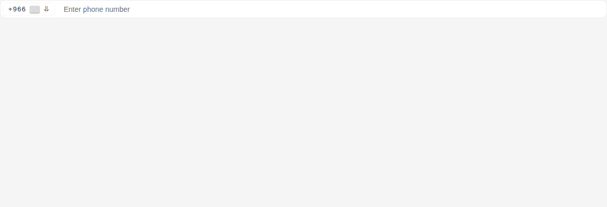
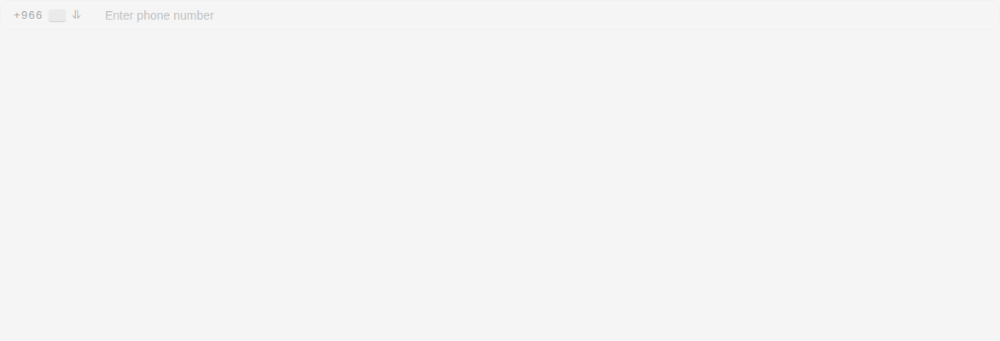

# Telephone Input

Storybook title `Components/Telephone Input` · source `./src/components/s-tel-input/s-tel-input.stories.tsx`

Tags rendered: `<s-tel-input>`

## Props

| Prop | Type / control | Options | Default | Description |
|---|---|---|---|---|
| `placeholder` | string |  |  | Input placeholder |
| `wide` | boolean |  |  | Wide state |
| `value` | text |  |  | Input value |
| `required` | boolean |  |  | Required state |
| `size` | select |  |  | Input size |
| `disabled` | boolean |  |  | Disabled state |
| `hasError` | boolean |  |  | Error state |
| `valueChanged` |  |  |  | Emitted when the value of the telephone input changes. |

## Stories

### Default

Story id `components-telephone-input--default`


Args:

```json
{
  "placeholder": "Enter phone number",
  "wide": true
}
```

<details><summary>Rendered markup</summary>

```html
<style>
    #story--components-telephone-input--default--primary-inner {
      height: 300px !important;
    }
  
    #story--components-telephone-input--large--primary-inner {
      height: 300px !important;
    }
  
    #story--components-telephone-input--has-error--primary-inner {
      height: 300px !important;
    }
  
    #story--components-telephone-input--disabled--primary-inner {
      height: 300px !important;
    }
  </style>
  <div class="flex items-start flex-col gap-4 min-h-[400px]">
      <s-tel-input value="" placeholder="Enter phone number" wide="" class="w-full md ltr hydrated" dir="ltr">      
    </s-tel-input>
  </div>
```

</details>

### Large

Story id `components-telephone-input--large`


Args:

```json
{
  "placeholder": "Enter phone number",
  "wide": true,
  "size": "lg"
}
```

<details><summary>Rendered markup</summary>

```html
<style>
    #story--components-telephone-input--default--primary-inner {
      height: 300px !important;
    }
  
    #story--components-telephone-input--large--primary-inner {
      height: 300px !important;
    }
  
    #story--components-telephone-input--has-error--primary-inner {
      height: 300px !important;
    }
  
    #story--components-telephone-input--disabled--primary-inner {
      height: 300px !important;
    }
  </style>
  <div class="flex items-start flex-col gap-4 min-h-[400px]">
      <s-tel-input value="" placeholder="Enter phone number" size="lg" wide="" class="w-full lg ltr hydrated" dir="ltr">      
    </s-tel-input>
  </div>
```

</details>

### Has Error

Story id `components-telephone-input--has-error`



Args:

```json
{
  "placeholder": "Enter phone number",
  "wide": true,
  "hasError": true
}
```

<details><summary>Rendered markup</summary>

```html
<style>
    #story--components-telephone-input--default--primary-inner {
      height: 300px !important;
    }
  
    #story--components-telephone-input--large--primary-inner {
      height: 300px !important;
    }
  
    #story--components-telephone-input--has-error--primary-inner {
      height: 300px !important;
    }
  
    #story--components-telephone-input--disabled--primary-inner {
      height: 300px !important;
    }
  </style>
  <div class="flex items-start flex-col gap-4 min-h-[400px]">
      <s-tel-input value="" placeholder="Enter phone number" wide="" haserror="" class="w-full md ltr hydrated" dir="ltr">      
    </s-tel-input>
  </div>
```

</details>

### Disabled

Story id `components-telephone-input--disabled`



Args:

```json
{
  "placeholder": "Enter phone number",
  "wide": true,
  "disabled": true
}
```

<details><summary>Rendered markup</summary>

```html
<style>
    #story--components-telephone-input--default--primary-inner {
      height: 300px !important;
    }
  
    #story--components-telephone-input--large--primary-inner {
      height: 300px !important;
    }
  
    #story--components-telephone-input--has-error--primary-inner {
      height: 300px !important;
    }
  
    #story--components-telephone-input--disabled--primary-inner {
      height: 300px !important;
    }
  </style>
  <div class="flex items-start flex-col gap-4 min-h-[400px]">
      <s-tel-input value="" placeholder="Enter phone number" wide="" disabled="" class="w-full md disabled ltr hydrated" dir="ltr">      
    </s-tel-input>
  </div>
```

</details>
