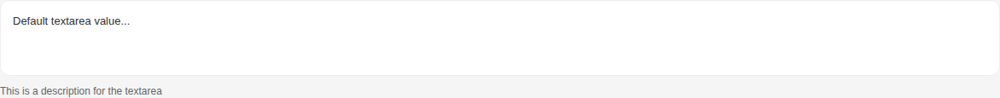
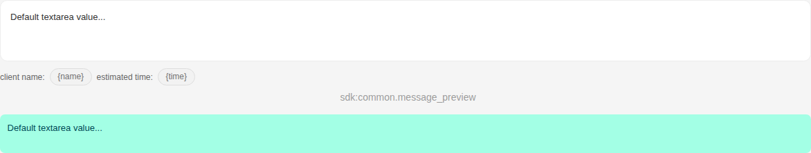
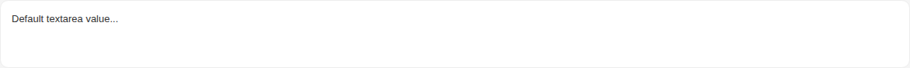
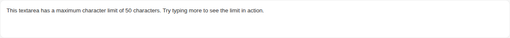
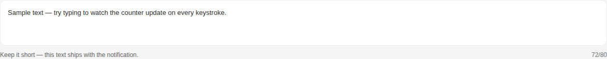
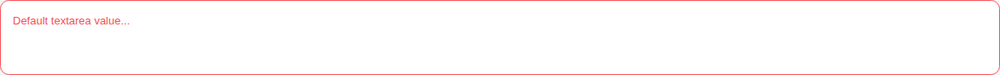
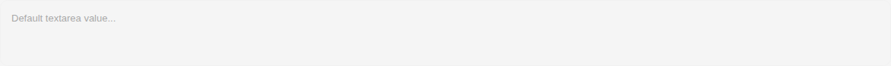
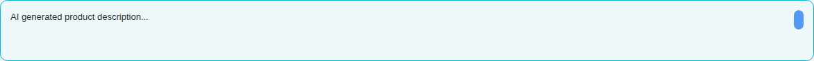

# Textarea

Storybook title `Components/Textarea` · source `./src/components/s-textarea/s-textarea.stories.tsx`

Tags rendered: `<s-button>`, `<s-icon>`, `<s-textarea>`

Textarea component is used for multiline text input, allowing users to enter longer text content with various configuration options.

## Props

| Prop | Type / control | Options | Default | Description |
|---|---|---|---|---|
| `value` | string |  | `Default textarea value...` | Textarea value |
| `placeholder` | string |  | `Enter your text here...` | Textarea placeholder |
| `disabled` | boolean |  | `false` | Disabled state |
| `hasError` | boolean |  | `false` | Error state |
| `hasPreview` | boolean |  | `false` | Enable textarea preview |
| `multilingual` | boolean |  | `false` | Enables multilingual support, enabled when value is an array of strings |
| `fullHeight` | boolean |  | `false` | Make textarea take full height of its container |
| `rows` | number |  | `4` | Number of visible text lines for the textarea |
| `feature` | boolean |  |  |  |
| `required` | boolean |  | `false` | Required state |
| `desc` | string |  | `undefined` | Textarea description, you can use it to add a description to the textarea |
| `showCount` | boolean |  | `false` | Show a live `current/max` character counter below the field. Requires `max`. Turns danger-red when the field has `has-error`. |
| `max` | number |  | `undefined` | Maximum number of characters allowed |
| `aiSuggestion` | object |  | `undefined` | AI suggestion config (object or JSON string): { enabled, regenerable, source }. When `enabled`, the textarea gets the Moshammer AI highlight and reveals the `actions` slot (regenerate / dismiss). |
| `valueChanged` |  |  |  | Emitted when the value of the textarea changes. |

## Stories

### Default

Story id `components-textarea--default`


Args:

```json
{
  "value": "Default textarea value...",
  "placeholder": "Enter your text here...",
  "disabled": false,
  "hasError": false,
  "hasPreview": false,
  "multilingual": false,
  "fullHeight": false,
  "rows": 3,
  "feature": true,
  "required": false,
  "desc": "",
  "showCount": false
}
```

<details><summary>Rendered markup</summary>

```html
<s-textarea value="Default textarea value..." placeholder="Enter your text here..." rows="3" feature="true" class="ltr hydrated">
    
    </s-textarea>
```

</details>

### Has Description

Story id `components-textarea--has-description`



Args:

```json
{
  "value": "Default textarea value...",
  "placeholder": "Enter your text here...",
  "disabled": false,
  "hasError": false,
  "hasPreview": false,
  "multilingual": false,
  "fullHeight": false,
  "rows": 3,
  "feature": true,
  "required": false,
  "desc": "This is a description for the textarea",
  "showCount": false
}
```

<details><summary>Rendered markup</summary>

```html
<s-textarea value="Default textarea value..." placeholder="Enter your text here..." rows="3" desc="This is a description for the textarea" feature="true" class="ltr hydrated">
    
    </s-textarea>
```

</details>

### Has Preview

Story id `components-textarea--has-preview`



Args:

```json
{
  "value": "Default textarea value...",
  "placeholder": "Enter your text here...",
  "disabled": false,
  "hasError": false,
  "hasPreview": true,
  "multilingual": false,
  "fullHeight": false,
  "rows": 3,
  "feature": true,
  "required": false,
  "desc": "client name: {name} estimated time: {time}",
  "showCount": false
}
```

<details><summary>Rendered markup</summary>

```html
<s-textarea value="Default textarea value..." placeholder="Enter your text here..." has-preview="" rows="3" desc="client name: {name} estimated time: {time}" feature="true" class="ltr hydrated">
    
    </s-textarea>
```

</details>

### Multilingual

Story id `components-textarea--multilingual`



Args:

```json
{
  "value": "Default textarea value...",
  "placeholder": "Enter your text here...",
  "disabled": false,
  "hasError": false,
  "hasPreview": false,
  "multilingual": true,
  "fullHeight": false,
  "rows": 3,
  "feature": true,
  "required": false,
  "desc": "",
  "showCount": false
}
```

<details><summary>Rendered markup</summary>

```html
<s-textarea value="Default textarea value..." placeholder="Enter your text here..." multilingual="" rows="3" feature="true" class="multilingual ltr hydrated">
    
    </s-textarea>
```

</details>

### With Max Length

Story id `components-textarea--with-max-length`



Args:

```json
{
  "value": "This textarea has a maximum character limit of 50 characters. Try typing more to see the limit in action.",
  "placeholder": "Enter your text here...",
  "disabled": false,
  "hasError": false,
  "hasPreview": false,
  "multilingual": false,
  "fullHeight": false,
  "rows": 3,
  "feature": true,
  "required": false,
  "desc": "",
  "showCount": false,
  "max": 50
}
```

<details><summary>Rendered markup</summary>

```html
<s-textarea value="This textarea has a maximum character limit of 50 characters. Try typing more to see the limit in action." placeholder="Enter your text here..." rows="3" max="50" feature="true" class="ltr hydrated">
    
    </s-textarea>
```

</details>

### With Character Counter

Story id `components-textarea--with-character-counter`



Args:

```json
{
  "value": "Sample text — try typing to watch the counter update on every keystroke.",
  "placeholder": "Enter your text here...",
  "disabled": false,
  "hasError": false,
  "hasPreview": false,
  "multilingual": false,
  "fullHeight": false,
  "rows": 3,
  "feature": true,
  "required": false,
  "desc": "Keep it short — this text ships with the notification.",
  "showCount": true,
  "max": 80
}
```

<details><summary>Rendered markup</summary>

```html
<s-textarea value="Sample text — try typing to watch the counter update on every keystroke." placeholder="Enter your text here..." rows="3" max="80" show-count="" desc="Keep it short — this text ships with the notification." feature="true" class="ltr hydrated">
    
    </s-textarea>
```

</details>

### Has Error

Story id `components-textarea--has-error`



Args:

```json
{
  "value": "Default textarea value...",
  "placeholder": "Enter your text here...",
  "disabled": false,
  "hasError": true,
  "hasPreview": false,
  "multilingual": false,
  "fullHeight": false,
  "rows": 3,
  "feature": true,
  "required": false,
  "desc": "",
  "showCount": false
}
```

<details><summary>Rendered markup</summary>

```html
<s-textarea value="Default textarea value..." placeholder="Enter your text here..." has-error="" rows="3" feature="true" class="has-error ltr hydrated">
    
    </s-textarea>
```

</details>

### Disabled

Story id `components-textarea--disabled`



Args:

```json
{
  "value": "Default textarea value...",
  "placeholder": "Enter your text here...",
  "disabled": true,
  "hasError": false,
  "hasPreview": false,
  "multilingual": false,
  "fullHeight": false,
  "rows": 3,
  "feature": true,
  "required": false,
  "desc": "",
  "showCount": false
}
```

<details><summary>Rendered markup</summary>

```html
<s-textarea value="Default textarea value..." placeholder="Enter your text here..." disabled="" rows="3" feature="true" class="disabled ltr hydrated">
    
    </s-textarea>
```

</details>

### Ai Suggestion

Story id `components-textarea--ai-suggestion`



Args:

```json
{
  "value": "AI generated product description...",
  "placeholder": "Enter your text here...",
  "disabled": false,
  "hasError": false,
  "hasPreview": false,
  "multilingual": false,
  "fullHeight": false,
  "rows": 3,
  "feature": true,
  "required": false,
  "desc": "",
  "showCount": false,
  "aiSuggestion": {
    "enabled": true,
    "source": "ai",
    "regenerable": true
  }
}
```

<details><summary>Rendered markup</summary>

```html
<s-textarea value="AI generated product description..." placeholder="Enter your text here..." rows="3" ai-suggestion="{&quot;enabled&quot;:true,&quot;source&quot;:&quot;ai&quot;,&quot;regenerable&quot;:true}" feature="true" class="s-textarea--ai-suggestion ltr hydrated">
    
    <s-button slot="actions" layout="circular" size="sm" theme="info" title="Regenerate" class="s-btn s-btn--info circular sm ltr hydrated" target="_self">
      <s-icon icon="hgi-stroke hgi-refresh" class="hydrated"></s-icon>
    </s-button>
    </s-textarea>
```

</details>
