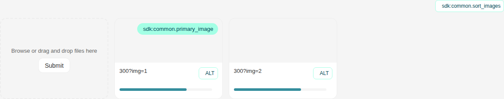
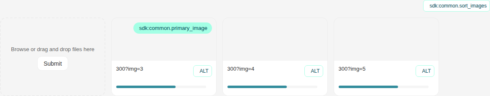
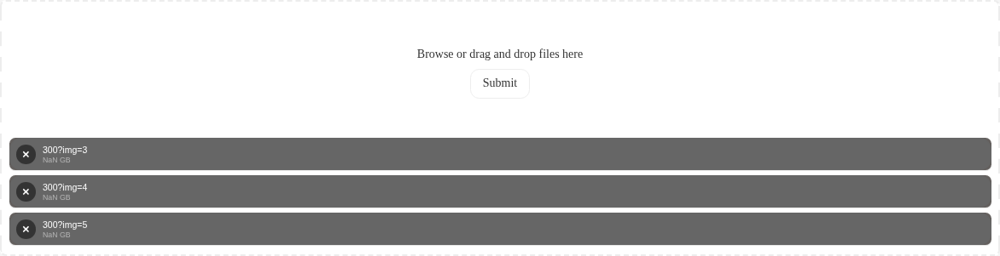
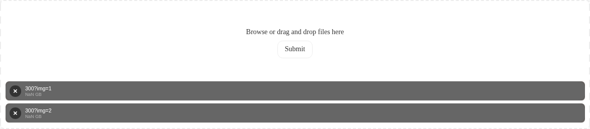
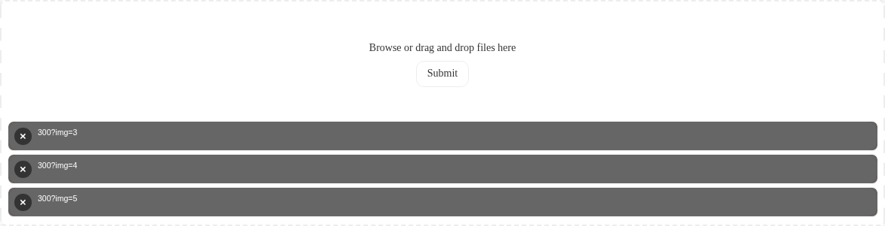
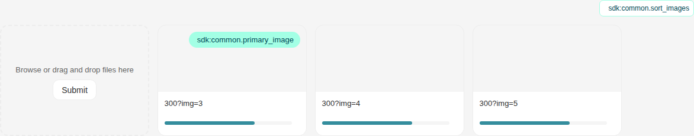
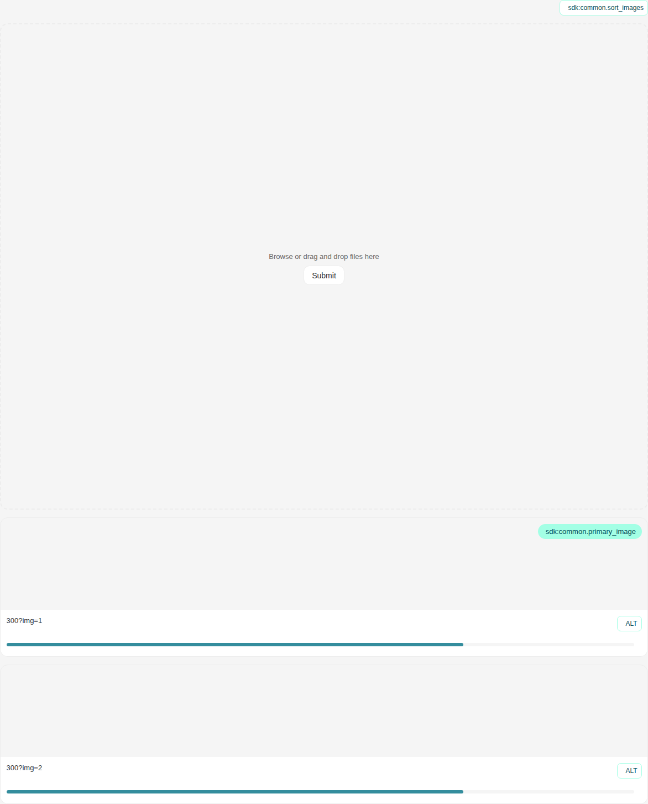
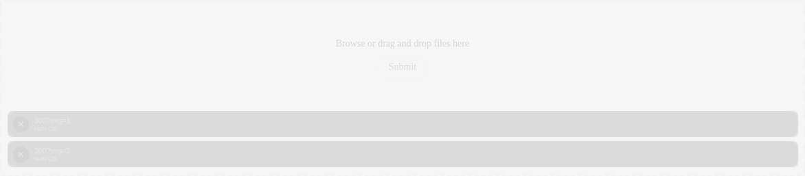
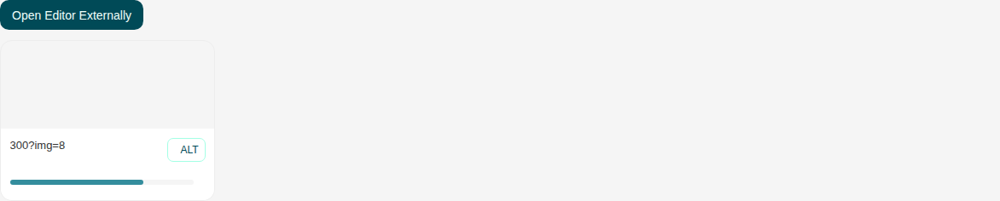

# Uploader

Storybook title `Components/Uploader` · source `./src/components/s-uploader/s-uploader.stories.tsx`

Tags rendered: `<s-button>`, `<s-uploader>`

Uploader component allows users to upload files with various layouts and configurations. It supports drag & drop, multiple files, file type restrictions, and preview functionality.

## Props

| Prop | Type / control | Options | Default | Description |
|---|---|---|---|---|
| `name` | string |  | `"file"` | Name attribute for the input |
| `layout` | string | `inline`, `drag-drop`, `thumbnail` | `"drag-drop"` | Uploader layout type |
| `method` | object |  | `null` | Upload method for inline layout |
| `label` | string |  | `Browse or drag and drop files here` | Label text for the uploader |
| `placeholder` | string |  | `Choose a file...` | Placeholder text for inline layout |
| `buttonLabel` | string |  | `Submit` | Button text for file selection |
| `desc` | string |  | `""` | Description text for the uploader |
| `filesAllowed` | string | `all`, `images`, `videos`, `fonts`, `file` | `"all"` | Allowed file types |
| `multiple` | boolean |  | `false` | Allow multiple file upload |
| `max` | number |  | `-1` | Maximum number of files (-1 for unlimited) |
| `fileSize` | string |  | `"2MB"` | Maximum file size |
| `src` | object |  | `undefined` | Upload URL (deprecated, use server.url instead) |
| `headers` | object |  | `undefined` | Custom headers for upload (deprecated, use server.headers instead) |
| `payloadParameters` | object |  | `null` | Additional payload parameters (deprecated, use server.upload.additionalRequestData instead) |
| `autoUpload` | boolean |  | `false` | Enable auto upload to server (deprecated, use server.instantUpload instead) |
| `server` | object |  | `undefined` | Server configuration object for upload, edit, and remove operations |
| `selectable` | boolean |  | `true` | Allow users to select files as primary |
| `editable` | boolean |  | `true` | Allow users to edit files |
| `sortable` | boolean |  | `true` | Enable file sorting |
| `has3D` | boolean |  | `false` | Enable 3D image support |
| `noBorder` | boolean |  | `false` | Remove border styling |
| `hasPreview` | boolean |  | `false` | Show only preview without uploader area |
| `hideSize` | boolean |  | `false` | Hide file size display |
| `hideBrowseButton` | boolean |  | `false` | Hide the built-in browse button and keep only the actions slotted by the consumer (thumbnail layout only) |
| `allowAlt` | boolean |  | `true` | Show the ALT text button/editor under each file preview |
| `verticalThumbnail` | boolean |  | `false` | Use vertical thumbnail layout |
| `instantEdit` | boolean |  | `false` | Automatically open the image editor after upload completes (thumbnail layout only) |
| `cropShapes` | object |  | `undefined` | Crop shapes for image cropping (e.g., '1:1' or ['1:1', '9:16', '1.91:1']). Restricts cropping to only these shapes. |
| `items` | string |  | `"[]"` | Initial files to display |
| `loading` | boolean |  | `false` | Loading state |
| `disabled` | boolean |  | `false` | Disabled state |
| `hasError` | boolean |  | `false` | Error state |
| `maxVideos` | number |  | `undefined` | Opt-in cap on video files only (images stay governed by `max`). Unset = no video cap. |
| `fileUpload` |  |  |  | Event emitted when an item is uploaded (deprecated, use upload instead). |
| `upload` |  |  |  | Event emitted when an item is uploaded. Provides files, file, and error information. |
| `remove` |  |  |  | Event emitted when a file is deleted. Provides the deleted file information. |
| `edit` |  |  |  | Event emitted when a file is edited. Provides the edited file information. |
| `sort` |  |  |  | Event emitted when a file is reordered. Provides file, newIndex, and oldIndex. |
| `altTextChange` |  |  |  | Event emitted when a file's alt text is changed. Provides the file information. |

## Stories

### Default

Story id `components-uploader--default`


Args:

```json
{
  "name": "file",
  "layout": "drag-drop",
  "label": "Browse or drag and drop files here",
  "placeholder": "Choose a file...",
  "buttonLabel": "Submit",
  "desc": "",
  "filesAllowed": "all",
  "multiple": false,
  "max": -1,
  "fileSize": "2MB",
  "payloadParameters": null,
  "autoUpload": false,
  "selectable": true,
  "editable": true,
  "sortable": true,
  "has3D": false,
  "noBorder": false,
  "hasPreview": false,
  "hideSize": false,
  "hideBrowseButton": false,
  "allowAlt": true,
  "verticalThumbnail": false,
  "instantEdit": false,
  "items": "[]",
  "loading": false,
  "disabled": false,
  "hasError": false
}
```

<details><summary>Rendered markup</summary>

```html
<style>
    [id*="story--components-uploader--"] {
      height: 30vh !important;
    }
    </style>
  
  <s-uploader name="file" layout="drag-drop" label="Browse or drag and drop files here" placeholder="Choose a file..." button-label="Submit" files-allowed="all" max="-1" file-size="2MB" selectable="" editable="" sortable="" items="[]" class="s-uploader--selectable s-uploader--sortable drag-drop ltr hydrated">
    <p slot="feedback">The suitable image size is 350X263 pixels</p>
  </s-uploader>
```

</details>

### Inline

Story id `components-uploader--inline`


Args:

```json
{
  "name": "file",
  "layout": "inline",
  "label": "Browse or drag and drop files here",
  "placeholder": "Choose a file...",
  "buttonLabel": "Submit",
  "desc": "",
  "filesAllowed": "all",
  "multiple": false,
  "max": -1,
  "fileSize": "2MB",
  "payloadParameters": null,
  "autoUpload": false,
  "selectable": true,
  "editable": true,
  "sortable": true,
  "has3D": false,
  "noBorder": false,
  "hasPreview": false,
  "hideSize": false,
  "hideBrowseButton": false,
  "allowAlt": true,
  "verticalThumbnail": false,
  "instantEdit": false,
  "items": "[]",
  "loading": false,
  "disabled": false,
  "hasError": false
}
```

<details><summary>Rendered markup</summary>

```html
<style>
    [id*="story--components-uploader--"] {
      height: 30vh !important;
    }
    </style>
  
  <s-uploader name="file" layout="inline" label="Browse or drag and drop files here" placeholder="Choose a file..." button-label="Submit" files-allowed="all" max="-1" file-size="2MB" selectable="" editable="" sortable="" items="[]" class="s-uploader--selectable s-uploader--sortable inline ltr hydrated">
    <p slot="feedback">The suitable image size is 350X263 pixels</p>
  </s-uploader>
```

</details>

### Thumbnail

Story id `components-uploader--thumbnail`



Args:

```json
{
  "name": "file",
  "layout": "thumbnail",
  "label": "Browse or drag and drop files here",
  "placeholder": "Choose a file...",
  "buttonLabel": "Submit",
  "desc": "",
  "filesAllowed": "all",
  "multiple": true,
  "max": -1,
  "fileSize": "2MB",
  "payloadParameters": null,
  "autoUpload": false,
  "selectable": true,
  "editable": true,
  "sortable": true,
  "has3D": false,
  "noBorder": false,
  "hasPreview": false,
  "hideSize": false,
  "hideBrowseButton": false,
  "allowAlt": true,
  "verticalThumbnail": false,
  "instantEdit": false,
  "items": "[{\"source\":\"https://i.pravatar.cc/300?img=1\",\"alt\":\"Sample Image\"}, {\"source\":\"https://i.pravatar.cc/300?img=2\",\"alt\":\"Sample Image\"}]",
  "loading": false,
  "disabled": false,
  "hasError": false
}
```

<details><summary>Rendered markup</summary>

```html
<style>
    [id*="story--components-uploader--"] {
      height: 30vh !important;
    }
    </style>
  
  <s-uploader name="file" layout="thumbnail" label="Browse or drag and drop files here" placeholder="Choose a file..." button-label="Submit" files-allowed="all" multiple="" max="-1" file-size="2MB" selectable="" editable="" sortable="" items="[{&quot;source&quot;:&quot;https://i.pravatar.cc/300?img=1&quot;,&quot;alt&quot;:&quot;Sample Image&quot;}, {&quot;source&quot;:&quot;https://i.pravatar.cc/300?img=2&quot;,&quot;alt&quot;:&quot;Sample Image&quot;}]" class="s-uploader--selectable s-uploader--sortable thumbnail ltr hydrated">
    <p slot="feedback">The suitable image size is 350X263 pixels</p>
  </s-uploader>
```

</details>

### Thumbnail Multiple

Story id `components-uploader--thumbnail-multiple`



Args:

```json
{
  "name": "file",
  "layout": "thumbnail",
  "label": "Browse or drag and drop files here",
  "placeholder": "Choose a file...",
  "buttonLabel": "Submit",
  "desc": "",
  "filesAllowed": "all",
  "multiple": true,
  "max": 5,
  "fileSize": "2MB",
  "payloadParameters": null,
  "autoUpload": false,
  "selectable": true,
  "editable": true,
  "sortable": true,
  "has3D": false,
  "noBorder": false,
  "hasPreview": false,
  "hideSize": false,
  "hideBrowseButton": false,
  "allowAlt": true,
  "verticalThumbnail": false,
  "instantEdit": false,
  "items": "[{\"source\":\"https://i.pravatar.cc/300?img=3\",\"alt\":\"Image 1\"}, {\"source\":\"https://i.pravatar.cc/300?img=4\",\"alt\":\"Image 2\"}, {\"source\":\"https://i.pravatar.cc/300?img=5\",\"alt\":\"Image 3\"}]",
  "loading": false,
  "disabled": false,
  "hasError": false
}
```

<details><summary>Rendered markup</summary>

```html
<style>
    [id*="story--components-uploader--"] {
      height: 30vh !important;
    }
    </style>
  
  <s-uploader name="file" layout="thumbnail" label="Browse or drag and drop files here" placeholder="Choose a file..." button-label="Submit" files-allowed="all" multiple="" max="5" file-size="2MB" selectable="" editable="" sortable="" items="[{&quot;source&quot;:&quot;https://i.pravatar.cc/300?img=3&quot;,&quot;alt&quot;:&quot;Image 1&quot;}, {&quot;source&quot;:&quot;https://i.pravatar.cc/300?img=4&quot;,&quot;alt&quot;:&quot;Image 2&quot;}, {&quot;source&quot;:&quot;https://i.pravatar.cc/300?img=5&quot;,&quot;alt&quot;:&quot;Image 3&quot;}]" class="s-uploader--selectable s-uploader--sortable thumbnail ltr hydrated">
    <p slot="feedback">The suitable image size is 350X263 pixels</p>
  </s-uploader>
```

</details>

### Multiple

Story id `components-uploader--multiple`



Args:

```json
{
  "name": "file",
  "layout": "drag-drop",
  "label": "Browse or drag and drop files here",
  "placeholder": "Choose a file...",
  "buttonLabel": "Submit",
  "desc": "",
  "filesAllowed": "all",
  "multiple": true,
  "max": 5,
  "fileSize": "2MB",
  "payloadParameters": null,
  "autoUpload": false,
  "selectable": true,
  "editable": true,
  "sortable": true,
  "has3D": false,
  "noBorder": false,
  "hasPreview": false,
  "hideSize": false,
  "hideBrowseButton": false,
  "allowAlt": true,
  "verticalThumbnail": false,
  "instantEdit": false,
  "items": "[{\"source\":\"https://i.pravatar.cc/300?img=3\",\"alt\":\"Image 1\"}, {\"source\":\"https://i.pravatar.cc/300?img=4\",\"alt\":\"Image 2\"}, {\"source\":\"https://i.pravatar.cc/300?img=5\",\"alt\":\"Image 3\"}]",
  "loading": false,
  "disabled": false,
  "hasError": false
}
```

<details><summary>Rendered markup</summary>

```html
<style>
    [id*="story--components-uploader--"] {
      height: 30vh !important;
    }
    </style>
  
  <s-uploader name="file" layout="drag-drop" label="Browse or drag and drop files here" placeholder="Choose a file..." button-label="Submit" files-allowed="all" multiple="" max="5" file-size="2MB" selectable="" editable="" sortable="" items="[{&quot;source&quot;:&quot;https://i.pravatar.cc/300?img=3&quot;,&quot;alt&quot;:&quot;Image 1&quot;}, {&quot;source&quot;:&quot;https://i.pravatar.cc/300?img=4&quot;,&quot;alt&quot;:&quot;Image 2&quot;}, {&quot;source&quot;:&quot;https://i.pravatar.cc/300?img=5&quot;,&quot;alt&quot;:&quot;Image 3&quot;}]" class="s-uploader--selectable s-uploader--sortable drag-drop ltr hydrated">
    <p slot="feedback">The suitable image size is 350X263 pixels</p>
  </s-uploader>
```

</details>

### Images Only

Story id `components-uploader--images-only`



Args:

```json
{
  "name": "file",
  "layout": "drag-drop",
  "label": "Browse or drag and drop files here",
  "placeholder": "Choose a file...",
  "buttonLabel": "Submit",
  "desc": "",
  "filesAllowed": "images",
  "multiple": true,
  "max": 3,
  "fileSize": "2MB",
  "payloadParameters": null,
  "autoUpload": false,
  "selectable": true,
  "editable": true,
  "sortable": true,
  "has3D": false,
  "noBorder": false,
  "hasPreview": false,
  "hideSize": false,
  "hideBrowseButton": false,
  "allowAlt": true,
  "verticalThumbnail": false,
  "instantEdit": false,
  "items": "[{\"source\":\"https://i.pravatar.cc/300?img=1\",\"alt\":\"Sample Image\"}, {\"source\":\"https://i.pravatar.cc/300?img=2\",\"alt\":\"Sample Image\"}]",
  "loading": false,
  "disabled": false,
  "hasError": false
}
```

<details><summary>Rendered markup</summary>

```html
<style>
    [id*="story--components-uploader--"] {
      height: 30vh !important;
    }
    </style>
  
  <s-uploader name="file" layout="drag-drop" label="Browse or drag and drop files here" placeholder="Choose a file..." button-label="Submit" files-allowed="images" multiple="" max="3" file-size="2MB" selectable="" editable="" sortable="" items="[{&quot;source&quot;:&quot;https://i.pravatar.cc/300?img=1&quot;,&quot;alt&quot;:&quot;Sample Image&quot;}, {&quot;source&quot;:&quot;https://i.pravatar.cc/300?img=2&quot;,&quot;alt&quot;:&quot;Sample Image&quot;}]" class="s-uploader--selectable s-uploader--sortable drag-drop ltr hydrated">
    <p slot="feedback">The suitable image size is 350X263 pixels</p>
  </s-uploader>
```

</details>

### Videos Only

Story id `components-uploader--videos-only`


Args:

```json
{
  "name": "file",
  "layout": "drag-drop",
  "label": "Browse or drag and drop files here",
  "placeholder": "Choose a file...",
  "buttonLabel": "Submit",
  "desc": "",
  "filesAllowed": "videos",
  "multiple": true,
  "max": 2,
  "fileSize": "2MB",
  "payloadParameters": null,
  "autoUpload": false,
  "selectable": true,
  "editable": true,
  "sortable": true,
  "has3D": false,
  "noBorder": false,
  "hasPreview": false,
  "hideSize": false,
  "hideBrowseButton": false,
  "allowAlt": true,
  "verticalThumbnail": false,
  "instantEdit": false,
  "items": "[{\"source\":\"https://i.pravatar.cc/300?img=6\",\"alt\":\"Video Thumbnail\"}, {\"source\":\"https://i.pravatar.cc/300?img=7\",\"alt\":\"Video Thumbnail\"}]",
  "loading": false,
  "disabled": false,
  "hasError": false
}
```

<details><summary>Rendered markup</summary>

```html
<style>
    [id*="story--components-uploader--"] {
      height: 30vh !important;
    }
    </style>
  
  <s-uploader name="file" layout="drag-drop" label="Browse or drag and drop files here" placeholder="Choose a file..." button-label="Submit" files-allowed="videos" multiple="" max="2" file-size="2MB" selectable="" editable="" sortable="" items="[{&quot;source&quot;:&quot;https://i.pravatar.cc/300?img=6&quot;,&quot;alt&quot;:&quot;Video Thumbnail&quot;}, {&quot;source&quot;:&quot;https://i.pravatar.cc/300?img=7&quot;,&quot;alt&quot;:&quot;Video Thumbnail&quot;}]" class="s-uploader--selectable s-uploader--sortable drag-drop ltr hydrated">
    <p slot="feedback">The suitable image size is 350X263 pixels</p>
  </s-uploader>
```

</details>

### Thumbnail Video Player

Story id `components-uploader--thumbnail-video-player`


Args:

```json
{
  "name": "file",
  "layout": "thumbnail",
  "label": "Browse or drag and drop files here",
  "placeholder": "Choose a file...",
  "buttonLabel": "Submit",
  "desc": "",
  "filesAllowed": "all",
  "multiple": true,
  "max": 10,
  "fileSize": "250MB",
  "payloadParameters": null,
  "autoUpload": false,
  "selectable": true,
  "editable": true,
  "sortable": true,
  "has3D": false,
  "noBorder": false,
  "hasPreview": false,
  "hideSize": false,
  "hideBrowseButton": false,
  "allowAlt": true,
  "verticalThumbnail": false,
  "instantEdit": false,
  "items": "[{\"source\":\"https://i.pravatar.cc/300?img=1\",\"alt\":\"Image 1\",\"main\":true},{\"source\":\"https://i.pravatar.cc/300?img=6\",\"video_url\":\"https://www.w3schools.com/html/mov_bbb.mp4\",\"type\":\"video\",\"alt\":\"Product video\"},{\"source\":\"https://i.pravatar.cc/300?img=2\",\"alt\":\"Image 2\"}]",
  "loading": false,
  "disabled": false,
  "hasError": false,
  "maxVideos": 3
}
```

<details><summary>Rendered markup</summary>

```html
<style>
    [id*="story--components-uploader--"] {
      height: 30vh !important;
    }
    </style>
  
  <s-uploader name="file" layout="thumbnail" label="Browse or drag and drop files here" placeholder="Choose a file..." button-label="Submit" files-allowed="all" multiple="" max="10" max-videos="3" file-size="250MB" selectable="" editable="" sortable="" items="[{&quot;source&quot;:&quot;https://i.pravatar.cc/300?img=1&quot;,&quot;alt&quot;:&quot;Image 1&quot;,&quot;main&quot;:true},{&quot;source&quot;:&quot;https://i.pravatar.cc/300?img=6&quot;,&quot;video_url&quot;:&quot;https://www.w3schools.com/html/mov_bbb.mp4&quot;,&quot;type&quot;:&quot;video&quot;,&quot;alt&quot;:&quot;Product video&quot;},{&quot;source&quot;:&quot;https://i.pravatar.cc/300?img=2&quot;,&quot;alt&quot;:&quot;Image 2&quot;}]" class="s-uploader--selectable s-uploader--sortable thumbnail ltr hydrated">
    <p slot="feedback">The suitable image size is 350X263 pixels</p>
  </s-uploader>
```

</details>

### With Predefined Items

Story id `components-uploader--with-predefined-items`


Args:

```json
{
  "name": "file",
  "layout": "drag-drop",
  "label": "Browse or drag and drop files here",
  "placeholder": "Choose a file...",
  "buttonLabel": "Submit",
  "desc": "",
  "filesAllowed": "all",
  "multiple": true,
  "max": -1,
  "fileSize": "2MB",
  "payloadParameters": null,
  "autoUpload": false,
  "selectable": true,
  "editable": true,
  "sortable": true,
  "has3D": false,
  "noBorder": false,
  "hasPreview": false,
  "hideSize": false,
  "hideBrowseButton": false,
  "allowAlt": true,
  "verticalThumbnail": false,
  "instantEdit": false,
  "items": "[{\"source\":\"https://i.pravatar.cc/300?img=3\",\"alt\":\"Image 1\"}, {\"source\":\"https://i.pravatar.cc/300?img=4\",\"alt\":\"Image 2\"}, {\"source\":\"https://i.pravatar.cc/300?img=5\",\"alt\":\"Image 3\"}]",
  "loading": false,
  "disabled": false,
  "hasError": false
}
```

<details><summary>Rendered markup</summary>

```html
<style>
    [id*="story--components-uploader--"] {
      height: 30vh !important;
    }
    </style>
  
  <s-uploader name="file" layout="drag-drop" label="Browse or drag and drop files here" placeholder="Choose a file..." button-label="Submit" files-allowed="all" multiple="" max="-1" file-size="2MB" selectable="" editable="" sortable="" items="[{&quot;source&quot;:&quot;https://i.pravatar.cc/300?img=3&quot;,&quot;alt&quot;:&quot;Image 1&quot;}, {&quot;source&quot;:&quot;https://i.pravatar.cc/300?img=4&quot;,&quot;alt&quot;:&quot;Image 2&quot;}, {&quot;source&quot;:&quot;https://i.pravatar.cc/300?img=5&quot;,&quot;alt&quot;:&quot;Image 3&quot;}]" class="s-uploader--selectable s-uploader--sortable drag-drop ltr hydrated">
    <p slot="feedback">The suitable image size is 350X263 pixels</p>
  </s-uploader>
```

</details>

### Preview Mode

Story id `components-uploader--preview-mode`


Args:

```json
{
  "name": "file",
  "layout": "drag-drop",
  "label": "Browse or drag and drop files here",
  "placeholder": "Choose a file...",
  "buttonLabel": "Submit",
  "desc": "",
  "filesAllowed": "all",
  "multiple": true,
  "max": 4,
  "fileSize": "2MB",
  "payloadParameters": null,
  "autoUpload": false,
  "selectable": true,
  "editable": true,
  "sortable": true,
  "has3D": false,
  "noBorder": false,
  "hasPreview": true,
  "hideSize": false,
  "hideBrowseButton": false,
  "allowAlt": true,
  "verticalThumbnail": false,
  "instantEdit": false,
  "items": "[{\"source\":\"https://i.pravatar.cc/300?img=1\",\"alt\":\"Sample Image\"}, {\"source\":\"https://i.pravatar.cc/300?img=2\",\"alt\":\"Sample Image\"}]",
  "loading": false,
  "disabled": false,
  "hasError": false
}
```

<details><summary>Rendered markup</summary>

```html
<style>
    [id*="story--components-uploader--"] {
      height: 30vh !important;
    }
    </style>
  
  <s-uploader name="file" layout="drag-drop" label="Browse or drag and drop files here" placeholder="Choose a file..." button-label="Submit" files-allowed="all" multiple="" max="4" file-size="2MB" selectable="" editable="" sortable="" has-preview="" items="[{&quot;source&quot;:&quot;https://i.pravatar.cc/300?img=1&quot;,&quot;alt&quot;:&quot;Sample Image&quot;}, {&quot;source&quot;:&quot;https://i.pravatar.cc/300?img=2&quot;,&quot;alt&quot;:&quot;Sample Image&quot;}]" class="s-uploader--selectable s-uploader--sortable drag-drop ltr hydrated s-uploader--preview">
    <p slot="feedback">The suitable image size is 350X263 pixels</p>
  </s-uploader>
```

</details>

### Non Selectable

Story id `components-uploader--non-selectable`


Args:

```json
{
  "name": "file",
  "layout": "drag-drop",
  "label": "Browse or drag and drop files here",
  "placeholder": "Choose a file...",
  "buttonLabel": "Submit",
  "desc": "",
  "filesAllowed": "all",
  "multiple": true,
  "max": -1,
  "fileSize": "2MB",
  "payloadParameters": null,
  "autoUpload": false,
  "selectable": false,
  "editable": true,
  "sortable": true,
  "has3D": false,
  "noBorder": false,
  "hasPreview": false,
  "hideSize": false,
  "hideBrowseButton": false,
  "allowAlt": true,
  "verticalThumbnail": false,
  "instantEdit": false,
  "items": "[{\"source\":\"https://i.pravatar.cc/300?img=1\",\"alt\":\"Sample Image\"}, {\"source\":\"https://i.pravatar.cc/300?img=2\",\"alt\":\"Sample Image\"}]",
  "loading": false,
  "disabled": false,
  "hasError": false
}
```

<details><summary>Rendered markup</summary>

```html
<style>
    [id*="story--components-uploader--"] {
      height: 30vh !important;
    }
    </style>
  
  <s-uploader name="file" layout="drag-drop" label="Browse or drag and drop files here" placeholder="Choose a file..." button-label="Submit" files-allowed="all" multiple="" max="-1" file-size="2MB" editable="" sortable="" items="[{&quot;source&quot;:&quot;https://i.pravatar.cc/300?img=1&quot;,&quot;alt&quot;:&quot;Sample Image&quot;}, {&quot;source&quot;:&quot;https://i.pravatar.cc/300?img=2&quot;,&quot;alt&quot;:&quot;Sample Image&quot;}]" class="s-uploader--selectable s-uploader--sortable drag-drop ltr hydrated">
    <p slot="feedback">The suitable image size is 350X263 pixels</p>
  </s-uploader>
```

</details>

### Non Editable

Story id `components-uploader--non-editable`


Args:

```json
{
  "name": "file",
  "layout": "drag-drop",
  "label": "Browse or drag and drop files here",
  "placeholder": "Choose a file...",
  "buttonLabel": "Submit",
  "desc": "",
  "filesAllowed": "all",
  "multiple": true,
  "max": -1,
  "fileSize": "2MB",
  "payloadParameters": null,
  "autoUpload": false,
  "selectable": true,
  "editable": false,
  "sortable": true,
  "has3D": false,
  "noBorder": false,
  "hasPreview": false,
  "hideSize": false,
  "hideBrowseButton": false,
  "allowAlt": true,
  "verticalThumbnail": false,
  "instantEdit": false,
  "items": "[{\"source\":\"https://i.pravatar.cc/300?img=1\",\"alt\":\"Sample Image\"}, {\"source\":\"https://i.pravatar.cc/300?img=2\",\"alt\":\"Sample Image\"}]",
  "loading": false,
  "disabled": false,
  "hasError": false
}
```

<details><summary>Rendered markup</summary>

```html
<style>
    [id*="story--components-uploader--"] {
      height: 30vh !important;
    }
    </style>
  
  <s-uploader name="file" layout="drag-drop" label="Browse or drag and drop files here" placeholder="Choose a file..." button-label="Submit" files-allowed="all" multiple="" max="-1" file-size="2MB" selectable="" sortable="" items="[{&quot;source&quot;:&quot;https://i.pravatar.cc/300?img=1&quot;,&quot;alt&quot;:&quot;Sample Image&quot;}, {&quot;source&quot;:&quot;https://i.pravatar.cc/300?img=2&quot;,&quot;alt&quot;:&quot;Sample Image&quot;}]" class="s-uploader--selectable s-uploader--sortable drag-drop ltr hydrated">
    <p slot="feedback">The suitable image size is 350X263 pixels</p>
  </s-uploader>
```

</details>

### Non Sortable

Story id `components-uploader--non-sortable`


Args:

```json
{
  "name": "file",
  "layout": "drag-drop",
  "label": "Browse or drag and drop files here",
  "placeholder": "Choose a file...",
  "buttonLabel": "Submit",
  "desc": "",
  "filesAllowed": "all",
  "multiple": true,
  "max": -1,
  "fileSize": "2MB",
  "payloadParameters": null,
  "autoUpload": false,
  "selectable": true,
  "editable": true,
  "sortable": false,
  "has3D": false,
  "noBorder": false,
  "hasPreview": false,
  "hideSize": false,
  "hideBrowseButton": false,
  "allowAlt": true,
  "verticalThumbnail": false,
  "instantEdit": false,
  "items": "[{\"source\":\"https://i.pravatar.cc/300?img=3\",\"alt\":\"Image 1\"}, {\"source\":\"https://i.pravatar.cc/300?img=4\",\"alt\":\"Image 2\"}, {\"source\":\"https://i.pravatar.cc/300?img=5\",\"alt\":\"Image 3\"}]",
  "loading": false,
  "disabled": false,
  "hasError": false
}
```

<details><summary>Rendered markup</summary>

```html
<style>
    [id*="story--components-uploader--"] {
      height: 30vh !important;
    }
    </style>
  
  <s-uploader name="file" layout="drag-drop" label="Browse or drag and drop files here" placeholder="Choose a file..." button-label="Submit" files-allowed="all" multiple="" max="-1" file-size="2MB" selectable="" editable="" items="[{&quot;source&quot;:&quot;https://i.pravatar.cc/300?img=3&quot;,&quot;alt&quot;:&quot;Image 1&quot;}, {&quot;source&quot;:&quot;https://i.pravatar.cc/300?img=4&quot;,&quot;alt&quot;:&quot;Image 2&quot;}, {&quot;source&quot;:&quot;https://i.pravatar.cc/300?img=5&quot;,&quot;alt&quot;:&quot;Image 3&quot;}]" class="s-uploader--selectable s-uploader--sortable drag-drop ltr hydrated">
    <p slot="feedback">The suitable image size is 350X263 pixels</p>
  </s-uploader>
```

</details>

### Hide File Size

Story id `components-uploader--hide-file-size`



Args:

```json
{
  "name": "file",
  "layout": "drag-drop",
  "label": "Browse or drag and drop files here",
  "placeholder": "Choose a file...",
  "buttonLabel": "Submit",
  "desc": "",
  "filesAllowed": "all",
  "multiple": true,
  "max": -1,
  "fileSize": "2MB",
  "payloadParameters": null,
  "autoUpload": false,
  "selectable": true,
  "editable": true,
  "sortable": true,
  "has3D": false,
  "noBorder": false,
  "hasPreview": false,
  "hideSize": true,
  "hideBrowseButton": false,
  "allowAlt": true,
  "verticalThumbnail": false,
  "instantEdit": false,
  "items": "[{\"source\":\"https://i.pravatar.cc/300?img=3\",\"alt\":\"Image 1\"}, {\"source\":\"https://i.pravatar.cc/300?img=4\",\"alt\":\"Image 2\"}, {\"source\":\"https://i.pravatar.cc/300?img=5\",\"alt\":\"Image 3\"}]",
  "loading": false,
  "disabled": false,
  "hasError": false
}
```

<details><summary>Rendered markup</summary>

```html
<style>
    [id*="story--components-uploader--"] {
      height: 30vh !important;
    }
    </style>
  
  <s-uploader name="file" layout="drag-drop" label="Browse or drag and drop files here" placeholder="Choose a file..." button-label="Submit" files-allowed="all" multiple="" max="-1" file-size="2MB" selectable="" editable="" sortable="" hide-size="" items="[{&quot;source&quot;:&quot;https://i.pravatar.cc/300?img=3&quot;,&quot;alt&quot;:&quot;Image 1&quot;}, {&quot;source&quot;:&quot;https://i.pravatar.cc/300?img=4&quot;,&quot;alt&quot;:&quot;Image 2&quot;}, {&quot;source&quot;:&quot;https://i.pravatar.cc/300?img=5&quot;,&quot;alt&quot;:&quot;Image 3&quot;}]" class="s-uploader--selectable s-uploader--sortable drag-drop ltr hide-size hydrated">
    <p slot="feedback">The suitable image size is 350X263 pixels</p>
  </s-uploader>
```

</details>

### Alt Disabled

Story id `components-uploader--alt-disabled`



Args:

```json
{
  "name": "file",
  "layout": "thumbnail",
  "label": "Browse or drag and drop files here",
  "placeholder": "Choose a file...",
  "buttonLabel": "Submit",
  "desc": "",
  "filesAllowed": "all",
  "multiple": true,
  "max": -1,
  "fileSize": "2MB",
  "payloadParameters": null,
  "autoUpload": false,
  "selectable": true,
  "editable": true,
  "sortable": true,
  "has3D": false,
  "noBorder": false,
  "hasPreview": false,
  "hideSize": false,
  "hideBrowseButton": false,
  "allowAlt": false,
  "verticalThumbnail": false,
  "instantEdit": false,
  "items": "[{\"source\":\"https://i.pravatar.cc/300?img=3\",\"alt\":\"Image 1\"}, {\"source\":\"https://i.pravatar.cc/300?img=4\",\"alt\":\"Image 2\"}, {\"source\":\"https://i.pravatar.cc/300?img=5\",\"alt\":\"Image 3\"}]",
  "loading": false,
  "disabled": false,
  "hasError": false
}
```

<details><summary>Rendered markup</summary>

```html
<style>
    [id*="story--components-uploader--"] {
      height: 30vh !important;
    }
    </style>
  
  <s-uploader name="file" layout="thumbnail" label="Browse or drag and drop files here" placeholder="Choose a file..." button-label="Submit" files-allowed="all" multiple="" max="-1" file-size="2MB" selectable="" editable="" sortable="" allow-alt="false" items="[{&quot;source&quot;:&quot;https://i.pravatar.cc/300?img=3&quot;,&quot;alt&quot;:&quot;Image 1&quot;}, {&quot;source&quot;:&quot;https://i.pravatar.cc/300?img=4&quot;,&quot;alt&quot;:&quot;Image 2&quot;}, {&quot;source&quot;:&quot;https://i.pravatar.cc/300?img=5&quot;,&quot;alt&quot;:&quot;Image 3&quot;}]" class="s-uploader--selectable s-uploader--sortable thumbnail ltr hydrated">
    <p slot="feedback">The suitable image size is 350X263 pixels</p>
  </s-uploader>
```

</details>

### No Border

Story id `components-uploader--no-border`


Args:

```json
{
  "name": "file",
  "layout": "inline",
  "label": "Browse or drag and drop files here",
  "placeholder": "Choose a file...",
  "buttonLabel": "Submit",
  "desc": "",
  "filesAllowed": "all",
  "multiple": false,
  "max": -1,
  "fileSize": "2MB",
  "payloadParameters": null,
  "autoUpload": false,
  "selectable": true,
  "editable": true,
  "sortable": true,
  "has3D": false,
  "noBorder": true,
  "hasPreview": false,
  "hideSize": false,
  "hideBrowseButton": false,
  "allowAlt": true,
  "verticalThumbnail": false,
  "instantEdit": false,
  "items": "[]",
  "loading": false,
  "disabled": false,
  "hasError": false
}
```

<details><summary>Rendered markup</summary>

```html
<style>
    [id*="story--components-uploader--"] {
      height: 30vh !important;
    }
    </style>
  
  <s-uploader name="file" layout="inline" label="Browse or drag and drop files here" placeholder="Choose a file..." button-label="Submit" files-allowed="all" max="-1" file-size="2MB" selectable="" editable="" sortable="" no-border="" items="[]" class="s-uploader--selectable s-uploader--sortable no-border inline ltr hydrated">
    <p slot="feedback">The suitable image size is 350X263 pixels</p>
  </s-uploader>
```

</details>

### Vertical Thumbnail

Story id `components-uploader--vertical-thumbnail`



Args:

```json
{
  "name": "file",
  "layout": "thumbnail",
  "label": "Browse or drag and drop files here",
  "placeholder": "Choose a file...",
  "buttonLabel": "Submit",
  "desc": "",
  "filesAllowed": "all",
  "multiple": true,
  "max": -1,
  "fileSize": "2MB",
  "payloadParameters": null,
  "autoUpload": false,
  "selectable": true,
  "editable": true,
  "sortable": true,
  "has3D": false,
  "noBorder": false,
  "hasPreview": false,
  "hideSize": false,
  "hideBrowseButton": false,
  "allowAlt": true,
  "verticalThumbnail": true,
  "instantEdit": false,
  "items": "[{\"source\":\"https://i.pravatar.cc/300?img=1\",\"alt\":\"Sample Image\"}, {\"source\":\"https://i.pravatar.cc/300?img=2\",\"alt\":\"Sample Image\"}]",
  "loading": false,
  "disabled": false,
  "hasError": false
}
```

<details><summary>Rendered markup</summary>

```html
<style>
    [id*="story--components-uploader--"] {
      height: 30vh !important;
    }
    </style>
  
  <s-uploader name="file" layout="thumbnail" label="Browse or drag and drop files here" placeholder="Choose a file..." button-label="Submit" files-allowed="all" multiple="" max="-1" file-size="2MB" selectable="" editable="" sortable="" vertical-thumbnail="" items="[{&quot;source&quot;:&quot;https://i.pravatar.cc/300?img=1&quot;,&quot;alt&quot;:&quot;Sample Image&quot;}, {&quot;source&quot;:&quot;https://i.pravatar.cc/300?img=2&quot;,&quot;alt&quot;:&quot;Sample Image&quot;}]" class="s-uploader--selectable s-uploader--sortable thumbnail ltr hydrated">
    <p slot="feedback">The suitable image size is 350X263 pixels</p>
  </s-uploader>
```

</details>

### Disabled

Story id `components-uploader--disabled`



Args:

```json
{
  "name": "file",
  "layout": "drag-drop",
  "label": "Browse or drag and drop files here",
  "placeholder": "Choose a file...",
  "buttonLabel": "Submit",
  "desc": "",
  "filesAllowed": "all",
  "multiple": true,
  "max": -1,
  "fileSize": "2MB",
  "payloadParameters": null,
  "autoUpload": false,
  "selectable": true,
  "editable": true,
  "sortable": true,
  "has3D": false,
  "noBorder": false,
  "hasPreview": false,
  "hideSize": false,
  "hideBrowseButton": false,
  "allowAlt": true,
  "verticalThumbnail": false,
  "instantEdit": false,
  "items": "[{\"source\":\"https://i.pravatar.cc/300?img=1\",\"alt\":\"Sample Image\"}, {\"source\":\"https://i.pravatar.cc/300?img=2\",\"alt\":\"Sample Image\"}]",
  "loading": false,
  "disabled": true,
  "hasError": false
}
```

<details><summary>Rendered markup</summary>

```html
<style>
    [id*="story--components-uploader--"] {
      height: 30vh !important;
    }
    </style>
  
  <s-uploader name="file" layout="drag-drop" label="Browse or drag and drop files here" placeholder="Choose a file..." button-label="Submit" files-allowed="all" multiple="" max="-1" file-size="2MB" selectable="" editable="" sortable="" items="[{&quot;source&quot;:&quot;https://i.pravatar.cc/300?img=1&quot;,&quot;alt&quot;:&quot;Sample Image&quot;}, {&quot;source&quot;:&quot;https://i.pravatar.cc/300?img=2&quot;,&quot;alt&quot;:&quot;Sample Image&quot;}]" disabled="" class="disabled s-uploader--selectable s-uploader--sortable drag-drop ltr hydrated">
    <p slot="feedback">The suitable image size is 350X263 pixels</p>
  </s-uploader>
```

</details>

### With Server Config

Story id `components-uploader--with-server-config`


Args:

```json
{
  "name": "file",
  "layout": "drag-drop",
  "label": "Browse or drag and drop files here",
  "placeholder": "Choose a file...",
  "buttonLabel": "Submit",
  "desc": "",
  "filesAllowed": "all",
  "multiple": true,
  "max": -1,
  "fileSize": "2MB",
  "payloadParameters": null,
  "autoUpload": true,
  "server": {
    "instantUpload": true,
    "url": "/api/upload",
    "headers": {
      "Authorization": "Bearer token123",
      "X-Custom-Header": "custom-value"
    },
    "upload": {
      "url": "/api/files/upload",
      "additionalRequestData": {
        "folder": "documents",
        "type": "image"
      }
    },
    "edit": {
      "url": "/api/files/edit"
    },
    "remove": {
      "url": "/api/files/delete"
    }
  },
  "selectable": true,
  "editable": true,
  "sortable": true,
  "has3D": false,
  "noBorder": false,
  "hasPreview": false,
  "hideSize": false,
  "hideBrowseButton": false,
  "allowAlt": true,
  "verticalThumbnail": false,
  "instantEdit": false,
  "items": "[{\"source\":\"https://i.pravatar.cc/300?img=1\",\"alt\":\"Sample Image\"}, {\"source\":\"https://i.pravatar.cc/300?img=2\",\"alt\":\"Sample Image\"}]",
  "loading": false,
  "disabled": false,
  "hasError": false
}
```

<details><summary>Rendered markup</summary>

```html
<style>
    [id*="story--components-uploader--"] {
      height: 30vh !important;
    }
    </style>
  
  <s-uploader name="file" layout="drag-drop" label="Browse or drag and drop files here" placeholder="Choose a file..." button-label="Submit" files-allowed="all" multiple="" max="-1" file-size="2MB" auto-upload="" server="{&quot;instantUpload&quot;:true,&quot;url&quot;:&quot;/api/upload&quot;,&quot;headers&quot;:{&quot;Authorization&quot;:&quot;Bearer token123&quot;,&quot;X-Custom-Header&quot;:&quot;custom-value&quot;},&quot;upload&quot;:{&quot;url&quot;:&quot;/api/files/upload&quot;,&quot;additionalRequestData&quot;:{&quot;folder&quot;:&quot;documents&quot;,&quot;type&quot;:&quot;image&quot;}},&quot;edit&quot;:{&quot;url&quot;:&quot;/api/files/edit&quot;},&quot;remove&quot;:{&quot;url&quot;:&quot;/api/files/delete&quot;}}" selectable="" editable="" sortable="" items="[{&quot;source&quot;:&quot;https://i.pravatar.cc/300?img=1&quot;,&quot;alt&quot;:&quot;Sample Image&quot;}, {&quot;source&quot;:&quot;https://i.pravatar.cc/300?img=2&quot;,&quot;alt&quot;:&quot;Sample Image&quot;}]" class="s-uploader--selectable s-uploader--sortable drag-drop ltr hydrated">
    <p slot="feedback">The suitable image size is 350X263 pixels</p>
  </s-uploader>
```

</details>

### With Custom Actions

Story id `components-uploader--with-custom-actions`


<details><summary>Rendered markup</summary>

```html
<style>
    [id*="story--components-uploader--"] {
      height: 30vh !important;
    }
    </style>
  
    <div style="display:flex; flex-wrap:wrap; gap:24px;">
      <s-uploader layout="thumbnail" label="Browse or drag and drop files here" button-label="Submit" class="s-uploader--selectable s-uploader--sortable thumbnail ltr hydrated">
        <s-button slot="actions" id="gallery-action" theme="white" outlined="" class="s-btn s-btn--white default md outlined ltr hydrated" target="_self">Choose</s-button>
      </s-uploader>
      <s-uploader layout="thumbnail" label="Browse or drag and drop files here" button-label="Submit" hide-browse-button="" class="s-uploader--selectable s-uploader--sortable thumbnail ltr hide-browse-button hydrated">
        <s-button slot="actions" id="gallery-action-only" theme="white" outlined="" class="s-btn s-btn--white default md outlined ltr hydrated" target="_self">Choose from gallery</s-button>
      </s-uploader>
    </div>
```

</details>

### External Editor Trigger

Story id `components-uploader--external-editor-trigger`



<details><summary>Rendered markup</summary>

```html
<style>
    [id*="story--components-uploader--"] {
      height: 30vh !important;
    }
    </style>
  
    <div style="display:flex; flex-direction:column; gap:12px; max-width:420px;">
      <s-button id="open-uploader-editor" theme="primary" class="s-btn s-btn--primary default md ltr hydrated" target="_self">Open Editor Externally</s-button>
      <s-uploader id="external-trigger-uploader" layout="thumbnail" files-allowed="images" editable="" items="[{&quot;id&quot;:&quot;101&quot;,&quot;source&quot;:&quot;https://i.pravatar.cc/300?img=8&quot;,&quot;alt&quot;:&quot;Sample Image&quot;}]" class="s-uploader--selectable s-uploader--sortable thumbnail ltr hydrated"></s-uploader>
    </div>
```

</details>
